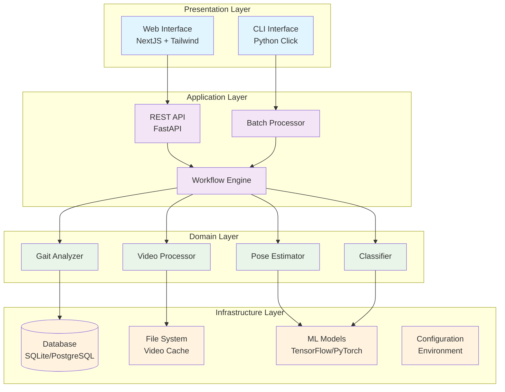
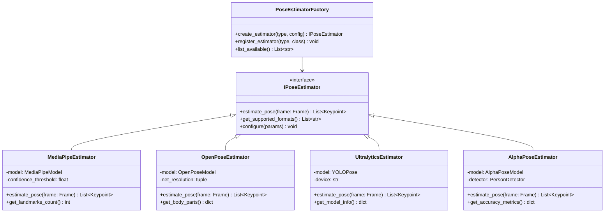
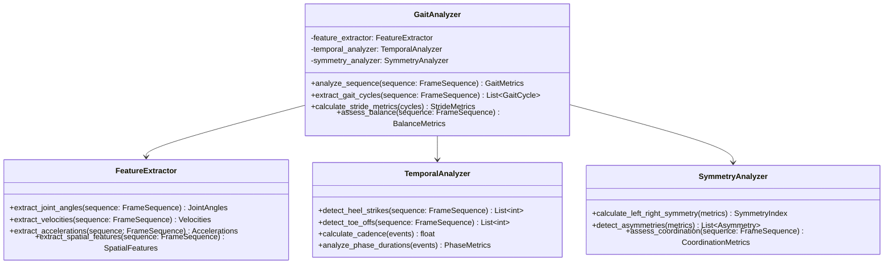
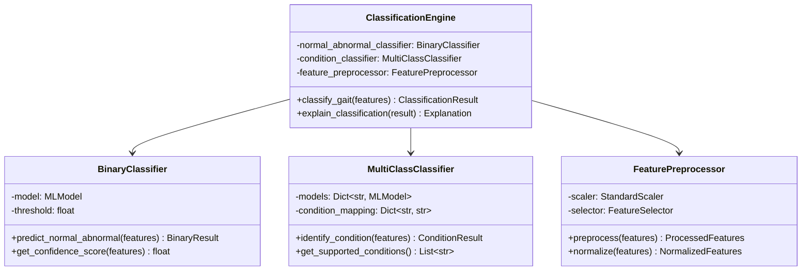
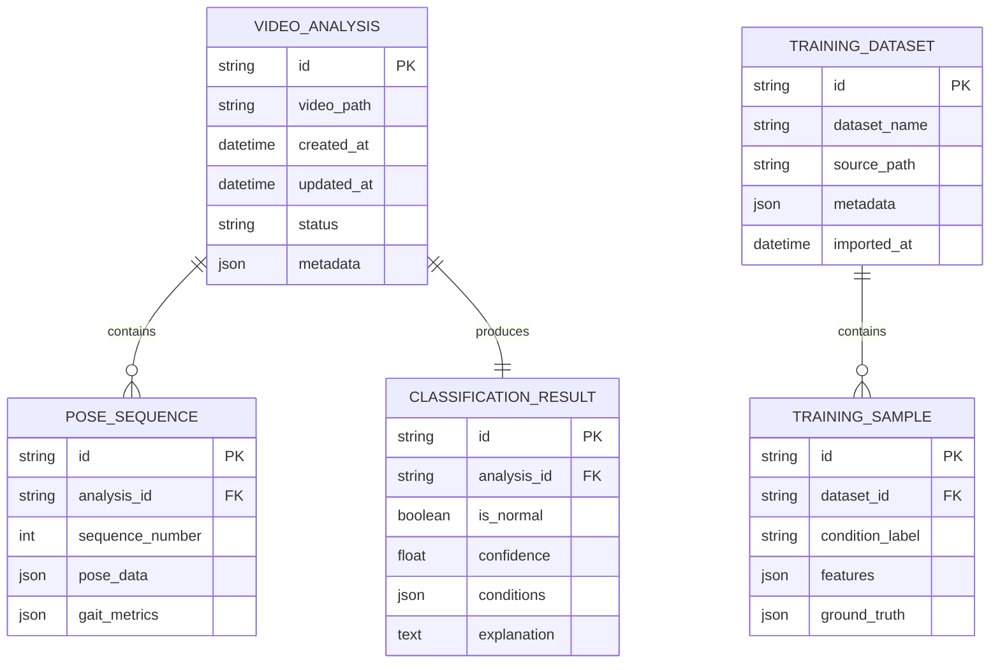
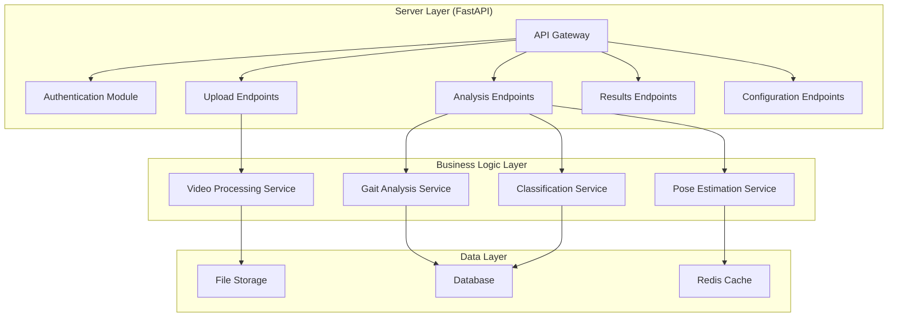

# Design Document

## Overview

The AlexPose Gait Analysis System is designed as a modular, extensible platform that processes any gait video to identify normal vs abnormal patterns and classify specific health conditions. The system follows SOLID principles with a clean architecture that separates concerns between data processing, pose estimation, gait analysis, and user interfaces.

The architecture supports both training workflows (using GAVD and other datasets) and inference workflows (processing user-provided videos). The system is built with Python for the core backend, NextJS for the web frontend, and comprehensive CLI tools for automation and batch processing.

## Architecture

The system follows a layered architecture with clear separation of concerns:



## Components and Interfaces

### Core Interfaces

The system defines several key interfaces to ensure modularity and testability:

```python
from abc import ABC, abstractmethod
from typing import List, Optional, Dict, Any
from .frame import Frame, FrameSequence

# Core domain interfaces
class IPoseEstimator(ABC):
    @abstractmethod
    def estimate_pose(self, frame: Frame) -> List[Keypoint]: 
        """Estimate pose from a Frame object."""
        pass
    
    @abstractmethod
    def get_supported_formats(self) -> List[str]: 
        """Get list of supported video/image formats."""
        pass

class IGaitAnalyzer(ABC):
    @abstractmethod
    def analyze_sequence(self, sequence: FrameSequence) -> GaitMetrics: 
        """Analyze a sequence of frames for gait patterns."""
        pass
    
    @abstractmethod
    def detect_abnormalities(self, metrics: GaitMetrics) -> AbnormalityReport: 
        """Detect abnormalities from gait metrics."""
        pass

class IClassifier(ABC):
    @abstractmethod
    def classify_normal_abnormal(self, features: GaitFeatures) -> ClassificationResult: 
        """Classify gait as normal or abnormal."""
        pass
    
    @abstractmethod
    def identify_condition(self, features: GaitFeatures) -> ConditionResult: 
        """Identify specific condition for abnormal gait."""
        pass

class IVideoProcessor(ABC):
    @abstractmethod
    def extract_frames(self, video_path: Path, frame_rate: float) -> FrameSequence: 
        """Extract frames from video as a FrameSequence."""
        pass
    
    @abstractmethod
    def preprocess_frame(self, frame: Frame) -> Frame: 
        """Preprocess a Frame object and return processed Frame."""
        pass
```

### Pose Estimation Component

The pose estimation component supports multiple frameworks through a plugin architecture:



### Gait Analysis Component

The gait analysis component processes frame sequences to extract meaningful gait metrics:



### Classification Component

The classification system implements a two-stage approach: normal vs abnormal classification followed by condition identification:



## Data Models

### Core Data Structures

```python
from dataclasses import dataclass
from typing import Union, Optional, Dict, Any, List
import numpy as np
from pathlib import Path

@dataclass
class Keypoint:
    x: float
    y: float
    confidence: float
    visibility: float
    name: str

@dataclass
class Frame:
    """
    Flexible frame representation supporting multiple data sources and formats.
    """
    # Core identification
    frame_id: str
    sequence_id: Optional[str] = None
    frame_number: Optional[int] = None
    timestamp: Optional[float] = None
    
    # Data source (one of these will be populated)
    data: Optional[np.ndarray] = None  # RGB numpy array when loaded
    file_path: Optional[Path] = None   # Path to image file
    video_path: Optional[Path] = None  # Path to source video
    url: Optional[str] = None          # URL to remote resource
    
    # Metadata
    width: Optional[int] = None
    height: Optional[int] = None
    channels: Optional[int] = None
    format: str = 'RGB'  # RGB, BGR, RGBA, etc.
    
    # Processing metadata
    bounding_box: Optional[Dict[str, float]] = None
    pose_landmarks: Optional[List[Keypoint]] = None
    processing_metadata: Dict[str, Any] = None
    
    def load(self) -> np.ndarray:
        """Load frame data into memory from the appropriate source."""
        pass
    
    def unload(self):
        """Free frame data from memory to save resources."""
        pass
    
    def to_rgb_array(self) -> np.ndarray:
        """Get frame as RGB numpy array, loading if necessary."""
        pass

@dataclass
class FrameSequence:
    """Collection of frames representing a temporal sequence."""
    sequence_id: str
    frames: List[Frame]
    metadata: Dict[str, Any] = None
    
    @property
    def length(self) -> int:
        return len(self.frames)
    
    @property
    def duration(self) -> Optional[float]:
        """Get sequence duration in seconds."""
        pass
    
    def load_all(self):
        """Load all frames in sequence."""
        pass
    
    def unload_all(self):
        """Unload all frames to free memory."""
        pass

@dataclass
class GaitMetrics:
    stride_length: float
    stride_time: float
    cadence: float
    step_width: float
    joint_angles: Dict[str, List[float]]
    symmetry_index: float
    balance_metrics: 'BalanceMetrics'
    temporal_metrics: 'TemporalMetrics'

@dataclass
class BalanceMetrics:
    center_of_mass_displacement: float
    postural_sway: float
    stability_index: float

@dataclass
class TemporalMetrics:
    stance_phase_duration: float
    swing_phase_duration: float
    double_support_time: float
    gait_cycle_time: float

@dataclass
class ClassificationResult:
    is_normal: bool
    confidence: float
    identified_conditions: List['ConditionPrediction']
    explanation: str
    feature_importance: Dict[str, float]

@dataclass
class ConditionPrediction:
    condition_name: str
    confidence: float
    severity: str
    supporting_evidence: List[str]

@dataclass
class GaitFeatures:
    """Extracted features from gait analysis."""
    temporal_features: Dict[str, float]
    spatial_features: Dict[str, float]
    kinematic_features: Dict[str, List[float]]
    symmetry_features: Dict[str, float]
    frequency_features: Dict[str, float]

@dataclass
class VideoMetadata:
    """Metadata for video files."""
    file_path: Path
    duration: float
    frame_rate: float
    width: int
    height: int
    format: str
    file_size: int

@dataclass
class ProcessingMetadata:
    """Metadata for processing operations."""
    processing_time: float
    algorithm_version: str
    parameters: Dict[str, Any]
    quality_metrics: Dict[str, float]
```

### Database Schema



### Server Architecture

Based on user feedback, the system includes a dedicated `server` folder containing a FastAPI application with modular, extensible endpoint management:



### Frame Representation

Based on user feedback, the system uses a flexible frame data model that is more generalizable than just numpy arrays:

```python
from dataclasses import dataclass
from typing import Union, Optional, Dict, Any
import numpy as np
from pathlib import Path

@dataclass
class Frame:
    """
    Flexible frame representation supporting multiple data sources and formats.
    
    This design allows frames to be loaded from various sources (files, arrays, URLs)
    and converted between different formats as needed, providing better extensibility
    and memory management.
    """
    # Core identification
    frame_id: str
    sequence_id: Optional[str] = None
    frame_number: Optional[int] = None
    timestamp: Optional[float] = None
    
    # Data source (one of these will be populated)
    data: Optional[np.ndarray] = None  # RGB numpy array when loaded
    file_path: Optional[Path] = None   # Path to image file
    video_path: Optional[Path] = None  # Path to source video
    url: Optional[str] = None          # URL to remote resource
    
    # Metadata
    width: Optional[int] = None
    height: Optional[int] = None
    channels: Optional[int] = None
    format: str = 'RGB'  # RGB, BGR, RGBA, etc.
    
    # Processing metadata
    bounding_box: Optional[Dict[str, float]] = None
    pose_landmarks: Optional[List[Dict]] = None
    processing_metadata: Dict[str, Any] = None
    
    def __post_init__(self):
        if self.processing_metadata is None:
            self.processing_metadata = {}
    
    @property
    def is_loaded(self) -> bool:
        """Check if frame data is currently loaded in memory."""
        return self.data is not None
    
    @property
    def shape(self) -> Optional[tuple]:
        """Get frame dimensions."""
        if self.is_loaded:
            return self.data.shape
        elif self.width and self.height:
            channels = self.channels or 3
            return (self.height, self.width, channels)
        return None
    
    def load(self) -> np.ndarray:
        """
        Load frame data into memory from the appropriate source.
        Returns RGB numpy array.
        """
        if self.is_loaded:
            return self.data
        
        if self.file_path and self.file_path.exists():
            import cv2
            frame = cv2.imread(str(self.file_path))
            self.data = cv2.cvtColor(frame, cv2.COLOR_BGR2RGB)
        elif self.video_path and self.frame_number is not None:
            self.data = self._extract_from_video()
        elif self.url:
            self.data = self._download_and_load()
        else:
            raise ValueError("No valid data source available for frame loading")
        
        # Update metadata
        if self.data is not None:
            self.height, self.width, self.channels = self.data.shape
        
        return self.data
    
    def unload(self):
        """Free frame data from memory to save resources."""
        self.data = None
    
    def to_rgb_array(self) -> np.ndarray:
        """Get frame as RGB numpy array, loading if necessary."""
        return self.load()
    
    def to_bgr_array(self) -> np.ndarray:
        """Get frame as BGR numpy array for OpenCV operations."""
        rgb_data = self.load()
        import cv2
        return cv2.cvtColor(rgb_data, cv2.COLOR_RGB2BGR)
    
    def save(self, path: Path, format: str = 'jpg'):
        """Save frame to file."""
        if not self.is_loaded:
            self.load()
        
        import cv2
        bgr_data = self.to_bgr_array()
        cv2.imwrite(str(path), bgr_data)
    
    def _extract_from_video(self) -> np.ndarray:
        """Extract frame from video file using FFmpeg."""
        # Implementation would use existing video extraction logic
        pass
    
    def _download_and_load(self) -> np.ndarray:
        """Download and load frame from URL."""
        # Implementation would handle URL downloading
        pass

# Frame collection for sequences
@dataclass
class FrameSequence:
    """Collection of frames representing a temporal sequence."""
    sequence_id: str
    frames: List[Frame]
    metadata: Dict[str, Any] = None
    
    def __post_init__(self):
        if self.metadata is None:
            self.metadata = {}
    
    @property
    def length(self) -> int:
        return len(self.frames)
    
    @property
    def duration(self) -> Optional[float]:
        """Get sequence duration in seconds."""
        if len(self.frames) < 2:
            return None
        
        timestamps = [f.timestamp for f in self.frames if f.timestamp is not None]
        if len(timestamps) < 2:
            return None
        
        return max(timestamps) - min(timestamps)
    
    def load_all(self):
        """Load all frames in sequence."""
        for frame in self.frames:
            frame.load()
    
    def unload_all(self):
        """Unload all frames to free memory."""
        for frame in self.frames:
            frame.unload()
    
    def get_frame_by_number(self, frame_number: int) -> Optional[Frame]:
        """Get frame by frame number."""
        for frame in self.frames:
            if frame.frame_number == frame_number:
                return frame
        return None
```

This flexible frame representation provides:

1. **Lazy Loading**: Frames can exist without data loaded in memory
2. **Multiple Sources**: Support for files, videos, URLs, and direct arrays
3. **Format Flexibility**: Easy conversion between RGB, BGR, and other formats
4. **Memory Management**: Explicit load/unload for large sequences
5. **Rich Metadata**: Comprehensive metadata support for processing pipelines
6. **Extensibility**: Easy to add new data sources and formats

Usage examples:
```python
# Create frame from video
frame = Frame(
    frame_id="seq1_frame_100",
    sequence_id="seq1",
    frame_number=100,
    video_path=Path("video.mp4"),
    bounding_box={"left": 100, "top": 50, "width": 200, "height": 300}
)

# Load when needed
rgb_array = frame.load()  # Returns np.ndarray in RGB format

# Use with MediaPipe
mp_image = mp.Image(image_format=mp.ImageFormat.SRGB, data=frame.to_rgb_array())

# Use with OpenCV
bgr_array = frame.to_bgr_array()

# Free memory when done
frame.unload()
```

### Configuration Management

The system supports comprehensive configuration management using YAML files stored in the top-level `config` folder:

```python
from dataclasses import dataclass, field
from pathlib import Path
from typing import Dict, List, Any
import yaml

@dataclass
class AlexPoseConfig:
    # Video Processing
    supported_formats: List[str] = field(default_factory=lambda: ['mp4', 'avi', 'mov', 'webm'])
    default_frame_rate: float = 30.0
    max_video_size_mb: int = 500
    
    # Pose Estimation
    pose_estimators: Dict[str, Dict] = field(default_factory=dict)
    default_estimator: str = 'mediapipe'
    confidence_threshold: float = 0.5
    
    # Gait Analysis
    min_sequence_length: int = 10
    gait_cycle_detection_method: str = 'heel_strike'
    feature_extraction_params: Dict = field(default_factory=dict)
    
    # Classification
    normal_abnormal_threshold: float = 0.7
    condition_confidence_threshold: float = 0.6
    llm_integration_enabled: bool = False
    
    # Storage
    data_directory: Path = Path('data')
    logs_directory: Path = Path('logs')
    config_directory: Path = Path('config')
    cache_enabled: bool = True
    backup_enabled: bool = True
    
    # API Configuration
    api_host: str = '0.0.0.0'
    api_port: int = 8000
    cors_origins: List[str] = field(default_factory=list)
    
    # Security
    jwt_secret_key: str = ''
    encryption_enabled: bool = True
    rate_limiting_enabled: bool = True
    
    @classmethod
    def load_from_yaml(cls, config_path: Path = None) -> 'AlexPoseConfig':
        """Load configuration from YAML file."""
        if config_path is None:
            config_path = Path('config') / 'alexpose.yaml'
        
        if not config_path.exists():
            # Create default config if it doesn't exist
            config = cls()
            config.save_to_yaml(config_path)
            return config
        
        with open(config_path, 'r') as f:
            config_data = yaml.safe_load(f)
        
        return cls(**config_data)
    
    def save_to_yaml(self, config_path: Path = None):
        """Save configuration to YAML file."""
        if config_path is None:
            config_path = Path('config') / 'alexpose.yaml'
        
        config_path.parent.mkdir(exist_ok=True)
        
        with open(config_path, 'w') as f:
            yaml.dump(self.__dict__, f, default_flow_style=False, indent=2)

class ConfigurationManager:
    """Manages configuration loading and validation."""
    
    def __init__(self, config_dir: Path = None):
        self.config_dir = config_dir or Path('config')
        self.config_dir.mkdir(exist_ok=True)
        self.config = AlexPoseConfig.load_from_yaml()
    
    def load_environment_config(self, environment: str = 'development'):
        """Load environment-specific configuration."""
        env_config_path = self.config_dir / f'{environment}.yaml'
        
        if env_config_path.exists():
            with open(env_config_path, 'r') as f:
                env_config = yaml.safe_load(f)
            
            # Merge environment config with base config
            for key, value in env_config.items():
                if hasattr(self.config, key):
                    setattr(self.config, key, value)
    
    def validate_configuration(self) -> bool:
        """Validate all configuration settings."""
        errors = []
        
        # Validate required directories
        required_dirs = [
            self.config.data_directory,
            self.config.logs_directory,
            self.config.config_directory
        ]
        
        for dir_path in required_dirs:
            if not dir_path.exists():
                try:
                    dir_path.mkdir(parents=True, exist_ok=True)
                except Exception as e:
                    errors.append(f"Cannot create directory {dir_path}: {e}")
        
        # Validate pose estimator configuration
        if self.config.default_estimator not in self.config.pose_estimators:
            errors.append(f"Default estimator '{self.config.default_estimator}' not configured")
        
        # Validate thresholds
        if not 0 <= self.config.confidence_threshold <= 1:
            errors.append("Confidence threshold must be between 0 and 1")
        
        if not 0 <= self.config.normal_abnormal_threshold <= 1:
            errors.append("Normal/abnormal threshold must be between 0 and 1")
        
        if errors:
            from loguru import logger
            for error in errors:
                logger.error(f"Configuration validation error: {error}")
            return False
        
        return True
```

Example configuration files:

**config/alexpose.yaml** (main configuration):
```yaml
# Video Processing Configuration
supported_formats:
  - mp4
  - avi
  - mov
  - webm
default_frame_rate: 30.0
max_video_size_mb: 500

# Pose Estimation Configuration
pose_estimators:
  mediapipe:
    model_complexity: 1
    min_detection_confidence: 0.5
    min_tracking_confidence: 0.5
  openpose:
    model_folder: "models/openpose"
    net_resolution: "368x368"
  ultralytics:
    model_name: "yolov8n-pose.pt"
    device: "auto"
  alphapose:
    model_name: "halpe26"
    detector: "yolo"

default_estimator: "mediapipe"
confidence_threshold: 0.5

# Gait Analysis Configuration
min_sequence_length: 10
gait_cycle_detection_method: "heel_strike"
feature_extraction_params:
  window_size: 30
  overlap: 0.5
  normalize_features: true

# Classification Configuration
normal_abnormal_threshold: 0.7
condition_confidence_threshold: 0.6
llm_integration_enabled: false

# Storage Configuration
data_directory: "data"
logs_directory: "logs"
config_directory: "config"
cache_enabled: true
backup_enabled: true

# API Configuration
api_host: "0.0.0.0"
api_port: 8000
cors_origins:
  - "http://localhost:3000"
  - "http://localhost:8080"

# Security Configuration
jwt_secret_key: ""  # Set via environment variable
encryption_enabled: true
rate_limiting_enabled: true
```

**config/development.yaml** (development overrides):
```yaml
# Development-specific settings
api_host: "127.0.0.1"
cors_origins:
  - "http://localhost:3000"
  - "http://localhost:8080"
  - "http://localhost:5173"

# Enable debug logging
logs_directory: "logs/dev"

# Disable security features for development
encryption_enabled: false
rate_limiting_enabled: false

# Use faster, less accurate models for development
pose_estimators:
  mediapipe:
    model_complexity: 0
    min_detection_confidence: 0.3
```

**config/production.yaml** (production overrides):
```yaml
# Production-specific settings
api_host: "0.0.0.0"
api_port: 80

# Enhanced security
encryption_enabled: true
rate_limiting_enabled: true

# Production logging
logs_directory: "/tmp/log/alexpose"

# High-accuracy models for production
pose_estimators:
  mediapipe:
    model_complexity: 2
    min_detection_confidence: 0.7
    min_tracking_confidence: 0.7

# Stricter thresholds
normal_abnormal_threshold: 0.8
condition_confidence_threshold: 0.7
```

## Correctness Properties

*A property is a characteristic or behavior that should hold true across all valid executions of a system—essentially, a formal statement about what the system should do. Properties serve as the bridge between human-readable specifications and machine-verifiable correctness guarantees.*

Based on the prework analysis and property reflection, the following consolidated properties validate the system's correctness:

### Property 1: Video Format Validation
*For any* file with a video extension, the system should accept valid formats (MP4, AVI, MOV, WebM) and reject invalid formats, providing appropriate error messages
**Validates: Requirements 1.1, 6.2**

### Property 2: Frame Extraction Precision
*For any* video and frame rate configuration, the number of extracted frames should match the expected count based on video duration and frame rate, with precise frame indexing
**Validates: Requirements 1.2, 1.3**

### Property 3: GAVD Data Processing Consistency
*For any* valid GAVD CSV file, the system should correctly parse CSV data, handle bounding box scaling, and organize sequences by temporal order
**Validates: Requirements 1.4, 1.5, 14.1**

### Property 4: Pose Estimator Framework Compliance
*For any* selected pose estimation framework (MediaPipe, OpenPose, Ultralytics, AlphaPose), the system should return the correct number of keypoints in the expected format with confidence scores
**Validates: Requirements 2.1, 2.2, 2.3, 2.4**

### Property 5: Plugin Architecture Extensibility
*For any* valid plugin implementation (pose estimators, analysis algorithms, third-party services), the system should successfully register and utilize the plugin through standardized interfaces
**Validates: Requirements 2.5, 15.1, 15.2, 15.3**

### Property 6: Gait Analysis Feature Extraction
*For any* valid pose sequence, the gait analyzer should extract temporal movement features, identify stride patterns, calculate standard metrics (step length, cadence, symmetry), and detect abnormal patterns
**Validates: Requirements 3.1, 3.2, 3.3, 3.4, 3.5**

### Property 7: Two-Stage Classification Completeness
*For any* valid gait feature set, the classification engine should first classify as normal or abnormal, then identify specific conditions for abnormal cases, providing confidence scores and explanations
**Validates: Requirements 4.1, 4.2, 4.3, 4.4, 4.5**

### Property 8: CLI Interface Functionality
*For any* valid CLI command, the system should provide help documentation, support batch processing with progress reporting, and handle multiple output formats (JSON, CSV, XML)
**Validates: Requirements 5.1, 5.2, 5.4**

### Property 9: Configuration Management Robustness
*For any* valid configuration file or environment variable set, the system should load settings correctly, validate required parameters, support environment-specific configurations, and handle dependency injection
**Validates: Requirements 5.3, 7.1, 7.2, 7.3, 7.4, 7.5**

### Property 10: Web Interface Upload and Display
*For any* valid gait video upload, the web interface should show progress, validate the file, perform analysis, and display results with normal/abnormal classification and condition identification
**Validates: Requirements 6.2, 6.3, 6.4**

### Property 11: Data Management Integrity
*For any* analysis result or intermediate processing data, the system should store data in structured formats, implement caching for efficiency, provide fast retrieval, support multiple export formats, and maintain data integrity with backup mechanisms
**Validates: Requirements 8.1, 8.2, 8.3, 8.4, 8.5**

### Property 12: Comprehensive Error Handling
*For any* error condition or exception, the system should provide detailed error messages with context, handle exceptions gracefully without crashes, support error reporting integration, and provide debugging information
**Validates: Requirements 9.1, 9.3, 9.4, 9.5**

### Structured Logging Consistency
*For any* system operation or error condition, the logging system should use loguru with structured logging, save logs to the top-level `logs` folder, provide verbose output when requested, and maintain consistent log formatting
**Validates: Requirements 5.5, 9.2**

### Property 14: Testing Framework Completeness
*For any* system component or workflow, the testing framework should execute unit tests, property-based tests, and integration tests, achieve minimum code coverage thresholds, and include performance benchmarks
**Validates: Requirements 10.1, 10.2, 10.3, 10.4, 10.5**

### Property 15: Documentation Completeness
*For any* system component, API endpoint, or workflow, the system should provide detailed documentation with examples, step-by-step guides, system diagrams, installation guides, and troubleshooting information
**Validates: Requirements 11.1, 11.2, 11.3, 11.4, 11.5**

### Property 16: Performance and Scalability
*For any* workload size or system configuration, the system should handle large files efficiently, manage concurrent operations appropriately, optimize batch processing throughput, support horizontal scaling, and provide performance monitoring
**Validates: Requirements 12.1, 12.2, 12.3, 12.4, 12.5**

### Property 17: Security Implementation
*For any* sensitive data or user interaction, the system should implement appropriate encryption and access controls, support secure authentication, use secure transmission protocols, and provide data anonymization features
**Validates: Requirements 13.1, 13.2, 13.3, 13.4**

### Property 18: Training Data Management
*For any* training dataset (GAVD or additional sources), the training data manager should organize data by conditions, support multiple data sources, provide balanced datasets, implement data augmentation, and maintain versioning with provenance tracking
**Validates: Requirements 14.2, 14.3, 14.4, 14.5**

## Error Handling

The system implements comprehensive error handling across all layers with specific strategies for different types of failures:

### Video Processing Errors
- **Invalid Format**: Clear error messages for unsupported video formats with suggestions for conversion
- **Corrupted Files**: Graceful handling of damaged video files with recovery suggestions and partial processing capabilities
- **Frame Extraction Failures**: Fallback mechanisms using alternative extraction methods and detailed error reporting
- **Large File Handling**: Memory management strategies and streaming processing for oversized videos

### Pose Estimation Errors
- **Model Loading Failures**: Automatic fallback to alternative pose estimators with user notification
- **Detection Failures**: Confidence-based filtering and interpolation for missing keypoints
- **Plugin Errors**: Isolation of plugin failures to prevent system crashes with graceful degradation
- **Resource Exhaustion**: Memory and GPU resource management with queue-based processing

### Classification Errors
- **Model Unavailability**: Graceful degradation with basic pattern analysis and user notification
- **Feature Extraction Failures**: Robust feature computation with missing data handling and imputation
- **Confidence Thresholds**: Clear uncertainty reporting for low-confidence predictions
- **LLM Integration Failures**: Fallback to traditional ML models when LLM services are unavailable

### System-Level Error Handling
```python
from loguru import logger
import sys
from pathlib import Path

# Configure loguru to save logs to top-level logs folder
logs_dir = Path("logs")
logs_dir.mkdir(exist_ok=True)

logger.remove()  # Remove default handler
logger.add(
    sys.stderr,
    format="<green>{time:YYYY-MM-DD HH:mm:ss}</green> | <level>{level: <8}</level> | <cyan>{name}</cyan>:<cyan>{function}</cyan>:<cyan>{line}</cyan> - <level>{message}</level>",
    level="INFO"
)
logger.add(
    logs_dir / "alexpose_{time:YYYY-MM-DD}.log",
    format="{time:YYYY-MM-DD HH:mm:ss} | {level: <8} | {name}:{function}:{line} - {message}",
    level="DEBUG",
    rotation="1 day",
    retention="30 days",
    compression="zip"
)

class AlexPoseException(Exception):
    """Base exception for AlexPose system"""
    def __init__(self, message: str, error_code: str, context: Dict[str, Any] = None):
        self.message = message
        self.error_code = error_code
        self.context = context or {}
        logger.error(f"AlexPose Error [{error_code}]: {message}", extra={"context": self.context})
        super().__init__(self.message)

class VideoProcessingError(AlexPoseException):
    """Errors related to video processing"""
    pass

class PoseEstimationError(AlexPoseException):
    """Errors related to pose estimation"""
    pass

class GaitAnalysisError(AlexPoseException):
    """Errors related to gait analysis"""
    pass

class ClassificationError(AlexPoseException):
    """Errors related to gait classification"""
    pass

class ConfigurationError(AlexPoseException):
    """Errors related to system configuration"""
    pass
```

### Error Recovery Strategies
- **Retry Mechanisms**: Exponential backoff for transient failures
- **Circuit Breakers**: Prevent cascade failures in distributed components
- **Graceful Degradation**: Maintain core functionality when non-critical components fail
- **User Feedback**: Clear, actionable error messages with suggested remediation steps

## Testing Strategy

The system employs a comprehensive testing approach combining unit tests, property-based tests, and integration tests to ensure reliability and correctness:

### Unit Testing
- **Component Isolation**: Each component tested independently with mocked dependencies
- **Edge Case Coverage**: Specific tests for boundary conditions and error scenarios
- **Mock Strategies**: Comprehensive mocking of external dependencies (ML models, file systems, APIs)
- **Test Data Management**: Curated test datasets for consistent and reproducible testing

### Property-Based Testing
- **Framework**: Hypothesis for Python, fast-check for TypeScript frontend components
- **Test Configuration**: Minimum 100 iterations per property test to ensure statistical significance
- **Property Implementation**: Each correctness property implemented as a separate test suite
- **Test Tagging**: Format: **Feature: gavd-gait-analysis, Property {number}: {property_text}**

Example property test structure:
```python
from hypothesis import given, strategies as st
import pytest

@given(
    video_format=st.sampled_from(['mp4', 'avi', 'mov', 'webm', 'txt', 'jpg', 'pdf']),
    file_size=st.integers(min_value=1, max_value=1000000)
)
def test_video_format_validation_property(video_format, file_size):
    """
    Feature: gavd-gait-analysis, Property 1: Video Format Validation
    For any file with a video extension, the system should accept valid formats
    """
    valid_formats = {'mp4', 'avi', 'mov', 'webm'}
    result = video_processor.validate_format(f"test.{video_format}")
    
    if video_format in valid_formats:
        assert result.is_valid == True
        assert result.error_message is None
    else:
        assert result.is_valid == False
        assert result.error_message is not None
        assert "unsupported format" in result.error_message.lower()

@given(
    pose_sequence=st.lists(
        st.dictionaries(
            keys=st.sampled_from(['x', 'y', 'confidence']),
            values=st.floats(min_value=0.0, max_value=1.0)
        ),
        min_size=10,
        max_size=100
    )
)
def test_gait_analysis_feature_extraction_property(pose_sequence):
    """
    Feature: gavd-gait-analysis, Property 6: Gait Analysis Feature Extraction
    For any valid pose sequence, the gait analyzer should extract temporal features
    """
    gait_analyzer = GaitAnalyzer()
    features = gait_analyzer.extract_features(pose_sequence)
    
    assert features is not None
    assert 'temporal_features' in features
    assert 'stride_patterns' in features
    assert 'gait_metrics' in features
    assert features['gait_metrics']['step_length'] >= 0
    assert features['gait_metrics']['cadence'] >= 0
    assert 0 <= features['gait_metrics']['symmetry'] <= 1
```

### Integration Testing
- **End-to-End Workflows**: Complete video processing pipelines from upload to classification
- **API Testing**: REST API endpoints with various input scenarios and error conditions
- **Database Integration**: Data persistence and retrieval validation with transaction testing
- **Performance Testing**: Load testing and resource usage monitoring under various conditions
- **Cross-Platform Testing**: Validation across different operating systems and environments

### Test Data Management
- **Synthetic Data Generation**: Programmatically generated test videos and pose sequences for consistent testing
- **GAVD Test Subset**: Curated subset of GAVD data for consistent integration testing
- **Mock Model Responses**: Predictable ML model outputs for deterministic testing scenarios
- **Test Environment Isolation**: Separate test databases and file systems to prevent interference

### Continuous Integration
- **Automated Testing**: All tests run automatically on code changes
- **Coverage Reporting**: Minimum 80% code coverage requirement with detailed reporting
- **Performance Benchmarks**: Automated performance regression detection
- **Security Scanning**: Automated vulnerability scanning and dependency checking

Now I need to use the prework tool to analyze the acceptance criteria before writing the correctness properties:

<function_calls>
<invoke name="prework">
<parameter name="featureName">gavd-gait-analysis

## Correctness Properties

*A property is a characteristic or behavior that should hold true across all valid executions of a system—essentially, a formal statement about what the system should do. Properties serve as the bridge between human-readable specifications and machine-verifiable correctness guarantees.*

Based on the prework analysis, the following properties have been identified to validate the system's correctness across different input scenarios:

### Property 1: Video Format Validation
*For any* file with a video extension, the system should accept valid formats (MP4, AVI, MOV, WebM) and reject invalid formats
**Validates: Requirements 1.1**

### Property 2: Frame Extraction Consistency
*For any* video and frame rate configuration, the number of extracted frames should match the expected count based on video duration and frame rate
**Validates: Requirements 1.2**

### Property 3: Precise Frame Indexing
*For any* video and frame index N, extracting frame N should return exactly the frame at position N in the video sequence
**Validates: Requirements 1.3**

### Property 4: Bounding Box Scaling Accuracy
*For any* bounding box coordinates and resolution scaling factors, the scaled coordinates should maintain proportional relationships to the original coordinates
**Validates: Requirements 1.4**

### Property 5: Temporal Sequence Organization
*For any* set of video frames with timestamps, the organized sequence should maintain chronological ordering
**Validates: Requirements 1.5**

### Property 6: MediaPipe Landmark Count Consistency
*For any* valid input frame processed by MediaPipe, exactly 33 pose landmarks should be returned with confidence scores between 0 and 1
**Validates: Requirements 2.1**

### Property 7: OpenPose Keypoint Format Compliance
*For any* valid input frame processed by OpenPose, exactly 25 body keypoints should be returned in COCO format
**Validates: Requirements 2.2**

### Property 8: Pose Estimator Plugin Registration
*For any* new pose estimator plugin that implements the IPoseEstimator interface, it should be successfully registerable and usable through the factory
**Validates: Requirements 2.5**

### Property 9: Binary Classification Completeness
*For any* valid gait feature set, the classification engine should return either "normal" or "abnormal" classification with a confidence score
**Validates: Requirements 4.1**

### Property 10: Condition Identification for Abnormal Cases
*For any* gait pattern classified as abnormal, the system should provide at least one condition identification with supporting evidence
**Validates: Requirements 4.2**

### Property 11: Classification Result Completeness
*For any* classification request, the result should include confidence scores, explanations, and feature importance rankings
**Validates: Requirements 4.3**

### Property 12: Training Data Organization by Condition
*For any* GAVD dataset with condition labels, sequences should be correctly grouped by their associated health conditions
**Validates: Requirements 14.1**

### Property 13: Dataset Balance Verification
*For any* training dataset preparation, the normal/abnormal class distribution should be within acceptable balance thresholds
**Validates: Requirements 14.3**

### Property 14: Data Augmentation Preservation
*For any* original gait sequence that undergoes augmentation, the augmented versions should preserve essential gait characteristics while introducing controlled variations
**Validates: Requirements 14.4**

## Error Handling

The system implements comprehensive error handling across all layers:

### Video Processing Errors
- **Invalid Format**: Clear error messages for unsupported video formats
- **Corrupted Files**: Graceful handling of damaged video files with recovery suggestions
- **Frame Extraction Failures**: Fallback mechanisms and detailed error reporting

### Pose Estimation Errors
- **Model Loading Failures**: Automatic fallback to alternative pose estimators
- **Detection Failures**: Confidence-based filtering and interpolation for missing keypoints
- **Plugin Errors**: Isolation of plugin failures to prevent system crashes

### Classification Errors
- **Model Unavailability**: Graceful degradation with basic pattern analysis
- **Feature Extraction Failures**: Robust feature computation with missing data handling
- **Confidence Thresholds**: Clear uncertainty reporting for low-confidence predictions

### System-Level Error Handling
```python
class AlexPoseException(Exception):
    """Base exception for AlexPose system"""
    def __init__(self, message: str, error_code: str, context: Dict[str, Any] = None):
        self.message = message
        self.error_code = error_code
        self.context = context or {}
        super().__init__(self.message)

class VideoProcessingError(AlexPoseException):
    """Errors related to video processing"""
    pass

class PoseEstimationError(AlexPoseException):
    """Errors related to pose estimation"""
    pass

class ClassificationError(AlexPoseException):
    """Errors related to gait classification"""
    pass
```

## Testing Strategy

The system employs a comprehensive testing approach combining unit tests, property-based tests, and integration tests:

### Unit Testing
- **Component Isolation**: Each component tested independently with mocked dependencies
- **Edge Case Coverage**: Specific tests for boundary conditions and error scenarios
- **Mock Strategies**: Comprehensive mocking of external dependencies (ML models, file systems)

### Property-Based Testing
- **Framework**: Hypothesis for Python, fast-check for TypeScript frontend
- **Test Configuration**: Minimum 100 iterations per property test
- **Property Implementation**: Each correctness property implemented as a separate test
- **Test Tagging**: Format: **Feature: gavd-gait-analysis, Property {number}: {property_text}**

Example property test structure:
```python
from hypothesis import given, strategies as st
import pytest

@given(
    video_format=st.sampled_from(['mp4', 'avi', 'mov', 'webm', 'txt', 'jpg', 'pdf']),
    file_size=st.integers(min_value=1, max_value=1000000)
)
def test_video_format_validation_property(video_format, file_size):
    """
    Feature: gavd-gait-analysis, Property 1: Video Format Validation
    For any file with a video extension, the system should accept valid formats
    """
    valid_formats = {'mp4', 'avi', 'mov', 'webm'}
    result = video_processor.validate_format(f"test.{video_format}")
    
    if video_format in valid_formats:
        assert result.is_valid == True
    else:
        assert result.is_valid == False
        assert result.error_message is not None
```

### Integration Testing
- **End-to-End Workflows**: Complete video processing pipelines
- **API Testing**: REST API endpoints with various input scenarios
- **Database Integration**: Data persistence and retrieval validation
- **Performance Testing**: Load testing and resource usage monitoring

### Test Data Management
- **Synthetic Data Generation**: Programmatically generated test videos and pose sequences
- **GAVD Test Subset**: Curated subset of GAVD data for consistent testing
- **Mock Model Responses**: Predictable ML model outputs for deterministic testing