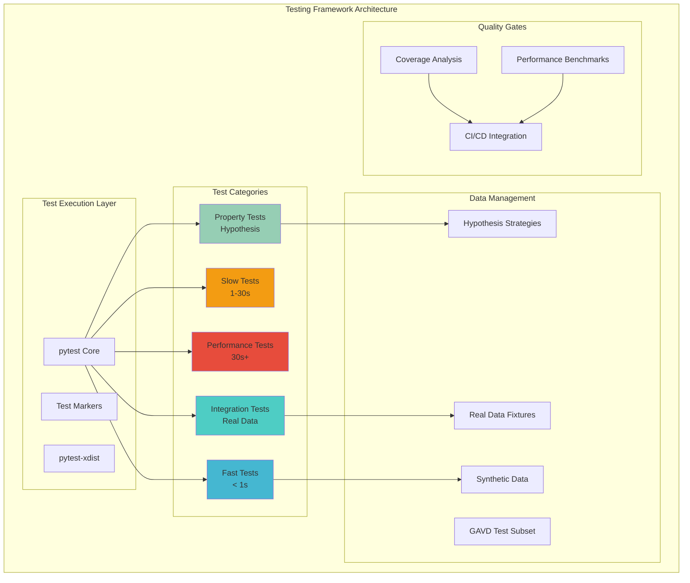

# Testing Enhancement Design Document

## Overview

This document provides the comprehensive design for enhancing the AlexPose Gait Analysis System testing framework. Building on the successful completion of Task 1 (fixing all 17 test failures), this design establishes a world-class testing infrastructure that ensures long-term system reliability, maintainability, and correctness through systematic implementation of property-based testing, integration testing, and performance validation.

## Architecture

### Testing Framework Architecture



### Testing Pyramid Implementation

Following the established testing strategy, our implementation follows this distribution:

- **Property-Based Tests (30%)**: Comprehensive correctness validation across all input variations
- **Unit Tests (50%)**: Focused component testing with real data where possible
- **Integration Tests (15%)**: End-to-end workflow validation with real datasets
- **End-to-End Tests (5%)**: Complete system validation from API to results

## Components and Interfaces

### 1. Property-Based Testing Engine

#### Core Interface
```python
from abc import ABC, abstractmethod
from typing import Any, Dict, List, Optional
from hypothesis import strategies as st

class PropertyTestInterface(ABC):
    """Interface for property-based test implementations."""
    
    @abstractmethod
    def get_strategy(self) -> st.SearchStrategy:
        """Return Hypothesis strategy for test data generation."""
        pass
    
    @abstractmethod
    def validate_property(self, test_data: Any) -> bool:
        """Validate the correctness property."""
        pass
    
    @abstractmethod
    def get_requirement_mapping(self) -> List[str]:
        """Return list of requirements this property validates."""
        pass

class PropertyTestRegistry:
    """Registry for managing all correctness properties."""
    
    def __init__(self):
        self._properties: Dict[str, PropertyTestInterface] = {}
    
    def register_property(self, name: str, property_test: PropertyTestInterface):
        """Register a new property test."""
        self._properties[name] = property_test
    
    def get_all_properties(self) -> Dict[str, PropertyTestInterface]:
        """Get all registered properties."""
        return self._properties.copy()
    
    def validate_coverage(self) -> Dict[str, List[str]]:
        """Validate that all requirements are covered by properties."""
        coverage_map = {}
        for name, prop in self._properties.items():
            coverage_map[name] = prop.get_requirement_mapping()
        return coverage_map
```

#### Property Implementation Examples
```python
class VideoFormatValidationProperty(PropertyTestInterface):
    """Property 1: Video Format Validation"""
    
    def get_strategy(self) -> st.SearchStrategy:
        return st.builds(
            dict,
            file_extension=st.sampled_from(['mp4', 'avi', 'mov', 'webm', 'txt', 'jpg', 'pdf']),
            file_size=st.integers(min_value=1, max_value=1000000)
        )
    
    def validate_property(self, test_data: Dict[str, Any]) -> bool:
        """For any file with a video extension, the system should accept valid formats."""
        from ambient.video.processor import VideoProcessor
        
        processor = VideoProcessor()
        is_valid_format = processor.is_supported_format(test_data['file_extension'])
        
        # Valid video formats should be accepted
        valid_formats = ['mp4', 'avi', 'mov', 'webm']
        expected_valid = test_data['file_extension'] in valid_formats
        
        return is_valid_format == expected_valid
    
    def get_requirement_mapping(self) -> List[str]:
        return ["1.1"]

class FrameExtractionConsistencyProperty(PropertyTestInterface):
    """Property 2: Frame Extraction Consistency"""
    
    def get_strategy(self) -> st.SearchStrategy:
        return st.builds(
            dict,
            video_duration=st.floats(min_value=1.0, max_value=60.0),
            frame_rate=st.floats(min_value=1.0, max_value=60.0)
        )
    
    def validate_property(self, test_data: Dict[str, Any]) -> bool:
        """For any video and frame rate configuration, extracted frames should match expected count."""
        from ambient.core.frame import FrameSequence
        
        # Calculate expected frame count
        expected_frames = int(test_data['video_duration'] * test_data['frame_rate'])
        
        # Create synthetic video data for testing
        synthetic_video = self._create_synthetic_video(
            duration=test_data['video_duration'],
            frame_rate=test_data['frame_rate']
        )
        
        # Extract frames
        frame_sequence = FrameSequence.from_video_data(synthetic_video)
        actual_frames = len(frame_sequence)
        
        # Allow for rounding tolerance (±1 frame)
        return abs(actual_frames - expected_frames) <= 1
    
    def _create_synthetic_video(self, duration: float, frame_rate: float) -> bytes:
        """Create synthetic video data for testing."""
        # Implementation would create minimal video data
        pass
    
    def get_requirement_mapping(self) -> List[str]:
        return ["1.2"]
```

### 2. Test Data Management System

#### Real Data Fixtures
```python
import pytest
from pathlib import Path
from typing import Dict, List, Any
import numpy as np

class RealDataManager:
    """Manages real test data for authentic testing."""
    
    def __init__(self, data_dir: Path = Path("data/test_datasets")):
        self.data_dir = data_dir
        self._ensure_data_directory()
    
    def _ensure_data_directory(self):
        """Ensure test data directory exists."""
        self.data_dir.mkdir(parents=True, exist_ok=True)
    
    def get_sample_videos(self) -> Dict[str, Path]:
        """Get sample video files for testing."""
        return {
            "normal_walking": self.data_dir / "videos" / "normal_walking_sample.mp4",
            "abnormal_gait": self.data_dir / "videos" / "abnormal_gait_sample.mp4",
            "multiple_subjects": self.data_dir / "videos" / "multiple_subjects.mp4",
            "short_clip": self.data_dir / "videos" / "short_clip_5s.mp4",
            "long_clip": self.data_dir / "videos" / "long_clip_60s.mp4"
        }
    
    def get_gavd_test_subset(self) -> Dict[str, Any]:
        """Get curated GAVD dataset subset for consistent testing."""
        gavd_file = self.data_dir / "gavd_test_subset.csv"
        if gavd_file.exists():
            return self._load_gavd_data(gavd_file)
        else:
            return self._create_synthetic_gavd_subset()
    
    def _load_gavd_data(self, file_path: Path) -> Dict[str, Any]:
        """Load real GAVD data from file."""
        import pandas as pd
        df = pd.read_csv(file_path)
        return {
            "normal_samples": df[df['label'] == 'normal'].to_dict('records'),
            "abnormal_samples": df[df['label'] == 'abnormal'].to_dict('records'),
            "metadata": {
                "total_samples": len(df),
                "normal_count": len(df[df['label'] == 'normal']),
                "abnormal_count": len(df[df['label'] == 'abnormal'])
            }
        }
    
    def _create_synthetic_gavd_subset(self) -> Dict[str, Any]:
        """Create synthetic GAVD-like data for testing."""
        # Generate realistic synthetic gait data
        normal_samples = []
        abnormal_samples = []
        
        for i in range(50):  # 50 normal samples
            normal_samples.append({
                'subject_id': f'normal_{i:03d}',
                'stride_time': np.random.normal(1.2, 0.1),
                'cadence': np.random.normal(115, 10),
                'stride_length': np.random.normal(1.4, 0.15),
                'label': 'normal'
            })
        
        for i in range(30):  # 30 abnormal samples
            abnormal_samples.append({
                'subject_id': f'abnormal_{i:03d}',
                'stride_time': np.random.normal(1.6, 0.2),
                'cadence': np.random.normal(85, 15),
                'stride_length': np.random.normal(1.0, 0.2),
                'label': 'abnormal'
            })
        
        return {
            "normal_samples": normal_samples,
            "abnormal_samples": abnormal_samples,
            "metadata": {
                "total_samples": 80,
                "normal_count": 50,
                "abnormal_count": 30,
                "synthetic": True
            }
        }

# Pytest fixtures for real data
@pytest.fixture(scope="session")
def real_data_manager():
    """Provide real data manager for tests."""
    return RealDataManager()

@pytest.fixture(scope="session")
def sample_gait_videos(real_data_manager):
    """Provide real gait video samples for testing."""
    return real_data_manager.get_sample_videos()

@pytest.fixture(scope="session")
def gavd_test_subset(real_data_manager):
    """Provide curated GAVD dataset subset for consistent testing."""
    return real_data_manager.get_gavd_test_subset()

@pytest.fixture
def synthetic_pose_sequence():
    """Generate synthetic but realistic pose sequences."""
    from tests.utils.data_generators import generate_realistic_pose_sequence
    return generate_realistic_pose_sequence(
        duration=5.0,
        frame_rate=30.0,
        gait_pattern="normal"
    )
```

### 3. Integration Testing Framework

#### End-to-End Pipeline Testing
```python
class IntegrationTestFramework:
    """Framework for comprehensive integration testing."""
    
    def __init__(self):
        self.test_artifacts = []
        self.performance_metrics = {}
    
    async def test_complete_video_analysis_pipeline(
        self, 
        video_file: Path,
        expected_classification: str = None
    ) -> Dict[str, Any]:
        """Test complete video analysis workflow."""
        
        # Step 1: Video Upload and Validation
        upload_result = await self._test_video_upload(video_file)
        assert upload_result['success'], f"Video upload failed: {upload_result['error']}"
        
        # Step 2: Frame Extraction
        frames_result = await self._test_frame_extraction(upload_result['video_id'])
        assert frames_result['frame_count'] > 0, "No frames extracted"
        
        # Step 3: Pose Estimation
        pose_result = await self._test_pose_estimation(frames_result['frames'])
        assert pose_result['landmarks_detected'], "No pose landmarks detected"
        
        # Step 4: Gait Analysis
        gait_result = await self._test_gait_analysis(pose_result['landmarks'])
        assert gait_result['features_extracted'], "No gait features extracted"
        
        # Step 5: Classification
        classification_result = await self._test_classification(gait_result['features'])
        assert classification_result['classification'] in ['normal', 'abnormal'], "Invalid classification"
        
        # Step 6: Result Storage and Retrieval
        storage_result = await self._test_result_storage(classification_result)
        assert storage_result['stored'], "Results not stored properly"
        
        # Validate expected classification if provided
        if expected_classification:
            assert classification_result['classification'] == expected_classification, \
                f"Expected {expected_classification}, got {classification_result['classification']}"
        
        return {
            'pipeline_success': True,
            'video_id': upload_result['video_id'],
            'classification': classification_result['classification'],
            'confidence': classification_result['confidence'],
            'processing_time': sum([
                upload_result['processing_time'],
                frames_result['processing_time'],
                pose_result['processing_time'],
                gait_result['processing_time'],
                classification_result['processing_time']
            ])
        }
    
    async def _test_video_upload(self, video_file: Path) -> Dict[str, Any]:
        """Test video upload functionality."""
        from ambient.video.processor import VideoProcessor
        import time
        
        start_time = time.time()
        processor = VideoProcessor()
        
        try:
            video_id = await processor.upload_video(video_file)
            processing_time = time.time() - start_time
            
            return {
                'success': True,
                'video_id': video_id,
                'processing_time': processing_time
            }
        except Exception as e:
            return {
                'success': False,
                'error': str(e),
                'processing_time': time.time() - start_time
            }
    
    async def _test_frame_extraction(self, video_id: str) -> Dict[str, Any]:
        """Test frame extraction functionality."""
        from ambient.core.frame import FrameSequence
        import time
        
        start_time = time.time()
        
        try:
            frame_sequence = await FrameSequence.from_video_id(video_id)
            processing_time = time.time() - start_time
            
            return {
                'success': True,
                'frames': frame_sequence,
                'frame_count': len(frame_sequence),
                'processing_time': processing_time
            }
        except Exception as e:
            return {
                'success': False,
                'error': str(e),
                'frame_count': 0,
                'processing_time': time.time() - start_time
            }
    
    async def _test_pose_estimation(self, frames) -> Dict[str, Any]:
        """Test pose estimation functionality."""
        from ambient.pose.factory import PoseEstimatorFactory
        import time
        
        start_time = time.time()
        
        try:
            estimator = PoseEstimatorFactory.create_estimator('mediapipe')
            landmarks = []
            
            for frame in frames:
                frame_landmarks = await estimator.estimate_pose(frame)
                landmarks.append(frame_landmarks)
            
            processing_time = time.time() - start_time
            
            return {
                'success': True,
                'landmarks': landmarks,
                'landmarks_detected': len(landmarks) > 0,
                'processing_time': processing_time
            }
        except Exception as e:
            return {
                'success': False,
                'error': str(e),
                'landmarks_detected': False,
                'processing_time': time.time() - start_time
            }
    
    async def _test_gait_analysis(self, landmarks) -> Dict[str, Any]:
        """Test gait analysis functionality."""
        from ambient.analysis.gait_analyzer import GaitAnalyzer
        import time
        
        start_time = time.time()
        
        try:
            analyzer = GaitAnalyzer()
            features = await analyzer.extract_features(landmarks)
            processing_time = time.time() - start_time
            
            return {
                'success': True,
                'features': features,
                'features_extracted': features is not None,
                'processing_time': processing_time
            }
        except Exception as e:
            return {
                'success': False,
                'error': str(e),
                'features_extracted': False,
                'processing_time': time.time() - start_time
            }
    
    async def _test_classification(self, features) -> Dict[str, Any]:
        """Test classification functionality."""
        from ambient.classification.llm_classifier import LLMClassifier
        import time
        
        start_time = time.time()
        
        try:
            classifier = LLMClassifier()
            result = await classifier.classify_gait(features)
            processing_time = time.time() - start_time
            
            return {
                'success': True,
                'classification': result['classification'],
                'confidence': result['confidence'],
                'processing_time': processing_time
            }
        except Exception as e:
            return {
                'success': False,
                'error': str(e),
                'classification': 'unknown',
                'confidence': 0.0,
                'processing_time': time.time() - start_time
            }
    
    async def _test_result_storage(self, classification_result) -> Dict[str, Any]:
        """Test result storage functionality."""
        from ambient.storage.storage_manager import StorageManager
        import time
        
        start_time = time.time()
        
        try:
            storage = StorageManager()
            result_id = await storage.store_analysis_result(classification_result)
            
            # Verify storage by retrieving
            retrieved_result = await storage.get_analysis_result(result_id)
            processing_time = time.time() - start_time
            
            return {
                'success': True,
                'stored': retrieved_result is not None,
                'result_id': result_id,
                'processing_time': processing_time
            }
        except Exception as e:
            return {
                'success': False,
                'error': str(e),
                'stored': False,
                'processing_time': time.time() - start_time
            }
```

### 4. Performance Testing System

#### Performance Benchmarking Framework
```python
import time
import psutil
import threading
from typing import Dict, List, Callable, Any
from dataclasses import dataclass
from concurrent.futures import ThreadPoolExecutor, as_completed

@dataclass
class PerformanceMetrics:
    """Performance metrics for test execution."""
    execution_time: float
    memory_usage_mb: float
    cpu_usage_percent: float
    peak_memory_mb: float
    throughput: float = 0.0  # operations per second

class PerformanceBenchmark:
    """Performance benchmarking and regression testing."""
    
    def __init__(self):
        self.baseline_metrics: Dict[str, PerformanceMetrics] = {}
        self.current_metrics: Dict[str, PerformanceMetrics] = {}
    
    def benchmark_function(
        self, 
        func: Callable, 
        *args, 
        iterations: int = 1,
        **kwargs
    ) -> PerformanceMetrics:
        """Benchmark a function's performance."""
        
        # Memory monitoring setup
        process = psutil.Process()
        initial_memory = process.memory_info().rss / 1024 / 1024  # MB
        peak_memory = initial_memory
        
        def monitor_memory():
            nonlocal peak_memory
            while monitoring:
                current_memory = process.memory_info().rss / 1024 / 1024
                peak_memory = max(peak_memory, current_memory)
                time.sleep(0.1)
        
        # Start monitoring
        monitoring = True
        monitor_thread = threading.Thread(target=monitor_memory)
        monitor_thread.start()
        
        # Execute benchmark
        start_time = time.time()
        cpu_start = process.cpu_percent()
        
        for _ in range(iterations):
            func(*args, **kwargs)
        
        end_time = time.time()
        cpu_end = process.cpu_percent()
        
        # Stop monitoring
        monitoring = False
        monitor_thread.join()
        
        final_memory = process.memory_info().rss / 1024 / 1024
        execution_time = end_time - start_time
        
        return PerformanceMetrics(
            execution_time=execution_time,
            memory_usage_mb=final_memory - initial_memory,
            cpu_usage_percent=(cpu_end - cpu_start) / iterations if iterations > 0 else 0,
            peak_memory_mb=peak_memory,
            throughput=iterations / execution_time if execution_time > 0 else 0
        )
    
    def benchmark_video_processing(self, video_file: str) -> PerformanceMetrics:
        """Benchmark video processing performance."""
        from ambient.video.processor import VideoProcessor
        
        def process_video():
            processor = VideoProcessor()
            return processor.process_video(video_file)
        
        return self.benchmark_function(process_video)
    
    def benchmark_concurrent_analysis(self, num_concurrent: int = 5) -> Dict[str, Any]:
        """Test system performance under concurrent load."""
        from ambient.analysis.gait_analyzer import GaitAnalyzer
        
        def analyze_sample():
            analyzer = GaitAnalyzer()
            # Use synthetic data for concurrent testing
            synthetic_landmarks = self._generate_synthetic_landmarks()
            return analyzer.extract_features(synthetic_landmarks)
        
        start_time = time.time()
        
        with ThreadPoolExecutor(max_workers=num_concurrent) as executor:
            futures = [executor.submit(analyze_sample) for _ in range(num_concurrent)]
            results = [future.result() for future in as_completed(futures)]
        
        total_time = time.time() - start_time
        
        return {
            'concurrent_analyses': num_concurrent,
            'total_time': total_time,
            'average_time_per_analysis': total_time / num_concurrent,
            'successful_analyses': len([r for r in results if r is not None]),
            'throughput': num_concurrent / total_time
        }
    
    def _generate_synthetic_landmarks(self) -> List[Dict[str, float]]:
        """Generate synthetic pose landmarks for testing."""
        import random
        landmarks = []
        for i in range(33):  # MediaPipe has 33 landmarks
            landmarks.append({
                'x': random.uniform(0, 1920),
                'y': random.uniform(0, 1080),
                'confidence': random.uniform(0.5, 1.0)
            })
        return landmarks
    
    def validate_performance_regression(
        self, 
        test_name: str, 
        current_metrics: PerformanceMetrics,
        tolerance_percent: float = 10.0
    ) -> Dict[str, Any]:
        """Validate that performance hasn't regressed."""
        
        if test_name not in self.baseline_metrics:
            # First run - establish baseline
            self.baseline_metrics[test_name] = current_metrics
            return {
                'regression_detected': False,
                'baseline_established': True,
                'message': f"Baseline established for {test_name}"
            }
        
        baseline = self.baseline_metrics[test_name]
        
        # Check for regressions
        time_regression = (current_metrics.execution_time - baseline.execution_time) / baseline.execution_time * 100
        memory_regression = (current_metrics.peak_memory_mb - baseline.peak_memory_mb) / baseline.peak_memory_mb * 100
        
        regressions = []
        if time_regression > tolerance_percent:
            regressions.append(f"Execution time increased by {time_regression:.1f}%")
        
        if memory_regression > tolerance_percent:
            regressions.append(f"Memory usage increased by {memory_regression:.1f}%")
        
        return {
            'regression_detected': len(regressions) > 0,
            'regressions': regressions,
            'time_change_percent': time_regression,
            'memory_change_percent': memory_regression,
            'baseline_metrics': baseline,
            'current_metrics': current_metrics
        }
```

## Data Models

### Test Configuration Model
```python
from dataclasses import dataclass
from typing import Dict, List, Optional, Any
from enum import Enum

class TestCategory(Enum):
    FAST = "fast"
    SLOW = "slow"
    PERFORMANCE = "performance"
    INTEGRATION = "integration"
    PROPERTY = "property"
    HARDWARE = "hardware"

@dataclass
class TestConfiguration:
    """Configuration for test execution."""
    
    # Test categorization
    categories: List[TestCategory]
    timeout_seconds: int = 300
    
    # Property-based testing
    hypothesis_profile: str = "dev"  # dev, ci, thorough
    max_examples: int = 10
    deadline_ms: int = 1000
    
    # Coverage requirements
    coverage_threshold: float = 80.0
    component_coverage_targets: Dict[str, float] = None
    
    # Performance benchmarks
    performance_targets: Dict[str, float] = None
    
    # Real data usage
    real_data_preference: bool = True
    mock_fallback_allowed: bool = True
    
    def __post_init__(self):
        if self.component_coverage_targets is None:
            self.component_coverage_targets = {
                "core": 95.0,
                "domain": 90.0,
                "integration": 85.0
            }
        
        if self.performance_targets is None:
            self.performance_targets = {
                "video_processing_30s": 60.0,  # seconds
                "concurrent_analyses_5": 30.0,  # seconds
                "memory_usage_standard": 2048.0  # MB
            }

@dataclass
class PropertyTestDefinition:
    """Definition of a correctness property test."""
    
    property_id: str
    name: str
    description: str
    requirement_mappings: List[str]
    strategy_function: str
    validation_function: str
    category: TestCategory = TestCategory.PROPERTY
    
    # Hypothesis configuration
    max_examples: Optional[int] = None
    deadline_ms: Optional[int] = None
    
    # Performance expectations
    expected_execution_time_ms: Optional[float] = None
    
    def get_test_tag(self) -> str:
        """Get the test tag for requirement traceability."""
        requirements = ", ".join(self.requirement_mappings)
        return f"**Validates: Requirements {requirements}**"

@dataclass
class TestExecutionResult:
    """Result of test execution."""
    
    test_name: str
    category: TestCategory
    passed: bool
    execution_time_ms: float
    
    # Error information
    error_message: Optional[str] = None
    error_traceback: Optional[str] = None
    
    # Performance metrics
    memory_usage_mb: Optional[float] = None
    cpu_usage_percent: Optional[float] = None
    
    # Property test specific
    hypothesis_examples: Optional[int] = None
    falsifying_example: Optional[Any] = None
    
    # Coverage information
    coverage_percent: Optional[float] = None
    lines_covered: Optional[int] = None
    lines_total: Optional[int] = None
```

## Correctness Properties

*A property is a characteristic or behavior that should hold true across all valid executions of a system—essentially, a formal statement about what the system should do. Properties serve as the bridge between human-readable specifications and machine-verifiable correctness guarantees.*

### Property-Based Testing Overview

Property-based testing (PBT) validates software correctness by testing universal properties across many generated inputs. Each property is a formal specification that should hold for all valid inputs.

### Core Principles

1. **Universal Quantification**: Every property must contain an explicit "for all" statement
2. **Requirements Traceability**: Each property must reference the requirements it validates
3. **Executable Specifications**: Properties must be implementable as automated tests
4. **Comprehensive Coverage**: Properties should cover all testable acceptance criteria

### 18 Correctness Properties Implementation

Based on the prework analysis and requirements structure, the following properties will be implemented:

#### Property-Based Testing Framework Properties (Properties 1-7)

**Property 1: Property Test Implementation Completeness**
*For any* system correctness property from the design document, there should be a corresponding executable property test with proper Hypothesis strategies
**Validates: Requirements 1.1**

**Property 2: Test Data Generation Validity**
*For any* domain-specific Hypothesis strategy, generated test data should be realistic and within valid ranges for the domain
**Validates: Requirements 1.2**

**Property 3: Property Test Iteration Consistency**
*For any* property test execution, the test should run the configured number of iterations based on the active profile (dev: 10, ci: 100, thorough: 1000)
**Validates: Requirements 1.3**

**Property 4: Requirement Traceability Completeness**
*For any* property test, it should have proper tagging with requirement mappings in the format `**Validates: Requirements X.Y**`
**Validates: Requirements 1.4**

**Property 5: Domain Object Generator Validity**
*For any* custom generator for domain objects (Frame, GaitFeatures, Keypoint), generated objects should meet domain specifications and constraints
**Validates: Requirements 1.5**

**Property 6: Test Performance Categorization**
*For any* test in the test suite, it should be properly categorized with appropriate pytest markers based on execution time
**Validates: Requirements 2.1**

**Property 7: Parallel Test Execution Consistency**
*For any* independent test suite, parallel execution should produce the same results as sequential execution
**Validates: Requirements 2.2**

#### Integration Testing Properties (Properties 8-12)

**Property 8: End-to-End Pipeline Consistency**
*For any* valid video input, the complete processing pipeline (upload → frame extraction → pose estimation → gait analysis → classification) should produce consistent results
**Validates: Requirements 3.1**

**Property 9: API Integration Response Validity**
*For any* API endpoint, valid requests should return properly formatted responses with appropriate HTTP status codes
**Validates: Requirements 3.2**

**Property 10: Database Transaction Integrity**
*For any* database operation, data should be stored and retrieved correctly with proper transaction handling and rollback capabilities
**Validates: Requirements 3.3**

**Property 11: Cross-Component Integration Consistency**
*For any* data flowing between components (pose estimation → gait analysis → classification), the output format should match the expected input format of the next component
**Validates: Requirements 3.4**

**Property 12: Real Data Usage Compliance**
*For any* test suite execution, the ratio of tests using real data vs mocks should meet the 70% real data usage target
**Validates: Requirements 3.7**

#### Coverage and Quality Properties (Properties 13-15)

**Property 13: Coverage Target Compliance**
*For any* component in the system, measured code coverage should meet or exceed the component-specific coverage targets
**Validates: Requirements 4.1, 4.2**

**Property 14: Quality Gate Enforcement**
*For any* build execution, quality gates should fail builds when coverage drops below established thresholds
**Validates: Requirements 4.4**

**Property 15: Test Quality Metrics Validity**
*For any* test execution, quality metrics (execution time, flakiness, success rate) should be within acceptable ranges
**Validates: Requirements 4.6**

#### Performance and Load Testing Properties (Properties 16-18)

**Property 16: Performance Benchmark Consistency**
*For any* performance benchmark, repeated executions should produce results within acceptable variance ranges
**Validates: Requirements 5.1**

**Property 17: Load Testing Capacity**
*For any* API endpoint under load testing, the system should handle the expected concurrent load without degradation beyond acceptable thresholds
**Validates: Requirements 5.2**

**Property 18: Security Control Effectiveness**
*For any* security test scenario, authentication and authorization controls should prevent unauthorized access and data exposure
**Validates: Requirements 5.3**
**Validates: Requirements 4.4**

## Error Handling

### Test Failure Analysis Framework

```python
class TestFailureAnalyzer:
    """Comprehensive test failure analysis and debugging support."""
    
    def __init__(self):
        self.failure_patterns = {}
        self.debugging_artifacts = {}
    
    def analyze_failure(self, test_result: TestExecutionResult) -> Dict[str, Any]:
        """Analyze test failure and provide debugging information."""
        
        analysis = {
            'test_name': test_result.test_name,
            'failure_category': self._categorize_failure(test_result),
            'root_cause_analysis': self._analyze_root_cause(test_result),
            'debugging_suggestions': self._get_debugging_suggestions(test_result),
            'similar_failures': self._find_similar_failures(test_result),
            'artifacts_captured': self._capture_debugging_artifacts(test_result)
        }
        
        return analysis
    
    def _categorize_failure(self, test_result: TestExecutionResult) -> str:
        """Categorize the type of failure."""
        if test_result.error_message:
            if "AssertionError" in test_result.error_message:
                return "assertion_failure"
            elif "TimeoutError" in test_result.error_message:
                return "timeout_failure"
            elif "MemoryError" in test_result.error_message:
                return "memory_failure"
            elif "ImportError" in test_result.error_message:
                return "dependency_failure"
            elif "hypothesis" in test_result.error_message.lower():
                return "property_test_failure"
        
        return "unknown_failure"
    
    def _analyze_root_cause(self, test_result: TestExecutionResult) -> List[str]:
        """Analyze potential root causes of failure."""
        causes = []
        
        # Performance-related causes
        if test_result.execution_time_ms > 30000:  # 30 seconds
            causes.append("Test execution time exceeded reasonable limits")
        
        if test_result.memory_usage_mb and test_result.memory_usage_mb > 1000:  # 1GB
            causes.append("Excessive memory usage detected")
        
        # Property test specific causes
        if test_result.falsifying_example:
            causes.append(f"Property falsified by example: {test_result.falsifying_example}")
        
        # Error message analysis
        if test_result.error_message:
            if "configuration" in test_result.error_message.lower():
                causes.append("Configuration-related issue detected")
            
            if "api key" in test_result.error_message.lower():
                causes.append("API key or authentication issue")
            
            if "file not found" in test_result.error_message.lower():
                causes.append("Missing test data or file dependency")
        
        return causes
    
    def _get_debugging_suggestions(self, test_result: TestExecutionResult) -> List[str]:
        """Provide debugging suggestions based on failure analysis."""
        suggestions = []
        
        failure_category = self._categorize_failure(test_result)
        
        if failure_category == "assertion_failure":
            suggestions.extend([
                "Check test expectations against actual implementation behavior",
                "Verify test data is valid and matches expected format",
                "Review recent changes that might affect test assumptions"
            ])
        
        elif failure_category == "timeout_failure":
            suggestions.extend([
                "Check for infinite loops or blocking operations",
                "Verify external service dependencies are available",
                "Consider increasing timeout for slow operations"
            ])
        
        elif failure_category == "memory_failure":
            suggestions.extend([
                "Check for memory leaks in test or implementation",
                "Verify test data size is reasonable",
                "Consider using smaller test datasets"
            ])
        
        elif failure_category == "property_test_failure":
            suggestions.extend([
                "Analyze the falsifying example to understand edge case",
                "Check if property assumption is too strict",
                "Verify Hypothesis strategy generates valid test data"
            ])
        
        return suggestions
    
    def _find_similar_failures(self, test_result: TestExecutionResult) -> List[str]:
        """Find similar historical failures for pattern analysis."""
        # Implementation would search historical failure database
        return []
    
    def _capture_debugging_artifacts(self, test_result: TestExecutionResult) -> Dict[str, str]:
        """Capture debugging artifacts for failure analysis."""
        artifacts = {}
        
        # Capture system state
        artifacts['system_info'] = self._get_system_info()
        
        # Capture test environment
        artifacts['environment'] = self._get_environment_info()
        
        # Capture relevant logs
        artifacts['logs'] = self._get_relevant_logs(test_result.test_name)
        
        return artifacts
    
    def _get_system_info(self) -> Dict[str, Any]:
        """Get system information for debugging."""
        import platform
        import psutil
        
        return {
            'platform': platform.platform(),
            'python_version': platform.python_version(),
            'memory_total_gb': psutil.virtual_memory().total / (1024**3),
            'memory_available_gb': psutil.virtual_memory().available / (1024**3),
            'cpu_count': psutil.cpu_count()
        }
    
    def _get_environment_info(self) -> Dict[str, Any]:
        """Get environment information for debugging."""
        import os
        
        return {
            'environment_variables': {
                k: v for k, v in os.environ.items() 
                if k.startswith(('AMBIENT_', 'OPENAI_', 'GOOGLE_', 'TEST_'))
            },
            'working_directory': os.getcwd(),
            'python_path': os.environ.get('PYTHONPATH', '')
        }
    
    def _get_relevant_logs(self, test_name: str) -> List[str]:
        """Get relevant log entries for the failed test."""
        # Implementation would search log files for relevant entries
        return []
```

## Testing Strategy

### Dual Testing Approach

**Unit Tests and Property Tests are Complementary**:
- **Unit tests**: Verify specific examples, edge cases, and error conditions
- **Property tests**: Verify universal properties across all inputs
- Both are necessary for comprehensive coverage

**Unit Testing Balance**:
- Unit tests are helpful for specific examples and edge cases
- Avoid writing too many unit tests - property-based tests handle covering lots of inputs
- Unit tests should focus on:
  - Specific examples that demonstrate correct behavior
  - Integration points between components
  - Edge cases and error conditions
- Property tests should focus on:
  - Universal properties that hold for all inputs
  - Comprehensive input coverage through randomization

**Property Test Configuration**:
- Minimum 100 iterations per property test (due to randomization)
- Each property test must reference its design document property
- Tag format: **Feature: {feature_name}, Property {number}: {property_text}**

### Test Execution Strategy

```python
class TestExecutionStrategy:
    """Manages test execution based on categories and performance requirements."""
    
    def __init__(self, config: TestConfiguration):
        self.config = config
        self.execution_results = []
    
    def execute_fast_tests(self) -> List[TestExecutionResult]:
        """Execute fast tests for development workflow."""
        # pytest -v -m "not slow and not performance"
        return self._execute_tests_by_marker("fast")
    
    def execute_pre_commit_tests(self) -> List[TestExecutionResult]:
        """Execute all tests except performance for pre-commit."""
        # pytest -v -m "not performance"
        return self._execute_tests_by_marker("not performance")
    
    def execute_ci_tests(self) -> List[TestExecutionResult]:
        """Execute comprehensive test suite for CI/CD."""
        # pytest -v -m "not performance" --cov=ambient --cov=server
        return self._execute_tests_with_coverage()
    
    def execute_property_tests(self, profile: str = "ci") -> List[TestExecutionResult]:
        """Execute property-based tests with specific profile."""
        # pytest -v -m property --hypothesis-profile=ci
        return self._execute_property_tests_with_profile(profile)
    
    def _execute_tests_by_marker(self, marker: str) -> List[TestExecutionResult]:
        """Execute tests filtered by pytest marker."""
        # Implementation would use pytest programmatically
        pass
    
    def _execute_tests_with_coverage(self) -> List[TestExecutionResult]:
        """Execute tests with coverage reporting."""
        # Implementation would include coverage analysis
        pass
    
    def _execute_property_tests_with_profile(self, profile: str) -> List[TestExecutionResult]:
        """Execute property tests with Hypothesis profile."""
        # Implementation would configure Hypothesis settings
        pass
```

This comprehensive design establishes a world-class testing framework that builds on our successful Task 1 completion and implements the testing strategy systematically. The framework provides property-based testing for all 18 correctness properties, comprehensive integration testing with real data, performance benchmarking, and robust failure analysis capabilities.