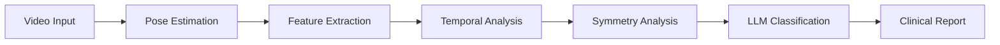

# AlexPose Gait Analysis System

A comprehensive AI-powered gait analysis platform that processes any video input to identify normal vs abnormal gait patterns and classify specific health conditions.

## 🚀 Quick Start

1. **Installation**: See [Installation Guide](docs/guides/installation.md)
2. **Configuration**: Review [Configuration Guide](docs/guides/configuration.md)
3. **First Analysis**: Follow [Quick Start Guide](docs/guides/quickstart.md)

## 📖 Documentation

Complete documentation is available in the [`docs/`](docs/) directory:

- **📋 [Project Specifications](docs/specs/)** - Requirements, design, and implementation tasks
- **🏗️ [Architecture](docs/architecture/)** - System design and component documentation
- **🔬 [Analysis Components](docs/analysis/)** - Gait analysis, feature extraction, and classification
- **🛠️ [Development](docs/development/)** - Contributing guidelines and development setup
- **📚 [Guides](docs/guides/)** - Installation, configuration, and usage guides

## ✨ Key Features

- **Multi-Format Video Support**: MP4, AVI, MOV, WebM files and YouTube URLs
- **Multiple Pose Estimators**: MediaPipe, OpenPose, Ultralytics, AlphaPose
- **Comprehensive Analysis**: 60+ gait features, temporal analysis, symmetry assessment
- **AI Classification**: LLM-powered normal/abnormal classification with condition identification
- **Modern Web Interface**: NextJS frontend with Shadcn UI components
- **CLI Tools**: Command-line interface for batch processing and automation
- **Flexible Deployment**: Docker, Heroku, and local deployment options

## 🏃‍♂️ Analysis Pipeline



## 🔧 Technology Stack

- **Backend**: Python, FastAPI, SQLite/PostgreSQL
- **Frontend**: NextJS, TypeScript, Shadcn UI, Tailwind CSS
- **AI/ML**: OpenAI GPT, Google Gemini, MediaPipe, OpenPose
- **Video Processing**: FFmpeg, OpenCV, yt-dlp
- **Package Management**: uv (Python), npm (Node.js)

## 📊 Supported Analysis

### Gait Parameters
- Cadence, step length, stride time
- Joint angles and range of motion
- Velocity and acceleration patterns
- Balance and stability metrics

### Clinical Conditions
- Antalgic gait (pain-related limping)
- Trendelenburg gait (hip weakness)
- Hemiplegic gait (stroke patterns)
- Parkinsonian gait (reduced arm swing)
- And many more...

## 🚀 Getting Started

### Prerequisites
- Python 3.11+
- Node.js 18+
- uv package manager
- FFmpeg (optional, falls back to OpenCV)

### Quick Installation

```bash
# Clone repository
git clone https://github.com/your-org/alexpose.git
cd alexpose

# Install Python dependencies
uv sync

# Install frontend dependencies (if using web interface)
cd frontend && npm install

# Set up environment variables
cp .env.example .env
# Edit .env with your API keys
```

### Run Analysis

```bash
# CLI analysis
uv run python -m ambient.cli analyze video.mp4

# Web interface - choose one method:

# Method 1: From project root
uvicorn server.main:app --reload

# Method 2: From server directory
cd server && uvicorn main:app --reload

# Method 3: Direct Python execution
uv run python server/main.py

# Then visit http://localhost:8000
```

## 📈 Example Results

```json
{
  "classification": "abnormal",
  "confidence": 0.85,
  "condition": "Antalgic Gait",
  "features": {
    "cadence": 85,
    "step_length_asymmetry": 0.18,
    "overall_symmetry_index": 0.12
  },
  "recommendations": [
    "Clinical examination of lower extremity",
    "Pain assessment and management"
  ]
}
```

## 🤝 Contributing

We welcome contributions! Please see our [Contributing Guide](docs/development/contributing.md) for details on:

- Development setup
- Code style guidelines
- Testing requirements
- Pull request process

## 📄 License

This project is licensed under the MIT License - see the [LICENSE](LICENSE) file for details.

## 🆘 Support

- 📖 [Documentation](docs/)
- 🐛 [Issue Tracker](https://github.com/your-org/alexpose/issues)
- 💬 [Discussions](https://github.com/your-org/alexpose/discussions)
- 📧 [Email Support](mailto:support@alexpose.com)

## 🏆 Acknowledgments

- GAVD (Gait Abnormality Video Dataset) for training data
- OpenPose, MediaPipe, and Ultralytics teams for pose estimation frameworks
- OpenAI and Google for LLM capabilities
- The open-source community for various tools and libraries

---

**AlexPose** - Advancing gait analysis through AI-powered insights 🚶‍♂️🤖