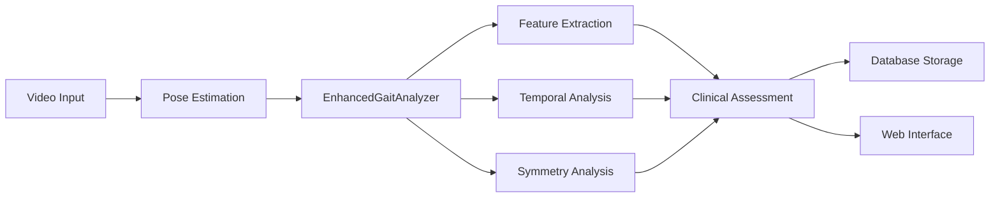
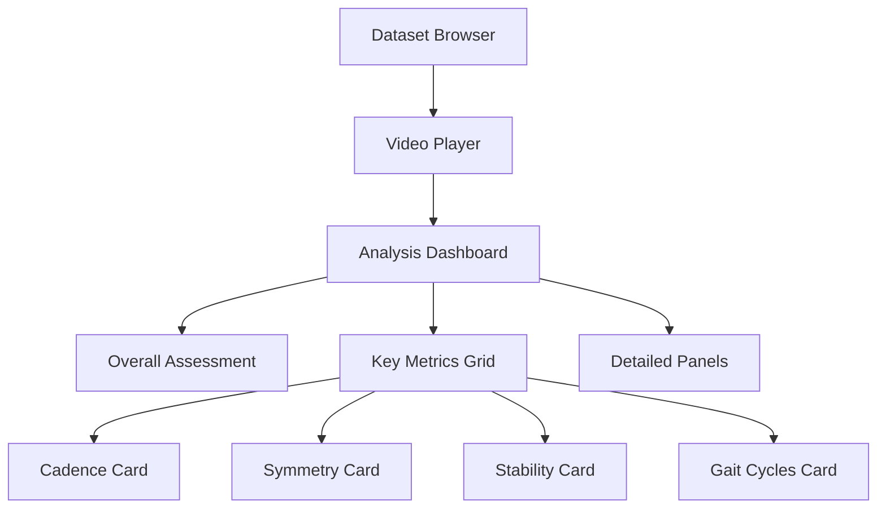

# AlexPose Analysis Documentation

## Overview

The AlexPose Analysis System provides comprehensive gait analysis capabilities through an integrated backend processing engine and modern web interface. This documentation covers all aspects of the analysis system, from core algorithms to user interface interactions.

## 🎯 Quick Start

### For Users
- **[Web Interface Tutorial](web-interface-tutorial.md)** - Complete guide to using the AlexPose web interface
- **[Analysis Flow Diagrams](analysis-flow-diagram.md)** - Visual overview of the analysis pipeline

### For Developers
- **[Gait Analysis](gait-analysis.md)** - Main analysis system architecture and usage
- **[Feature Extraction](feature-extraction.md)** - Comprehensive feature extraction documentation

## 📚 Core Documentation

### Analysis Components

| Component | Description | Key Features |
|-----------|-------------|--------------|
| **[Gait Analysis](gait-analysis.md)** | Main analysis system with web integration | EnhancedGaitAnalyzer, API integration, caching |
| **[Feature Extraction](feature-extraction.md)** | 60+ gait features across multiple domains | Kinematic, temporal, symmetry, stability features |
| **[Temporal Analysis](temporal-analysis.md)** | Gait cycle detection and timing analysis | Cadence, rhythm, phase analysis |
| **[Symmetry Analysis](symmetry-analysis.md)** | Left-right bilateral comparison | Joint symmetry, asymmetry detection |
| **[Pose Estimation](pose-estimation.md)** | Pose estimation backends and processing | MediaPipe, OpenPose integration |
| **[LLM Classification](llm-classification.md)** | AI-powered gait classification | Clinical assessment, condition identification |

### User Interface

| Topic | Description | Coverage |
|-------|-------------|----------|
| **[Web Interface Tutorial](web-interface-tutorial.md)** | Complete UI guide | Dataset management, analysis dashboard, tooltips |
| **[Analysis Flow Diagrams](analysis-flow-diagram.md)** | Visual system overview | Architecture, workflows, error handling |

## 🔧 System Architecture

### Backend Processing Pipeline



### Frontend Interface Components



## 🎨 User Interface Features

### Analysis Dashboard Components

#### Primary Assessment Cards
- **Overall Assessment**: Good/Moderate/Poor classification with confidence scoring
- **Symmetry Assessment**: Bilateral comparison with color-coded results
- **Key Metrics Grid**: Four interactive cards showing primary gait parameters
- **Detailed Panels**: Expandable sections with comprehensive analysis

#### Interactive Features
- **Real-time Analysis**: Automatic processing when sequences are selected
- **Comprehensive Tooltips**: Clinical explanations for all metrics
- **Loading States**: Professional progress indicators during analysis
- **Error Handling**: Graceful degradation with user-friendly messages

#### Clinical Integration
- **Normal Range Indicators**: Reference values for all metrics
- **Color-coded Classifications**: Visual indicators for assessment levels
- **Clinical Recommendations**: Actionable suggestions based on findings
- **Confidence Scoring**: Reliability indicators for analysis results

## 📊 Analysis Metrics

### Feature Categories

| Category | Features | UI Display |
|----------|----------|------------|
| **Kinematic** | Velocity, acceleration, jerk | Movement Quality Card |
| **Temporal** | Cadence, cycle timing, rhythm | Cadence & Gait Cycles Cards |
| **Symmetry** | Bilateral comparison, asymmetry | Symmetry Assessment Card |
| **Stability** | Balance, postural control | Stability Card |
| **Joint Angles** | ROM, patterns, bilateral | Detailed Analysis Panels |
| **Spatial** | Step length, stride width | Movement Analysis Section |

### Clinical Assessments

| Assessment | Range | UI Indicator | Clinical Significance |
|------------|-------|--------------|----------------------|
| **Overall Level** | Good/Moderate/Poor | Color-coded badge | Primary gait quality |
| **Cadence** | 100-130 spm normal | Large numeric display | Walking rhythm |
| **Symmetry** | < 0.05 symmetric | Score with classification | Bilateral balance |
| **Stability** | High/Medium/Low | Level indicator | Fall risk assessment |

## 🔄 Analysis Workflow

### User Workflow
1. **Upload Dataset** - Drag and drop CSV files with GAVD format
2. **Browse Sequences** - Select sequences from organized list
3. **View Analysis** - Automatic analysis with real-time results
4. **Explore Details** - Interactive tooltips and detailed panels
5. **Review Recommendations** - Clinical suggestions and next steps

### System Workflow
1. **Data Processing** - Pose estimation and sequence organization
2. **Analysis Engine** - Feature extraction, temporal, and symmetry analysis
3. **Clinical Assessment** - Summary generation and classification
4. **Caching System** - Database and file-based result storage
5. **UI Rendering** - Real-time dashboard updates with interactive elements

## 🛠️ Technical Integration

### API Endpoints
- `GET /api/pose-analysis/{datasetId}/{sequenceId}` - Get analysis results
- `GET /api/pose-analysis/status/{datasetId}/{sequenceId}` - Check analysis status
- `DELETE /api/pose-analysis/{datasetId}/{sequenceId}` - Delete cached results

### Caching Strategy
- **Database Layer**: Persistent storage with hash-based deduplication
- **File Cache**: 7-day expiration with automatic cleanup
- **Frontend State**: Client-side caching for seamless navigation

### Performance Optimization
- **Lazy Loading**: Load detailed analysis on demand
- **Progressive Enhancement**: Core functionality first, enhancements second
- **Responsive Design**: Optimized for desktop, tablet, and mobile

## 📖 Usage Examples

### Basic Analysis
```python
from ambient.analysis.gait_analyzer import EnhancedGaitAnalyzer

analyzer = EnhancedGaitAnalyzer(keypoint_format="COCO_17", fps=30.0)
results = analyzer.analyze_gait_sequence(pose_sequence)
```

### Service Integration
```python
from server.services.pose_analysis_service import PoseAnalysisServiceAPI

service = PoseAnalysisServiceAPI(config_manager)
analysis = service.get_sequence_analysis("gavd_001", "seq_123")
```

### Frontend Integration
```typescript
const analysisResponse = await fetch(`/api/pose-analysis/${datasetId}/${sequenceId}`);
const analysisData = await analysisResponse.json();
```

## 🎓 Learning Path

### For New Users
1. Start with **[Web Interface Tutorial](web-interface-tutorial.md)** for hands-on experience
2. Review **[Analysis Flow Diagrams](analysis-flow-diagram.md)** for system understanding
3. Explore **[Gait Analysis](gait-analysis.md)** for comprehensive overview

### For Developers
1. Begin with **[Gait Analysis](gait-analysis.md)** for system architecture
2. Study **[Feature Extraction](feature-extraction.md)** for detailed algorithms
3. Review **[Temporal Analysis](temporal-analysis.md)** and **[Symmetry Analysis](symmetry-analysis.md)** for specialized components

### For Clinicians
1. Focus on **[Web Interface Tutorial](web-interface-tutorial.md)** for practical usage
2. Understand clinical interpretations in each component documentation
3. Review normal ranges and assessment criteria throughout the documentation

## 🔗 Related Documentation

- **[Configuration Guide](../guides/configuration.md)** - System setup and configuration
- **[API Documentation](../api/README.md)** - REST API reference
- **[Development Guide](../development/README.md)** - Contributing and development setup

## 📞 Support

For questions or issues:
- Check the troubleshooting sections in each component documentation
- Review the **[Web Interface Tutorial](web-interface-tutorial.md)** for common usage patterns
- Consult the **[Analysis Flow Diagrams](analysis-flow-diagram.md)** for system understanding

---

**AlexPose Analysis System** - Comprehensive gait analysis with clinical-grade accuracy and user-friendly interfaces.