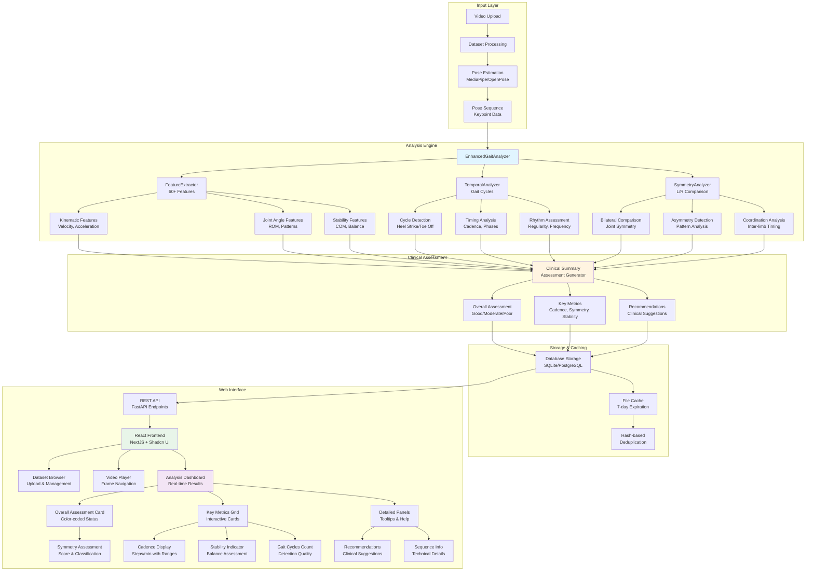
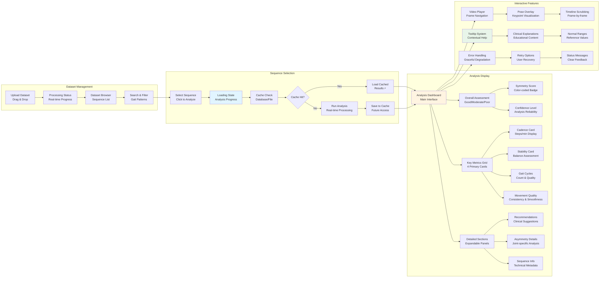
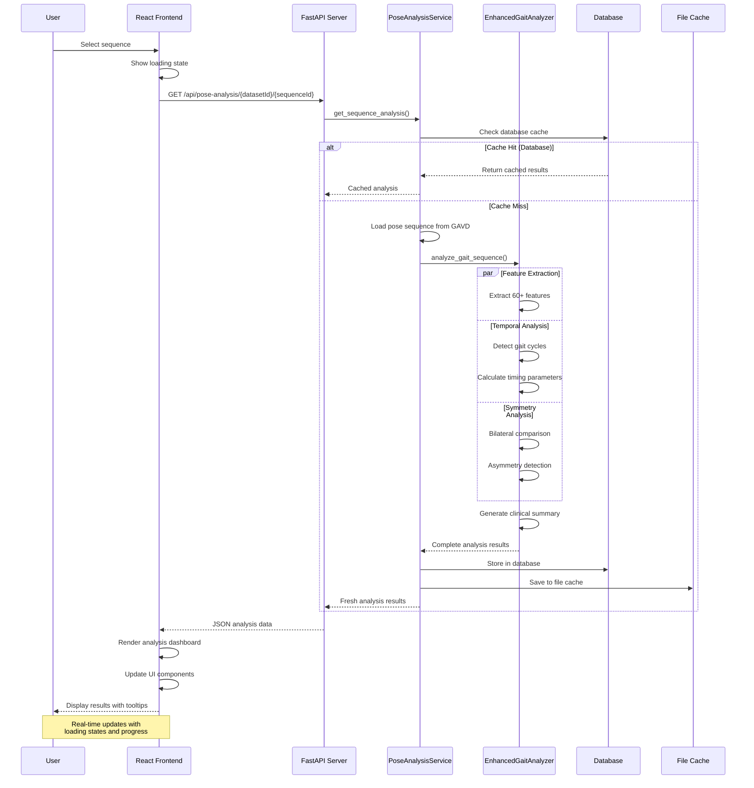
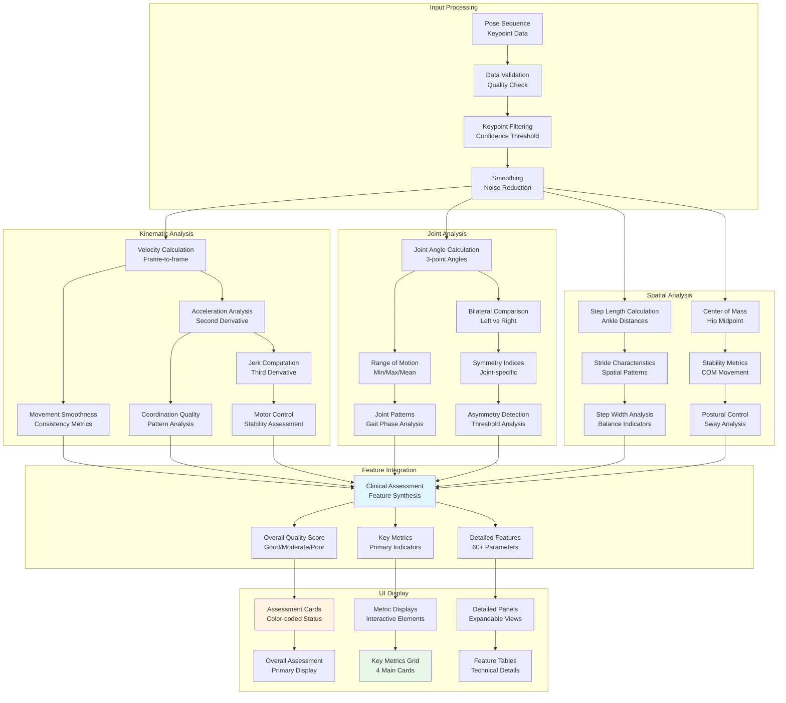
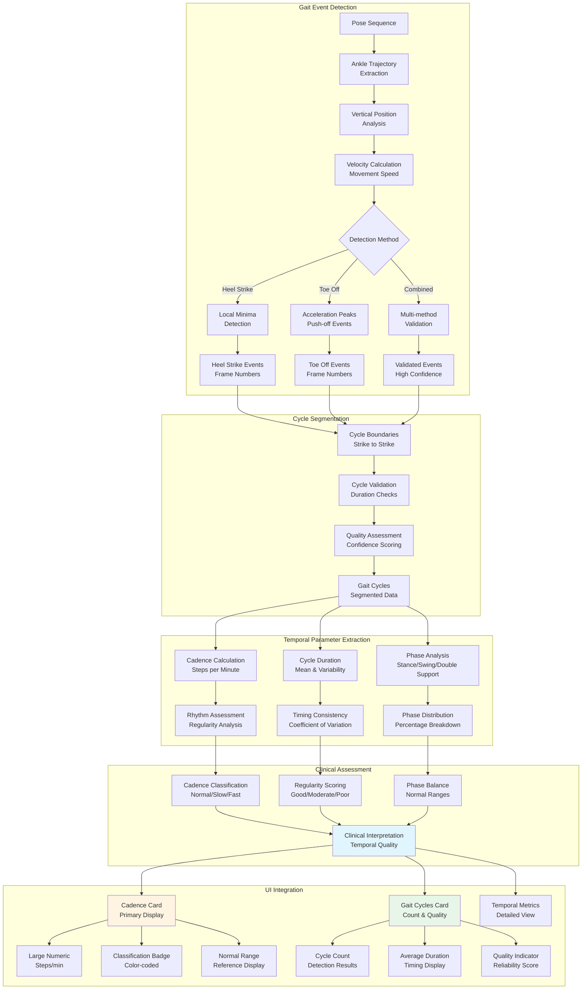
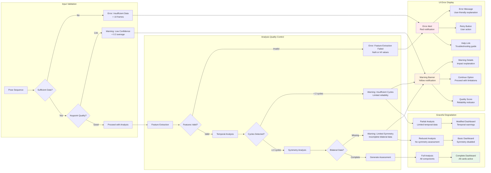

# AlexPose Analysis Flow Diagrams

## Complete System Architecture

## Frontend User Interface Flow

## Analysis Processing Pipeline

## Feature Extraction Flow

## Temporal Analysis Workflow

## Error Handling and Quality Control

