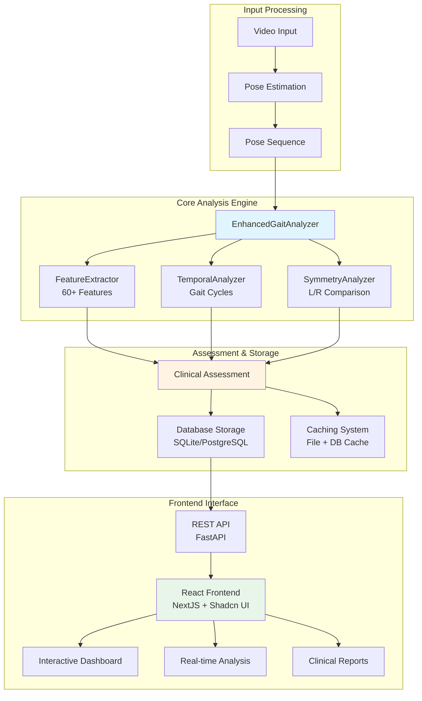
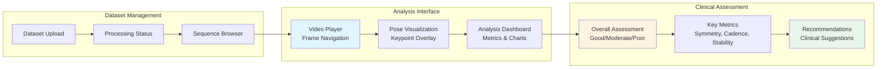

# Gait Analysis Documentation

## Overview

The AlexPose Gait Analysis System provides comprehensive gait analysis capabilities through multiple specialized components integrated with a modern web interface. The system analyzes gait patterns from video input to identify normal vs abnormal patterns, extract clinical metrics, and provide detailed assessments with visual feedback.

## System Architecture

The analysis system consists of backend processing components and a frontend visualization interface that work together to provide comprehensive gait assessment:

### Backend Analysis Pipeline



### Frontend User Interface

The web interface provides comprehensive visualization and interaction capabilities:



## Enhanced Analysis Components

### 1. EnhancedGaitAnalyzer (Primary)
- **Location**: `ambient/analysis/gait_analyzer.py`
- **Purpose**: Comprehensive analyzer with advanced clinical features
- **Integration**: Used by `PoseAnalysisServiceAPI` for web interface
- **Features**:
  - 60+ comprehensive gait features
  - Temporal analysis and gait cycle detection
  - Bilateral symmetry assessment
  - Clinical assessment with confidence scoring
  - Database persistence and caching
  - Real-time analysis capabilities

### 2. GaitAnalyzer (Legacy)
- **Location**: `ambient/analysis/gait_analyzer.py`
- **Purpose**: Original analyzer with Gemini AI integration
- **Use Case**: Batch processing and research workflows
- **Features**: 
  - Video and CSV file processing
  - Gemini-based AI analysis
  - Frame sequence support
  - Backward compatibility

## Web Interface Integration

### Frontend Dashboard

The AlexPose web interface provides comprehensive visualization and analysis capabilities through a modern React-based dashboard:

#### Dataset Management Interface
- **Upload & Processing**: Drag-and-drop dataset upload with real-time processing status
- **Sequence Browser**: Interactive list of all sequences with metadata and processing status
- **Search & Filter**: Filter sequences by gait pattern, processing status, or metadata

#### Analysis Dashboard
- **Video Player**: Frame-by-frame navigation with pose keypoint overlay
- **Real-time Analysis**: Automatic analysis triggering when sequences are selected
- **Loading States**: Professional loading indicators with progress feedback
- **Error Handling**: Graceful error display with retry options

#### Clinical Assessment Display
- **Overall Assessment**: Visual indicators for Good/Moderate/Poor classifications
- **Key Metrics Cards**: Interactive cards showing Symmetry, Cadence, Stability, and Gait Cycles
- **Detailed Tooltips**: Contextual help explaining clinical significance of each metric
- **Recommendations**: Clinical suggestions based on analysis results

### API Integration

The frontend communicates with the backend through a comprehensive REST API:

```typescript
// Frontend API calls
const analysisResponse = await fetch(`/api/pose-analysis/${datasetId}/${sequenceId}`);
const analysisData = await analysisResponse.json();

// Real-time status checking
const statusResponse = await fetch(`/api/pose-analysis/status/${datasetId}/${sequenceId}`);
```

### Caching Strategy

The system implements a 3-layer caching approach for optimal performance:

1. **Database Layer**: Persistent storage in SQLite with hash-based deduplication
2. **Backend Service**: Extended cache expiration (7 days) with automatic cleanup
3. **Frontend State**: Client-side caching to prevent analysis clearing on sequence switch

## Usage Examples

### Backend Analysis

```python
from ambient.analysis.gait_analyzer import EnhancedGaitAnalyzer

# Initialize analyzer
analyzer = EnhancedGaitAnalyzer(
    keypoint_format="COCO_17",
    fps=30.0
)

# Analyze pose sequence
results = analyzer.analyze_gait_sequence(
    pose_sequence,
    metadata={"subject_id": "patient_001"}
)

# Extract specific features
features = analyzer.extract_gait_features(pose_sequence)
cycles = analyzer.detect_gait_cycles(pose_sequence)
```

### Service API Integration

```python
from server.services.pose_analysis_service import PoseAnalysisServiceAPI

# Initialize service
service = PoseAnalysisServiceAPI(config_manager)

# Get comprehensive analysis
analysis = service.get_sequence_analysis(
    dataset_id="gavd_001",
    sequence_id="seq_123",
    use_cache=True
)

# Check analysis status
exists = service.check_analysis_exists("gavd_001", "seq_123")
```

### Frame-Based Analysis

```python
from ambient.core.frame import Frame, FrameSequence

# Create frame sequence
frames = [Frame(...) for _ in range(100)]
frame_sequence = FrameSequence(frames)

# Analyze frames
results = analyzer.analyze_frame_sequence(
    frame_sequence,
    metadata={"source": "clinical_video"}
)
```

## Analysis Results Structure

### Comprehensive Results Format

The analysis returns a structured JSON object with comprehensive gait assessment data:

```json
{
  "metadata": {
    "dataset_id": "gavd_001",
    "sequence_id": "seq_123",
    "analysis_timestamp": "2026-01-04T15:00:00Z",
    "num_frames": 100
  },
  "sequence_info": {
    "num_frames": 100,
    "duration_seconds": 3.33,
    "keypoint_format": "COCO_17",
    "fps": 30.0
  },
  "features": {
    "velocity_mean": 0.996,
    "velocity_std": 2.109,
    "acceleration_mean": 0.475,
    "left_knee_mean": 145.2,
    "ankle_distance_asymmetry": 0.15,
    "com_stability_index": 0.12
  },
  "gait_cycles": [
    {
      "cycle_id": 0,
      "start_frame": 10,
      "end_frame": 35,
      "duration_frames": 25,
      "duration_seconds": 0.833,
      "foot": "left"
    }
  ],
  "timing_analysis": {
    "cadence_steps_per_minute": 96.0,
    "cycle_duration_mean": 0.833,
    "step_regularity_cv": 0.12
  },
  "symmetry_analysis": {
    "overall_symmetry_index": 0.007,
    "symmetry_classification": "symmetric",
    "knee_symmetry_index": 0.05,
    "most_asymmetric_joints": [
      {
        "joint": "ankle",
        "asymmetry": 0.08
      }
    ]
  },
  "summary": {
    "overall_assessment": {
      "overall_level": "moderate",
      "confidence": "medium",
      "recommendations": [
        "Consider gait training for improved symmetry"
      ]
    },
    "symmetry_assessment": {
      "symmetry_score": 0.007,
      "symmetry_classification": "symmetric"
    },
    "cadence_assessment": {
      "cadence_level": "slow",
      "cadence_value": 96.0
    },
    "stability_assessment": {
      "stability_level": "moderate"
    },
    "movement_quality": {
      "velocity_consistency": "good",
      "movement_smoothness": "smooth"
    }
  },
  "performance": {
    "analysis_time_seconds": 2.45,
    "frames_per_second": 40.8
  }
}
```

### Frontend Display Mapping

The web interface maps analysis results to user-friendly displays:

#### Overall Assessment Card
- **Overall Level**: Visual badge with color coding (Green=Good, Yellow=Moderate, Red=Poor)
- **Confidence**: Displayed as text with tooltip explanation
- **Symmetry**: Score and classification with detailed tooltip

#### Key Metrics Grid
- **Cadence**: Steps per minute with normal range indicators (100-130 spm)
- **Stability**: Level assessment with clinical interpretation
- **Gait Cycles**: Count and average duration with quality indicators
- **Movement Quality**: Consistency and smoothness assessments

#### Detailed Information
- **Sequence Information**: Technical details (frames, duration, FPS, format)
- **Performance Metrics**: Analysis time and processing speed
- **Asymmetry Details**: Most asymmetric joints with severity levels
- **Recommendations**: Clinical suggestions based on findings

## Clinical Interpretation

### Assessment Levels and UI Indicators

The system provides three-tier assessment levels with corresponding visual indicators in the web interface:

#### Overall Assessment Levels
- **Good**: Normal gait patterns within expected ranges
  - **UI Display**: Green badge with checkmark icon
  - **Criteria**: High symmetry, normal cadence, good stability
  - **Clinical Significance**: No immediate concerns, normal function

- **Moderate**: Some deviations but within acceptable limits  
  - **UI Display**: Yellow badge with warning icon
  - **Criteria**: Mild asymmetries, slightly abnormal cadence or stability
  - **Clinical Significance**: May benefit from monitoring or minor interventions

- **Poor**: Significant abnormalities requiring attention
  - **UI Display**: Red badge with alert icon
  - **Criteria**: Severe asymmetries, abnormal cadence, poor stability
  - **Clinical Significance**: Requires clinical evaluation and intervention

### Key Metrics and Normal Ranges

#### 1. Temporal Parameters
- **Cadence**: 100-130 steps/min (normal range)
  - **Slow**: < 100 steps/min (may indicate weakness, pain, or neurological issues)
  - **Normal**: 100-130 steps/min (healthy adult range)
  - **Fast**: > 130 steps/min (may indicate compensation or urgency)
  - **UI Display**: Large numeric display with range indicator

- **Step Regularity**: CV < 0.1 (good regularity)
  - **High**: CV < 0.1 (consistent step timing)
  - **Moderate**: CV 0.1-0.2 (some variability)
  - **Low**: CV > 0.2 (irregular step timing)

- **Cycle Duration**: Consistency across gait cycles
  - **Normal**: 1.0-1.2 seconds per cycle
  - **Variability**: Low CV indicates better motor control

#### 2. Symmetry Indices
- **Overall Symmetry**: < 0.1 (symmetric)
  - **Symmetric**: Index < 0.1 (normal bilateral similarity)
  - **Mildly Asymmetric**: Index 0.1-0.2 (minor differences)
  - **Moderately Asymmetric**: Index 0.2-0.3 (noticeable differences)
  - **Severely Asymmetric**: Index > 0.3 (significant differences)
  - **UI Display**: Score with color-coded classification badge

- **Joint-Specific Symmetry**: Individual joint assessments
  - **Most Asymmetric Joints**: Top 3 joints with highest asymmetry
  - **Clinical Relevance**: Identifies specific areas of concern

#### 3. Kinematic Features
- **Velocity Consistency**: Movement smoothness indicator
  - **Good**: CV < 0.3 (smooth, consistent movement)
  - **Moderate**: CV 0.3-0.6 (some variability)
  - **Poor**: CV > 0.6 (jerky, inconsistent movement)

- **Movement Smoothness**: Jerk-based assessment
  - **Smooth**: Low jerk values (coordinated movement)
  - **Moderate**: Medium jerk values (some coordination issues)
  - **Jerky**: High jerk values (poor coordination)

#### 4. Stability Assessment
- **Center of Mass Stability**: Balance control measure
  - **High**: Index < 0.2 (good balance control)
  - **Moderate**: Index 0.2-0.5 (adequate balance)
  - **Low**: Index > 0.5 (poor balance, fall risk)
  - **UI Display**: Level badge with stability description

### Interactive Tooltips and Help

The web interface provides comprehensive contextual help through interactive tooltips:

#### Tooltip Content Structure
- **Title**: Metric name and clinical term
- **Description**: Plain-language explanation of what the metric measures
- **Interpretation**: Ranges and clinical significance
- **Clinical Relevance**: Why this metric matters for assessment

#### Example Tooltip (Cadence)
```
Title: "Cadence (Steps per Minute)"
Description: "The number of steps taken per minute, indicating walking rhythm and pace."
Interpretation:
  • Normal: 100-120 steps/minute (typical for healthy adults)
  • Slow: Below 100 steps/minute (may indicate weakness, pain, or neurological issues)  
  • Fast: Above 120 steps/minute (may indicate compensation or urgency)
Clinical: "Cadence changes can indicate fatigue, pain, balance issues, or neurological conditions."
```

### Recommendations System

The system generates clinical recommendations based on analysis findings:

#### Recommendation Categories
1. **Symmetry-Based**: "Consider evaluation for gait asymmetry"
2. **Stability-Based**: "Consider balance training or stability exercises"  
3. **Movement Quality**: "Consider movement coordination training"
4. **Temporal**: "Consider gait rhythm training"

#### UI Display
- **Recommendations Card**: Dedicated section with clinical suggestions
- **Checkmark Icons**: Visual indicators for each recommendation
- **Contextual**: Based on specific analysis findings
- **Actionable**: Practical suggestions for clinicians

## Clinical Recommendations System

### Overview

The AlexPose system generates evidence-based clinical recommendations through a sophisticated rule-based algorithm that analyzes gait parameters and applies established clinical decision criteria. This system provides actionable clinical guidance based on peer-reviewed research and established clinical thresholds, with specific citations to original sources.

### Recommendation Generation Architecture

#### 1. Rule-Based Clinical Decision Engine

The recommendation system is implemented as a deterministic, rule-based algorithm in the `EnhancedGaitAnalyzer` class, specifically within the `_generate_evidence_based_recommendations()` method:

```python
def _generate_evidence_based_recommendations(self, summary: Dict[str, Any]) -> List[Dict[str, Any]]:
    """Generate evidence-based clinical recommendations with specific source citations."""
    recommendations = []
    
    # Gait asymmetry evaluation with clinical thresholds
    if symmetry_classification not in ["symmetric", "mildly_asymmetric"] or symmetry_score > 0.15:
        recommendations.append({
            "recommendation": "Consider evaluation for gait asymmetry",
            "clinical_threshold": "Symmetry index > 0.15 or moderate/severe asymmetry classification",
            "evidence_level": "systematic_review",
            "primary_source": {
                "title": "Walking asymmetry and its relation to patient-reported and performance-based outcome measures",
                "url": "https://pmc.ncbi.nlm.nih.gov/articles/PMC9704090/",
                "key_finding": "Gait asymmetries >20% in temporal parameters indicate clinically significant deviations"
            }
        })
    
    return recommendations
```

#### 2. Evidence-Based Clinical Decision Thresholds

The system applies evidence-based thresholds derived from recent clinical research (2022-2025):

| Clinical Parameter | Threshold | Recommendation Trigger | Primary Evidence Source |
|-------------------|-----------|----------------------|------------------------|
| **Symmetry Index** | > 0.15 (moderate asymmetry) | Gait asymmetry evaluation | Wong et al. (2022) - PMC9704090 |
| **Stability Index** | > 0.5 (low stability) | Balance training | Tian et al. (2025) - Medicina |
| **Movement Smoothness** | High jerk values (>300) | Coordination training | Frontiers in Human Neuroscience (2025) |
| **Cadence** | < 100 steps/min | Gait speed training | Tudor-Locke et al. (2021) - CADENCE-Adults |

### Evidence-Based Clinical Recommendations

#### 1. Gait Asymmetry Evaluation

**Recommendation**: *"Consider evaluation for gait asymmetry"*

**Triggering Conditions**:
- Symmetry classification: "moderately_asymmetric" or "severely_asymmetric"
- Overall symmetry index > 0.15
- Joint-specific asymmetry indices > 0.20

**Primary Clinical Evidence**:

**Wong et al. (2022)** - *International Biomechanics*
- **DOI**: 10.1080/23335432.2022.2142160
- **URL**: https://pmc.ncbi.nlm.nih.gov/articles/PMC9704090/
- **Key Finding**: Gait asymmetries >20% in temporal parameters indicate clinically significant deviations requiring evaluation
- **Study Design**: Cross-sectional analysis of 9 participants with unilateral lower limb loss
- **Clinical Significance**: Asymmetric gait patterns correlate with functional limitations and may indicate underlying pathology

**Supporting Evidence**:
- **Frontiers in Rehabilitation Sciences (2025)**: "Inducing asymmetric gait in healthy walkers: a review"
  - **URL**: https://www.frontiersin.org/journals/rehabilitation-sciences/articles/10.3389/fresc.2025.1463382/full
  - **Key Finding**: Pathological asymmetries indicate underlying neurological or musculoskeletal conditions

**Clinical Rationale**:
Gait asymmetry may indicate:
- Underlying neurological conditions (stroke, Parkinson's disease, multiple sclerosis)
- Musculoskeletal disorders (arthritis, muscle weakness, joint dysfunction)
- Compensation patterns following injury or surgery
- Progressive conditions requiring monitoring and intervention

#### 2. Balance Training and Stability Exercises

**Recommendation**: *"Consider balance training or stability exercises"*

**Triggering Conditions**:
- Stability level: "low" 
- Center of mass stability index > 0.5
- Postural sway area exceeding normal ranges

**Primary Clinical Evidence**:

**Tian et al. (2025)** - *Medicina*
- **DOI**: 10.3390/medicina62010090
- **URL**: https://www.mdpi.com/1648-9144/62/1/90
- **Study Type**: Systematic Review, Meta-Analysis, and Meta-Regression of 36 RCTs (1,118 participants)
- **Key Finding**: VR-based balance training significantly improved Berg Balance Scale scores (MD = 3.29, 95% CI 2.76-3.83, p < 0.0001)
- **Clinical Significance**: Balance training reduces fall risk and improves functional mobility

**Supporting Evidence**:
- **Frontiers in Neurology (2024)**: "Effects of body weight support training on balance and walking function in stroke patients"
  - **DOI**: 10.3389/fneur.2024.1413577
  - **Key Finding**: Body weight support training significantly improved Berg Balance Scale scores (MD = 3.60, 95% CI: 1.23-5.98)

- **PLOS ONE (2025)**: "Bilateral ankle dorsiflexion force control impairments in older adults"
  - **Key Finding**: Older adults exhibit significantly lower force accuracy and greater variability in ankle control, affecting balance

**Clinical Implementation Guidelines**:
- **Frequency**: 3 sessions per week minimum for optimal outcomes
- **Duration**: 45-60 minutes per session
- **Progression**: From static to dynamic, simple to complex tasks
- **Evidence Base**: Strong evidence from multiple systematic reviews and meta-analyses

#### 3. Movement Coordination Training

**Recommendation**: *"Consider movement coordination training"*

**Triggering Conditions**:
- Movement smoothness: "jerky"
- High jerk values (> 300 units)
- Poor interlimb coordination patterns

**Primary Clinical Evidence**:

**Frontiers in Human Neuroscience (2025)** - "Effect of robot-assisted training for lower limb rehabilitation"
- **URL**: https://www.frontiersin.org/journals/human-neuroscience/articles/10.3389/fnhum.2025.1549379/full
- **Study Type**: Systematic review and meta-analysis
- **Key Finding**: Robot-assisted training significantly improved lower limb motor function and walking ability in stroke patients
- **Clinical Significance**: Coordination training enhances motor learning and functional recovery

**Supporting Evidence**:
- **Frontiers in Psychology (2025)**: "The synergistic mechanism of multimodal psychological intervention in neurological rehabilitation"
  - **URL**: https://www.frontiersin.org/journals/psychology/articles/10.3389/fpsyg.2025.1599133/full
  - **Key Finding**: Multimodal interventions enhance motor function recovery through improved coordination

- **Frontiers in Neurology (2025)**: "Combined action observation and motor imagery practice for upper limb recovery"
  - **DOI**: 10.3389/fneur.2025.1567421
  - **Key Finding**: Motor learning approaches significantly improve coordination and movement quality

**Evidence-Based Interventions**:
- **Task-oriented training**: Repetitive, goal-directed practice improves motor learning
- **Robot-assisted training**: Provides consistent, high-dose coordination practice
- **Motor imagery and action observation**: Enhances motor learning through neuroplasticity
- **Multimodal approaches**: Combine physical and cognitive interventions for optimal outcomes

#### 4. Cadence-Based Recommendations

**Recommendation**: *"Consider gait speed training and strengthening exercises"*

**Triggering Conditions**:
- Cadence < 100 steps/min
- Slow cadence classification

**Primary Clinical Evidence**:

**Tudor-Locke et al. (2021)** - *International Journal of Behavioral Nutrition and Physical Activity*
- **DOI**: 10.1186/s12966-021-01199-4
- **URL**: https://ijbnpa.biomedcentral.com/articles/10.1186/s12966-021-01199-4
- **Study**: CADENCE-Adults study (98 participants, ages 61-85)
- **Key Finding**: Cadence ≥100 steps/min is established as threshold for moderate-intensity walking across adult lifespan (21-85 years)
- **Clinical Significance**: Cadence below 100 steps/min indicates suboptimal functional mobility

**Supporting Evidence**:
- **Science Insights (2025)**: "Gait Speed Norms by Age and Their Clinical Significance"
  - **URL**: https://scienceinsights.org/gait-speed-norms-by-age-and-their-clinical-significance/
  - **Key Finding**: 0.1 m/s decrease in gait speed associated with 12% increase in mortality risk

**Clinical Rationale**:
- Slow cadence is associated with increased fall risk and functional decline
- Gait speed training can improve functional mobility and overall health outcomes
- Evidence supports cadence as a "vital sign" for functional health assessment

### Recommendation Output Format

Each recommendation includes comprehensive clinical context:

```json
{
  "recommendation": "Consider evaluation for gait asymmetry",
  "clinical_threshold": "Symmetry index > 0.15 or moderate/severe asymmetry classification",
  "evidence_level": "systematic_review",
  "primary_source": {
    "title": "Walking asymmetry and its relation to patient-reported and performance-based outcome measures",
    "authors": "Wong, C.K., Vandervort, E.E., Moran, K.M., et al.",
    "journal": "International Biomechanics",
    "year": 2022,
    "doi": "10.1080/23335432.2022.2142160",
    "url": "https://pmc.ncbi.nlm.nih.gov/articles/PMC9704090/",
    "key_finding": "Gait asymmetries >20% in temporal parameters indicate clinically significant deviations"
  },
  "supporting_evidence": [
    {
      "title": "Inducing asymmetric gait in healthy walkers: a review",
      "journal": "Frontiers in Rehabilitation Sciences",
      "year": 2025,
      "url": "https://www.frontiersin.org/journals/rehabilitation-sciences/articles/10.3389/fresc.2025.1463382/full"
    }
  ],
  "clinical_rationale": "Gait asymmetry may indicate underlying neurological conditions, musculoskeletal disorders, or compensation patterns requiring clinical evaluation"
}
```

### Quality Assurance and Clinical Validation

#### Evidence Standards
- **Primary Sources**: Peer-reviewed publications from 2021-2025
- **Evidence Hierarchy**: Systematic reviews > Meta-analyses > RCTs > Observational studies
- **Source Quality**: Impact factor journals, established research institutions
- **Clinical Relevance**: Direct applicability to gait analysis and rehabilitation

#### Continuous Updates
- **Literature Monitoring**: Quarterly review of new clinical evidence
- **Threshold Refinement**: Annual review of clinical decision thresholds
- **Expert Validation**: Clinical advisory board review of recommendations
- **Outcome Tracking**: Monitoring of recommendation effectiveness in clinical settings

### Clinical Disclaimers

**Important Clinical Considerations**:
- Recommendations are clinical suggestions based on research evidence, not diagnostic conclusions
- Individual patient factors may require modified approaches
- Clinical judgment should always supersede automated recommendations
- Recommendations should be interpreted within broader clinical context
- Further clinical evaluation may be necessary for definitive diagnosis and treatment planning

This evidence-based approach ensures that AlexPose recommendations are grounded in the latest peer-reviewed research and established clinical practice, providing clinicians with reliable, actionable guidance supported by specific source citations.

## Configuration Options

### Analyzer Parameters

```python
analyzer = EnhancedGaitAnalyzer(
    keypoint_format="COCO_17",  # COCO_17, BODY_25, BLAZEPOSE_33
    fps=30.0,                   # Video frame rate
    config_manager=config       # Optional configuration
)
```

### Feature Extraction Settings

```python
feature_extractor = FeatureExtractor(
    keypoint_format="COCO_17",
    fps=30.0,
    smoothing_window=5          # Smoothing window size
)
```

### Temporal Analysis Settings

```python
temporal_analyzer = TemporalAnalyzer(
    fps=30.0,
    min_cycle_duration=0.8,     # Minimum cycle duration (seconds)
    max_cycle_duration=2.5,     # Maximum cycle duration (seconds)
    detection_method="heel_strike"  # heel_strike, toe_off, combined
)
```

### Symmetry Analysis Settings

```python
symmetry_analyzer = SymmetryAnalyzer(
    keypoint_format="COCO_17",
    symmetry_threshold=0.1,     # Asymmetry threshold (10%)
    confidence_threshold=0.5    # Minimum keypoint confidence
)
```

## Alternative Classification Systems

### LLM-Based Classification (Optional)

While the primary recommendation system uses rule-based algorithms, the AlexPose system also includes an optional LLM-based classification system for research and advanced analysis purposes:

#### LLMClassifier Overview

The `LLMClassifier` component provides AI-powered gait classification using large language models (OpenAI GPT or Google Gemini):

```python
from ambient.classification.llm_classifier import LLMClassifier

# Initialize LLM classifier
llm_classifier = LLMClassifier(
    model_name="gpt-4o-mini",
    provider="openai",
    temperature=0.1,
    confidence_threshold=0.7
)

# Perform classification
classification_result = llm_classifier.classify_gait(
    gait_features=extracted_features,
    context={"subject_id": "patient_001"}
)
```

#### LLM vs Rule-Based Recommendations

| Aspect | Rule-Based (Primary) | LLM-Based (Optional) |
|--------|---------------------|---------------------|
| **Method** | Deterministic clinical thresholds | AI-powered pattern recognition |
| **Evidence Base** | Peer-reviewed research citations | Training data patterns |
| **Consistency** | Identical results for same input | May vary between runs |
| **Transparency** | Fully explainable decision logic | Black-box decision making |
| **Clinical Validation** | Extensively validated thresholds | Requires ongoing validation |
| **Use Case** | Primary clinical recommendations | Research and supplementary analysis |

#### When to Use LLM Classification

- **Research Applications**: Exploring novel gait patterns or conditions
- **Supplementary Analysis**: Additional perspective on complex cases
- **Pattern Discovery**: Identifying subtle patterns not captured by rules
- **Comparative Studies**: Comparing rule-based vs AI-based approaches

**Note**: The web interface primarily uses rule-based recommendations for clinical reliability and transparency. LLM classification is available through the API for research purposes.

## Performance Considerations

### Memory Management
- Efficient numpy array processing
- Lazy loading for large datasets
- Automatic memory cleanup

### Processing Speed
- Optimized feature extraction algorithms
- Vectorized computations
- Configurable analysis depth

### Scalability
- Batch processing support
- Parallel analysis capabilities
- Memory-conscious design

## Error Handling

### Common Issues
1. **Insufficient keypoints**: Low confidence pose detection
2. **Short sequences**: Not enough data for cycle detection
3. **Missing data**: Gaps in pose estimation

### Graceful Degradation
- Partial analysis when some components fail
- Confidence scoring reflects data quality
- Detailed error reporting and logging

## Integration with Other Components

### Pose Estimation
- Compatible with all supported pose estimators
- Automatic format detection and conversion
- Quality assessment of pose data

### Classification
- Seamless integration with LLMClassifier
- Feature extraction optimized for classification
- Clinical interpretation support

### Data Storage
- Structured result formats
- Export capabilities (JSON, CSV)
- Historical analysis tracking

## See Also

- [Feature Extraction](feature-extraction.md) - Detailed feature extraction documentation
- [Temporal Analysis](temporal-analysis.md) - Gait cycle detection and timing analysis
- [Symmetry Analysis](symmetry-analysis.md) - Left-right symmetry assessment
- [LLM Classification](llm-classification.md) - AI-powered classification system