# Pose Data Processing - User Guide

> **Alex Mui**<br/>
> _Monday, December 29, 2025 3:17:35 PM_

## Overview

The Pose Data Processing module provides a comprehensive suite of tools for analyzing pose estimation data and assessing fall risk using the Tinetti POMA (Performance Oriented Mobility Assessment) scoring system. This module consists of two main components:

1. **`gait_processor.py`** - Fall risk assessment and gait analysis capabilities
2. **`gavd_processor.py`** - Utilities for GAVD data processing
3. **`pose_estimation.py`** - Utilities for GAVD  pose keypoint extraction (including OpenPose estimator)

The module is designed to work with pose estimation outputs from various sources including OpenPose, MediaPipe, and other pose estimation models, with special support for the GAVD (Gait Abnormality Video Dataset) format. Both `OpenPoseEstimator` and `MediaPipeEstimator` are fully supported and can be used interchangeably as they implement the same `PoseEstimator` interface. Both `OpenPoseEstimator` and `MediaPipeEstimator` are fully supported and can be used interchangeably as they implement the same `PoseEstimator` interface.

## Table of Contents

1. [Installation](#installation)
2. [Quick Start](#quick-start)
3. [Core Components](#core-components)
4. [Pose Estimation Module](#pose-estimation-module)
   - [OpenPoseEstimator (CMU OpenPose)](#openposeestimator-cmu-openpose)
   - [MediaPipeEstimator (Google MediaPipe)](#mediapipeestimator-google-mediapipe)
5. [Gait Processor Module](#gait-processor-module)
6. [Advanced Usage](#advanced-usage)
7. [Data Formats](#data-formats)
8. [Fall Risk Assessment](#fall-risk-assessment)
9. [Architecture & Design Principles](#architecture--design-principles)
10. [Troubleshooting](#troubleshooting)

## Quick Start Tutorial (CLI + Jupyter)

This hands-on tutorial shows two simple ways to use the GAVD pose processing package: from the command line and in a Jupyter notebook. It works even if OpenPose is not installed (a placeholder keypoint generator is used), but for real keypoints we should configure OpenPose.

### Prerequisites

- Python 3.12+ with project dependencies installed (see root README for `uv sync`)
- Optional but recommended: One of the following pose estimation backends:
  - **MediaPipe** (recommended for ease of setup): See [Installation and Setup](#installation-and-setup) section below for detailed installation instructions
  - **CMU OpenPose**: Install OpenPose binary and set `OPENPOSEPATH` environment variable
    - Windows: `setx OPENPOSEPATH "C:\\path\\to\\openpose"`
    - macOS/Linux: `export OPENPOSEPATH=/opt/openpose`
    - OpenPose binary should exist at: `"$OPENPOSEPATH/bin/OpenPoseDemo"` (or `.exe` on Windows)

If we have per-frame images available, we should make sure that the GAVD CSV rows provide an image path via either:
- a top-level `image_path` column, or
- `vid_info.image_path` (or `vid_info.frame_path`)

The converter will automatically use these when an estimator is provided; otherwise it will fall back to a deterministic placeholder generator.

### A. Command Line (one-liner)

Process a GAVD CSV and print basic stats. Replace the file path with the CSV.

```bash
python - <<'PY'
from ambient.gavd.gavd_processor import create_gavd_processor, PoseDataConverter
from ambient.gavd.pose_estimators import MediaPipeEstimator, OpenPoseEstimator

csv_path = "path/to/gavd_data.csv"  # e.g., tests/data/sample_gait_data.csv

# Try to use MediaPipe first (easier setup), then OpenPose, otherwise fall back silently
estimator = None
try:
    # MediaPipe (recommended - easier setup)
    estimator = MediaPipeEstimator(model_path="/path/to/pose_landmarker_full.task")
except Exception:
    try:
        # Fallback to OpenPose
        estimator = OpenPoseEstimator(default_model="BODY_25")
    except Exception:
        pass

converter = PoseDataConverter(estimator=estimator)
processor = create_gavd_processor(data_converter=converter)

result = processor.process_gavd_file(csv_path, max_sequences=2, include_metadata=True)
print("Processed sequences:", result["total_sequences"])
print("Total frames:", result["summary"]["total_frames"])
PY
```

Notes:
- MediaPipe is recommended for easier setup (Python package only, no binary installation)
- OpenPose may be faster for batch video processing
- To force COCO keypoints: pass `model_pose="COCO"` into `convert_sequence_to_pose_format` (or update the converter call if calling it directly)
- When no estimator is available or no image path is present in the row, the converter uses a lightweight placeholder keypoint generator so the pipeline remains testable

### B. Jupyter Notebook (step-by-step)

Run these cells in a notebook (see `notebooks/GAVD02 - pose estimation.ipynb` for inspiration):

```python
# 1) Imports and optional pose estimator setup
from ambient.gavd.gavd_processor import GAVDDataLoader, GAVDProcessor, PoseDataConverter
from ambient.gavd.pose_estimators import MediaPipeEstimator, OpenPoseEstimator
import pandas as pd

# Try MediaPipe first (easier setup), then OpenPose
estimator = None
try:
    estimator = MediaPipeEstimator(model_path="/path/to/pose_landmarker_full.task")
except Exception:
    try:
        estimator = OpenPoseEstimator(default_model="BODY_25")
    except Exception:
        estimator = None  # fallback mode

converter = PoseDataConverter(estimator=estimator)
processor = GAVDProcessor(data_converter=converter)
```

```python
# 2) Load and validate GAVD CSV
csv_path = "path/to/gavd_data.csv"
df = processor.data_loader.load_gavd_data(csv_path, verbose=True)
df.head()
```

```python
# 3) Organize by sequence and convert one sequence to pose format
sequences = processor.data_loader.organize_by_sequence(df)
first_seq_id = next(iter(sequences))
seq_data = sequences[first_seq_id]

pose_data = converter.convert_sequence_to_pose_format(
    seq_data,
    include_metadata=True,
    person_id=0,
    model_pose="BODY_25",  # or "COCO"
)
len(pose_data), pose_data[:1]
```

```python
# 4) Process the whole file end-to-end and get summary stats
processed = processor.process_gavd_file(csv_path, max_sequences=3, include_metadata=True)
stats = processor.get_processing_statistics(processed)
stats
```

Tips:
- If you expect OpenPose to be used, ensure your rows contain `image_path` or `vid_info.image_path`/`vid_info.frame_path`.
- Without per-frame images, the converter will still produce consistent placeholder keypoints to support downstream pipelines and tests.

## Installation

### Prerequisites

```bash
pip install numpy pandas
```

### Import the Module

```python
import sys
from pathlib import Path

# Add the theodore directory to the Python path
project_root = Path(__file__).parent
theodore_path = project_root
sys.path.insert(0, str(theodore_path))

from ambient.pose import (
    GaitDataProcessor,
    GaitSequenceAnalyzer,
    GAVDProcessor,
    BoundingBoxProcessor,
    KeypointGenerator,
    PoseKeypointExtractor,
    GAVDDataLoader,
    PoseDataConverter
)
```

## Quick Start

### Basic Gait Analysis

```python
from ambient.pose import GaitDataProcessor

# Initialize the processor
processor = GaitDataProcessor()

# Process a gait video CSV file
results = processor.process_gait_video('path/to/pose_data.csv')

# Get the results
print(f"Fall Risk Level: {results['fall_risk_level']}")
print(f"Tinetti Score: {results['tinetti_gait_score']}/12")
print(f"Risk Score: {results['fall_risk_score']:.2f}")
```

### GAVD Data Processing

```python
from ambient.pose import GAVDProcessor

# Initialize GAVD processor
gavd_processor = GAVDProcessor()

# Process GAVD CSV file
processed_data = gavd_processor.process_gavd_file(
    'path/to/gavd_data.csv',
    max_sequences=5,
    verbose=True
)

print(f"Processed {processed_data['total_sequences']} sequences")
print(f"Total frames: {processed_data['summary']['total_frames']}")
```

### Sequence Analysis

```python
from ambient.pose import GaitSequenceAnalyzer

# Initialize analyzer
analyzer = GaitSequenceAnalyzer(verbose=True)

# Analyze a single sequence
results = analyzer.analyze_sequence("seq_001", pose_data)

print(f"Fall Risk: {results['fall_risk_level']}")
print(f"Tinetti Score: {results['tinetti_gait_score']}/12")
```

## Core Components

### 🔍 **Pose Estimation Module (`pose_estimators.py`)**
- **PoseEstimator**: Abstract base class for pose estimation backends
- **OpenPoseEstimator**: CMU OpenPose integration (subprocess-based)
- **MediaPipeEstimator**: Google MediaPipe integration (Python API)
- **BoundingBoxProcessor**: Handles bounding box calculations and center point extraction
- **KeypointGenerator**: Generates pose keypoints using various strategies
- **PoseKeypointExtractor**: Extracts pose keypoints from bounding box data
- **GAVDDataLoader**: Loads and organizes GAVD data
- **PoseDataConverter**: Converts GAVD data to pose estimation format
- **GAVDProcessor**: High-level processor for GAVD data with pose estimation capabilities

### 🏗️ **GAVD Processing Module (`gavd_processor.py`)**
- **DataValidator**: Abstract base class for data validation strategies
- **GAVDDataValidator**: Concrete validator for GAVD-specific data validation
- **DataTransformer**: Abstract base class for data transformation strategies
- **GAVDDataTransformer**: Concrete transformer for GAVD data preprocessing
- **PoseKeypointExtractor**: Extracts pose keypoints from bounding box data
- **PoseDataConverter**: Converts GAVD data to pose estimation format
- **GAVDDataLoader**: Comprehensive data loading and organization system
- **GAVDProcessor**: High-level processor for GAVD data with pose estimation capabilities

### 📊 **Gait Processor Module (`gait_processor.py`)**
- **GaitDataProcessor**: Core pose data processing and fall risk assessment
- **GaitSequenceAnalyzer**: Analyzes individual gait sequences for fall risk assessment

### 🏥 **Clinical Assessment**
- Tinetti POMA scoring automation
- Fall risk categorization
- Component-wise scoring breakdown
- Validated clinical thresholds

### 📈 **Comprehensive Analysis**
- Frame-by-frame processing
- Statistical summaries
- Key metrics calculation
- Detailed reporting

## Pose Estimation Module

### BoundingBoxProcessor

Handles bounding box calculations and center point extraction.

#### `calculate_center(bbox)`

Calculate the center point of a bounding box.

```python
from ambient.pose import BoundingBoxProcessor

bbox = {'left': 100, 'top': 200, 'width': 50, 'height': 100}
center_x, center_y = BoundingBoxProcessor.calculate_center(bbox)
print(f"Center: ({center_x}, {center_y})")
# Output: Center: (125.0, 250.0)
```

### KeypointGenerator

Generates pose keypoints using various strategies.

#### `create_keypoint(x, y, confidence=0.8)`

Create a single keypoint with specified coordinates and confidence.

```python
from ambient.pose import KeypointGenerator

keypoint = KeypointGenerator.create_keypoint(100.5, 200.3, 0.9)
print(keypoint)
# Output: {'x': 100.5, 'y': 200.3, 'confidence': 0.9}
```

#### `generate_grid_keypoints(center_x, center_y, num_keypoints=25, grid_spacing=5.0, confidence=0.8)`

Generate keypoints in a grid pattern around a center point.

```python
from ambient.pose import KeypointGenerator

keypoints = KeypointGenerator.generate_grid_keypoints(
    center_x=100,
    center_y=200,
    num_keypoints=25,
    grid_spacing=5.0,
    confidence=0.8
)
print(f"Generated {len(keypoints)} keypoints")
```

### PoseKeypointExtractor

Extracts pose keypoints from bounding box data using configurable strategies.

```python
from ambient.pose import PoseKeypointExtractor

# Initialize extractor
extractor = PoseKeypointExtractor()

# Extract keypoints from bounding box
bbox = {'left': 100, 'top': 200, 'width': 50, 'height': 100}
keypoints = extractor.extract_from_bbox(
    bbox,
    num_keypoints=25,
    grid_spacing=5.0,
    confidence=0.8
)
print(f"Extracted {len(keypoints)} keypoints")
```

#### Advanced Configuration

The `PoseKeypointExtractor` can be configured with custom bounding box processors and keypoint generators:

```python
from ambient.pose.gavd_processor import PoseKeypointExtractor
from ambient.pose import BoundingBoxProcessor, KeypointGenerator

# Create custom components
custom_bbox_processor = BoundingBoxProcessor()
custom_keypoint_generator = KeypointGenerator()

# Initialize extractor with custom components
extractor = PoseKeypointExtractor(
    bbox_processor=custom_bbox_processor,
    keypoint_generator=custom_keypoint_generator
)

# Extract keypoints with custom configuration
keypoints = extractor.extract_from_bbox(
    bbox,
    num_keypoints=30,
    grid_spacing=3.0,
    confidence=0.9
)
```

### OpenPoseEstimator (CMU OpenPose)

This project integrates the official CMU OpenPose binary via a thin Python wrapper `OpenPoseEstimator` that:
- Discovers the OpenPose binary from `OPENPOSEPATH`
- Verifies the model files are present under `OPENPOSEPATH/models`
- Invokes `OpenPoseDemo` with the correct working directory and `--model_folder`
- Parses the generated JSON into a normalized list of keypoints

#### How it works (end-to-end)


Notes:
- Working directory is set to `OPENPOSEPATH` to ensure relative model paths work.
- Only the first person is used by default.
- Supported models: `BODY_25` and `COCO`.

#### Requirements

- Install CMU OpenPose (binary or from source)
- Set the environment variable to the OpenPose root directory:
  - Windows (PowerShell):
    ```powershell
    setx OPENPOSEPATH "C:\\openpose"
    ```
  - macOS/Linux (bash):
    ```bash
    export OPENPOSEPATH=/opt/openpose
    ```
- Download models into `<OPENPOSEPATH>/models`:
  - Windows portable: run `scripts\getModels.bat`
  - Verify: `<OPENPOSEPATH>/models/pose/body_25/pose_deploy.prototxt`

#### Minimal usage (single image)

```python
from ambient.gavd.pose_estimators import OpenPoseEstimator

est = OpenPoseEstimator(default_model="BODY_25")
keypoints = est.estimate_image_keypoints(image_path="/path/to/frame.jpg")
print(len(keypoints), keypoints[:3])
```

#### Advanced: custom OpenPose arguments

```python
est = OpenPoseEstimator(
    default_model="BODY_25",
    additional_args=[
        "--net_resolution", "-1x368",
        # "--num_gpu", "1",
    ],
)
```

#### Using with PoseDataConverter (video frames)

If your GAVD rows include a YouTube `url` column and you’ve cached videos with the ID-based filename scheme, the converter can perform per-frame OpenPose estimation:

```python
from ambient.gavd.gavd_processor import PoseDataConverter
from ambient.gavd.pose_estimators import OpenPoseEstimator

est = OpenPoseEstimator(default_model="BODY_25")
converter = PoseDataConverter(estimator=est, video_cache_dir="data/youtube")
pose_frames = converter.convert_sequence_to_pose_format(seq_data, include_metadata=True)
```

Behavior:
- For each row, the converter resolves the cached video path from `url`.
- If any required video is missing, the whole sequence is skipped (logged).
- It extracts `frame_num` with ffmpeg, estimates keypoints, and cleans up temp images.
- On failure per-frame, it falls back to a placeholder keypoint generator.

Troubleshooting:
- Ensure ffmpeg is installed and on PATH.
- Ensure cached video naming matches `<VIDEO_ID>.mp4` (or `.webm/.mkv/.mov`).
- Error `pose_deploy.prototxt not found`: download models and/or run from `OPENPOSEPATH` root (our wrapper sets cwd and passes `--model_folder`).

### MediaPipeEstimator (Google MediaPipe)

This project integrates Google MediaPipe Pose Landmarker via a Python API wrapper `MediaPipeEstimator` that:
- Uses MediaPipe's Python API directly (no subprocess calls)
- Provides 33 pose landmarks per person (vs OpenPose's 25)
- Supports both image and video processing modes
- Offers faster processing for single images (~0.1-0.5s vs OpenPose's ~2-5s)


#### Pose landmarker model

The MediaPipe pose landmarker model tracks 33 body landmark locations, representing the approximate location of the following body parts:


```
0 - nose
1 - left eye (inner)
2 - left eye
3 - left eye (outer)
4 - right eye (inner)
5 - right eye
6 - right eye (outer)
7 - left ear
8 - right ear
9 - mouth (left)
10 - mouth (right)
11 - left shoulder
12 - right shoulder
13 - left elbow
14 - right elbow
15 - left wrist
16 - right wrist
17 - left pinky
18 - right pinky
19 - left index
20 - right index
21 - left thumb
22 - right thumb
23 - left hip
24 - right hip
25 - left knee
26 - right knee
27 - left ankle
28 - right ankle
29 - left heel
30 - right heel
31 - left foot index
32 - right foot index
```

The model output contains both normalized coordinates (Landmarks) and world coordinates (WorldLandmarks) for each landmark.

Source reference: [Google MediaPipe](https://ai.google.dev/edge/mediapipe/solutions/vision/pose_landmarker)

#### Architecture Overview

The MediaPipe estimator follows the same pluggable architecture as OpenPose, implementing the `PoseEstimator` abstract interface. This allows seamless swapping between pose estimation backends without changing calling code.


#### How it works (end-to-end)


#### Installation and Setup

This section provides detailed, step-by-step instructions for installing and configuring MediaPipe Pose Landmarker for local use. For the official documentation, see the [MediaPipe Pose Landmarker Python guide](https://ai.google.dev/edge/mediapipe/solutions/vision/pose_landmarker/python).

##### System Requirements

**Python Version:**
- Python 3.8 or higher (Python 3.9+ recommended)
- Tested on Python 3.8, 3.9, 3.10, 3.11, and 3.12

**Operating System:**
- **Windows**: Windows 10/11 (64-bit)
- **macOS**: macOS 10.14 (Mojave) or later (Intel and Apple Silicon supported)
- **Linux**: Ubuntu 18.04+ or equivalent Linux distribution

**Hardware:**
- CPU: Any modern x86_64 or ARM64 processor
- RAM: Minimum 2GB, 4GB+ recommended
- GPU: Optional (MediaPipe can use GPU acceleration if available)

**Dependencies:**
- `opencv-python >= 4.5.0` (for video processing)
- `numpy >= 1.20.0` (for image processing)

##### Step 1: Install MediaPipe Python Package

**Using pip (recommended):**

```bash
# Standard installation
python -m pip install mediapipe

# Or with specific version
python -m pip install mediapipe==0.10.31

# Upgrade if already installed
python -m pip install --upgrade mediapipe
```

**Using uv (if using uv package manager):**

```bash
uv add mediapipe
```

**Using conda:**

```bash
conda install -c conda-forge mediapipe
```

**Verification:**

After installation, verify MediaPipe is correctly installed:

```python
import mediapipe as mp
print(f"MediaPipe version: {mp.__version__}")

# Test imports
from mediapipe.tasks import python
from mediapipe.tasks.python import vision
print("MediaPipe imports successful!")
```

Expected output:
```
MediaPipe version: 0.10.31
MediaPipe imports successful!
```

##### Step 2: Download Pose Landmarker Model Files

MediaPipe requires pre-trained model files (`.task` format) to perform pose detection. You must download at least one model file.

**Model Options:**

1. **`pose_landmarker_lite.task`** (~2.6 MB)
   - Fastest inference speed
   - Lower accuracy
   - Best for: Real-time applications, mobile devices, low-end hardware

2. **`pose_landmarker_full.task`** (~12.6 MB) ⭐ **Recommended**
   - Balanced speed and accuracy
   - Best for: Most applications, general use cases

3. **`pose_landmarker_heavy.task`** (~40.1 MB)
   - Highest accuracy
   - Slower inference
   - Best for: High-accuracy requirements, offline processing

**Download Instructions:**

**Option A: Direct Download from Google AI**

1. Visit the [MediaPipe Pose Landmarker Models page](https://ai.google.dev/edge/mediapipe/solutions/vision/pose_landmarker#models)
2. Scroll to the "Models" section
3. Click the download link for your desired model:
   - Lite: `pose_landmarker_lite.task`
   - Full: `pose_landmarker_full.task` (recommended)
   - Heavy: `pose_landmarker_heavy.task`
4. Save the file to a permanent location (e.g., `~/models/` or `C:\models\`)

**Option B: Using wget/curl (Linux/macOS)**

```bash
# Create models directory
mkdir -p ~/models/mediapipe

# Download full model (recommended)
cd ~/models/mediapipe
wget -O pose_landmarker_full.task \
  https://storage.googleapis.com/mediapipe-models/pose_landmarker/pose_landmarker_full/float16/1/pose_landmarker_full.task

# Or download lite model
wget -O pose_landmarker_lite.task \
  https://storage.googleapis.com/mediapipe-models/pose_landmarker/pose_landmarker_lite/float16/1/pose_landmarker_lite.task

# Or download heavy model
wget -O pose_landmarker_heavy.task \
  https://storage.googleapis.com/mediapipe-models/pose_landmarker/pose_landmarker_heavy/float16/1/pose_landmarker_heavy.task
```

**Option C: Using PowerShell (Windows)**

```powershell
# Create models directory
New-Item -ItemType Directory -Force -Path "$env:USERPROFILE\models\mediapipe"

# Download full model (recommended)
$url = "https://storage.googleapis.com/mediapipe-models/pose_landmarker/pose_landmarker_full/float16/1/pose_landmarker_full.task"
$output = "$env:USERPROFILE\models\mediapipe\pose_landmarker_full.task"
Invoke-WebRequest -Uri $url -OutFile $output

Write-Host "Model downloaded to: $output"
```

**Option D: Using Python (cross-platform)**

```python
import urllib.request
from pathlib import Path

# Create models directory
model_dir = Path.home() / "models" / "mediapipe"
model_dir.mkdir(parents=True, exist_ok=True)

# Download full model (recommended)
model_url = "https://storage.googleapis.com/mediapipe-models/pose_landmarker/pose_landmarker_full/float16/1/pose_landmarker_full.task"
model_path = model_dir / "pose_landmarker_full.task"

print(f"Downloading model to {model_path}...")
urllib.request.urlretrieve(model_url, model_path)
print(f"Download complete! Model saved to: {model_path}")
```

**Verify Model File:**

After downloading, verify the file exists and has the correct size:

```python
from pathlib import Path

model_path = Path("~/models/mediapipe/pose_landmarker_full.task").expanduser()
if model_path.exists():
    size_mb = model_path.stat().st_size / (1024 * 1024)
    print(f"✓ Model found: {model_path}")
    print(f"  Size: {size_mb:.1f} MB")
    print(f"  Expected: ~12.6 MB for full model")
else:
    print(f"✗ Model not found at: {model_path}")
```

##### Step 3: Configure Your Project

**Recommended Directory Structure:**

```
your_project/
├── models/
│   └── mediapipe/
│       ├── pose_landmarker_full.task
│       ├── pose_landmarker_lite.task  (optional)
│       └── pose_landmarker_heavy.task  (optional)
├── ambient/
│   └── gavd/
│       └── pose_estimators.py
└── your_script.py
```

**Set Model Path:**

You can specify the model path in several ways:

**Option 1: Absolute Path**

```python
from ambient.gavd.pose_estimators import MediaPipeEstimator

estimator = MediaPipeEstimator(
    model_path="/home/user/models/mediapipe/pose_landmarker_full.task"  # Linux/macOS
    # or
    # model_path=r"C:\Users\user\models\mediapipe\pose_landmarker_full.task"  # Windows
)
```

**Option 2: Relative Path (from project root)**

```python
from pathlib import Path
from ambient.gavd.pose_estimators import MediaPipeEstimator

project_root = Path(__file__).parent
model_path = project_root / "models" / "mediapipe" / "pose_landmarker_full.task"

estimator = MediaPipeEstimator(model_path=str(model_path))
```

**Option 3: Environment Variable**

```python
import os
from pathlib import Path
from ambient.gavd.pose_estimators import MediaPipeEstimator

# Set environment variable (in shell or .env file)
# export MEDIAPIPE_MODEL_PATH="$HOME/models/mediapipe/pose_landmarker_full.task"  # Linux/macOS
# set MEDIAPIPE_MODEL_PATH=C:\Users\user\models\mediapipe\pose_landmarker_full.task  # Windows

model_path = os.getenv(
    "MEDIAPIPE_MODEL_PATH",
    str(Path.home() / "models" / "mediapipe" / "pose_landmarker_full.task")
)

estimator = MediaPipeEstimator(model_path=model_path)
```

##### Step 4: Verify Installation

Create a test script to verify everything works:

```python
# test_mediapipe_setup.py
import sys
from pathlib import Path

# Test 1: Import MediaPipe
try:
    import mediapipe as mp
    from mediapipe.tasks import python
    from mediapipe.tasks.python import vision
    print("✓ MediaPipe imports successful")
    print(f"  Version: {mp.__version__}")
except ImportError as e:
    print(f"✗ MediaPipe import failed: {e}")
    sys.exit(1)

# Test 2: Check model file
model_path = Path("~/models/mediapipe/pose_landmarker_full.task").expanduser()
if model_path.exists():
    print(f"✓ Model file found: {model_path}")
    print(f"  Size: {model_path.stat().st_size / (1024 * 1024):.1f} MB")
else:
    print(f"✗ Model file not found: {model_path}")
    print("  Please download the model from:")
    print("  https://ai.google.dev/edge/mediapipe/solutions/vision/pose_landmarker#models")
    sys.exit(1)

# Test 3: Initialize estimator
try:
    from ambient.gavd.pose_estimators import MediaPipeEstimator
    
    estimator = MediaPipeEstimator(
        model_path=str(model_path),
        running_mode=vision.RunningMode.IMAGE
    )
    print("✓ MediaPipeEstimator initialized successfully")
except Exception as e:
    print(f"✗ MediaPipeEstimator initialization failed: {e}")
    sys.exit(1)

print("\n🎉 All checks passed! MediaPipe is ready to use.")
```

Run the test:

```bash
python test_mediapipe_setup.py
```

##### Platform-Specific Notes

**Windows:**

- MediaPipe works on Windows 10/11 (64-bit)
- If you encounter DLL errors, install [Visual C++ Redistributable](https://aka.ms/vs/17/release/vc_redist.x64.exe)
- For PowerShell, use backticks for line continuation:
  ```powershell
  python -m pip install `
    mediapipe `
    opencv-python
  ```

**macOS:**

- Works on both Intel and Apple Silicon (M1/M2/M3)
- On Apple Silicon, MediaPipe automatically uses optimized builds
- If you encounter issues, ensure you're using a native Python installation (not Rosetta)

**Linux:**

- Works on Ubuntu 18.04+ and most modern distributions
- May require additional system libraries:
  ```bash
  # Ubuntu/Debian
  sudo apt-get update
  sudo apt-get install -y \
    libopencv-dev \
    python3-dev \
    build-essential
  ```

##### Troubleshooting Common Issues

**Issue 1: ImportError: No module named 'mediapipe'**

**Solution:**
```bash
# Verify Python version
python --version  # Should be 3.8+

# Reinstall MediaPipe
python -m pip uninstall mediapipe
python -m pip install --upgrade pip
python -m pip install mediapipe

# If using virtual environment, ensure it's activated
source venv/bin/activate  # Linux/macOS
# or
venv\Scripts\activate  # Windows
```

**Issue 2: FileNotFoundError: Model file not found**

**Solution:**
```python
# Check if path is correct
from pathlib import Path
model_path = Path("your/path/to/model.task")
print(f"Path exists: {model_path.exists()}")
print(f"Absolute path: {model_path.resolve()}")

# Use absolute path
estimator = MediaPipeEstimator(model_path=str(model_path.resolve()))
```

**Issue 3: RuntimeError: Failed to load model**

**Possible causes:**
- Corrupted download: Re-download the model file
- Wrong file format: Ensure file extension is `.task`
- Insufficient permissions: Check file read permissions

**Solution:**
```python
# Verify file integrity
model_path = Path("path/to/pose_landmarker_full.task")
if model_path.exists():
    size = model_path.stat().st_size
    print(f"File size: {size} bytes")
    # Full model should be ~13,200,000 bytes
    if size < 1000000:  # Less than 1MB suggests corruption
        print("⚠️  File seems too small, may be corrupted")
        print("   Please re-download the model")
```

**Issue 4: Slow performance**

**Solutions:**
- Use the lite model for faster inference
- Reduce image resolution before processing
- Use GPU acceleration if available (MediaPipe supports GPU automatically)
- Process images in batches if possible

**Issue 5: Memory errors on large videos**

**Solution:**
- Process videos frame-by-frame instead of loading entire video
- Use the lite model to reduce memory footprint
- Process videos in smaller chunks

##### Next Steps

Once installation is complete, you can:

1. **Test with a single image:**
   ```python
   from ambient.gavd.pose_estimators import MediaPipeEstimator
   
   estimator = MediaPipeEstimator(
       model_path="path/to/pose_landmarker_full.task"
   )
   keypoints = estimator.estimate_image_keypoints("test_image.jpg")
   print(f"Detected {len(keypoints)} keypoints")
   ```

2. **Process a video:**
   ```python
   all_keypoints = estimator.estimate_video_keypoints("test_video.mp4")
   print(f"Processed {len(all_keypoints)} frames")
   ```

3. **Use with PoseDataConverter:**
   ```python
   from ambient.gavd.gavd_processor import PoseDataConverter
   
   converter = PoseDataConverter(estimator=estimator)
   pose_data = converter.convert_sequence_to_pose_format(seq_data)
   ```

For more examples and advanced usage, see the [Usage Examples](#mediapipeestimator-google-mediapipe) section below.

#### Minimal usage (single image)

```python
from ambient.gavd.pose_estimators import MediaPipeEstimator

# Initialize with model path
estimator = MediaPipeEstimator(
    model_path="/path/to/pose_landmarker_full.task",
    default_model="BODY_25"
)

# Estimate keypoints
keypoints = estimator.estimate_image_keypoints(
    image_path="/path/to/frame.jpg"
)

# Returns: List of 33 keypoints
# [{"x": 320.5, "y": 180.2, "confidence": 0.95}, ...]
print(len(keypoints), keypoints[:3])
```

#### Advanced: custom configuration

```python
estimator = MediaPipeEstimator(
    model_path="/path/to/pose_landmarker_full.task",
    default_model="BODY_25",
    min_pose_detection_confidence=0.7,
    min_pose_presence_confidence=0.8,
    min_tracking_confidence=0.9,
    output_segmentation_masks=False
)
```

#### Using with PoseDataConverter (video frames)

If your GAVD rows include a YouTube `url` column and you've cached videos, the converter can perform per-frame MediaPipe estimation:

```python
from ambient.gavd.gavd_processor import PoseDataConverter
from ambient.gavd.pose_estimators import MediaPipeEstimator

estimator = MediaPipeEstimator(
    model_path="/path/to/pose_landmarker_full.task"
)
converter = PoseDataConverter(estimator=estimator, video_cache_dir="data/youtube")
pose_frames = converter.convert_sequence_to_pose_format(seq_data, include_metadata=True)
```

Behavior:
- For each row, the converter resolves the cached video path from `url`
- If any required video is missing, the whole sequence is skipped (logged)
- It extracts `frame_num` with OpenCV, estimates keypoints frame-by-frame
- On failure per-frame, it falls back to a placeholder keypoint generator

#### Video Processing Flow


#### Keypoint Format and Conversion

MediaPipe provides 33 pose landmarks (vs OpenPose's 25 for BODY_25 or 18 for COCO):

```
0: NOSE
1-2: LEFT/RIGHT EYE INNER
3-4: LEFT/RIGHT EYE
5-6: LEFT/RIGHT EYE OUTER
7-8: LEFT/RIGHT EAR
9-10: MOUTH LEFT/RIGHT
11-12: LEFT/RIGHT SHOULDER
13-14: LEFT/RIGHT ELBOW
15-16: LEFT/RIGHT WRIST
17-18: LEFT/RIGHT PINKY
19-20: LEFT/RIGHT INDEX
21-22: LEFT/RIGHT THUMB
23-24: LEFT/RIGHT HIP
25-26: LEFT/RIGHT KNEE
27-28: LEFT/RIGHT ANKLE
29-30: LEFT/RIGHT HEEL
31-32: LEFT/RIGHT FOOT INDEX
```

MediaPipe returns normalized coordinates (0-1) that are converted to pixel coordinates:

```python
pixel_x = normalized_x * image_width
pixel_y = normalized_y * image_height
confidence = visibility  # MediaPipe uses visibility as confidence metric
```

#### Differences from OpenPose

| Feature | OpenPose | MediaPipe |
|---------|----------|-----------|
| **Landmarks** | 25 (BODY_25) or 18 (COCO) | 33 (always) |
| **Processing** | Subprocess + file I/O | Direct API calls |
| **Speed (image)** | ~2-5s | ~0.1-0.5s |
| **Speed (video)** | Batch processing (faster) | Frame-by-frame (slower) |
| **Setup** | Requires binary installation | Python package only |
| **GPU** | CUDA support | Built-in GPU support |

#### Configuration Options

| Parameter | Type | Default | Description |
|-----------|------|---------|-------------|
| `model_path` | `Path\|str` | Required | Path to `.task` model file |
| `default_model` | `str` | `"BODY_25"` | Model identifier for compatibility |
| `min_pose_detection_confidence` | `float` | `0.5` | Minimum confidence for pose detection |
| `min_pose_presence_confidence` | `float` | `0.5` | Minimum confidence for pose presence |
| `min_tracking_confidence` | `float` | `0.5` | Minimum confidence for tracking (video) |
| `output_segmentation_masks` | `bool` | `False` | Whether to output segmentation masks |

#### Architecture Highlights

**Lazy Initialization:**
- Image and video landmarkers created on first use
- Separate instances for different running modes
- Proper cleanup in `__del__` method

**Coordinate System:**
- MediaPipe uses normalized coordinates (0-1)
- Converted to pixel coordinates using image dimensions
- Bbox cropping handled with coordinate adjustment

**Error Handling:**
- Clear error messages for missing files
- ImportError if MediaPipe not installed
- RuntimeError for processing failures
- Graceful handling of empty results

#### Troubleshooting

For detailed troubleshooting, see the [Installation and Setup](#installation-and-setup) section above. Common issues:

- **Model file not found**: See [Step 2: Download Pose Landmarker Model Files](#step-2-download-pose-landmarker-model-files) for download instructions
- **ImportError**: See [Step 1: Install MediaPipe Python Package](#step-1-install-mediapipe-python-package) for installation steps
- **Video processing slow**: MediaPipe processes frames sequentially; consider using OpenPose for batch video processing
- **Low confidence keypoints**: Adjust `min_pose_detection_confidence` and `min_pose_presence_confidence` thresholds
- **Runtime errors**: See [Troubleshooting Common Issues](#troubleshooting-common-issues) in the Installation section

### Design overview: video-batch-first pipeline

This section documents the converter’s video-batch-first strategy for pose estimation, the involved components, and the decision logic used at runtime.

#### High-level flow per sequence


Notes:
- The converter caches video-batch results per `(video_path, model_pose)` for the sequence to avoid re-running OpenPose. The cache lives in-memory during conversion.
- If video-batch is not available (or fails), the converter falls back to per-frame extraction and image estimation for the specific frame.
- Current behavior: if any URL in the sequence is not cached locally, the whole sequence is skipped to ensure consistency across frames.

#### Components and responsibilities


Key points:
- **Estimator API**: Two clear methods are used throughout: `estimate_video_keypoints(video)` and `estimate_image_keypoints(image)`.
- **Cache**: Batch results are cached per video per sequence to avoid repeated work.
- **Fallback**: If a specific frame is missing in the batch output, the converter falls back to per-frame extraction for that frame only.

#### Configuration and extensibility

- **Video cache directory**: Configurable via `PoseDataConverter(video_cache_dir=...)`; expects YouTube ID-based filenames (e.g., `B5hrxKe2nP8.mp4`).
- **Batch-first strategy**: The converter attempts video-batch first when available; otherwise, it uses per-frame extraction. This keeps the system compatible with estimators without video support.
- **Frame indexing**: The converter uses `frame_num` to index batch outputs. If a frame is not available in batch output, per-frame fallback is applied.
- **Logging**: Prefer the project’s logger (Loguru) over prints for observability.

Future improvements (roadmap):
- Skip only rows with missing videos rather than entire sequences (policy-driven).
- Parse numeric indices from OpenPose JSON filenames to build a more robust frame index for non-contiguous outputs.
- Add capability flags on estimators (e.g., `supports_video_batch`) and a typed configuration object for conversion policies.

### Choosing Between OpenPose and MediaPipe

Both `OpenPoseEstimator` and `MediaPipeEstimator` implement the same `PoseEstimator` interface and can be used interchangeably. Choose based on your needs:

**Use MediaPipe if:**
- You want easier setup (Python package only, no binary installation)
- You need faster single-image processing (~0.1-0.5s vs ~2-5s)
- You want 33 landmarks instead of 25
- You prefer direct API calls over subprocess execution

**Use OpenPose if:**
- You need batch video processing (faster for multiple frames)
- You require BODY_25 or COCO format specifically
- You already have OpenPose installed and configured
- You need the exact landmark format from OpenPose

**Example: Switching between estimators**

```python
from ambient.gavd.pose_estimators import MediaPipeEstimator, OpenPoseEstimator
from ambient.gavd.gavd_processor import PoseDataConverter

# Option 1: MediaPipe (easier setup)
estimator = MediaPipeEstimator(
    model_path="/path/to/pose_landmarker_full.task"
)

# Option 2: OpenPose (faster for batch video)
estimator = OpenPoseEstimator(default_model="BODY_25")

# Both work with the same converter
converter = PoseDataConverter(estimator=estimator)
```

## Fall Risk Scoring and Output Interpretation

This section explains how the Tinetti gait score and fall risk score are computed and how to interpret the printed outputs, including the “Key Features” block.

### What is reported

- **Tinetti Gait Score: X/12**
  - The gait-only component of the Tinetti POMA scale, ranging from 0 (worst) to 12 (best). Higher is better.
- **Fall Risk: <Level> (<Score>)**
  - Level: one of Low Risk, Moderate Risk, High Risk.
  - Score: a continuous value in [0, 1] where larger means higher risk. It is computed from the Tinetti score.
- **Key Features**
  - Summary statistics derived from pose keypoints, used to inform gait scoring and for downstream analysis.

Example

```
Converted 747 frames to pose format
Extracted 8 gait features
Tinetti Gait Score: 9/12
Fall Risk: Low Risk (0.25)
Key Features:
  step_length_mean: 100.07
  step_length_std: 11.17
  step_length_max: 123.70
  step_length_min: 61.89
  trunk_sway_mean: 1.68
  trunk_sway_std: 19.17
  trunk_sway_max: 521.21
  trunk_sway_min: 0.00
```

### How fall risk is computed

We map the Tinetti score to a continuous risk score and a discrete risk level.

- Scale detection
  - If the score ≤ 12, we assume it’s the gait-only Tinetti (0–12).
  - If the score > 12, we assume the full POMA (0–28).
- Continuous risk score
  - `risk_score = 1 − (score / max_score)`
  - `max_score = 12` for gait-only, `28` for full POMA
  - Interpretation: higher `risk_score` indicates higher fall risk
- Discrete risk level
  - High Risk: `risk_score ≥ 0.66`
  - Moderate Risk: `0.33 ≤ risk_score < 0.66`
  - Low Risk: `risk_score < 0.33`

This replaces earlier fixed buckets (e.g., every score ≤ 18 as 0.80) and ensures a 9/12 (0.25 risk) is distinguished from 5/12 (~0.58 risk).

#### Visualization

```mermaid
graph LR
  A["Tinetti Score (0-12 or 0-28)"] --> B["Detect scale: max_score = 12 or 28"]
  B --> C["risk = 1 - score/max_score"]
  C --> D{"risk ≥ 0.66?"}
  D -- yes --> HR["High Risk"]
  D -- no --> E{"risk ≥ 0.33?"}
  E -- yes --> MR["Moderate Risk"]
  E -- no --> LR["Low Risk"]
```



### What the Key Features mean

The processor extracts basic spatiotemporal descriptors from OpenPose BODY_25 keypoints. Reported statistics include mean, standard deviation, max, and min.

- **step_length**
  - Euclidean distance between ankle keypoints (indices 10 and 13 in BODY_25) per frame. Larger values indicate longer steps.
  - `step_length_mean`: average step length (pixels). Use consistent camera setup or calibration to compare subjects.
  - `step_length_std`: variability of step length (step-to-step consistency). Lower variability is typically better.
- **trunk_sway**
  - Horizontal displacement of the hip center between consecutive frames. Hip center is the average of the left and right hips (indices 8 and 11).
  - `trunk_sway_mean`: average sway (pixels). Lower sway is typically more stable.
  - `trunk_sway_std`: variability of sway.

Notes and caveats
- Units are in pixels unless camera calibration provides real-world scaling.
- Values can be influenced by viewpoint, scale, and detection noise; interpret alongside clinical context.
- The continuous risk mapping can be tuned if we have site-specific calibration data.

### PoseDataConverter

Converts GAVD data to pose estimation format.

```python
from ambient.pose import PoseDataConverter

# Initialize converter
converter = PoseDataConverter()

# Convert sequence to pose format
pose_data = converter.convert_sequence_to_pose_format(
    seq_data,
    include_metadata=True,
    person_id=0,
    num_keypoints=25
)
print(f"Converted {len(pose_data)} frames to pose format")
```

#### Advanced Conversion Options

The `PoseDataConverter` provides extensive configuration for data conversion:

```python
from ambient.pose.gavd_processor import PoseDataConverter, PoseKeypointExtractor

# Create custom keypoint extractor
custom_extractor = PoseKeypointExtractor()

# Initialize converter with custom extractor
converter = PoseDataConverter(keypoint_extractor=custom_extractor)

# Convert with advanced options
pose_data = converter.convert_sequence_to_pose_format(
    seq_data,
    include_metadata=True,
    person_id=1,
    num_keypoints=30,
    grid_spacing=4.0,
    confidence=0.85
)
```

**Conversion Features:**
- Automatic keypoint generation from bounding boxes
- Configurable keypoint density and spacing
- Metadata preservation and enhancement
- Person ID assignment for multi-person scenarios
- Confidence score customization

#### Output Format

The converted pose data follows OpenPose-like format:

```python
# Example output structure
pose_frame = {
    "frame": 1,
    "person_id": 0,
    "pose_keypoints_2d": [
        {"x": 125.0, "y": 250.0, "confidence": 0.8},
        {"x": 130.0, "y": 245.0, "confidence": 0.8},
        # ... more keypoints
    ],
    "gavd_metadata": {
        "seq": "seq_001",
        "gait_pat": "normal",
        "cam_view": "side",
        "gait_event": "walking",
        "dataset": "gavd",
        "bbox": {"left": 100, "top": 200, "width": 50, "height": 100},
        "vid_info": {"fps": 30, "duration": 60}
    }
}
```

### GAVDDataLoader

Handles loading and organizing GAVD (Gait Abnormality Video Dataset) data with comprehensive validation and transformation capabilities.

#### `load_gavd_data(csv_file_path, dict_fields=None, convert_frame_num=True, verbose=False)`

Load GAVD CSV data and return as pandas DataFrame.

```python
from ambient.pose import GAVDDataLoader

# Load GAVD data
df = GAVDDataLoader.load_gavd_data(
    'path/to/gavd_data.csv',
    verbose=True
)
print(f"Loaded {len(df)} rows with {df['seq'].nunique()} sequences")
```

#### `organize_by_sequence(df, sort_by_frame=True, verbose=False)`

Organize GAVD data by sequence ID.

```python
from ambient.pose import GAVDDataLoader

# Organize data by sequence
sequences = GAVDDataLoader.organize_by_sequence(df, verbose=True)

for seq_id, seq_data in sequences.items():
    print(f"Sequence {seq_id}: {len(seq_data)} frames")
```

#### Advanced Sequence Processing

```python
# Filter sequences based on various criteria
filtered_sequences = loader.filter_sequences(
    sequences,
    min_frames=10,
    max_frames=100,
    frame_range_filter=custom_filter_function
)
```

#### `get_sequence_statistics(sequences)`

Generate comprehensive statistics for organized sequences.

```python
# Get detailed sequence statistics
stats = loader.get_sequence_statistics(sequences)
print(f"Total sequences: {stats['total_sequences']}")
print(f"Average frames per sequence: {stats['avg_frames_per_sequence']:.1f}")
print(f"Frame ranges: {stats['frame_ranges']}")
```

### PoseDataConverter

Converts GAVD data to pose estimation format.

```python
from ambient.pose import PoseDataConverter

# Initialize converter
converter = PoseDataConverter()

# Convert sequence to pose format
pose_data = converter.convert_sequence_to_pose_format(
    seq_data,
    include_metadata=True,
    person_id=0,
    num_keypoints=25
)
print(f"Converted {len(pose_data)} frames to pose format")
```

### GAVDProcessor

High-level processor for GAVD data with pose estimation capabilities.

```python
from ambient.pose import GAVDProcessor

# Initialize processor
gavd_processor = GAVDProcessor()

# Process GAVD file
processed_data = gavd_processor.process_gavd_file(
    'path/to/gavd_data.csv',
    max_sequences=5,
    include_metadata=True,
    verbose=True
)

print(f"Processed {processed_data['total_sequences']} sequences")
for seq_id, seq_info in processed_data['sequences'].items():
    print(f"  {seq_id}: {seq_info['frame_count']} frames")
```

#### Comprehensive Processing Pipeline

```python
# Complete GAVD processing pipeline
processor = GAVDProcessor()
result = processor.process_gavd_file("path/to/data.csv", max_sequences=10)

# Generate detailed processing statistics
stats = processor.get_processing_statistics(processed_data)
print(f"Average frames per sequence: {stats['avg_frames_per_sequence']}")
```

#### `process_sequences_with_filtering(csv_file_path, min_frames=None, max_frames=None, include_metadata=True, verbose=False)`

Process GAVD data with sequence filtering capabilities.

```python
# Process with filtering
filtered_result = processor.process_sequences_with_filtering(
    'path/to/gavd_data.csv',
    min_frames=15,
    max_frames=100,
    include_metadata=True,
    verbose=True
)

print(f"Original sequences: {filtered_result['filtering_stats']['original_sequences']}")
print(f"Filtered sequences: {filtered_result['filtering_stats']['filtered_sequences']}")
```

#### `get_processing_statistics(processed_data)`

Generate comprehensive statistics for processed data.

```python
# Get detailed processing statistics
stats = processor.get_processing_statistics(processed_data)
print(f"Total sequences: {stats['total_sequences']}")
print(f"Total frames: {stats['total_frames']}")
print(f"Average frames per sequence: {stats['avg_frames_per_sequence']:.1f}")
print(f"Frame distribution: {stats['sequence_frame_distribution']}")
```

**Statistics Include:**
- Total sequences and frames
- Average, minimum, and maximum frames per sequence
- Sequence length distribution (short/medium/long)
- Processing efficiency metrics

### Data Validation and Transformation

#### DataValidator (Abstract Base Class)

Abstract base class for data validation strategies following the Strategy pattern.

```python
from ambient.pose.gavd_processor import DataValidator

class CustomValidator(DataValidator):
    def validate(self, data):
        # Custom validation logic
        return True
    
    def get_error_message(self):
        return "Custom error message"
```

#### GAVDDataValidator

Concrete validator for GAVD-specific data validation.

```python
from ambient.pose.gavd_processor import GAVDDataValidator

# Initialize validator
validator = GAVDDataValidator()

# Validate data
is_valid = validator.validate(df)
if not is_valid:
    print(f"Validation error: {validator.get_error_message()}")
```

**Validation Features:**
- Required columns: `seq`, `frame_num`, `bbox`
- Optional columns: `vid_info`, `person_id`, `confidence`
- Null value checking for critical fields
- Sequence ID validation

#### DataTransformer (Abstract Base Class)

Abstract base class for data transformation strategies.

```python
from ambient.pose.gavd_processor import DataTransformer

class CustomTransformer(DataTransformer):
    def transform(self, data):
        # Custom transformation logic
        return data
```

#### GAVDDataTransformer

Concrete transformer for GAVD data preprocessing.

```python
from ambient.pose.gavd_processor import GAVDDataTransformer

# Initialize transformer with custom settings
transformer = GAVDDataTransformer(
    convert_frame_num=True,
    normalize_bbox=False,
    add_metadata=True
)

# Apply transformations
transformed_df = transformer.transform(df)
```

**Transformation Features:**
- Frame number conversion to numeric type
- Bounding box coordinate normalization (configurable)
- Processing metadata addition
- Configurable transformation options

### Factory Functions

The module provides factory functions for easy instantiation of components:

#### `create_gavd_loader(validator=None, transformer=None, logger=None)`

Create a `GAVDDataLoader` with optional custom components.

```python
from ambient.pose.gavd_processor import create_gavd_loader, GAVDDataValidator, GAVDDataTransformer

# Create loader with custom components
custom_validator = GAVDDataValidator()
custom_transformer = GAVDDataTransformer(
    convert_frame_num=True,
    normalize_bbox=True,
    add_metadata=True
)

loader = create_gavd_loader(
    validator=custom_validator,
    transformer=custom_transformer
)

# Or create with default components
default_loader = create_gavd_loader()
```

#### `create_gavd_processor(data_loader=None, data_converter=None)`

Create a `GAVDProcessor` with optional custom components.

```python
from ambient.pose.gavd_processor import create_gavd_processor, GAVDDataLoader, PoseDataConverter

# Create processor with custom components
custom_loader = GAVDDataLoader()
custom_converter = PoseDataConverter()

processor = create_gavd_processor(
    data_loader=custom_loader,
    data_converter=custom_converter
)

# Or create with default components
default_processor = create_gavd_processor()
```

**Benefits of Factory Functions:**
- Simplified component creation
- Consistent configuration patterns
- Easy testing and mocking
- Clean dependency injection

## Gait Processor Module

### GaitDataProcessor

Core pose data processing and fall risk assessment.

#### `load_pose_data(csv_file_path, data_type="openpose")`

Load pose estimation data from CSV file.

```python
from ambient.pose import GaitDataProcessor

processor = GaitDataProcessor()
pose_data = processor.load_pose_data('openpose_output.csv', 'openpose')
print(f"Loaded {len(pose_data)} frames")
```

#### `extract_gait_features(pose_data)`

Extract gait features aligned with Tinetti POMA criteria.

```python
from ambient.pose import GaitDataProcessor

processor = GaitDataProcessor()
features = processor.extract_gait_features(pose_data)

print(f"Average step length: {features['step_length_mean']:.2f}")
print(f"Trunk sway: {features['trunk_sway_mean']:.2f}")
print(f"Step symmetry std: {features['step_length_std']:.2f}")
```

#### `calculate_tinetti_gait_score(gait_features)`

Calculate Tinetti POMA gait score based on extracted features.

```python
from ambient.pose import GaitDataProcessor

processor = GaitDataProcessor()
total_score, components = processor.calculate_tinetti_gait_score(features)

print(f"Total Score: {total_score}/12")
for component, score in components.items():
    print(f"  {component}: {score}")
```

#### `assess_fall_risk(tinetti_score)`

Assess fall risk based on Tinetti POMA score.

```python
from ambient.pose import GaitDataProcessor

processor = GaitDataProcessor()
risk_level, risk_score = processor.assess_fall_risk(total_score)
print(f"Risk: {risk_level} (Score: {risk_score:.2f})")
```

#### `process_gait_video(csv_file_path)`

Complete processing pipeline for gait video analysis.

```python
from ambient.pose import GaitDataProcessor

processor = GaitDataProcessor()
results = processor.process_gait_video('gait_data.csv')

print(f"Fall Risk: {results['fall_risk_level']}")
print(f"Tinetti Score: {results['tinetti_gait_score']}/12")
print(f"Frames: {results['pose_data_frames']}")
```

### GaitSequenceAnalyzer

Analyzes individual gait sequences for fall risk assessment.

#### `analyze_sequence(seq_id, pose_data)`

Analyze a single gait sequence for fall risk assessment.

```python
from ambient.pose import GaitSequenceAnalyzer

analyzer = GaitSequenceAnalyzer(verbose=True)
results = analyzer.analyze_sequence("seq_001", pose_data)

print(f"Sequence: {results['sequence_id']}")
print(f"Frames analyzed: {results['frames_analyzed']}")
print(f"Fall Risk: {results['fall_risk_level']}")
print(f"Tinetti Score: {results['tinetti_gait_score']}/12")
```

#### `analyze_multiple_sequences(sequences_data, max_sequences=None)`

Analyze multiple gait sequences in batch.

```python
from ambient.pose import GaitSequenceAnalyzer

analyzer = GaitSequenceAnalyzer(verbose=True)
batch_results = analyzer.analyze_multiple_sequences(sequences_data, max_sequences=10)

print(f"Processed {batch_results['total_sequences_processed']} sequences")
print(f"Risk distribution: {batch_results['summary']['risk_distribution']}")
```

## Advanced Usage

### Example 1: Complete GAVD Processing Pipeline

```python
from ambient.pose import GAVDProcessor, GaitSequenceAnalyzer

# Initialize processors
gavd_processor = GAVDProcessor()
gait_analyzer = GaitSequenceAnalyzer(verbose=True)

# Process GAVD file
processed_data = gavd_processor.process_gavd_file(
    'path/to/gavd_data.csv',
    max_sequences=5,
    verbose=True
)

# Analyze each sequence
sequence_results = {}
for seq_id, seq_info in processed_data['sequences'].items():
    pose_data = seq_info['pose_data']
    results = gait_analyzer.analyze_sequence(seq_id, pose_data)
    sequence_results[seq_id] = results

# Display results
print("\n=== Analysis Results ===")
for seq_id, results in sequence_results.items():
    print(f"{seq_id}: {results['fall_risk_level']} ({results['tinetti_gait_score']}/12)")
```

### Example 2: Custom Keypoint Generation

```python
from ambient.pose import BoundingBoxProcessor, KeypointGenerator, PoseKeypointExtractor

# Create custom keypoint generator
class CustomKeypointGenerator(KeypointGenerator):
    @staticmethod
    def generate_circular_keypoints(center_x, center_y, radius=20, num_keypoints=25):
        """Generate keypoints in a circular pattern."""
        import math
        keypoints = []
        for i in range(num_keypoints):
            angle = 2 * math.pi * i / num_keypoints
            x = center_x + radius * math.cos(angle)
            y = center_y + radius * math.sin(angle)
            keypoints.append(KeypointGenerator.create_keypoint(x, y, 0.8))
        return keypoints

# Use custom generator
bbox = {'left': 100, 'top': 200, 'width': 50, 'height': 100}
center_x, center_y = BoundingBoxProcessor.calculate_center(bbox)

extractor = PoseKeypointExtractor(
    keypoint_generator=CustomKeypointGenerator()
)
keypoints = extractor.extract_from_bbox(bbox)
```

### Example 3: Batch Processing with Error Handling

```python
from ambient.pose import GaitSequenceAnalyzer
import logging

# Set up logging
logging.basicConfig(level=logging.INFO)
logger = logging.getLogger(__name__)

# Initialize analyzer with error handling
analyzer = GaitSequenceAnalyzer(verbose=True)

def process_sequences_safely(sequences_data):
    """Process sequences with comprehensive error handling."""
    successful_results = {}
    failed_sequences = []

    for seq_id, pose_data in sequences_data.items():
        try:
            results = analyzer.analyze_sequence(seq_id, pose_data)
            successful_results[seq_id] = results
            logger.info(f"Successfully analyzed sequence {seq_id}")

        except ValueError as e:
            logger.warning(f"Invalid data for sequence {seq_id}: {e}")
            failed_sequences.append((seq_id, "Invalid data"))

        except Exception as e:
            logger.error(f"Unexpected error for sequence {seq_id}: {e}")
            failed_sequences.append((seq_id, "Processing error"))

    # Compile summary
    summary = {
        'successful_sequences': len(successful_results),
        'failed_sequences': len(failed_sequences),
        'total_sequences': len(sequences_data),
        'success_rate': len(successful_results) / len(sequences_data) * 100
    }

    return successful_results, failed_sequences, summary

# Use the safe processing function
results, failures, summary = process_sequences_safely(sequences_data)
print(f"Success rate: {summary['success_rate']:.1f}%")
```

### Example 4: Real-time Processing Simulation

```python
from ambient.pose import GaitSequenceAnalyzer
import time

def simulate_real_time_processing(pose_data, batch_size=30):
    """Simulate real-time processing of pose data."""
    analyzer = GaitSequenceAnalyzer(verbose=False)
    results = []

    for i in range(0, len(pose_data), batch_size):
        batch = pose_data[i:i+batch_size]

        # Analyze this batch
        batch_results = analyzer.analyze_sequence(f"batch_{i//batch_size}", batch)

        results.append({
            'batch': i // batch_size + 1,
            'frames': len(batch),
            'score': batch_results['tinetti_gait_score'],
            'risk_level': batch_results['fall_risk_level'],
            'risk_score': batch_results['fall_risk_score']
        })

        # Simulate processing time
        time.sleep(0.1)

    return results

# Example usage
pose_data = processor.load_pose_data('real_time_gait.csv')
batch_results = simulate_real_time_processing(pose_data)

print("=== Real-time Processing Results ===")
for result in batch_results:
    print(f"Batch {result['batch']}: {result['risk_level']} (Score: {result['score']}/12)")
```

### Example 5: Custom Components and Factory Functions

```python
from ambient.pose.gavd_processor import (
    GAVDDataLoader,
    GAVDProcessor,
    GAVDDataValidator,
    GAVDDataTransformer,
    create_gavd_loader,
    create_gavd_processor
)

# Create custom components
validator = GAVDDataValidator()
transformer = GAVDDataTransformer(
    convert_frame_num=True,
    normalize_bbox=False,
    add_metadata=True
)

# Create loader with custom components
loader = GAVDDataLoader(validator=validator, transformer=transformer)
processor = GAVDProcessor(data_loader=loader)

# Or use factory functions for easy instantiation
loader = create_gavd_loader()
processor = create_gavd_processor()
```

### Example 6: Extensibility and Customization

```python
from ambient.pose.gavd_processor import DataValidator, DataTransformer

# Custom validator
class CustomValidator(DataValidator):
    def validate(self, data):
        # Custom validation logic
        return True

    def get_error_message(self):
        return "Custom error message"

# Custom transformer
class CustomTransformer(DataTransformer):
    def transform(self, data):
        # Custom transformation logic
        return data

# Custom processor
class CustomProcessor(GAVDProcessor):
    def process_gavd_file(self, csv_file_path, **kwargs):
        # Custom processing logic
        return super().process_gavd_file(csv_file_path, **kwargs)
```

### Example 7: Advanced Data Loading and Validation

```python
from ambient.pose.gavd_processor import GAVDDataLoader, GAVDDataValidator, GAVDDataTransformer

# Create custom validator with specific requirements
class ClinicalDataValidator(GAVDDataValidator):
    def __init__(self):
        super().__init__()
        self.required_columns.extend(["gait_pat", "cam_view", "gait_event"])
    
    def validate(self, data):
        # First run base validation
        if not super().validate(data):
            return False
        
        # Additional clinical validation
        if data["gait_pat"].isna().any():
            self.last_error = "Missing gait pattern information"
            return False
        
        return True

# Create custom transformer for clinical data
class ClinicalDataTransformer(GAVDDataTransformer):
    def __init__(self):
        super().__init__(convert_frame_num=True, normalize_bbox=True, add_metadata=True)
    
    def transform(self, data):
        df = super().transform(data)
        
        # Add clinical metadata
        df["_clinical_processed"] = True
        df["_processing_timestamp"] = pd.Timestamp.now()
        
        return df

# Use custom components
clinical_validator = ClinicalDataValidator()
clinical_transformer = ClinicalDataTransformer()
clinical_loader = GAVDDataLoader(
    validator=clinical_validator,
    transformer=clinical_transformer
)

# Load and validate clinical data
try:
    clinical_data = clinical_loader.load_gavd_data(
        'clinical_gait_data.csv',
        verbose=True
    )
    print("Clinical data validation successful")
except ValueError as e:
    print(f"Clinical data validation failed: {e}")
```

### Example 8: Sequence Filtering and Analysis

```python
from ambient.pose.gavd_processor import GAVDDataLoader, GAVDProcessor

# Initialize components
loader = GAVDDataLoader()
processor = GAVDProcessor(data_loader=loader)

# Custom filter function for specific gait patterns
def filter_normal_gait(seq_data):
    """Filter sequences with normal gait pattern."""
    return seq_data.get("gait_pat", "").iloc[0] == "normal"

# Load and organize data
df = loader.load_gavd_data('gait_data.csv', verbose=True)
sequences = loader.organize_by_sequence(df, verbose=True)

# Apply custom filtering
filtered_sequences = loader.filter_sequences(
    sequences,
    min_frames=20,
    max_frames=200,
    frame_range_filter=filter_normal_gait
)

print(f"Original sequences: {len(sequences)}")
print(f"Filtered sequences: {len(filtered_sequences)}")

# Process filtered sequences
filtered_result = processor.process_sequences_with_filtering(
    'gait_data.csv',
    min_frames=20,
    max_frames=200,
    include_metadata=True
)

# Get comprehensive statistics
stats = processor.get_processing_statistics(filtered_result)
print(f"Processing statistics: {stats}")
```

## Architecture & Design Principles

The GAVD data processing components have been refactored following best Object-Oriented Programming (OOP) principles, emphasizing modularity, extensibility, and maintainability.

### Design Principles Applied

#### 1. **Single Responsibility Principle (SRP)**
Each class has one clear purpose:
- `GAVDDataLoader`: Data loading and organization
- `GAVDProcessor`: High-level data processing pipeline
- `GAVDDataValidator`: Data validation
- `GAVDDataTransformer`: Data transformation
- `PoseKeypointExtractor`: Pose keypoint extraction
- `PoseDataConverter`: Data format conversion

#### 2. **Open/Closed Principle (OCP)**
The system is open for extension but closed for modification:
- New validators can be created by extending `DataValidator`
- New transformers can be created by extending `DataTransformer`
- Core loader and processor functionality remains unchanged

#### 3. **Dependency Inversion Principle (DIP)**
High-level modules depend on abstractions:
- `GAVDDataLoader` depends on `DataValidator` and `DataTransformer` interfaces
- `GAVDProcessor` depends on `GAVDDataLoader` and `PoseDataConverter` interfaces
- Not tied to concrete implementations

#### 4. **Interface Segregation Principle (ISP)**
Small, focused interfaces:
- `DataValidator` has only validation-related methods
- `DataTransformer` has only transformation-related methods
- Each class has a clear, focused responsibility

#### 5. **Liskov Substitution Principle (LSP)**
Subclasses can replace base classes:
- Any `DataValidator` implementation can be used
- Any `DataTransformer` implementation can be used
- Any `PoseDataConverter` implementation can be used

### New Features

#### 1. **Comprehensive Validation**
```python
# Built-in validation for GAVD data format
validator = GAVDDataValidator()
loader = GAVDDataLoader(validator=validator)
```

#### 2. **Configurable Transformation**
```python
# Custom transformation settings
transformer = GAVDDataTransformer(
    convert_frame_num=True,
    normalize_bbox=False,
    add_metadata=True
)
loader = GAVDDataLoader(transformer=transformer)
```

#### 3. **Flexible Logging**
```python
# Custom logging configuration
custom_logger = logging.getLogger("my_gavd_processor")
processor = GAVDProcessor(logger=custom_logger)
```

### Benefits of Refactoring

#### 1. **Modularity**
- Components can be swapped independently
- Easy to test individual components
- Clear separation of concerns

#### 2. **Extensibility**
- Easy to add new validation strategies
- Simple to implement custom transformations
- Pluggable architecture for processors

#### 3. **Maintainability**
- Clear, focused classes
- Well-documented interfaces
- Reduced coupling between components

#### 4. **Testability**
- Each component can be tested in isolation
- Comprehensive test suite included
- Mock-friendly design

#### 5. **Reusability**
- Components can be reused across different contexts
- Factory pattern for easy instantiation
- Consistent interface design

### Migration Guide

#### For Existing Code
The refactoring maintains backward compatibility for the most common use cases:

```python
# Old way (still works)
from ambient.pose.pose_estimation import GAVDDataLoader, GAVDProcessor
loader = GAVDDataLoader()
processor = GAVDProcessor()

# New way (recommended)
from ambient.pose.gavd_processor import GAVDDataLoader, GAVDProcessor
loader = GAVDDataLoader()
processor = GAVDProcessor()
```

#### Key Differences
1. **Instance Methods**: The new classes use instance methods instead of static methods
2. **Enhanced Features**: Additional validation, transformation, and filtering capabilities
3. **Better Error Handling**: More comprehensive error messages and logging
4. **Configurable Components**: Custom validators, transformers, and processors
5. **High-Level Processing**: Complete processing pipeline with `GAVDProcessor`

### Future Enhancements

The modular design enables several future enhancements:
1. **Database Integration**: Custom validators for database-specific validation
2. **Real-time Processing**: Transformers for streaming data processing
3. **Machine Learning Integration**: Validators for ML model output validation
4. **Performance Optimization**: Specialized transformers for large datasets
5. **Distributed Processing**: Processors for distributed data processing

## Contributing

When extending the pose processor:

1. **Add New Features**: Extend the `extract_gait_features` method
2. **Modify Scoring**: Update the `calculate_tinetti_gait_score` method
3. **Add Data Formats**: Extend the `load_pose_data` method
4. **Add New Classes**: Follow SOLID principles and add comprehensive documentation
5. **Update Tests**: Add corresponding test cases
6. **Update Documentation**: Keep this README current

### Testing

Comprehensive test suites have been created:
- `tests/test_gavd_loader.py`: Tests for GAVDDataLoader and related components
- `tests/test_gavd_processor.py`: Tests for GAVDProcessor and processing pipeline

Both test suites cover:
- Component initialization and configuration
- Data loading and validation
- Data transformation and processing
- Error handling scenarios
- Factory function testing

## Data Formats

### OpenPose CSV Format

The processor expects OpenPose CSV files with the following structure:

```csv
frame,person_id,pose_keypoints_2d,face_keypoints_2d,hand_left_keypoints_2d,hand_right_keypoints_2d
1,0,"100.5,200.3,0.9,150.2,250.1,0.8,200.0,300.0,0.7","","",""
2,0,"110.5,210.3,0.85,160.2,260.1,0.75,210.0,310.0,0.65","","",""
```

**Keypoint Format:**
- Each keypoint consists of: `x,y,confidence`
- OpenPose BODY_25 format is supported
- Key joints used: hips (8,11), knees (9,12), ankles (10,13)

### GAVD CSV Format

For GAVD (Gait Abnormality Video Dataset) data:

```csv
frame_num,seq,bbox,vid_info,gait_pat,cam_view,gait_event,dataset
1,seq_001,"{'left': 100, 'top': 200, 'width': 50, 'height': 100}","{'fps': 30, 'duration': 60}",normal,side,walking,gavd
2,seq_001,"{'left': 105, 'top': 205, 'width': 52, 'height': 102}","{'fps': 30, 'duration': 60}",normal,side,walking,gavd
```

### General CSV Format

For other pose estimation outputs:

```csv
frame_id,bbox,vid_info,pose_data,confidence
1,"{'x': 100, 'y': 200, 'width': 50, 'height': 100}","{'fps': 30, 'duration': 60}","{'keypoints': [...]}",0.95
```

## Fall Risk Assessment

### Tinetti POMA Scoring

The system uses the Tinetti POMA scoring system with the following components:

| Component | Points | Description |
|-----------|--------|-------------|
| Gait Initiation | 0-1 | Hesitation in starting gait |
| Step Length/Height | 0-2 | Normal vs. reduced step length |
| Step Symmetry | 0-1 | Symmetric vs. asymmetric steps |
| Step Continuity | 0-1 | Continuous vs. discontinuous steps |
| Path Deviation | 0-2 | Straight vs. deviated path |
| Trunk Sway | 0-2 | Minimal vs. excessive trunk movement |
| Walking Stance | 0-1 | Normal vs. wide stance |

POMA subscales and defaults in this repo (gavd/):
- POMA‑G (Gait): 7 items, 0–12 points
- POMA‑B (Balance): 9 items, 0–16 points
- Total POMA = POMA‑G + POMA‑B = 0–28 points

In this codebase we currently compute and report the gait subscore (POMA‑G, 0–12) from video-derived pose features. An important future work for us is to provide balance inputs and compute POMA‑B, the same fall‑risk function will automatically handle the full 0–28 scale. For background on Tinetti POMA see [Shirley Ryan AbilityLab – Tinetti POMA](https://www.sralab.org/rehabilitation-measures/tinetti-performance-oriented-mobility-assessment).

### Risk Mapping (continuous)

- Scale detection: if the reported Tinetti score ≤ 12, we treat it as gait‑only (0–12). If > 12, we assume full POMA (0–28).
- Continuous risk score: `risk = 1 − (score / max_score)` where `max_score` is 12 (gait‑only) or 28 (full).
- Discrete bands (for interpretability):
  - High Risk: `risk ≥ 0.66`
  - Moderate Risk: `0.33 ≤ risk < 0.66`
  - Low Risk: `risk < 0.33`

This makes 9/12 (risk ≈ 0.25) clearly different from 5/12 (risk ≈ 0.58), avoiding the previous situation where many scores mapped to the same fixed risk.

### Clinical Thresholds

The system uses validated clinical thresholds:

- **Step Length**: >50 pixels (normal), 30-50 pixels (reduced), <30 pixels (severely reduced)
- **Trunk Sway**: <3 pixels (minimal), 3-8 pixels (moderate), >8 pixels (excessive)
- **Path Deviation**: <5 pixels (straight), 5-10 pixels (slight deviation), >10 pixels (significant deviation)

## Troubleshooting

### Common Issues

#### 1. Import Errors

**Problem:** `ModuleNotFoundError: No module named 'ambient'`

**Solution:**
```python
import sys
from pathlib import Path

# Add the theodore directory to Python path
project_root = Path(__file__).parent
sys.path.insert(0, str(project_root))

from ambient.pose import GaitDataProcessor
```

#### 2. File Not Found

**Problem:** `FileNotFoundError: CSV file not found`

**Solution:**
```python
# Use absolute paths or check file location
import os
print(f"Current directory: {os.getcwd()}")
print(f"File exists: {os.path.exists('pose_data.csv')}")

# Use the get_data_path helper function
from ambient.pose.gait_processor import get_data_path
file_path = get_data_path('sample_gait_data.csv')
```

#### 3. Empty Results

**Problem:** No gait features extracted

**Possible Causes:**
- CSV file is empty or malformed
- Pose keypoints are missing or have low confidence
- Wrong data format specified

**Solution:**
```python
# Check data loading
pose_data = processor.load_pose_data('data.csv', 'openpose')
print(f"Loaded {len(pose_data)} frames")

# Check first frame
if pose_data:
    first_frame = pose_data[0]
    print(f"Keys: {list(first_frame.keys())}")
    if 'pose_keypoints_2d' in first_frame:
        print(f"Keypoints: {len(first_frame['pose_keypoints_2d'])}")
```

#### 4. Low Confidence Scores

**Problem:** All keypoints have low confidence

**Solution:**
```python
# Filter by confidence threshold
def filter_by_confidence(pose_data, threshold=0.5):
    filtered_data = []
    for frame in pose_data:
        if 'pose_keypoints_2d' in frame:
            high_conf_keypoints = [
                kp for kp in frame['pose_keypoints_2d']
                if kp['confidence'] > threshold
            ]
            if len(high_conf_keypoints) >= 14:  # Minimum required keypoints
                frame['pose_keypoints_2d'] = high_conf_keypoints
                filtered_data.append(frame)
    return filtered_data

# Use filtered data
filtered_pose_data = filter_by_confidence(pose_data, threshold=0.7)
features = processor.extract_gait_features(filtered_pose_data)
```

### Performance Optimization

#### 1. Large Files

For very large CSV files:

```python
# Process in chunks
def process_large_file(file_path, chunk_size=1000):
    processor = GaitDataProcessor()
    all_features = []

    # Load data in chunks
    pose_data = processor.load_pose_data(file_path)

    for i in range(0, len(pose_data), chunk_size):
        chunk = pose_data[i:i+chunk_size]
        features = processor.extract_gait_features(chunk)
        all_features.append(features)

    # Combine results
    combined_features = {}
    for feature_name in all_features[0].keys():
        values = [f[feature_name] for f in all_features if feature_name in f]
        combined_features[feature_name] = np.mean(values)

    return combined_features
```

#### 2. Memory Management

```python
# Clear processor state between analyses
processor = GaitDataProcessor()

# Process multiple files
for file_path in file_list:
    results = processor.process_gait_video(file_path)
    # Process results...

    # Clear internal state
    processor.gait_features = {}
    processor.tinetti_scores = {}
```

## Contributing

When extending the pose processor:

1. **Add New Features**: Extend the `extract_gait_features` method
2. **Modify Scoring**: Update the `calculate_tinetti_gait_score` method
3. **Add Data Formats**: Extend the `load_pose_data` method
4. **Add New Classes**: Follow SOLID principles and add comprehensive documentation
5. **Update Tests**: Add corresponding test cases
6. **Update Documentation**: Keep this README current

---

**Author:** Alex Mui
**Date:** 2025
**Version:** 2.0.0
