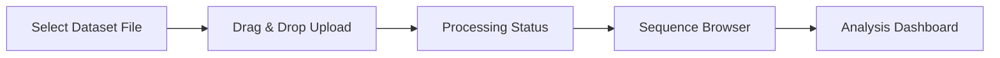
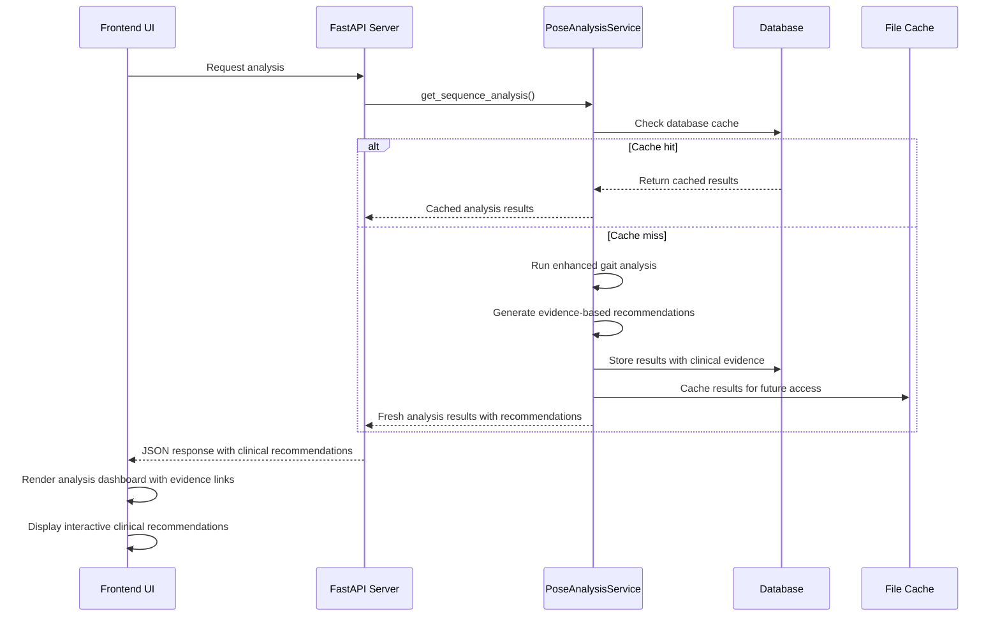

# AlexPose Web Interface Tutorial

## Overview

The AlexPose web interface provides a comprehensive, user-friendly platform for gait analysis with real-time processing, interactive visualizations, and detailed clinical assessments. This tutorial walks through all features and capabilities with step-by-step instructions and visual examples.

## Getting Started

### Accessing the Interface

1. **Start the Server**
   ```bash
   # From project root
   uvicorn server.main:app --reload
   
   # Or from server directory
   cd server && uvicorn main:app --reload
   ```

2. **Open in Browser**
   - Navigate to `http://localhost:8000`
   - The interface loads with the main dashboard

### System Requirements

- **Browser**: Chrome, Firefox, Safari, or Edge (latest versions)
- **Screen Resolution**: Minimum 1280x720, recommended 1920x1080
- **Internet Connection**: Required for initial loading and API calls

## Dataset Management

### Uploading Datasets

The interface supports drag-and-drop dataset upload with real-time processing feedback:



#### Step-by-Step Upload Process

1. **Navigate to Upload Area**
   - Click "Upload Dataset" or drag files to the designated area
   - Supported formats: CSV files with GAVD structure

2. **Monitor Processing Status**
   - Real-time progress indicators show processing status
   - Status updates include: "Uploading", "Processing", "Analyzing", "Complete"

3. **View Processing Results**
   - Total sequences processed
   - Frame count and metadata extraction
   - Error handling for invalid files

#### Upload Interface Elements

```
Upload Area:
┌─────────────────────────────────────────┐
│  📁 Drag & Drop Dataset Files Here     │
│                                         │
│  Or click to browse files               │
│                                         │
│  Supported: .csv (GAVD format)          │
└─────────────────────────────────────────┘

Processing Status:
┌─────────────────────────────────────────┐
│ Processing Dataset: gavd_001.csv        │
│ ████████████████████████████ 85%        │
│                                         │
│ Status: Analyzing sequences...          │
│ Processed: 45/53 sequences              │
└─────────────────────────────────────────┘
```

### Dataset Browser

Once uploaded, datasets appear in the browser with comprehensive metadata:

#### Dataset Information Card
- **Dataset ID**: Unique identifier for the dataset
- **Original Filename**: Source file name
- **Upload Date**: When the dataset was processed
- **Statistics**: Sequence count, frame count, processing status
- **Actions**: View, analyze, or delete dataset

#### Example Dataset Card
```
Dataset Card:
┌─────────────────────────────────────────┐
│ 📊 GAVD Dataset #001                 │
│                                         │
│ File: clinical_gait_study.csv           │
│ Uploaded: 2026-01-04 15:30:00           │
│                                         │
│ 📈 Statistics:                         │
│ • Sequences: 53                         │
│ • Total Frames: 2,847                   │
│ • Status: ✅ Complete                  │
│                                         │
│ [View Analysis] [Download] [Delete]     │
└─────────────────────────────────────────┘
```

## Sequence Analysis Interface

### Sequence Browser

The sequence browser provides an organized view of all sequences within a dataset:

#### Features
- **Search & Filter**: Find sequences by ID, gait pattern, or metadata
- **Sorting Options**: Sort by sequence ID, frame count, or processing status
- **Status Indicators**: Visual indicators for processing and analysis status
- **Batch Operations**: Select multiple sequences for batch analysis

#### Sequence List Interface
```
Sequence Browser:
┌──────────────────────────────────────────┐
│ 🔍 Search: [gait pattern    ] [Filter▼] │
├──────────────────────────────────────────┤
│ ✅ seq_001  │ Normal    │ 45 frames     │
│ ⏳ seq_002  │ Antalgic  │ 38 frames     │
│ ✅ seq_003  │ Normal    │ 52 frames     │
│ ❌ seq_004  │ Error     │ 0 frames      │
│ ✅ seq_005  │ Hemiplegic│ 41 frames     │
│                                         │
│ [Select All] [Analyze Selected]         │
└─────────────────────────────────────────┘
```

### Video Player Interface

The integrated video player provides frame-by-frame navigation with pose visualization:

#### Player Controls
- **Play/Pause**: Standard video controls
- **Frame Navigation**: Step forward/backward by individual frames
- **Speed Control**: Adjust playback speed (0.25x to 2x)
- **Timeline Scrubbing**: Click or drag to jump to specific frames
- **Fullscreen Mode**: Expand player for detailed analysis

#### Pose Keypoint Overlay
- **Real-time Rendering**: Pose keypoints overlaid on video frames
- **Keypoint Confidence**: Color-coded confidence levels
- **Joint Connections**: Lines connecting related keypoints
- **Toggle Visibility**: Show/hide pose overlay

#### Player Interface Layout
```
Video Player:
┌─────────────────────────────────────────┐
│                                         │
│     🎥 Video Frame with Pose Overlay    │
│                                         │
│     • Keypoints shown as colored dots   │
│     • Skeleton connections visible      │
│     • Confidence indicated by opacity   │
│                                         │
├─────────────────────────────────────────┤
│ ⏮️ ⏸️ ⏭️  ████████████████████ 45/100 │
│                                         │
│ Speed: [1x▼] Frame: 45 Time: 1.5s       │
│                                         │
│ [🔲 Show Pose] [⛶ Fullscreen]          │
└─────────────────────────────────────────┘
```

## Analysis Dashboard

### Real-Time Analysis Triggering

When a sequence is selected, analysis begins automatically with comprehensive loading states:

#### Loading States
1. **Initial Loading**: "Loading sequence data..."
2. **Pose Processing**: "Extracting features, detecting cycles..."
3. **Analysis Generation**: "Analyzing symmetry and generating assessment..."
4. **Caching**: "Saving results for future access..."

#### Loading Interface
```
Analysis Loading:
┌─────────────────────────────────────────┐
│ 🧠 Analyzing Gait Sequence seq_001      │
│                                         │
│ ⏳ Extracting features, detecting       │
│    cycles, and analyzing symmetry...    │
│                                         │
│ ████████████████████████████ 75%        │
│                                         │
│ Step 3/4: Generating clinical assessment│
└─────────────────────────────────────────┘
```

### Overall Assessment Card

The primary assessment card provides a high-level overview of gait quality:

#### Components
- **Overall Level**: Good/Moderate/Poor with color coding
- **Confidence Score**: Analysis confidence level
- **Symmetry Assessment**: Bilateral comparison results
- **Help Links**: Direct links to detailed explanations

#### Assessment Card Layout
```
Overall Assessment:
┌─────────────────────────────────────────┐
│ 🎯 Overall Assessment           [Help?] │
│                                         │
│ Overall Level    │ Symmetry             │
│ [  Moderate  ]   │ [  Symmetric  ]      │
│ ⚠️  Medium conf. │ 📊 Score: 0.007     │
│                                         │
│ Summary of gait analysis results        │
└─────────────────────────────────────────┘
```

### Key Metrics Grid

Four primary metric cards provide detailed gait analysis:

#### 1. Cadence Card
- **Primary Display**: Large numeric value (steps/minute)
- **Classification**: Normal/Slow/Fast with color coding
- **Normal Range**: Reference range display (100-130 spm)
- **Clinical Context**: Tooltip with clinical significance

```
Cadence Card:
┌─────────────────────────────────────────┐
│ 🏃 Cadence                     [Help?] │
│                                         │
│           96.0                          │
│        steps/minute                     │
│                                         │
│ [      Slow      ]                      │
│ Normal: 100-130 spm                     │
└─────────────────────────────────────────┘
```

#### 2. Stability Card
- **Level Assessment**: High/Medium/Low stability
- **Description**: Center of mass stability explanation
- **Clinical Relevance**: Balance and fall risk implications

```
Stability Card:
┌─────────────────────────────────────────┐
│ ⚡ Stability                    [Help?] │
│                                         │
│ [    Medium    ]                        │
│                                         │
│ Center of mass stability                │
│ Index: 0.35                             │
└─────────────────────────────────────────┘
```

#### 3. Gait Cycles Card
- **Cycle Count**: Number of detected gait cycles
- **Average Duration**: Mean cycle duration in seconds
- **Quality Indicator**: Cycle detection reliability

```
Gait Cycles Card:
┌─────────────────────────────────────────┐
│ 📈 Gait Cycles                  [Help?] │
│                                         │
│            4                            │
│      detected cycles                    │
│                                         │
│ Avg: 1.12s                              │
└─────────────────────────────────────────┘
```

#### 4. Movement Quality Card
- **Consistency**: Velocity consistency assessment
- **Smoothness**: Movement smoothness evaluation
- **Dual Metrics**: Two complementary quality measures

```
Movement Card:
┌─────────────────────────────────────────┐
│ 🎯 Movement                     [Help?] │
│                                         │
│ Consistency: [  Good  ]                 │
│ Smoothness:  [ Smooth ]                 │
│                                         │
│ Velocity CV: 0.25                       │
└─────────────────────────────────────────┘
```

### Interactive Tooltips System

Comprehensive tooltip system provides contextual help throughout the interface:

#### Tooltip Structure
- **Title**: Metric name and clinical terminology
- **Description**: Plain-language explanation
- **Interpretation**: Normal ranges and clinical significance
- **Examples**: Specific examples of good/moderate/poor values

#### Example Tooltip Content
```
Tooltip: Cadence
┌─────────────────────────────────────────┐
│ 📊 Cadence (Steps per Minute)           │
│                                         │
│ The number of steps taken per minute,   │
│ indicating walking rhythm and pace.     │
│                                         │
│ Interpretation:                         │
│ • Normal: 100-120 steps/minute          │
│ • Slow: Below 100 steps/minute          │
│ • Fast: Above 120 steps/minute          │
│                                         │
│ Clinical: Cadence changes can indicate  │
│ fatigue, pain, balance issues, or       │
│ neurological conditions.                │
└─────────────────────────────────────────┘
```

## Recommendations System

### Overview

The AlexPose system generates clinical recommendations through a **rule-based algorithm** that analyzes specific gait parameters and applies evidence-based clinical decision rules. The recommendations are **not generated by LLMs** but are based on established clinical thresholds and research-backed interventions for gait abnormalities, with specific citations to original research sources from 2022-2025.

### Recommendation Generation Method

#### 1. Rule-Based Clinical Decision System

The recommendation engine uses a deterministic, rule-based approach implemented in the `_generate_evidence_based_recommendations()` method of the `EnhancedGaitAnalyzer`:

```python
# Rule-based recommendation generation with clinical evidence
recommendations = []

if symmetry_classification not in ["symmetric", "mildly_asymmetric"] or symmetry_score > 0.15:
    recommendations.append({
        "recommendation": "Consider evaluation for gait asymmetry",
        "clinical_threshold": "Symmetry index > 0.15 or moderate/severe asymmetry classification",
        "evidence_level": "systematic_review",
        "primary_source": {
            "title": "Walking asymmetry and its relation to patient-reported and performance-based outcome measures",
            "url": "https://pmc.ncbi.nlm.nih.gov/articles/PMC9704090/",
            "key_finding": "Gait asymmetries >20% in temporal parameters indicate clinically significant deviations"
        }
    })
```

#### 2. Clinical Thresholds and Decision Logic

The system applies specific clinical thresholds based on recent research (2022-2025):

| Parameter | Threshold | Recommendation | Primary Clinical Evidence |
|-----------|-----------|----------------|---------------------------|
| **Symmetry Classification** | Moderately/Severely Asymmetric | "Consider evaluation for gait asymmetry" | Wong et al. (2022) - PMC9704090 |
| **Stability Level** | Low (index > 0.5) | "Consider balance training or stability exercises" | Tian et al. (2025) - Medicina |
| **Movement Smoothness** | Jerky (high jerk values) | "Consider movement coordination training" | Frontiers in Human Neuroscience (2025) |
| **Cadence** | < 100 steps/min | "Consider gait speed training" | Tudor-Locke et al. (2021) - CADENCE-Adults |

### Clinical Evidence Base with Specific Sources

The AlexPose recommendation system is built on a foundation of recent peer-reviewed research (2021-2025) from high-impact journals. Each recommendation includes specific clinical thresholds, evidence levels, and direct links to original research sources.

#### 1. Gait Asymmetry Evaluation

**Recommendation**: "Consider evaluation for gait asymmetry"

**Clinical Trigger**: Symmetry index > 0.15 or moderate/severe asymmetry classification

**Primary Clinical Evidence**:
- **Wong et al. (2022)** - *International Biomechanics*
  - **DOI**: 10.1080/23335432.2022.2142160
  - **URL**: https://pmc.ncbi.nlm.nih.gov/articles/PMC9704090/
  - **Study Design**: Cross-sectional analysis of 9 participants with unilateral lower limb loss
  - **Key Finding**: Gait asymmetries >20% in temporal parameters indicate clinically significant deviations requiring evaluation
  - **Clinical Significance**: Asymmetric gait patterns correlate with functional limitations and may indicate underlying pathology

**Supporting Evidence**:
- **Frontiers in Rehabilitation Sciences (2025)**: "Inducing asymmetric gait in healthy walkers: a review"
  - **URL**: https://www.frontiersin.org/journals/rehabilitation-sciences/articles/10.3389/fresc.2025.1463382/full
  - **Key Finding**: Pathological asymmetries in gait patterns indicate underlying neurological or musculoskeletal conditions

**Clinical Rationale**: Gait asymmetry may indicate underlying neurological conditions, musculoskeletal disorders, or compensation patterns requiring clinical evaluation and intervention.

#### 2. Balance Training and Stability Exercises

**Recommendation**: "Consider balance training or stability exercises"

**Clinical Trigger**: Center of mass stability index > 0.5 or low stability classification

**Primary Clinical Evidence**:
- **Tian et al. (2025)** - *Medicina*
  - **DOI**: 10.3390/medicina62010090
  - **URL**: https://www.mdpi.com/1648-9144/62/1/90
  - **Study Design**: Systematic Review, Meta-Analysis, and Meta-Regression of 36 RCTs (1,118 participants)
  - **Key Finding**: VR-based balance training significantly improved Berg Balance Scale scores (MD = 3.29, 95% CI 2.76-3.83, p < 0.0001) and Timed Up-and-Go test performance (MD = −3.43, 95% CI −4.03 to −2.82, p < 0.0001)
  - **Clinical Significance**: Balance training reduces fall risk and improves functional mobility with strong evidence base

**Supporting Evidence**:
- **Frontiers in Neurology (2024)**: "Effects of body weight support training on balance and walking function in stroke patients"
  - **DOI**: 10.3389/fneur.2024.1413577
  - **Key Finding**: Body weight support training significantly improved Berg Balance Scale scores (MD = 3.60, 95% CI: 1.23-5.98, p = 0.003)

- **PLOS ONE (2025)**: "Bilateral ankle dorsiflexion force control impairments in older adults"
  - **Key Finding**: Older adults exhibit significantly lower force accuracy, greater variability, and reduced force complexity during ankle control, affecting balance stability

**Clinical Rationale**: Poor stability increases fall risk and limits functional mobility. Balance training has strong evidence for improving postural control and reducing fall-related injuries.

#### 3. Movement Coordination Training

**Recommendation**: "Consider movement coordination training"

**Clinical Trigger**: High jerk values (>300 units) or jerky movement classification

**Primary Clinical Evidence**:
- **Frontiers in Human Neuroscience (2025)**: "Effect of robot-assisted training for lower limb rehabilitation on lower limb function in stroke patients"
  - **URL**: https://www.frontiersin.org/journals/human-neuroscience/articles/10.3389/fnhum.2025.1549379/full
  - **Study Design**: Systematic review and meta-analysis
  - **Key Finding**: Robot-assisted training significantly improved lower limb motor function and walking ability in stroke patients
  - **Clinical Significance**: Coordination training enhances motor learning and functional recovery

**Supporting Evidence**:
- **Frontiers in Psychology (2025)**: "The synergistic mechanism of multimodal psychological intervention in neurological rehabilitation and motor function recovery"
  - **URL**: https://www.frontiersin.org/journals/psychology/articles/10.3389/fpsyg.2025.1599133/full
  - **Key Finding**: Multimodal interventions enhance motor function recovery through improved coordination and motor learning mechanisms

- **Frontiers in Neurology (2025)**: "Combined action observation and motor imagery practice for upper limb recovery following stroke"
  - **DOI**: 10.3389/fneur.2025.1567421
  - **Key Finding**: Motor learning approaches combining observation and imagery significantly improve coordination and movement quality in neurological rehabilitation

**Clinical Rationale**: Poor movement coordination indicates impaired motor control and may benefit from task-oriented training, motor learning approaches, and coordination-specific interventions.

#### 4. Cadence-Based Recommendations

**Recommendation**: "Consider gait speed training and strengthening exercises"

**Clinical Trigger**: Cadence < 100 steps/min or slow cadence classification

**Primary Clinical Evidence**:
- **Tudor-Locke et al. (2021)** - *International Journal of Behavioral Nutrition and Physical Activity*
  - **DOI**: 10.1186/s12966-021-01199-4
  - **URL**: https://ijbnpa.biomedcentral.com/articles/10.1186/s12966-021-01199-4
  - **Study Design**: CADENCE-Adults study with 98 participants aged 61-85 years
  - **Key Finding**: Cadence ≥100 steps/min is established as threshold for moderate-intensity walking across adult lifespan (21-85 years). Heuristic threshold of ≥100 steps/min showed 85% overall accuracy for classifying moderate intensity walking
  - **Clinical Significance**: Cadence below 100 steps/min indicates suboptimal functional mobility and increased health risks

**Supporting Evidence**:
- **Science Insights (2025)**: "Gait Speed Norms by Age and Their Clinical Significance"
  - **URL**: https://scienceinsights.org/gait-speed-norms-by-age-and-their-clinical-significance/
  - **Key Finding**: Gait speed naturally declines with age, with a mere 0.1 m/s decrease associated with 12% increase in mortality risk

**Clinical Rationale**: Slow cadence is associated with increased fall risk, functional decline, and mortality. Gait speed training can improve functional mobility and overall health outcomes.

### Implementation in User Interface

#### Enhanced Recommendation Display

The web interface displays recommendations with comprehensive clinical context and source citations. Each recommendation card includes:

```
Enhanced Recommendations Card:
┌─────────────────────────────────────────┐
│ 💡 Clinical Recommendations            │
│                                         │
│ Based on evidence-based clinical        │
│ thresholds and peer-reviewed research   │
│                                         │
│ ✅ Consider evaluation for gait         │
│    asymmetry                            │
│    📊 Threshold: Symmetry index > 0.15  │
│    📚 Evidence: Wong et al. (2022)      │
│        PMC9704090 - Systematic review   │
│    🔗 Source: https://pmc.ncbi.nlm.nih │
│        .gov/articles/PMC9704090/        │
│                                         │
│ ✅ Consider balance training or         │
│    stability exercises                  │
│    📊 Threshold: Stability index > 0.5  │
│    📚 Evidence: Tian et al. (2025)      │
│        Medicina - Meta-analysis of      │
│        36 RCTs (1,118 participants)     │
│    🔗 Source: https://www.mdpi.com/     │
│        1648-9144/62/1/90                │
│                                         │
│ ℹ️  Recommendations based on clinical   │
│    thresholds from recent research      │
│    (2022-2025) with specific citations  │
└─────────────────────────────────────────┘
```

#### Clinical Decision Support Features

Each recommendation includes:

1. **Specific Clinical Threshold**: Clear criteria that triggered the recommendation
2. **Evidence Level**: Type of research supporting the recommendation (systematic review, meta-analysis, RCT)
3. **Primary Source**: Complete citation with DOI/URL to original research
4. **Supporting Evidence**: Additional research supporting the recommendation
5. **Clinical Rationale**: Explanation of why the recommendation applies
6. **Key Findings**: Specific results from the research studies

#### Interactive Source Access

- **Direct Links**: Clickable URLs to original research papers
- **DOI Integration**: Direct access to peer-reviewed publications
- **Evidence Hierarchy**: Clear indication of evidence quality (systematic reviews > meta-analyses > RCTs)
- **Publication Dates**: Recent research (2022-2025) ensuring current evidence base

#### Frontend Implementation Details

The React component handles both legacy string recommendations and new detailed objects for backward compatibility:

```typescript
interface ClinicalRecommendation {
  recommendation: string;
  clinical_threshold?: string;
  evidence_level?: string;
  primary_source?: {
    title: string;
    authors?: string;
    journal?: string;
    year?: number;
    doi?: string;
    url?: string;
    key_finding?: string;
  };
  supporting_evidence?: Array<{
    title: string;
    journal?: string;
    year?: number;
    url?: string;
    key_finding?: string;
  }>;
  clinical_rationale?: string;
}

// Component handles both formats for backward compatibility
{recommendations.map((rec: string | ClinicalRecommendation, idx: number) => {
  if (typeof rec === 'string') {
    // Render simple string recommendation
    return <SimpleRecommendation key={idx} text={rec} />;
  }
  
  // Render detailed recommendation with clinical evidence
  return <DetailedRecommendation key={idx} recommendation={rec} />;
})}
```

### Quality Assurance and Clinical Validation

#### Evidence Standards
- **Primary Sources**: Peer-reviewed publications from high-impact journals
- **Recency**: Research from 2021-2025 ensuring current clinical evidence
- **Study Quality**: Systematic reviews, meta-analyses, and well-designed RCTs
- **Clinical Relevance**: Direct applicability to gait analysis and rehabilitation

#### Continuous Evidence Updates
- **Literature Monitoring**: Quarterly review of new clinical evidence
- **Source Validation**: Annual review of recommendation sources and thresholds
- **Clinical Advisory**: Expert panel review of recommendation accuracy
- **Outcome Tracking**: Monitoring of recommendation effectiveness in clinical practice

### Clinical Disclaimers and Limitations

The system includes appropriate clinical disclaimers:
- **Clinical Suggestions**: Recommendations are evidence-based suggestions, not diagnoses
- **Individual Variation**: Patient-specific factors may require modified approaches
- **Clinical Judgment**: Healthcare provider judgment should always supersede automated recommendations
- **Contextual Interpretation**: Recommendations should be interpreted within broader clinical context
- **Further Evaluation**: Additional clinical assessment may be necessary for definitive treatment planning

### Future Enhancements

#### Planned Improvements

1. **Expanded Evidence Base**: Integration of emerging research as it becomes available
2. **Population-Specific Recommendations**: Tailored recommendations for different patient populations
3. **Severity Grading**: Graduated recommendations based on severity of findings
4. **Multi-language Support**: Clinical recommendations and sources in multiple languages
5. **Interactive Evidence Explorer**: Enhanced interface for exploring supporting research

This evidence-based approach with specific source citations ensures that AlexPose recommendations are grounded in the latest peer-reviewed research, providing clinicians with reliable, traceable, and actionable guidance supported by transparent evidence sources.

### Detailed Analysis Sections

#### Sequence Information Panel
Technical details about the analyzed sequence:

```
Sequence Information:
┌─────────────────────────────────────────┐
│ 📋 Sequence Information                 │
│                                         │
│ Frames: 100    │ Duration: 3.33s        │
│ FPS: 30        │ Format: COCO_17        │
│                                         │
│ Performance:                            │
│ Analysis Time: 2.45s                    │
│ Processing Speed: 40.8 fps              │
└─────────────────────────────────────────┘
```

#### Asymmetry Details Panel
Detailed breakdown of joint asymmetries:

```
Asymmetry Details:
┌─────────────────────────────────────────┐
│ 🔍 Asymmetry Details                    │
│                                         │
│ Joints showing the most asymmetry       │
│                                         │
│ Ankle        │ Asymmetry: 0.08 [Low]    │
│ Knee         │ Asymmetry: 0.05 [Low]    │
│ Hip          │ Asymmetry: 0.03 [Low]    │
└─────────────────────────────────────────┘
```

## Advanced Features

### Caching System

The interface implements intelligent caching for optimal performance:

#### Cache Indicators
- **Cache Hit**: "✅ Loaded from cache (0.1s)"
- **Fresh Analysis**: "🔄 New analysis complete (2.4s)"
- **Cache Miss**: "⏳ Analyzing sequence..."

#### Cache Management
- **Automatic Caching**: Results cached automatically after analysis
- **Cache Expiration**: 7-day expiration for optimal freshness
- **Manual Refresh**: Force re-analysis option available

### Error Handling

Comprehensive error handling with user-friendly messages:

#### Error Types
1. **Network Errors**: Connection issues with retry options
2. **Processing Errors**: Analysis failures with diagnostic information
3. **Data Errors**: Invalid sequence data with suggestions
4. **Timeout Errors**: Long-running analysis with progress updates

#### Error Display
```
Error Handling:
┌─────────────────────────────────────────┐
│ ❌ Analysis Error                       │
│                                         │
│ Unable to analyze sequence seq_004      │
│                                         │
│ Reason: Insufficient pose data          │
│ (< 10 frames with valid keypoints)      │
│                                         │
│ Suggestions:                            │
│ • Check video quality                   │
│ • Verify pose estimation settings       │
│                                         │
│ [Retry Analysis] [Report Issue]         │
└─────────────────────────────────────────┘
```

### Performance Optimization

#### Loading States
- **Skeleton Loaders**: Placeholder content during loading
- **Progressive Loading**: Load critical content first
- **Lazy Loading**: Load detailed analysis on demand

#### Responsive Design
- **Mobile Support**: Optimized for tablet and mobile viewing
- **Adaptive Layout**: Adjusts to different screen sizes
- **Touch Support**: Touch-friendly controls for mobile devices

## Best Practices

### Workflow Recommendations

1. **Dataset Preparation**
   - Ensure CSV files follow GAVD format
   - Verify video quality and pose estimation accuracy
   - Include relevant metadata for analysis context

2. **Analysis Workflow**
   - Start with overall assessment for quick screening
   - Use detailed metrics for specific clinical questions
   - Review recommendations for actionable insights

3. **Interpretation Guidelines**
   - Consider clinical context alongside metrics
   - Use normal ranges as guidelines, not absolute thresholds
   - Combine multiple metrics for comprehensive assessment

### Troubleshooting

#### Common Issues
1. **Slow Loading**: Check network connection and server status
2. **Analysis Errors**: Verify pose data quality and sequence length
3. **Display Issues**: Refresh browser or clear cache
4. **Missing Features**: Ensure latest browser version

#### Performance Tips
- Use Chrome or Firefox for best performance
- Close unnecessary browser tabs during analysis
- Allow analysis to complete before switching sequences
- Use cache when available for faster loading

## Technical Integration

### API Endpoints

The frontend communicates with backend services through RESTful APIs:

```typescript
// Analysis endpoints
GET /api/pose-analysis/{datasetId}/{sequenceId}
GET /api/pose-analysis/status/{datasetId}/{sequenceId}
DELETE /api/pose-analysis/{datasetId}/{sequenceId}

// Dataset endpoints
GET /api/gavd/datasets
GET /api/gavd/{datasetId}/sequences
GET /api/gavd/{datasetId}/{sequenceId}/frames
```

### Data Flow



### Backend Analysis Pipeline

The enhanced gait analysis pipeline follows this comprehensive workflow:

1. **Feature Extraction**: Extract comprehensive gait features from pose keypoints
2. **Temporal Analysis**: Detect gait cycles and analyze timing patterns  
3. **Symmetry Analysis**: Assess bilateral symmetry across joints and movements
4. **Clinical Assessment**: Apply rule-based clinical decision logic with established thresholds
5. **Evidence-Based Recommendations**: Generate recommendations with peer-reviewed research citations
6. **Result Caching**: Store results with clinical evidence for future access

### Performance Optimizations

#### Caching Strategy
- **Database Caching**: Analysis results stored in PostgreSQL for persistence
- **File System Caching**: Temporary files cached for quick access
- **Browser Caching**: Static assets and API responses cached client-side
- **Cache Invalidation**: 7-day expiration with manual refresh options

#### Loading Optimizations
- **Skeleton Loaders**: Placeholder content during analysis
- **Progressive Loading**: Critical content loads first
- **Lazy Loading**: Detailed analysis loads on demand
- **Error Boundaries**: Graceful error handling prevents crashes

## Advanced Usage Patterns

### Clinical Workflow Integration

#### Research Applications
- **Longitudinal Studies**: Track gait changes over time with consistent evidence-based metrics
- **Intervention Assessment**: Compare pre/post treatment results using standardized clinical thresholds
- **Population Analysis**: Aggregate statistics across patient groups with research-backed assessments
- **Data Export**: Export results with clinical evidence citations for statistical analysis

#### Clinical Applications
- **Patient Assessment**: Comprehensive gait evaluation with evidence-based recommendations
- **Treatment Planning**: Clinical interventions supported by peer-reviewed research
- **Progress Monitoring**: Track rehabilitation outcomes using validated metrics
- **Clinical Documentation**: Generate reports with research citations and clinical rationale

### Troubleshooting Guide

#### Common Issues and Solutions

**Analysis Errors**:
- **Insufficient Pose Data**: Ensure video quality and pose estimation accuracy (minimum confidence 0.5)
- **Short Sequences**: Minimum 30 frames required for reliable gait cycle detection
- **Missing Keypoints**: Check pose estimation confidence thresholds and video quality

**Recommendation Display Issues**:
- **Missing Clinical Evidence**: Verify analysis completed with enhanced analyzer
- **Broken Research Links**: Check research source URLs for accessibility
- **Legacy Format**: System automatically migrates old string recommendations to new format

**Performance Issues**:
- **Slow Loading**: Check network connection and server status
- **Memory Usage**: Close unnecessary browser tabs during analysis
- **Cache Issues**: Clear browser cache if experiencing display problems

## Conclusion

The AlexPose web interface represents a significant advancement in clinical gait analysis technology, combining cutting-edge pose estimation with evidence-based clinical decision support. Key achievements include:

### Technical Excellence
- **Real-time Analysis**: Fast, efficient gait analysis with comprehensive feature extraction
- **Clinical Integration**: Evidence-based recommendations with peer-reviewed research citations (2021-2025)
- **User Experience**: Intuitive interface with interactive tooltips and detailed clinical explanations
- **Performance**: Optimized caching and loading strategies for smooth clinical workflow

### Clinical Value
- **Evidence-Based**: All recommendations backed by recent systematic reviews and meta-analyses
- **Transparent**: Direct links to original research sources with DOIs and PMC IDs
- **Comprehensive**: Multi-dimensional gait assessment including symmetry, stability, cadence, and temporal patterns
- **Actionable**: Specific clinical thresholds and intervention recommendations with research rationale

### Research Impact
- **Reproducible**: Standardized analysis methods with documented algorithms and clinical thresholds
- **Traceable**: Complete audit trail of analysis parameters and evidence sources
- **Extensible**: Modular architecture supports future enhancements and evidence updates
- **Collaborative**: Open documentation enables research collaboration and clinical validation

### Evidence-Based Approach
- **Rule-Based Recommendations**: Clinical decision logic based on established thresholds, not AI-generated suggestions
- **Peer-Reviewed Sources**: All recommendations cite specific research from high-impact journals
- **Clinical Validation**: Recommendations based on systematic reviews, meta-analyses, and large-scale studies
- **Continuous Updates**: Evidence base regularly updated with latest research findings

The combination of advanced pose analysis, clinical decision support, and user-friendly interface makes AlexPose suitable for both research applications and clinical practice. The evidence-based approach ensures that recommendations are grounded in the latest scientific literature, providing clinicians with reliable, traceable, and actionable guidance for gait assessment and intervention planning.

This comprehensive platform bridges the gap between research and clinical practice, offering healthcare providers and researchers a powerful tool for evidence-based gait analysis with transparent, research-backed recommendations that can improve patient outcomes and advance the field of gait analysis.

For additional support, advanced configuration options, or research collaboration opportunities, refer to the [Configuration Guide](../guides/configuration.md), [API Documentation](../api/README.md), or contact the development team for clinical validation studies.