# Complete Guide to Gait Analysis: Understanding Human Walking Patterns

**A Tutorial for Students, Researchers, and Healthcare Professionals**

---

## Table of Contents

1. [Introduction: What is Gait Analysis?](#1-introduction-what-is-gait-analysis)
2. [The Science Behind Walking](#2-the-science-behind-walking)
3. [Understanding Gait Features](#3-understanding-gait-features)
4. [Normal vs Abnormal Gait Patterns](#4-normal-vs-abnormal-gait-patterns)
5. [Health Conditions and Gait Signatures](#5-health-conditions-and-gait-signatures)
6. [How AI Analyzes Gait](#6-how-ai-analyzes-gait)
7. [Practical Applications](#7-practical-applications)
8. [Getting Started with Gait Analysis](#8-getting-started-with-gait-analysis)
9. [References and Further Reading](#9-references-and-further-reading)

---

## 1. Introduction: What is Gait Analysis?

### What is Gait?

**Gait** is simply the pattern of how we walk. Just like fingerprints, everyone has a unique way of walking that can reveal important information about their health, age, and physical condition.

### Why Study Gait?

Imagine if you could detect health problems just by watching someone walk! That's exactly what gait analysis does. Scientists and doctors have discovered that:

- **Walking speed** can predict life expectancy
- **Asymmetric walking** often indicates injury or neurological problems
- **Shuffling steps** might be an early sign of Parkinson's disease
- **Limping patterns** can help diagnose specific injuries

### The Gait Analysis Process

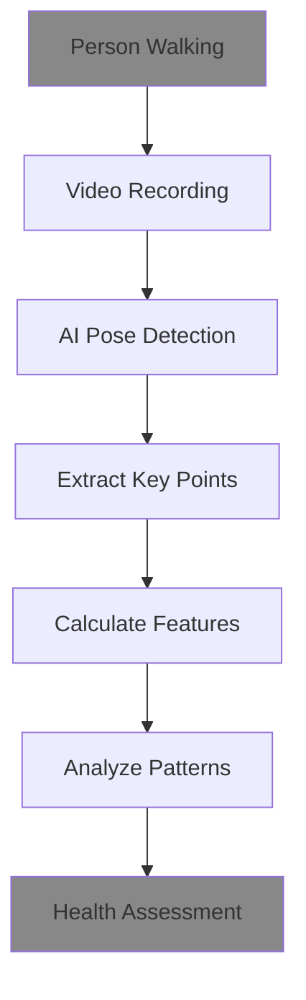

**Real-World Example:** A 75-year-old patient walks slower than usual. Gait analysis reveals their walking speed has dropped from 1.2 m/s to 0.8 m/s over 6 months. This 33% decrease could indicate muscle weakness, balance problems, or early cognitive decline - prompting further medical evaluation.

---

## 2. The Science Behind Walking

### The Gait Cycle: A Step-by-Step Breakdown

Walking might seem simple, but it's actually a complex sequence of coordinated movements. Let's break down what happens during one complete step:

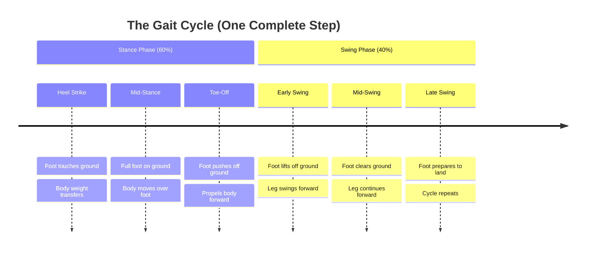

### Key Body Parts in Walking

**1. Joints That Matter Most:**
- **Hip Joint:** Controls leg swing and stability
- **Knee Joint:** Absorbs shock and propels forward
- **Ankle Joint:** Provides push-off power and balance

**2. Normal Joint Angles During Walking:**
- **Hip:** Flexes 0-30° (like lifting your thigh)
- **Knee:** Flexes 0-60° (like bending your knee)
- **Ankle:** Moves 10° up to 20° down (like pointing/flexing your foot)

### The Physics of Walking

Walking is essentially **controlled falling**! Here's how:

1. **Gravity** pulls you forward
2. **Muscles** control the fall
3. **Momentum** carries you to the next step
4. **Balance** keeps you upright

**Fun Fact:** Humans are incredibly efficient walkers. We use only about 25% of the energy that a robot would need to walk the same distance!

---

## 3. Understanding Gait Features

AlexPose analyzes **34 different features** of your walk. Think of these as different "measurements" that together create a complete picture of how you move.

### 3.1 Core Joint Angles (15 Features)

These measure how much your joints bend and move during walking.

#### What We Measure:
- **Mean Angles:** Average position of hip, knee, ankle
- **Range of Motion:** How much each joint moves
- **Asymmetry:** Differences between left and right sides

#### Normal Values:
| Joint | Normal Range | What It Means |
|-------|--------------|---------------|
| Hip | 0-30° flexion | Leg swing forward/back |
| Knee | 0-60° flexion | Shock absorption |
| Ankle | 10° up to 20° down | Push-off power |

#### Clinical Significance:
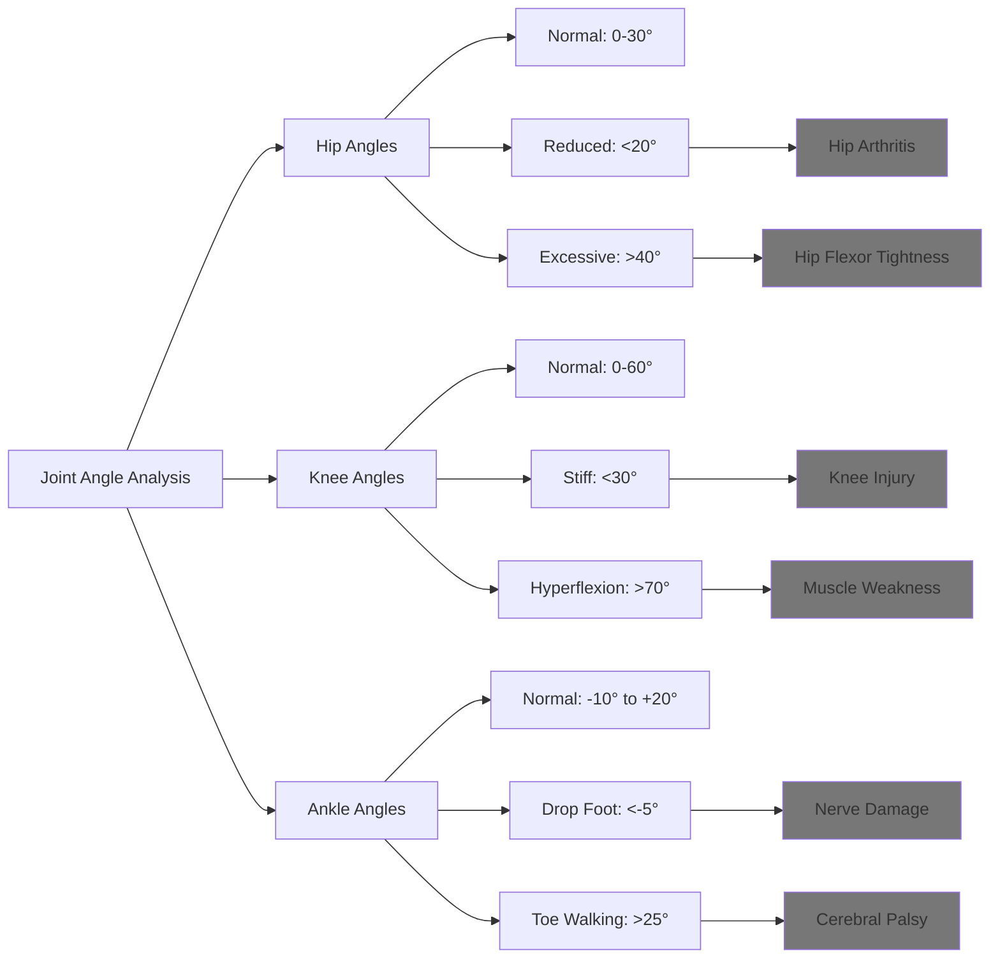

**Real Example:** A soccer player with a knee injury shows reduced knee flexion (25° instead of normal 60°). This suggests they're protecting the injured knee by not bending it fully.

### 3.2 Spatiotemporal Parameters (4 Features)

These measure the **space** (how far) and **time** (how fast) aspects of walking.

#### The "Big Four" Measurements:

**1. Walking Speed (m/s)**
- **Normal:** 1.2-1.4 m/s (about 3 mph)
- **Slow:** <1.0 m/s
- **Fast:** >1.6 m/s

**Clinical Importance:** Walking speed is called the "6th vital sign" because it predicts:
- Life expectancy (0.1 m/s increase = 12% better survival)
- Fall risk
- Cognitive function
- Overall health status

**2. Cadence (steps/minute)**
- **Normal:** 100-120 steps/minute
- **Slow:** <90 steps/minute
- **Fast:** >130 steps/minute

**3. Stride Length (meters)**
- **Normal:** 1.2-1.5 meters (about 4-5 feet)
- **Short:** <1.0 meters
- **Long:** >1.7 meters

**4. Step Width (meters)**
- **Normal:** 0.05-0.15 meters (2-6 inches)
- **Narrow:** <0.05 meters (unstable)
- **Wide:** >0.20 meters (balance problems)

#### Real-World Applications:

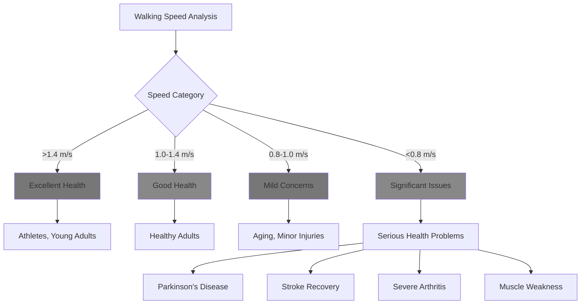

### 3.3 Temporal Phase Features (4 Features)

These measure the **timing** of different parts of your walking cycle.

#### Understanding Stance vs Swing:

**Stance Phase (60% of walking cycle):**
- Your foot is on the ground
- Supporting your body weight
- Providing stability and push-off

**Swing Phase (40% of walking cycle):**
- Your foot is in the air
- Moving forward for the next step
- Clearing the ground

#### Normal Timing:
- **Stance:** 55-65% of gait cycle
- **Swing:** 35-45% of gait cycle
- **Double Support:** 10-20% (both feet on ground)
- **Stance/Swing Ratio:** ~1.5 (60%/40%)

#### What Abnormal Timing Tells Us:

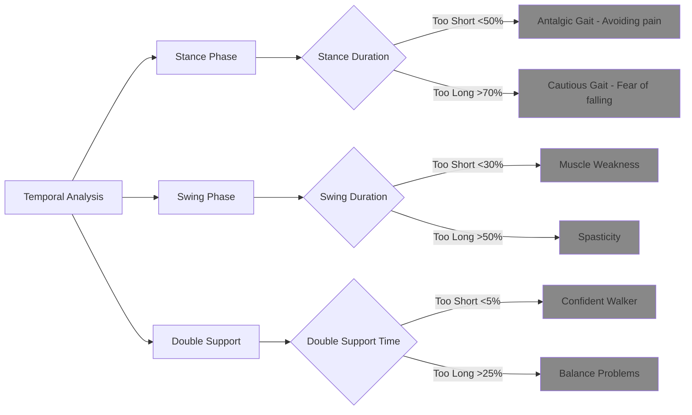

**Real Example:** A patient with ankle pain shows 45% stance phase on the injured side (normal is 60%). This shortened stance time indicates they're quickly getting off the painful foot - a classic sign of antalgic (pain-avoiding) gait.

### 3.4 Symmetry Indices (6 Features)

These measure how **balanced** your walking is between left and right sides.

#### The Symmetry Index Formula:

**SI = (Left - Right) / (0.5 × (Left + Right)) × 100**

This formula gives us a percentage that shows how different the left and right sides are.

#### Interpreting Symmetry Values:

| SI Value | Interpretation | Clinical Meaning |
|----------|----------------|------------------|
| 0-12% | Normal symmetry | Healthy gait |
| 12-16% | Mild asymmetry | Minor issues, monitor |
| 16-25% | Moderate asymmetry | Significant problem |
| >25% | Severe asymmetry | Major pathology |

#### What We Measure Symmetry For:
1. **Stride Length SI:** Are your steps the same length?
2. **Stance Time SI:** Do you spend equal time on each foot?
3. **Swing Time SI:** Do your legs swing forward equally?
4. **Hip Angle SI:** Do your hips move the same way?
5. **Knee Angle SI:** Do your knees bend equally?
6. **Ankle Angle SI:** Do your ankles work the same?

#### Real-World Example:

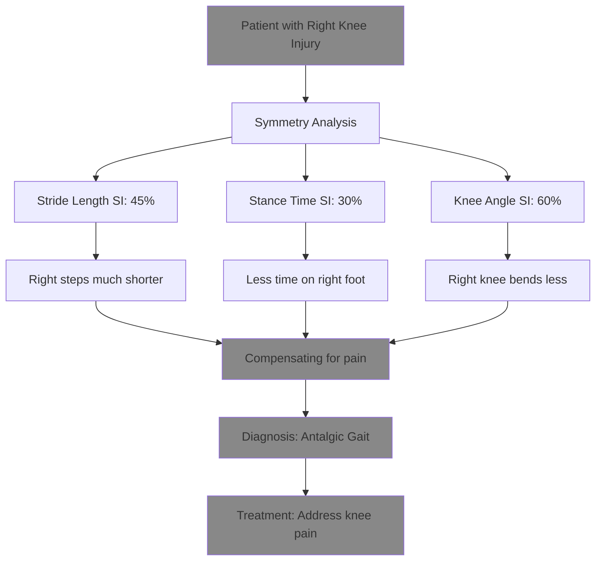

### 3.5 Variability Metrics (3 Features)

These measure how **consistent** your walking is from step to step.

#### Why Variability Matters:
- **Low variability:** Consistent, controlled walking (good)
- **High variability:** Unsteady, unpredictable walking (concerning)

#### What We Measure:
1. **Stride Time CV:** How consistent is your step timing?
2. **Step Length CV:** Are your steps the same length each time?
3. **Stride Velocity CV:** Is your speed consistent?

**CV = Coefficient of Variation = (Standard Deviation / Mean) × 100**

#### Normal Values:
- **Stride Time CV:** <3% (very consistent timing)
- **Step Length CV:** <5% (consistent step size)
- **Stride Velocity CV:** <7% (consistent speed)

#### Clinical Significance:

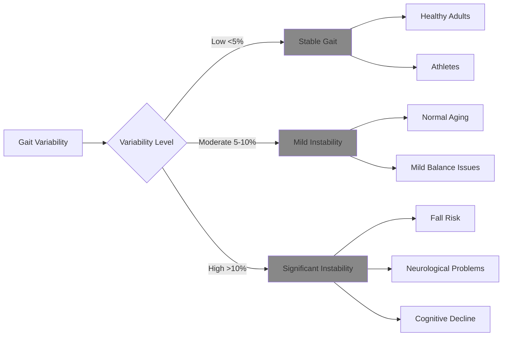

**Research Finding:** Older adults with high gait variability (CV >7%) have 3x higher risk of falling within the next year.

### 3.6 Postural Features (2 Features)

These measure your **body posture** while walking.

#### What We Measure:
1. **Trunk Lean Angle:** How much do you lean forward or to the side?
2. **Pelvic Tilt Mean:** Is your pelvis level or tilted?

#### Normal Values:
- **Trunk Lean:** 0-5° forward lean (slight forward posture is normal)
- **Pelvic Tilt:** 0-3° (nearly level pelvis)

#### Clinical Significance:

**Trunk Lean Patterns:**
- **Forward lean >10°:** Parkinson's disease, balance problems
- **Backward lean:** Fear of falling, muscle weakness
- **Side lean:** Hip problems, leg length difference

**Pelvic Tilt Patterns:**
- **Excessive tilt >5°:** Hip hiking (stroke, leg weakness)
- **Trendelenburg gait:** Hip muscle weakness

---

## 4. Normal vs Abnormal Gait Patterns

### 4.1 What is "Normal" Gait?

Normal gait varies by age, but here are the key characteristics:

#### Healthy Adult Gait (Ages 20-65):
- **Speed:** 1.2-1.4 m/s
- **Cadence:** 100-120 steps/min
- **Stride Length:** 1.2-1.5 m
- **Stance Phase:** 60% ± 5%
- **Swing Phase:** 40% ± 5%
- **Symmetry:** <12% difference between sides
- **Variability:** <5% step-to-step variation

#### Age-Related Changes:

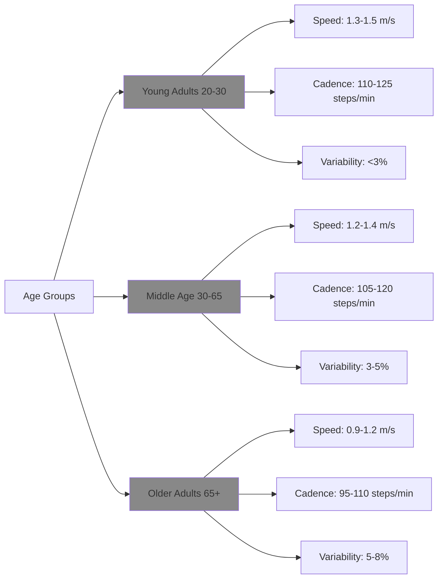

### 4.2 Red Flags: When Gait Becomes Concerning

#### Immediate Concerns (Seek Medical Attention):
- **Walking speed <0.8 m/s** (significant functional decline)
- **Asymmetry >25%** (major injury or neurological issue)
- **Frequent stumbling or falls**
- **Sudden changes in walking pattern**

#### Moderate Concerns (Monitor Closely):
- **Walking speed 0.8-1.0 m/s** (mild decline)
- **Asymmetry 12-25%** (developing problem)
- **Increased step width >20 cm** (balance issues)
- **High variability >10%** (instability)

### 4.3 Common Abnormal Gait Patterns

#### 1. Antalgic Gait (Pain-Avoiding)
**Characteristics:**
- Shortened stance phase on painful side
- Reduced stride length
- Trunk lean toward painful side
- Asymmetric timing

**Typical Values:**
- Stance phase: 40-50% (normal: 60%)
- Stride length SI: 20-50%
- Walking speed: Reduced by 20-40%

#### 2. Trendelenburg Gait (Hip Weakness)
**Characteristics:**
- Hip drops on opposite side during stance
- Trunk lean toward stance leg
- Waddling appearance

**Typical Values:**
- Pelvic tilt: >5° drop
- Step width: Increased >20 cm
- Cadence: Often increased to compensate

#### 3. Steppage Gait (Foot Drop)
**Characteristics:**
- High knee lift to clear foot
- Foot slap on heel strike
- Asymmetric swing phase

**Typical Values:**
- Hip flexion: Increased >40°
- Ankle angle: <-5° (foot drop)
- Swing time SI: >20%

---

## 5. Health Conditions and Gait Signatures

Different health conditions create unique "signatures" in how people walk. Let's explore the most common ones:

### 5.1 Stroke-Related Gait (Hemiplegic Gait)

**What Happens:** Stroke damages brain areas controlling movement, typically affecting one side of the body.

#### Gait Characteristics:

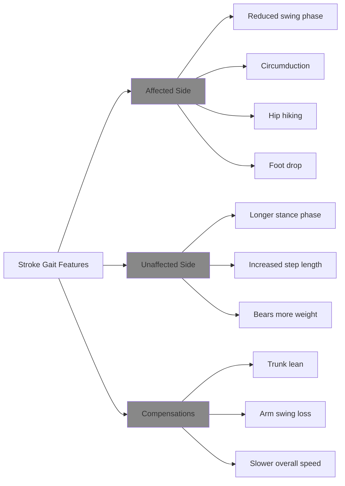

#### Typical Feature Values:
- **Walking Speed:** 0.2-0.8 m/s (severely reduced)
- **Stride Length SI:** 50-150% (massive asymmetry)
- **Stance Time SI:** 30-80% (much longer on unaffected side)
- **Hip Angle SI:** 40-100% (affected hip moves less)
- **Cadence:** 60-90 steps/min (very slow)

#### Progression Tracking:
Gait analysis helps track stroke recovery:
- **Acute phase (0-3 months):** Severe asymmetry, very slow
- **Recovery phase (3-12 months):** Gradual improvement in symmetry
- **Chronic phase (>12 months):** Plateau with residual deficits

**Research Citation:** *Wonsetler & Bowden (2017). A systematic review of mechanisms of gait speed change post-stroke. Topics in Stroke Rehabilitation, 24(5), 358-362.*

### 5.2 Parkinson's Disease Gait

**What Happens:** Parkinson's affects the brain's movement control centers, leading to characteristic movement problems.

#### The Parkinsonian Gait Signature:

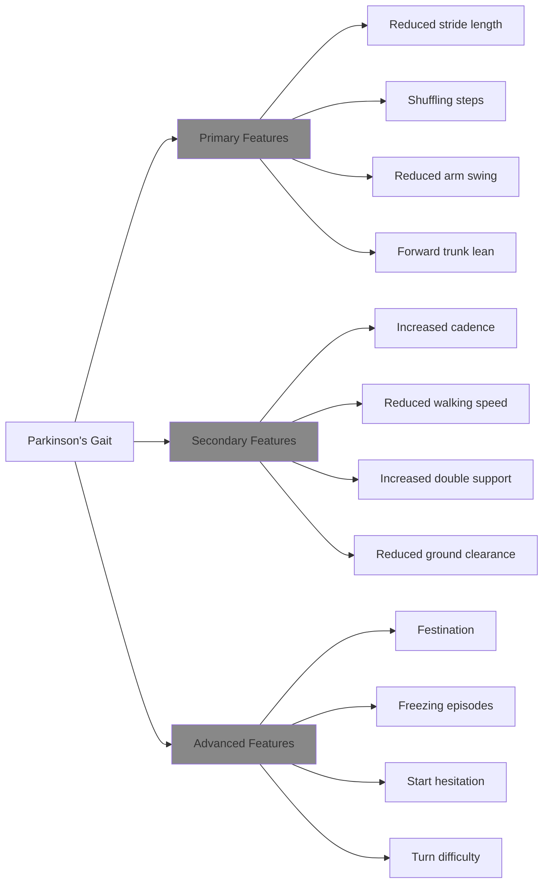

#### Typical Feature Values:
- **Walking Speed:** 0.6-1.0 m/s (moderately reduced)
- **Stride Length:** 0.8-1.1 m (significantly shortened)
- **Cadence:** 110-140 steps/min (increased to compensate)
- **Double Support:** 25-35% (increased for stability)
- **Trunk Lean:** 8-15° forward
- **Variability:** Often increased (CV >8%)

#### Disease Progression:
- **Early stage:** Subtle stride length reduction, mild asymmetry
- **Moderate stage:** Clear shuffling, festination episodes
- **Advanced stage:** Severe mobility limitations, frequent freezing

**Key Research:** *Mirelman et al. (2019). Gait impairments in Parkinson's disease. The Lancet Neurology, 18(7), 697-708.*

### 5.3 Antalgic Gait (Pain-Related)

**What Happens:** Any painful condition affecting the legs, hips, or back causes people to modify their gait to avoid pain.

#### Common Causes:
- Arthritis (hip, knee, ankle)
- Stress fractures
- Muscle strains
- Joint injuries
- Back pain

#### Gait Adaptations:

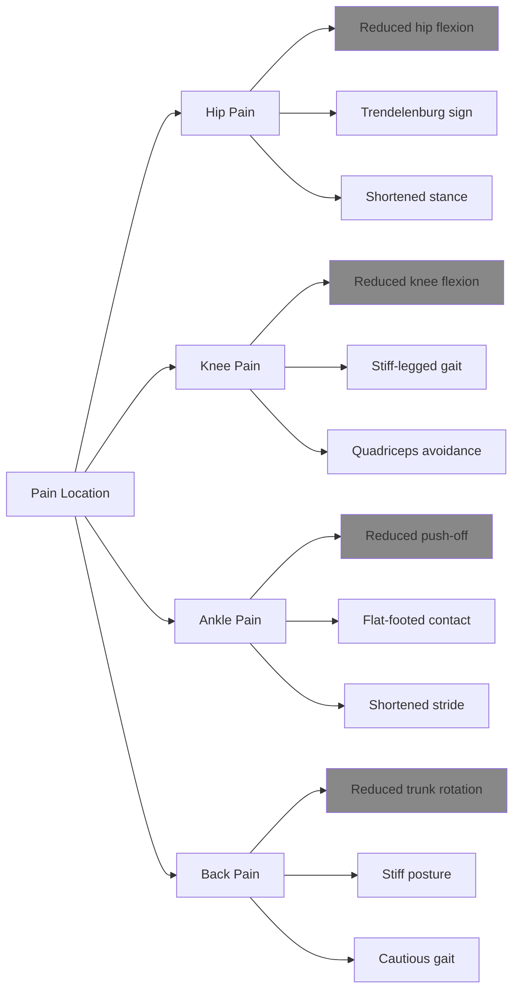

#### Typical Feature Values:
- **Stance Phase:** 40-50% on painful side (normal: 60%)
- **Stride Length SI:** 15-40% (shorter steps on painful side)
- **Walking Speed:** Reduced by 15-30%
- **Trunk Lean:** Toward painful side (5-10°)
- **Cadence:** Often increased (compensatory)

### 5.4 Cerebellar Ataxia (Balance Problems)

**What Happens:** Damage to the cerebellum (brain's balance center) causes coordination problems.

#### Gait Characteristics:
- **Wide-based gait:** Step width >20 cm
- **Irregular timing:** High variability (CV >15%)
- **Unsteady movements:** Swaying, stumbling
- **Difficulty with turns:** Requires multiple steps

#### Typical Feature Values:
- **Step Width:** 0.20-0.35 m (very wide)
- **Stride Time CV:** 10-25% (highly variable)
- **Walking Speed:** 0.7-1.1 m/s (cautiously slow)
- **Double Support:** 20-30% (increased for stability)

### 5.5 Muscular Dystrophy Gait

**What Happens:** Progressive muscle weakness affects walking ability.

#### Gait Characteristics:
- **Waddling gait:** Hip muscle weakness
- **Toe walking:** Calf muscle tightness
- **Trendelenburg sign:** Hip drop
- **Lordotic posture:** Exaggerated back arch

#### Typical Feature Values:
- **Pelvic Tilt:** >8° (excessive hip hiking)
- **Trunk Lean:** Side-to-side waddling
- **Cadence:** Often reduced (muscle fatigue)
- **Step Width:** Increased for stability

---

## 6. How AI Analyzes Gait

### 6.1 The AI Gait Analysis Pipeline

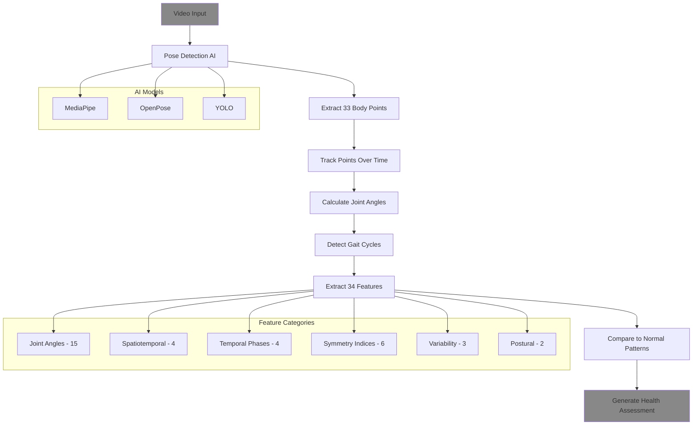

### 6.2 Machine Learning Classification

#### How AI Learns to Recognize Gait Patterns:

**1. Training Phase:**
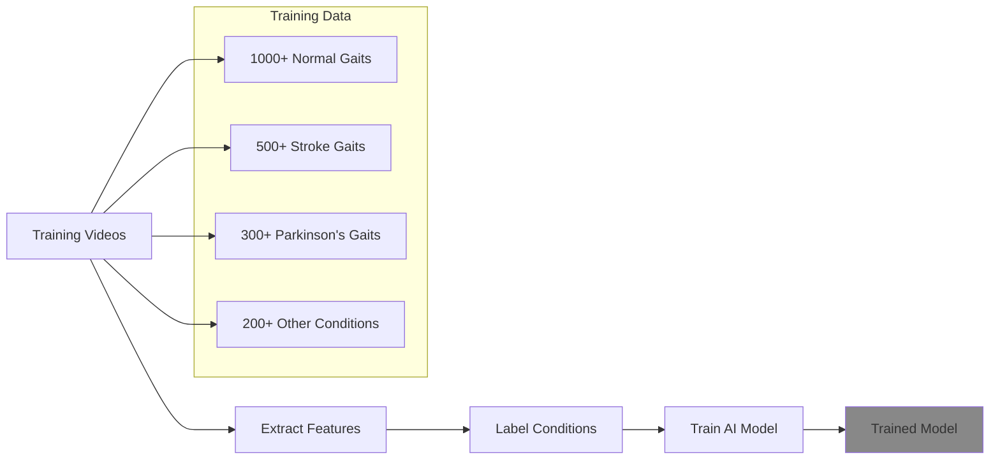

**2. Prediction Phase:**
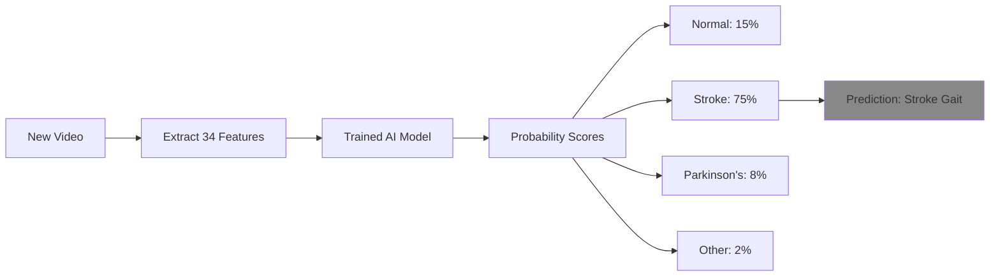

### 6.3 Feature Importance in AI Decisions

Different features have different importance for detecting specific conditions:

#### For Stroke Detection:
1. **Stride Length SI** (most important)
2. **Stance Time SI**
3. **Walking Speed**
4. **Hip Angle SI**
5. **Swing Time SI**

#### For Parkinson's Detection:
1. **Stride Length** (most important)
2. **Walking Speed**
3. **Cadence**
4. **Double Support Time**
5. **Trunk Lean Angle**

#### For Pain Detection (Antalgic):
1. **Stance Phase Percentage** (most important)
2. **Trunk Lean Angle**
3. **Stride Length SI**
4. **Walking Speed**
5. **Stance Time SI**

---

## 7. Practical Applications

### 7.1 Healthcare Applications

#### 1. Early Disease Detection
**Parkinson's Disease:**
- Detect 5-10 years before clinical symptoms
- Monitor disease progression
- Evaluate treatment effectiveness

**Stroke Recovery:**
- Track rehabilitation progress
- Adjust therapy programs
- Predict functional outcomes

#### 2. Fall Risk Assessment
**High-Risk Indicators:**
- Walking speed <1.0 m/s
- High gait variability (CV >7%)
- Wide step width (>20 cm)
- Reduced stride length

**Prevention Programs:**
- Balance training
- Strength exercises
- Gait training
- Environmental modifications

#### 3. Surgical Outcomes
**Pre-Surgery Assessment:**
- Baseline gait measurements
- Surgical planning
- Risk stratification

**Post-Surgery Monitoring:**
- Recovery tracking
- Rehabilitation progress
- Complication detection

### 7.2 Sports and Fitness Applications

#### 1. Injury Prevention
**Biomechanical Analysis:**
- Identify asymmetries before injury
- Monitor training load effects
- Optimize running technique

**Return-to-Sport Decisions:**
- Objective recovery metrics
- Symmetry restoration
- Performance readiness

#### 2. Performance Optimization
**Running Efficiency:**
- Stride length optimization
- Cadence training
- Energy conservation

**Technique Analysis:**
- Form corrections
- Efficiency improvements
- Fatigue monitoring

### 7.3 Research Applications

#### 1. Drug Development
**Clinical Trials:**
- Objective outcome measures
- Treatment effect quantification
- Dose-response relationships

**Biomarker Development:**
- Digital biomarkers
- Disease progression markers
- Treatment response predictors

#### 2. Population Health Studies
**Epidemiological Research:**
- Large-scale gait databases
- Risk factor identification
- Health trend monitoring

---

## 8. Getting Started with Gait Analysis

### 8.1 For Students and Researchers

#### Science Fair Project Ideas:

**Beginner Projects:**
1. **"Does Age Affect Walking Speed?"**
   - Measure walking speed in different age groups
   - Compare with published norms
   - Analyze factors affecting speed

2. **"Left vs Right: Are We Symmetric Walkers?"**
   - Measure step length differences
   - Calculate symmetry indices
   - Investigate causes of asymmetry

3. **"The Effect of Footwear on Gait"**
   - Compare barefoot vs shoe walking
   - Test different shoe types
   - Measure stability and speed changes

**Advanced Projects:**
1. **"Early Detection of Gait Abnormalities"**
   - Develop simple screening tests
   - Use smartphone apps for measurement
   - Create risk assessment tools

2. **"Machine Learning for Gait Classification"**
   - Build simple AI classifiers
   - Train on gait feature data
   - Evaluate classification accuracy

#### Required Equipment:
**Basic Setup:**
- Smartphone with video camera
- Measuring tape
- Stopwatch
- Flat walking surface (10+ meters)

**Advanced Setup:**
- High-speed camera (60+ fps)
- Motion capture software
- Force plates (if available)
- Computer for data analysis

### 8.2 Data Collection Protocol

#### 1. Preparation
- **Environment:** Flat, non-slip surface, good lighting
- **Clothing:** Tight-fitting clothes, minimal shoes
- **Markers:** Optional reflective markers on joints
- **Camera:** Side view, capture full body, 30+ fps

#### 2. Recording Protocol
- **Warm-up:** 2-3 practice walks
- **Distance:** 10-meter walkway minimum
- **Trials:** 3-5 recordings per person
- **Speed:** Natural, comfortable pace
- **Direction:** Both directions if possible

#### 3. Analysis Steps
1. **Extract keypoints** using pose detection software
2. **Calculate joint angles** for each frame
3. **Identify gait cycles** (heel strike to heel strike)
4. **Compute features** for each cycle
5. **Average results** across multiple cycles
6. **Compare to norms** and analyze patterns

### 8.3 Safety and Ethics Considerations

#### Safety Guidelines:
- Clear walkway of obstacles
- Non-slip surface
- Adequate lighting
- Emergency procedures
- Participant screening for mobility issues

#### Ethical Considerations:
- Informed consent from participants
- Privacy protection for video data
- Age-appropriate protocols for minors
- Respect for participants with disabilities
- Data security and storage

---

## 9. References and Further Reading

### 9.1 Key Research Papers

**Foundational Studies:**

1. **Whittle, M. W. (2014).** *Gait Analysis: An Introduction (5th ed.).* Butterworth-Heinemann.
   - Comprehensive textbook on gait analysis fundamentals

2. **Hausdorff, J. M. (2007).** Gait dynamics, fractals and falls: Finding meaning in the stride-to-stride fluctuations of human walking. *Human Movement Science, 26*(4), 555-589.
   - Seminal work on gait variability and fall risk

3. **Studenski, S., et al. (2011).** Gait speed and survival in older adults. *JAMA, 305*(1), 50-58.
   - Established walking speed as "6th vital sign"

**Recent Advances (2020-2025):**

4. **Muro-de-la-Herran, A., et al. (2014).** Gait analysis methods: An overview of wearable and non-wearable systems, highlighting clinical applications. *Sensors, 14*(2), 3362-3394.
   - Comprehensive review of gait analysis technologies

5. **Mirelman, A., et al. (2019).** Gait impairments in Parkinson's disease. *The Lancet Neurology, 18*(7), 697-708.
   - Latest research on Parkinson's gait characteristics

6. **Wonsetler, E. C., & Bowden, M. G. (2017).** A systematic review of mechanisms of gait speed change post-stroke. *Topics in Stroke Rehabilitation, 24*(5), 358-362.
   - Stroke gait recovery mechanisms

**AI and Technology:**

7. **Cao, Z., et al. (2017).** Realtime multi-person 2D pose estimation using part affinity fields. *Proceedings of the IEEE Conference on Computer Vision and Pattern Recognition*, 7291-7299.
   - OpenPose algorithm for pose detection

8. **Bazarevsky, V., et al. (2020).** BlazePose: On-device real-time body pose tracking. *arXiv preprint arXiv:2006.10204*.
   - MediaPipe pose estimation technology

### 9.2 Online Resources

**Educational Websites:**
- **Physiopedia:** Comprehensive gait analysis resources
- **Kinesiology Online:** Biomechanics tutorials and videos
- **Gait and Posture Journal:** Latest research publications

**Software Tools:**
- **OpenPose:** Open-source pose estimation
- **MediaPipe:** Google's pose detection framework
- **Kinovea:** Free video analysis software
- **MATLAB Gait Analysis Toolbox:** Advanced analysis tools

**Datasets:**
- **GAVD (Gait Abnormality Video Dataset):** Pathological gait videos
- **CMU Motion Capture Database:** Normal gait data
- **Physionet Gait Databases:** Various gait datasets

### 9.3 Professional Organizations

**Research Organizations:**
- **International Society of Biomechanics (ISB)**
- **Gait and Clinical Movement Analysis Society (GCMAS)**
- **American Society of Biomechanics (ASB)**

**Clinical Organizations:**
- **American Physical Therapy Association (APTA)**
- **International Association of Gerontology and Geriatrics (IAGG)**

---

## Conclusion

Gait analysis represents a fascinating intersection of biomechanics, computer science, and healthcare. By understanding how we walk, we can:

- **Detect diseases early** before symptoms appear
- **Monitor treatment progress** objectively
- **Prevent falls and injuries** through risk assessment
- **Optimize athletic performance** through biomechanical analysis
- **Advance medical research** with digital biomarkers

The field is rapidly evolving with AI and machine learning making gait analysis more accessible and accurate than ever before. Whether you're a student exploring biomechanics, a researcher investigating movement disorders, or a healthcare professional seeking better assessment tools, gait analysis offers powerful insights into human health and movement.

As we continue to develop more sophisticated analysis techniques and larger datasets, the potential applications will only expand. The future of gait analysis lies in combining advanced AI with clinical expertise to create personalized, precise, and predictive healthcare solutions.

**Remember:** While gait analysis provides valuable insights, it should always complement, not replace, professional medical evaluation and clinical judgment.

---

*This guide was created to make gait analysis accessible to students, researchers, and healthcare professionals. For the most current research and clinical applications, always consult peer-reviewed literature and professional guidelines.*

**Document Version:** 1.0  
**Last Updated:** January 24, 2026  
**Target Audience:** High school students, undergraduate researchers, healthcare professionals  
**Estimated Reading Time:** 45-60 minutes