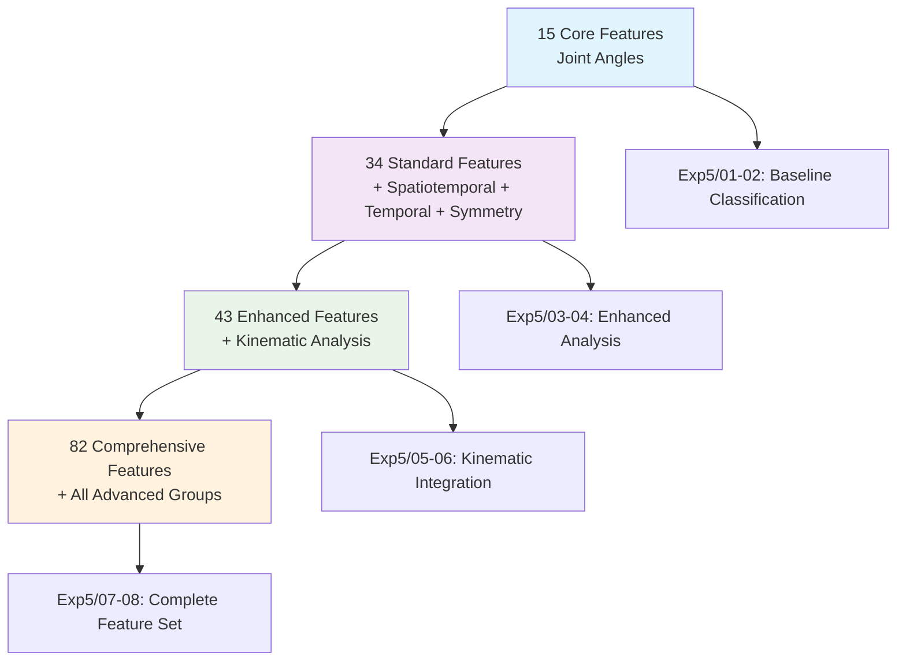
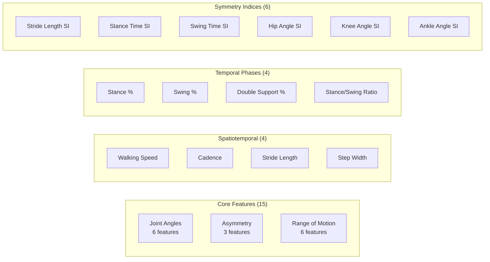

# Comprehensive Gait Feature Analysis Guide

## Overview

This guide provides a detailed explanation of the 82 comprehensive gait features used in AlexPose for clinical gait analysis and pathology classification. The features are organized into evidence-based groups that progressively build from basic joint measurements to advanced biomechanical indicators.

## Feature Evolution and Experimental Validation

Our research followed a systematic approach to feature development, validated through four experimental phases:



## Feature Groups Architecture

The 82 features are organized into 13 distinct groups, each targeting specific aspects of gait biomechanics:



---

## 1. Core Joint Angles (15 Features) - Foundation Group

These features form the foundation of gait analysis, providing basic biomechanical measurements that have been used in clinical practice for decades.

### Mean Joint Angles (6 features)

**Measurement Method**: Average joint angle across the entire gait sequence, calculated using vector geometry from MediaPipe pose landmarks.

| Feature | Normal Range | Pathological Indicators | Clinical Significance |
|---------|--------------|------------------------|----------------------|
| `left_hip_mean` | 10-30° | >40° (flexion contracture)<br/><10° (extension limitation) | Hip flexor tightness, arthritis |
| `right_hip_mean` | 10-30° | >40° (flexion contracture)<br/><10° (extension limitation) | Hip flexor tightness, arthritis |
| `left_knee_mean` | 5-15° | >20° (flexion contracture)<br/><0° (hyperextension) | Knee pathology, muscle weakness |
| `right_knee_mean` | 5-15° | >20° (flexion contracture)<br/><0° (hyperextension) | Knee pathology, muscle weakness |
| `left_ankle_mean` | 85-95° | >100° (excessive dorsiflexion)<br/><80° (plantarflexion) | Ankle stiffness, drop foot |
| `right_ankle_mean` | 85-95° | >100° (excessive dorsiflexion)<br/><80° (plantarflexion) | Ankle stiffness, drop foot |

**Example Interpretation**:
```python
# Normal gait pattern
normal_features = {
    'left_hip_mean': 22.5,    # Within normal range
    'right_hip_mean': 24.1,   # Within normal range
    'left_knee_mean': 12.3,   # Normal knee flexion
    'right_knee_mean': 11.8   # Normal knee flexion
}

# Parkinsonian gait pattern
parkinsons_features = {
    'left_hip_mean': 35.2,    # Increased flexion (stooped posture)
    'right_hip_mean': 33.8,   # Increased flexion
    'left_knee_mean': 18.5,   # Increased knee flexion
    'right_knee_mean': 19.1   # Increased knee flexion
}
```

### Joint Asymmetry (3 features)

**Measurement Method**: Absolute difference between left and right joint angles.

| Feature | Normal Range | Pathological Threshold | Clinical Conditions |
|---------|--------------|----------------------|-------------------|
| `hip_asymmetry` | <5° | >10° | Hemiplegic gait, hip pathology |
| `knee_asymmetry` | <3° | >8° | Unilateral knee injury, stroke |
| `ankle_asymmetry` | <4° | >12° | Drop foot, ankle arthritis |

### Range of Motion (6 features)

**Measurement Method**: Difference between maximum and minimum joint angles during the gait cycle.

| Feature | Normal Range | Reduced ROM (<) | Excessive ROM (>) |
|---------|--------------|----------------|------------------|
| `left_hip_range` | 40-50° | <30° (stiffness) | >60° (instability) |
| `right_hip_range` | 40-50° | <30° (stiffness) | >60° (instability) |
| `left_knee_range` | 50-70° | <40° (stiffness) | >80° (hyperflexion) |
| `right_knee_range` | 50-70° | <40° (stiffness) | >80° (hyperflexion) |
| `left_ankle_range` | 25-35° | <20° (stiffness) | >40° (instability) |
| `right_ankle_range` | 25-35° | <20° (stiffness) | >40° (instability) |

---

## 2. Spatiotemporal Parameters (4 Features) - "6th Vital Sign"

These features represent the most clinically significant gait measurements, with walking speed often called the "6th vital sign" due to its strong prognostic value.

### Evidence Base
- **Walking Speed**: 0.1 m/s decrease = 12% increased mortality risk
- **Cadence**: Strong predictor of fall risk in elderly populations
- **Stride Length**: Correlates with cognitive function and disease progression

| Feature | Normal Range | Mild Impairment | Severe Impairment | Clinical Significance |
|---------|--------------|----------------|-------------------|----------------------|
| `walking_speed_ms` | 1.2-1.4 m/s | 0.8-1.2 m/s | <0.8 m/s | Functional independence predictor |
| `cadence_steps_min` | 100-120 steps/min | 80-100 steps/min | <80 steps/min | Fall risk indicator |
| `stride_length_m` | 1.3-1.5 m | 1.0-1.3 m | <1.0 m | Mobility limitation marker |
| `step_width_m` | 0.08-0.12 m | 0.12-0.16 m | >0.16 m | Balance confidence indicator |

**Pathological Patterns**:
```python
# Parkinsonian gait
parkinsons_spatio = {
    'walking_speed_ms': 0.65,      # Bradykinesia (slow movement)
    'cadence_steps_min': 95,       # Reduced step frequency
    'stride_length_m': 0.85,       # Shortened strides
    'step_width_m': 0.14           # Widened base for stability
}

# Hemiplegic gait (post-stroke)
stroke_spatio = {
    'walking_speed_ms': 0.45,      # Severely reduced speed
    'cadence_steps_min': 75,       # Very slow cadence
    'stride_length_m': 0.70,       # Markedly shortened strides
    'step_width_m': 0.18           # Wide base for compensation
}
```

---

## 3. Temporal Phase Features (4 Features) - Gait Cycle Analysis

These features analyze the timing of gait phases, critical for identifying specific pathological patterns.

### Normal Gait Cycle Distribution
- **Stance Phase**: 60% of gait cycle
- **Swing Phase**: 40% of gait cycle
- **Double Support**: 20% of gait cycle (10% at heel strike, 10% at toe-off)

| Feature | Normal Range | Pathological Patterns | Associated Conditions |
|---------|--------------|----------------------|----------------------|
| `stance_percentage` | 58-62% | >65% (prolonged stance)<br/><55% (shortened stance) | Antalgic gait, weakness |
| `swing_percentage` | 38-42% | <35% (shortened swing)<br/>>45% (prolonged swing) | Spasticity, weakness |
| `double_support_percentage` | 18-22% | >25% (increased stability need)<br/><15% (running pattern) | Balance issues, fear of falling |
| `stance_swing_ratio` | 1.4-1.6 | >1.8 (excessive stance)<br/><1.2 (excessive swing) | Pain avoidance, muscle weakness |

**Clinical Examples**:
```python
# Antalgic gait (painful limb)
antalgic_temporal = {
    'stance_percentage': 45,       # Shortened stance on painful side
    'swing_percentage': 55,        # Prolonged swing to avoid weight-bearing
    'double_support_percentage': 15, # Reduced double support
    'stance_swing_ratio': 0.82     # Inverted ratio
}

# Spastic hemiplegic gait
spastic_temporal = {
    'stance_percentage': 68,       # Prolonged stance phase
    'swing_percentage': 32,        # Shortened swing phase
    'double_support_percentage': 28, # Increased double support for stability
    'stance_swing_ratio': 2.13     # High ratio indicating difficulty with swing
}
```

---

## 4. Symmetry Indices (6 Features) - Evidence-Based Asymmetry Analysis

These features use the clinically validated Symmetry Index formula: **SI = (Left - Right) / (0.5 × (Left + Right)) × 100**

### Clinical Thresholds
- **Normal Gait**: SI < 12%
- **Borderline**: SI 12-16%
- **Pathological**: SI > 16%

| Feature | Normal Range | Mild Asymmetry | Severe Asymmetry | Primary Conditions |
|---------|--------------|----------------|------------------|-------------------|
| `stride_length_si` | <10% | 10-15% | >15% | Hemiplegic gait, limb length discrepancy |
| `stance_time_si` | <8% | 8-12% | >12% | Antalgic gait, unilateral weakness |
| `swing_time_si` | <8% | 8-12% | >12% | Spasticity, joint contractures |
| `hip_angle_si` | <12% | 12-18% | >18% | Hip pathology, muscle imbalance |
| `knee_angle_si` | <10% | 10-15% | >15% | Knee injury, quadriceps weakness |
| `ankle_angle_si` | <15% | 15-20% | >20% | Drop foot, ankle arthritis |

**Calculation Example**:
```python
# Hemiplegic gait symmetry analysis
left_stride = 1.2  # meters
right_stride = 0.8  # meters (affected side)

stride_length_si = abs(left_stride - right_stride) / (0.5 * (left_stride + right_stride)) * 100
# SI = |1.2 - 0.8| / (0.5 * (1.2 + 0.8)) * 100 = 0.4 / 1.0 * 100 = 40%
# Result: Severe asymmetry (>15%), indicating significant pathology
```

---

## 5. Kinematic Features (9 Features) - Movement Quality Analysis

These features analyze the quality and smoothness of movement patterns, providing insights into motor control and coordination.

### Velocity Analysis (4 features)

| Feature | Normal Range | Pathological Indicators | Clinical Significance |
|---------|--------------|------------------------|----------------------|
| `velocity_mean` | 80-120 pixels/s | <60 (bradykinesia)<br/>>150 (hyperkinesia) | Movement speed disorders |
| `velocity_std` | 15-25 pixels/s | >30 (irregular movement)<br/><10 (rigid movement) | Movement variability |
| `velocity_max` | 150-200 pixels/s | <100 (severe bradykinesia)<br/>>250 (dyskinesia) | Peak movement capability |
| `velocity_min` | 5-15 pixels/s | >20 (inability to slow)<br/><2 (freezing episodes) | Movement control |

### Acceleration Analysis (3 features)

| Feature | Normal Range | Pathological Patterns | Associated Conditions |
|---------|--------------|----------------------|----------------------|
| `acceleration_mean` | 5-15 pixels/s² | >20 (jerky movements)<br/><3 (smooth but slow) | Cerebellar disorders, Parkinson's |
| `acceleration_std` | 8-18 pixels/s² | >25 (irregular acceleration)<br/><5 (monotonous movement) | Ataxia, rigidity |
| `acceleration_max` | 40-80 pixels/s² | >100 (explosive movements)<br/><30 (limited acceleration) | Dystonia, weakness |

### Jerk Analysis (2 features)

**Jerk** measures the rate of change of acceleration, indicating movement smoothness.

| Feature | Normal Range | High Jerk (>) | Low Jerk (<) |
|---------|--------------|---------------|--------------|
| `jerk_mean` | 2-8 pixels/s³ | >12 (jerky, uncoordinated) | <1 (overly smooth, robotic) |
| `jerk_std` | 3-10 pixels/s³ | >15 (highly variable) | <2 (monotonous) |

---

## 6. Variability Metrics (3 Features) - Gait Stability Indicators

These features measure stride-to-stride consistency, with higher variability indicating increased fall risk and neurological impairment.

### Coefficient of Variation (CV) Analysis

**CV = (Standard Deviation / Mean) × 100**

| Feature | Normal Range | Increased Variability | Clinical Implications |
|---------|--------------|----------------------|----------------------|
| `stride_time_cv` | <3% | >5% | Fall risk, cognitive decline |
| `step_length_cv` | <4% | >7% | Balance impairment, fear of falling |
| `stride_velocity_cv` | <5% | >8% | Motor control disorders |

**Clinical Interpretation**:
```python
# Normal gait variability
normal_variability = {
    'stride_time_cv': 2.1,     # Consistent timing
    'step_length_cv': 3.2,     # Consistent step length
    'stride_velocity_cv': 4.1  # Consistent speed
}

# Parkinsonian gait variability
parkinsons_variability = {
    'stride_time_cv': 8.5,     # High temporal variability
    'step_length_cv': 12.3,    # Inconsistent step lengths
    'stride_velocity_cv': 15.7 # Highly variable speed (freezing episodes)
}
```

---

## 7. Postural Features (2 Features) - Trunk and Pelvic Alignment

These features assess postural control and alignment, critical for identifying specific gait pathologies.

| Feature | Normal Range | Pathological Patterns | Primary Conditions |
|---------|--------------|----------------------|-------------------|
| `trunk_lean_angle` | <5° | 5-15° (mild lean)<br/>>15° (severe lean) | Parkinsonian stooped posture, antalgic lean |
| `pelvic_tilt_mean` | <3° | 3-8° (mild tilt)<br/>>8° (severe tilt) | Hip hiking in hemiplegic gait, leg length discrepancy |

---

## 8. Extended Joint Angle Features (6 Features) - Variability Analysis

These features complement the core joint angles by measuring consistency and control.

### Joint Angle Standard Deviation

| Feature | Normal Range | High Variability (>) | Low Variability (<) |
|---------|--------------|---------------------|-------------------|
| `left_hip_std` | 8-15° | >20° (poor control) | <5° (rigid movement) |
| `right_hip_std` | 8-15° | >20° (poor control) | <5° (rigid movement) |
| `left_knee_std` | 12-20° | >25° (instability) | <8° (stiffness) |
| `right_knee_std` | 12-20° | >25° (instability) | <8° (stiffness) |
| `left_ankle_std` | 6-12° | >15° (poor control) | <4° (rigidity) |
| `right_ankle_std` | 6-12° | >15° (poor control) | <4° (rigidity) |

---

## 9. Extended Temporal Features (12 Features) - Advanced Timing Analysis

These features provide detailed analysis of gait cycle timing and frequency characteristics.

### Sequence Characteristics (4 features)

| Feature | Typical Values | Clinical Significance |
|---------|----------------|----------------------|
| `sequence_length` | 60-200 frames | Analysis duration adequacy |
| `duration_seconds` | 2-8 seconds | Gait cycle capture completeness |
| `dominant_frequency` | 0.8-1.2 Hz | Step frequency analysis |
| `fps` | 30 fps | Video quality standard |

### Gait Cycle Analysis (8 features)

| Feature | Normal Range | Pathological Indicators |
|---------|--------------|------------------------|
| `cycle_count` | 2-6 cycles | <2 (insufficient data), >8 (slow gait) |
| `left_cycle_duration_mean` | 1.0-1.3 s | >1.5s (slow), <0.8s (rushed) |
| `right_cycle_duration_mean` | 1.0-1.3 s | >1.5s (slow), <0.8s (rushed) |
| `cycle_duration_asymmetry` | <0.1 s | >0.2s (significant asymmetry) |
| `double_support_duration_mean` | 0.2-0.3 s | >0.4s (stability issues) |
| `stance_duration_mean` | 0.6-0.8 s | >1.0s (prolonged stance) |
| `swing_duration_mean` | 0.4-0.5 s | >0.6s (swing phase difficulty) |
| `phase_asymmetry` | <0.05 | >0.1 (phase timing issues) |

---

## 10. Stability Features (4 Features) - Balance and Postural Control

These features assess dynamic balance and postural stability during walking.

| Feature | Normal Range | Instability Indicators | Clinical Conditions |
|---------|--------------|----------------------|-------------------|
| `com_movement_mean` | 15-25 pixels | >35 (excessive sway) | Cerebellar ataxia, vestibular disorders |
| `com_movement_std` | 5-12 pixels | >18 (irregular sway) | Balance disorders, fear of falling |
| `com_stability_index` | 0.1-0.3 | >0.5 (poor stability) | Fall risk, proprioceptive deficits |
| `postural_sway_area` | 50-150 pixels² | >250 (excessive area) | Postural instability, medication effects |

---

## 11. Extended Stride Features (5 Features) - Advanced Spatial Analysis

These features provide detailed analysis of step characteristics and foot placement patterns.

| Feature | Normal Range | Pathological Patterns | Clinical Significance |
|---------|--------------|----------------------|----------------------|
| `step_width_std` | 0.02-0.04 m | >0.06 (variable width) | Balance uncertainty, ataxia |
| `step_width_range` | 0.08-0.15 m | >0.20 (wide variation) | Postural instability |
| `left_ankle_total_distance` | 80-120 pixels | <60 (reduced mobility) | Ankle stiffness, weakness |
| `right_ankle_total_distance` | 80-120 pixels | <60 (reduced mobility) | Ankle stiffness, weakness |
| `ankle_distance_asymmetry` | <0.15 | >0.25 (significant asymmetry) | Unilateral pathology |

---

## 12. Extended Symmetry Features (10 Features) - Comprehensive Asymmetry Analysis

These features provide detailed symmetry analysis across multiple body segments and movement aspects.

### Individual Joint Symmetry (6 features)

| Feature | Normal Range | Asymmetry Threshold | Target Conditions |
|---------|--------------|-------------------|------------------|
| `shoulder_symmetry_index` | <8% | >12% | Upper body compensation patterns |
| `elbow_symmetry_index` | <10% | >15% | Arm swing asymmetry |
| `wrist_symmetry_index` | <12% | >18% | Fine motor control issues |
| `hip_symmetry_index` | <10% | >15% | Hip pathology, muscle imbalance |
| `knee_symmetry_index` | <8% | >12% | Knee injury, quadriceps weakness |
| `ankle_symmetry_index` | <12% | >18% | Ankle dysfunction, drop foot |

### Advanced Symmetry Scores (4 features)

| Feature | Normal Range | Interpretation |
|---------|--------------|----------------|
| `overall_symmetry_index` | <15% | Composite symmetry measure |
| `positional_symmetry_score` | >0.85 | Joint position symmetry (0-1 scale) |
| `movement_symmetry_score` | >0.80 | Movement pattern symmetry (0-1 scale) |
| `temporal_symmetry_score` | >0.90 | Timing symmetry (0-1 scale) |

---

## 13. Extended Kinematic Features (2 Features) - Pixel-Based Measurements

These features provide raw pixel-based measurements for calibration and validation purposes.

| Feature | Typical Range | Usage |
|---------|---------------|-------|
| `walking_speed_pixels_per_sec` | 60-140 pixels/s | Raw speed measurement |
| `estimated_stride_length_pixels` | 80-150 pixels | Raw spatial measurement |

---

## Feature Group Selection Strategies

### Clinical-Focused Selection

For clinical applications, prioritize features with established clinical thresholds:

```python
clinical_groups = [
    "core_angles",           # Joint angle basics
    "spatiotemporal",        # "6th vital sign" metrics
    "symmetry_indices",      # Evidence-based asymmetry
    "temporal_phases",       # Gait cycle analysis
    "variability"           # Fall risk indicators
]
# Total: 32 features
```

### Research-Focused Selection

For comprehensive research analysis, include all advanced features:

```python
research_groups = [
    "core_angles", "spatiotemporal", "temporal_phases", 
    "symmetry_indices", "kinematic", "variability", 
    "postural", "extended_angles", "temporal_extended", 
    "stability", "stride_extended", "symmetry_extended", 
    "kinematic_extended"
]
# Total: 82 features
```

### Condition-Specific Selection

#### Parkinsonian Gait Analysis
```python
parkinsons_groups = [
    "core_angles",           # Flexed posture detection
    "spatiotemporal",        # Bradykinesia quantification
    "kinematic",            # Movement quality assessment
    "variability",          # Freezing episode detection
    "postural"              # Stooped posture measurement
]
```

#### Hemiplegic Gait Analysis
```python
stroke_groups = [
    "core_angles",           # Joint compensation patterns
    "symmetry_indices",      # Left-right asymmetry
    "temporal_phases",       # Altered gait cycle timing
    "extended_symmetry"      # Comprehensive asymmetry analysis
]
```

---

## Implementation Examples

### Basic Feature Extraction

```python
from ambient.classification.features import GaitFeatureVector
from ambient.analysis.gait_analyzer import EnhancedGaitAnalyzer

# Analyze gait sequence
analyzer = EnhancedGaitAnalyzer()
results = analyzer.analyze_gait_sequence(pose_sequence)

# Extract comprehensive features (82 features)
features = GaitFeatureVector.from_analysis_results(
    results, 
    sample_id="patient_001",
    condition_label="parkinsons"
)

# Get feature array for machine learning
X_all = features.to_array()  # 82 features
print(f"Total features: {len(X_all)}")
```

### Selective Feature Extraction

```python
# Extract only clinical features (32 features)
clinical_groups = ["core_angles", "spatiotemporal", "symmetry_indices", 
                  "temporal_phases", "variability"]
X_clinical = features.to_array(feature_groups=clinical_groups)

# Extract condition-specific features
parkinsons_groups = ["core_angles", "spatiotemporal", "kinematic", 
                    "variability", "postural"]
X_parkinsons = features.to_array(feature_groups=parkinsons_groups)

print(f"Clinical features: {len(X_clinical)}")
print(f"Parkinson's-specific features: {len(X_parkinsons)}")
```

### Feature Validation and Interpretation

```python
# Validate feature quality
is_valid, issues = features.validate(check_all_groups=True)
if not is_valid:
    print(f"Validation issues: {issues}")

# Get human-readable summary
summary = features.get_feature_summary(include_all_groups=True)
print(summary)

# Get feature names for interpretation
feature_names = GaitFeatureVector.get_feature_names()
feature_groups_dict = GaitFeatureVector.get_feature_groups()

print(f"Available feature groups: {list(feature_groups_dict.keys())}")
```

---

## Clinical Decision Support

### Automated Pathology Detection

```python
def assess_gait_pathology(features):
    """Automated gait pathology assessment based on feature thresholds."""
    
    assessment = {
        'overall_risk': 'normal',
        'specific_findings': [],
        'recommendations': []
    }
    
    # Check walking speed (6th vital sign)
    if features.walking_speed_ms < 0.8:
        assessment['overall_risk'] = 'high'
        assessment['specific_findings'].append('Reduced walking speed (<0.8 m/s)')
        assessment['recommendations'].append('Comprehensive mobility assessment')
    
    # Check symmetry indices
    asymmetry_features = [
        features.stride_length_si, features.stance_time_si, 
        features.swing_time_si, features.hip_angle_si
    ]
    if any(si > 16 for si in asymmetry_features):
        assessment['overall_risk'] = 'high'
        assessment['specific_findings'].append('Significant gait asymmetry (>16%)')
        assessment['recommendations'].append('Neurological evaluation')
    
    # Check variability (fall risk)
    if features.stride_time_cv > 5 or features.step_length_cv > 7:
        assessment['overall_risk'] = 'moderate' if assessment['overall_risk'] == 'normal' else 'high'
        assessment['specific_findings'].append('Increased gait variability')
        assessment['recommendations'].append('Fall risk assessment')
    
    return assessment

# Example usage
assessment = assess_gait_pathology(features)
print(f"Risk Level: {assessment['overall_risk']}")
for finding in assessment['specific_findings']:
    print(f"Finding: {finding}")
```

---

## Research Applications

### Longitudinal Analysis

```python
def track_gait_progression(feature_history):
    """Track gait changes over time for disease progression monitoring."""
    
    progression_metrics = {}
    
    # Calculate trends for key clinical indicators
    key_features = ['walking_speed_ms', 'stride_length_si', 'stride_time_cv']
    
    for feature in key_features:
        values = [getattr(f, feature) for f in feature_history]
        
        # Calculate trend (simple linear regression slope)
        x = list(range(len(values)))
        slope = np.polyfit(x, values, 1)[0]
        
        progression_metrics[feature] = {
            'trend': 'improving' if slope > 0 else 'declining',
            'rate': abs(slope),
            'current_value': values[-1],
            'baseline_value': values[0]
        }
    
    return progression_metrics
```

### Population Analysis

```python
def analyze_population_norms(feature_dataset, age_groups):
    """Establish population norms for different age groups."""
    
    norms = {}
    
    for age_group in age_groups:
        group_features = feature_dataset[feature_dataset['age_group'] == age_group]
        
        norms[age_group] = {}
        for feature_name in GaitFeatureVector.get_feature_names():
            values = [getattr(f, feature_name) for f in group_features['features']]
            
            norms[age_group][feature_name] = {
                'mean': np.mean(values),
                'std': np.std(values),
                'percentile_5': np.percentile(values, 5),
                'percentile_95': np.percentile(values, 95)
            }
    
    return norms
```

---

## Conclusion

This comprehensive 82-feature gait analysis system provides a robust foundation for clinical assessment, research, and automated pathology detection. The hierarchical feature organization allows for flexible application across different use cases, from basic clinical screening to advanced research applications.

The evidence-based design ensures clinical relevance, while the modular architecture supports both current applications and future extensions. By combining traditional biomechanical measurements with advanced kinematic and stability analysis, this system represents the current state-of-the-art in computational gait analysis.

For implementation details and code examples, refer to the `experiments/exp5/` notebooks and the `ambient.classification.features` module documentation.