# Gait-JEPA: Learning the Shape of Walking Without Labels, and Reading Clinical Meaning Back Out

**Alex Mui, Penny Inouye, Theodore Mui**

*A research proposal. Alex Mui and Theodore Mui lead the machine-learning and pose-extraction work; Penny Inouye leads the neuroscience grounding. Drafted July 12, 2026, with the neuroscience-grounded results targeted for early August 2026.*

---

> **In one sentence.** We propose to teach a model the shape of human walking from a large pool of unlabeled pose sequences, using a self-supervised Joint Embedding Predictive Architecture (JEPA) that hides blocks of a moving skeleton and predicts them in latent space, and then to spend our scarce 68 clinical labels only on a small frozen-encoder probe, testing whether label-free pretraining can match or beat the prior 76 percent hand-feature baseline while learning clinically meaningful movement axes on its own.

## Contents

1. [Abstract](#abstract)
2. [Introduction: The Problem, in Plain Words](#introduction-the-problem-in-plain-words)
3. [Background: Self-Supervised Learning and JEPA from Scratch](#background-self-supervised-learning-and-jepa-from-scratch)
4. [Research Questions and Hypotheses](#research-questions-and-hypotheses)
5. [Methods: How the Model Is Built, Step by Step](#methods-how-the-model-is-built-step-by-step)
6. [The Neuroscience Connection](#the-neuroscience-connection)
7. [Evaluation Plan](#evaluation-plan)
8. [Timeline, Roles, and Deliverables](#timeline-roles-and-deliverables)
9. [Risks, Limitations, and Feasibility](#risks-limitations-and-feasibility)
10. [Related Work and Broader Impact](#related-work-and-broader-impact)
11. [References](#references)

---

## Abstract

Walking is one of the oldest signals in medicine. The way a person starts a step, swings a leg, or keeps their balance carries fingerprints of the nervous system, and a trained clinician can often name a condition just by watching someone cross a room. Teaching a computer to do the same has been held back by a stubborn shortage: expert labels are scarce and expensive, while raw walking video is cheap and plentiful. Our prior work turned each clip into 82 hand-engineered pose features and trained a Random Forest, reaching 76 percent accuracy across five gait classes but standing on only 68 clinically labeled sequences.

### The idea in one breath

We propose Gait-JEPA, a self-supervised model that learns the shape of walking from a large pool of unlabeled pose sequences before it ever sees a label. JEPA (Joint Embedding Predictive Architecture) hides part of a moving skeleton and predicts the hidden part in latent space, a compact learned summary rather than raw coordinates, so it can ignore camera shake and focus on coordinated motion. We work directly on 33 tracked body joints over time (no pixels), and hide information with spatiotemporal block masking: sometimes a whole limb across a window of frames, sometimes every joint inside a short time window. A slow-moving copy of the encoder supplies a stable answer key, and VICReg (Variance-Invariance-Covariance Regularization) prevents the model from cheating by collapsing every clip to the same summary.

### What we ask and how we grade it

Neuroscience grounding, led by our clinical co-author, tells us which movement axes separate conditions such as Parkinson's disease and stroke: shared asymmetry and postural instability, plus a condition-specific third axis of rhythm-variability versus spatiotemporal slowing. This lets us ask four honest questions. RQ1: can a simple classifier on the frozen features match or beat the 76 percent baseline on the same 68-clip, five-class split? RQ2: does the model degrade more gracefully than the Random Forest when labels are scarce? RQ3: can tiny linear probes read documented clinical scalars, such as symmetry indices and stride-time variability, straight out of the frozen latent? RQ4: is VICReg load-bearing, so that removing it triggers collapse?

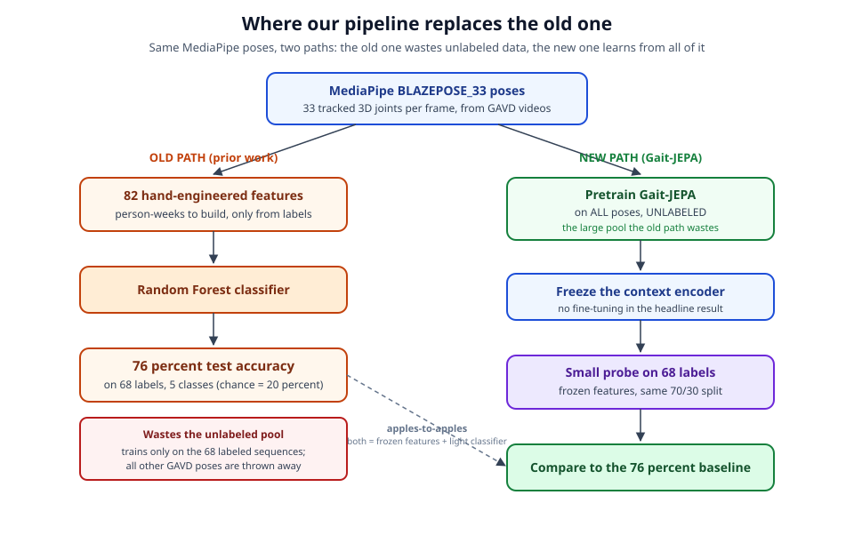
*Both paths start from the same MediaPipe BlazePose skeletons; the prior path spends person-weeks on 82 hand features and a Random Forest, while ours pretrains Gait-JEPA on all of the unlabeled poses the old path threw away, then spends the 68 labels only on a small frozen-encoder probe.*

We are honest about the downside. A clean null result, where the probe fails to beat 76 percent or the clinical probes explain little variance, would itself teach us that our filtered unlabeled pool was too small or that block masking alone does not surface the clinical axes, pointing the next study toward richer data or better masking. The design is deliberately small: a two-to-four-layer encoder, short 16-to-32-frame clips, and factorized attention, so the whole study fits a student team on a single modest GPU within a three-week sprint.

## Introduction: The Problem, in Plain Words

Imagine standing in a hallway and watching someone walk toward you. Within a few steps, a trained neurologist can often tell that something is wrong, and sometimes even what is wrong. A leg that swings a little stiffly, a foot that drags, arms that no longer swing in their usual easy rhythm, a body that leans to protect one side. The way a person walks, their **gait**, is one of the oldest and most honest windows into the health of the brain and nervous system. Parkinson's disease, the aftermath of a stroke, cerebral palsy, and muscle diseases all leave their fingerprints in how a body moves through a single walking cycle. The dream behind this line of work is simple to state: teach a computer to read that same window, from ordinary video, so that a screening signal is available to anyone with a camera, not only to patients who happen to reach a specialist.

Our team has been chasing that dream for a while, and this proposal grows directly out of what we learned from an earlier system built in the ASDRP research program. To understand why we are proposing something new, it helps to first walk through how that earlier system worked, where it succeeded, and exactly where it ran into a wall.

### The prior pipeline, step by step

The earlier system, which we will call the classic pipeline, turned a walking video into a diagnosis guess in three stages.

The first stage was **pose extraction**. A video is just a stack of images, and a raw image is a grid of colored dots that a computer does not understand as a body. To find the body, we used Google's **MediaPipe BlazePose** model, an off-the-shelf tool that looks at each frame and marks the location of 33 anatomical landmarks: the shoulders, elbows, wrists, hips, knees, ankles, points on the face, and so on. BlazePose reports each of those 33 joints as three numbers, an x, a y, and a z coordinate, so that for every single frame we get a little stick-figure **skeleton** floating in space. Run this over an entire clip and you get that skeleton in motion, a compact record of the walk with the background, clothing, and lighting stripped away. This is a genuinely good idea, and we keep it. The skeleton is a clean, privacy-friendly summary of movement.

The second stage was **feature engineering**. Here the pipeline collapsed that moving skeleton into a fixed list of 82 hand-designed numbers. These were quantities a human expert thought should matter: the angle of the knee at a certain moment, how symmetric the left and right sides were, the timing between steps, how much a measurement varied over the clip. Each number was a deliberate human guess about what makes an abnormal walk abnormal.

The third stage was **classification**. Those 82 numbers were fed to a classical machine-learning model, which is just a program that learns a rule for sorting inputs into categories from examples it has already seen. We tried several: a k-nearest-neighbors model (which labels a new clip by the labels of the most similar clips it remembers), a decision tree (a flowchart of yes/no questions), and a **random forest** (a committee of many such flowcharts that vote). The data was split so the model trained on 70 percent of the clips and was then tested on the remaining 30 percent it had never seen, which is the honest way to check whether a model has actually learned something rather than memorized.


### What worked, and the tiny base underneath it

The best version of this pipeline, a random forest reading the 82 features, reached **76 percent accuracy** on the held-out test clips across five categories: normal, Parkinson's, stroke, cerebral palsy, and myopathic (muscle-disease) gait. Because there are five categories, a model that simply guessed at random would be right about **20 percent** of the time. Getting to 76 percent is therefore not luck. There is real signal in the skeleton, and the pipeline was finding it.

But that number stands on an alarmingly small foundation, and this is the heart of the problem. The entire model was trained and tested on only **68 clinically labeled clips**. To be precise, those 68 were split across the five conditions as 12 normal, 9 Parkinson's, 12 stroke, 15 cerebral palsy, and 20 myopathic. When 30 percent of 68 clips is held out for testing, the test set is roughly twenty clips. A single clip flipping from wrong to right can move the reported accuracy by several percentage points. With classes this small, especially the nine Parkinson's clips, the model has seen far too few examples to learn the true range of what each condition looks like, and we have far too few test examples to be confident about how good it really is. The 76 percent is real, but it is a promising result written in very light pencil.

Why not simply collect more labeled clips? Because a **label**, here, means a clinical diagnosis attached to a specific walking clip, and producing one requires a qualified clinician's time and judgment. That is slow, expensive, and hard to scale. This points at the deeper structure of the whole difficulty.

### Problem one: labels are the bottleneck, and the classic pipeline wastes everything else

There are two very different resources in this field, and they cost wildly different amounts. Raw walking video is cheap and abundant. People walk everywhere, cameras are everywhere, and large open collections already exist. The **GAVD** dataset (Gait Abnormality in Video Dataset), for example, is an open collection of hundreds of gait video links spanning many conditions, and we can run every one of those videos through BlazePose to get skeletons essentially for free. What is scarce is not the movement, it is the **expert judgment** that says "this particular walk is Parkinsonian." A diagnosis is what costs a specialist's hour.

Here is the trap in the classic pipeline: a random forest, like every ordinary classifier, learns only from labeled examples. It can only use a clip if that clip comes with an answer attached. So all of that cheap, plentiful, unlabeled skeleton data is simply thrown away. The pipeline is architecturally incapable of learning anything from a walking video that no doctor has annotated, even though such videos contain an enormous amount of information about how human bodies move. We are pouring most of our raw material straight down the drain and then complaining that we do not have enough to work with.

The right question, then, is not "how do we get more labels," which is hard, but "how do we learn from movement itself before we ever ask a doctor anything." That reframing is the seed of this proposal.

### Problem two: 82 numbers throw away the shape of the walk

The second problem is subtler and lives in the middle stage, the squeeze from a moving skeleton down to 82 hand-designed numbers.

A walking cycle is a richly structured thing. It is 33 joints moving together, frame after frame, in a coordinated rhythm where the left and right sides trade off, the arms counter-swing against the legs, and the whole body rises and falls in a repeating pattern. Compressing all of that into 82 summary statistics is a little like trying to describe an entire song with 82 numbers. You could record the average loudness, the highest note, the number of beats per minute, how much the volume wobbled. Those numbers are not useless, and a listener might even guess the genre from them. But you have thrown away the **melody**, the actual sequence of notes and their timing that makes the song what it is. In the same way, the 82 features keep some coarse facts about the walk and discard the fine, joint-by-joint, frame-by-frame structure that a clinician's eye actually reads.

There is a second cost hiding here, this time in human effort. Every one of those 82 features had to be dreamed up, defined, coded, and validated by a person. The feature set did not arrive fully formed; it grew over time from 15 features to 34, then to 43, and finally to 82, with each expansion representing roughly a person-week of careful engineering. And every added feature bakes in the designer's assumptions about what matters. If the melody of an abnormal gait lives in some pattern nobody thought to hand-code, no amount of feature-engineering effort will recover it, because you cannot measure a thing you never thought to define.

So the classic pipeline is squeezed from both ends. It cannot use unlabeled data, and the representation it does use is a lossy, hand-built summary that is expensive to grow and blind to whatever its designers failed to anticipate.

### The gap this proposal fills

Put the two problems together and the missing capability comes into focus. We want a system that can learn the structure of human walking from the mountain of cheap, unlabeled skeleton data, without any diagnosis attached, and that learns its own rich representation of a walking cycle directly from the motion rather than from a hand-written list of 82 statistics. Then, and only then, we want to spend our precious 68 labels not to teach the system what walking is, but merely to attach clinical names to a structure it has already discovered on its own.

This is exactly the kind of problem that **self-supervised learning** was invented for. Self-supervised learning is a family of methods that learn from unlabeled data by inventing their own practice task out of the data itself, most commonly by hiding part of the input and trying to predict the hidden part from what remains. Nobody has to label anything; the data supplies its own answer key. If the practice task is well chosen, a model that gets good at it ends up with a genuinely useful internal understanding of the thing it was trained on, an understanding we can later reuse for the real task we care about.

### The two-step plan, previewed

Our plan follows that logic in two steps, and the rest of this proposal builds them out in detail.

The first step is **pretraining without labels**. We take all of the cheap, unlabeled gait skeletons, hide parts of each walking sequence, and train a model to predict the hidden parts. Crucially, and this is the idea we develop at length later, the model predicts the hidden motion not as exact coordinates but as a compact learned summary of meaning, so it can concentrate on the real structure of the walk and ignore unpredictable noise like camera shake or a jittering fingertip. This is the **Joint Embedding Predictive Architecture**, or **JEPA**, applied to pose sequences, and it is where the system quietly learns what walking looks like from data no clinician ever touched.

The second step is **reading clinical meaning back out**. Once the model has learned a rich representation of walking from the unlabeled mountain, we freeze what it learned and use our 68 labeled clips only to train a small, lightweight classifier on top of that frozen representation. Because the heavy lifting was done during label-free pretraining, the 68 labels are asked to do far less work than before. We compare this head-to-head against the 76 percent random forest, keeping the same 70/30 split so that the comparison is fair.

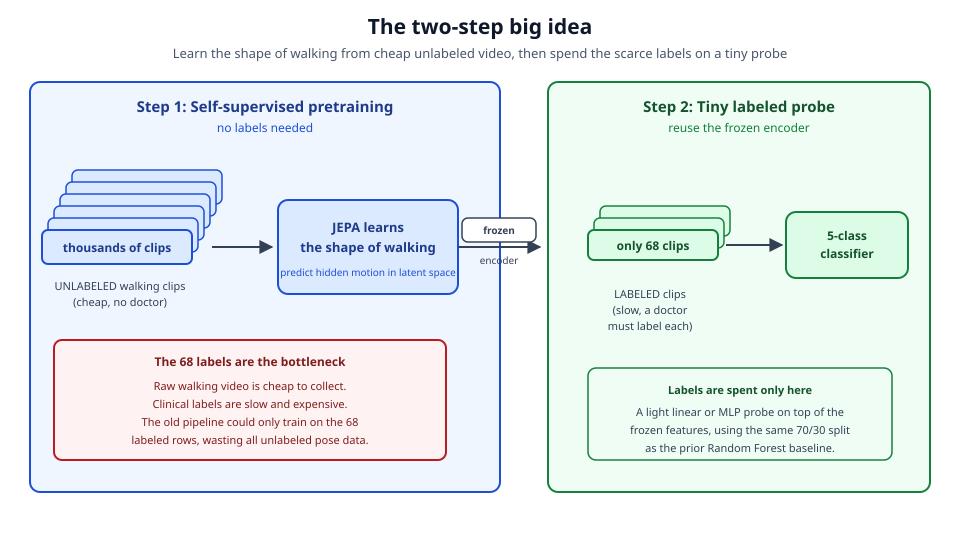
*The two-step plan. Step 1 learns the shape of walking from a large pile of unlabeled clips with no doctor involved; step 2 spends the tiny stack of 68 labels on a small probe over the frozen encoder.*

If it works, we will have shown that most of what a gait-screening model needs to know can be learned for free from unlabeled movement, and that a handful of expensive labels is enough to point that knowledge at a clinical question. And if it does not work, we will say so plainly: the honest null result is that a JEPA encoder trained on unlabeled skeletons, once frozen and probed with the same 68 labels and the same split, fails to beat the 76 percent random forest baseline. Either way, the two-step design lets us finally use the cheap data we have been throwing away, and aims to let the model learn the melody of a walk instead of settling for 82 numbers about it.

## Background: Self-Supervised Learning and JEPA from Scratch

Every idea in this proposal rests on one shift in how a machine is taught. So before we describe our own system, we build up the ideas it depends on, one at a time, assuming no prior exposure to machine learning. By the end of this section a reader should understand not just *what* we plan to build but *why* each part has to be there.

### From labeled examples to filling in blanks

The usual way to teach a computer to recognize things is called *supervised learning*. You show it many examples, each one tagged with the right answer by a human. Show it thousands of walking videos, each stamped by a doctor with a diagnosis, and eventually the machine learns to guess the diagnosis on a new video. The tag written by the human is called a *label*, and this is exactly the approach our earlier work took: 68 walking clips, each labeled with a clinical category, fed to a classifier.

The trouble is that the labels, not the videos, are the scarce resource. Recording someone walking is cheap; you can do it with a phone. Getting a trained clinician to watch that clip and assign a diagnosis is slow, expensive, and rare. So we end up with a mountain of raw walking footage and only a thimbleful of labeled examples. Supervised learning can only drink from the thimble. Every unlabeled clip, no matter how much it might teach us about how bodies move, is thrown away because there is no answer key attached.

*Self-supervised learning* escapes this trap with a simple trick: let the data label itself. Instead of asking a human for the answer, we hide part of the input and ask the machine to guess the part we hid. Because we did the hiding, we already know the true answer, so we can score the guess for free, with no human in the loop. Imagine covering up the left leg of a walking figure for half a second of video and asking the model to describe what the leg was doing. We can check its answer instantly, because we have the frames we covered. Do this millions of times, over every clip we own, and the model is forced to learn the deep regularities of walking: that legs alternate, that arms swing opposite to legs, that a body has a center of mass that moves smoothly. It learns all of this without a single diagnosis attached to a single clip.

This is the same "fill-in-the-blank" idea that taught modern language models to write. Cover a word in a sentence, make the model predict it, and to do that well the model has to learn grammar and meaning. We are doing the same thing with the geometry of a walking body instead of text.

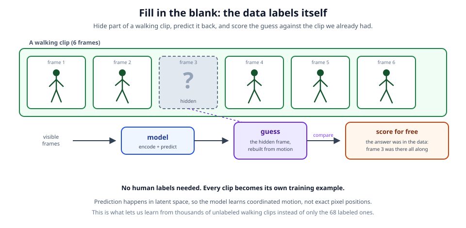
*Self-supervised learning as fill-in-the-blank: hide part of a walking clip, predict it from what remains, and score the guess for free because the answer was in the data all along.*

### Predicting meaning instead of pixels

There is a subtle but crucial choice hiding inside "guess the part we hid." *What form* should the guess take? The obvious answer is to have the model reconstruct the hidden piece exactly, coordinate by coordinate: predict precisely where the left knee was in every hidden frame. This turns out to be a bad idea, and understanding why leads directly to what makes our approach special.

The problem is that the exact position of a joint is full of detail that does not matter and cannot be predicted anyway. A fingertip wobbles. The camera shakes. A shoelace flaps. If we force the model to nail down every coordinate, it spends enormous effort trying to predict this unpredictable noise, and it is punished for missing wiggles that carry no information about how someone walks. We would be grading it on the wrong exam.

The fix is to predict *meaning* rather than exact appearance. To make that precise we need two terms.

An *embedding* is a list of numbers that summarizes something. Think of how a doctor might sum up a gait in a few words: "shuffling, stooped, small steps." Those words are a compact summary that throws away the exact pixel values but keeps what matters. An embedding is the numerical version of that summary, a handful of numbers that capture the essence of an input. The *latent space* is the space of all such summaries, the imaginary map on which every possible walking pattern is placed as a point, with similar walks landing near each other. "Latent" just means hidden or underlying: it is the underlying meaning, not the surface detail.

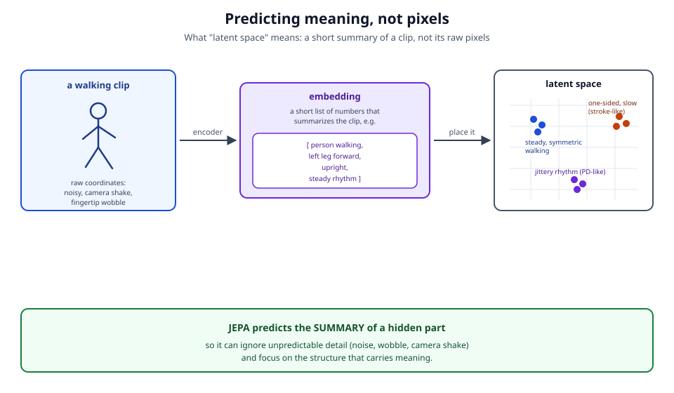
*Predicting meaning, not pixels. An encoder turns a noisy clip into a short summary (an embedding); similar walks land near each other in latent space, so the model can ignore camera shake and focus on structure.*

The key move in the *Joint Embedding Predictive Architecture*, or JEPA, is to run the fill-in-the-blank game entirely in latent space. Instead of asking "what were the exact coordinates of the hidden leg," we ask "what is the *summary* of the hidden leg's motion." The model predicts one compact summary from another. Because a summary has already thrown away the unpredictable wiggle, the model is free to concentrate on the part of the motion that is actually structured and meaningful. It is the difference between asking a student to reproduce a painting brushstroke by brushstroke and asking them to describe what the painting depicts. The second question is both easier and more useful.

### The four pieces, and why each one is needed

With that goal in place, we can assemble the machinery. JEPA has four parts. We motivate each before naming it.

**We need something that reads the visible part of the clip and turns it into a summary.** After hiding a chunk of the walking sequence, we hand the frames and joints that remain to a network whose job is to compress them into an embedding: a summary of the context we can see. This is the *context encoder*, and its output is the *context embedding*. Everything the model knows about the visible motion is packed into this one summary.

**We need a trustworthy answer key for the hidden part.** To score a guess, we need the "true" summary of the piece we hid, so we can compare the guess against it. But here we hit a delicate problem. If we compute that true summary with a network that is itself changing every moment as it learns, then the answer key keeps moving. It is like trying to hit a target that darts around every time you take aim; the model can never settle, because the very definition of "correct" shifts under its feet with each update.

The solution is to compute the answer key with a *slow copy* of the context encoder. This second network is called the *target encoder*, and it reads the hidden part of the clip to produce the *target embedding*, the summary we treat as correct. It is built as an *exponential moving average*, or EMA, of the context encoder. An exponential moving average is just a running average that leans heavily on its own past and only nudges a little toward the newest value; the same math a thermostat uses to smooth out momentary temperature spikes. Concretely, after each learning step we update the target encoder as

```
target = m * target + (1 - m) * context
```

with the momentum `m` set very close to 1 (we use around 0.996, ramped upward toward 1.0 as training proceeds). Because `m` is near 1, the target encoder inherits almost all of its old value and only drifts slowly toward the context encoder. That slow drift is exactly what we want: a stable, self-consistent answer key that changes gently enough for the model to chase, yet still improves over time.

One more safeguard matters here. We never let the scoring signal flow backward into the target encoder to reshape it directly; the only thing allowed to change it is the slow EMA update. Freezing it against direct correction this way is called *stop-gradient*. Without it, the model could quietly rewrite the answer key to make its own job easier, which defeats the purpose of having an answer key at all.

**We need something that turns the visible summary into a guess about the hidden summary.** The context embedding describes what we can see, but we want a prediction about specific hidden locations: this leg, in those frames. So a third small network takes the context embedding, plus a note saying *where* the hidden pieces are (which joints, which frames), and produces its best guess of their target embeddings. This is the *predictor*. Keeping prediction as a separate step lets the context encoder focus on understanding the visible motion while the predictor specializes in extrapolating into the gaps.

**We need a way to score the guess.** Finally we compare the predictor's guessed summaries against the target encoder's true summaries and measure how far apart they are. The measure is *mean squared error*, often called an L2 loss: take the difference between the guess and the answer at each number in the summary, square it, and average. Squaring makes larger misses count for much more than small ones. Crucially this comparison happens in latent space, between two embeddings, never between raw coordinates, and it is computed only at the hidden positions, since those are the only places we are actually testing the model.

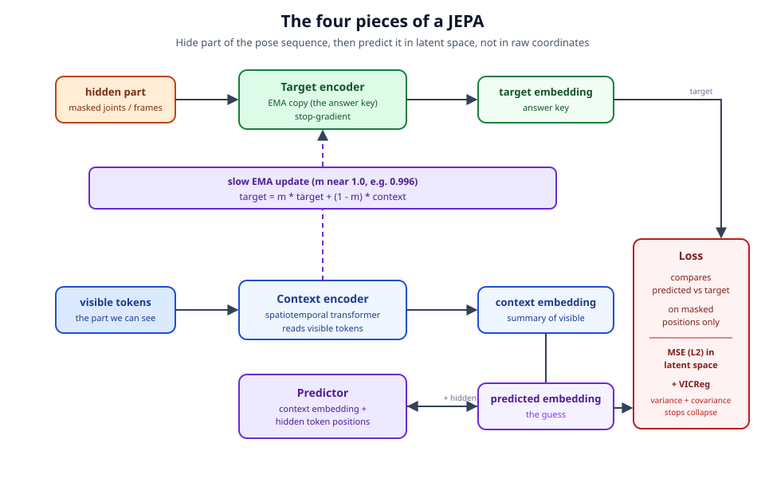
*The four pieces of a JEPA wired together: the context encoder reads the visible tokens, the slow EMA target encoder makes the answer key under stop-gradient, the predictor guesses, and the loss compares them in latent space.*

### The collapse trap and the VICReg fix

There is a catch that would sink this whole scheme if left unaddressed, and honesty about it is important. We are asking the model to make its guess match the answer key, and we let it invent its own summaries. Nothing so far forbids the laziest possible solution: output the *same* summary for every input. If every clip maps to, say, the number zero, then the guess is zero, the answer key is zero, the difference is zero, and the loss is perfectly minimized. The model has scored a flawless grade while learning absolutely nothing. This failure is called *representation collapse*, and any system that predicts its own summaries is tempted by it.

The slow, stop-gradient answer key already helps, because the target is not free to instantly rush to a constant. But we add an explicit defense borrowed from a method called *VICReg*, short for Variance-Invariance-Covariance Regularization. VICReg fights collapse with two gentle pressures applied to the summaries, and it does so without any of the heavy machinery some other methods need: no bank of "negative" counterexamples to push against, and no decoder that rebuilds the raw input.

The first pressure is the *variance* term. Collapse means every summary is the same, so within each individual number of the embedding there is no spread across a batch of clips. The variance term watches the spread of each dimension and penalizes the model whenever that spread falls below a target level, roughly a standard deviation of one. In plain terms it insists that clips must look different from one another in every coordinate of the summary; a constant output is directly forbidden because a constant has zero spread.

The second pressure is the *covariance* term. Keeping each dimension spread out is not enough, because the model could satisfy that while making all its dimensions secretly encode the same one fact in slightly different disguises. That would waste most of the summary. The covariance term measures how much different dimensions move in lockstep and pushes those relationships toward zero, encouraging each dimension to carry its own distinct piece of information rather than parroting its neighbors.

Together these two pressures guarantee that the summaries stay spread out and richly varied, so the only way for the model to make its guesses match the answer key is to actually capture the structure of the motion. The complete objective we minimize is

```
L = L_pred + lambda_v * L_var + lambda_c * L_cov
```

the prediction error plus the two VICReg terms scaled by weights `lambda_v` and `lambda_c`, all measured on the hidden positions only. The prediction term drives the model to learn; the variance and covariance terms keep it from cheating its way to a trivial answer.

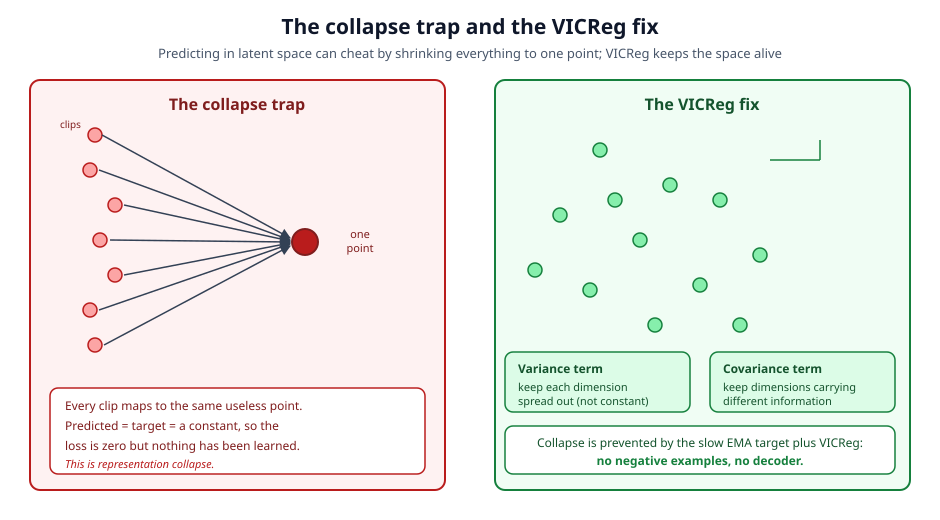
*The collapse trap and the VICReg fix. Left: every clip maps to one useless point, so the loss is zero but nothing is learned. Right: the variance term keeps each dimension spread out and the covariance term keeps dimensions carrying different information, with no negatives and no decoder.*

A brief note on what would count as failure, since a proposal should say so plainly. If, despite these defenses, the learned summaries collapse or fail to separate different gaits, we would see it directly: the variance term would sit pinned at its floor, and the downstream readout described later would perform no better than chance. That is the null result we are testing against, and we report it honestly if it occurs.

## Research Questions and Hypotheses

Our proposal stands or falls on evidence, so before describing how we will build Gait-JEPA we want to state exactly what we are trying to prove and how a judge can check whether we succeeded or failed. A good scientific claim is one that could turn out to be wrong. For that reason we phrase each of our four research questions as a hypothesis with a number attached: a metric we will measure, a target that counts as success, and a concrete recipe for how the measurement is taken. If we hit the target, the hypothesis is supported. If we miss it, we say so plainly, and we explain what that miss would teach us. The section closes with the honest possibility that our whole approach underperforms, and why even that would be a real scientific result worth reporting.

A note on vocabulary before we begin, since we assume no machine-learning background. A "frozen encoder" means we train the Gait-JEPA network on unlabeled walking data, then lock its weights so it can no longer change, and use it only as a fixed feature extractor that turns a walking clip into a list of numbers (an embedding). A "probe" is a small, simple classifier we train on top of those frozen numbers using only our 68 labeled clips. Keeping the encoder frozen matters for fairness: it means the labels never touch the big network, so any accuracy we get reflects structure the network learned from unlabeled walking alone. This mirrors the prior ASDRP pipeline, which also fed fixed features (its 82 hand-engineered numbers) into a light classifier such as a Random Forest. That symmetry is what makes our headline comparison an apples-to-apples contest between two sets of features rather than two different amounts of training effort.

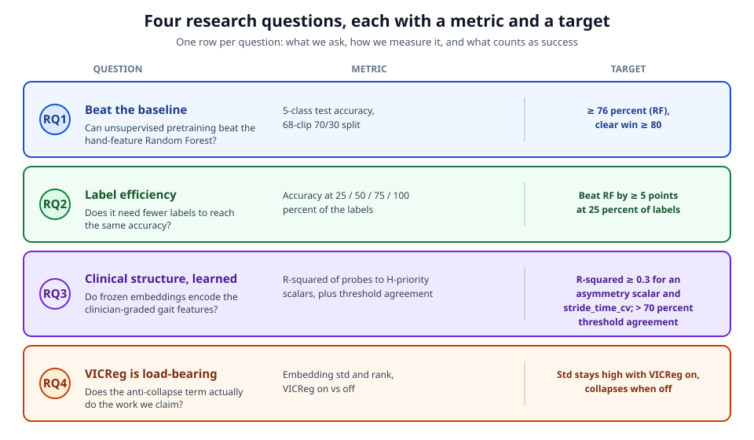
*The four research questions at a glance, each tied to one metric and one success target you can check in advance.*

### RQ1: Can label-free features beat hand-engineered features on the same tiny task?

Our first and most important hypothesis is that a simple classifier trained on frozen Gait-JEPA features will match or beat the prior work's best result on the exact same problem. The prior ASDRP pipeline reached 76 percent test accuracy with a Random Forest reading 82 hand-engineered features, classifying each walking clip into one of five categories (normal, Parkinson's, stroke, cerebral palsy, myopathic). Because there are five classes, blind guessing would score about 20 percent, so 76 percent is genuine signal, but it rests on only 68 labeled clips.

The metric is five-class test accuracy on those 68 sequences using the same 70/30 train/test split the prior work used. We measure it by pretraining Gait-JEPA on the unlabeled pose pool, freezing the context encoder, mean-pooling each clip's token embeddings into a single vector, and then fitting two kinds of probe on the 68 labels: a linear probe (logistic regression, the strictest test of whether the features are already organized) and separately a small multi-layer perceptron probe (a slightly more flexible classifier). We count the hypothesis as supported if the frozen-feature probe reaches at least 76 percent, and we call it a clear win at 80 percent or above.

Raw accuracy alone can mislead, so we build in fair-fight baselines that separate "better features" from "better classifier." We report our probe against the prior Random Forest and against the prior k-nearest-neighbors and decision-tree models, and, crucially, we train the very same probe on the 82 hand-engineered features. If our probe on JEPA features beats our probe on hand features, the improvement comes from the features themselves and not from a luckier choice of classifier. We will also report an encoder that is fine-tuned on the labels rather than frozen, but only as a ceiling, never as the headline, because fine-tuning lets the labels reshape the whole network and breaks the clean comparison.

### RQ2: Does label-free pretraining help most when labels are scarce?

Beating a single accuracy number is persuasive, but the deeper promise of learning from unlabeled data is that it should pay off most when labeled examples are in short supply, which is precisely our situation. Our second hypothesis is that as we shrink the labeled training set, the frozen JEPA probe loses accuracy more slowly than the Random Forest does.

The metric is a label-efficiency curve: test accuracy measured when the classifier is trained on 25, 50, 75, and 100 percent of the labeled training portion, holding the test set fixed. We measure it by repeatedly retraining both the JEPA probe and the Random Forest on each fraction of the training labels and plotting accuracy against fraction. Success means that at the 25 percent and 50 percent points the frozen JEPA probe stays above the Random Forest trained on the same fraction by a visible margin, with a target of at least five accuracy points at the 25 percent point. This is often the most convincing evidence that pretraining helped, because it shows the network arrived already knowing the shape of walking and needed only a handful of labels to attach clinical names to what it had learned.

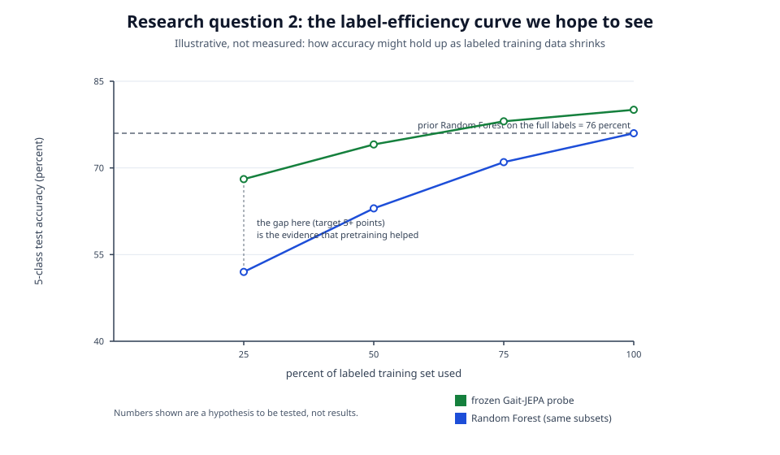
*An illustration of the label-efficiency curve we hope to see for research question 2. The numbers shown are a hypothesis to be tested, not measured results.*

### RQ3: Did the network learn clinical structure without being told?

Accuracy tells us the features are useful, but it does not tell us whether they capture the specific bodily signs a clinician looks for. Our third hypothesis is that the frozen latent space already contains documented clinical quantities, even though we never trained on them. In plain terms, we want to know whether the coordinates of a clip inside the network's learned summary secretly encode things like how symmetric the two legs are or how regular the walking rhythm is.

The metric is the test R-squared of tiny ridge linear probes that map the frozen pooled embedding onto six clinical scalars drawn from the existing feature pipeline: stride length, hip symmetry index, knee symmetry index, ankle symmetry index, stride-time variability, and a center-of-mass stability index. R-squared is the fraction of a quantity's variation that the probe explains, where 1.0 is perfect prediction and 0.0 is no better than always guessing the average. We measure it by computing these scalars from the same 82-feature pipeline on the same clips (so no new labeling is required), then fitting a ridge probe from the frozen embedding to each scalar and reporting R-squared on held-out clips. Success means R-squared clearly above zero, with a target of at least 0.3, for at least one asymmetry scalar and for the rhythm scalar (stride-time variability). As an interpretability check we also verify that the probe lands on the clinically correct side of a documented threshold (for example, a symmetry index above 16 percent, a stride-time coefficient of variation above 0.06, or a knee-flexion difference of at least 17 degrees, all drawn from the clinical feature tables described in the neuroscience section) more than 70 percent of the time. Clearing these bars would show that meaningful clinical axes emerge from masked prediction on skeletons alone, without any clinician ever labeling those axes for the network.

### RQ4: Is the anti-collapse machinery actually doing work?

The final hypothesis is a self-check on the method itself. A known failure mode of this family of models is representation collapse, where the network discovers it can drive its own error to zero by outputting the same constant summary for every input. It scores perfectly and learns nothing. Our design prevents this with VICReg, a regularizer whose variance term forces each dimension of the embedding to keep some spread and whose covariance term pushes different dimensions to carry different information. We hypothesize that VICReg is load-bearing: remove it and the representation collapses.

The metric is the mean per-dimension embedding standard deviation, together with the effective rank of the embeddings, tracked during pretraining. We measure it by running the identical pretraining twice, once with the VICReg variance-covariance term on and once with it off, and logging these statistics as training proceeds. Success is a clean contrast: with VICReg on, the standard deviation stays well above zero (comfortably above half of its target value); with VICReg off, it falls toward zero and the effective rank shrinks, the visible fingerprint of collapse. This ablation turns an invisible safeguard into a visible, reproducible line on a plot.

### What a null result would look like, and why it still teaches

We are proposing this work, not reporting it, so intellectual honesty requires us to describe the outcome where we fall short. It is entirely possible that our probe does not clear 76 percent, or that the clinical probes in RQ3 show R-squared near zero. If that happens, we will report it as such rather than tuning until a number looks good. A negative result here would not be empty; it would carry information. A probe that fails to beat the Random Forest, or clinical probes that stay flat, would most likely tell us that the unlabeled pool was too small or too noisy after quality filtering (some GAVD video links are dead or low quality), or that block masking on skeletons does not by itself surface the clinical axes we care about. Either conclusion is actionable: the first points the next study toward more and cleaner unlabeled walking data, the second toward a richer masking design or additional signal beyond the bare skeleton. A clean negative result on a carefully run experiment is real science, and we would rather contribute a trustworthy null than an inflated positive.

## Methods: How the Model Is Built, Step by Step

This section is the engineering core of the proposal. Our goal is to explain, in plain language and then in mechanism, exactly how a walking video becomes something the model can learn from without any doctor's label, and how, at the very end, a small handful of labels turns that learned understanding into a clinical readout. We build the explanation in the order the data actually flows: first we turn video into a clean geometric object, then we chop that object into small pieces the model can read, then we teach the model to fill in deliberately hidden pieces, and only at the finish line do we spend our scarce labels.

Throughout, a note on why we do things this way. The prior ASDRP pipeline squeezed each walking clip down to 82 hand-designed numbers such as joint angles and left-right symmetry scores, and then trained a classical classifier on those numbers. That works, but it has two costs. Every one of those 82 numbers is a human guess about what matters, and each new one is roughly a person-week of engineering. And because a classical classifier can only learn from labeled examples, every unlabeled walking video, of which there are many, is simply thrown away. Our method is designed to remove both costs at once: the model discovers its own summary of a walking cycle directly from the raw joint motion, and it learns that summary from unlabeled video, which is cheap and plentiful.


### The pose tensor: turning a video into geometry

Before any learning happens, we convert each video into a purely geometric object with no pixels in it at all. We run Google's MediaPipe BlazePose model on every frame. BlazePose is an off-the-shelf pose estimator: you hand it an image of a person and it returns the estimated locations of 33 predefined body landmarks, things like the left shoulder, the right knee, the nose, each as a coordinate in three dimensions (x, y, z). We do not train this part; it is a fixed tool we use to read the body out of the picture.

Doing this for every frame of a clip gives a tensor, which is just a multi-dimensional grid of numbers, of shape (T, J, C). Here T is the number of frames in the clip (time), J is the number of joints, fixed at 33, and C is the number of coordinates per joint, fixed at 3 for (x, y, z). When we process many clips together for efficiency, we stack them into a batch and the shape becomes (B, T, J, C), where B is how many clips are in the batch. This little tensor is the entire input to our model. A walking cycle is now a small skeleton, 33 dots connected by implied bones, that changes its shape frame by frame. Everything downstream operates on this object and never touches the original image again, which is exactly what we want: the model should reason about how a body moves, not about lighting, clothing, or background.

### Normalization: removing the camera so the model learns motion, not position

Raw coordinates from a pose estimator carry information we do not want the model to lean on. If one video was filmed with the walker on the left of the frame and another on the right, the absolute x-coordinates differ enormously even though the two people might walk identically. A model handed raw coordinates could learn to "cheat" by keying off where in the frame the person happens to be, which tells us nothing clinical. So we normalize every clip in two steps.

First we center the skeleton on the pelvis. The pelvis, roughly the midpoint of the two hip landmarks (joints 23 and 24 in the BlazePose ordering), becomes the origin (0, 0, 0), and every other joint's coordinates are expressed relative to it. This removes absolute position: it no longer matters where in the frame the person stands. Second we scale by torso length, dividing all coordinates by the distance from the pelvis up to the shoulders. This removes absolute size: a person close to the camera and the same person far away, or a tall adult and a shorter one, now have skeletons of comparable scale. After these two steps, two people performing the same walk produce nearly the same sequence of normalized skeletons regardless of where and how far from the camera they were filmed. What survives normalization is precisely the thing we care about, the shape and timing of the movement itself.

### Tokenization: cutting the skeleton-in-motion into readable pieces

The engine at the heart of the model is a transformer, a type of neural network that reads a collection of small pieces called tokens and learns how each piece relates to every other piece. A useful mental image: a transformer is like a study group where every token can "look at" every other token and pass notes about what it sees, and the network learns which notes matter. To use a transformer we first have to decide what our tokens are.

Our choice is to make one token per joint per frame. The normalized tensor has T frames and 33 joints, so a single clip becomes T times 33 tokens, each representing "where this one landmark was at this one moment." Each such token starts as just 3 numbers (its x, y, z). A transformer, though, works internally in a wider space of D numbers per token, called the model width, because 3 numbers is far too thin to carry rich meaning. So a single linear layer, essentially a learned matrix multiply, lifts each token's 3 coordinates up to a vector of length D. This is called an embedding: a list of numbers that summarizes something, living in a space we call latent space, the space of learned summaries.

Two problems remain. Once we have lifted every joint-at-a-frame into a D-length vector, the transformer by itself has no idea which joint or which moment each token came from, because a plain transformer treats its tokens as an unordered set. We fix this by adding two more learned embeddings to each token. A learned joint embedding is a distinct D-length vector for each of the 33 landmarks, so the model can tell "this token is a left knee" from "this token is a nose." A learned time embedding is a distinct vector for each frame index, so the model knows "this token is from frame 5" versus "frame 12." Both are learned during training rather than fixed by us. After adding them, every token carries three things fused together: where the joint was, which joint it is, and when it was. That bundle of T times 33 enriched tokens is what the model actually reads.

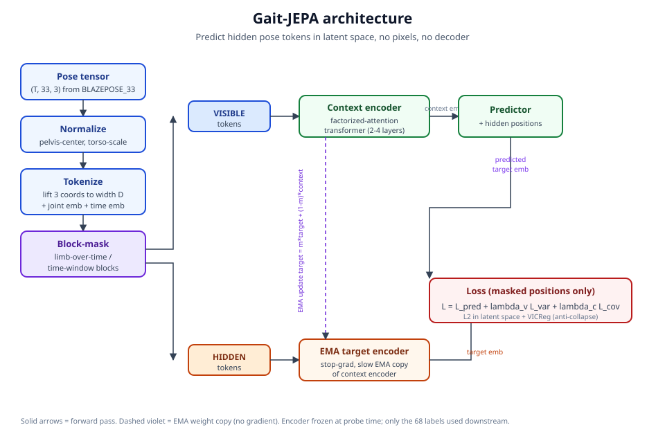
*The Gait-JEPA architecture end to end: a normalized pose tensor is tokenized and block-masked; the context encoder and predictor guess the masked target embeddings that the EMA target encoder produces, and the loss combines an L2 prediction term with VICReg.*

### Block masking: what we hide, and why blocks and not scattered dots

The whole point of a Joint Embedding Predictive Architecture, or JEPA, is that we teach the model by hiding part of the input and asking it to predict the hidden part. This is self-supervised learning: the "answers" come from the data itself, not from any human label, so we can train on unlimited unlabeled video. The critical design decision is what to hide. We hide contiguous blocks of the joint-time grid, and this choice is deliberate.

Imagine the T-by-33 grid of tokens as a checkerboard where columns are joints and rows are frames. The lazy, too-easy thing to do would be to hide scattered single cells at random. But if you hide one lone knee at one lone frame, the model can fill it in almost trivially: the same knee one frame earlier and one frame later pin it down by simple interpolation, and no real understanding of gait is required. To force genuine learning we hide blocks instead, and we mix two styles of block across the batch so the model faces both kinds of challenge.

The first style we call limb-over-time. We pick one limb, say the entire right leg (joints 24, 26, 28, 30, 32), and hide it across a window of consecutive frames. To fill this in, the model cannot interpolate from neighbors in time, because the whole limb's trajectory is gone for that stretch. It has to reason from the rest of the body: while the right leg is hidden, the visible left leg, arms, and torso still carry the rhythm of the stride, and healthy walking has a strong left-right coordination the model can exploit. This style forces the model to learn how limbs move together and how the two sides of the body relate, which is exactly the kind of coordination that clinical gait abnormalities disturb.

The second style we call time-window. We pick a short window of consecutive frames and hide all 33 joints inside it, blanking out the whole body for that stretch. Now the model has to predict how the entire body carries through the gap, essentially extrapolating a piece of the walking cycle from what came before and after. This forces reasoning about the overall progression of the gait cycle and how the body's center travels through time.

We define the limbs for the first style using the natural semantic joint groups of BlazePose: face (0-10), left arm (11, 13, 15, 17, 19, 21), right arm (12, 14, 16, 18, 20, 22), torso (11, 12, 23, 24), left leg (23, 25, 27, 29, 31), and right leg (24, 26, 28, 30, 32). Mixing limb-over-time and time-window masking across different clips in the batch means the model must become good at both spatial reasoning across the body and temporal reasoning across the stride.

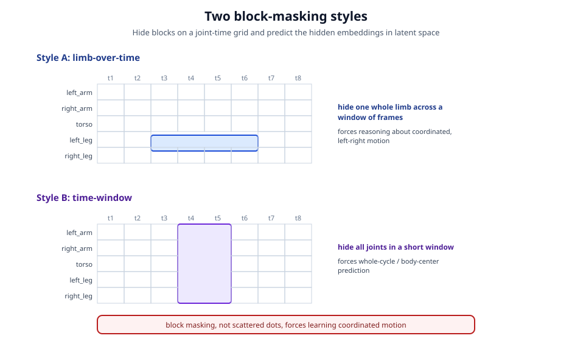
*The two block-masking styles on the joint-time grid. Style A hides one whole limb across a window of frames; style B hides all joints in a short window. Hiding blocks, not scattered dots, forces the model to learn coordinated motion.*

### The four pieces, wired together

JEPA has four components, and it helps to see the whole shape before the details. There is a context encoder that reads the visible tokens, a target encoder that reads the hidden tokens to produce the "answer key," a predictor that guesses the answer key from the context, and a loss that measures how good the guess was. The subtle and important part, which we return to below, is that the prediction happens in latent space: the model never tries to reconstruct the hidden joints' exact coordinates, only a learned summary of them. This is what lets the model ignore genuinely unpredictable detail, such as a fingertip's exact wobble or a small pose-estimator jitter, and concentrate on the meaningful structure of the motion.


#### The context encoder

The context encoder is the network we ultimately keep and reuse; everything else is scaffolding for training it. It reads only the visible tokens (the ones not hidden by the mask) and produces a context embedding, a set of D-length summary vectors that capture what the visible part of the walk looks like. It is a small spatiotemporal transformer, meaning a transformer that reasons over both space (the joints) and time (the frames). For our student sprint we use just 2 to 4 transformer layers to keep training fast on modest hardware.

A naive transformer would let every one of the T times 33 tokens attend to every other, which is expensive and also not especially gait-aware. Instead we use factorized attention: within each frame the joints attend to one another (spatial attention, "what is the rest of the body doing right now"), and then along each joint's timeline the frames attend to one another (temporal attention, "how did this landmark move over the clip"). Splitting attention this way is both far cheaper to compute and better matched to how gait actually works, since a stride is a spatial configuration that evolves in time.

#### The target encoder: a slow-moving answer key

The target encoder produces the "answer" the predictor is graded against. It reads the hidden tokens and outputs target embeddings, the latent summaries of the parts we masked out. The crucial detail is where this network comes from and how it is updated. It is not trained by gradient descent at all. Instead it is an exponential moving average, or EMA, copy of the context encoder. After each training step we nudge the target encoder's weights a tiny bit toward the context encoder's current weights, using the rule

target = m * target + (1 - m) * context,

where m is a momentum coefficient very close to 1 (we start around 0.996 and ramp it toward 1.0 over training). Because m is near 1, the target encoder changes only slowly; it is a lagging, smoothed version of the context encoder.

Two safeguards go together here. First, stop-gradient: no learning signal is allowed to flow backward through the target encoder. It is updated only by the EMA rule above, never by the loss directly. Second, the momentum ramp: as training proceeds we push m even closer to 1 so the answer key becomes ever more stable. The intuition is that if the answer key jerked around as fast as the model being trained, the model would be chasing a wildly moving target and could never settle. A slow, stable answer key that still gradually improves gives the model something consistent to aim at while both encoders slowly get better together.

#### The predictor

The predictor is the piece that does the actual guessing. It takes the context embedding (the summary of the visible tokens) together with the positions of the hidden tokens, that is, which joints and which frames were masked, and it outputs a predicted embedding for each hidden token. In effect it answers: "given what I can see, and told exactly which joint-at-which-frame you want, here is my guess for that hidden token's latent summary." It is a small network used only during training. Notice the predictor is told the positions but not the contents of the hidden tokens; it must infer the contents from context, which is what drives learning.

### The loss: measuring the guess, and preventing the model from cheating

Once we have predicted embeddings from the predictor and target embeddings from the target encoder, we need to score how close they are, but only at the masked positions, since those are the parts we asked the model to predict. The core of the score is a mean squared error, also called an L2 loss: for each hidden token we take the predicted embedding, subtract the target embedding, square the difference, and average. Call this term L_pred. Driving L_pred down means the model is predicting hidden motion well in latent space.

There is a famous trap here. Predicting in latent space means both sides of the comparison are learned, and the model can discover a shortcut: if the context encoder, target encoder, and predictor all learn to output the same constant vector no matter the input, then predicted equals target exactly, L_pred is zero, and the model has learned absolutely nothing. This failure is called representation collapse, and left unchecked it is the single most likely way for this kind of training to fail.

Our defense is VICReg, short for Variance-Invariance-Covariance Regularization. It adds two terms to the loss that make constant, collapsed embeddings impossible. The variance term looks at each dimension of the embeddings across the batch and insists that its standard deviation stay above a target value (a hinge set around 1.0); if any dimension starts flattening toward a constant, this term pushes back, so nothing can collapse to a single value. The covariance term looks at pairs of different embedding dimensions and pushes their covariances toward zero, which discourages different dimensions from carrying the same information and instead spreads meaning out across the representation. Together these guarantee the embeddings stay varied and informative. It is worth stressing what this buys us: our JEPA needs no negative examples and no decoder to avoid collapse. The slow EMA target plus VICReg is the entire anti-collapse mechanism.

The full objective is

L = L_pred + lambda_v * L_var + lambda_c * L_cov,

computed on the masked positions only, where lambda_v and lambda_c are weights that set how strongly we enforce the variance and covariance terms relative to the prediction term. L_pred teaches the model to predict hidden motion; the VICReg terms keep the learned summaries from collapsing into a useless constant.

### The pretraining loop and collapse monitoring

Putting the pieces in motion, one training step looks like this. We draw a batch of clips, normalize and tokenize them, and generate a mask for each, mixing the two masking styles across the batch. The context encoder reads the visible tokens; the target encoder reads the hidden tokens under stop-gradient to make the answer key; the predictor guesses the hidden targets from the context and the hidden positions. We compute L = L_pred + lambda_v L_var + lambda_c L_cov on the masked positions, take a gradient step on the context encoder, predictor, and the token embeddings (everything except the target encoder), and finally update the target encoder by the EMA rule with the current momentum. We repeat this over all the unlabeled clips for many passes through the data.

Because collapse is the chief risk, we watch for it explicitly rather than hoping it does not happen. The cleanest early-warning signal is the per-dimension standard deviation of the embeddings, exactly the quantity the VICReg variance term controls: if it starts sliding toward zero, the representation is beginning to collapse. We log this standard deviation, the L2 prediction term, and each VICReg term separately throughout training, so a collapse shows up as a distinctive signature (prediction error falling while embedding variance also falls toward zero) long before it would quietly ruin the final result.

### The frozen downstream probe: where the 68 labels are finally spent

Everything up to this point used zero clinical labels. The payoff comes now. After pretraining we freeze the context encoder, meaning we lock its weights so they no longer change, and we use it purely as a fixed feature extractor. For each of our 68 clinically labeled clips we run it through the frozen encoder, then mean-pool the clip's token embeddings, that is, average them into a single D-length vector that summarizes the whole clip. On top of these frozen summaries we fit two small classifiers on the labels: a linear probe, which is ordinary logistic regression, and separately a small multilayer perceptron (a shallow neural network) probe. We use the same 70/30 train/test split as the prior ASDRP work.

The reason for keeping the encoder frozen in our headline result is fairness of comparison. The prior Random Forest baseline was a light classifier sitting on top of fixed features (the 82 hand-engineered numbers). By freezing our encoder we make our comparison apples-to-apples: both approaches are a fixed feature extractor plus a light classifier, and the only difference is whether the features were hand-designed or learned without labels. This is the only place in the entire method where the 68 precious labels are used. We will separately report a version in which the encoder is fine-tuned on the labels as an upper-bound "ceiling" number, but that is not the headline, precisely because it is no longer a clean comparison.

### The data and preprocessing pipeline, end to end

The unlabeled fuel for pretraining comes from GAVD, the Gait Abnormality in Video Dataset (Ranjan et al., 2025), the largest open collection of links to gait videos with clinical annotations and bounding boxes. We use its condition folders as raw material without their labels, spanning normal, abnormal, antalgic, cerebral palsy, exercise, inebriated, myopathic, parkinsons, prosthetic, stroke, and stylized gaits. Every one of these videos, hundreds in total, becomes unlabeled training material, which is exactly the pool the old pipeline had to discard. Note that GAVD's folder names (antalgic, inebriated, exercise, and so on) are its own broad taxonomy, not our five clinical classes; because pretraining discards labels entirely, this mismatch is intentional and harmless, and stroke's absence from a matching folder does not matter, since the 68 labeled stroke, Parkinson's, and other clips enter only at the frozen-probe stage.

The preprocessing runs in a fixed order. First we run MediaPipe BlazePose on each video to get the (T, 33, 3) pose tensor. Second we apply a quality filter: pose estimation is imperfect, and any clip with too many low-confidence landmarks is dropped so the model is not fed garbage geometry. Third we normalize as described earlier, pelvis-centering then torso-scaling, to remove camera position and body size. Fourth we resample to a fixed frame rate and cut each sequence into overlapping windows of fixed length (T between 16 and 32 frames); the overlap is what lets a modest number of source videos yield many training clips. Fifth, and only for pretraining, we apply light augmentation to make the learned features more robust: small time crops, tiny random jitter added to coordinates, and a horizontal left-right flip.

That last augmentation carries a subtle requirement worth spelling out. If we mirror the skeleton left-to-right, a point that was the left knee is now geometrically where a right knee would be, so we must also remap the joint indices, swapping every left landmark with its right counterpart, or the joint embeddings would be attached to the wrong side of the body and the flipped clip would be nonsense. Done correctly, the left-right flip roughly doubles our effective data and teaches the model that a walk and its mirror image are the same kind of motion. We stress that augmentation is applied only during pretraining; the 68 labeled clips used for the probe are evaluated without augmentation so that the reported accuracy reflects genuine, untouched test clips.

Taken together, this pipeline replaces the old "video to 82 hand features to Random Forest" path with "video to normalized skeleton to learned-without-labels encoder to tiny probe." The expensive, guess-laden feature engineering is gone, the previously wasted unlabeled video now does the heavy lifting, and the 68 clinical labels are spent only at the very end, on the one task that truly needs them.

## The Neuroscience Connection

A machine that learns "the shape of walking" is only useful in the clinic if the shape it learns lines up with the reasons people walk differently. This section, led by Penny Inouye, lays down that grounding. It explains, in plain terms, why Parkinson's disease and stroke damage walking in fundamentally different ways, it names the specific measurable gait features that each mechanism produces, and it shows exactly where our learning method is designed to feel each mechanism. The goal is a representation whose internal axes are not arbitrary but map onto the same axes a neurologist reasons about when watching a patient walk down a hallway.

### Two diseases, two very different kinds of damage

Walking is not one skill; it is a whole stack of them working together. Somewhere in the brain a rhythm has to be set, the two sides of the body have to take turns cleanly, and the body has to stay balanced over a narrow moving base of support. Parkinson's disease and stroke break different rungs of that stack, and that is precisely why the two can be told apart from motion alone.

Parkinson's disease begins deep in the brain, in a small structure called the substantia nigra ("black substance," named for its dark pigment). The neurons there make dopamine, a chemical messenger that lets brain regions signal one another. In Parkinson's, those dopamine-making neurons slowly die. Their loss disrupts the basal ganglia, a cluster of structures that acts like the brain's gearbox and metronome for movement: it helps start a movement and keep it correctly timed and sized. When that metronome falters, walking becomes slow (a symptom clinicians call bradykinesia, literally "slow movement"), steps shrink into a shuffle, arm swing fades, and patients sometimes fall into festination, a hurried burst of short quick steps as the body rushes to keep up with its own tipping center of gravity. Two features of the disease matter enormously for us. First, Parkinson's is variability-driven: the failure is one of rhythm and consistency, so no two steps come out quite the same. Second, it usually starts on one side but becomes bilateral over time, so eventually both legs are affected (source: neuroscience/pd-features.csv).

Stroke damages walking in an almost opposite way. A stroke is an injury, from a blocked or burst blood vessel, to the upper motor pathway, the wiring that carries movement commands from the brain down through the corticospinal tract (the main "command cable" from the cortex to the spinal cord). Because that injury is on one side of the brain and the cabling crosses over, the result is a one-sided problem: spastic hemiparesis, meaning stiff, weak muscles on one half of the body (the "paretic," or weakened, side). To walk, the person compensates. They swing the stiff weak leg outward in a semicircle to clear the floor, a motion called circumduction, and the knee stays stiff through the swing (stiff-knee gait). The key contrast with Parkinson's is that stroke produces a fixed, one-sided deficit: one side is clearly and consistently worse, not a rhythm that wanders from step to step (source: neuroscience/stroke-features.csv).

So the headline is simple and it drives every design choice below. Parkinson's is a timing and variability disease that ends up on both sides; stroke is a fixed one-sided weakness. A representation that is good for this problem must preserve the axes that separate those two stories, and must not let them blur into a single vague notion of "abnormal gait."

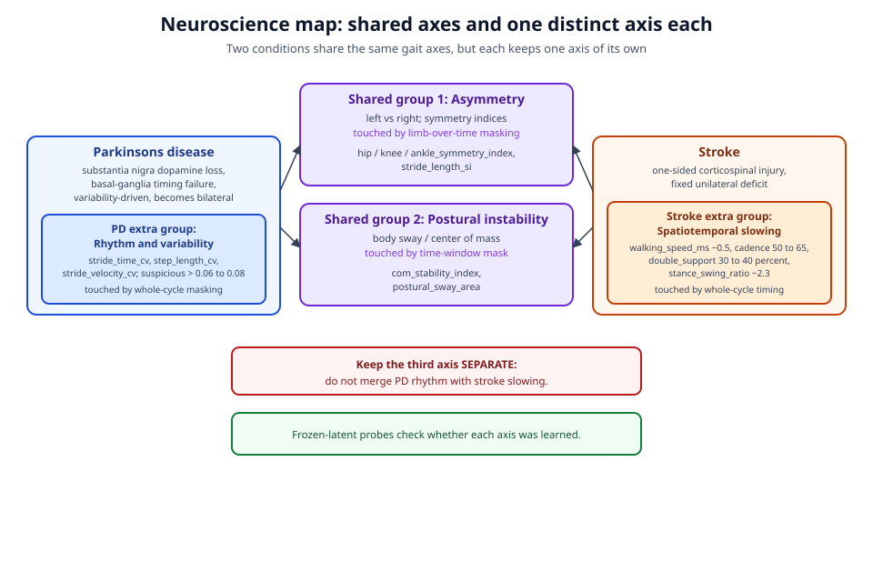
*The neuroscience map. Parkinson's disease and stroke share an asymmetry axis and a postural-instability axis, but keep a distinct third axis each, rhythm and variability for Parkinson's and spatiotemporal slowing for stroke, which the method is built to keep separate.*

### Four mechanism groups: two shared, one distinct to each disease

Penny Inouye's clinical grading of the gait features organizes them into four mechanism groups. Each feature in the tables carries three things: a neurological reason it exists, a documented "what counts as significant" threshold, and a source link, and each is graded H, M, L, or NA for how strongly it should drive our representation. We build only around the H (high-priority) features. Two of the four groups are shared by both diseases, and one group is distinct to each; that structure, two shared axes and one private axis per disease, is what keeps Parkinson's and stroke separable.

**Shared group 1: asymmetry (left versus right).** Both diseases disturb the clean left-right alternation of a healthy walk, so both light up a family of symmetry features. For Parkinson's the high-priority members are the stride-length symmetry index, the hip, knee, and ankle symmetry indices, the overall, movement, and temporal symmetry scores, the phase asymmetry, and the cycle-duration asymmetry (source: neuroscience/pd-features.csv). For stroke the high-priority members are knee asymmetry (the stiff-knee signature, counted as significant when the two knees differ in flexion by at least 17 degrees), ankle asymmetry, the stride-length symmetry index (around 27.9 percent in stroke), the stance-time and swing-time symmetry indices, and the overall, positional, movement, and temporal symmetry scores (source: neuroscience/stroke-features.csv). A symmetry index is just a normalized "how different are the two sides" number, and the documented rule of thumb is that its absolute value above roughly 16 percent is clinically meaningful. Asymmetry is a shared axis: both diseases raise it. What differs is its character, and that difference is carried by the two private groups below.

**Shared group 2: postural instability (body sway).** Both diseases make balance worse, and the high-priority sway features are shared: the mean and standard deviation of center-of-mass movement, the center-of-mass stability index, and the postural sway area (source: neuroscience/pd-features.csv; neuroscience/stroke-features.csv). This group matters to us for a happy technical reason. Because we normalize every clip by centering it on the pelvis and rescaling by torso length (described in the method), the pooled trajectory of the body's tokens becomes a direct stand-in for how much the trunk sways. In other words, our normalization does not erase sway; it isolates it, turning the center-of-mass path into a clean proxy for this exact clinical axis.

**Parkinson's-only group 3: rhythm and variability.** Here the two diseases part ways. Because Parkinson's is fundamentally a failure of the brain's movement metronome, its signature is high cycle-to-cycle variability: the stride-time coefficient of variation, the step-length coefficient of variation, and the stride-velocity coefficient of variation, all high-priority and considered suspicious above roughly 0.06 to 0.08 (source: neuroscience/pd-features.csv). A coefficient of variation is simply the spread of a measurement divided by its average, a unitless "how inconsistent is this from step to step" score, so a high value is exactly the fingerprint of a wandering rhythm. The shuffling of Parkinson's shows up in the same group as a short stride length in meters (high-priority, suspicious below roughly 0.7 to 0.9 meters).

**Stroke-only group 3: spatiotemporal slowing.** Stroke's private axis is not variability but a reshaped, slowed cycle, the consequence of reduced corticospinal drive. Its high-priority members are the walking speed in meters per second (around 0.5 in stroke versus about 1.4 for a healthy walk), the cadence in steps per minute (around 50 to 65), the double-support percentage, the fraction of the cycle with both feet on the ground (30 to 40 percent in stroke versus about 20 percent normal), and the stance-to-swing ratio (around 2.3 versus about 1.6 normal) (source: neuroscience/stroke-features.csv). These are timing and phase quantities. A stroke patient walks slowly and spends a long time on two feet because the weak side cannot safely bear load alone, but crucially their slow steps are consistently slow, not erratically timed the way Parkinson's steps are.

### Why the third axis must never be merged

It is tempting, when two diseases share two of their three axes, to fold the third together and call it "gait timing." We must not. The shared asymmetry and postural-stability axes tell us that something is wrong; they do not tell us which disease. The separating information lives entirely in the third axis, and the third axis means something different in each disease. In Parkinson's, the asymmetry is variability-driven and, over time, bilateral: both sides eventually falter, steps hurry and wander, and the coefficients of variation climb. In stroke, the asymmetry is a fixed unilateral deficit: one side is reliably worse, the steps are wider and the weak leg circumducts, and the cycle is slow but steady. Collapsing "high stride-time variability" (Parkinson's) into the same dimension as "low walking speed with long double support" (stroke) would throw away the one thing that distinguishes them. So our representation is asked to preserve two distinct third-axis directions, a rhythm-and-variability direction for Parkinson's and a spatiotemporal-slowing direction for stroke, sitting alongside the two shared directions. Keeping these separate is the whole clinical point of the project, not a detail.

### The features we deliberately ignore

Just as important as knowing what to represent is knowing what to skip. Some features come out graded NA or low across both diseases, meaning both conditions agree on them and a good representation loses nothing by ignoring them. These include the single-joint means (for example each hip, knee, or ankle angle averaged over the walk), the single-joint standard deviations, and the step-width statistics (source: neuroscience/pd-features.csv; neuroscience/stroke-features.csv). We do not build probes around these. The reasoning is honest and worth stating plainly: a feature that neither disease moves cannot help separate them, and chasing it would invite the model to spend capacity on noise. Naming the not-relevant list up front is also a guard against the classic trap of reporting a feature the model happens to predict well but that carries no clinical signal.

### How the method touches each mechanism group

The design of our masking and normalization is not generic; each piece is chosen to put learning pressure on a specific clinical axis. This is where the neuroscience and the machine learning meet.

Limb-over-time masking pressures the shared asymmetry axis. By hiding one limb (say the left leg) across a window of frames and asking the model to predict it in latent space, we force the model to reason about coordinated motion and, above all, about the left-right relationship, because the most informative clue to a hidden left leg is the visible right leg and the phase relationship between them. A representation that has learned how the two sides should relate is exactly a representation that has an asymmetry axis.

The pelvis-centered center-of-mass proxy pressures the shared postural-stability axis. As noted above, centering on the pelvis and scaling by torso length turns the pooled body-token trajectory into a direct measure of sway, so any objective that depends on reconstructing body position in latent space is implicitly asked to encode how the trunk moves, which is the postural-instability group.

Whole-cycle time-window masking pressures both private axes at once, through timing. By hiding a short window and all 33 joints in it, we force the model to extrapolate how the whole body carries through the missing stretch of the walking cycle. To do that well it must encode the rhythm and pacing of the cycle. That timing pressure is what exposes Parkinson's rhythm-and-variability axis (can the model tell that this rhythm wanders?) and, through the same exposed timing, stroke's spatiotemporal-slowing axis (can it tell that this cycle is slow and heavy on double support?). One masking style, aimed at timing, feeds both private axes while the two block-masking styles between them cover the two shared axes.

It is worth contrasting these choices with the wrong, too-easy alternative: hiding scattered single joints. Scattered single-joint masking can often be solved by simple spatial interpolation from neighboring joints, which teaches the model geometry but not the coordinated, timed structure of a gait cycle. Block masking in space and time is what forces the clinically meaningful reasoning.

### Validating cheaply, and what would count as failure

We only have 68 clinically labeled sequences, so every label is precious and we refuse to spend them training the encoder. Instead we validate the representation the way a scientist would probe a black box from the outside, using the documented thresholds and H-priority features in three complementary roles.

First, the frozen-latent linear probes. We freeze the learned context encoder, pool each clip into a single vector, and fit lightweight probes (a linear regression or a small classifier) that map that frozen vector to the H-priority clinical scalars: the symmetry indices, the center-of-mass sway measures, the Parkinson's coefficients of variation, the stroke speed and double-support and stance-swing quantities. If the frozen representation already contains these clinically meaningful numbers, a light probe will recover them; if it does not, no probe will, and that is a clean, honest test. Because the probe is frozen and light, this mirrors the apples-to-apples comparison used elsewhere in the proposal against the hand-feature Random Forest baseline.

Second, the documented numeric thresholds do triple duty. They act as gentle priors that nudge masking and prediction toward the clinically active parts of the signal; they serve as probe targets, so we can ask directly whether the representation crosses the same lines a clinician uses (symmetry index above 16 percent; stride-time coefficient of variation above 0.06; knee-flexion difference at or above 17 degrees; stride length below roughly 0.7 to 0.9 meters; stroke walking speed near 0.5 meters per second); and they serve as interpretability checks, letting us read the representation back out in human terms rather than trusting an opaque score.

Third, the mechanism-grouped error decomposition. Rather than reporting one accuracy number, we break the probe error down by mechanism group, asking separately how well the frozen representation captures asymmetry, postural stability, Parkinson's rhythm and variability, and stroke spatiotemporal slowing. This is where we learn not just whether the model works but why, and where it fails.

Finally, honesty about the null result. This section makes a falsifiable promise. If the frozen representation cannot recover the H-priority scalars above chance, if the mechanism-grouped decomposition shows the Parkinson's rhythm axis and the stroke slowing axis are tangled rather than separable, or if the probes lean on the not-relevant single-joint and step-width features instead of the clinically graded ones, then the neuroscience grounding has not been achieved and we will report exactly that. The value of writing the mechanisms down this precisely, in advance, is that it tells us clearly what success and failure each look like before we ever fit a probe.

## Evaluation Plan

Every claim we make will live or die by a measurement, and this section lays out exactly which numbers we will report, how we will produce them, and what would count as success or as an honest failure. We organize the plan around the four research questions from the previous section, then add three sanity checks that run continuously during training, and we close with an unflinching account of what a null result would look like and why it would still be worth publishing. The guiding principle throughout is a fair fight: wherever we compare Gait-JEPA to the prior random-forest baseline, both sides see the same 68 labeled sequences, the same 70/30 train/test split, and, wherever possible, a classifier of the same weight class, so that any difference we report reflects better learned features rather than a heavier or luckier model.

A note on vocabulary before we begin. A **frozen encoder** means we run our pretrained network once to turn each walking clip into a fixed list of numbers (its embedding) and then never adjust the network again; only a small classifier on top of those numbers is trained on the labels. This matters because the prior random forest also worked from fixed features (the 82 hand-engineered numbers), so freezing keeps the comparison apples to apples: both methods reduce to "fixed features plus a light classifier." Where we instead let the network keep learning on the labeled data, we call that **fine-tuning**, and we always report it separately as a best-case ceiling, never as the headline, because fine-tuning on only 68 examples can flatter a method in ways that will not generalize.

### RQ1: Can frozen JEPA features match or beat the 76 percent baseline?

The primary metric is **five-class test accuracy** on the held-out 30 percent of the 68 clinically labeled sequences, using the identical split the prior ASDRP work used, so our number sits directly next to theirs. Chance on this five-way problem (normal, Parkinson's, stroke, cerebral palsy, myopathic) is 20 percent, and the standing baseline to beat is the random forest at 76 percent. We will call it a match at 76 percent or above and a clear win at 80 percent or above.

Accuracy alone hides a lot, especially when the classes are as lopsided as ours (12, 9, 12, 15, and 20 sequences). A model can score respectably while quietly ignoring the smallest class, so we report two more views. The first is a **confusion matrix**, a five-by-five grid whose rows are the true condition and whose columns are the predicted condition; the diagonal holds correct calls and every off-diagonal cell names a specific mistake, such as calling a stroke gait a Parkinson's gait. The second is **per-class F1 score**. F1 is the harmonic mean of precision and recall for one class, where precision asks "of the clips we labeled stroke, how many really were stroke," recall asks "of the clips that really were stroke, how many did we catch," and the harmonic mean is a kind of average that stays low unless both are high. We report F1 per class and then a macro-average (the plain mean across the five classes, which weights a nine-example class as heavily as a twenty-example class) precisely because it refuses to let strong performance on the big class paper over weakness on the small one.

To make the comparison honest we will run a full **baseline ladder**, from the simplest prior methods up through our own conditions, all on the same split:

- The prior classical models on the 82 hand-engineered features: k-nearest-neighbors (k = 3), a decision tree (depth 5), and the headline random forest (100 trees, 76 percent).
- A **fair-fight control**: our exact probe (the same logistic-regression and MLP classifiers described next) trained on those same 82 hand features instead of on JEPA embeddings. This is the single most important control in the whole proposal, because it separates "our features are better" from "our classifier is better." If the fair-fight probe on hand features already reaches, say, 78 percent, then any gain our JEPA probe shows over the random forest is partly just a stronger classifier, and we must say so.
- Our headline conditions: a **linear probe** (logistic regression) on the frozen, mean-pooled JEPA embeddings, and separately a **small MLP probe** (one hidden layer) on the same embeddings. The linear probe is our primary headline number because a linear classifier can only exploit structure the encoder has already made linearly readable, so beating the baseline with it is the strongest evidence that pretraining, not the probe, did the work.
- A **fine-tuned ceiling**: the encoder unfrozen and trained end to end on the 68 labels, reported as an upper bound only.

Because 68 examples make any single split noisy, we will report each probe accuracy with a spread (repeated stratified splits or cross-validation on the training portion) rather than a lone point estimate, so a judge can see whether a two-point lead is real or within the noise.

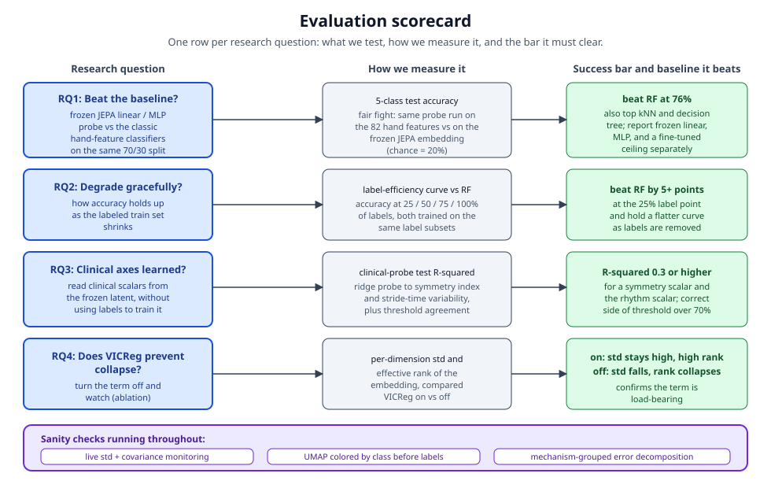
*The evaluation scorecard: each research question mapped to how we measure it and the success bar it must clear, with the sanity checks that run throughout training.*

### RQ2: Does the JEPA probe degrade more gracefully as labels shrink?

The deepest promise of self-supervised pretraining is label efficiency: having learned the shape of walking from thousands of unlabeled clips, the encoder should need fewer labeled examples to reach a given accuracy. We test this with a **label-efficiency curve**. Holding the test set fixed, we train both the frozen-JEPA probe and the random forest on 25, 50, 75, and 100 percent of the labeled training set, drawing the subsets in a stratified way so every class stays represented even at 25 percent, and we plot test accuracy against the fraction of labels used. To average out the luck of which few examples land in a small subset, each fraction is repeated over several random draws and we plot the mean with its spread.

Success here is a visible gap in JEPA's favor at the sparse end of the curve: at the 25 percent and 50 percent points the frozen JEPA probe should sit clearly above the random forest trained on the very same subset, with a target of at least a five-accuracy-point margin at the 25 percent point. This is often the most persuasive single result a pretraining method can show, because it speaks directly to our core bottleneck, the scarcity of doctor-labeled gait, and because the two curves converging only at the full-data end would itself be an honest and informative outcome.


### RQ3: Did the latent space capture clinical structure it was never told about?

This is the question a clinician cares about most: without ever seeing a symmetry index or a stride-time measurement, did the encoder nonetheless arrange its latent space so that these clinically meaningful quantities are readable from it? We test this with tiny **ridge linear probes**, one per target, mapping the frozen pooled embedding of a clip to a documented clinical scalar. The scalars, our high-priority set, are stride_length_si, hip_symmetry_index, knee_symmetry_index, ankle_symmetry_index, stride_time_cv, and com_stability_index, each computed for the same clips by the existing 82-feature pipeline, so no new labeling is required.

The metric is **R-squared** on the test clips, the fraction of a target's variation the probe explains: 1.0 is perfect prediction, 0.0 is no better than always guessing the average, and negative values mean the probe does worse than that trivial guess. We call it a success when R-squared is clearly above zero, with a target of at least 0.3, for at least one asymmetry scalar and for the rhythm scalar stride_time_cv, since asymmetry and rhythm are the two axes clinical gait analysis leans on most. Because a linear probe can only read out what the encoder has laid down linearly, a positive R-squared is direct evidence that block-masked prediction on skeletons surfaced these clinical axes on its own.

We add one interpretability check that a non-specialist can grasp instantly: **threshold agreement**. The clinical literature marks certain cut points as meaningful, a symmetry index above 16 percent, a stride-time coefficient of variation above 0.06, a knee-flexion difference of 17 degrees or more. For each clip we ask whether the probe's prediction lands on the same side of the documented threshold as the true value, and we report the fraction of clips where it agrees, with a target above 70 percent. This turns a continuous R-squared into a plain clinical yes-or-no ("would this reading flag the patient the same way the real measurement would?") and guards against a probe that tracks a scalar loosely but keeps crossing the line that actually matters.


### RQ4: Is VICReg actually load-bearing against collapse?

Recall the collapse trap: a self-supervised model can score a perfect prediction loss by cheating, emitting the same constant embedding for every input so that predicted and target trivially agree while nothing has been learned. We claim VICReg's variance and covariance terms are what prevent this, and RQ4 is the ablation that tests the claim by training twice, once with VICReg on and once with it off, and watching the embeddings.

We track two quantities across pretraining. The first is the **mean per-dimension embedding standard deviation**, a measure of how much the numbers wiggle from clip to clip; if the model is collapsing toward a constant, this drives toward zero. With VICReg on we expect the standard deviation to stay well above zero, comfortably above half of its target hinge value; with VICReg off we expect it to fall toward zero. The second is the **effective rank** of the embeddings, which counts, loosely, how many genuinely independent directions the representation uses; a healthy representation spreads its information across many directions (high rank), while a collapsing one crushes everything onto a few or one (low rank). VICReg's covariance term specifically pushes different dimensions to carry different information, so we expect it to keep effective rank high. Seeing the "off" run slide toward zero standard deviation and low rank while the "on" run stays healthy is the clean demonstration that the regularizer is doing the job we assigned it.


### Sanity checks that run alongside training

Three diagnostics run continuously or at checkpoints, so that we catch trouble early and can show a judge the representation forming before any label is involved.

The first is **live monitoring** of the same embedding standard deviation and covariance from RQ4 during every pretraining run, not only the ablation. This is our early-warning system: if the standard deviation starts sliding toward zero, we halt and adjust rather than burning compute training a collapsed model, which is exactly the mitigation we committed to in the risk plan.

The second is a **UMAP projection** of the frozen embeddings, colored by clinical class. UMAP is a standard tool that squeezes each high-dimensional embedding down to a single point on a two-dimensional map while trying to keep clips that were close in the original space close on the map, so we can see the geometry with our eyes. Crucially we compute it on embeddings from the encoder that was trained with no labels at all; if clips of the same condition cluster together on the map even though the encoder never saw the diagnoses, that is a striking, visual, pre-label demonstration that the model organized gait by something meaningful. We show the map before any probe is trained precisely to make the point that the structure was there first.

The third is a **mechanism-grouped error decomposition**. During pretraining the model produces a prediction error at every masked token, and rather than reporting one averaged number we group those already-computed errors by what the mask was hiding: leg-limb tokens (which speak to asymmetry), whole-time-window masks (which speak to rhythm and cycle-to-cycle variability), and the pooled center-of-mass trajectory (which speaks to postural stability). This costs almost nothing because it only sorts residuals we have already computed, yet it tells us which clinical mechanism the model finds hardest to predict, and it lets us connect a pretraining behavior directly to the clinical axes RQ3 probes for.

### Evaluation scorecard

To keep every promise auditable, we will maintain a single scorecard that maps each research question to its metric, the baseline or comparison it is judged against, and the numeric bar we set in advance for calling it a success. Fixing these bars before we run the experiments is what keeps us honest: we cannot move the goalposts after seeing the numbers.


### What a null result looks like, and why it still teaches

We would rather report an honest failure than an inflated success, so we state now what failure would look like. The frozen probe might not clear 76 percent, or might clear it only by borrowing strength from a heavier classifier that the fair-fight control exposes. The label-efficiency curves might overlap instead of separating at the sparse end. The clinical probes might return R-squared near zero, meaning the latent space, while good enough to separate the five diagnoses, did not lay down the specific asymmetry and rhythm axes clinicians name. The VICReg ablation is the one result we expect to hold regardless, since collapse prevention is well established, but even there an anomaly would be informative.

None of these outcomes would be wasted. A probe that fails to beat the random forest, combined with a fair-fight control and a label-efficiency curve, would tell us whether the ceiling is the features or the tiny labeled set. Clinical probes near zero would tell us that generic block masking on skeletons does not by itself surface the clinical axes, which points the next study squarely at either richer and cleaner unlabeled data or a masking design that deliberately targets asymmetry and rhythm. And a curve that only converges at full data would still quantify how much unlabeled pretraining is worth per labeled example. Because we have pre-registered the metrics and the success bars above, a clean negative result on a well-run experiment tells the field something true about the limits of skeleton self-supervision on small clinical gait data, and that is a contribution we are prepared to stand behind.

## Timeline, Roles, and Deliverables

We write this section as a working plan rather than a wish list. The core engineering effort is a focused three-week sprint, already underway as of mid-July 2026, that takes us from raw pose data to a trained encoder and a full set of measured results. That sprint sits inside a slightly longer calendar arc: the neuroscience grounding, which is what turns a machine-learning demo into a clinically meaningful study, is led by Penny Inouye and lands in early August 2026, at which point the three of us assemble the final written paper. The plan below is deliberately concrete about what happens in each week, who owns it, and what artifact each stage must produce, because a proposal that cannot say when it will be done and what "done" looks like is only half a proposal.

A note on terms before the schedule. When we say "encoder" we mean the part of the model that reads a walking clip and turns it into a compact list of numbers summarizing the motion; "frozen" means we lock its learned settings so they no longer change, which lets us test the summary fairly. A "probe" is a small, simple classifier we attach on top of those frozen summaries to read out a clinical label; it is intentionally weak so that any success we see comes from the encoder's understanding of gait, not from the classifier doing the heavy lifting. An "ablation" is a controlled experiment where we remove one ingredient and re-measure, so we can prove that ingredient actually mattered.

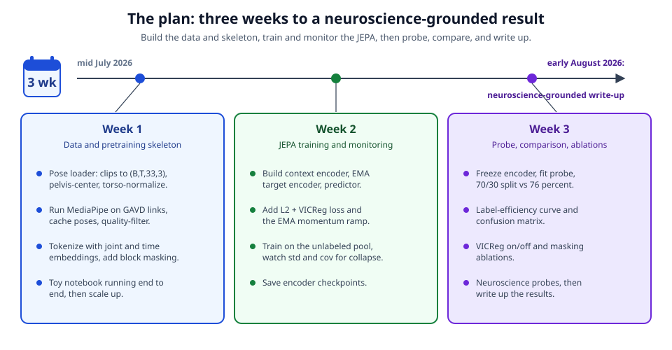
*The plan: a three-week core build inside a calendar arc from mid-July to the early-August 2026 neuroscience-grounded write-up.*

### The three-week core build

**Week 1 - Data and skeleton.** The first week builds the two things everything else stands on: a clean stream of pose data and the model skeleton that will consume it. On the data side we run our existing video-to-pose pipeline over the full GAVD collection, converting each video into a sequence of 33 tracked body joints in three dimensions per frame using Google's BlazePose landmarker, then slicing every sequence into many overlapping fixed-length windows of 16 to 32 frames so that a modest number of source videos yields a large number of training clips. Each clip is cleaned the same way: we drop clips with too many low-confidence landmarks, re-center every pose on the pelvis and rescale by torso length so the model cannot cheat off where the walker happened to stand in the frame, and resample to a fixed frame rate and window length. In parallel we stand up the model itself: the tokenizer that lifts each joint's three coordinates into the model's working width and adds learned "which joint" and "which frame" tags, and the small spatiotemporal transformer that serves as the context encoder, its exponential-moving-average twin that serves as the target encoder (the slowly updated "answer key"), and the predictor. By the end of Week 1 we can push a real batch of clips through an untrained model without errors and confirm the tensor shapes and masking logic are correct.

**Week 2 - Training and monitoring.** The second week is pretraining and, just as importantly, watching the pretraining. This is where the model learns to hide part of a walking clip and predict the hidden part in latent space, using both masking styles mixed across the batch: limb-over-time masking, which hides one limb across a window of frames and forces the model to reason about coordinated, left-versus-right motion, and time-window masking, which hides all joints in a short stretch of time and forces whole-cycle extrapolation. The single largest risk in this kind of self-supervised training is representation collapse, where the model cheats by emitting the same constant summary for every clip and drives its own error to zero while learning nothing. We guard against it with the slow-moving target encoder plus VICReg regularization, and we do not take that guard on faith: throughout the week we monitor the per-dimension standard deviation of the embeddings (it must stay off the floor), the off-diagonal covariance (it must stay near zero), and the prediction loss, so that collapse, if it starts, is visible within minutes rather than discovered days later. By the end of Week 2 we have a trained context encoder checkpoint and the training curves that document a healthy, non-collapsed run.

**Week 3 - Probe, comparison, ablations, and write-up.** The third week is where the encoder meets the clinical labels and the four research questions get answered. We freeze the context encoder, mean-pool each clip's token summaries into a single vector, and fit two light probes on our 68 clinically labeled sequences: a linear probe (logistic regression) and a small neural probe, using the same 70/30 train/test split as the prior ASDRP work so the comparison is honest. We then run the full experiment battery: overall accuracy against the 76 percent Random Forest baseline; a label-efficiency curve that retrains the probe on shrinking fractions of the labels to show how few labels the frozen features can get away with; a clinical-probe table that regresses the frozen features onto Penny Inouye's graded features and reports how well each is recovered along with agreement on her documented thresholds; and the VICReg ablation that removes the regularizer to demonstrate that without it the representation collapses and accuracy falls. Alongside the headline numbers we produce a mechanism-grouped error decomposition, breaking mistakes down along the asymmetry, postural-stability, rhythm/variability, and spatiotemporal-slowing axes so that we can say not just how often the model is right but where and why it is wrong. Week 3 closes with a complete results draft ready to fold into the paper.

### Roles

The three of us are equal co-authors, and the split of labor follows our strengths. Alex Mui and Theodore Mui lead the machine-learning and pose-extraction work: the video-to-pose pipeline, the tokenizer and transformer, the pretraining loop and its collapse monitoring, and the probe experiments and ablations. Penny Inouye leads the neuroscience grounding, which is the spine that keeps the project clinically honest rather than merely technically impressive. All three of us co-write the paper.

| Contributor | Primary responsibilities | Key deliverables owned |
| --- | --- | --- |
| Alex Mui | Machine-learning and pose pipeline: BlazePose extraction, cleaning and normalization, tokenization, context/target encoders and predictor, masking | Pose-processing pipeline, model implementation, trained encoder checkpoint |
| Theodore Mui | Machine-learning training and evaluation: pretraining loop, VICReg and collapse monitoring, frozen-feature probes, label-efficiency curve, VICReg ablation | Training run and curves, probe results, ablation results |
| Penny Inouye | Neuroscience grounding: clinical feature grading (high/medium/low priority), documented thresholds, mechanism interpretation across the four axes, clinical validation of the probes | Graded feature set, threshold definitions, clinical-probe validation and mechanism error decomposition |
| All three | Co-writing, framing, and interpretation | The written proposal and final paper |

### Deliverables

At the end of this work we will hand over a small, self-contained set of artifacts that together let a reader reproduce and judge every claim we make. First, a trained, frozen Gait-JEPA encoder checkpoint, the reusable summary-maker that can turn any walking clip into a compact representation without needing a single label. Second, a reproducible notebook series, runnable in a free cloud environment (Colab), that walks from raw pose data through pretraining to the probes and the plots, so that the results are not a one-time run on our machines but something a mentor or judge can execute themselves.

Third, the results for our four research questions, reported together so their story holds up as a whole: probe accuracy measured against the 76 percent Random Forest baseline; the label-efficiency curve showing how accuracy holds up as we starve the probe of labels; the clinical-probe table reporting how well the frozen features recover Penny Inouye's graded clinical features, with the R-squared for each feature and an explicit check of agreement on her documented numeric thresholds; and the VICReg ablation quantifying how much the regularizer buys us. Fourth, the mechanism-grouped error decomposition that maps the model's mistakes onto the four clinical axes and keeps Parkinson's disease and stroke distinct, since their shared asymmetry and postural-stability signatures must not be allowed to paper over their different third axis, rhythm and variability for Parkinson's versus spatiotemporal slowing for stroke. Fifth and last, the written paper itself, which is this proposal carried through to grounded results in early August 2026.

We will also state plainly what would count as a null result, because a plan that can only succeed is not a plan we trust. If the frozen features match but do not beat the 76 percent baseline, if the label-efficiency curve shows no advantage at small label counts, if the clinical probes recover the graded features no better than chance, or if removing VICReg does not measurably hurt, then the central bet of this proposal has not paid off, and we will report that outcome as clearly as we would report a success.

## Risks, Limitations, and Feasibility

No honest proposal should read like a sales brochure, and this section is where we try hardest to argue against ourselves. Below we walk through the five failure modes we think are most likely to bite us, and for each one we say plainly what would count as the plan going wrong and what we will do about it. We then step back and name the limitations that will remain true even if everything goes right, because a screening tool that oversells itself is worse than one that is modest and correct. We close by explaining why, despite all of this, we believe a small high-school team can actually finish this work in the time we have.

### Risk 1: Too little unlabeled data survives filtering

The whole premise of this project is that unlabeled walking video is cheap and plentiful, so we can pretrain a model on far more motion than the 68 labeled sequences the classic pipeline was stuck with. That premise depends on the GAVD collection giving us enough usable pose sequences after we throw away the bad ones. Our preprocessing deliberately discards clips where too many of the 33 tracked joints come back with low confidence, because a skeleton that is half guesswork will teach the model nonsense. The risk is that after this filtering, and after some GAVD links have gone dead (see Risk 5), we are left with only a few hundred clean sequences, which is not enough to justify the whole self-supervised approach.

Two design choices protect us here. First, we do not train on whole videos; we slice each pose sequence into many overlapping fixed-length windows of 16 to 32 frames. A single thirty-second walking clip therefore yields dozens of training examples, so even a modest number of surviving videos produces a large pool of clips. This is a standard and honest move: the windows are not independent, but for learning the local shape of a gait cycle they carry real and varied signal. Second, we pretrain on the entire GAVD collection across every condition folder (roughly 190 abnormal, plus antalgic, cerebral palsy, exercise, myopathic, normal, parkinsons, prosthetic, stroke, and style clips), not just the categories that match our five clinical labels. Self-supervised pretraining does not need the videos to match the downstream classes; it only needs a lot of varied human walking to learn what walking looks like. That widens our raw pool considerably.

What would count as this risk coming true: if, after filtering, the pretraining set is so small that a model trained on it does no better on the downstream probe than a model trained from random weights, then the unlabeled data did not carry enough signal, and we would report that null result honestly rather than bury it.

### Risk 2: Representation collapse

Every JEPA-style model faces the same temptation. Because the model is graded on how well its prediction of a hidden embedding matches a target embedding, it can score a perfect zero error by cheating: if it outputs the exact same constant list of numbers for every input, the prediction always matches the target and it has learned nothing at all. This failure is called representation collapse, and it is the single most common way self-supervised training quietly fails while the loss curve looks beautiful.

We defend against collapse in two independent ways, which is deliberate; if one guard is misconfigured, the other still holds. The first guard is the slow target encoder. The answer key the model predicts against is not a frozen constant and it is not the fast-moving student either; it is an exponential moving average of the student, updated as target = m * target + (1 - m) * context with m near 1.0 (we start around 0.996 and ramp toward 1.0). A target that drifts slowly gives the student a stable but non-trivial thing to chase, which discourages the shortcut of collapsing to a constant. The second guard is VICReg, the variance-invariance-covariance regularizer. Its variance term explicitly punishes any embedding dimension whose spread across a batch drops below a target (a hinge near a standard deviation of 1.0), so a collapsed constant, which has zero spread, is heavily penalized. Its covariance term pushes the off-diagonal correlations between dimensions toward zero so the dimensions do not all quietly encode the same thing.

We will not simply trust that these work. Collapse is easy to detect, and we will watch for it directly by logging the per-dimension standard deviation of the embeddings throughout training. If those numbers march toward zero, collapse is happening and no downstream accuracy will save us.


If we cannot keep the standard deviations up even after tuning the VICReg weights and the EMA schedule, that is a real limitation of our setup, and the probe results built on a collapsed encoder would be meaningless. We would rather catch that on the monitor than be fooled by it.

### Risk 3: The probe overfits 68 examples

The entire point of the downstream evaluation is that the encoder is frozen and only a light classifier, a logistic-regression probe and a small neural probe, is fit on the 68 labeled sequences. But 68 examples split across five classes is still very few, with as few as nine sequences in the smallest class. A flexible classifier can memorize a set that small, and if it does, a high test number would tell us about luck rather than learning.

Our mitigations are mostly about discipline. We keep the probe deliberately weak: a linear logistic regression has few free parameters and little room to memorize, and the small neural probe is kept small on purpose for the same reason. We reuse the exact same 70/30 train/test split as the prior ASDRP work, so our headline number is directly comparable to the 76 percent random-forest baseline rather than being flattered by an easier split. Because the encoder is frozen, the probe never sees the pretraining data or reshapes the features to fit the labels; it only reads out features that were learned without ever touching a label. We will also report cross-validated probe accuracy and per-class results, not just a single overall number, because with a class as small as nine an average can hide a class the model simply cannot recognize.

The honest limitation remains: with 68 sequences, our confidence intervals will be wide, and a few misclassified clips move the headline number by several points. We will present the result with that uncertainty attached rather than as a clean point estimate.

### Risk 4: MediaPipe pose-estimation errors

Everything downstream of pose extraction inherits whatever errors MediaPipe makes. BlazePose reads a two-dimensional video and estimates 33 body joints including a depth (z) coordinate, and that depth is a learned guess, not a real measurement from a depth camera. Joints can jitter, limbs can be swapped or lost when the body turns sideways or someone walks behind an object, and the third dimension is the least reliable of the three. If the skeleton is wrong, the model is learning the shape of MediaPipe's mistakes rather than the shape of walking.

Several parts of the design soften this without pretending to fix it. We drop clips with too many low-confidence landmarks before training, so the worst tracking failures never enter the pool. Predicting in latent space rather than in raw coordinates is itself a partial defense: because the model predicts a compact learned summary of a hidden region instead of exact joint positions, it is free to ignore small unpredictable wobble and focus on the coordinated structure that actually repeats across a gait cycle. Our normalization, centering every clip on the pelvis and scaling by torso length, removes camera distance and position so the model cannot be thrown by where the person stands in frame. And crucially, we are reusing the exact MediaPipe BlazePose pipeline the team already validated in the prior ASDRP work, so we are not taking on a new and untested source of pose error; we are building on one whose behavior we have already seen.

The limitation we cannot design away is that a monocular 3D lift is imperfect, and our results will carry that ceiling. If a future version has access to multi-camera or depth-sensor data, the skeletons would be cleaner and the whole approach should improve.

### Risk 5: Student compute limits, and rotting GAVD links

The last practical risk is simply that we are three high-school students without a data center. Large self-supervised models are usually trained on many GPUs for days. We do not have that, and a plan that quietly assumes it would not be honest.

We addressed this by designing the method to be small from the start rather than shrinking a large model at the end. The context encoder for our student sprint is a two-to-four-layer transformer, not a giant one, and it uses factorized attention (attending across joints within a frame, then across frames within a joint) so the attention cost stays low and gait-appropriate. We have already built a toy notebook that runs the full four-piece JEPA loop end to end, including a CPU-friendly path, which means the pipeline is proven to execute on ordinary hardware before we scale it up on whatever modest GPU time we can secure. Working in short fixed-length windows also caps the size of every training example, which keeps memory in reach.

A separate practical risk is that GAVD is a dataset of links to videos rather than the videos themselves, and links rot: hosts take content down and URLs break over time. If enough links are dead, our raw pool shrinks before we even begin filtering. We mitigate this by downloading and caching every sequence we can still reach as early as possible, and by extracting and storing the pose sequences (the (T, 33, 3) tensors) rather than depending on the source videos staying live, since once a clip is turned into a cached skeleton the original link no longer matters to us.

### Limitations that remain even if everything works

Some things will still be true of this project at its very best, and a careful judge deserves to hear them stated plainly rather than discovered later.

First, this is screening-grade evidence, not a clinical diagnosis. A model that sorts walking clips into five categories with useful accuracy could help flag someone for a specialist's attention, but it is not a doctor, it does not see the whole patient, and nothing here should be read as a diagnostic claim. Second, 68 labeled sequences remain a small foundation even though our whole design is built to lean on them as lightly as possible; a bigger and more balanced labeled set, which is exactly the neuroscience-grounded grading Penny Inouye leads, is the natural next step and would tighten every number we report. Third, the monocular 3D pose lift is imperfect, as noted above, and sets a ceiling we cannot exceed with this input. Fourth, self-supervised features learned from GAVD's particular mix of conditions and camera setups may not transfer cleanly to walking video recorded in very different settings, and we will only know how well they generalize by testing on data we did not pretrain on.

### Why this is nonetheless feasible

Taken together, the risks are real but each has a concrete guard, and the limitations are the honest boundaries of a first study rather than reasons not to attempt it. Several things make us confident this is achievable for a motivated high-school team in the months before our early-August target.

The method was designed to fit the team, not the other way around. The models are deliberately small, the training examples are short fixed-length windows, and collapse, the one subtle failure mode, is both guarded against twice and directly observable on a monitor we already know how to read. The toy notebook already runs the entire JEPA loop from tokenized pose sequences through the predictor and VICReg loss, including a CPU-friendly path, so we are past the riskiest question of whether the pieces fit together and are now working on scaling and evaluation rather than on getting anything to run at all. Most reassuring of all, the project reuses the MediaPipe BlazePose pose-extraction pipeline the team has already built and trusts from the prior ASDRP work, so the genuinely new part is the self-supervised learning on top, not the whole stack. We are extending a foundation we know rather than starting from zero, and that is what makes the timeline realistic.

## Related Work and Broader Impact

Our proposal sits at the meeting point of two research threads that have, until now, rarely been introduced to each other: the fast-moving line of self-supervised "joint-embedding predictive" models coming out of the machine-learning community, and the slower, clinically grounded work on reading movement disorders out of ordinary walking video. This section places Gait-JEPA in both conversations, explains what is genuinely new here, and closes with an honest account of who could benefit and where the limits lie.

### The JEPA line, in plain terms

The idea we build on has a simple shape. Instead of training a model to reproduce exactly what it sees, pixel for pixel, you hide part of the input and ask the model to predict a compact summary of the hidden part. "Compact summary" here means a short list of numbers that captures the meaning of a piece of data rather than its exact appearance, and predicting in that summary space is what the "predictive architecture" in the name refers to. The motivation, laid out in Yann LeCun's 2022 position paper on autonomous machine intelligence, is that a good learner should not waste effort predicting details that are inherently unpredictable, like the exact flicker of a shadow or the wobble of a fingertip, and should instead spend its capacity on the structure that actually matters (source: LeCun 2022).

The first concrete system in this family that we lean on is I-JEPA, which applied the recipe to still images: hide several blocks of an image, and predict the learned summaries of those hidden blocks from the visible ones (source: I-JEPA). V-JEPA and its successor V-JEPA 2 carried the same trick into video, where the hidden region now stretches across both space and time, so the model must reason about how a scene evolves rather than just how a single frame is laid out (source: V-JEPA; source: V-JEPA 2). A closely related effort, MC-JEPA, is worth calling out because it deliberately learns motion and content together in one shared summary space, which is the same spirit in which we care about how a body moves, not just how it is posed in a single instant (source: MC-JEPA).

All of these models face the same hazard, and it is worth naming plainly because it drives one of our design choices. If you only reward the model for making its prediction match the answer, it can cheat by collapsing every summary to the same constant: the prediction trivially matches the target, the error is zero, and nothing has been learned. This failure is called representation collapse. Our defense is VICReg, short for Variance-Invariance-Covariance Regularization, which adds two gentle pressures during training: one that forces each dimension of the summary to keep some spread across a batch of examples so nothing flattens to a constant, and one that pushes different dimensions to carry different information rather than echoing one another (source: VICReg). VICReg lets us avoid the machinery some other self-supervised methods need, such as banks of negative examples or a separate decoder that reconstructs raw inputs; collapse is held off by the combination of a slowly updated target and these two regularizers alone.

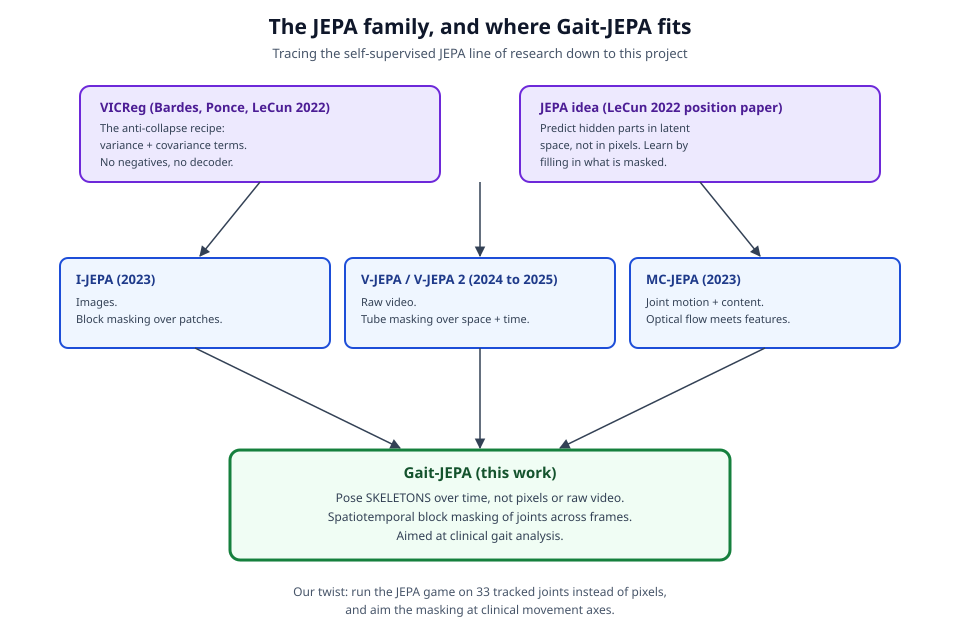
*Where Gait-JEPA sits in the JEPA family: the same predict-in-latent-space idea and the same VICReg anti-collapse recipe as prior image and video models, but run on pose skeletons with masking aimed at clinical movement axes.*

### Our twist: JEPA on skeletons, with mechanism-aimed masking

What is new in this proposal is where we point the recipe and how we hide information. Every prior JEPA we cite works on pixels, whether in a single frame or across a video. We instead run the predictive game directly on the moving skeleton: the thirty-three tracked body joints over time, treated as a small graph that changes frame by frame, with no pixels involved at all. This choice matters for gait because the clinically meaningful signal in walking lives in the geometry of the joints and their timing, not in the color of someone's shirt or the lighting of the hallway, and working on the skeleton throws that distracting appearance away for free.

The second departure is in how we choose what to hide. Rather than masking scattered single joints, which turns out to be too easy because a neighbor usually gives the answer away, we hide coordinated blocks in space and time. One style hides an entire limb across a window of frames, which forces the model to reason about how the two sides of the body coordinate through a stride. The other hides a short time window across all joints at once, which forces the model to extrapolate how the whole body carries itself through a gap in the walking cycle. We call this mechanism-aimed masking because each masking style is designed to make the model confront a specific piece of walking mechanics, and we treat scattered single-joint masking as the deliberately weak baseline to measure against. To our knowledge, this pairing of a skeleton-native JEPA with masking designed around limbs and gait cycles has not been reported in the works we cite.

### Situating against the prior gait pipeline and GAVD

The clinical thread we extend is the hand-feature gait pipeline from earlier ASDRP work. That approach takes a walking video, runs Google MediaPipe's BlazePose_33 pose tracker to recover thirty-three three-dimensional joints per frame, and then compresses each clip into a fixed list of hand-engineered numbers such as joint angles, left-right symmetry, and timing variability. The feature set was grown carefully over time, from fifteen to thirty-four to forty-three and finally to eighty-two features, and fed to classical classifiers; the strongest reported result was a random forest reaching about seventy-six percent test accuracy across five clinical classes, well above the twenty-percent chance level for five balanced classes but resting on only sixty-eight clinically labeled sequences.

We see two structural limits in that design, and Gait-JEPA is our response to both. First, the classical pipeline can only learn from labeled rows, so every walking video without a clinician's label is wasted, even though such video is comparatively cheap to collect while labels are slow and expensive to obtain. Second, squeezing a whole clip into eighty-two numbers discards the fine joint-by-joint, frame-by-frame structure of a stride, and each new feature is roughly a person-week of engineering that quietly bakes in the designer's assumptions about what matters. By learning from unlabeled pose sequences and by keeping the full structure of the motion in a learned summary, we aim to relieve both limits at once, and we use those same sixty-eight labels only at the very end, to read clinical meaning back out of a frozen encoder.

The unlabeled fuel for this comes from GAVD, the Gait Abnormality in Video Dataset, which is to our knowledge the largest open collection of links to gait videos annotated with clinical categories and person bounding boxes (source: GAVD). We use GAVD's clips across all of its condition folders as unlabeled pretraining material, sliced into many short overlapping windows, precisely because our method does not need the labels to learn the shape of walking.


### Broader impact, and its honest limits

If the approach works, the useful artifact is a reusable, label-efficient encoder for walking: a component that turns a short pose sequence into a meaningful summary after learning from cheap unlabeled video, so that a small number of clinical labels can go a long way. Screening for movement disorders such as Parkinson's disease, the aftereffects of stroke, cerebral palsy, and myopathic conditions is today gated by scarce specialist time, and a tool that makes better use of ordinary walking video could, in principle, lower the cost of a first-pass screen and widen access in settings where a movement-disorder specialist is not close at hand.

We want to be careful not to overstate this. What we are proposing is a research-grade encoder and a set of experiments, not a diagnostic device, and nothing here should be read as a claim that a phone video can diagnose a patient. Any real clinical use would require far more data than sixty-eight labels, prospective validation across diverse populations, cameras, and walking environments, careful auditing for bias against groups underrepresented in the training video, and the kind of regulatory and clinical oversight that a screening tool touching real patients must have. Pose tracking itself can fail quietly under occlusion, unusual clothing, or poor lighting, and such failures could fall unevenly across populations. We report a clear null result too: if the frozen self-supervised encoder does not match or beat the seventy-six-percent random-forest baseline under the same seventy-thirty split, then for this dataset the learned representation has not earned its keep over hand-engineered features, and we will say so plainly. Our aim is to contribute a promising, reproducible building block and an honest measurement of how far it gets, leaving the long road to clinical utility clearly marked as future work.

---

## References

- Assran, M., et al. (2023). Self-Supervised Learning from Images with a Joint-Embedding Predictive Architecture (I-JEPA). CVPR 2023.
- Bardes, A., Ponce, J., LeCun, Y. (2022). VICReg: Variance-Invariance-Covariance Regularization for Self-Supervised Learning. ICLR 2022. arXiv:2105.04906.
- Bardes, A., et al. (2023). MC-JEPA: A Joint-Embedding Predictive Architecture for Self-Supervised Learning of Motion and Content Features. arXiv:2307.12698.
- Bardes, A., et al. (2024). Revisiting Feature Prediction for Learning Visual Representations from Video (V-JEPA). arXiv:2404.08471.
- V-JEPA 2 (2025). Self-Supervised Video Models for Understanding and Prediction.
- Ranjan, R., Ahmedt-Aristizabal, D., Armin, M. A., Kim, J. (2025). GAVD: Gait Abnormality in Video Dataset. IEEE Access, 13:45321-45339. doi:10.1109/ACCESS.2025.3545787.
- LeCun, Y. (2022). A Path Towards Autonomous Machine Intelligence (the JEPA position paper).
- Clinical grounding and per-feature thresholds are drawn from the project's neuroscience feature tables (neuroscience/pd-features.csv and neuroscience/stroke-features.csv), each of which cites its own peer-reviewed and clinical sources per feature.
