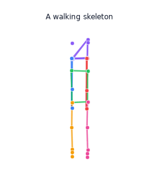

# Skeleton-JEPA on all of GAVD: the full-dataset, hands-on series

This is a six-part, from-zero, hands-on tutorial series that scales the whole
Skeleton-JEPA pipeline to the entire GAVD dataset. Where the concept series one
folder up ([`../tutorials/`](../tutorials/)) walks a single clip through the idea
so you can see what a JEPA is, this series does the industrial version: it scans
every sequence CSV, bulk-downloads the referenced YouTube videos, batch-extracts
skeletons over the whole dataset, builds a large unlabeled pretraining corpus,
pretrains the JEPA on it, and finally spends the scarce 68 clinical labels on a
frozen probe that we compare against the prior 76 percent Random Forest baseline.

You do not need any machine-learning background. Every idea is built up in plain
words, and every notebook runs on a plain laptop CPU in seconds in its default
smoke mode.

> **A follow-up iteration lives in [`../gavd2/`](../gavd2/).** This folder (call it
> iteration 1) built the whole pipeline. Iteration 2 turns the same work into a
> controlled comparison: it locks onto the exact same 68 sequences the baseline
> used, scores the same way the baseline did (one whole walking sequence at a time,
> not one short window at a time), and chases coverage up to all 68 of 68. Under
> that fair test the honest per-sequence accuracy lands at about 0.49 to 0.63,
> above the 0.20 chance level and below the 0.762 hand-feature baseline. The higher
> clip-level number you may see in this folder comes from scoring short overlapping
> windows, which leaks near-duplicate windows of the same walk across the train and
> test split, so it is inflated and not comparable to the baseline. For the plain
> language story of the whole journey, from this folder to the honest result, see
> [`../gavd2/docs/learning/learning-journey.md`](../gavd2/docs/learning/learning-journey.md).


*The whole series at a glance: scan all 374 sequence CSVs, download the unique videos, extract skeletons everywhere, build the unlabeled corpus, pretrain the JEPA, then probe the 68 labels against the 76 percent baseline.*

## See what we are working with

Before diving into the code, it helps to see the thing we are teaching a model to
understand: a walking body, drawn as a moving skeleton. The whole series turns
sequences like this, hundreds of them, into data a model can learn from.



*A walking skeleton with its 33 joints colored by body part. Every notebook also animates a walking sequence inline while it runs, so you always see the motion behind the numbers.*

In the default `SMOKE_TEST` mode those animations use a small synthetic walking
skeleton, so nothing has to download. With the real data path they use the
skeletons extracted from the GAVD videos themselves. The animations render inline
in both Jupyter and Google Colab with no extra setup.

## Why a whole separate series for the full dataset

The concept series proves the idea on one clip. This series answers the practical
question that follows: how do you actually feed a JEPA the entire dataset when the
raw material is a folder of 374 sequence CSVs pointing at YouTube videos? The
honest answer involves scanning, deduping, downloading at scale, batch pose
extraction, quality filtering, windowing, and careful bookkeeping so the whole
thing is resumable. Each of those steps gets its own notebook here, and together
they turn the big cheap pile of unlabeled walking video into a strong encoder.

The through-line is one imbalance. GAVD gives us 374 annotated sequences across 11
gait conditions, but only 68 of them make up the clean 5-class set the prior work
trained on. Unlabeled walking video is plentiful and cheap; clinical labels are
scarce and expensive. So we pretrain on everything with no labels, and spend the
68 labels only at the very end.

## The six notebooks

Each notebook builds on the one before it, and each one writes a small cache file
that the next one reads.

0. [`00-scan-all-gavd-csvs.ipynb`](00-scan-all-gavd-csvs.ipynb) - Walk every
   condition folder and every sequence CSV, build one manifest table with a row
   per sequence, and visualize the dataset at scale, including the tiny labeled
   slice inside the large unlabeled pool.
1. [`01-bulk-download-youtube.ipynb`](01-bulk-download-youtube.ipynb) - Dedup the
   manifest to its unique YouTube video ids and download each one once, resuming
   cleanly so already-cached videos are skipped.
2. [`02-batch-extract-skeletons.ipynb`](02-batch-extract-skeletons.ipynb) - Run
   MediaPipe BLAZEPOSE_33 over every downloaded sequence, quality-filter the
   frames, and cache one skeleton file per condition. This mirrors the alexpose
   `exp5` batch extraction.
3. [`03-build-pretraining-corpus.ipynb`](03-build-pretraining-corpus.ipynb) -
   Normalize every cached sequence, slice it into overlapping fixed-length
   windows, and split off the 68 labeled clips so pretraining stays label-free.
4. [`04-pretrain-jepa-at-scale.ipynb`](04-pretrain-jepa-at-scale.ipynb) - Wire the
   four JEPA pieces into a training loop, train on the unlabeled corpus with block
   masking, and watch the loss fall while the anti-collapse terms stay healthy.
5. [`05-frozen-probe-full-eval.ipynb`](05-frozen-probe-full-eval.ipynb) - Freeze
   the encoder, embed the labeled clips, train linear, MLP, and Random Forest
   probes, plot the label-efficiency curve, fit neuroscience probes, run the
   VICReg ablation, and compare everything to the 76 percent baseline. One caution
   on that comparison: score per whole sequence, not per short window. A per-window
   split puts near-duplicate windows of the same walk on both sides of the train
   and test split, which leaks the answer and inflates accuracy. The follow-up
   iteration in [`../gavd2/`](../gavd2/) fixes this and reports the honest
   per-sequence number, which is above chance and below the 0.762 baseline (see the
   note near the top of this file).

## How to run

Every notebook runs two ways, and each notebook repeats these instructions in its
own second cell so you never have to leave it.

### In Google Colab (nothing to install)

Open any notebook and click the "Open In Colab" badge at the top. The first code
cell checks what is missing and installs it for you, so you just run the cells
from top to bottom. This is the fastest way to try the series.

### On your laptop with `uv`

We use [`uv`](https://docs.astral.sh/uv/), a fast Python package manager, so local
setup is one command. From a terminal in this `gavd/` folder:

```bash
# 1. Install uv once (macOS or Linux):
curl -LsSf https://astral.sh/uv/install.sh | sh

# 2. Create the environment and install the core dependencies:
uv sync

# 3. Register a Jupyter kernel and open a notebook:
uv run python -m ipykernel install --user --name skeleton-jepa-gavd --display-name "Python (skeleton-jepa-gavd)"
uv run jupyter lab 00-scan-all-gavd-csvs.ipynb
```

Pick the `Python (skeleton-jepa-gavd)` kernel when the notebook opens.

## Smoke mode versus the real data path

Each notebook has a `CONFIG` dictionary whose first key is `SMOKE_TEST`.

- `SMOKE_TEST = True` (the default) makes the notebook build its own tiny
  synthetic data. It needs no network, no video download, and no pose model. This
  is how you learn the ideas and how the whole series runs in seconds on any
  machine.
- `SMOKE_TEST = False` runs the real full-dataset pipeline: it scans your GAVD CSV
  tree, downloads every unique YouTube clip, runs MediaPipe over every sequence,
  and pretrains on the real corpus. This needs a few heavier packages, which you
  install with the `real` extra:

```bash
uv sync --extra real
```

By default the real path processes everything: every unique video and every
sequence. That is faithful to the "all CSVs" goal but a full run takes real time,
disk, and bandwidth. Each of the download and extract notebooks has a cap you can
set (`MAX_VIDEOS`, `MAX_SEQ_PER_CONDITION`) to a small integer for a quick real
trial before committing to the full pull.

The real path reads local paths from a `.env` file in this folder, loaded with
`load_dotenv(find_dotenv())`, so the notebooks can find your alexpose checkout and
the GAVD data without you editing any code. Copy [`.env.example`](.env.example) to
`.env` and edit the paths:

- `ALEXPOSE_REPO` - your local alexpose checkout, added to the import path so the
  notebooks can use its `ambient` package (`GAVDDataLoader`,
  `SequenceKeypointExtractor`, `YouTubeHandler`).
- `GAVD_DATA_DIR` - the folder of per-condition GAVD sequence CSV files.
- `YOUTUBE_CACHE_DIR` - where downloaded videos are cached as `<id>.mp4`.
- `GAVD_CACHE_DIR` - where this series caches its own artifacts. Leave blank to use
  a `cache/` folder next to the notebooks.
- `DEMO_VIDEO_ID` - a single demo clip used where one worked example is helpful.

When the alexpose repo is not available, for example on a fresh Colab machine,
every notebook falls back to a small inline pipeline (raw `yt-dlp`, OpenCV, and
MediaPipe) so the real path still works, and if even that is unavailable it falls
back to synthetic data so the notebook never crashes.

## The files passed between notebooks

All of these live under `GAVD_CACHE_DIR` (by default `cache/` next to the
notebooks).

- Notebook 00 writes `manifest.csv` (one row per sequence). Notebooks 01, 02, and
  03 read it.
- Notebook 01 writes `download_report.csv` (one row per unique video). Notebook 02
  reads it.
- Notebook 02 writes `skeletons_<condition>.npz` per condition plus
  `extraction_report.csv`. Notebook 03 reads them.
- Notebook 03 writes `corpus.npz` (the unlabeled clip bank) and
  `labeled_holdout.npz` (the 68-clip 5-class set). Notebooks 04 and 05 read them.
- Notebook 04 writes `jepa_encoder_gavd.pt` (the trained encoder weights and its
  config). Notebook 05 reads it.

If you run a later notebook before an earlier one, it notices the missing file and
falls back to synthetic data with a clear message, so you can always open any
notebook on its own.

## A loss that stays down: the JEPA objective in notebook 04

The heart of notebook 04 is the loss the JEPA minimizes. Getting it right is
surprisingly subtle, and this series ran into a real bug while scaling up that is
worth documenting, both because you might hit it if you modify the loss and
because the fix teaches you how a JEPA is actually held together. If you just want
to run the notebooks, you can skip this section. If you want to understand or
change the training objective, read on.

### What went wrong

The proposal describes the loss as an L2 prediction term plus VICReg
regularization:

```
L = L_pred + lambda_v * L_var + lambda_c * L_cov
```

The first version of notebook 04 implemented that literally: it computed the mean
squared error between the predicted and target embeddings, then added a VICReg
variance term and a covariance term computed on **both** the predictions and the
targets, with no normalization. On the short toy runs that is fine. But when we
scaled to a real run of a few hundred steps, the training curve turned around: the
total loss fell for the first fifty steps or so, then climbed steadily for the
rest of training, and the prediction (MSE) term climbed right along with it.

That looks alarming, but it is not collapse. Collapse would show the embedding
standard deviation falling toward zero. Here the opposite happened: the embedding
standard deviation kept **rising**. The prediction error and the embedding spread
went up together, and that pairing is the tell.

### Why it happened

Two design choices interacted badly, and both differ from how the published JEPA
methods (I-JEPA and V-JEPA) build their loss.

First, the target encoder is a slow exponential-moving-average copy of the online
context encoder. The VICReg variance term pushes every embedding dimension's
standard deviation up toward a target value. Because we applied that variance term
to the **target** embeddings as well, and the target is a copy of the online
network, the variance pressure kept inflating the scale of the whole
representation. Nothing pulled it back.

Second, we computed the L2 on the **raw, un-normalized** target embeddings. So as
the target scale inflated, the distance the predictor had to cover grew
mechanically, and the MSE rose even though the prediction was not getting any
worse in a meaningful sense. The model was chasing a target that kept drifting
away from it.

In short, an anti-collapse term with nothing to balance it was inflating the
target, and an un-normalized L2 turned that inflation into a rising loss.

### The fix

The correction has three parts, and each one mirrors standard JEPA practice.

**1. Normalize the target before the L2.** V-JEPA applies a LayerNorm to the
target features before comparing them. This makes the prediction loss measure
direction rather than magnitude, so a drifting target scale can no longer inflate
it.

**2. Regularize the online side only.** The variance and covariance terms exist to
keep the representation from collapsing. They belong on the online context
embedding, the thing we are training, not on the stop-gradient target. Applying
them to the target is what created the feedback loop.

**3. Keep VICReg light, as a guard rail.** With the target normalized and the
regularization one-sided, VICReg no longer needs heavy weights. We lower its
weights and its variance target so it only pushes when the spread genuinely drops
too low, instead of fighting the prediction loss on every step.

Concretely, the loss function in notebook 04 now looks like this:

```python
def vicreg_loss(pred, target, cfg, context=None):
    """L2 prediction loss on the LayerNorm-normalized target, plus light VICReg
    variance and covariance on the ONLINE side only."""
    B, N, D = pred.shape

    # (1) Normalize the EMA target so the L2 measures direction, not magnitude.
    tgt_norm = F.layer_norm(target, (D,))
    pf = pred.reshape(-1, D); tf = tgt_norm.reshape(-1, D)
    sim_loss = F.mse_loss(pf, tf)

    # (2) Anti-collapse terms act on the online representation only. We pass the
    #     context embedding as `context`; the stop-gradient target is never here.
    online = context if context is not None else pred
    of = online.reshape(-1, D)
    var_loss = variance_term(of)      # hinge that keeps per-dim std above gamma
    cov_loss = covariance_term(of)    # pushes off-diagonal covariances toward zero

    total = cfg["VICREG_SIM"] * sim_loss + cfg["VICREG_VAR"] * var_loss + cfg["VICREG_COV"] * cov_loss
    return total, {"sim": sim_loss.detach().item(),
                   "var": var_loss.detach().item(),
                   "cov": cov_loss.detach().item()}
```

The training loop gathers the online context embeddings at the masked positions
and passes them in, so the regularization sees the online side while the L2 sees
the normalized target:

```python
# ... inside the training step, after gathering masked positions ...
pred_masked  # (B, k, D)  predictions at masked tokens
tgt_masked   # (B, k, D)  EMA target embeddings at the same tokens
ctx_masked   # (B, k, D)  ONLINE context embeddings at the same tokens

loss, parts = vicreg_loss(pred_masked, tgt_masked, CONFIG, context=ctx_masked)
```

The VICReg weights in `CONFIG` reflect that light-guard role. The prediction term
leads, and the variance and covariance weights, along with the variance target,
are all turned down from their original values:

```python
# In notebook 04's CONFIG:
"VICREG_SIM": 25.0,   # the L2 prediction term leads
"VICREG_VAR": 0.5,    # light variance guard (was 25.0)
"VICREG_COV": 0.04,   # light covariance guard (was 1.0)
"VAR_TARGET": 0.5,    # the std the variance hinge pushes up to (was 1.0)
```

The collapse monitor in the notebook now plots the standard deviation of the
**online context** embedding, since that is the quantity the variance term
regularizes.

### Before and after

Running the two versions for four hundred steps on the same data makes the
difference plain.

| | Total loss (early to late) | Prediction MSE (early to late) | Embedding std |
| --- | --- | --- | --- |
| Original (variance on target, raw L2, heavy weights) | rises, about 46 to 62 | rises, about 0.36 to 0.47 | inflating |
| Fixed (normalized target, online-only VICReg, light weights) | falls, about 12.8 to 6.0 | falls, about 0.24 to 0.23 | steady near 0.37 |

The fixed loss falls steadily and the prediction error keeps dropping, which is
what real learning looks like, while the embedding standard deviation stays well
above zero, which is what no collapse looks like.

### The lesson

A JEPA is held up by two forces that must stay in balance. The prediction loss
pulls the online representation toward the target, and the anti-collapse terms
keep the representation from degenerating to a constant. If you let an
anti-collapse term act on the target, or if you compare embeddings without
normalizing their scale, those two forces stop balancing and the loss drifts. The
safe recipe, and the one this notebook now follows, is: normalize the target,
regularize only the online side, and keep the regularization light.

One note on the rest of the series. The concept tutorials one folder up
([`../tutorials/`](../tutorials/)) still use the simpler original loss. That is
harmless there because those runs are short toy demonstrations that stop before
the drift appears. The full-dataset notebook here trains long enough to need the
corrected version.

## What you will be able to say at the end

You will be able to explain, in plain words, why scarce clinical labels are the
real bottleneck in gait analysis, how to scale a pose pipeline from one clip to an
entire dataset, how a JEPA learns from unlabeled walking video by predicting
hidden motion in latent space, why the VICReg terms are needed to stop the model
from cheating, and how a frozen-encoder probe lets you spend the precious 68
labels as efficiently as possible against the 76 percent baseline.
