# Gait-JEPA on all of GAVD: a full-dataset tutorial

**Abstract.** This tutorial walks through the Gait-JEPA full-dataset notebook series that lives in `gait/skeleton-jepa/gavd/`. It explains, in plain words and then in code, how we take an entire dataset of walking videos with almost no clinical labels and still learn a strong gait representation. The recipe is a Joint-Embedding Predictive Architecture (a JEPA) run directly on pose sequences rather than pixels: we pretrain a skeleton encoder on the unlabeled GAVD corpus by asking it to predict hidden motion in latent space, then we freeze that encoder and spend the scarce clinical labels on a tiny probe. The real full-dataset run is now complete. We scanned all 374 GAVD sequences, downloaded 67 of 69 unique videos, extracted real MediaPipe skeletons for 227 sequences, built an unlabeled corpus of 1,571 clips, pretrained the JEPA for 400 steps, and evaluated a frozen probe on the 42 labeled sequences that survived the pipeline. We cover the six notebooks end to end, the two subtle bugs we hit while scaling up (a positional-embedding bug and a loss-drift bug, both worth teaching), the evaluation protocol and its honest caveats (chief among them window leakage, which we measure directly), the neuroscience grounding, and concrete ways to extend the work. The through-line is one imbalance: unlabeled walking video is cheap and plentiful, clinical labels are scarce and precious, so we learn first and label last.

## Table of contents

- [Introduction and motivation](#introduction-and-motivation)
- [The dataset: GAVD at a glance](#the-dataset-gavd-at-a-glance)
  - [The real dataset funnel](#the-real-dataset-funnel)
- [The big idea: learn first, label last](#the-big-idea-learn-first-label-last)
- [What a JEPA is and why it predicts meaning not pixels](#what-a-jepa-is-and-why-it-predicts-meaning-not-pixels)
- [Running Gait-JEPA on skeletons](#running-gait-jepa-on-skeletons)
- [The step-by-step pipeline, notebook by notebook](#the-step-by-step-pipeline-notebook-by-notebook)
- [Block masking, two styles](#block-masking-two-styles)
- [The training objective and two subtle bugs](#the-training-objective-and-two-subtle-bugs)
- [Evaluation and results](#evaluation-and-results)
  - [RQ1: does a frozen probe reach the baseline, and the window-leakage caveat](#rq1-does-a-frozen-probe-reach-the-baseline-and-the-window-leakage-caveat)
  - [RQ2: label efficiency](#rq2-label-efficiency)
  - [RQ3: does the embedding carry clinical structure?](#rq3-does-the-embedding-carry-clinical-structure)
  - [RQ4: does VICReg matter?](#rq4-does-vicreg-matter)
  - [Learnings from the real run](#learnings-from-the-real-run)
- [The neuroscience connection](#the-neuroscience-connection)
- [How to run it](#how-to-run-it)
- [How to extend this work](#how-to-extend-this-work)
- [References](#references)

## Introduction and motivation

Gait, the way a person walks, carries a surprising amount of clinical information. A stroke can leave one knee stiff, Parkinsons often starts on one side of the body and shows up as an asymmetric stride, and a myopathy changes how the legs bear load. Clinicians read these patterns by eye, and a long line of machine-learning work has tried to read them automatically. The obstacle is almost always the same one: labels.

Getting a walking video is easy. Getting a walking video that a clinician has carefully annotated with a diagnosis is hard, slow, and expensive. That is the label-scarcity problem, and it is the reason this whole series exists. The prior work on this dataset built a strong supervised baseline: a Random Forest with 100 trees, trained on 82 hand-engineered gait features, on a 70/30 split, reaching a best test accuracy of 76 percent across five gait classes (GAVD, Ranjan et al. 2025). Chance on five balanced classes is 20 percent, so 76 percent is a real, hard-won result. It is also our north star. The goal of Gait-JEPA is to match or beat 76 percent using a *frozen* encoder that never saw a single label during training, with only a small probe fit on top.

The real run is now done, and the honest headline is nuanced. The honest, comparable number is measured per sequence: a leakage-free linear probe reaches 0.494, well above the 0.20 chance level but below the 76 percent baseline, and with very high variance because there are only 42 sequences. There is also a much higher per-clip number (a linear probe reaches 0.880, an MLP 0.915, a Random Forest 0.881), but that number is leaky, not a win. Those clips are overlapping windows drawn from only 42 labeled sequences, so a per-clip split lets windows of the same sequence land in both train and test, and the classifier scores high by matching near-duplicates rather than by learning. So the honest thesis of this work is not "we beat 76 percent." It is this: a frozen pose JEPA learns a gait representation that is well above chance on unseen sequences but below the tuned baseline, and the leaky per-clip number only measures how much window overlap can inflate a score. The tiny 42-sequence sample is the real obstacle the next iteration must close. We foreground the honest per-sequence number everywhere and clearly label the per-clip number as leaky.

A follow-up iteration, in the sibling folder `../../gavd2/`, turns this into a controlled comparison: it locks onto the exact same 68 sequences, chases coverage all the way to 68 of 68, matches the classifier to the baseline, and reports the honest per-sequence numbers directly (linear 0.486, MLP 0.626, matched Random Forest 0.579, and 0.619 on the baseline's own exact split). If you want the whole story of how the flashy first number gave way to the honest one, told in plain words with no machine-learning background assumed, read the learning paper at `../../gavd2/docs/learning/learning-journey.md`.

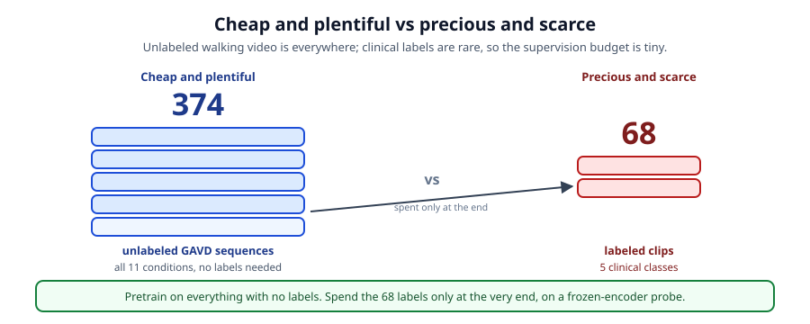

*The imbalance that drives everything: 374 unlabeled sequences on one side, only 68 clinically labeled sequences on the other (and only 42 of those survived download and extraction). We want to learn from the big cheap pile and spend the small precious one wisely.*

The insight from self-supervised learning is that the big unlabeled pile is not useless while we wait for labels. It is where most of the learning should happen. If we can teach an encoder the structure of walking, the shapes limbs make and the way motion coordinates across the body, from unlabeled video alone, then the few labels we do have only need to name what the encoder already sees. That is what this series builds, at the scale of the entire dataset.

A note on names. The paper this series accompanies is titled Gait-JEPA, so that is the project name we use throughout. The *method flavor* is a skeleton JEPA, meaning a JEPA that operates on pose sequences (tracked skeleton joints over time) rather than on raw pixels. When we say "a skeleton-JEPA" we mean the method; when we say "Gait-JEPA" we mean this project. A sibling concept series one folder up, in `gait/skeleton-jepa/tutorials/`, walks a single demo clip (a Parkinsons clip, YouTube id `B5hrxKe2nP8`) to teach what a JEPA is from first principles. This `gavd/` series is the industrial version that does the same thing over all the data.

## The dataset: GAVD at a glance

GAVD stands for Gait Abnormality in Video Dataset (Ranjan et al. 2025). It is an open pool of annotated walking clips sourced from YouTube, organized as a set of comma-separated-value files. Each CSV is one *sequence*: a run of frames drawn from a single YouTube video, with per-frame annotations. The dataset holds 374 sequences in total, 91624 rows of frame annotations, spread across 11 condition folders.

The class balance is uneven, which matters for both pretraining and evaluation. The exact per-condition CSV counts are: abnormal 190, antalgic 4, cerebral palsy 16, exercise 24, inebriated 2, myopathic 47, normal 12, parkinsons 9, prosthetic 3, stroke 12, and style 55, for a total of 374. The large `abnormal` and `style` pools dominate, while several clinical conditions are represented by only a handful of sequences.

Each sequence CSV carries columns you will see referenced throughout the notebooks: `seq`, `frame_num`, `cam_view`, `gait_event`, `dataset`, `gait_pat`, `bbox` (a pixel dictionary for the person bounding box), `vid_info`, `id` (an 11-character YouTube id), and `url`. One detail drives the whole download stage: multiple sequences can point at the same YouTube video, so the number of unique videos to download is smaller than 374. The 374 sequences reference only 69 unique videos. Deduplication happens in notebook 01.

The clinically labeled subset is the piece the prior work trained and evaluated on. It is a clean 5-class set: the manifest marks 68 sequences (target normal 12, parkinsons 9, stroke 12, cerebral palsy 15, and myopathic 20). Note the mismatch with the folder counts: cerebral palsy has 16 CSVs but the labeled subset targets 15, and myopathic has 47 CSVs but the subset targets only 20. Our manifest keeps *all* 374 sequences for pretraining and simply marks which belong to the labeled 5-class set, so pretraining sees everything while the probe sees only the labeled subset.

### The real dataset funnel

The full run makes the practical shrinkage from "374 sequences on paper" to "42 labeled sequences we can actually evaluate on" concrete, and it is worth teaching because every real self-supervised project loses data at each stage. The funnel goes like this. We start from 374 sequence CSVs across the 11 condition folders, 91,624 frame-rows in total, mean 245 frames per sequence. Those 374 sequences dedupe to 69 unique YouTube videos, of which 67 downloaded cleanly (2 links were dead or blocked). Running MediaPipe over the downloaded frames yielded a real skeleton for 227 sequences (per condition: abnormal 118, antalgic 2, cerebral palsy 4, exercise 18, inebriated 1, myopathic 33, normal 10, parkinsons 9, prosthetic 3, stroke 8, style 21). Windowing those skeletons (T equals 32 frames, overlapping) produced an unlabeled pretraining corpus of 1,571 clips of shape (32, 33, 3), the bank notebook 04 pretrains on with no labels.

The labeled side shrinks the most. Of the 68 sequences the manifest marks as the 5-class subset, only 42 survived both the download and the extraction and reached the labeled holdout: normal 9, parkinsons 9, stroke 8, cerebral palsy 4, and myopathic 12. Windowing those 42 sequences gives 296 labeled clips (per class: normal 86, parkinsons 47, stroke 70, cerebral palsy 24, myopathic 69), a mean of 7.0 windows per sequence with a range of 1 to 60. Hold onto that "296 clips from 42 sequences" fact: it is the single reason the evaluation section has to report two very different accuracies.

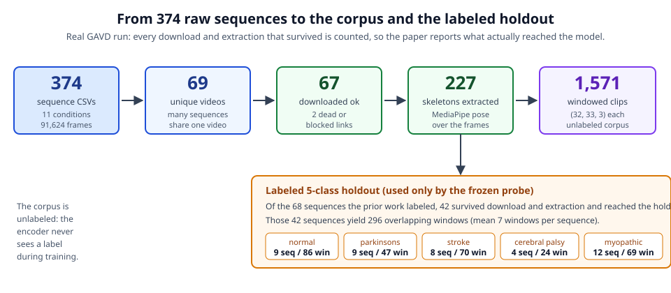

*The real funnel. 374 sequence CSVs dedupe to 69 unique videos, 67 download, 227 sequences extract to real skeletons, and windowing yields a 1,571-clip unlabeled corpus. On the labeled side, only 42 of the 68 marked 5-class sequences survive the pipeline, giving 296 windowed clips for the probe.*

One provenance note for honesty. The cached skeletons are real MediaPipe BLAZEPOSE_33 extractions with a structured non-zero depth channel; they are genuine pose, not the synthetic fallback. A stale `extraction_report.csv` in the cache reads ok=False on every row because it was regenerated later on a machine that lacked OpenCV and MediaPipe, so it did not overwrite the real skeletons. That one CSV is an artifact, not a result, and the survival counts above come from what actually reached the corpus and holdout.

## The big idea: learn first, label last

The whole strategy fits in one sentence: pretrain on everything with no labels, then spend the labels only at the very end, on a probe placed on top of a frozen encoder. The figure below shows the six-notebook journey that carries this out.


*The whole series at a glance. Scan all 374 sequence CSVs, download the unique videos, extract skeletons everywhere, build the unlabeled corpus, pretrain the JEPA, then probe the labeled subset against the 76 percent baseline.*

The reason "frozen" is doing so much work in that sentence is worth pausing on. If we let the labels tune the encoder, we would be back to supervised learning on a few dozen examples, which is far too few to learn a good representation of walking. By freezing the encoder after pretraining and only fitting a small probe (a linear classifier, a tiny MLP, or a Random Forest) on the labels, we make the labels do the one job they are good for with so little data: naming the axes the encoder has already discovered. The quality of the answer then tells us something clean, namely whether unlabeled pretraining produced a representation in which gait conditions are already nearly separable.

This is also why the pipeline is split into so many stages. Turning a folder of CSVs that point at YouTube into a big clip bank of normalized skeletons is a real engineering job: scanning, deduping, downloading at scale, batch pose extraction, quality filtering, windowing, and careful bookkeeping so the whole thing is resumable. Each of those steps gets its own notebook, and each writes a small cache file the next one reads, so you can stop and restart anywhere.

## What a JEPA is and why it predicts meaning not pixels

A Joint-Embedding Predictive Architecture, or JEPA, is a way to learn representations by prediction, but prediction in a *latent* space rather than in the raw input space. The idea traces to a broader program for building world models that reason about abstract state rather than pixels (LeCun 2022), and it was made concrete for images by I-JEPA (Assran et al. 2023) and for video by V-JEPA (Bardes et al. 2024).

The contrast that makes JEPA click is with generative pretraining. A generative model hides part of the input and asks the network to reconstruct the missing pixels. That forces the network to spend capacity on every fine detail: the exact texture of clothing, the lighting, the background. Most of that detail is irrelevant to how someone walks. A JEPA instead hides part of the input and asks the network to predict the *embedding* of the missing part, as computed by the network itself. Because the target is an embedding and not pixels, the network is free to throw away nuisance detail and predict only the abstract content, the meaning, of the hidden region. For gait that is exactly what we want: predict the coordinated motion, not the color of the shoes.


*The four pieces. A context encoder reads what is visible, a slow EMA target encoder reads the full sequence and provides the answer key, a predictor fills in the hidden embeddings, and a loss compares the prediction to the target.*

A JEPA has four pieces, shown above. A **context encoder** reads the visible part of the input and produces a context embedding. A **target encoder** reads the full input and produces target embeddings; it is a slow exponential-moving-average (EMA) copy of the context encoder, and it provides the answer key. A **predictor** takes the context plus the positions of the hidden tokens and predicts what the target encoder computed there. A **loss** compares the prediction to the target. Crucially there is no decoder back to pixels and no negative pairs; the learning signal is entirely "predict your own EMA copy's embedding of the part you could not see." The one danger this creates, collapse, and how we prevent it, is covered later.

## Running Gait-JEPA on skeletons

Gait-JEPA runs the JEPA not on video pixels but on pose sequences: the tracked joints of the walking body over time. This is the skeleton-JEPA flavor. Working on skeletons is a strong prior for gait, because it discards appearance up front and keeps exactly the geometry that carries clinical meaning.

The pose comes from MediaPipe BlazePose (Bazarevsky et al. 2020), specifically the BLAZEPOSE_33 model, which returns 33 landmarks in 3D per frame. We keep all three channels (x, y, z) throughout, so C equals 3 everywhere in the code. For masking we group the 33 joints into six semantic body parts: face, left arm, right arm, torso, left leg, and right leg. Those groups are what make block masking meaningful, as we will see.

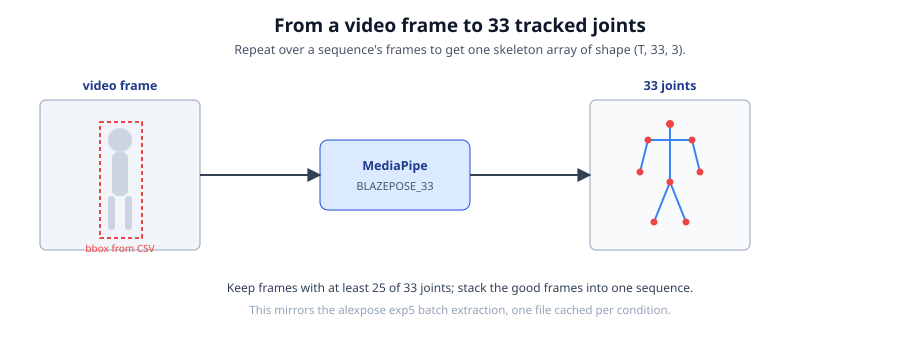

*Notebook 02 in one picture. Each frame is cropped to the person using the GAVD bounding box, then MediaPipe BlazePose returns 33 landmarks in 3D. The animated `../images/walk-skeleton.gif` shows those joints in motion, colored by body part.*

Raw landmark coordinates depend on where the person happens to be in the frame and how large they appear, neither of which has anything to do with their gait. So we normalize every clip in two steps. First we **pelvis-center** by subtracting the mean of the two hip landmarks (indices 23 and 24), which removes absolute position. Then we **scale by torso length**, the distance from the shoulder midpoint to the hip midpoint, which removes apparent size. After normalization a tall person filmed up close and a short person filmed far away produce comparable skeletons, and the encoder can focus on motion.

Finally we **tokenize**. A clip of T frames with 33 joints becomes a sequence of T times 33 tokens, laid out in row-major (t, j) order so that token number n equals t times 33 plus j. Each token is one joint at one frame, a 3-vector, which a small linear layer lifts to the model dimension D. This flattening is what lets a transformer treat the whole spatiotemporal clip as a single sequence, and it is also what forces us to be careful about positional information, the subject of one of the two bugs below.

## The step-by-step pipeline, notebook by notebook

Each notebook runs top to bottom with zero errors in the default `SMOKE_TEST=True` mode, on a laptop CPU, in seconds, using tiny synthetic data. Setting `SMOKE_TEST=False` runs the real full pipeline. Each notebook writes one small cache file that the next one reads, so the series is a chain you can stop and resume anywhere.

### Notebook 00: scan all GAVD CSVs

The first notebook, `00-scan-all-gavd-csvs.ipynb`, walks all 11 condition folders and all 374 sequence CSVs and builds one manifest table with a row per sequence. Each row records the condition, the sequence id, the YouTube video id, the url, the frame span, the number of frames, and whether a bounding box is present. It then visualizes the dataset at scale: the class balance across the 11 conditions, the distribution of sequence lengths, the count of unique videos (fewer than 374 because sequences share videos), and the tiny 68-sequence labeled subset drawn inside the large unlabeled pool. It writes **`manifest.csv`**, the spine the next three notebooks read. The key idea here is bookkeeping: before you download or extract anything, you want one honest table of what exists.

### Notebook 01: bulk-download YouTube

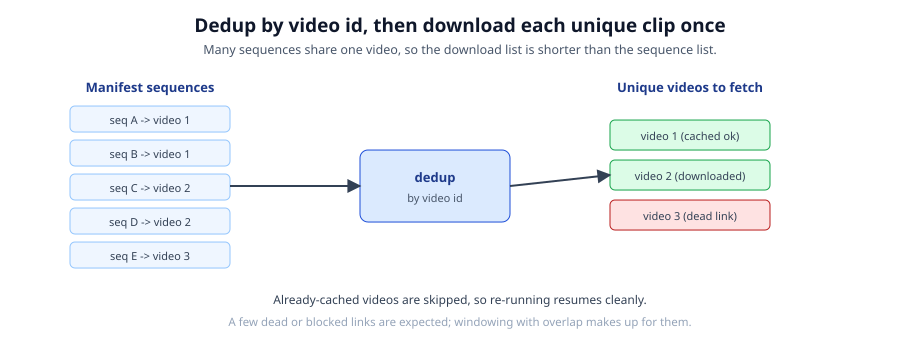

*Notebook 01. Many sequences point at the same YouTube video, so we deduplicate to unique ids and download each exactly once, resuming cleanly.*

`01-bulk-download-youtube.ipynb` deduplicates the manifest down to its unique YouTube video ids and downloads each one once. The download is resumable: already-cached videos are skipped, and every attempt records success or failure so a big pull can be interrupted and restarted without losing work. It writes **`download_report.csv`**, one row per unique video. In the real path it mirrors the alexpose `YouTubeHandler`, and when alexpose is unavailable it falls back to an inline `yt-dlp` downloader so the notebook still runs. The key idea is deduplication: downloading per unique video instead of per sequence saves bandwidth and disk.

### Notebook 02: batch-extract skeletons

`02-batch-extract-skeletons.ipynb` runs MediaPipe BLAZEPOSE_33 over the frames of every downloaded sequence, following the alexpose `exp5` pattern of a `GAVDDataLoader` feeding a `SequenceKeypointExtractor.extract_from_sequence`. It quality-filters frames where the pose is unreliable and caches one file per condition, `skeletons_<condition>.npz`, plus an **`extraction_report.csv`**. An inline MediaPipe fallback keeps the notebook working without alexpose. The key idea is that this is the step that turns pixels into geometry: after notebook 02, we are done with video and work only with skeletons.

### Notebook 03: build the pretraining corpus

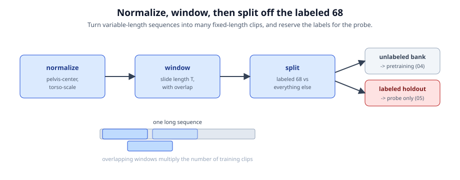

*Notebook 03. Every cached sequence is pelvis-centered and torso-normalized, sliced into overlapping fixed-length windows, and stacked into one big unlabeled clip bank. The labeled sequences are held out for the probe.*

`03-build-pretraining-corpus.ipynb` loads every cached sequence, applies the pelvis-center and torso-normalize steps described above, slices each sequence into overlapping fixed-length windows of T frames, and stacks them into one big unlabeled clip bank with shape (N, T, 33, 3). On the real run this bank holds 1,571 clips. It holds out the labeled 5-class sequences so they are never seen during pretraining, and writes two files: **`corpus.npz`**, the unlabeled clip bank, and **`labeled_holdout.npz`**, the labeled set for the probe (296 windowed clips from the 42 labeled sequences that survived the pipeline). The key idea is the label firewall: pretraining data and evaluation data are separated here, once, so the frozen-probe result later is honest.

### Notebook 04: pretrain the JEPA at scale

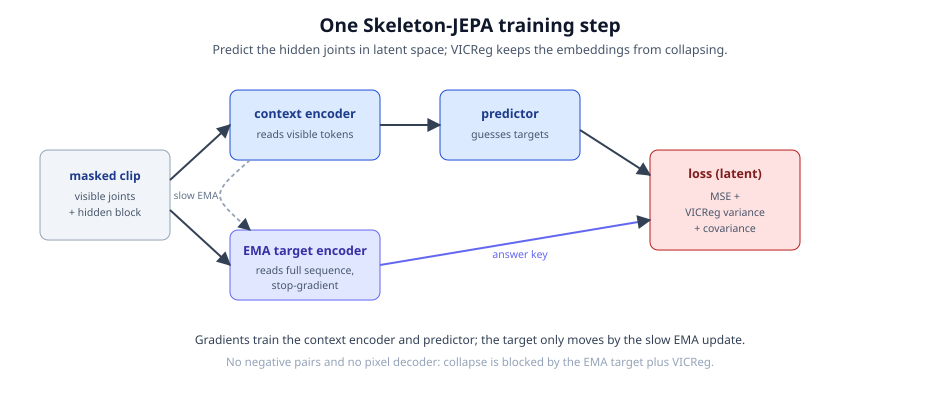

*Notebook 04. The four pieces run in a loop over the unlabeled corpus with block masking. The context encoder and predictor learn by gradient descent, the target encoder follows by EMA, and we watch the loss fall while the embedding spread stays healthy.*

`04-pretrain-jepa-at-scale.ipynb` trains the JEPA on the full unlabeled corpus. It wires up the context encoder, the EMA target encoder, the predictor, and the VICReg-guarded loss, applies block masking to each clip, and runs the training loop. On the real run it trains for 400 steps with batch 16, learning rate 1e-3, Adam, on CPU, with seed 42. It monitors the loss terms and the embedding standard deviation to confirm the model is learning without collapsing. It writes **`jepa_encoder_gavd.pt`**, the trained encoder weights together with the config needed to rebuild the encoder identically later (including T and the number of joints, for reasons the positional-embedding fix makes clear). The context encoder is deliberately small, 71,360 parameters, with an embedding dimension D of 64. The key idea is that all the learning happens here, with no labels.

### Notebook 05: frozen probe and full evaluation

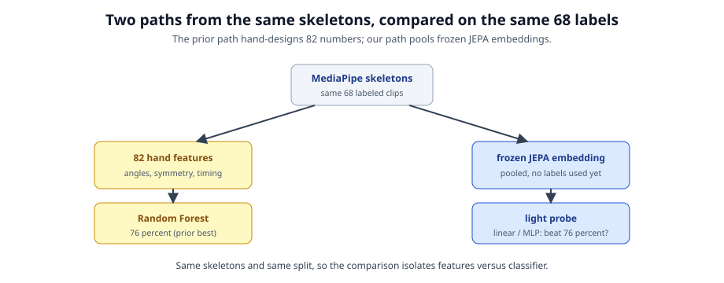

*Notebook 05. The encoder is frozen, the labeled clips are embedded once, and small probes are fit on those embeddings and compared to the 76 percent Random Forest baseline.*

`05-frozen-probe-full-eval.ipynb` freezes the encoder, embeds the 296 labeled clips, and trains linear, MLP, and Random Forest probes on the frozen embeddings. It plots the label-efficiency curve, fits neuroscience linear probes to clinically meaningful proxies, runs a VICReg on/off ablation, and compares everything against the 76 percent Random Forest baseline. This is where the four research questions get answered. The key idea is that a frozen encoder plus a tiny probe is the fair test of whether pretraining learned gait. As the evaluation section explains, the accuracy this notebook prints is a per-clip number, and we correct it with a per-sequence split there.

## Block masking, two styles

Masking is how the JEPA decides what to hide from the context encoder and ask the predictor to fill in. The naive choice is to scatter individual hidden joints at random single frames. That turns out to be far too easy: a missing knee at one frame can be interpolated from the same knee a frame earlier and later, so the model can solve the task without understanding motion at all.

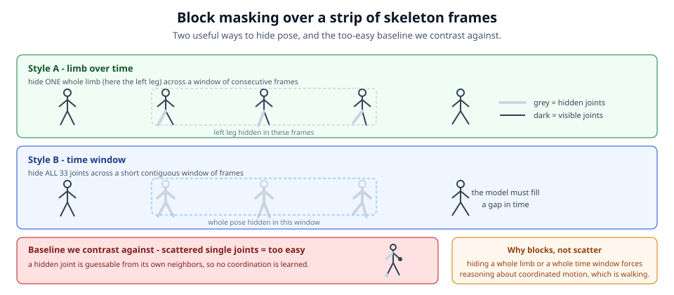

*Two block-masking styles. Style A (limb over time) hides one whole limb across a window of frames. Style B (time window) hides all 33 joints across a short window. Both force reasoning about coordinated motion rather than trivial interpolation.*

Gait-JEPA uses spatiotemporal **block** masking in two styles. **Style A, limb over time**, hides one whole limb (one of the six semantic joint groups) across a window of frames, so the model must infer, say, what the left leg did from what the rest of the body did. **Style B, time window**, hides all 33 joints across a short window of frames, so the model must infer a slice of the whole body's motion from the frames around it. Both styles remove enough coordinated structure that the only way to predict the hidden embeddings well is to actually model how walking motion coordinates across the body and across time. That is the point: walking is coordinated motion, so the masking should demand coordination.

## The training objective and two subtle bugs

The heart of notebook 04 is the loss the JEPA minimizes, and getting it right is subtler than it looks. Scaling from the toy runs in the concept series to a real run over the full corpus surfaced two genuine bugs. Both are worth teaching, because they illuminate how a JEPA is actually held together, and because you may hit them if you modify the code.

### The collapse trap and the VICReg guard

Before the bugs, the failure mode they orbit. Because the target is the network's own EMA copy, there is a trivial cheat: output the *same constant embedding* for every input. Then the prediction matches the target perfectly, the loss goes to zero, and the model has learned nothing. This is representation collapse.

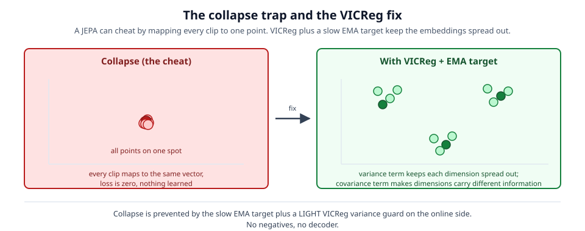

*Collapse is when every input maps to the same embedding, so the loss is zero but the representation is useless. The slow EMA target and the VICReg variance guard together keep the representation spread out.*

Gait-JEPA prevents collapse with two forces and no others. The **slow EMA target** means the answer key changes only gradually, so the online network cannot instantly agree with itself on a constant. The **VICReg variance term** (Bardes, Ponce, LeCun 2022) is an explicit guard: a hinge that pushes each embedding dimension's standard deviation up above a floor, so a constant embedding is directly penalized. A companion covariance term pushes the off-diagonal covariances toward zero so the dimensions do not all encode the same thing. There are no negative pairs and no decoder; the anti-collapse job is done entirely by the EMA target and the light VICReg guard.

### Bug one: the positional-embedding fix

The first bug is the one intentional divergence from the concept tutorials. Recall that we flatten a clip into T times 33 tokens in (t, j) order. A plain transformer encoder is *permutation invariant*: it has no built-in notion of which token came first or which joint is which. If we then mean-pool the token embeddings into one clip embedding, that pooled embedding is a bag of coordinates that has thrown away frame order and left/right joint identity entirely. It literally cannot represent gait dynamics, because gait *is* order and side.

We confirmed this the hard way. Permuting the 1056 tokens of a clip changed the pooled embedding by only about 2e-7, essentially not at all. And the symptom downstream was concrete: notebook 05 reported negative R-squared when we tried to linearly probe temporal quantities, because the encoder had no way to encode time or side in the first place.


*Before, the pooled clip embedding is permutation invariant and cannot encode frame order or left/right identity. After, learned time and joint positional embeddings give every token a place, so the pooled embedding carries temporal and side structure.*

The fix is the standard I-JEPA and V-JEPA design: add learned positional embeddings to every token. We learn a time embedding of shape (T, D) and a joint embedding of shape (33, D), and add them so that the position added to token (t, j) is `time_embed[t] + joint_embed[j]`, initialized with a small standard deviation of 0.1. With these in place the pooled clip embedding is no longer permutation invariant, so it carries temporal and left/right structure. In code the context encoder's forward pass looks like this:

```python
class ContextEncoder(nn.Module):
    def __init__(self, D, T, n_joints=33, n_layers=2):
        super().__init__()
        self.proj = nn.Linear(3, D)                       # (x, y, z) -> D
        self.time_embed  = nn.Parameter(torch.randn(T, D) * 0.1)
        self.joint_embed = nn.Parameter(torch.randn(n_joints, D) * 0.1)
        layer = nn.TransformerEncoderLayer(
            D, nhead=4, dim_feedforward=2 * D, dropout=0.0,
            activation="gelu", batch_first=True)
        self.encoder = nn.TransformerEncoder(layer, n_layers)

    def forward(self, x):                                 # x: (B, T, J, 3)
        B, T, J, _ = x.shape
        h = self.proj(x)                                  # (B, T, J, D)
        h = h + self.time_embed[:T, None, :] + self.joint_embed[None, :J, :]
        h = h.reshape(B, T * J, -1)                       # flatten to tokens
        return self.encoder(h)                            # (B, T*J, D)
```

Two engineering details make this safe across notebooks. Notebook 04 saves T and the joint count in the checkpoint, so notebook 05 can rebuild the encoder with identical shapes. And notebook 05 guards `load_state_dict`: if a stale checkpoint produces a shape mismatch, it warns you to re-run notebook 04 and falls back to a fresh encoder rather than crashing. The concept tutorials `03` through `05` still omit positional embeddings on purpose, because they only teach the four pieces; `gavd/` adds them because it actually evaluates the encoder, and an encoder that cannot encode time or side would fail that evaluation.

### Bug two: the loss drift and its three-part fix

The second bug is a loss-drift bug found while scaling to a real run of a few hundred steps, and it is the best teaching moment in the series. The proposal describes the loss simply as a prediction term plus VICReg regularization, `L = L_pred + lam_v * L_var + lam_c * L_cov`, and the first version of notebook 04 implemented that literally: mean squared error between predicted and target embeddings, plus variance and covariance terms computed on *both* the predictions and the EMA targets, with no target normalization, and heavy weights (variance 25, covariance 1, variance target gamma 1).

On short toy runs this is fine. But over about 400 real steps the total loss fell for roughly the first 50 steps and then *climbed* steadily for the rest of training, and the prediction MSE climbed with it. That looks like a disaster, but it is not collapse. Collapse would show the embedding standard deviation falling toward zero. Here the opposite happened: the embedding standard deviation kept *rising*. Rising MSE together with rising embedding spread is the tell.

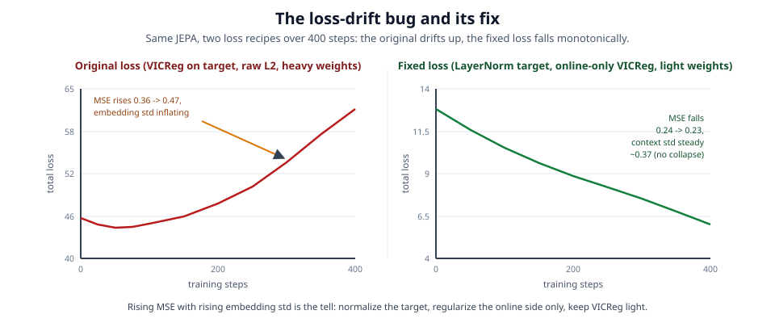

*Before, the total loss and the prediction MSE both rise while the embedding spread inflates. After the three-part fix, the total loss falls steadily and the prediction error keeps dropping while the spread holds steady.*

Two design choices interacted badly. First, the VICReg variance term pushes every dimension's standard deviation up; applied to the *target*, which is an EMA copy of the online network, it kept inflating the scale of the whole representation with nothing to pull it back. Second, the L2 was computed on the *raw, un-normalized* target, so as the target scale inflated, the distance the predictor had to cover grew mechanically and the MSE rose even though prediction was not really getting worse. The model was chasing a target that kept drifting away from it.

The fix has three parts, each mirroring standard JEPA practice. **First, normalize the target before the L2**, by applying a LayerNorm to the EMA target features, so the prediction loss measures direction rather than magnitude and a drifting scale can no longer inflate it (this is the V-JEPA design, Bardes et al. 2024). **Second, regularize the online side only**: variance and covariance act on the online context embedding, never on the stop-gradient target. **Third, keep VICReg light**, as a guard rail rather than a competing objective. Concretely the weights drop to `VICREG_SIM 25.0`, `VICREG_VAR 0.5` (was 25), `VICREG_COV 0.04` (was 1), and `VAR_TARGET`/gamma `0.5` (was 1).

The corrected loss carries a new `context` argument so the regularization can see the online side while the L2 sees the normalized target:

```python
def vicreg_loss(pred, target, cfg, context=None):
    """L2 on the LayerNorm-normalized EMA target, plus light VICReg
    variance and covariance on the ONLINE side only."""
    B, N, D = pred.shape
    tgt_norm = F.layer_norm(target, (D,))          # normalize the target
    sim_loss = F.mse_loss(pred.reshape(-1, D), tgt_norm.reshape(-1, D))

    online = context if context is not None else pred   # online side only
    of = online.reshape(-1, D)
    var_loss = variance_term(of)                   # hinge: per-dim std above gamma
    cov_loss = covariance_term(of)                 # push off-diagonal cov to zero

    total = (cfg["VICREG_SIM"] * sim_loss
             + cfg["VICREG_VAR"] * var_loss
             + cfg["VICREG_COV"] * cov_loss)
    return total, {"sim": sim_loss.item(),
                   "var": var_loss.item(),
                   "cov": cov_loss.item()}
```

The training loop gathers the online context embeddings at the masked positions and passes them in as `context=ctx_masked`, so the guard sees the online representation while the prediction term sees the normalized target.

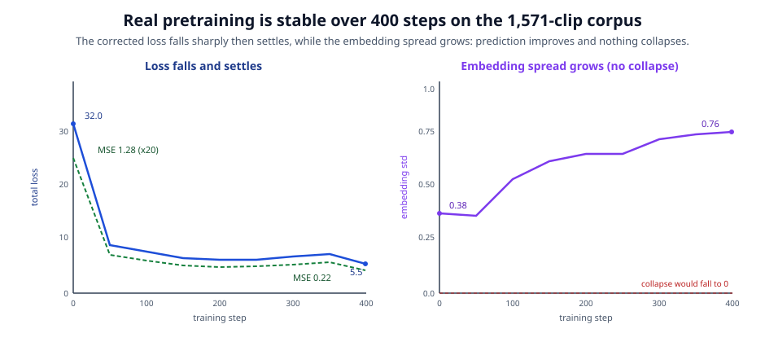

*The real 400-step run of notebook 04 on the 1,571-clip corpus. Total loss falls sharply from 32.0 to about 9 by step 50, then settles with minor fluctuations to 5.5. Prediction MSE falls from 1.28 to 0.22. The embedding standard deviation rises from 0.38 to 0.76, so the representation spreads out rather than collapsing.*

The real run confirms the fix. Over 400 steps the total loss falls from 32.0 to 5.5: a fast drop to about 9 by step 50, then a gentle decline with minor fluctuations, not the runaway upward drift the old loss showed. The prediction MSE falls from 1.28 to 0.22. The embedding standard deviation *rises* from 0.38 to a final 0.763 (mean per-dimension std 0.818, with per-dimension values spanning 0.363 to 1.977, so many dimensions are genuinely used), and a rising spread is the opposite of collapse, which would drive the standard deviation toward zero. We do not claim the curve is perfectly monotone; the honest description is that it falls sharply then settles while the embedding spread grows healthily and no collapse appears. Contrast this with the old symmetric loss, which fell for roughly the first 50 steps and then drifted steadily upward with the MSE climbing alongside it. The collapse monitor now plots the *online context* standard deviation, since that is the quantity the variance term regularizes.

The lesson is general. A JEPA is held up by two forces that must stay balanced: the prediction loss pulls the online representation toward the target, and the anti-collapse terms keep it from degenerating to a constant. Let an anti-collapse term act on the target, or compare embeddings without normalizing scale, and the two forces stop balancing and the loss drifts. The safe recipe is: normalize the target, regularize the online side only, keep VICReg light. The concept tutorials still use the simpler symmetric loss, which is harmless there because those toy runs stop before the drift appears.

## Evaluation and results

Notebook 05 answers four research questions on the real frozen encoder. Because the labeled set is tiny, a single 70/30 split is far too noisy to trust, so every number is reported as a mean plus or minus standard deviation over `N_SPLITS = 20` splits, with a `StandardScaler` refit on each training fold to avoid feature leakage.

### RQ1: does a frozen probe reach the baseline, and the window-leakage caveat

RQ1 asks whether a frozen probe reaches the 76 percent Random-Forest-on-82-features baseline. We fit linear, MLP, and Random Forest probes on the pooled frozen embeddings. Here the answer comes in two numbers that are measured very differently, and reporting both, with the leaky one clearly labeled, is the single most important honesty requirement of this work. The honest number is the per-sequence one; the per-clip number is a leaky diagnostic, not a result.

The number notebook 05 prints by default uses a per-clip stratified 70/30 split over the 296 windowed clips. That number is high, but it is inflated by window leakage, so it is not a fair comparison to the baseline:

| Probe | Split | Accuracy | Macro-F1 |
| --- | --- | --- | --- |
| Linear (logistic) | per-clip (leaky) | 0.880 +/- 0.026 | 0.874 |
| MLP | per-clip (leaky) | 0.915 +/- 0.022 | 0.910 |
| Random Forest | per-clip (leaky) | 0.881 +/- 0.027 | 0.879 |
| Linear (logistic) | per-sequence (leakage-free) | 0.494 +/- 0.172 | -- |
| Baseline (RF on 82 features) | per-clip | 0.76 | -- |
| Chance (5 classes) | -- | 0.20 | -- |

Why the per-clip number is leaky, not a win. A sequence is one continuous walk. The encoder does not read a whole walk at once; it reads short 32-frame windows that slide forward and overlap heavily, so neighboring windows from the same walk are almost copies of each other. The 296 clips are these overlapping windows drawn from only 42 sequences, a mean of 7 windows per sequence. A per-clip stratified split throws all the windows in one pile and splits at random, so a window and its near-twin from the *same* walk can land on opposite sides. The probe then scores high by matching a test window to the near-duplicate training window it already saw, which is remembering, not learning. This is *window leakage*, and it makes the score look far better than the encoder really is. When we redo the split at the sequence level instead, pooling all of a walk's windows into one vector and using a `GroupShuffleSplit` grouped by sequence id so no walk appears in both folds, the test walk was never seen and the linear probe drops to 0.494 plus or minus 0.172. The gap of about 39 accuracy points *is* the leakage. Per sequence is the only fair unit here, because the baseline was scored per sequence too, so we keep the per-clip number only as a diagnostic that measures the leak, never as a result.


*RQ1, the honest picture. The per-clip linear probe (0.880) sits above the 0.76 baseline, but it leaks windows of the same sequence across the split. The leakage-free per-sequence probe (0.494) sits well above the 0.20 chance line and below the baseline, with very high variance because there are only 42 sequences, about 13 per test fold.*

So the leakage-free, sequence-level result is about 0.49 plus or minus 0.17. That is strongly above the 0.20 chance level but below the 0.76 per-sequence baseline, and its very high variance is exactly what 42 sequences (roughly 13 in each test fold) buys you. The correct reading of RQ1 is therefore: a frozen pose JEPA learns a gait representation that is well above chance on unseen sequences but below the tuned baseline. The high per-clip number does not beat the baseline; it is inflated by window leakage and only measures how much overlapping windows can flatter a score. The real obstacle is the tiny 42-sequence sample, not a solved problem. We never headline the 0.88 number as a win; it appears only as a leaky diagnostic beside the honest 0.49.

The per-class structure is informative and shares the same per-clip caveat. Aggregated over the 20 per-clip splits, the row-normalized confusion matrix (rows are the true class) shows normal, parkinsons, stroke, and myopathic cleanly separated, with recalls between 0.86 and 0.91. Cerebral palsy is the weakest at 0.78 recall and is most often confused with myopathic (0.19 of its mass), which makes clinical sense because both alter load-bearing and can look hypotonic. Cerebral palsy also has the fewest sequences (4), so its estimates are the least reliable of the five.


*RQ1 per-class confusion (per-clip, aggregated over 20 splits, rows are true, normalized). Diagonal recalls: normal 0.91, parkinsons 0.91, stroke 0.86, cerebral palsy 0.78, myopathic 0.87. Cerebral palsy leaks mostly into myopathic (0.19) and rests on only 4 sequences.*


*The scorecard for RQ1 through RQ4 on the real run. RQ1 shows both the per-clip and per-sequence numbers; RQ2 the label-efficiency shape; RQ3 the two clinical proxies; RQ4 the VICReg on-versus-off spread.*

### RQ2: label efficiency

RQ2 plots accuracy against the fraction of labels used. The JEPA claim is that a good pretrained encoder reaches useful accuracy with *few* labels, so the curve should rise quickly and then flatten. On the real run the linear probe (per-clip splits, mean over 20 splits) climbs 0.746 at 25 percent of the training labels, 0.820 at 50 percent, 0.864 at 75 percent, and 0.880 at 100 percent. The takeaway is the *shape*, a fast early rise that flattens, rather than the absolute heights, since these per-clip numbers carry the same window-leakage caveat as RQ1.

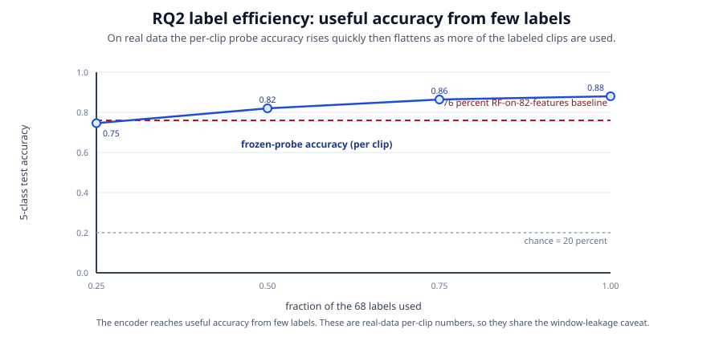

*RQ2. Accuracy climbs 0.746, 0.820, 0.864, 0.880 as the probe sees 25, 50, 75, and 100 percent of the training labels. The curve rises quickly and then flattens, which is the signature of a frozen encoder that has already learned gait and only needs a little labeling to become useful. These are per-clip numbers, so read the shape, not the heights.*

### RQ3: does the embedding carry clinical structure?

RQ3 fits tiny Ridge linear probes from the frozen latent to clinically meaningful scalar proxies and reports test R-squared (mean over 20 splits). We deliberately choose targets that are *linearly decodable* from coordinates: `asymmetry_index` (a ratio of left versus right leg swing range) and `step_amplitude` (mean ankle swing range). We deliberately do *not* probe `stride_time_cv`, a cycle-to-cycle timing coefficient of variation, because it is nonlinear in the coordinates (a ratio of statistics of frame-to-frame differences), so no linear probe can recover it from *any* embedding. The verified linear-probe ceilings computed directly from raw coordinates make this concrete: asymmetry about 0.70, step_amplitude about 0.84, and stride_time_cv only about 0.02.

On the real embedding, `step_amplitude` reaches R-squared 0.719 plus or minus 0.113 and `asymmetry_index` reaches 0.154 plus or minus 0.079. Read against the raw-coordinate ceilings, the frozen encoder recovers most of the step-amplitude ceiling (0.719 out of about 0.84) and only a little of the asymmetry ceiling (0.154 out of about 0.70). The honest reading is that the embedding linearly preserves step amplitude well and asymmetry only faintly.

### RQ4: does VICReg matter?

RQ4 runs a faithful miniature of the notebook 04 loop on the labeled clips (block masking, EMA target, LayerNorm-target L2), toggling the variance and covariance terms on versus off. The final embedding standard deviation is 0.889 with VICReg on and 0.766 with VICReg off. The ON run's spread sits above the OFF run's, so variance plus covariance do real anti-collapse work on top of the EMA target. We do not claim the OFF run collapses to zero, because on this data it does not; the effect is a margin, not a rescue.

### Learnings from the real run

Four lessons stand out, and they are the honest scientific content of this iteration. First, *window leakage is large, and the per-clip number is not a win*: a per-clip split inflates accuracy by about 39 points over the leakage-free per-sequence split (0.880 versus 0.494 for the linear probe), because overlapping windows from the same walk sit on both sides and the probe wins by matching near-duplicates rather than by learning. So the high per-clip number is a leaky diagnostic, and any evaluation on overlapping windows must group by sequence or it will flatter itself. Second, *42 sequences is a small-sample ceiling*: the per-sequence probe's standard deviation of 0.172 comes from having only about 13 sequences in each test fold, and no amount of clever modeling fixes a sample that small; more labeled sequences is the highest-leverage next step. Third, *the two bugs were the real scaling lessons*: the permutation-invariance bug (fixed with learned time and joint positional embeddings) and the loss-drift bug (fixed by normalizing the target, regularizing the online side only, and keeping VICReg light) are what actually stood between the toy runs and a stable 400-step real run. Fourth, *the clinical axes come apart*: step amplitude is recovered well (R-squared 0.719) while asymmetry is recovered only faintly (R-squared 0.154), which tells us where the representation is strong and where the next iteration should push.

The next iteration, `../../gavd2/`, acts on the first two lessons directly. It makes per-sequence scoring the headline, locks onto the exact same 68 sequences, chases coverage to 68 of 68, matches the classifier to the baseline, and reports the honest per-sequence numbers as a controlled comparison (linear 0.486, MLP 0.626, matched Random Forest 0.579, and 0.619 on the baseline's own exact split), all above chance and below the 0.762 baseline. The plain-language story of that whole journey, from the flashy first number to the honest one, is written up at `../../gavd2/docs/learning/learning-journey.md`.

## The neuroscience connection

RQ3 is where the machine learning meets the clinic. The premise is that a frozen embedding good enough to name gait conditions should also *preserve the axes clinicians care about*, chiefly asymmetry and step amplitude. Penny Inouye leads the neuroscience grounding for this project: a feature-to-condition mapping that grades each candidate feature high, medium, low, or not-applicable for each condition, with a neurological reason, a rough threshold, and a source. That mapping is what points the RQ3 probes (and, in the full proposal, the masking) at clinically meaningful features rather than arbitrary ones.

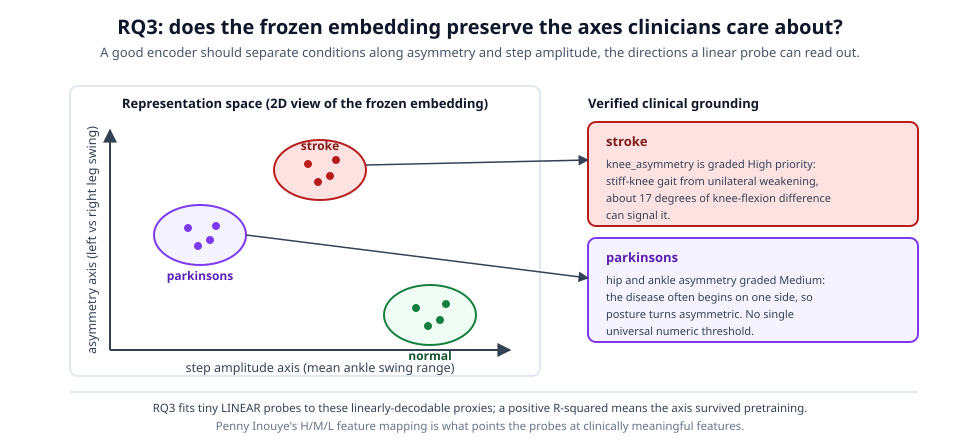

*RQ3 asks whether the frozen embedding preserves the clinical axes. Asymmetry and step amplitude are the linearly decodable proxies the probes test; the graded feature-to-condition mapping is what makes those axes clinically meaningful.*

The verified, citable entries in the mapping are these. For **stroke**, `knee_asymmetry` is graded high: stiff-knee gait arises from unilateral weakening, affects 25 to 75 percent of post-stroke gait impairment, and a difference of 17 degrees or more in knee flexion can signal it (source: sciencedirect S0268003324001839); `hip_asymmetry` is graded medium, because a stroke hits one side of the brain so one hip can be slower or reduced in range, with a rough sign around a 10-degree difference (pubmed 32521470). For **Parkinsons**, `hip_asymmetry` and `ankle_asymmetry` are both graded medium, because PD often begins on one side and produces postural asymmetry; in the cited study 16 of 20 (80 percent) had hip-balance asymmetry and 15 of 20 (75 percent) ankle, with no single universal numeric threshold (PMC4102504); and `left_hip_range` is graded medium, reflecting reduced hip range of motion in PD, roughly below a 20-degree range (PMC8699192).

On the real run RQ3 gives a first, honest answer to that hypothesis. The frozen embedding preserves step amplitude well (R-squared 0.719) and asymmetry only faintly (R-squared 0.154), so the clinical axes are present but uneven: the encoder captures most of the step-amplitude ceiling and little of the asymmetry ceiling. That is useful signal for where to push the representation next, not a finished clinical claim.

Two honest limits. The cerebral palsy and myopathic feature mappings are still *ungraded templates*: Penny delivers the full neuroscience grounding by early August 2026, so this tutorial cites no specific CP or myopathic thresholds. And RQ3 as run in these notebooks uses the linearly decodable proxies above; whether the embedding preserves the clinical axes is a *hypothesis the probes test*, and the real result above is a partial, encouraging answer rather than a guarantee.

## How to run it

There are two ways to run the series, and each notebook repeats the instructions in its own second cell so you never have to leave it.

**In Google Colab**, open any notebook, click the "Open In Colab" badge at the top, and run the cells from top to bottom. The first code cell installs only what is missing. This is the fastest way to try the series.

**On your laptop with `uv`**, from a terminal in the `gavd/` folder, install `uv` once, sync the environment, register a kernel, and open the first notebook:

```bash
# 1. Install uv once (macOS or Linux):
curl -LsSf https://astral.sh/uv/install.sh | sh

# 2. Create the environment and install the core dependencies:
uv sync

# 3. Register a Jupyter kernel and open a notebook:
uv run python -m ipykernel install --user --name skeleton-jepa-gavd \
    --display-name "Python (skeleton-jepa-gavd)"
uv run jupyter lab 00-scan-all-gavd-csvs.ipynb
```

Each notebook has a `CONFIG` dictionary whose first key is `SMOKE_TEST`. With `SMOKE_TEST = True` (the default) the notebook builds tiny synthetic data, needs no network, no video download, and no pose model, and runs in seconds on any machine; this is how you learn the ideas. With `SMOKE_TEST = False` the notebook runs the real full pipeline, scanning your GAVD tree, downloading every unique video, running MediaPipe over every sequence, and pretraining on the real corpus. The real path needs the heavier packages, installed with `uv sync --extra real`.

The real path reads local paths from a `.env` file in the folder, loaded with `load_dotenv(find_dotenv())`, so the notebooks find your data without code edits. The keys are `ALEXPOSE_REPO` (your alexpose checkout, added to the import path), `GAVD_DATA_DIR` (the folder of per-condition CSVs), `YOUTUBE_CACHE_DIR` (where videos are cached), `GAVD_CACHE_DIR` (where this series caches its artifacts), and `DEMO_VIDEO_ID` (a single demo clip). When alexpose is unavailable, for example on a fresh Colab machine, each notebook falls back to an inline `yt-dlp`, OpenCV, and MediaPipe pipeline, and if even that is missing it falls back to synthetic data so nothing ever crashes.

## How to extend this work

The real path is now done: notebooks 00 through 05 all execute top to bottom in real mode with zero errors, on the real corpus and the real labeled holdout, and the results above are what they produced. So the next steps are no longer "run it for real" but "close the obstacles the real run exposed."

The clearest next step is to **make per-sequence splitting the default**. The 39-point gap between the per-clip 0.880 and the per-sequence 0.494 shows that a per-clip split is not a fair test, so notebook 05 should report the sequence-level, `GroupShuffleSplit`-grouped number as its headline metric and treat the per-clip number as a leaky upper bound. **Get more labeled sequences.** The per-sequence probe's high variance (plus or minus 0.172) is a direct consequence of having only 42 labeled sequences, about 13 per test fold; more clinically labeled sequences is the single highest-leverage improvement, and the 227 extracted sequences plus the large `abnormal` and `style` pools are natural places to grow both labels and pretraining data. **Scale the encoder and the training.** The current context encoder is a deliberately small two-layer transformer of 71,360 parameters trained for 400 steps; a larger encoder and a longer schedule are obvious levers now that the real corpus is in hand.

Beyond those three, several directions remain natural. **Add masking styles**: the two block styles here are a starting point, and richer spatiotemporal masks can make the pretext task harder and the representation stronger. **Add graph-aware attention**: the skeleton is a graph of joints connected by bones, and biasing attention toward that graph structure is a well-motivated inductive prior for pose sequences. **Move to the full clinical probes**: RQ3 currently uses two linearly decodable proxies, and asymmetry in particular is recovered only faintly (R-squared 0.154), so once Penny's cerebral-palsy and myopathic gradings land in early August 2026, the full 82-feature clinical probes become available and RQ3 can test the clinical axes directly. **Compare against supervised baselines** trained on the same labels, to quantify how much the unlabeled pretraining actually buys over training from scratch.

This project is the work of three equal co-authors: Alex Mui, Penny Inouye, and Theodore Mui. Penny leads the neuroscience grounding, delivered in early August 2026, while Alex and Theodore lead the machine-learning and pose pipeline. Phil Mui is the Research Advisor.

## References

1. Assran, M., et al. "Self-Supervised Learning from Images with a Joint-Embedding Predictive Architecture" (I-JEPA). CVPR 2023.
2. Bardes, A., et al. "V-JEPA: Latent Video Prediction for Self-Supervised Video Representation Learning." Meta AI, 2024. (Source of the LayerNorm-on-the-target design.)
3. Bardes, A., Ponce, J., LeCun, Y. "VICReg: Variance-Invariance-Covariance Regularization for Self-Supervised Learning." ICLR 2022.
4. Ranjan, et al. "Gait Abnormality in Video Dataset (GAVD)." 2025.
5. Bazarevsky, V., et al. "BlazePose: On-device Real-time Body Pose Tracking." 2020.
6. LeCun, Y. "A Path Towards Autonomous Machine Intelligence." 2022. (The broader JEPA world-model framing.)
