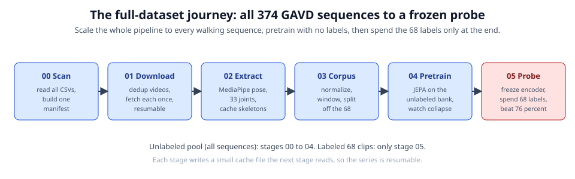

# Gait-JEPA on all of GAVD, iteration 2: the controlled-comparison series

This is iteration 2 of the full-dataset Skeleton-JEPA series. It keeps the iteration-1
method unchanged and makes the comparison against the prior Random Forest genuinely
controlled: same 68 labelled sequences, same label taxonomy, same pose-extraction
contract, and an apples-to-apples per-sequence classification unit and split. Iteration
1 lives one folder over in [`../gavd/`](../gavd/) and is preserved as a checkpoint.

You do not need a machine-learning background. Every notebook runs on a plain laptop CPU
in seconds in its default smoke mode.



## What iteration 2 changes (and why)

A review of iteration 1 found that its "vs 76 percent Random Forest" claim was not a
controlled comparison. Iteration 2 fixes four things while leaving the method identical:

1. **Exact-68 lock.** The labelled probe set is resolved to the exact 68 sequences the
   prior study trained on, by sequence id, with a REAL-mode fail-stop. (`nb00`)
2. **Per-sequence evaluation.** The probe classifies one vector per sequence, not per
   overlapping window, so window leakage cannot inflate the number. exp5's exact seed-42
   split is reproduced for a like-for-like point. (`nb03`, `nb05`)
3. **Video-level leakage control.** Windows whose source video also backs a held-out
   labelled sequence are excluded from pretraining. (`nb03`)
4. **Matched probe + artifact fingerprinting.** A Random Forest matched to exp5's family
   (100 trees, depth 5, balanced), and a canonical-id hash stamped on every artifact.

The honest per-sequence frozen probe is well above the 0.20 chance level and, on this
small labelled set, below the tuned 0.76 baseline. The point of iteration 2 is the
controlled harness and the honest reading it produces, not beating the baseline (that is
future work). See [`docs/paper.md`](docs/paper.md).

## The six notebooks

Each writes a small cache file the next one reads (all under `cache/`, its own namespace).

0. [`00-scan-all-gavd-csvs.ipynb`](00-scan-all-gavd-csvs.ipynb) - scan every sequence,
   lock the labelled set to the exact exp5 68, persist exp5's exact split.
1. [`01-bulk-download-youtube.ipynb`](01-bulk-download-youtube.ipynb) - download the
   unique videos once, labelled-backing videos first, resumable, ffprobe-validated.
2. [`02-batch-extract-skeletons.ipynb`](02-batch-extract-skeletons.ipynb) - run MediaPipe
   BlazePose over every sequence, report coverage of the 68.
3. [`03-build-pretraining-corpus.ipynb`](03-build-pretraining-corpus.ipynb) - normalize,
   window, hold out the 68, exclude co-occurring videos from pretraining.
4. [`04-pretrain-jepa-at-scale.ipynb`](04-pretrain-jepa-at-scale.ipynb) - pretrain the
   JEPA on the unlabelled corpus, watch for collapse.
5. [`05-frozen-probe-full-eval.ipynb`](05-frozen-probe-full-eval.ipynb) - freeze, embed
   per sequence, and compare honestly to the 0.76 baseline.

## How to run

### Smoke mode (runs anywhere in seconds)

Every notebook's `CONFIG` has `SMOKE_TEST` as its first key. These committed notebooks
ship with `SMOKE_TEST = False` (the real run that produced the numbers in the docs); set
it to `True` for smoke mode, which builds tiny synthetic data, needs no network and no
pose model, and runs top to bottom in seconds. Open any notebook's Colab badge, or
locally:

```bash
uv sync
uv run jupyter lab 00-scan-all-gavd-csvs.ipynb
```

### Real mode (produces the iteration-2 numbers)

Copy `.env.example` to `.env` (a filled `.env` is already provided for this machine) and
set `SMOKE_TEST = False` in each notebook, then run `00` through `05` in order. See
[`RUNBOOK.md`](RUNBOOK.md) for the exact commands and the coverage-chase step. The numbers
in the docs and slides are from this real run on the exact exp5 68 sequences (chased to
68-of-68 coverage): the honest per-sequence probe reads 0.49 (linear) to 0.63 (MLP) and
the exp5 exact-split matched Random Forest reads 0.62, against the 0.762 baseline.

## Slides and docs

- [`slides/research.html`](slides/research.html) - the honest controlled-comparison talk.
- [`slides/teaching.html`](slides/teaching.html) - the pipeline walkthrough for a newcomer.
  Both are reveal.js decks with reveal.js vendored locally (offline). See
  [`slides/README.md`](slides/README.md).
- [`docs/paper.md`](docs/paper.md) / `docs/paper.html` - the iteration-2 paper.
- [`docs/learning/learning-journey.md`](docs/learning/learning-journey.md) -
  the plain-language, high-school-level story of the whole `gavd` to `gavd2` journey: the
  four bugs, the four fixes, why per-clip scoring leaks and per-sequence is the honest
  unit, where Penny's neuroscience maps into the code, and an honest look at whether the
  approach is promising. No machine-learning background needed.
- [`docs/pipeline.md`](docs/pipeline.md) - one page per notebook.
- [`docs/glossary.md`](docs/glossary.md) and [`docs/adr/`](docs/adr/) - the ubiquitous
  language and the architecture decision records.

## Independence from iteration 1

`gavd2/` regenerates all of its own derived artifacts into `cache/` and never reads
`../gavd/`'s cache. It shares only the external downloaded-video cache (`YOUTUBE_CACHE_DIR`
in `.env`) so it does not re-download.
