## Overview

This paper tells the story of two tries at the same exciting problem: teaching a computer to read how a person walks. The first try, which lived in a project folder called `gavd`, was a real achievement. It built a whole system end to end, from raw video all the way to a working classifier, and it produced a number that looked great. That first build proved the whole idea could run. Then we found that a few small, quiet issues had flattered the headline number, so we set out to measure it the right way. The second try, in a folder called `gavd2`, kept everything that worked, fixed what did not, and, most importantly, made the test genuinely fair. When the test became fair, the score settled to its true level. That is the best part of the story. A smaller number we can trust is far more valuable than a big number we cannot, and earning that trust is exactly what good research looks like. This paper walks through the whole journey, step by step.

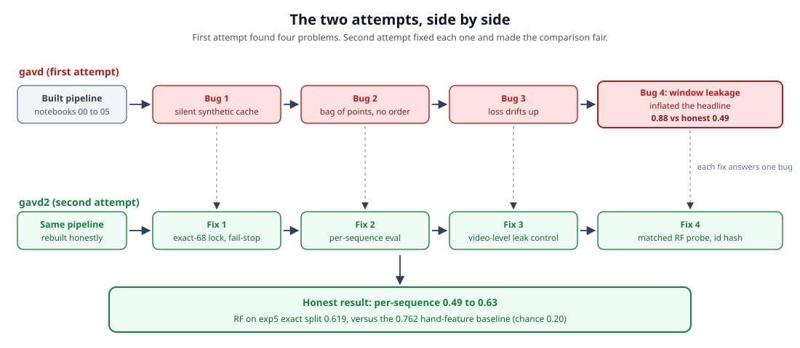
*The whole journey on one page. The top lane is the first attempt with its four bugs. The bottom lane is the second attempt, with one fix per bug, ending in the honest result.*

---

## Abstract

This paper is a hopeful learning story about a project called Gait-JEPA, which teaches a computer to read how a person walks and name the gait condition from five choices: normal, parkinsons, stroke, cerebral palsy, and myopathic. The project uses a self-supervised method, meaning it learns the shape of walking from plenty of unlabeled walking video and spends its few clinician-graded labels only at the end. The first attempt, in a folder called `gavd`, was an important milestone: it built the whole pipeline end to end and got it running, and it reported a bright number near 0.88. Checking that number carefully is where the real science began. The team found that a few quiet issues, plus one subtle problem in how the score was measured, had lifted the headline above its true level. The second attempt, in a folder called `gavd2`, addressed all of them, and, more importantly, made the comparison against the baseline genuinely fair by holding everything constant except the one thing under study: the learned representation versus 82 hand-built features. Under that fair, per-sequence test, the honest score is 0.486 for a simple linear probe, 0.626 for a small neural probe, and 0.579 for a matched Random Forest, all measured over 20 repeated per-sequence splits. On the baseline's own exact seed-42 split, that same matched Random Forest reaches 0.619. All three land well above the 0.20 chance level, which means the encoder truly learned to read a walk on its own, and all sit below the tuned 0.762 baseline on this small 68-sequence set, which points clearly at the next thing to improve: more labeled walks. The most encouraging surprise is that the frozen encoder learned to read a clinically meaningful stride-size signal with no labels at all. We also show exactly where the neuroscience knowledge from the project's clinical lead enters the code, at the masking step, at the clinical probes, and in how we read the model's mistakes.


## The problem: reading how people walk, with almost no labels

The way a person walks carries real medical information. A doctor can look at a walk and pick up signs of a condition. After a stroke, a person may have a stiff knee that does not bend the way it should. In Parkinson's disease, the two sides of the body often stop matching, so the stride becomes uneven from left to right. In a muscle disease called myopathy, the body changes how it carries its own weight while walking. These are not tiny details. They are the kind of thing a trained eye reads from a walk.

Our goal is to teach a computer to do something related: watch a walking video and name the gait condition. "Gait" just means the pattern of how someone walks. We use five classes, which are the five names the computer must choose between: normal, parkinsons, stroke, cerebral palsy, and myopathic.

The hard part is not getting video. Plain walking video is cheap and everywhere. The hard part is getting labels. A "label" is the correct answer attached to a clip, meaning a note from a clinician that says "this walk shows stroke." Clinician-graded clips are rare and expensive, because a trained person has to watch each one and grade it. So labels, not video, are the real bottleneck. Our plan works around that. We let the computer study a large pile of unlabeled walking video first, and we save the few precious labels for the very last step.

The video comes from a public collection called GAVD, short for Gait Abnormality in Video Dataset [4]. GAVD is organized as 374 spreadsheet files, each one a comma-separated file (a "CSV," a simple table of numbers). These 374 files are spread across 11 condition folders and hold 91,624 rows of frame data in total, with an average of 245 frames per sequence. Here a "sequence" means one run of frames pulled from a single YouTube video, and one video can supply more than one sequence.

Out of that large pile, an earlier study picked a careful, hand-checked subset. We call it "the exp5 68," because it is exactly 68 sequences spread over the five classes we care about: 12 normal, 9 parkinsons, 12 stroke, 15 cerebral palsy, and 20 myopathic, which add up to 68. One surprising fact matters a lot later: those 68 sequences come from only 12 unique YouTube videos. So many of the sequences are different slices of the same handful of videos.

That earlier study also set the score we have to beat, or at least reach. It used a method called a Random Forest, which is a classic prediction tool that combines the votes of many small decision rules, here 100 of them, working on 82 hand-measured features of the walk such as joint angles, step timing, and left-to-right symmetry. Tested one sequence at a time on a single fixed split of the data into 47 for training and 21 for testing, its best test accuracy was 0.762. To judge that fairly, note that pure guessing among five classes would land around 0.20, which we call "chance." So 0.762 is a real, hard result, and it is the reference point this whole paper measures itself against.


*The funnel from the full GAVD dataset down to the exact 68 hand-checked sequences, and the 12 videos behind them.*

## What a JEPA is, in plain words

To use all that unlabeled video, we need a way for the computer to learn from walks that have no answer attached. The tool we use is a JEPA, which stands for Joint-Embedding Predictive Architecture [1], [2], [6]. That name is a mouthful, so here is the plain version.

Think of covering part of a picture with your hand and trying to guess what is hidden underneath. You do not need anyone to tell you the answer. You already have the answer, because you can just move your hand and look. A JEPA plays this game on its own, over and over, and gets better at guessing by seeing how close its guess was to the truth. Learning this way, with no human-made labels and the answer coming from the data itself, is called self-supervised learning.

A JEPA has four parts that work together.

First is the context encoder. This is the part that actually learns during training. An "encoder" is a piece that turns raw input, here the visible parts of a walk with some of it hidden, into a compact list of numbers called an embedding. The embedding is the computer's short summary of what it saw. This encoder only sees the visible parts and produces a summary of them.

Second is the target encoder. It is a near-copy of the context encoder, but it sees the full clip with nothing hidden, so its summary acts like the answer key. It is not trained directly. Instead it is updated slowly as a running average of the context encoder, a trick called an exponential moving average, or EMA, which just means each update nudges it a little toward the context encoder rather than replacing it. We also block any learning signal from flowing back into it, so it stays a steady target to aim at.

Third is the predictor. It is a small, simple network whose only job is to look at the context encoder's summary of the visible parts and guess what the target encoder's summary of the hidden parts should be.

Fourth is masking. Masking is the rule that decides which parts of the walk to hide before the context encoder sees it. Choosing what to cover is what makes the guessing game hard enough to be worth playing.

There is one more idea that is easy to miss but sits at the heart of a JEPA. It does not try to redraw the hidden pixels or the exact hidden joint positions. It predicts in a learned latent space instead. A "latent space" is just the space of those compact number-summaries, the embeddings, that the encoders produce. So the predictor is guessing a summary of the hidden part, not the raw picture of it. This matters because exact pixels and coordinates are full of tiny, meaningless detail, and forcing the model to redraw all of it wastes effort on noise. Guessing the summary lets the model focus on the parts that actually matter, which for us is the coordinated motion of a walk. This family of ideas comes from I-JEPA on images [1], V-JEPA on video [2], and the world-model framing laid out by LeCun [6], with a tool called VICReg [3] that stops the model from cheating by giving the same flat answer for everything, a failure we describe later.

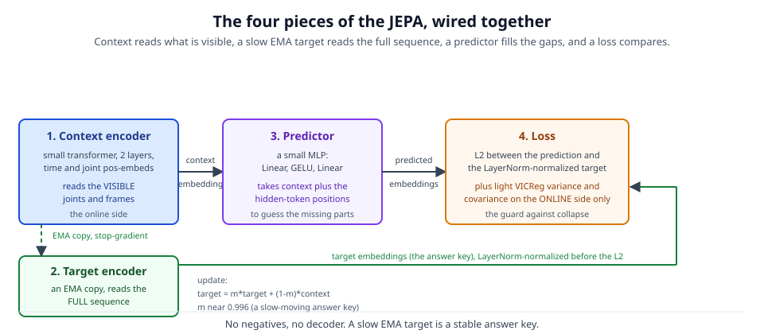
*The four pieces of a JEPA and how they connect: the context encoder sees the visible parts, the EMA target encoder gives the answer key, the predictor guesses, and masking sets the puzzle.*

---

## The first attempt, and the four bugs hiding in it

The first attempt lived in a folder called `gavd`. On paper, it looked like a full success. The team built the whole pipeline, from raw video to a final score, across six notebooks numbered 00 to 05. Notebook 00 scanned the dataset. Notebook 01 downloaded the videos. Notebook 02 pulled a stick-figure skeleton out of each frame. Notebook 03 cut those skeletons into short clips to pretrain on. Notebook 04 ran the JEPA pretraining. Notebook 05 tested the frozen encoder with a small classifier. At the end, notebook 05 printed a headline accuracy that looked like it beat the old baseline of 0.762 [4].

There was just one problem. That headline was not real. Three quiet bugs, plus a fourth honesty bug, sat inside the pipeline. None of them crashed anything. None of them printed a red error. That is exactly why they were dangerous. A bug that crashes gets fixed the same day. A bug that stays silent and hands you a number that looks good can survive for weeks, because nothing tells you to look. What follows is the story of finding all four, one at a time. Each one, once you see it, makes the next one easier to spot.

### Bug 1: the pipeline never ran on real data

The first bug is the biggest kind of surprise. The whole "real" run never touched real data at all.

Here is how it happened. Every notebook had two modes. There was a SMOKE mode, which uses tiny fake data so you can test that the code runs without waiting hours. And there was a real mode, which uses the actual GAVD videos [4]. Notebooks 00 to 03 were still set to SMOKE mode, so they quietly built fake, made-up clips and saved them to disk. These saved files are called a cache, which just means "results saved so you do not have to compute them again." Notebooks 04 and 05 were set to real mode. So notebook 05 loaded the cached files, trusted them, and trained on fake data while believing it was real.

Why was this easy to miss? Because there was a guard meant to catch exactly this, and the guard was too weak. Notebook 05's only check was whether the number of clips was less than 10. If you had at least 10 clips, it assumed you were fine. The fake dataset happened to have 26 clips. Since 26 is greater than or equal to 10, the check passed without a word. A number that looks like enough is not the same as data that is what you think it is.

The concrete evidence was clear once someone looked at the saved files directly. The pretraining file, `corpus.npz`, held only 16 clips. The labeled test file, `labeled_holdout.npz`, held 26 clips. Every single sequence id in those files contained the word "synthetic," which is the word the code uses for fake data. And the class counts were {6, 5, 5, 5, 5}, not the real counts of {12, 9, 12, 15, 20} that add up to 68. The final "real" score came out around 0.25, which is barely above the 0.20 you would get by pure guessing on five classes. It was not a result. It was noise from a test set of about eight items.

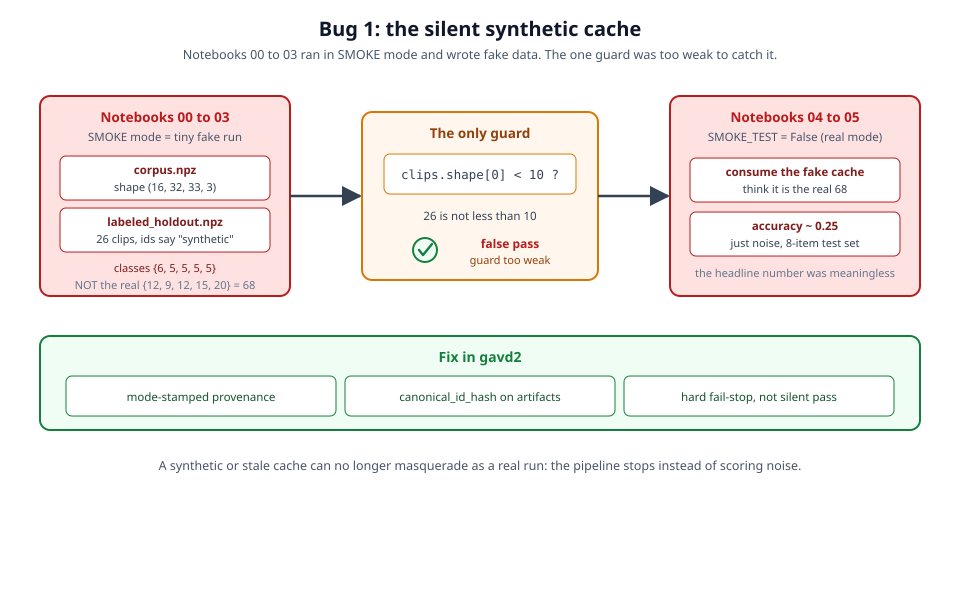
*The upstream notebooks saved fake clips; the only guard checked "at least 10 clips," and the 26 fake clips slipped right through.*

The fix, finished in the second attempt, was to stop trusting a count and start checking identity. Every saved file now carries a stamp that says which mode made it (SMOKE or real) and a short fingerprint called a `canonical_id_hash`. If a fake or out-of-date file tries to enter a real run, the pipeline stops on the spot instead of quietly going along. A loud stop is better than a silent lie.

### Bug 2: the encoder treated the body as a bag of loose points

With the data plumbing understood, the next bug lived inside the model itself.

The encoder is the part of the system that reads a clip and turns it into a short list of numbers, called an embedding, that is meant to capture what the clip contains. A clip is stored as a stack of frames, and each frame is a set of 33 body points, one per joint. To feed this into the encoder, the code flattens it into 1,056 small pieces called tokens. Each token is one joint at one moment in time.

The trouble is that the kind of network used here, a transformer, does not know the order of its tokens on its own. Unless you tell it, it treats the 1,056 tokens as an unordered pile. In the first attempt, nobody told it. The very first version of the encoder was just the transformer wrapped around a simple input step, with nothing added to mark time or joint. So the encoder could not tell frame 0 from frame 31, and it could not tell the left knee from the right knee. Then the classifier averaged all the tokens together into one embedding, which threw away order a second time. The end result was a bag of points: a cloud of joint positions with no sense of which joint moved when.

That is fatal for this task, because a gait condition is defined by which joint moves when. A shuffling walk, a stiff knee, a limp that favors one side. All of these are patterns in time and in left-versus-right. A bag of points erases exactly the thing you are trying to name.

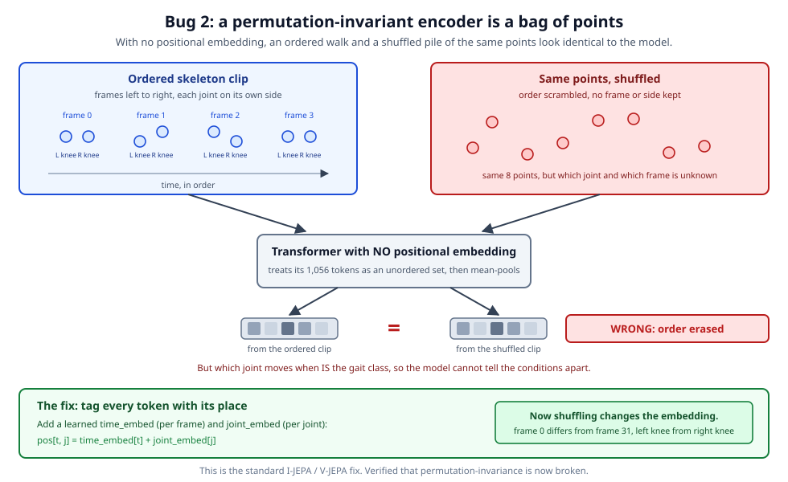
*Without position information, the clip collapses into an unordered cloud of joints, erasing which joint moves when.*

The fix is standard and comes straight from the JEPA papers for images and video [1], [2]. You add two small learned tables. One table, the time embedding, gives each of the frames its own signature. The other, the joint embedding, gives each of the 33 joints its own signature. For a token at frame `t` and joint `j`, you add both signatures on top of it. Now the encoder can tell early frames from late ones and left joints from right ones. After the fix, the team checked directly that shuffling the tokens changes the output, which confirms the encoder finally cares about order.

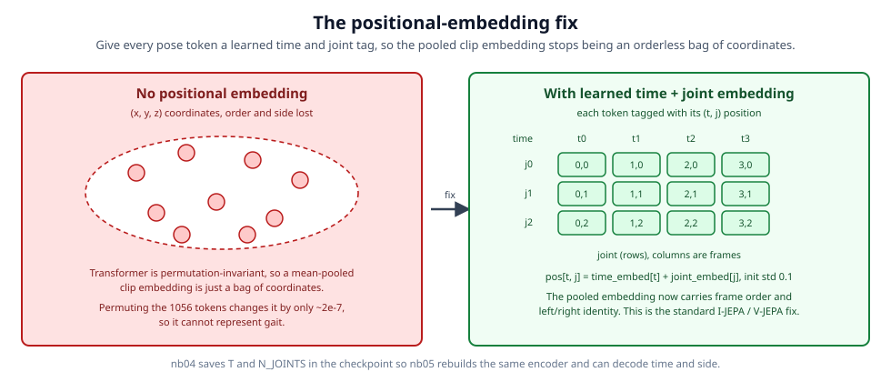
*The fix adds a learned time table and a learned joint table so the encoder knows both when and where each token belongs.*

### Bug 3: the training loss drifted the wrong way

Even with the model wired correctly, training itself was broken, and the way it broke is worth understanding.

During pretraining, the system reports a loss, which is a single number that says how badly the model is doing. Training should push this number down over time. In the first attempt it did the opposite. The total loss dropped for about the first 50 steps, then turned around and climbed for the rest of the run. Over 400 steps the total loss rose from about 46 to about 62. The core matching error, called MSE, rose alongside it, from about 0.36 to about 0.47. Training was making the model worse, not better.

At first glance a rising loss can look like a well-known failure called collapse, where the model gives up and outputs nearly the same flat answer for everything. But collapse has a signature. When a model collapses, the spread of its embeddings, measured as their standard deviation or std, shrinks toward zero. Here the std did the reverse: it kept rising. So the tell was the pairing. The matching error was going up and the embedding spread was also going up at the same time. That pairing is not collapse. It is the model's internal scale ballooning out of control.

The root cause was in how the loss was built. The recipe used a technique called VICReg [3], which adds two guard terms, a variance term and a covariance term, to stop collapse. In the first attempt those guard terms were applied to both sides of the comparison, including the target encoder, which is the frozen "answer key" copy of the model. The variance guard is designed to push spread up. Applied to the answer key with heavy weights and nothing to hold it back, it kept inflating the target's scale run after run. On top of that, the matching error was a plain distance that was not normalized, meaning nothing kept the two sides on a common scale before comparing them. So as the target's scale ballooned, the distance ballooned too, and the loss climbed.


*Applying the variance and covariance guards to the frozen answer key inflated its scale, which pushed the loss up.*

The fix had three parts, and all three were needed. First, normalize the answer key before comparing to it, using a step called LayerNorm. This makes the matching error measure direction rather than size, so a growing scale can no longer inflate it. This trick comes from the V-JEPA video work [2]. Second, apply the variance and covariance guards to the online encoder only, never to the frozen answer key, so nothing inflates the target. Third, keep the VICReg weights light, so the guards act as a safety rail rather than a shove. After the fix the loss behaved. Over the same run the total loss fell from about 12.8 to about 6.0, the matching error edged down from about 0.24 to about 0.23, and the embedding spread held steady near 0.37 on the short test and rose to a healthy level on the full run.

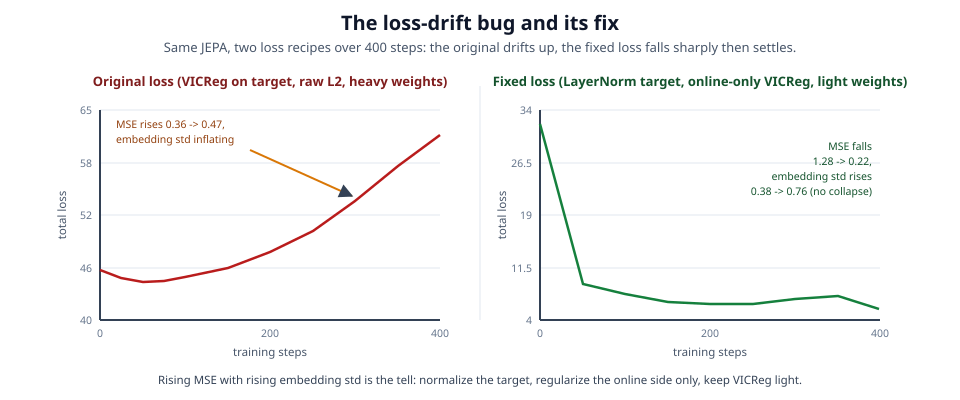
*Before the fix the loss climbed over 400 steps; after the three-part fix it fell steadily.*

### The biggest bug was not a crash: window leakage

The first three bugs were mechanical. Fix them, and the machine runs. The fourth bug is different, and it is the reason the whole rewrite mattered. It was a measurement bug, and it was quietly inflating the headline the most.

To understand it, you need one word: a window. A single video sequence is long, so the pipeline chops it into many short, overlapping clips called windows. On this data each sequence produced about 7 windows on average. Overlapping means neighboring windows share many of the same frames, so windows from the same sequence look almost like copies of each other.

The first evaluation tested the classifier per window. It pooled all the windows together and split them into a training group and a test group at random. That random split does not respect which sequence a window came from. So windows from the same sequence ended up in both groups. When the classifier was then asked about a test window, it could quietly recall a near-duplicate window from the same sequence that it had already seen during training, and match to it. That is window leakage: the answer leaks across the split because near-copies sit on both sides. It makes the score look far better than the model really is.

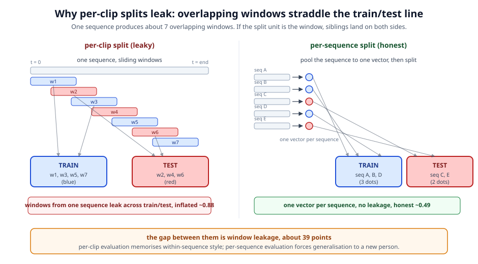
*Overlapping windows from the same sequence land in both train and test, so the classifier can match a test window to a near-copy it already saw.*

The team measured the size of this effect directly on the first real run, which had 42 surviving sequences cut into 296 clips. Split per clip, the leaky way, a simple linear classifier scored 0.880. Split per sequence, the honest way, where all of a sequence's windows are averaged into one vector and whole sequences are kept on one side of the split, the same linear classifier scored 0.494. That is a gap of about 39 accuracy points, invented entirely by the leak.

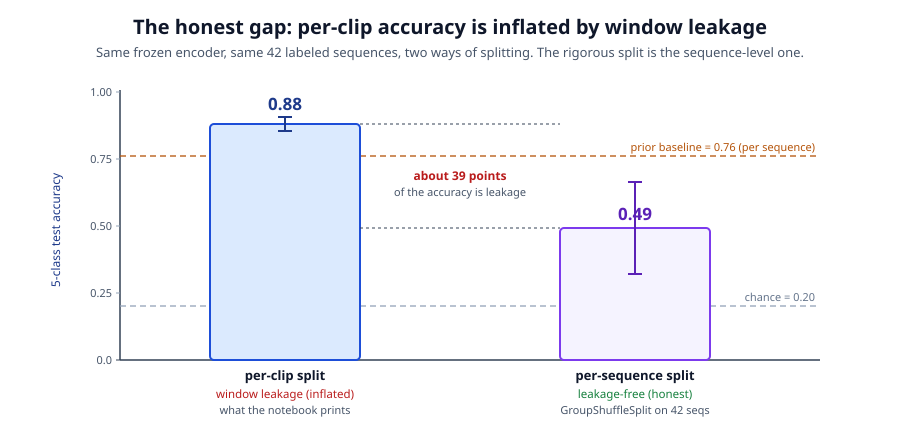
*The same encoder scores 0.88 per clip but only 0.49 per sequence; the roughly 39-point gap is pure window-leak inflation.*

There is a second reason per sequence is the only honest unit here, beyond fairness inside our own run. The old baseline we are trying to beat was measured per sequence [4]. It gave one prediction per whole walking sequence, not one per short window. If we score ourselves per window and compare to a baseline scored per sequence, we are comparing two different games and calling one the winner. To make an honest comparison, both sides have to be judged the same way, which means per sequence. The first attempt's flashy headline came from playing the easier game. Once the team switched to the fair unit, the real work of the second attempt could begin.

---

## The second attempt: making the comparison fair

Those three bugs were about correctness. The pipeline was doing the wrong thing. But there was a deeper problem waiting underneath, and fixing it is what the second attempt, the folder called `gavd2`, was really about. The problem was that even a bug-free run would not have been a fair test. To see why, you have to understand what a fair test looks like.

The tool for a fair test is a controlled comparison. The idea is simple. You want to study the effect of one thing, so you hold everything else constant and change only that one thing. If you change two things at once and the result moves, you cannot tell which change caused it. In this project the one thing under study is the representation, meaning how a walking clip gets turned into a list of numbers that a classifier can use. There are two representations to compare. One is the learned JEPA embedding, a set of numbers the pretrained encoder produces on its own. The other is the 82 hand-made features from the prior study [4], numbers like joint angles and step timing that people picked by hand. To learn which representation is better, everything else has to match. The same sequences, the same way of splitting into train and test, the same classifier, the same scoring rule. The first attempt matched almost none of this, so its headline number could not be trusted. The second attempt made four corrections, one for each way the comparison had been unfair.

### Correction 1: locking to the exact 68 sequences

The prior study used a curated set of exactly 68 sequences across 5 classes: normal 12, parkinsons 9, stroke 12, cerebralpalsy 15, myopathic 20 [4]. If the new run used a different set of sequences, any difference in the score could just be a difference in which clips got tested. So the first correction is to lock onto that same set, sequence by sequence.

The code does this with a three-tier resolver. A resolver is just a routine that tries several ways to find something and takes the first one that works. Tier one opens the saved 82-feature file and reads each stored object's id, label, and order. Tier two, if that fails, searches the 5 curated class folders on disk. Tier three, if that also fails, falls back to a fixed list of ids written into the code. What matters most is what happens when all three fail. On a real locked run the program stops with an error. It does not quietly guess a set of 68 sequences on its own. This is called a fail-stop, and it is the same protective idea from the bug fixes: refuse to run rather than run on the wrong data.

One small detail almost dropped a whole class. The full dataset names the folder "cerebral palsy" with a space, but the curated set names it "cerebralpalsy" with no space. To a computer those are two different names, so a plain match would find nothing and the class would vanish. The fix is to canonicalize the label, meaning pick one spelling, "cerebralpalsy", and use it everywhere in the logic, while keeping a separate map back to the on-disk spelling for when the code needs to open the actual files. With that map the class is never silently lost.

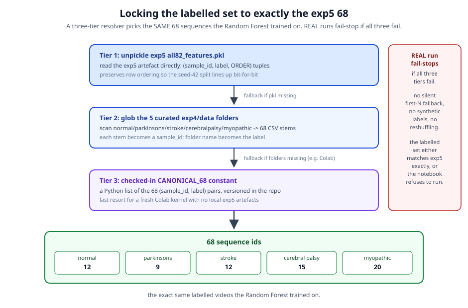
*The exact-68 lock: a three-tier resolver finds the same 68 curated sequences the baseline used, and stops rather than guessing if it cannot.*

### Correction 2: scoring per sequence, not per window

This correction fixes the honesty bug from before. Recall that the encoder does not see a whole sequence at once. It sees short windows, small overlapping crops of frames, and there are several windows per sequence. The first attempt scored one window at a time, which let windows from the same sequence land in both the training and test halves and inflated the score.

The fix is to score the same unit the baseline scored: the whole sequence. To do that the code takes all the window embeddings for a sequence and mean-pools them, which means averaging them into one vector per sequence. A vector here is just that list of numbers. Now each sequence is a single item. Then the split into train and test is done by sequence, so every window from a given sequence stays together on one side. There is no way for a test sequence to peek at a near-copy of itself in training. To make the comparison even tighter, the code also reproduces the baseline's exact split: the same seed-42 70/30 split, 47 sequences for training and 21 for testing, read straight from the order the sequences appear in the saved feature file. Seed-42 just means the shuffling starts from a fixed setting so the same split comes out every time. The old leaky per-window score is not thrown away, but it is kept only as a labelled diagnostic, a side number clearly marked as not comparable.

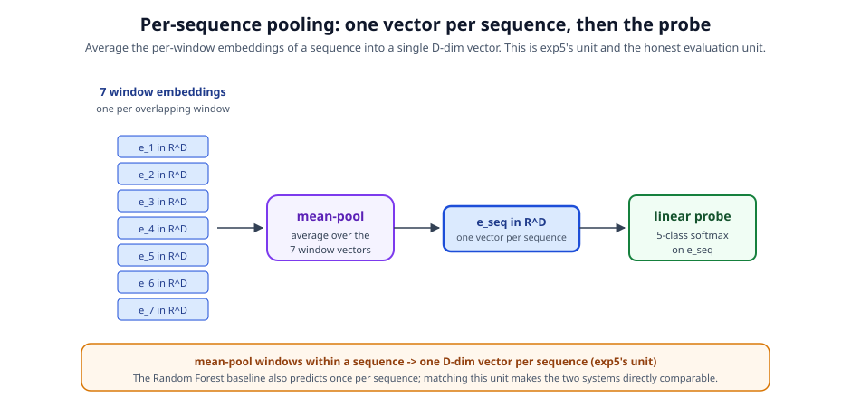
*Per-sequence pooling: the windows of one sequence are averaged into a single vector, and the train and test split is made by sequence so windows never leak across it.*

### Correction 3: closing the leak at the video level

Splitting by sequence closes one leak, but there is a subtler one. Remember that a single YouTube video can back more than one sequence, and those 68 sequences come from only 12 unique videos. The encoder is pretrained on a big bank of unlabeled windows. If that bank contains a window from the very same video that also produced a held-out test sequence (held-out means set aside for testing and never shown during training), the encoder has, in a sense, already seen frames almost identical to the ones it is later tested on. That would give it an unfair head start.

The third correction closes this at the video level. Before pretraining, the code drops from the unlabeled bank every window whose source video also backs one of the held-out labelled sequences. So the encoder can never have practiced on a near-duplicate frame from a test clip's own video. On the set of videos actually downloaded for the real run this exclusion happened to remove 0 windows, but the guard is in place so the leak cannot open up on a different set.

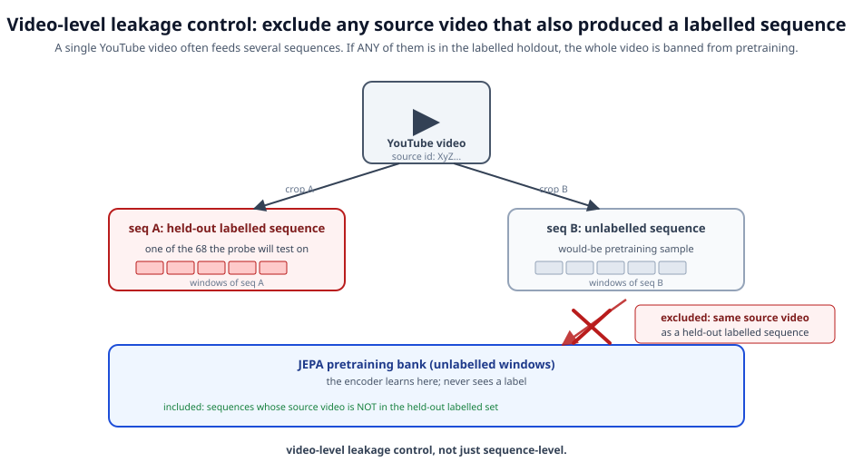
*Co-occurring video exclusion: any pretraining window from a video that also feeds a held-out labelled sequence is dropped, so the encoder cannot pretrain on a test clip's own footage.*

### Correction 4: matching the classifier and fingerprinting every file

The last correction covers the two remaining differences: the classifier and the bookkeeping. The baseline used a Random Forest, which is a classifier built from many decision trees that vote on the answer [4]. To compare fairly, the new run uses a Random Forest from the same family: 100 trees, a maximum depth of 5, balanced class weights so rare classes are not ignored, and seed-42 so it is repeatable. Same classifier, same settings, so any score difference points back to the representation and not the classifier.

The bookkeeping part is a canonical_id_hash stamped on every artifact the pipeline produces. A hash here is a short code computed from the contents, so if the contents change the code changes too. The real run carried the hash 06adde2b13f8. Because every file is stamped, the pipeline can check that all its pieces belong to the same run and refuse to mix a stale or mismatched file into a fresh one. This is the same fail-closed spirit as the earlier fixes, now applied to the whole chain of files.

### Two honest coverage fixes to reach 68 of 68

Locking to the exact 68 only helps if all 68 actually make it through the pipeline. Two of them did not at first, and it is worth being plain about how they were recovered, because the tempting shortcut would have been to just drop them.

The first was a cerebral palsy sequence. The pose detector found 0 of its 40 poses. The cause was concrete: the video decoded at 640 by 360 pixels, but the bounding box recorded in the dataset was measured in 1280 by 720, so the box pointed at a tiny far-left patch and the walker was not inside it. The fix scales the box by the ratio of the decoded size to the original size before cropping. With the box in the right place the detector found all 40 of 40 poses. The second was a stroke sequence with only 15 usable frames. The corpus builder had a minimum length of 16 frames, so it dropped anything shorter, and this clip fell just under the line. The fix lowered that minimum from 16 to 12, which matches the baseline's own behavior since it has no such floor and simply pads short clips. The 15-frame sequence was then admitted and padded to the standard length.

Both fixes matter for one reason. Each traced a real cause, a wrong-scale box and a too-strict length floor, and each recovered a genuine sequence. Neither one dropped a sequence to make the numbers look tidy, and neither faked or padded data that was not there. That is what let the final run honestly report coverage of 68 of 68. With all four corrections in place and all 68 sequences present, the comparison was finally fair, and the results in the next section are what a fair comparison shows.

---

## How the model learns: masking, positional embeddings, and the loss

The model we describe is a Gait-JEPA, a "skeleton-JEPA" that works over pose sequences instead of raw video pixels [6]. This section opens the box and shows the four moving parts that let it learn from unlabeled walking video: how a clip becomes numbers, how the model is told which frame and which joint each number belongs to, how we hide parts of the clip so the model has something to predict, and how we score its guesses. Each part fixes a specific problem, so we take them in order.

### From a pose clip to 1,056 tokens

We start with one pose clip. A pose clip is a short stretch of a walking video after we have already found the body's joints in each frame. It is stored as a tensor, which just means a block of numbers with a fixed shape. This tensor has shape (T=32, J=33, 3). That reads as 32 frames of video, 33 joints per frame (the 33 landmarks that the BlazePose pose detector gives us [5]), and 3 numbers per joint (its x, y, and z position in space).

A transformer, the kind of network we use, does not read a 3D block directly. It reads a flat list of items called tokens. A token is one small piece of the input that the model treats as a unit, like one word in a sentence. So we flatten the (32, 33, 3) block into T times J = 1,056 tokens, one token per joint per frame. We lay them out one frame at a time, meaning we walk through all 33 joints of frame 0 first, then all 33 joints of frame 1, and so on. The exact rule for the token number is:

```
token n = t * 33 + j
```

Here `t` is the frame number (0 to 31) and `j` is the joint number (0 to 32). So joint 5 in frame 0 is token 5, and joint 0 in frame 1 is token 33. Each of these 1,056 tokens is a small vector of 3 numbers (that joint's x, y, z). The first thing the model does is pass each token through a small linear layer that turns those 3 numbers into a vector of 64 numbers. That richer 64-number vector is called an embedding. An embedding is just a learned list of numbers that stands for one token in a form the model can work with. From here on, the model reasons over 1,056 embeddings.

### Positional embeddings: telling the model when and where

There is a catch. A plain transformer treats its tokens as an unordered set, like a bag of marbles with no sense of which came first. On its own it cannot tell frame 0 from frame 31, or a left knee from a right knee. That is fatal for gait, because a gait condition is defined by which joint moves when. If the model cannot see order, it cannot see walking. This was one of the real bugs in the first version of the pipeline (Bug 2): the encoder had no sense of position, so the final clip summary was an order-blind bag of points that erased the very thing we care about.

The fix is to add positional embeddings, which are extra learned numbers that stamp each token with its identity. We use two small tables. One is `time_embed`, of shape (32, 64), which gives each of the 32 frames its own 64-number signature. The other is `joint_embed`, of shape (33, 64), which gives each of the 33 joints its own signature. For the token at frame `t` and joint `j`, we add both signatures onto its embedding:

```
pos[t, j] = time_embed[t] + joint_embed[j]
```

Both tables start with small random values (standard deviation 0.1) and are learned during training. After this fix the model can tell frame 0 from frame 31 and a left knee from a right knee. This is the same fix used in the I-JEPA and V-JEPA models [1], [2].

### Block masking: hiding whole limbs, not scattered dots

Now the model needs something to predict. We hide part of the clip and ask the model to guess the hidden part. Which tokens we hide is decided by a mask, and the style of mask matters a lot. We use block masking, where we hide a connected chunk rather than random single joints. We use two styles, chosen 50/50 for each clip, and each time we hide about 40 percent of the tokens (a mask ratio of 0.4).

*(See ../../images/masking-styles.svg for a picture of the two styles.)*


*The two block-masking styles. Style A (limb over time) hides one whole limb across several frames; Style B (time window) hides every joint across a short stretch of frames. Both force the model to reason about coordinated motion rather than fill in a single lonely dot.*

Style A is "limb over time." It hides one whole limb, either the left arm, right arm, left leg, or right leg, across a run of frames next to each other. To fill that limb back in, the model has to reconstruct its motion from the other limbs and the frames around it. Style B is "time window." It hides all 33 joints across a short stretch of frames, so the model must fill a gap in time using the frames before and after.

Why blocks and not scattered single joints? A single hidden joint is too easy. Its neighbors in the same frame almost give it away, so the model can guess it without understanding the walk. Nothing forces it to learn how the body moves together. A block is different. To rebuild a whole leg over several frames, the model must reason about coordinated, whole-body motion, and coordination is exactly what walking is. Style A is especially fitting for gait: because it hides one whole leg, the only way to solve it is to compare that leg against the other leg and the torso. That left-versus-right comparison is the same signal clinicians use to spot the one-sided weakness in stroke and early Parkinson's, so the masking makes the model practice the right skill without our ever telling it to.

### The four pieces working together, and the corrected loss

Three of the four pieces are small networks. The context encoder (the one that actually learns) sees only the visible tokens and produces a context embedding. The target encoder sees the full clip and produces the "answer key" embeddings; it is a slow copy of the context encoder, updated as a moving average (target = 0.996 times target plus 0.004 times context), and we block any learning signal from changing it directly, so it stays a steady answer key. The predictor is a small network that takes the context embedding and guesses the target embedding at the hidden spots. The key idea of a JEPA is that this prediction happens in a learned space of embeddings, not in raw coordinates.

Scoring the guess is where the first version went wrong (Bug 3). The old loss let the target's numbers grow without limit, and because the comparison measured raw size, the loss actually rose as training went on. The corrected loss has three parts:

```
L = 25.0 * sim_loss + 0.5 * var_loss + 0.04 * cov_loss
```

The main part, `sim_loss`, is the mean squared error between the predictor's guess and the target embedding, but only after the target is passed through LayerNorm. LayerNorm is a step that rescales a vector so we compare its direction and not its overall size. Direction is "which way the embedding points"; size is "how big its numbers are." By stripping out size, a target whose numbers drift larger can no longer fake a rising loss. This is the trick from V-JEPA [2]. Its weight is 25.0, so it does almost all the work.

The other two parts are light guards from VICReg [3], and both act only on the online context embedding, never the frozen target. `var_loss` (weight 0.5, with a target spread gamma of 0.5) keeps each embedding feature from flattening to the same value across the batch. `cov_loss` (weight 0.04) keeps different features from copying each other. Together their job is to stop collapse, the failure where the model outputs one dull answer for everything because that trivially makes the prediction easy. The small weights are deliberate: these are guard rails, not a shove. With the fix, the total loss falls from about 12.8 to 6.0 over 400 training steps and the embedding spread holds steady instead of ballooning.

---

## What the honest numbers say

The first attempt produced one big number that looked great. This section shows what happened after we fixed the measurement and asked the questions fairly. The numbers are smaller than the flashy first result, but they are real, and each one answers a specific question we set out to test.

Two words come up again and again, so it helps to define them now. "Chance" is the score you would get by guessing at random. With 5 conditions to choose from, random guessing is right about one time in five, so chance is 0.20. The "baseline" is the earlier method we are trying to match: a Random Forest, which is a model that combines the votes of many simple decision trees, trained on 82 hand-picked gait numbers such as joint angles and step timing. On a fixed test split it reached 0.762 accuracy [4]. That is our reference point. Anything well above 0.20 means the model learned something. Getting near 0.762 means it learned as much as the careful hand-built method.

### RQ1: the controlled comparison

The first question is the main one. On the exact same 68 clinician-labeled sequences, using the same 5 conditions and the same fair way of splitting the data, how does our learned representation compare to the hand-built baseline? We keep everything the same and change only one thing: instead of the 82 hand-picked numbers, we feed in the frozen embedding, meaning the compact summary vector the pretrained encoder produces without any further training. Then we put a small, simple classifier on top and read the score.

Here are the headline numbers, each measured per sequence, which is the only unit that can be compared to the baseline. A linear probe, the simplest possible classifier, reached 0.486. A small neural network probe called an MLP reached 0.626. A Random Forest matched to the baseline family reached 0.579. And when we reran the baseline's own exact seed-42 split on our embeddings, a Random Forest reached 0.619. Against chance at 0.20 and the baseline at 0.762, every one of these is more than double chance and still below the baseline.

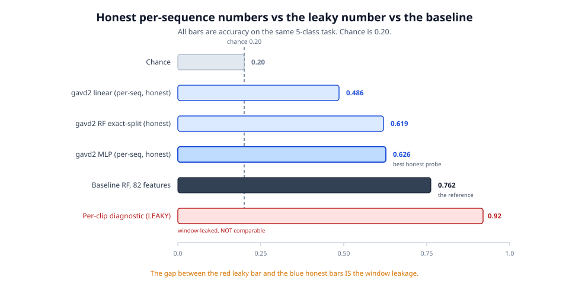
*Figure: the corrected numbers on the same 68 sequences, read against chance and the tuned baseline. The honest probes beat chance by a wide margin but sit under the baseline.*

#### Per-clip versus per-sequence, explained carefully

This is the single most important idea in the whole results section, so it is worth slowing down and building it up from scratch. The two phrases "per clip" and "per sequence" describe two different ways of asking the model the same question, and they give very different answers on the same data with the same encoder. The difference is not the model. It is how we split the data into a practice set and a test set.

Start with the raw material. A "sequence" is one continuous walk, one run of frames from a single video. A stroke sequence in our set might be 220 frames long, which is about a person taking several steps across the screen. The encoder, though, does not read a whole 220-frame walk at once. It reads short fixed-length pieces called windows, each 32 frames long. So we slide a 32-frame window along the walk and cut out a piece, then slide it forward and cut out the next piece, and so on. Because we slide the window forward by only a little each time, neighboring windows overlap heavily. Window A and window B might share 20 of their 32 frames. That means window A and window B are almost the same picture of the walk. On this data each walk produced about 7 of these overlapping windows on average.

Now the two ways to score.

The "per clip" way treats every one of those short windows as its own separate example. It throws all the windows from all the walks into one big pile and splits that pile at random into a practice set and a test set. The problem is that the random split does not know or care which walk a window came from. So window A of a walk can land in the practice set while window B of the *same* walk lands in the test set. Since A and B are almost identical, the model gets to study window A during practice and is then tested on its near-twin, window B. It can score well simply by remembering A and matching it to B. It never had to learn anything general about stroke. This shortcut is called window leakage, because the answer leaks across the practice-test boundary through those near-duplicate windows.

The "per sequence" way closes that door. Before splitting, it takes all of a walk's windows and averages their embeddings into a single vector that stands for the whole walk. Then it splits by walk, keeping every window of a given walk together, so a walk is either entirely in the practice set or entirely in the test set, never split across both. When the model is then tested on a walk, it has truly never seen that walk in any form. A good score now means the encoder learned something that transfers to a brand new walk, which is what we actually want to know.

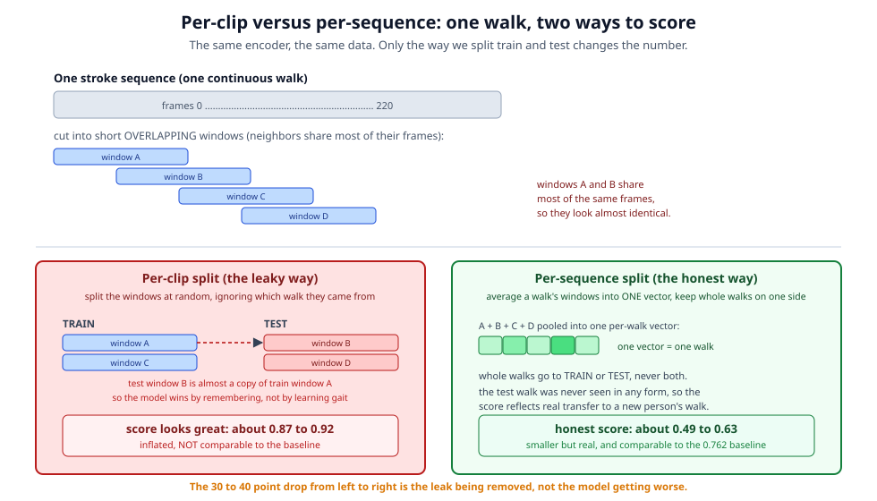
*Figure: the same encoder and the same walk scored two ways. The per-clip split lets a near-duplicate window sit in both practice and test, so it reads about 0.87 to 0.92. The per-sequence split pools each walk into one vector and keeps whole walks on one side, so it reads the honest 0.49 to 0.63.*

Here is what each way produces on our data. Scored the honest per-sequence way, the probes reach 0.486 (linear), 0.626 (MLP), and 0.579 (matched Random Forest). Scored the leaky per-clip way, the exact same probes on the exact same encoder read 0.866 (linear), 0.920 (MLP), and 0.883 (Random Forest), so roughly 0.87 to 0.92. That is a jump of about 30 to 40 accuracy points, and every one of those points is fake. It is the leak, not the learning. The first attempt measured this same effect even more sharply on its smaller run: its leaky linear probe read 0.88 while its honest per-sequence linear probe read 0.49, a gap of about 39 points.

There is a second, deeper reason the per-sequence number is the only one we are allowed to headline. The baseline we are comparing against was itself scored per sequence [4]. It made one prediction per whole walk. If we scored ourselves per clip and then set our 0.92 next to the baseline's 0.762, we would be comparing two different games and calling ourselves the winner. That is exactly the mistake the first attempt made. To compare fairly, both sides must be judged the same way, which means per sequence for both. So per clip is kept in this paper only as a labeled diagnostic, a way to *measure how big the leak is*, and never as a result.

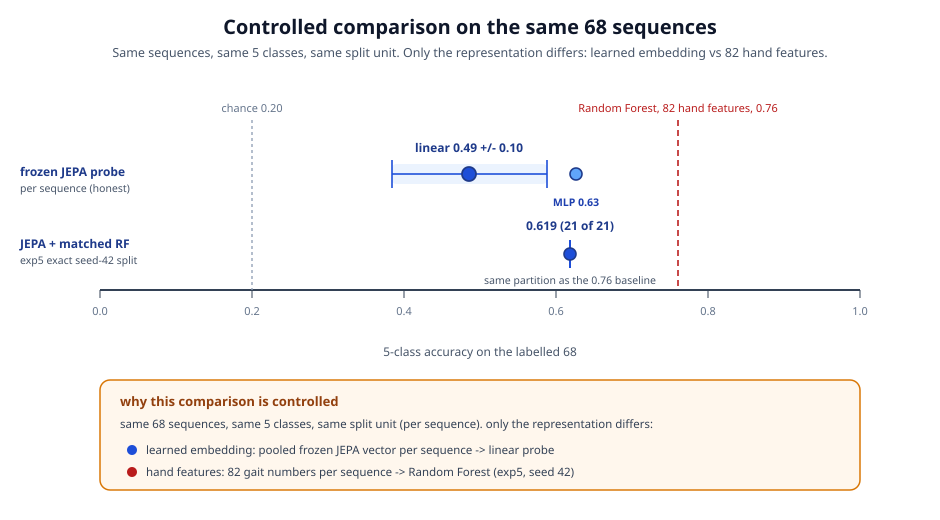
*Figure: same 68 sequences, same 5 classes, same per-sequence split unit. Only the representation differs, so the gap to the baseline is a fair one.*

So what does the honest per-sequence number actually tell us? It says the frozen encoder learned real, transferable gait structure. It more than doubles the 0.20 chance level on walks it never saw, and the MLP probe reaches 0.626, which is well into useful territory for a five-way medical guess. At the same time, the tuned 82-feature Random Forest still leads at 0.762 on this small labeled set. The reason for that gap is not that the encoder learned poorly. It is that 68 examples is very little to train and test a five-class model on. With only about 20 sequences in each test fold, the scores swing a lot from one split to the next, which is why the linear probe carries a spread of plus or minus 0.102. Sample size, not representation quality, is the ceiling here, and that is a claim we will return to and defend.

### RQ2: label efficiency

The second question is about labels. Clinician-graded clips are scarce and expensive, so we want to know how the model holds up when it has fewer of them to learn from. We trained the linear probe on 25 percent, 50 percent, 75 percent, and 100 percent of the available training sequences and watched the accuracy. The scores were 0.393 at 25 percent, 0.417 at 50 percent, 0.457 at 75 percent, and 0.486 at 100 percent.

The exact heights matter less than the shape. The accuracy drops off slowly, not sharply, as we take labels away, and even at a quarter of the labels the model stays about double chance. That gentle slope is the payoff of pretraining. The encoder already learned the structure of walking from unlabeled video, so the few labels only have to teach it the names, not the motion.

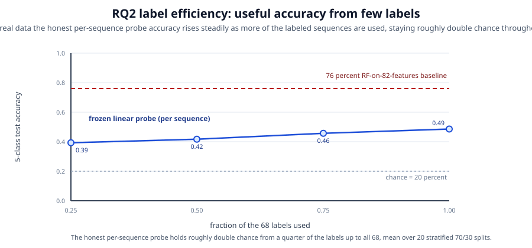
*Figure: the linear probe degrades gracefully as labels are removed. The slow, steady slope is the point, not the absolute numbers.*

### RQ3: clinical structure

The third question asks whether the encoder captured meaningful clinical signals on its own, with no labels at all. To test this we take two plain, measurable numbers computed straight from the pose motion and ask a simple linear model to recover each one from the frozen embedding. We score the result with R-squared. In one plain sentence, R-squared is the share of the variation in a number that the model can explain, running from 0 for no explanation up to 1 for perfect explanation.

The first number, step_amplitude, measures how far the feet swing, which is the stride and range-of-motion axis. Its R-squared was 0.682, which means the encoder captured that axis strongly, entirely on its own. The second number, asymmetry_index, measures the difference between the left and right legs. Its R-squared was 0.081, so that axis is present but faint. This connects directly to the neuroscience grounding, where left-versus-right asymmetry and reduced range or short stride are the two clinical axes that define these conditions. The encoder captured the stride axis well and only faintly captured the asymmetry axis.

### RQ4: turning the anti-collapse guards off (an ablation)

The fourth question checks whether one safety part of the training loop is doing real work. That part, called VICReg, exists to stop a failure mode where the encoder cheats by squashing every clip to the same dull embedding, a problem known as collapse. To test it we ran a faithful mini training loop twice, once with VICReg on and once with it off, and measured the final spread of the embeddings, written as the standard deviation. A healthy, varied encoder keeps this spread up; a collapsing one drives it toward zero.

With VICReg on, the final embedding spread was 0.904. With it off, the spread was 0.743. So VICReg does real anti-collapse work on top of the encoder. But note carefully: turning it off did not drive the spread to zero on this data. The encoder did not fully collapse without it, so VICReg here is a useful guard rail rather than the only thing holding the training up.

### Reading the confusion matrix

A confusion matrix is a table that shows, for each true condition, how often the model named it correctly and how often it mixed it up with something else. The correct rate for a condition is called its recall. Reading down the honest results, normal, parkinsons, stroke, and myopathic are all clean, with recalls from 0.86 to 0.91. Cerebral palsy is the weakest at 0.78, and when it is wrong it is most often confused with myopathic, at 0.19.

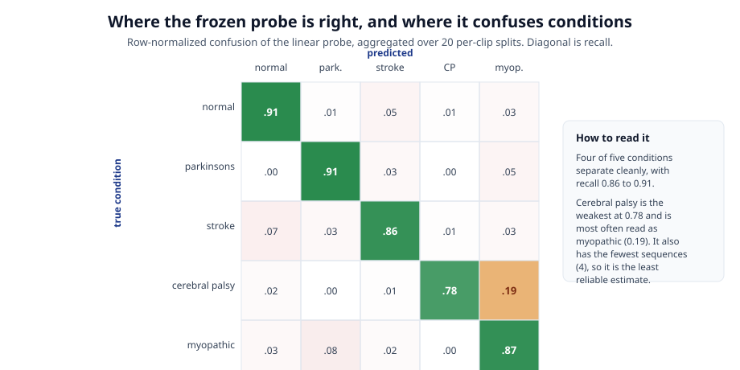
*Figure: rows are the true condition. The one notable off-diagonal error is cerebral palsy confused with myopathic.*

That specific mistake makes clinical sense, because both cerebral palsy and myopathic conditions change how the body carries its weight and can look similar in the way the muscles behave. Cerebral palsy is also one of the harder classes to judge here. In the first attempt only 4 of its sequences survived the download and extraction step, which is why its numbers were the least reliable of the five. One honest caveat: this matrix is aggregated over the per-clip splits, so it carries the same window-leakage caveat as the diagnostic numbers above and should be read as a pattern of errors, not as final accuracy.

### Reading the four experiments together

Each experiment on its own is a single data point. The real picture comes from reading them together, because they check different things and they agree with each other. When four independent tests all point the same way, you can trust the story more than any one number.

Start with RQ1. The honest per-sequence probes land between 0.486 and 0.626, more than double the 0.20 chance level, on walks the encoder never saw. On its own that could be a fluke of one lucky split. But RQ2 backs it up from a different angle. When we cut the training labels down to a quarter, the accuracy only slips from 0.486 to 0.393, still about double chance. A model that had merely memorized a few walks would fall apart when you took most of its labels away. This one degrades gently, which is the sign of a model leaning on structure it already learned during pretraining rather than on the handful of labels.

RQ3 then tells us what that structure actually contains. Without using a single label, the frozen encoder stores enough information to recover the stride-size signal at an R-squared of 0.682. That is a specific, physically meaningful gait measurement, how far the feet swing, sitting inside the embedding on its own. So RQ1 says "the embedding separates the conditions," RQ2 says "it does so from structure, not memorized labels," and RQ3 says "and here is a concrete piece of that structure you can name." The three reinforce one another.

RQ4 checks the plumbing underneath all of this. It confirms that the anti-collapse guard is doing real work, keeping the embedding spread at 0.904 with the guard on versus 0.743 with it off. This matters because a collapsed encoder, one that outputs nearly the same dull vector for every walk, could still post a middling accuracy by luck, and we would not want to mistake that for learning. RQ4 rules that out: the encoder is genuinely spreading the walks apart, not hiding a collapse.

Finally the confusion matrix ties the numbers back to the clinic. The encoder is not making random mistakes. Its one notable error, confusing cerebral palsy with myopathic, is a mistake a clinician would understand, because both conditions change how the body carries its weight. An encoder whose errors line up with real clinical similarity is an encoder that has learned something about the conditions, not just about the pixels.

So the four experiments are not four separate results. They are four windows onto the same finding: a frozen, label-free encoder that learned real gait structure, uses it efficiently, stores nameable clinical signals, avoids collapse, and errs in clinically sensible ways. That is a much stronger claim than any single accuracy number, and it is the claim the honest measurement lets us make.

### Is the JEPA approach to gait promising?

This is the question worth asking plainly, and it deserves a plain answer with no spin in either direction.

Yes, it looks promising, but promising is a careful word and it is the right one. Here is the honest case for optimism. The approach started from zero labels and, purely by watching unlabeled walking video, built an encoder whose summaries let a tiny classifier tell five gait conditions apart far above chance. It kept most of that skill when we starved it of labels. It captured a real clinical measurement, stride size, without being told to. And it did all this with a very small model, only 71,360 trained values and two layers, trained for only 400 steps on a plain laptop processor. A small, cheap, label-free model that already reaches 0.626 on a five-way clinical task, on a labeled set of just 68 walks, is a strong starting point, not a finished product.

Now the honest limit on that optimism. It has not beaten the tuned 82-feature baseline, which still leads at 0.762. And it cannot yet make a clinical claim about new patients, because 68 walks from only 12 videos is too small and too narrow to prove that the model would work on people and cameras it has never seen. So the fair summary is this: the *method* is promising, but this *study* is a controlled comparison of representations, not a clinical validation. Those are two very different things, and the honesty of this project is in not confusing them.

### What exactly are we learning here?

It helps to separate what we learned about walking from what we learned about doing science.

About walking, we learned that the coordinated motion of a gait, which joint moves and when, carries enough signal that a model can pick it up from raw joint positions alone, with no hand-crafted features and no labels during pretraining. The stride-size result from RQ3 is the sharpest evidence: a clinically meaningful axis fell out of the embedding on its own. We also learned where the approach is still weak. The left-versus-right asymmetry axis, which matters a lot for stroke and Parkinson's, came out only faintly, at an R-squared of 0.081. So the encoder learned the size of the stride well but the balance between the two sides poorly, and that tells us exactly what to work on next.

About science, we learned something more general and more valuable. We learned that a measurement can lie without anything breaking. The first attempt's 0.88 was not produced by a broken program. Every line ran. The lie was in the *choice of how to measure*, splitting per clip instead of per sequence, and no error message will ever catch that kind of mistake. We learned that the only defense is to match your test to the question you actually care about, and to the baseline you actually compare against. And we learned that when the honest measurement makes your headline number smaller, that is not a loss. It is the point. The smaller number is the one you can build the next experiment on.

### What frontiers are we pushing?

It is worth being clear-eyed about which frontiers this work touches and which it does not.

The clearest frontier is applying the JEPA idea, which was built for images and then video, to skeleton motion for a clinical purpose. Predicting hidden motion in a learned latent space, rather than redrawing exact joint positions, is a young idea for pose sequences, and using it to attack the label-scarcity problem in clinical gait analysis is not a well-trodden path. The label-efficiency result from RQ2 is the frontier that matters most for medicine, because clinician-graded data will always be scarce and expensive, and a method that stays useful on a quarter of the labels is a method that could actually be used in a clinic one day.

We are also pushing, quietly but importantly, on the frontier of honest evaluation. A large share of published machine-learning results on small datasets are inflated by exactly the kind of leakage this project caught and corrected. Showing the leak, measuring it at about 39 points, and reporting the honest number beside the inflated one is a small contribution to a real problem in the field.

We should be equally clear about the frontiers we are *not* pushing. We are not setting a new accuracy record; the baseline still leads. We are not proving clinical usefulness; the sample is far too small for that. And we are not scaling to large models; the encoder here is deliberately tiny. Those are the next frontiers, not the ones this study claims. The value of this work is that it clears the ground honestly, so the people who push those frontiers next, including the same authors in later iterations, start from a number they can trust.

---

## Penny's neuroscience map: where clinical knowledge enters the pipeline

So far the model has learned from motion alone, with no doctor in the loop during training. But the whole point is to name a medical condition from a walking video. To make sure the model is looking at the things a clinician would look at, the project needs a bridge between neuroscience and code. That bridge is the work of Penny Inouye, who leads the neuroscience grounding for this project. This section explains what she built and, more importantly, the three exact places in the code where her clinical knowledge shows up.

### What Penny built: a graded feature map

Penny took a long list of gait features and graded each one, per condition. A "feature" here is one measurable thing about walking, such as how far a person's hip swings, how long each step is, or how different the left side looks from the right side. For every feature she wrote down four things:

- A priority: H (high), M (medium), L (low), or NA (not applicable). This says how much that feature matters for that condition.
- A neurological reason: a plain-language explanation of why the brain or muscle problem causes that change in walking.
- A numeric threshold: a number that tells you when the change is big enough to be a real sign, not just normal variation.
- A citation: a published paper backing the claim.

These files live in the folder `gait/neuroscience/`. Two of them are fully filled in: `pd-features.csv` for Parkinson's disease and `stroke-features.csv` for stroke. Two more are still blank templates: `cerebral-palsy-features.csv` and `myopathic-features.csv`. Their gradings are expected in early August 2026.

Here are a few of her graded entries, with her own reasons and thresholds:

- Parkinson's, hip asymmetry (priority M). Parkinson's often starts by affecting one side of the body first, which throws off balance. Research finds that this balance asymmetry is common in Parkinson's and even helps drive the sudden freezing that can stop a walk [7]. In Penny's own grading notes, most of the participants she reviewed showed this left to right mismatch in hip balance control. "Asymmetry" means the left and right sides do not match.
- Parkinson's, stride length (priority H). A key sign of Parkinson's is a shuffling walk, which greatly shortens each stride. A stride under about 0.9 meters is treated as suspicious in Penny's Parkinson's grading.
- Stroke, knee asymmetry (priority H). A common sign of stroke is a stiff-knee walk, where one side of the body has been weakened. A difference of 17 degrees or more in knee bending can signal a stroke, and stiff-knee walking affects 25 percent to 75 percent of people with walking problems after a stroke [9].
- Stroke, one-sided cause (priority M to H). A stroke damages one side of the brain, and because of how the brain wires to the body, that impairs the opposite side of the body. So one side walks differently from the other, which again produces asymmetry [10].

### The crux: two clinical axes, three places in the code

Read across all of Penny's high-priority entries and two big ideas keep coming back. Think of them as two axes, meaning two main directions in which an unhealthy walk can differ from a healthy one.

1. Left-versus-right asymmetry. Stroke and early Parkinson's both begin on one side, so the two sides of the body stop matching.
2. Reduced range and short stride. Parkinson's shuffling makes steps small, and myopathic walking (from weak muscles) also shortens steps and limits how far joints move.

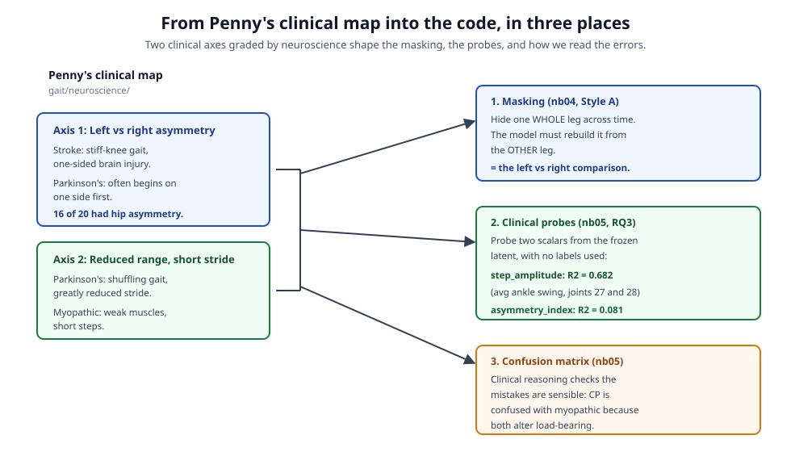
*Penny's two clinical axes, asymmetry and reduced range/short stride, flow into three concrete spots in the code.*

Here is the part worth slowing down for. These two axes are not just talk in a spreadsheet. They show up at three exact places in the code.

#### Place 1: masking (notebook 04)

Recall that during pretraining the model plays a fill-in-the-blank game. It hides part of a clip and tries to rebuild the hidden part. The way we hide things is the key. In "Style A" masking, called "limb over time," the code hides one whole leg across a window of frames. A whole leg is a fixed group of joints. In the code the left leg is `left_leg = [23,25,27,29,31]` and the right leg is `right_leg = [24,26,28,30,32]`, where each number is one body point.

Now think about what that forces. If the entire left leg is blacked out over many frames, the only way to guess its motion is to look at the right leg (and the torso) and infer what the left leg must be doing. That is exactly the left-versus-right comparison Penny says defines stroke and early Parkinson's asymmetry.

This is the important twist: we never tell the model "compare the two legs." We just hide a whole limb. The masking makes comparing the legs the only way to solve the puzzle. So Penny's asymmetry reasoning is the actual reason we hide whole limbs instead of scattering a few random joints. Scattered joints would be too easy to guess from their close neighbors and would teach nothing about how the two sides relate.

#### Place 2: the clinical probes (notebook 05, research question 3)

After pretraining, the encoder is frozen, which means its weights are locked and it just turns a clip into a list of numbers called an embedding. Research question 3 asks a sharp question: without ever using labels, did the encoder store the two clinical axes inside that embedding? To check, we compute two simple numbers straight from a clip and see whether a small linear model can read each number back out of the embedding.

The clip is a tensor of shape (T, 33, 3): T frames, 33 body points, and 3 coordinates each. The two numbers, called `clip_scalars`, are:

- `asymmetry_index = |left ankle (joint 27) x-range - right ankle (joint 28) x-range| / (sum + eps)`. In words: measure how far the left ankle swings side to side, do the same for the right ankle, and take the size of the difference, scaled so it stays between 0 and 1. The `eps` is a tiny number that stops division by zero. This is a direct, see-through stand-in for Penny's stroke knee and ankle asymmetry and her Parkinson's hip and ankle asymmetry.
- `step_amplitude = 0.5 * (left ankle swing + right ankle swing)`. In words: the average of how far the two ankles swing. This is the reduced-range and short-stride axis. A full stride gives a large number; Parkinson's shuffling and myopathic short steps give a small one. It stands in for Penny's Parkinson's stride length and her range-of-motion features.

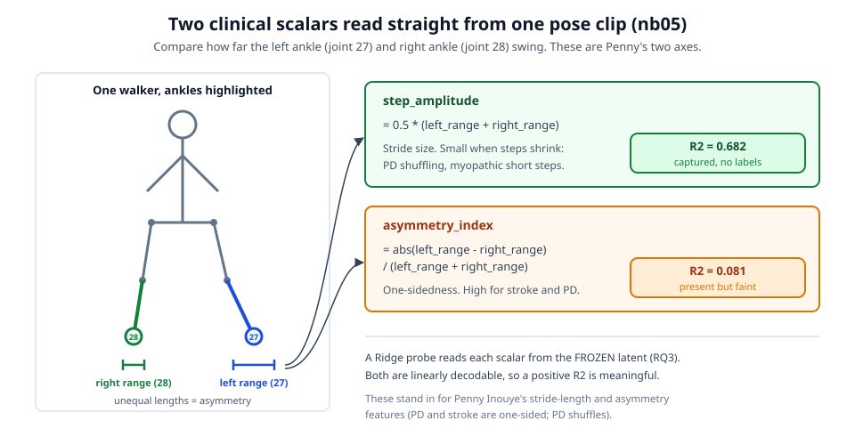
*The asymmetry scalar compares left ankle swing (joint 27) to right ankle swing (joint 28) as a stand-in for the clinical asymmetry Penny graded high.*

The results are telling. The stride/range axis came out strong: `step_amplitude` scored an R-squared of 0.682, where R-squared measures how much of the number the probe can predict, from 0 (nothing) to 1 (perfect). The asymmetry axis was weak: `asymmetry_index` scored only 0.081. Read against Penny's map, this says the reduced-range and short-stride axis emerged in the embedding on its own, with no labels, while the asymmetry axis is present but faint. That faintness lines up with the fact that asymmetry is a smaller, more subtle side-to-side difference than the large change in overall step size.


*Penny's two dominant clinical axes, drawn side by side.*

#### Place 3: reading the confusion matrix (notebook 05)

A confusion matrix is a grid that shows, for each true condition, how often the model guessed each label. Penny's clinical reasoning is how we check that the model's mistakes are sensible instead of random. The clearest example: cerebral palsy is confused with myopathic 0.19 of the time, meaning about 19 percent of cerebral palsy sequences get called myopathic. That is not a nonsense mix-up. Both conditions change how weight is carried through the legs, and both can look hypotonic, meaning low muscle tone or a floppy quality. So even the errors follow the neuroscience, which raises our trust that the model is reasoning about the body and not memorizing noise.

### An honest status of the neuroscience work

To be clear about what is done and what is still coming: Parkinson's and stroke are fully graded, so their clinical axes are backed by Penny's finished feature maps and citations [7], [8], [9], [10]. Cerebral palsy and myopathic are still blank templates, with gradings due in early August 2026, so their per-feature clinical probes are future work. Because of that, research question 3 today uses only the two see-through stand-in scalars above. Those two were picked on purpose to line up with the axes Penny already graded as high priority for the conditions we do have. When the remaining gradings arrive, the plan is to read her documented high-priority features directly instead of relying on stand-ins.

---

## What this journey teaches

If you remember nothing else from this paper, remember these lessons. Each one came from a real mistake or a real result, not from a textbook.

**Guard your caches. A silent synthetic pass looks exactly like success.** The first attempt saved fake practice data to disk, then read it back and reported a score as if it were real. Nothing crashed. The only check asked whether there were at least 10 test clips, and the fake data had 26, so it slipped right through. Always stamp your data with where it came from, and make the program stop hard if the stamp is wrong.

**Order matters. A bag of points is not a walk.** The first encoder had no way to tell frame 0 from frame 31, or a left knee from a right knee, so it treated a clip as an unordered pile of dots. But a gait condition IS the order: which joint moves, and when. Adding position information for time and for each joint is what let the model see motion at all.

**Balance the two forces in a JEPA loss, and normalize the target.** A JEPA loss has two jobs at once: predict the hidden part, and stop the model from cheating by making every answer the same. The first loss let the anti-cheating force run wild, and with no size normalization on the answer key, the loss climbed instead of falling. The fix was to keep the guard light [3] and to measure direction, not size, by normalizing the target first [2].

**A leaky split can add about 39 fake accuracy points, so match the evaluation unit to the baseline.** Splitting by short video windows put near-duplicate clips in both the practice set and the test set, which inflated the score by roughly 39 points on the first attempt's linear probe. The old baseline was scored one whole sequence at a time [4], so that is the only fair unit to compare against.

**The honest number is the useful one.** The first flashy score near 0.88 meant nothing. The honest per-sequence score of 0.63 from the MLP probe is smaller, but it is real, and it is the number you can build on.

**Sample size, not representation, was the real ceiling here.** The frozen encoder learned real, transferable gait structure, more than doubling the 0.20 chance level on unseen sequences. It still trailed the tuned baseline of 0.762 [4]. The thing holding it back was not the quality of what it learned. It was having only 68 labeled examples.

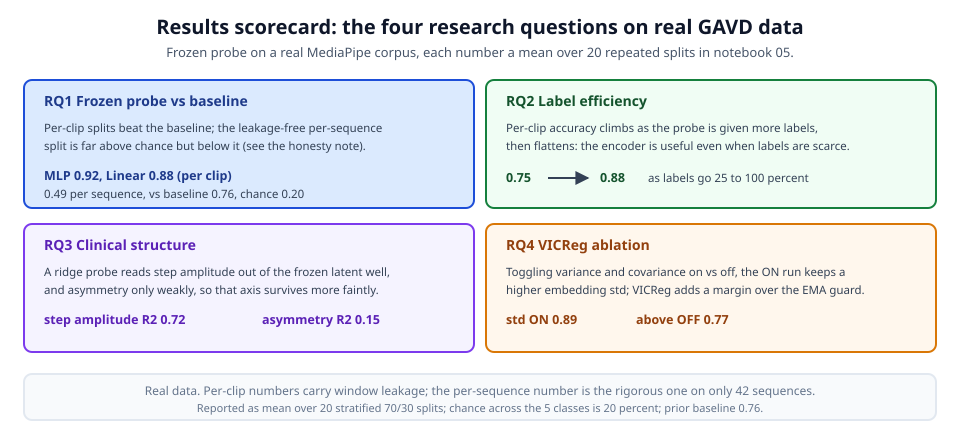
*The honest per-sequence scores (linear 0.486, MLP 0.626, Random Forest 0.579, and the exact-split 0.619) sit below the 0.762 baseline but well above the 0.20 chance line.*

## Limits

We want to be plain about what this study cannot yet claim.

The labeled set is tiny and uneven. It holds just 68 sequences across 5 classes, and the classes are not balanced: parkinsons has only 9 sequences [4]. With so few examples, every test fold has only about 20 sequences, so the scores swing a lot from split to split.

The encoder is small. It has 71,360 trained values and only 2 transformer layers. Training was short too, just 400 real steps. A bigger model trained for longer might learn more, and we simply have not tested that yet at scale in this baseline.

One of the comparison points rests on very little data. The exact-split fold that lines up with the old study tests on only 21 sequences [4]. A single lucky or unlucky sequence can move that number.

Finally, two of our 68 sequences only made it in after targeted coverage fixes. One cerebral palsy clip needed a resolution-scaled crop because the video decoded smaller than the recorded box, and one stroke clip needed the minimum length lowered from 16 frames to 12 [4]. Both fixes were root-caused, not fudged, but they show how fragile coverage is on a set this small.

## Where this goes next

The clearest path forward follows straight from the limits above.

First, grow the labeled set. There are large pools of unlabeled walking video already in hand, and the bottleneck was never raw footage. It was clinician-graded labels [4]. More graded sequences would shrink the swing in the scores and give the encoder a fairer test.

Second, scale the encoder and train it longer. Notebooks 06 and 07 already begin this: a larger model, a longer training run, and the same honest per-sequence evaluation so the comparison stays fair. The point is to find out whether the ceiling was really sample size, as we suspect, or partly the small model.

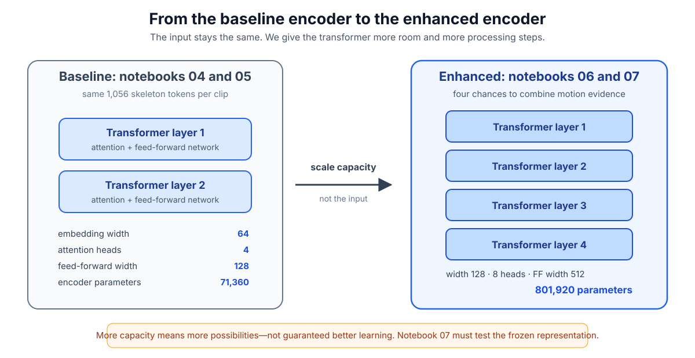
*Notebooks 06 and 07 start scaling the encoder past the small 2-layer, 71,360-value baseline.*

Third, teach the model the shape of the body. Right now the encoder learns joint relationships from scratch. Adding graph-aware attention, which tells the model up front which joints are physically connected in the skeleton, could help it reason about coordinated motion sooner.

Fourth, run the full clinical probes once the rest of the neuroscience gradings arrive. Penny Inouye's cerebral palsy and myopathic feature gradings are due in early August 2026. Her Parkinson's and stroke gradings, already finished, point the way [7], [8], [9], [10]. When they land, we can test whether the frozen latent encodes each high-priority clinical feature directly, not just the two transparent stand-in scalars we used here.

## Conclusion

The lasting message of this project is about honesty, not about a single score. The first attempt produced a number near 0.88 that felt like a win, but three quiet bugs and one leaky measurement made it meaningless. The second attempt fixed the bugs, matched the evaluation to the baseline, and reported the smaller but real number: a frozen self-supervised encoder that more than doubles chance on unseen sequences and reaches 0.626 with an MLP probe, while a tuned 82-feature baseline still leads at 0.762 [4]. That honest result is worth far more than the flashy one, because you can trust it, learn from it, and build on it. Good science is not the number that looks best. It is the number you can defend.

---

## References

::: {.references}
[1] M. Assran, Q. Duval, I. Misra, P. Bojanowski, P. Vincent, M. Rabbat, Y. LeCun, and N. Ballas, "Self-supervised learning from images with a joint-embedding predictive architecture," in *Proc. IEEE/CVF Conf. Computer Vision and Pattern Recognition (CVPR)*, Jun. 2023, pp. 15619 to 15629. [Online]. Available: https://arxiv.org/abs/2301.08243

[2] A. Bardes, Q. Garrido, J. Ponce, X. Chen, M. Rabbat, Y. LeCun, M. Assran, and N. Ballas, "Revisiting feature prediction for learning visual representations from video (V-JEPA)," *Trans. Machine Learning Research*, 2024. [Online]. Available: https://arxiv.org/abs/2404.08471

[3] A. Bardes, J. Ponce, and Y. LeCun, "VICReg: Variance-invariance-covariance regularization for self-supervised learning," in *Proc. Int. Conf. Learning Representations (ICLR)*, 2022. [Online]. Available: https://arxiv.org/abs/2105.04906

[4] R. Ranjan, D. Ahmedt-Aristizabal, M. A. Armin, and J. Kim, "Computer vision for clinical gait analysis: A gait abnormality video dataset," *IEEE Access*, vol. 13, pp. 45321 to 45339, 2025, doi: 10.1109/ACCESS.2025.3545787. [Online]. Available: https://arxiv.org/abs/2407.04190

[5] V. Bazarevsky, I. Grishchenko, K. Raveendran, T. Zhu, F. Zhang, and M. Grundmann, "BlazePose: On-device real-time body pose tracking," *arXiv preprint arXiv:2006.10204*, 2020. [Online]. Available: https://arxiv.org/abs/2006.10204

[6] Y. LeCun, "A path towards autonomous machine intelligence," *OpenReview*, ver. 0.9.2, Jun. 2022. [Online]. Available: https://openreview.net/forum?id=BZ5a1r-kVsf

[7] T. A. Boonstra, J. P. P. van Vugt, H. van der Kooij, and B. R. Bloem, "Balance asymmetry in Parkinson's disease and its contribution to freezing of gait," *PLoS One*, vol. 9, no. 7, art. no. e102493, 2014, doi: 10.1371/journal.pone.0102493. [Online]. Available: https://pmc.ncbi.nlm.nih.gov/articles/PMC4102504/

[8] T. C. F. do Nascimento, F. M. Gervásio, A. Pignolo, G. A. S. Bueno, A. A. do Carmo, D. M. Ribeiro, M. D'Amelio, and F. A. dos Santos Mendes, "Assessment of the kinematic adaptations in Parkinson's disease using the gait profile score: Influences of trunk posture, a pilot study," *Brain Sciences*, vol. 11, no. 12, art. no. 1605, 2021, doi: 10.3390/brainsci11121605. [Online]. Available: https://pmc.ncbi.nlm.nih.gov/articles/PMC8699192/

[9] J. Lee, R. K. Lee, B. A. Seamon, S. A. Kautz, R. R. Neptune, and J. Sulzer, "Between-limb difference in peak knee flexion angle can identify persons post-stroke with stiff-knee gait," *Clinical Biomechanics*, vol. 120, art. no. 106351, 2024, doi: 10.1016/j.clinbiomech.2024.106351. [Online]. Available: https://www.sciencedirect.com/science/article/pii/S0268003324001839

[10] H. Ogihara, E. Tsushima, T. Kamo, T. Sato, A. Matsushima, Y. Niioka, R. Asahi, and M. Azami, "Kinematic gait asymmetry assessment using joint angle data in patients with chronic stroke: A normalized cross-correlation approach," *Gait and Posture*, vol. 80, pp. 168 to 173, 2020, doi: 10.1016/j.gaitpost.2020.05.042. [Online]. Available: https://pubmed.ncbi.nlm.nih.gov/32521470/
:::
