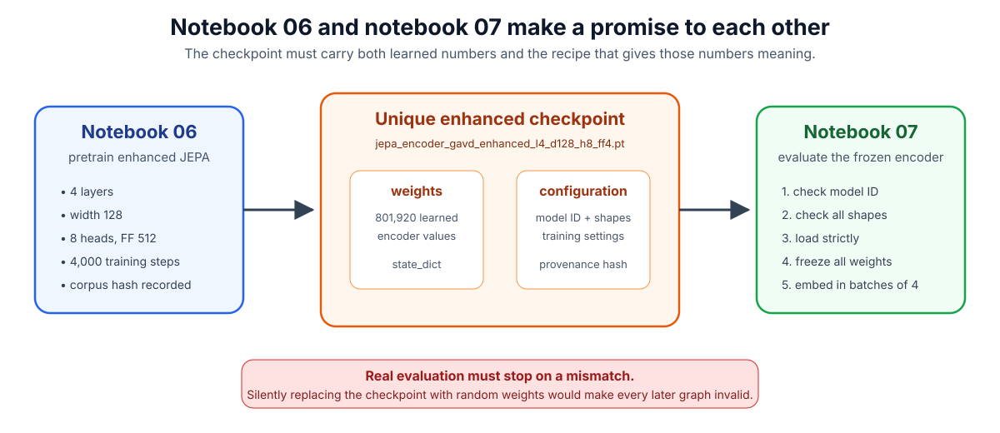
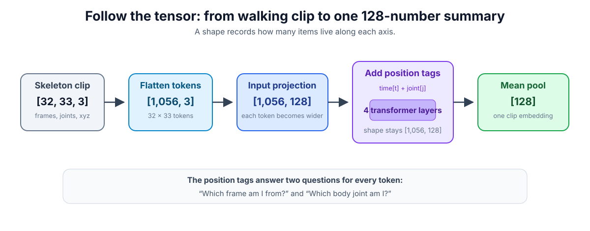
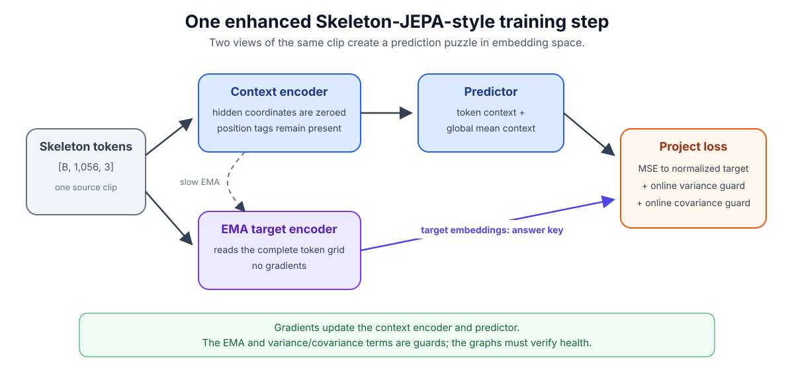
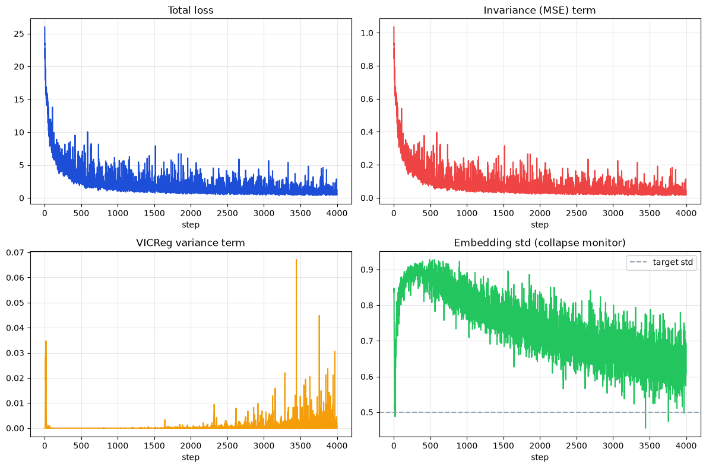
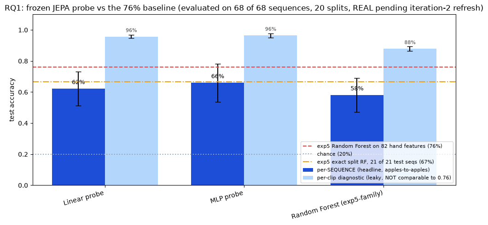
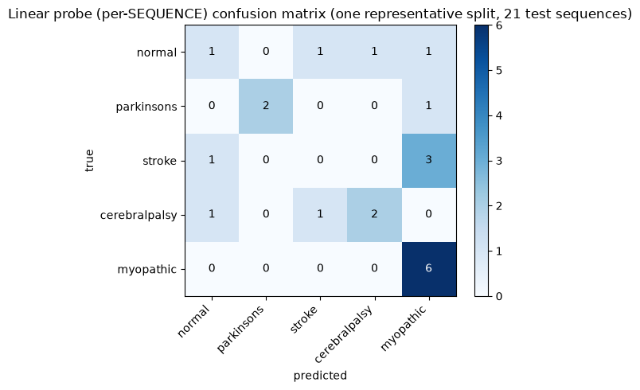
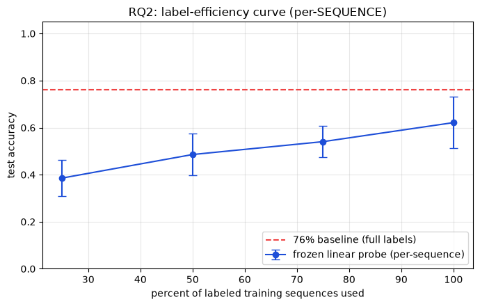
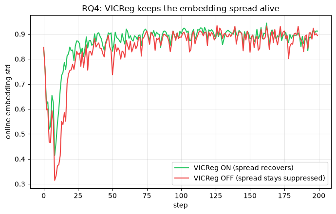

# Building and Evaluating a Deeper Skeleton-JEPA Encoder

## A step-by-step guide to notebooks 06 and 07

This tutorial explains how this project grows the small encoder in notebooks 04 and 05 into the deeper encoder in notebooks 06 and 07. It is written for a student who knows basic Python but may be new to machine learning.

The central idea is simple:

> Show a model part of a walking skeleton, hide another part, and train the model to predict a useful *summary* of what was hidden.

Notebook 06 performs this self-supervised pretraining. Notebook 07 freezes the resulting encoder and asks whether its summaries help small classifiers recognize gait classes.

The project uses pose sequences derived from the Gait Abnormality in Video Dataset (GAVD) [1]. BlazePose supplies 33 body landmarks for each frame [2]. The encoder never receives a diagnosis during pretraining; labels are used only later by notebook 07.

> **Scientific wording.** This is a **skeleton-specific JEPA-style adaptation**, not an exact reproduction of I-JEPA or V-JEPA. It borrows their context encoder, predictor, slowly updated target encoder, and latent-prediction idea [3], [4]. Its anti-collapse terms are **VICReg-inspired**, but its loss is not the original VICReg recipe.

> **Clinical boundary.** This is a research and teaching system. Its outputs are not medical diagnoses.

### What you will learn

By the end, you should be able to explain:

1. how a walking clip becomes a sequence of vectors;
2. what depth, width, heads, and feed-forward width mean;
3. how the context encoder, target encoder, predictor, and loss work together;
4. why notebook 06 needs a new checkpoint instead of overwriting notebook 04;
5. why notebook 07 must reconstruct and strictly load the exact architecture;
6. how to read the stored training and evaluation graphs without overclaiming.

## 1. Where notebooks 06 and 07 fit

The original pipeline ends with a small baseline encoder:

| Notebook | Role |
|---|---|
| 00 to 03 | Find data, extract skeletons, and build the pretraining corpus and labelled holdout |
| 04 | Train the baseline two-layer, 64-wide encoder |
| 05 | Freeze and evaluate the baseline encoder |
| **06** | Train a separate four-layer, 128-wide enhanced encoder |
| **07** | Strictly load, freeze, and evaluate that enhanced encoder |

Notebooks 06 and 07 are **companions**, not replacements. Keeping 04/05 untouched preserves a baseline. That makes the question meaningful: did the larger encoder actually help?

For the plain-language back story of how notebooks 00 to 05 came to be, including the bugs that were found and fixed and how the honest baseline result was measured, see [the gavd to gavd2 learning journey](learning/learning-journey.md).

The two enhanced notebooks form one artifact chain:



*Fig. 1. Notebook 06 saves learned weights plus the configuration needed to interpret them. Notebook 07 checks the contract before evaluating. A real evaluation must stop rather than silently use random weights.*

## 2. Vectors, tensors, tokens, and embeddings

### 2.1 A vector is a list of numbers

A **vector** is simply an ordered list. For one body joint in this project, the input vector has three numbers:

```text
[x, y, z]
```

They record horizontal position, vertical position, and MediaPipe depth.

An **embedding** is another vector, but its entries are learned features rather than raw coordinates. We usually cannot give each entry a simple name. Together, however, the entries can represent properties such as motion direction, gait phase, left-right coordination, or step size.

### 2.2 A tensor is a multidimensional table

One training clip has shape:

```text
[T, J, C] = [32, 33, 3]
```

- `T = 32`: frames in a clip;
- `J = 33`: body joints per frame;
- `C = 3`: coordinate channels `(x, y, z)`.

The notebook flattens the first two axes:

```text
32 frames × 33 joints = 1,056 tokens
```

A **token** is one small record given to the transformer. Here, token `t * 33 + j` represents joint `j` in frame `t`.



*Fig. 2. The enhanced encoder changes each three-number coordinate token into a 128-number learned vector, processes all 1,056 tokens through four transformer layers, and averages them into one 128-number clip embedding.*

### 2.3 Why position tags are necessary

Self-attention does not automatically know which token came first. The original Transformer therefore adds positional information [5]. This project adds two learned vectors to every token:

```python
position[t, j] = time_embed[t] + joint_embed[j]
```

The time vector answers “which frame?” The joint vector answers “which landmark?” This factorized time-plus-joint design is specific to this skeleton project; it should not be described as the exact positional mechanism used by I-JEPA or V-JEPA.

## 3. What a Transformer encoder layer does

A Transformer encoder layer contains two major operations [5], [6]:

1. **Self-attention:** each token gathers useful information from other tokens.
2. **Feed-forward network:** each token processes the gathered information through nonlinear layers.

For gait, an ankle token might attend to the opposite ankle, knees, hips, and nearby frames. Attention can connect distant joints or moments directly. Multiple layers repeat this exchange and processing.

PyTorch calls the token width `d_model`, the head count `nhead`, and the inner feed-forward width `dim_feedforward` [6]. With `batch_first=True`, the tensor layout is:

```text
[batch, sequence, feature]
```

which matches this project’s `[B, 1,056, D]` layout.

## 4. What “deeper” and “wider” mean


*Fig. 3. The enhanced encoder receives the same input as the baseline. It has more processing layers and wider internal vectors.*

| Setting | Baseline 04 | Enhanced 06 | Meaning |
|---|---:|---:|---|
| `N_LAYERS` | 2 | 4 | Successive rounds of attention and token processing |
| `EMBED_DIM` | 64 | 128 | Numbers carried by each token |
| `N_HEADS` | 4 | 8 | Parallel attention subspaces |
| Head width | 16 | 16 | `EMBED_DIM / N_HEADS` |
| `FF_MULT` | 2 | 4 | Multiplier used to construct the feed-forward width |
| Feed-forward width | 128 | 512 | `EMBED_DIM * FF_MULT` |
| Exact encoder parameters | 71,360 | 801,920 | Learned values in the exported encoder |

### 4.1 Depth: `N_LAYERS`

Depth is the number of stacked Transformer layers [7]. A useful intuition is that early layers can notice local joint relationships, while later layers can combine those relationships into larger motion patterns. This is an intuition, not a guarantee that a particular layer learns a named concept.

Depth grows cost roughly linearly because every added layer repeats attention and feed-forward work.

### 4.2 Width: `EMBED_DIM`

Width is the length of every token embedding. A 128-wide token has room for more learned features than a 64-wide token.

Width is expensive. Ignoring small bias and normalization terms, many Transformer matrices grow roughly with the square of width. Doubling width therefore creates substantially more than twice as many parameters.

### 4.3 Heads: `N_HEADS`

Multi-head attention divides the embedding among several parallel heads [5], [8]. In both models, each head receives 16 features:

```text
baseline: 64 / 4 = 16
enhanced: 128 / 8 = 16
```

Increasing head count while holding total width fixed mainly repartitions the same information. More heads are not automatically more capacity. This notebook increases width and heads together, preserving the per-head width.

The constructor enforces the required divisibility:

```python
if embed_dim % n_heads != 0:
    raise ValueError(...)
```

### 4.4 Feed-forward multiplier: `FF_MULT`

`FF_MULT` is a convenience created by this project, not a PyTorch argument. The code calculates:

```python
ff_dim = embed_dim * ff_mult
```

and passes `ff_dim` to PyTorch as `dim_feedforward`.

For the enhanced encoder:

```text
128 × 4 = 512
```

Attention moves information between tokens; the feed-forward network gives each token more nonlinear processing capacity after that exchange.

### 4.5 Dropout: `DROPOUT`

Dropout randomly removes some activations during training. It can regularize a model, but it is not guaranteed to improve this dataset. The enhanced run keeps `DROPOUT = 0.0`, which also makes the EMA teacher deterministic.

If dropout is later set above zero, call `target_encoder.eval()` so the teacher does not create randomly changing targets. The context encoder remains in training mode. During notebook 07, always call `encoder.eval()`.

### 4.6 Why `T` stays at 32

Full self-attention includes an `O(L²D)` sequence-length term [5]. This project has:

```text
L = T × J = 32 × 33 = 1,056 tokens
```

There are `1,056² = 1,115,136` token pairs per head, sample, and layer. Doubling `T` would double `L` and make the quadratic attention part about four times as large. It would also require rebuilding the notebook-03 corpus and resizing the learned time embedding.

Keeping `T`, `J`, and `C` fixed isolates the capacity change.

## 5. The JEPA-style learning game



*Fig. 4. The project combines JEPA-style latent prediction with project-specific VICReg-inspired guards. It is not an exact I-JEPA, V-JEPA, or VICReg implementation.*

I-JEPA predicts representations of hidden image regions from visible context, using a context encoder, predictor, and EMA target encoder [3]. V-JEPA applies feature prediction to video and evaluates frozen representations [4]. Notebook 06 adapts this broad idea to skeleton sequences.

### 5.1 Context encoder

The online or **context encoder** is the network being learned by gradient descent.

One wording correction matters: the current notebook does not physically remove hidden tokens. It makes a copy of the complete token sequence and replaces hidden coordinates with zeros:

```python
visible = tokens.clone()
visible[token_mask] = 0.0
ctx = context_encoder(visible)
```

The context encoder therefore receives all positions, including zero-valued placeholders for hidden joints. Time and joint embeddings still identify those positions. This is a useful zero-mask proxy, but it is not the exact visible-token selection used by published I-JEPA.

### 5.2 Target encoder

The **target encoder** sees the full unmasked sequence and produces the answer key. It is a copy of the context encoder whose parameters do not receive gradients.

After each update, it moves slowly toward the context encoder:

```python
target = m * target + (1 - m) * context
```

This is an exponential moving average, or EMA. I-JEPA uses an EMA target encoder [3], and weight-averaged teachers have a longer history in self-supervised and semi-supervised learning [9]. A larger `m` means a slower teacher.

### 5.3 Predictor

The predictor tries to turn context information into the target encoder’s representation at hidden positions. It is discarded after pretraining; notebook 07 exports and evaluates only the context encoder.

Keeping the predictor modest is deliberate. If it became overwhelmingly powerful, it might solve more of the training puzzle without forcing the encoder to learn better reusable features.

### 5.4 Block masking


*Fig. 5. Hiding a whole limb over time or a complete time window creates a coordinated-motion problem instead of a one-joint interpolation problem.*

The project chooses between:

- **limb over time:** hide one arm or leg through consecutive frames;
- **time window:** hide all joints during consecutive frames.

`MASK_RATIO = 0.4` is a rough target, not a promise that exactly 40% of all tokens vanish. A time-window mask hides about 40%. A limb mask hides one semantic limb and is capped by the 32-frame clip length, so its total token fraction is smaller. The stored shape check reported a mixed-batch hidden fraction of `0.21`, which is consistent with these two styles.

## 6. Preventing representation collapse

**Collapse** means the encoder gives almost every input the same or nearly the same embedding. Such an encoder can make some self-supervised objectives look easy while learning nothing useful.

Original VICReg defines three ideas [10]:

1. **Invariance:** paired representations should agree.
2. **Variance:** every feature dimension should retain enough spread.
3. **Covariance:** different dimensions should not all repeat the same information.

Notebook 06 adapts those ideas:

- MSE aligns the predictor with a LayerNorm-normalized EMA target;
- a variance hinge acts on the online context representation;
- an off-diagonal covariance penalty also acts on the online side.

Layer normalization recenters and rescales each target vector before comparison. In this project, that makes the MSE focus less on a drifting overall target magnitude and more on the pattern across embedding dimensions.

MSE means **mean squared error**: subtract prediction from target, square each difference so positive and negative errors cannot cancel, then average. Lower MSE means the prediction is closer to the target representation.

The settings are project-specific:

```python
VICREG_SIM = 25.0
VICREG_VAR = 0.5
VICREG_COV = 0.04
VAR_TARGET = 0.5
```

They differ substantially from the original VICReg image recipe, which regularizes both branches and used different weights and a standard-deviation target of 1 in its main experiments [10]. Therefore the precise name is **VICReg-inspired regularization**.

A high-school analogy is:

- similarity: “predict the answer key”;
- variance: “do not give every clip the same answer”;
- covariance: “do not make every slot repeat the same fact.”

The implementation uses unbiased variance and covariance estimates, so `BATCH` must be at least 2.

## 7. Step-by-step through notebook 06

Open [06-pretrain-enhanced-jepa.ipynb](../06-pretrain-enhanced-jepa.ipynb). The important cells are described below.

### Step 1: identify the enhanced run

In configuration cell 8, notebook 06 defines:

```python
"EMBED_DIM": 128,
"N_LAYERS": 4,
"N_HEADS": 8,
"FF_MULT": 4,
"DROPOUT": 0.0,
```

It generates a readable identity:

```python
CONFIG["MODEL_ID"] = (
    f"enhanced_l{CONFIG['N_LAYERS']}"
    f"_d{CONFIG['EMBED_DIM']}"
    f"_h{CONFIG['N_HEADS']}"
    f"_ff{CONFIG['FF_MULT']}"
)
```

which becomes:

```text
enhanced_l4_d128_h8_ff4
```

This protects the baseline `jepa_encoder_gavd.pt` from being overwritten.

The current model ID names only layers, width, heads, and feed-forward multiplier. It does **not** encode `T`, `J`, `C`, dropout, loss weights, optimizer, or training length. The saved configuration and provenance hash remain the source of truth. A future improvement would add a short configuration digest to the filename.

#### Complete notebook-06 configuration reference

| Parameter | Enhanced value | What it controls | Why this starting value was chosen |
|---|---:|---|---|
| `SMOKE_TEST` | `False` for the stored run | Chooses synthetic quick data or the real cached corpus | Use `True` first to test plumbing; only `False` produces a real run |
| `CACHE_DIR` | project `cache/` unless overridden | Directory containing corpus, holdout, and checkpoints | Keeps derived artifacts together; an environment variable can relocate them |
| `T` | 32 | Frames in one training window | Holds temporal context fixed relative to the baseline |
| `N_JOINTS` | 33 | Pose landmarks per frame | Matches BlazePose output |
| `C` | 3 | Input channels per joint | The stored `(x, y, z)` coordinate contract |
| `EMBED_DIM` | 128 | Token-vector width | Doubles baseline width while remaining modest |
| `N_LAYERS` | 4 | Transformer depth | Doubles the number of processing rounds |
| `N_HEADS` | 8 | Parallel attention heads | Preserves 16 features per head at width 128 |
| `FF_MULT` | 4 | Feed-forward expansion ratio | Produces inner width 512 |
| `DROPOUT` | 0.0 | Random activation removal during training | Keeps the first enhanced comparison simple and the teacher deterministic |
| `EMA_M` | 0.999 | How slowly target weights follow context weights | Roughly compensates for the smaller batch in example-scale time |
| `VICREG_SIM` | 25.0 | Weight on prediction MSE | Keeps latent prediction as the leading objective |
| `VICREG_VAR` | 0.5 | Weight on the variance hinge | A light project-specific anti-collapse guard |
| `VICREG_COV` | 0.04 | Weight on off-diagonal covariance | A light project-specific redundancy guard |
| `VAR_TARGET` | 0.5 | Standard-deviation floor used by the hinge | The variance term activates below this per-dimension target |
| `EPS` | `1e-4` | Small positive number inside the square root | Prevents unstable square roots near zero |
| `MASK_RATIO` | 0.4 | Approximate hidden fraction requested from mask builders | Makes the prediction task substantial without hiding everything |
| `BATCH` | 4 | Clips in one optimizer step | Reduces attention-memory demand; must remain at least 2 here |
| `STEPS` | 4,000 real / 10 smoke | Number of optimizer updates | Gives the larger model more exposure while keeping smoke mode quick |
| `LR` | `3e-4` | Learning-rate step scale | More conservative than the baseline’s `1e-3` |
| `WEIGHT_DECAY` | `1e-2` | AdamW’s parameter shrinkage strength | Regularizes the larger model; it remains a value to validate |
| `GRAD_CLIP` | 1.0 | Maximum total gradient norm after clipping | Limits unusually large updates |
| `SEED` | 42 | Initial pseudorandom sequence | Makes one run repeatable on a fixed stack; it does not replace multi-seed evidence |
| `EXPLORATORY_FIRST_N` | `False` | Selects the exploratory cache namespace | Keeps the locked exact-68 experiment separate from exploratory data |
| `CACHE_NS` | `""` in locked mode | Filename suffix derived from the exploratory switch | Prevents artifacts from two data protocols from mixing |
| `MODEL_ID` | generated string | Human-readable architecture label | Gives the enhanced checkpoint a unique name |

`EPS` is numerical housekeeping, not a learned parameter. `SEED=42` controls pseudorandom choices, but GPU kernels and software versions can still affect exact reproducibility.

### Step 2: expose the architecture controls

The `ContextEncoder` constructor accepts:

```python
def __init__(
    self,
    input_dim=3,
    embed_dim=64,
    n_layers=2,
    n_heads=4,
    ff_mult=2,
    dropout=0.0,
    T=32,
    n_joints=33,
):
```

The important mapping is:

```python
layer = nn.TransformerEncoderLayer(
    d_model=embed_dim,
    nhead=n_heads,
    dim_feedforward=embed_dim * ff_mult,
    dropout=dropout,
    batch_first=True,
    activation="gelu",
)

self.transformer = nn.TransformerEncoder(
    layer,
    num_layers=n_layers,
)
```

`input_proj` is a learned linear map from three raw coordinates to `EMBED_DIM` features. `GELU` is a smooth nonlinear activation inside each feed-forward network; without nonlinear operations, stacking linear maps would still behave like one large linear map. `batch_first=True` keeps batch as the first tensor axis.

PyTorch warns that layers cloned into `TransformerEncoder` start with the same parameter values and recommends manually reinitializing them [7]. Notebook 06 applies Xavier/Glorot initialization to the linear and attention projections; Xavier initialization is described by Glorot and Bengio [11]. Initialization is a sensible starting condition, not a guarantee of successful learning.

### Step 3: build every JEPA component from the same width

Construction cell 20 passes all enhanced settings into the context encoder. The target is then copied from it, guaranteeing identical architecture at the start.

The predictor receives the same input and output width:

```python
predictor = Predictor(
    input_dim=CONFIG["EMBED_DIM"],
    output_dim=CONFIG["EMBED_DIM"],
)
```

### Step 4: count before training

Parameter-audit cell 21 prints:

```text
encoder parameters: 801,920
predictor params:    65,920
trainable params:   867,840
head dimension:          16
feed-forward width:     512
```

The frozen target adds another 801,920 instantiated parameters, although it is not trainable and is not exported. The three model pieces together contain 1,669,760 parameters in memory.

Counting is a functional test: if the count were still 71,360, the new config values had not reached the constructor.

### Step 5: choose a realistic training budget


*Fig. 6. The enhanced run uses a smaller memory-friendly batch but substantially more optimizer steps. The EMA comparison is a project heuristic based on its approximate geometric time scale.*

The real corpus contains 1,974 windows. The baseline sampled `400 × 16 = 6,400` clip draws. The enhanced run samples `4,000 × 4 = 16,000` draws.

Sampling is with replacement. “Eight corpus-equivalent exposures” does not mean every clip was seen exactly eight times.

The approximate EMA time scale is `1 / (1 - m)` updates:

- baseline: `m = 0.996`, about 250 updates; `250 × 16 ≈ 4,000` example slots;
- enhanced: `m = 0.999`, about 1,000 updates; `1,000 × 4 ≈ 4,000` example slots.

This is a motivated project heuristic, not a law or a recommendation quoted from the JEPA papers.

### Step 6: optimize with AdamW and clipping

Notebook 06 uses:

```python
opt = torch.optim.AdamW(
    online_params,
    lr=3e-4,
    weight_decay=1e-2,
)
```

AdamW separates weight decay from Adam’s adaptive gradient moments [12], [13]. It is not universally better; it is one training choice to validate.

Gradient-norm clipping was introduced as protection against exploding gradients [14]. PyTorch’s `clip_grad_norm_` modifies gradients in place and returns the **pre-clipping** total norm [15]:

```python
grad_preclip = torch.nn.utils.clip_grad_norm_(
    online_params,
    1.0,
)
```

The current variable is named `grad_norm`, but `grad_preclip` would be clearer. Every stored logged value exceeded 1.0, from 34.168 initially to 7.425 finally. Clipping was therefore active at every logged checkpoint, not merely catching rare spikes. That is a reason to inspect the learning rate and threshold in later experiments, not proof that training failed.

Changing architecture, batch size, steps, EMA, learning rate, optimizer, and clipping together tests an **enhanced recipe**. It does not isolate a single cause. A strict architecture-only study would change only the architecture and match the sampled-example budget.

### Step 7: watch the weighted loss terms

Notebook 06 logs the weighted contributions:

```python
weighted_sim = VICREG_SIM * parts["sim"]
weighted_var = VICREG_VAR * parts["var"]
weighted_cov = VICREG_COV * parts["cov"]
```

This matters because a 128-dimensional embedding has more off-diagonal covariance entries than a 64-dimensional one. Compare weighted contributions before deciding that a loss weight is too large or small.

### Step 8: save a unique, self-describing checkpoint

The real enhanced path is:

```text
cache/jepa_encoder_gavd_enhanced_l4_d128_h8_ff4.pt
```

The saved dictionary contains:

```python
{
    "format_version": 2,
    "model_id": CONFIG["MODEL_ID"],
    "state_dict": context_encoder.state_dict(),
    "config": encoder_config,
    "encoder_parameters": encoder_params,
}
```

The configuration includes `canonical_id_hash`, tying the encoder to the locked data lineage.

This is an **inference checkpoint**, not a resumable training checkpoint. It does not save the optimizer, predictor, target encoder, current step, random-number state, or history. Do not claim that notebook 06 can resume training exactly unless those items are added.

## 8. Reading the stored notebook-06 run

The following PNG was extracted byte-for-byte from the output stored in notebook 06.



*Fig. 7. Stored 4,000-step notebook-06 output. Total loss and prediction MSE fall strongly but noisily. Embedding spread stays above zero. The late variance spikes show that some dimensions occasionally fell below the project’s variance target.*

The stored execution reports:

| Quantity | Start / final value |
|---|---:|
| Total loss | `25.997 → 0.542` |
| Weighted similarity contribution | `25.887 → 0.515` |
| Weighted covariance contribution | `0.110 → 0.027` |
| Mean online embedding standard deviation | `0.837 → 0.611` |
| Fresh-batch mean per-dimension standard deviation | `0.595` |
| Fresh-batch min / max per-dimension standard deviation | `0.382 / 1.358` |

These observations support three limited statements:

1. the predictor learned the stored training task substantially better;
2. the representation did not collapse to a constant in this run;
3. the curve alone cannot tell us whether the representation is clinically useful.

Notebook 07 supplies the downstream test.

## 9. Step-by-step through notebook 07

Open [07-enhanced-probe-full-eval.ipynb](../07-enhanced-probe-full-eval.ipynb).

### Step 1: declare the expected architecture

Configuration cell 8 repeats the enhanced architecture and adds:

```python
"EVAL_BATCH": 4,
```

It also contains evaluation-specific settings:

| Parameter | Value | Meaning |
|---|---:|---|
| `CLASSES` | five names | Fixed class order used by labels and plots |
| `CLASS_COUNTS` | 12/9/12/15/20 | Expected sequence counts in the locked 68 |
| `BASELINE_ACC` | 0.76 | Prior hand-feature Random Forest reference |
| `TEST_FRAC` | 0.30 | Fraction of sequences in each repeated test fold |
| `N_SPLITS` | 20 | Number of repeated stratified sequence splits |
| `EVAL_BATCH` | 4 | Windows embedded at once to limit memory |

The JEPA loss settings also appear because the optional RQ4 demonstration trains fresh mini-models inside notebook 07. They are not needed merely to load and freeze the saved encoder.

Notebook 07 chooses CUDA, then Apple MPS, then CPU. Notebook 06 currently chooses only CUDA or CPU, which is why its stored run reports CPU on this Mac. Mirroring the CUDA/MPS/CPU selection in notebook 06 is a sensible speed improvement, followed by a short device-specific smoke test.

### Step 2: rebuild the same Python module

A PyTorch state dictionary stores tensors, not the complete Python architecture. Notebook 07 must therefore rebuild `ContextEncoder` with the same:

```text
C, T, N_JOINTS, EMBED_DIM, N_LAYERS,
N_HEADS, FF_MULT, and DROPOUT
```

Longer term, placing `ContextEncoder` in one shared `.py` file would be safer than maintaining two copies.

### Step 3: load strictly and fail on mismatch

Notebook 07 checks its expected architecture against the saved configuration, rebuilds the model, and calls:

```python
encoder.load_state_dict(
    ckpt["state_dict"],
    strict=True,
)
```

With `strict=True`, checkpoint keys must match the reconstructed module’s keys [16]. `weights_only=True` narrows the types that `torch.load` will deserialize, but checkpoints should still come from trusted sources [17]. PyTorch recommends saving state dictionaries for flexible model restoration [18].

Two further checks are worth adding:

```python
if ckpt.get("format_version") != 2:
    raise RuntimeError("Unsupported checkpoint format")

actual_params = sum(p.numel() for p in encoder.parameters())
if actual_params != ckpt["encoder_parameters"]:
    raise RuntimeError("Checkpoint parameter-count mismatch")
```

### Step 4: restore lineage enforcement

The enhanced loader saves the canonical hash, but the current notebook-07 lineage comparison is commented out. Architecture checks do not prove that the encoder and holdout came from the same locked data lineage.

After reading the checkpoint config, set:

```python
ENCODER_HASH = str(saved["canonical_id_hash"])
```

After loading the holdout and its `HOLDOUT_HASH`, fail on a mismatch:

```python
if not CONFIG["SMOKE_TEST"] and ENCODER_HASH != HOLDOUT_HASH:
    raise RuntimeError(
        f"Encoder/holdout lineage mismatch: "
        f"{ENCODER_HASH} != {HOLDOUT_HASH}"
    )
```

This is the most important remaining hardening change.

### Step 5: freeze correctly

Notebook 07 uses both:

```python
encoder.eval()

for parameter in encoder.parameters():
    parameter.requires_grad = False
```

and wraps embedding in:

```python
@torch.inference_mode()
```

`inference_mode()` removes autograd overhead but does not call `eval()` for you, so both are needed [19].

### Step 6: embed in small batches

The holdout contains 864 overlapping windows. Sending them all through a four-layer, 1,056-token transformer at once is unsafe.

The enhanced code uses batches of four:

```python
for start in range(0, N, EVAL_BATCH):
    stop = min(start + EVAL_BATCH, N)
    token_embeddings = encoder(x[start:stop])
    clip_embeddings = token_embeddings.mean(dim=1)
```

With dropout off and no batch-dependent normalization, minibatching changes memory use, not the intended per-sample result.

The stored shapes are:

```text
window embeddings:   [864, 128]
sequence embeddings:  [68, 128]
```

### Step 7: pool windows by sequence


*Fig. 8. Overlapping window embeddings from one walking sequence are averaged into one sequence vector before the headline probe.*

This distinction is essential:

- **864 windows** are useful for computing embeddings;
- **68 sequences** are the honest classification units;
- windows from the same sequence are highly related and must not be treated as independent train/test people.

Notebook 07’s per-window result is intentionally labelled a leakage diagnostic. The direct comparison with the prior 0.76 baseline is the Random Forest result on the exact 47/21 sequence split, not the average over different repeated splits.

### Step 8: keep preprocessing inside the training split

The main repeated probes fit `StandardScaler` on each training fold and apply it to that fold’s test set, which is correct.

In the label-efficiency cell, however, the scaler is fitted on the entire training fold before selecting the 25%, 50%, or 75% labelled subset. This uses feature statistics from the unused training sequences. It can be described as **transductive unsupervised scaling**, but a strict subset-only experiment should refit the scaler separately on each selected subset.

### Step 9: understand the probes and metrics

A **frozen probe** is a small model trained on top of embeddings while the encoder remains unchanged. Different probes answer slightly different questions:

- **Logistic regression**, called the linear probe here, asks whether classes can be separated by flat boundaries in embedding space. It is the cleanest test of easily accessible information.
- **MLP probe** adds a small nonlinear network. It can use patterns that are present but not linearly arranged.
- **Random Forest** combines decision trees. This project uses it because the hand-engineered comparison also used a Random Forest family.

`StandardScaler` subtracts the training-fold mean of each feature and divides by its training-fold standard deviation. It prevents large-scale embedding dimensions from dominating merely because of units. The scaler must never learn statistics from the test fold.

The reported measurements mean:

- **accuracy:** fraction of test sequences classified correctly;
- **macro-F1:** compute F1 for every class, then average classes equally, which helps reveal performance on smaller classes;
- **± standard deviation:** how much accuracy changed across repeated splits;
- **confusion matrix:** rows are true classes and columns are predictions;
- **R²:** how much variation in a numerical target a regression probe explains; 1 is perfect, 0 is no better than predicting the mean, and negative values are possible.

## 10. Reading the stored notebook-07 results

The figures below are exact extractions of outputs stored in the current notebook. They document one recorded run; they are not a substitute for a clean top-to-bottom rerun with execution order and provenance rechecked.

Several plot titles still contain the stale phrase “REAL pending iteration-2 refresh.” The stored log nevertheless shows `SMOKE_TEST=False`, strict loading of the enhanced checkpoint, 864 real windows, and all 68 sequences. The stale title should be corrected before publication.

### 10.1 Frozen probe results



*Fig. 9. Dark bars are the honest per-sequence repeated-split means. Light bars are inflated per-window diagnostics and are not comparable with the 0.76 sequence-level baseline.*

| Probe | Per-sequence accuracy | Macro-F1 | Per-window diagnostic |
|---|---:|---:|---:|
| Linear | `0.621 ± 0.109` | `0.580` | `0.957 ± 0.010` |
| MLP | `0.660 ± 0.123` | `0.616` | `0.965 ± 0.013` |
| Random Forest | `0.581 ± 0.110` | `0.557` | `0.879 ± 0.015` |

The like-for-like Random Forest on the prior study’s exact 47/21 split is:

```text
enhanced learned embedding: 0.667
hand-feature baseline:      0.760
```

The evidence therefore says that the enhanced representation carries useful class information but does not beat the hand-feature baseline on the exact split. The repeated MLP mean is higher than the Random Forest mean, but those repeated splits are not the same single partition used for the 0.76 result.

### 10.2 Confusion matrix



*Fig. 10. One representative 21-sequence split. Its diagonal contains 11 correct predictions, so its accuracy is 11/21 ≈ 0.524. It is an example split, not the repeated-split mean of 0.621.*

The matrix shows strong recognition of myopathic examples in this one split and poor recognition of stroke. Because each row contains only a few sequences, do not generalize those class patterns without repeated per-class statistics.

### 10.3 Label efficiency



*Fig. 11. Repeated per-sequence linear-probe accuracy as fewer labelled training sequences are used. Error bars show variation over the repeated splits.*

Recorded means are:

```text
25% labels: 0.386
50% labels: 0.486
75% labels: 0.540
100% labels: 0.621
```

The curve rises as labels are added, which is expected. A stronger claim about label efficiency would require a matched supervised-from-scratch learning curve and strict subset-only scaling.

### 10.4 Clinical-axis diagnostics

Notebook 07 reports per-window, leakage-prone Ridge diagnostics:

```text
asymmetry index R²: 0.062 ± 0.082
step amplitude R²:  0.730 ± 0.054
```

The result suggests that step amplitude is linearly accessible in the stored window embeddings, while the chosen asymmetry proxy is weak. Because the split is per-window and overlapping windows share sequences, this is a diagnostic, not evidence of generalization to unseen people or sequences.

### 10.5 VICReg-inspired ablation



*Fig. 12. The ON and OFF curves differ early but nearly converge. Final standard deviations are 0.912 and 0.894. This run does not establish that the VICReg-inspired terms are “load-bearing.”*

The current notebook caption and print statement overstate this figure. Both runs maintain healthy spread, and their final gap is only `0.018`.

This cell is also not a controlled copy of the real pretraining recipe: it uses labelled holdout windows, one seed, EMA `0.99`, variance weight `1.0`, variance target `1.0`, Adam, and 200 steps. Treat it as a teaching or sensitivity demonstration. To support a strong causal claim, run multiple seeds on the unlabeled corpus and compare collapse and downstream metrics under a predeclared ablation protocol.

## 11. A safe run procedure

### Stage A: smoke test

Set:

```python
SMOKE_TEST = True
```

Run notebook 06 from a fresh kernel. Check:

- model ID is `enhanced_l4_d128_h8_ff4`;
- token shape is `[4, 1056, 3]`;
- encoder output width is 128;
- encoder parameter count is 801,920;
- loss and gradients are finite;
- the smoke checkpoint has a `_smoke` suffix.

Run notebook 07 in smoke mode and verify the full evaluation path executes. Smoke numbers prove plumbing, not scientific performance.

### Stage B: short real test

Use the real corpus but temporarily run 10 to 50 steps. Confirm memory, device behavior, checkpoint saving, strict loading, and batched evaluation.

Do not report this result as a trained model.

### Stage C: full real run

Use:

```text
BATCH = 4
STEPS = 4000
LR = 3e-4
EMA_M = 0.999
```

Restart the kernel and run notebook 06 top to bottom, then notebook 07 top to bottom. Before reporting results, verify:

```text
SMOKE_TEST = False
model ID = enhanced_l4_d128_h8_ff4
checkpoint format = 2
encoder parameters = 801,920
encoder hash = holdout hash
window matrix = [864, 128]
sequence matrix = [68, 128]
```

## 12. Troubleshooting

### Out of memory

- Reduce `BATCH` or `EVAL_BATCH`, but keep training `BATCH >= 2` for this variance/covariance implementation.
- Keep `T=32` during the first comparison.
- After full-precision correctness is established, consider automatic mixed precision on supported hardware. PyTorch AMP normally combines autocast and gradient scaling [20]. Unscale before gradient clipping, and conservatively compute variance/covariance reductions in float32.

### Training is unexpectedly slow on a Mac

Notebook 06 currently ignores MPS. Mirror notebook 07’s CUDA → MPS → CPU device selection and perform a short smoke run. Test the batch-indexing path on the selected device.

### Checkpoint mismatch

Do not use `strict=False` as a shortcut. Check the model ID and every architecture field, then rerun notebook 06 if necessary.

### Loss is noisy

Random batches and masks naturally create noise. Look at the overall trend and separate weighted terms. A falling training loss is necessary but does not prove downstream usefulness.

### Gradient norm is always above 1

Remember that PyTorch returns the pre-clipping norm. If clipping is active almost every step, record that fact and test learning rate or threshold changes in controlled runs.

### Embedding spread falls toward zero

Inspect the variance contribution, batch size, optimizer settings, mask construction, and target update. Do not tune against notebook 07’s held-out accuracy.

## 13. Experimental-design lessons

1. **Capacity is not quality.** More parameters create more possible functions, but data and optimization decide what is learned.
2. **One change answers one question.** The current enhanced run changes architecture and training recipe together. Call it an enhanced system comparison, not proof that depth alone caused the result.
3. **The evaluation unit matters.** Overlapping windows are not independent sequences.
4. **Artifacts need contracts.** Weights without architecture and lineage metadata are ambiguous.
5. **A graph is evidence, not a conclusion.** Read axes, split definitions, sample counts, uncertainty, and caveats before interpreting a curve.

## 14. Check your understanding

Try to answer before opening the hints.

1. Why does `EMBED_DIM=128` and `N_HEADS=8` give a head width of 16?
2. Why can notebook 07 not infer the whole architecture from a filename alone?
3. Why is the 96% per-window result not the headline?
4. Why does doubling `T` make attention much more expensive?
5. What does it mean that the logged gradient norm is “pre-clipping”?

<details>
<summary>Answer key</summary>

1. Multi-head attention partitions 128 features across 8 heads: `128 / 8 = 16`.
2. The filename omits several semantic settings, and tensor values do not specify the complete Python module or data lineage. Notebook 07 checks saved configuration and hashes.
3. Overlapping windows from one sequence can appear in both train and test. The honest unit is one vector per sequence.
4. Full attention compares token pairs. Doubling the number of tokens makes about four times as many pairs.
5. It is the gradient norm before PyTorch rescales it to the maximum norm. A printed value above 1 does not mean the optimizer used that full norm.

</details>

## 15. Final checklist

- [ ] Notebooks 04 and 05 remain the baseline.
- [ ] Notebook 06 writes a unique enhanced checkpoint.
- [ ] `T=32`, `J=33`, and `C=3` remain fixed for the first comparison.
- [ ] The enhanced encoder prints 801,920 parameters.
- [ ] `EMBED_DIM % N_HEADS == 0`.
- [ ] Training batch size is at least 2.
- [ ] Weighted loss terms, embedding spread, and pre-clipping gradient norm are logged.
- [ ] Checkpoint format, model ID, architecture, parameter count, and lineage hash are checked.
- [ ] Real evaluation cannot fall back to random weights.
- [ ] `encoder.eval()` and `torch.inference_mode()` are both used.
- [ ] Frozen embedding runs in small batches.
- [ ] Headline metrics are per-sequence.
- [ ] The exact 47/21 Random Forest point is used for the direct 0.76 comparison.
- [ ] Per-window and clinical-axis numbers are clearly labelled diagnostics.
- [ ] The current VICReg-inspired ablation is described as weak/inconclusive.
- [ ] A clean top-to-bottom rerun is completed before publication.

## References

[1] R. Ranjan, D. Ahmedt-Aristizabal, M. A. Armin, and J. Kim, “Computer vision for clinical gait analysis: A gait abnormality video dataset,” *IEEE Access*, vol. 13, pp. 45321 to 45339, 2025, doi: 10.1109/ACCESS.2025.3545787. [Online]. Available: https://arxiv.org/abs/2407.04190

[2] V. Bazarevsky, I. Grishchenko, K. Raveendran, T. Zhu, F. Zhang, and M. Grundmann, “BlazePose: On-device real-time body pose tracking,” *arXiv preprint arXiv:2006.10204*, 2020. [Online]. Available: https://arxiv.org/abs/2006.10204

[3] M. Assran, Q. Duval, I. Misra, P. Bojanowski, P. Vincent, M. Rabbat, Y. LeCun, and N. Ballas, “Self-supervised learning from images with a joint-embedding predictive architecture,” in *Proc. IEEE/CVF Conf. Computer Vision and Pattern Recognition (CVPR)*, Jun. 2023, pp. 15619 to 15629. [Online]. Available: https://openaccess.thecvf.com/content/CVPR2023/html/Assran_Self-Supervised_Learning_From_Images_With_a_Joint-Embedding_Predictive_Architecture_CVPR_2023_paper.html; arXiv:2301.08243.

[4] A. Bardes, Q. Garrido, J. Ponce, X. Chen, M. Rabbat, Y. LeCun, M. Assran, and N. Ballas, “Revisiting feature prediction for learning visual representations from video,” *Transactions on Machine Learning Research*, 2024. [Online]. Available: https://openreview.net/forum?id=QaCCuDfBk2; arXiv:2404.08471.

[5] A. Vaswani *et al*., “Attention is all you need,” in *Advances in Neural Information Processing Systems*, vol. 30, 2017, pp. 5998 to 6008. [Online]. Available: https://proceedings.neurips.cc/paper_files/paper/2017/hash/3f5ee243547dee91fbd053c1c4a845aa-Abstract.html; arXiv:1706.03762.

[6] PyTorch Contributors, “TransformerEncoderLayer,” *PyTorch documentation*. Accessed: Jul. 19, 2026. [Online]. Available: https://docs.pytorch.org/docs/stable/generated/torch.nn.TransformerEncoderLayer.html

[7] PyTorch Contributors, “TransformerEncoder,” *PyTorch documentation*. Accessed: Jul. 19, 2026. [Online]. Available: https://docs.pytorch.org/docs/stable/generated/torch.nn.TransformerEncoder.html

[8] PyTorch Contributors, “MultiheadAttention,” *PyTorch documentation*. Accessed: Jul. 19, 2026. [Online]. Available: https://docs.pytorch.org/docs/stable/generated/torch.nn.MultiheadAttention.html

[9] A. Tarvainen and H. Valpola, “Mean teachers are better role models: Weight-averaged consistency targets improve semi-supervised deep learning results,” in *Advances in Neural Information Processing Systems*, vol. 30, 2017, pp. 1195 to 1204. [Online]. Available: https://proceedings.neurips.cc/paper_files/paper/2017/hash/68053af2923e00204c3ca7c6a3150cf7-Abstract.html; arXiv:1703.01780.

[10] A. Bardes, J. Ponce, and Y. LeCun, “VICReg: Variance-invariance-covariance regularization for self-supervised learning,” in *Proc. International Conference on Learning Representations (ICLR)*, 2022. [Online]. Available: https://openreview.net/forum?id=xm6YD62D1Ub; arXiv:2105.04906.

[11] X. Glorot and Y. Bengio, “Understanding the difficulty of training deep feedforward neural networks,” in *Proc. 13th International Conference on Artificial Intelligence and Statistics*, PMLR, vol. 9, 2010, pp. 249 to 256. [Online]. Available: https://proceedings.mlr.press/v9/glorot10a.html

[12] I. Loshchilov and F. Hutter, “Decoupled weight decay regularization,” in *Proc. International Conference on Learning Representations (ICLR)*, 2019. [Online]. Available: https://openreview.net/forum?id=Bkg6RiCqY7; arXiv:1711.05101.

[13] PyTorch Contributors, “AdamW,” *PyTorch documentation*. Accessed: Jul. 19, 2026. [Online]. Available: https://docs.pytorch.org/docs/stable/generated/torch.optim.AdamW.html

[14] R. Pascanu, T. Mikolov, and Y. Bengio, “On the difficulty of training recurrent neural networks,” in *Proc. 30th International Conference on Machine Learning*, PMLR, vol. 28, no. 3, 2013, pp. 1310 to 1318. [Online]. Available: https://proceedings.mlr.press/v28/pascanu13.html; arXiv:1211.5063.

[15] PyTorch Contributors, “clip_grad_norm_,” *PyTorch documentation*. Accessed: Jul. 19, 2026. [Online]. Available: https://docs.pytorch.org/docs/stable/generated/torch.nn.utils.clip_grad_norm_.html

[16] PyTorch Contributors, “Module.load_state_dict,” *PyTorch documentation*. Accessed: Jul. 19, 2026. [Online]. Available: https://docs.pytorch.org/docs/stable/generated/torch.nn.Module.html#torch.nn.Module.load_state_dict

[17] PyTorch Contributors, “torch.load,” *PyTorch documentation*. Accessed: Jul. 19, 2026. [Online]. Available: https://docs.pytorch.org/docs/stable/generated/torch.load.html

[18] M. Inkawhich, “Saving and loading models,” *PyTorch Tutorials*, PyTorch Contributors. Accessed: Jul. 19, 2026. [Online]. Available: https://docs.pytorch.org/tutorials/beginner/saving_loading_models.html

[19] PyTorch Contributors, “inference_mode,” *PyTorch documentation*. Accessed: Jul. 19, 2026. [Online]. Available: https://docs.pytorch.org/docs/stable/generated/torch.autograd.grad_mode.inference_mode.html

[20] PyTorch Contributors, “Automatic mixed precision examples,” *PyTorch documentation*. Accessed: Jul. 19, 2026. [Online]. Available: https://docs.pytorch.org/docs/stable/notes/amp_examples.html
