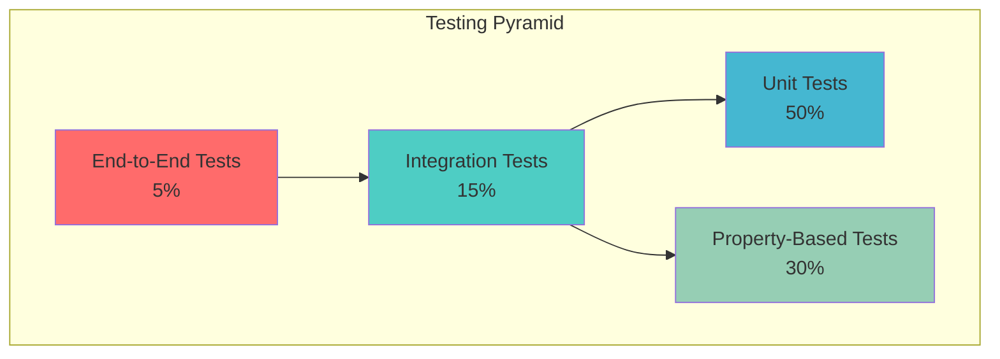

# Testing Strategy and Specification

## Overview

This document defines the comprehensive testing strategy for the AlexPose Gait Analysis System. The testing approach ensures system reliability, correctness, and performance through a multi-layered testing framework that validates all requirements from the specifications with minimal mocking and maximum real-world testing.

## Testing Philosophy

### Core Principles

1. **Real Data Testing**: Use actual video files, pose sequences, and gait data rather than mocks wherever possible
2. **Property-Based Validation**: Implement all correctness properties as executable tests using Hypothesis
3. **Systematic Issue Resolution**: Fix root causes of failures with simple, direct solutions
4. **Comprehensive Coverage**: Achieve minimum 80% code coverage with focus on critical paths
5. **Performance Validation**: Include performance benchmarks and regression testing
6. **Traceability**: Each test references specific requirements and design properties

### Testing Pyramid



## Test Categories and Execution Strategy

### Test Markers and Categories

```python
# Fast tests (< 1 second each)
@pytest.mark.fast

# Slow tests (1-30 seconds each)
@pytest.mark.slow

# Performance tests (30+ seconds)
@pytest.mark.performance

# Integration tests requiring external resources
@pytest.mark.integration

# Property-based tests with randomized inputs
@pytest.mark.property

# Tests requiring specific hardware (GPU, camera)
@pytest.mark.hardware
```

### Execution Commands

```bash
# Development workflow - fast tests only
pytest -v -m "not slow and not performance"

# Pre-commit - all tests except performance
pytest -v -m "not performance"

# CI/CD pipeline - all tests including slow
pytest -v -m "not performance" --cov=ambient --cov=server

# Performance benchmarking
pytest -v -m performance --benchmark-only

# Property-based testing with extended iterations
pytest -v -m property --hypothesis-profile=ci
```

## Test Structure and Organization

### Directory Structure

```
tests/
├── conftest.py                     # Global fixtures and configuration
├── pytest.ini                     # Pytest configuration
├── fixtures/
│   ├── real_data_fixtures.py      # Real video/gait data fixtures
│   ├── model_fixtures.py          # ML model mock fixtures
│   └── api_fixtures.py            # API testing fixtures
├── utils/
│   ├── test_helpers.py            # Test utility functions
│   ├── assertions.py              # Custom assertion helpers
│   └── data_generators.py        # Test data generation
├── ambient/                       # Mirror ambient package structure
│   ├── analysis/
│   │   ├── test_gait_analyzer.py
│   │   ├── test_feature_extractor.py
│   │   ├── test_temporal_analyzer.py
│   │   └── test_symmetry_analyzer.py
│   ├── classification/
│   │   ├── test_llm_classifier.py
│   │   └── test_prompt_manager.py
│   ├── core/
│   │   ├── test_frame.py
│   │   ├── test_data_models.py
│   │   ├── test_interfaces.py
│   │   └── test_configuration_manager.py
│   ├── gavd/
│   │   ├── test_pose_estimators.py
│   │   ├── test_gavd_processor.py
│   │   └── test_keypoints.py
│   ├── pose/
│   │   ├── test_factory.py
│   │   ├── test_yolov8_pose_estimator.py
│   │   ├── test_yolov11_pose_estimator.py
│   │   ├── test_alphapose_estimator.py
│   │   └── test_enhanced_estimators.py
│   ├── storage/
│   │   └── test_storage_manager.py
│   ├── utils/
│   │   ├── test_video_utils.py
│   │   ├── test_csv_parser.py
│   │   └── test_youtube_cache.py
│   └── video/
│       ├── test_processor.py
│       └── test_youtube_handler.py
├── server/
│   ├── test_main.py
│   ├── test_api_endpoints.py
│   ├── test_authentication.py
│   └── test_file_upload.py
├── property/                      # Property-based tests
│   ├── test_video_processing_properties.py
│   ├── test_pose_estimation_properties.py
│   ├── test_gait_analysis_properties.py
│   ├── test_classification_properties.py
│   ├── strategies.py              # Hypothesis strategies
│   └── generators.py              # Custom data generators
├── integration/                   # End-to-end integration tests
│   ├── test_video_pipeline.py
│   ├── test_gait_analysis_pipeline.py
│   ├── test_classification_pipeline.py
│   ├── test_api_endpoints.py
│   └── test_database_operations.py
└── performance/                   # Performance and load tests
    ├── test_video_processing_performance.py
    ├── test_concurrent_analysis.py
    ├── test_memory_usage.py
    └── test_api_load.py
```

## Property-Based Testing Specification

### Correctness Properties Implementation

Based on the design document, the following 18 correctness properties will be implemented as property-based tests:

#### Video Processing Properties

**Property 1: Video Format Validation**
```python
@given(
    file_extension=st.sampled_from(['mp4', 'avi', 'mov', 'webm', 'txt', 'jpg', 'pdf']),
    file_size=st.integers(min_value=1, max_value=1000000)
)
def test_video_format_validation_property(file_extension, file_size):
    """
    Feature: gavd-gait-analysis, Property 1: Video Format Validation
    For any file with a video extension, the system should accept valid formats
    **Validates: Requirements 1.1**
    """
```

**Property 2: Frame Extraction Consistency**
```python
@given(
    video_duration=st.floats(min_value=1.0, max_value=60.0),
    frame_rate=st.floats(min_value=1.0, max_value=60.0)
)
def test_frame_extraction_consistency_property(video_duration, frame_rate):
    """
    Feature: gavd-gait-analysis, Property 2: Frame Extraction Consistency
    For any video and frame rate configuration, extracted frames should match expected count
    **Validates: Requirements 1.2**
    """
```

#### Pose Estimation Properties

**Property 6: MediaPipe Landmark Count Consistency**
```python
@given(
    image_width=st.integers(min_value=100, max_value=1920),
    image_height=st.integers(min_value=100, max_value=1080)
)
def test_mediapipe_landmark_count_property(image_width, image_height):
    """
    Feature: gavd-gait-analysis, Property 6: MediaPipe Landmark Count Consistency
    For any valid input frame, MediaPipe should return exactly 33 pose landmarks
    **Validates: Requirements 2.1**
    """
```

#### Classification Properties

**Property 9: Binary Classification Completeness**
```python
@given(
    gait_features=gait_features_strategy(),
    confidence_threshold=st.floats(min_value=0.1, max_value=0.9)
)
def test_binary_classification_completeness_property(gait_features, confidence_threshold):
    """
    Feature: gavd-gait-analysis, Property 9: Binary Classification Completeness
    For any valid gait feature set, classification should return normal or abnormal
    **Validates: Requirements 4.1**
    """
```

### Hypothesis Configuration

```python
# pytest.ini configuration
[tool:pytest]
markers =
    slow: marks tests as slow (deselect with '-m "not slow"')
    performance: marks tests as performance tests
    property: marks tests as property-based tests
    integration: marks tests as integration tests
    hardware: marks tests requiring specific hardware

# Hypothesis profiles
hypothesis_profiles = {
    "dev": {
        "max_examples": 10,
        "deadline": 1000,
    },
    "ci": {
        "max_examples": 100,
        "deadline": 5000,
    },
    "thorough": {
        "max_examples": 1000,
        "deadline": 10000,
    }
}
```

## Test Data Management

### Real Data Fixtures

```python
@pytest.fixture(scope="session")
def sample_gait_videos():
    """Provide real gait video samples for testing."""
    return {
        "normal_walking": "data/test_videos/normal_walking_sample.mp4",
        "abnormal_gait": "data/test_videos/abnormal_gait_sample.mp4",
        "multiple_subjects": "data/test_videos/multiple_subjects.mp4"
    }

@pytest.fixture(scope="session")
def gavd_test_subset():
    """Provide curated GAVD dataset subset for consistent testing."""
    return load_gavd_test_data("data/test_datasets/gavd_subset.csv")

@pytest.fixture
def synthetic_pose_sequence():
    """Generate synthetic but realistic pose sequences."""
    return generate_realistic_pose_sequence(
        duration=5.0,
        frame_rate=30.0,
        gait_pattern="normal"
    )
```

### Test Data Generation Strategies

```python
# Custom Hypothesis strategies for domain objects
@composite
def frame_strategy(draw):
    """Generate realistic Frame objects."""
    width = draw(st.integers(min_value=100, max_value=1920))
    height = draw(st.integers(min_value=100, max_value=1080))
    frame_number = draw(st.integers(min_value=0, max_value=1000))
    
    return Frame(
        frame_id=f"frame_{frame_number}",
        width=width,
        height=height,
        frame_number=frame_number,
        data=np.random.randint(0, 255, (height, width, 3), dtype=np.uint8)
    )

@composite
def gait_features_strategy(draw):
    """Generate realistic gait feature sets."""
    return GaitFeatures(
        temporal_features={
            "stride_time": draw(st.floats(min_value=0.8, max_value=1.5)),
            "cadence": draw(st.floats(min_value=80, max_value=140)),
            "stance_phase": draw(st.floats(min_value=0.5, max_value=0.7))
        },
        spatial_features={
            "stride_length": draw(st.floats(min_value=1.0, max_value=2.0)),
            "step_width": draw(st.floats(min_value=0.1, max_value=0.3))
        },
        symmetry_features={
            "left_right_symmetry": draw(st.floats(min_value=0.7, max_value=1.0))
        }
    )
```

## Integration Testing Strategy

### End-to-End Pipeline Tests

```python
class TestVideoAnalysisPipeline:
    """Test complete video analysis workflow."""
    
    @pytest.mark.integration
    @pytest.mark.slow
    def test_complete_video_analysis_workflow(self, sample_gait_videos):
        """Test end-to-end video analysis from upload to classification."""
        # 1. Video upload and validation
        # 2. Frame extraction
        # 3. Pose estimation
        # 4. Gait analysis
        # 5. Classification
        # 6. Result storage and retrieval
        
    @pytest.mark.integration
    def test_youtube_video_processing_pipeline(self):
        """Test YouTube URL processing pipeline."""
        # 1. YouTube URL validation
        # 2. Video download
        # 3. Processing pipeline
        # 4. Cache management
```

### API Integration Tests

```python
class TestAPIEndpoints:
    """Test FastAPI endpoints with real requests."""
    
    @pytest.mark.integration
    def test_video_upload_endpoint(self, client, sample_video_file):
        """Test video upload API endpoint."""
        
    @pytest.mark.integration
    def test_analysis_status_endpoint(self, client):
        """Test analysis status tracking."""
        
    @pytest.mark.integration
    def test_results_retrieval_endpoint(self, client):
        """Test results retrieval in multiple formats."""
```

## Performance Testing Specification

### Performance Benchmarks

```python
class TestPerformanceBenchmarks:
    """Performance benchmarks and regression tests."""
    
    @pytest.mark.performance
    def test_video_processing_performance(self, benchmark):
        """Benchmark video processing performance."""
        # Target: Process 30-second video in < 60 seconds
        
    @pytest.mark.performance
    def test_concurrent_analysis_performance(self):
        """Test system performance under concurrent load."""
        # Target: Handle 5 concurrent analyses without degradation
        
    @pytest.mark.performance
    def test_memory_usage_limits(self):
        """Test memory usage stays within limits."""
        # Target: < 2GB memory usage for standard workflows
```

### Load Testing

```python
class TestAPILoad:
    """API load testing and stress testing."""
    
    @pytest.mark.performance
    def test_api_response_times(self):
        """Test API response times under load."""
        # Target: < 200ms response time for status endpoints
        
    @pytest.mark.performance
    def test_concurrent_uploads(self):
        """Test concurrent file upload handling."""
        # Target: Handle 10 concurrent uploads
```

## Coverage Requirements and Quality Gates

### Coverage Targets

| Component | Minimum Coverage | Target Coverage |
|-----------|------------------|-----------------|
| Core (Frame, Config, Interfaces) | 90% | 95% |
| Domain (Pose, Gait, Classification) | 85% | 90% |
| Integration (API, Video, Storage) | 75% | 85% |
| Overall System | 80% | 85% |

### Quality Gates

```python
# Coverage configuration in pytest.ini
[coverage:run]
source = ambient, server
omit = 
    */tests/*
    */venv/*
    */__pycache__/*
    */migrations/*

[coverage:report]
precision = 2
show_missing = True
skip_covered = False

[coverage:html]
directory = htmlcov

# Fail if coverage below threshold
fail_under = 80
```

### Test Quality Metrics

1. **Property Test Iterations**: Minimum 100 iterations per property test
2. **Test Execution Time**: 
   - Fast tests: < 1 second each
   - Slow tests: < 30 seconds each
   - Performance tests: < 5 minutes each
3. **Test Reliability**: 99.9% pass rate in CI/CD
4. **Real Data Usage**: > 70% of tests use real data vs mocks

## Continuous Integration Configuration

### GitHub Actions Workflow

```yaml
name: Comprehensive Testing

on: [push, pull_request]

jobs:
  test:
    runs-on: ubuntu-latest
    strategy:
      matrix:
        python-version: [3.11, 3.12]
    
    steps:
    - uses: actions/checkout@v4
    - name: Set up Python
      uses: actions/setup-python@v4
      with:
        python-version: ${{ matrix.python-version }}
    
    - name: Install dependencies
      run: |
        pip install uv
        uv sync
    
    - name: Run fast tests
      run: |
        uv run pytest -v -m "not slow and not performance" --cov=ambient --cov=server
    
    - name: Run slow tests
      run: |
        uv run pytest -v -m slow --cov=ambient --cov=server --cov-append
    
    - name: Upload coverage
      uses: codecov/codecov-action@v3
```

## Error Handling and Debugging Strategy

### Test Failure Analysis

1. **Systematic Root Cause Analysis**: Each test failure triggers investigation of underlying cause
2. **Simple Direct Fixes**: Prefer simple, direct solutions over complex workarounds
3. **Regression Prevention**: Add regression tests for all fixed issues
4. **Documentation**: Document common failure patterns and solutions

### Debugging Tools

```python
# Custom test utilities for debugging
class TestDebugger:
    @staticmethod
    def capture_test_artifacts(test_name, artifacts):
        """Capture test artifacts for debugging failures."""
        
    @staticmethod
    def analyze_property_test_failure(failure_example):
        """Analyze property test failures with detailed reporting."""
        
    @staticmethod
    def generate_minimal_reproduction(test_case):
        """Generate minimal test case for reproducing failures."""
```

## Test Maintenance and Evolution

### Test Review Process

1. **Code Review**: All test code reviewed for quality and coverage
2. **Property Validation**: Ensure property tests validate actual requirements
3. **Performance Monitoring**: Track test execution times and optimize slow tests
4. **Coverage Analysis**: Regular review of coverage gaps and improvement opportunities

### Test Evolution Strategy

1. **Requirement Changes**: Update tests when requirements change
2. **New Features**: Add comprehensive tests for new functionality
3. **Performance Regression**: Add performance tests for critical paths
4. **Bug Fixes**: Add regression tests for all bug fixes

This comprehensive testing strategy ensures the AlexPose Gait Analysis System meets all quality requirements while maintaining high reliability, performance, and correctness across all components and workflows.