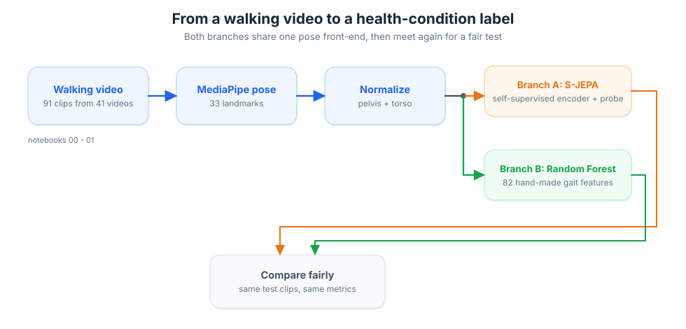
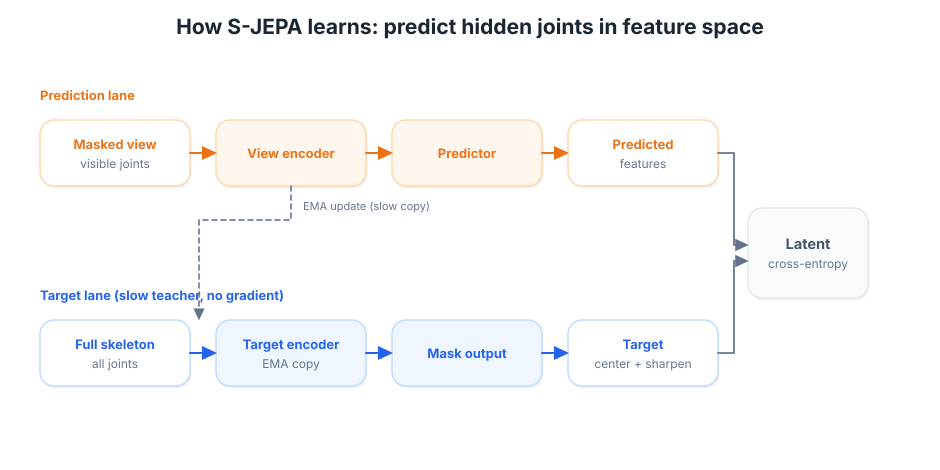
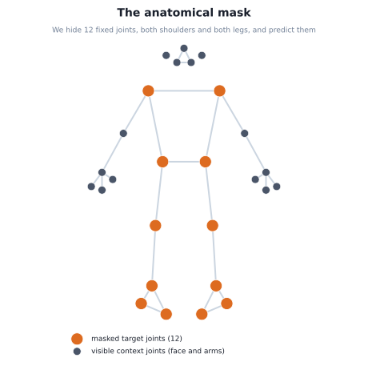
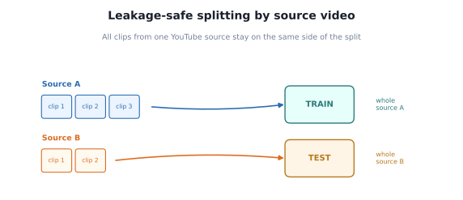
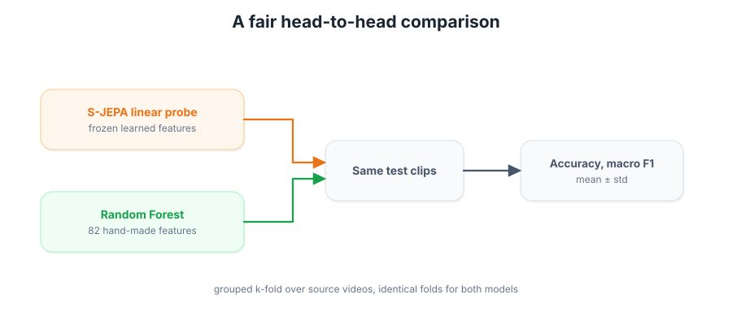

# S-JEPA for gait: normal, MS, and Parkinson's

A progressive, hands-on tutorial series that teaches **S-JEPA** (Skeleton Joint Embedding
Predictive Architecture) and uses it to tell apart three walking patterns from short videos:

- **normal** gait
- **ms**: gait affected by multiple sclerosis
- **pd**: gait affected by Parkinson's disease

You start from raw videos, turn them into skeletons, train a small self-supervised model that
learns what motion looks like without any labels, fine-tune it across the three conditions, and
finish by comparing it head to head against a classical Random Forest on the exact same videos.

Everything runs on a laptop in minutes, or in Google Colab by clicking a badge. The heavy lifting
reuses the existing `alexpose` pose pipeline, so the new code here is small and easy to read.

---

## What you will build

| Notebook | What it teaches |
|---|---|
| `00_overview_and_video_gallery.ipynb` | The problem, the data, and inline video of each condition |
| `01_pose_extraction_from_raw_video.ipynb` | Turn videos into `(T, 33, 3)` skeleton sequences with MediaPipe |
| `02_anatomical_mask_and_tokenization.ipynb` | How skeletons become tokens, and the fixed clinical mask |
| `03_sjepa_model_and_pretrain_normal.ipynb` | Build S-JEPA and pretrain it on normal gait |
| `04_progressive_finetune_ms_pd_vicreg.ipynb` | Add ms and pd, add VICReg to separate the classes |
| `05_representation_visualization.ipynb` | See the learned features with t-SNE and UMAP |
| `06_capstone_rf_vs_sjepa.ipynb` | Random Forest vs S-JEPA on identical, leakage-safe splits |

The reusable model, data, and training code lives in the `sjepa/` package so the notebooks stay
short and there is a single source of truth.

---

## The idea in one picture



S-JEPA learns by hiding part of a skeleton and predicting the hidden part **in feature space**,
not in raw coordinates. A slow moving teacher provides the answers, which is what keeps the model
from cheating by collapsing every skeleton to the same features.



---

## Two choices that make this project different from the paper

**1. No motion-aware masking.** The original S-JEPA hides whichever joints move the most. For a
clinical gait study that is the wrong instinct, because the telling sign is often *less* motion
(short steps, stiff knees, reduced arm swing). So we hide a **fixed set of twelve neurologically
relevant joints**, both shoulders and both complete legs, taken from
`mapping-data/ms-pd-mapping.md`. No other joints are ever masked.



**2. VICReg is added, not original.** The paper prevents collapse with the slow teacher plus
centering and sharpening. We add VICReg on top during fine-tuning to push the three condition
clusters apart. We label it clearly as an extension throughout.

---

## Run it locally with `uv`

From the repository root:

```bash
cd experiments/multiple-sclerosis
uv sync                      # installs torch, mediapipe, scikit-learn, umap-learn, ...
uv run jupyter lab           # or open the notebooks in VS Code
```

This project is pinned to Python 3.12 because the UMAP/Numba stack does not yet
support Python 3.14. `uv` will download Python 3.12 automatically if it is not
already installed.

The notebooks read settings from the repository root `.env` (copy `.env.example` to `.env` if you
have not already). The one setting that matters here is the model size profile:

```dotenv
# experiments/multiple-sclerosis uses these
SJEPA_PROFILE=laptop   # "laptop" (fast, default) or "gpu" (larger, needs a real GPU)
SJEPA_SMOKE=0          # set to 1 for a near-instant test run of every notebook
```

The pose keypoints for all 49 videos are already cached under `artifacts/keypoints/`, so notebooks
02 through 06 open instantly. Notebook 01 shows you how that cache was made and will rebuild it if
you delete it.

### The two model profiles

| Profile | Encoder | Window | Meant for |
|---|---|---|---|
| `laptop` (default) | 3 layers, width 96 | 32 frames | CPU, Apple MPS, or a free Colab T4. Trains in minutes. |
| `gpu` | 8 layers, width 256 | 64 frames | A real GPU. Closer to the paper, stronger features. |

Both profiles are exercised by the test suite, so both are known to build and train correctly.
Switch profiles by editing `SJEPA_PROFILE` in `.env`; nothing else changes.

---

## Run it in Google Colab

Click the **Open in Colab** badge at the top of any notebook. The first cells:

1. install any missing light dependencies (and torch, only if it is not already there, so Colab's
   GPU torch is never downgraded),
2. clone the repository and put `sjepa` and `ambient` on the path,
3. read the profile from the environment.

Edit the `REPO` line in the bootstrap cell to point at your fork before running in Colab.

---

## How the comparison stays fair

The dataset is small (49 clips, and some clips are pieces of the same source video). Two safeguards
keep the results honest:

- **Split by source, not by clip.** All clips from one YouTube source stay on the same side of a
  split, so no walk is half in training and half in testing.

  

- **Grouped k-fold, mean and standard deviation.** A single split of a few dozen videos is too
  noisy to trust, so the capstone reports cross-validated scores for both models on identical
  folds.

  

We do not claim S-JEPA beats the Random Forest on this little data. On a few dozen fully labeled
videos a classical baseline with clinical features is strong, and that is what we see. S-JEPA's
advantage is label efficiency and transfer, which the capstone probes with a small
labels-versus-accuracy sweep. The honest path to a stronger result is more data and the `gpu`
profile, not a bigger claim.

---

## Repository layout

```
experiments/multiple-sclerosis/
  README.md                  <- you are here
  pyproject.toml             <- uv project, adds torch and umap-learn, reuses ambient
  sjepa/                     <- the shared package (model, data, losses, viz, eval)
    config.py  data.py  masking.py  tokenizer.py  models.py
    losses.py  augment.py  train.py  eval.py  viz.py  classical.py
    tests/test_smoke.py      <- builds and trains both profiles, checks no collapse
  images/                    <- eight clean SVG diagrams used across the notebooks
  slides/                    <- a slide deck summarizing the whole study
  video-data/                <- the 49 walking clips (normal, ms, pd) + manifest.csv
  mapping-data/              <- ms-pd-mapping.md, the source of the masked-joint list
  artifacts/                 <- cached keypoints and (after you run) checkpoints and results
  00..06_*.ipynb             <- the seven tutorial notebooks
```

---

## Quick sanity test

To confirm your environment is set up correctly, run the smoke tests. They build the model at both
profiles, train for a couple of steps, and check that nothing collapses:

```bash
cd experiments/multiple-sclerosis
SJEPA_SMOKE=1 uv run python sjepa/tests/test_smoke.py
```

You should see `ALL SMOKE TESTS PASSED`.

---

## Credits and sources

- S-JEPA: Abdelfattah and Alahi, *S-JEPA: A Joint Embedding Predictive Architecture for Skeletal
  Action Recognition*, ECCV 2024. Project page: https://sjepa.github.io
- MAMP (the masking and tokenization lineage): Mao et al., *Masked Motion Predictors are Strong 3D
  Action Representation Learners*, ICCV 2023.
- VICReg: Bardes, Ponce, and LeCun, *VICReg: Variance-Invariance-Covariance Regularization*, 2022.
- Pose estimation and the classical gait features come from the `alexpose` `ambient` package and
  mirror the methodology in `experiments/exp5`.
