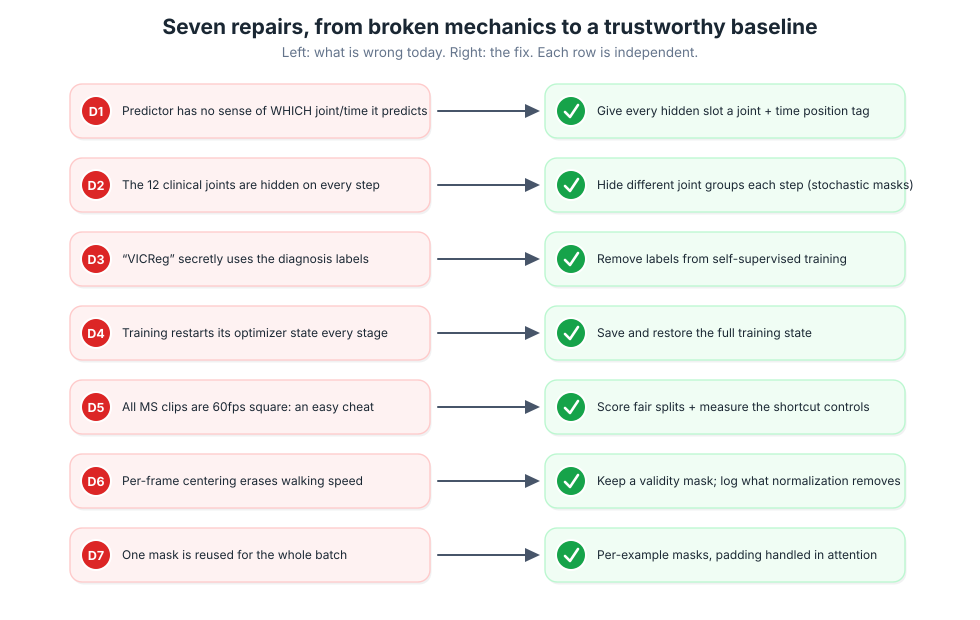
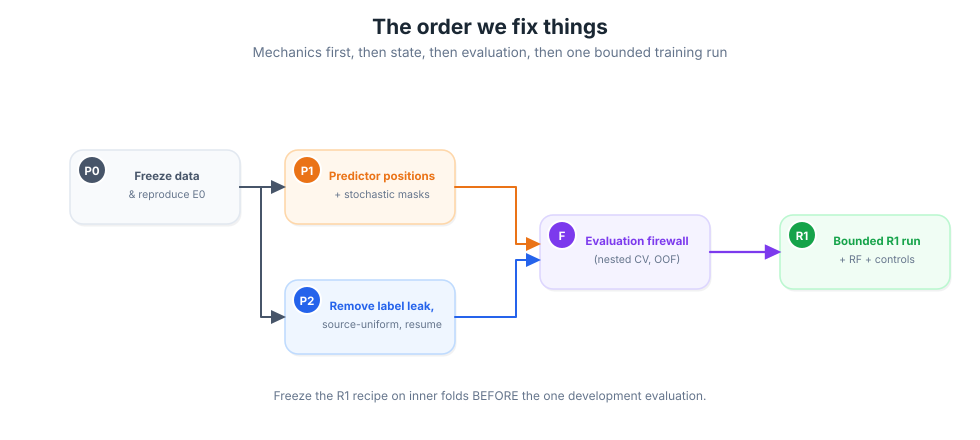
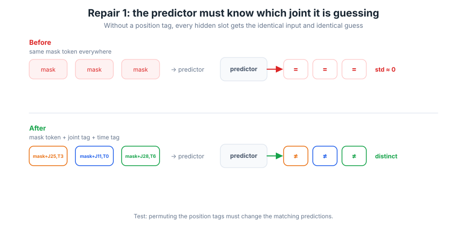
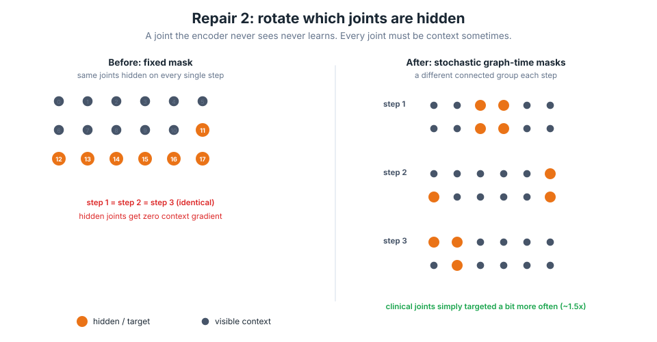
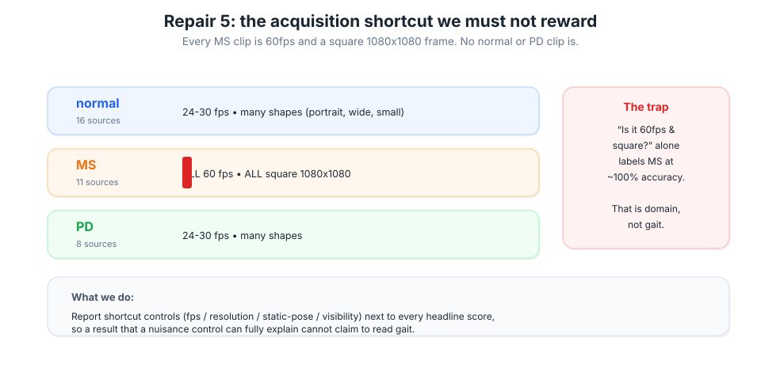
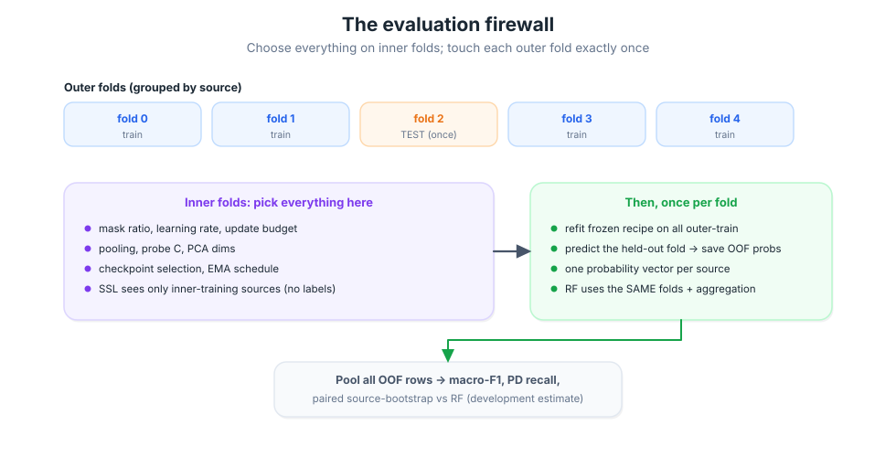
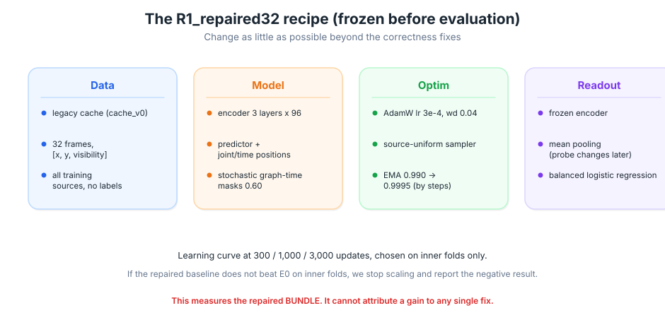

# What we are fixing, and how — S-JEPA gait pipeline

_Plan written 2026-08-03. Companion to [`02-0802-NEXT_STEPS.md`](02-0802-NEXT_STEPS.md) (the governing scientific plan) and [`03-0802-PHASE_LEDGER.md`](03-0802-PHASE_LEDGER.md) (the live working ledger)._

> **Filename note.** The `docs/` convention is `NN-MMDD-<NAME>`. Index `03` is already
> taken by the phase ledger, so this fixes plan is `04-0803-FIXES.md` even though the
> request said "03". Same document, next free index.

This document explains, in plain language and with pictures, the problems we found in the
current S-JEPA code and exactly how we plan to fix them. It is written so that a reader who is
new to the project can follow along, and it is precise enough to act as the implementation
checklist. Everything below was verified by reading the code and running small probes on the real
cached data. Nothing here is guesswork.

A word on honesty up front. This dataset has already been looked at closely (its fold scores,
confusion patterns, and shortcut probes shaped the plan). Because of that, **every number we get
on this data is a development estimate, not a final verdict.** We fix the machinery so the numbers
mean something, but a truly clean test would need a brand-new group of people we have never seen.

---

## 1. The short version

We found seven concrete problems. Some are outright bugs in the learning machinery, some are
data traps that let the model cheat, and one is about how training state is saved. The picture
below pairs each problem with its fix. Every row is independent, so we can verify each one on its
own.

The order we fix them in matters, because later fixes depend on earlier ones. We repair the
core mechanics first, then the training state, then the way we measure results, and only then do
we run a single, carefully bounded training experiment called **R1**.

---

## 2. The problems, one at a time

### D1. The predictor does not know *which* joint it is guessing

**What S-JEPA is supposed to do.** Hide some joints, then ask a small network called the
*predictor* to guess the hidden joints' features. To guess the left ankle at time 3, the
predictor needs to be *told* "you are now predicting the left ankle at time 3."

**What the code does instead.** Every hidden slot is filled with the exact same blank
placeholder (a shared "mask token"), and the predictor adds no information about position. A
transformer treats identical inputs identically, so **every hidden guess comes out the same**. We
measured the spread across hidden predictions and it is essentially zero. The model literally
cannot make a different guess for a left ankle than for a right shoulder.

**The fix.** Give each hidden slot a tag: the mask token *plus* a learned "which joint" tag and a
learned "which time" tag. Now the predictor can produce a different answer per position. We prove
it works with a test: if we shuffle the position tags, the matching predictions must change.

### D2. The same twelve joints are hidden on every single step

**What the code does.** It always hides the same twelve clinically interesting joints (both
shoulders, both legs) and never lets the encoder see them. But the final classifier then pools
exactly those hidden joints. So the encoder is asked to summarize joints it was never allowed to
look at, and their internal "position" settings never receive any learning signal. We confirmed
those settings stay frozen at their starting values.

**The fix.** Rotate which joints are hidden. Each training step hides a different connected group
of joints across a stretch of time, so every joint is sometimes hidden (a target) and sometimes
visible (context). We still lean on clinical knowledge, but gently: the leg and shoulder joints
are simply chosen as targets a bit more often, not hidden forever.

### D3. "VICReg" was quietly using the diagnosis labels

The code advertised a self-supervised stage (learning with no labels), but a helper called
class-aware VICReg was subtracting each class's average using the true normal/MS/PD labels. That
is not self-supervised, and worse, the math it used rewards *spreading out within a class* rather
than tightening it, which is the opposite of what the notebook text claimed. **The fix:** remove
the label-using loss from the self-supervised stage entirely. If we want to use labels, we will
call that stage "supervised adaptation" and keep it clearly separate.

### D4. Training forgets its progress between stages

Each time training is called (for example, moving from "normal only" to "all conditions"), it
throws away its optimizer, its learning-rate schedule, its step counter, and the running average
the loss depends on. So what looked like continuous staged training was really a restart. **The
fix:** save and restore the complete training state, and add a test that an interrupted-then-
resumed run matches an uninterrupted one.

### D5. Every MS clip is filmed the same way (an easy cheat)

This is the most important data problem. We checked every video with `ffprobe`:

- **All eleven MS sources are 60 frames per second and a square 1080×1080 frame.**
- **No** normal or PD clip is 60fps, and none is square.

That means a lazy model can score MS almost perfectly just by noticing "60fps and square," which
has nothing to do with how someone walks. On top of that, the frame sampler mislabels 24fps and
25fps clips as 15fps, so cadence gets distorted differently for different classes.

**The fix (for this session).** We cannot re-film the videos, and re-extracting with exact
timestamps is a bigger job we are deferring. What we *can* and *will* do now is **measure the
cheat**: alongside every headline score we report simple "shortcut controls" (can you classify
from frame rate alone? from resolution? from a single frozen pose? from the detector's confidence
channel?). If a shortcut control explains the whole score, the result cannot claim to read gait.

> **Sobering fact from the audit.** On the exact same folds, a classifier using **only the
> detector's confidence channel** scores macro-F1 **0.67**, and one using **only the average and
> spread of joint positions** scores **0.69** — both *above* the current S-JEPA number (0.57). In
> other words, today's learned model does no better than cheap nuisance signals. That is precisely
> why we fix the machinery before trusting any score.

### D6. Normalization erases walking speed; gaps and padding are mishandled

The current normalization re-centers every frame on the hips, which removes forward progress, so
walking speed disappears (we measured a raw pelvis drift of 693 pixels collapse to essentially
zero after normalization). It also occasionally divides by a near-zero torso length, blowing some
coordinates up to 38× normal scale. It fills in missing joints across arbitrarily long gaps (not
just short ones) and pads short clips by repeating the last frame with no marker to say "this is
padding, ignore it." **The fix (for this session):** keep a validity mask so padding and long
gaps are not mistaken for real motion, clamp the torso-scale ratio, and clearly log what
normalization removes. Rebuilding the cache with speed-preserving normalization is a follow-up.

There is also an **identity caveat** that turned out worse than expected. A "source" is a YouTube
id, but the original filenames show a single source can contain **up to five different patients**,
and the MS clips look like repeated test sessions of the same person across several sources. So we
cannot honestly call our splits "participant-disjoint." Every result in this project is labeled
**provisional source-grouped**, and building a true per-participant registry is explicit future
work, not something this pass claims to have solved.

### D7. One mask is reused for the whole batch

The mask is a single pattern applied to every clip in a batch, rather than a fresh per-clip mask.
Combined with D2, this means very little variety. **The fix:** per-example masks with proper
handling of variable-length visible context in the attention step.

---

## 3. How we will know a fix actually worked (the tests)

We do not trust "the loss went down" as evidence, because a collapsed or cheating model can also
make the loss go down. Instead each repair ships with a sharp test that fails *before* the fix and
passes *after*:

| Repair | The test that guards it |
|---|---|
| D1 predictor positions | Hidden guesses vary across positions; shuffling position tags changes the matching guesses |
| D2 rotate the mask | Over many masks, every joint is visible sometimes and targeted sometimes; every joint's position setting receives a learning signal |
| D3 no label leak | The self-supervised loss is byte-for-byte identical if we scramble the labels |
| D4 save/resume | An interrupted-then-resumed run reproduces an uninterrupted run within a tiny tolerance |
| D6 padding/validity | Padded frames are excluded from attention and from pooling |
| D7 per-example masks | Masks differ across clips in a batch and shapes stay correct |

We also log health checks that a collapsed model would fail: how spread out the features are, how
much the slow teacher is actually moving, and whether the features have real rank (not all
pointing the same way).

---

## 4. Measuring results without fooling ourselves

Once the machinery is trustworthy, the way we score it has to be airtight. The rule is simple:
**choose every setting on inner folds, and touch each outer test fold exactly once.** Nothing
about the held-out fold, not its labels, not a pretty cluster plot, is allowed to influence any
choice.

Concretely:

1. Group the data by source video, never by clip, so pieces of one walk never land on both sides.
2. Inside the training portion, use inner folds to pick the mask ratio, learning rate, training
   length, pooling, and probe strength. The self-supervised stage sees only inner-training
   sources, with labels hidden.
3. Freeze that recipe, refit it on all outer-training sources, and predict the held-out fold once.
   Save one probability vector per source.
4. The Random Forest baseline runs on the **exact same folds and the same aggregation**, so the
   comparison is apples to apples.
5. Pool all the held-out predictions and report macro-F1 (the headline), ordinary accuracy, PD
   recall specifically, confusion matrices, and a paired bootstrap over sources versus the Random
   Forest.

Because the data was already inspected, we call this a **development estimate**. We will not use
the words "significant" or "confirmed" for any result on this collection.

---

## 5. The one training run we will do: R1

R1 is deliberately modest. It keeps the small model and simple readout and changes as little as
possible beyond the correctness fixes, so that if the score moves we know it came from repairing
the machinery rather than from a bigger model.

We run it on the existing cached skeletons (kept read-only and unchanged), trace a short learning
curve at 300 / 1,000 / 3,000 optimizer updates chosen on inner folds, then freeze the recipe and
do the single development evaluation described above. If the repaired baseline does not beat the
current one on inner folds, that is a real and useful finding: it tells us the next bottleneck is
the data pipeline and outside pretraining, not a bigger network, and we will report that plainly
instead of chasing the score.

---

## 6. How we execute this, step by step

We work in dependency order so no step is built on an unrepaired one.

1. **Freeze provenance (P0).** Hash the cache and manifest, lock the source-grouped fold registry,
   rerun the Random Forest and the shortcut controls on that registry, and save the current
   out-of-fold predictions so the old result is exactly reproducible.
2. **Repair the mechanics (P1).** Add predictor joint/time positions and per-example stochastic
   masks, with their tests. This is where D1, D2, and D7 land.
3. **Repair state and objectives (P2).** Remove the label leak, make the self-supervised stage use
   all training sources uniformly, express schedules in optimizer steps, and make save/resume
   restore the full training state. This is where D3 and D4 land.
4. **Build the evaluation firewall (F).** Locked inner/outer folds, out-of-fold probability
   storage, per-source aggregation, paired bootstrap, and run manifests with hashes.
5. **Run bounded R1 (R1).** One fold and one seed on the real cache, frozen recipe, saved
   predictions and manifest.
6. **Independent review.** An external adversarial reviewer (Codex) checks the plan first, then
   the mechanics, then the data and evaluation, then the results. Findings are logged and fixed
   until none are blocking.
7. **Notebooks and write-up.** Update the durable notebook source so the tutorials match the
   repaired method, regenerate the notebooks, smoke-test them, and write the final report that
   separates what was implemented, what was executed, what is supported, and what is still pending.

Each numbered step has a gate: we do not move on until its tests pass. Data caches are treated as
read-only inputs, the user's existing documents and diagrams are preserved untouched, and nothing
is committed or pushed without explicit approval.

---

## 7. What we are deliberately **not** doing yet

To keep this focused and honest, several tempting directions are out of scope for this pass and
are recorded as follow-ups: re-extracting the skeletons with exact-timestamp sampling and
speed-preserving normalization; the larger GPU-sized model; external clinical-motion pretraining
(such as CARE-PD); fusing S-JEPA with the Random Forest; and any RGB video model. These only make
sense after the small model is provably correct and the data traps are controlled.

---

_Diagrams in this document live in [`../images/`](../images) and are generated by
`scripts/scripts_make_fixes_diagrams.py`, which reuses the shared clean-SVG design system so the
whole image set stays visually consistent._
