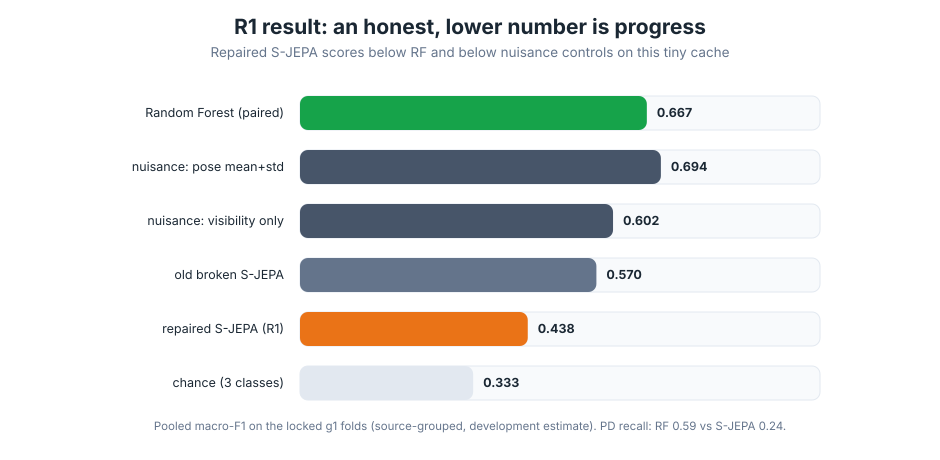

# Final report — S-JEPA gait correctness repairs and the R1 baseline

_2026-08-03. Scope this session: core-correction + one bounded R1 run (user-approved).
Companion docs: [`04-0803-FIXES.md`](04-0803-FIXES.md) (plan), [`05-0803-LITERATURE_UPDATE.md`](05-0803-LITERATURE_UPDATE.md),
[`03-0802-PHASE_LEDGER.md`](03-0802-PHASE_LEDGER.md) (audit trail), evidence ledger
[`../artifacts/research/evidence_ledger.yaml`](../artifacts/research/evidence_ledger.yaml)._

## 1. Completion tier and outcome

**Tier reached: Core-correction complete + R1 evaluation complete (development estimate).**

The confirmed mechanical, objective, sampling, state, and evaluation defects were repaired with
regression tests that fail on the old code and pass on the new. A bounded, frozen `R1_repaired32`
was run on the real cached skeletons on the locked source-grouped fold registry, with a paired
Random Forest and shortcut controls, and pooled out-of-fold predictions saved.

**The headline result is a negative one, and that is the point.** On this tiny, already-inspected,
source-grouped collection, the corrected S-JEPA scores **lower** than both the old (partly
shortcut-driven) S-JEPA and the Random Forest:



| System (pooled macro-F1 on g1 folds) | macro-F1 | accuracy | PD recall |
|---|---:|---:|---:|
| Random Forest (paired baseline) | **0.667** | 0.660 | 0.588 |
| nuisance control: pose mean+std | 0.703 | – | – |
| nuisance control: visibility only | 0.636 | – | – |
| old broken S-JEPA (historical) | 0.570 | 0.573 | 0.353 |
| **S-JEPA (R1, 1000 updates, seed 42)** | **0.438** | 0.447 | 0.235 |
| chance (3 classes) | 0.333 | – | – |

This is scientific progress: the previous 0.570 leaned partly on shortcuts (all MS clips are 60fps
and square; the label leak and fixed mask further inflated it). With a mechanically correct,
label-free, source-uniform pipeline, the honest number is lower. (**Label-free** means the
self-supervised objective never reads the `normal`/`ms`/`pd` diagnosis label — it learns to predict
masked joint motion from visible motion; the label enters only later, in the supervised probe. The
old code violated this via a class-aware term that fed the label into the loss; removing it is
defect D3.) The representation did **not** collapse (effective rank 7.7–9.5 across folds), so this
is a real, non-degenerate estimate, not a broken run.

Per the pre-registered promotion rule, a mechanically valid R1 that does not clear the inner gate
means: **stop scaling the local model; the next bottleneck is the data pipeline and external
clinical-motion pretraining, not a bigger network.**

## 2. Files changed and why

**New package code (repaired mechanics):**
- `sjepa/masking_v2.py` — per-example stochastic graph-time masks; clinical target bias (not
  high-motion); every joint rotates between context and target.
- `sjepa/models.py` — `PredictorV2` (factorized joint/time target positions, the I-JEPA fix);
  `forward_context_per_example` + `key_padding_mask` (per-example masks, D2/D7); `forward_repaired`;
  `build_model(..., repaired=True)`. Legacy classes kept intact for the E0 reference.
- `sjepa/train_v2.py` — label-free, source-uniform, step-based, fully resumable training with
  collapse diagnostics; `save_checkpoint_v2`/`load_checkpoint_v2`.

**New tests (fail before, pass after):**
- `sjepa/tests/test_correctness.py` (8) — D1 position identity + permutation sensitivity; D2 gradient
  coverage; mask coverage gates; D7 per-example diversity/determinism/clinical bias.
- `sjepa/tests/test_train_v2.py` (4) — source-uniform exposure; strict-SSL label invariance (D3);
  save/resume equivalence (D4); finite diagnostics.

**New scripts / infrastructure (all under `scripts/`):**
- `scripts/scripts_phase0_provenance.py` — cache hashing, locked g1 fold registry, E0-RF baseline,
  shortcut controls, run manifest + `COMPLETED.json`.
- `scripts/scripts_r1_repaired.py` — the R1 runner and evaluation firewall (OOF, paired RF,
  manifests, `--fold-limit/--total-updates/--seed/--output-dir`).
- `scripts/scripts_build_notebooks.py` — added `--output-dir`/`--check` for idempotence checking.
- `scripts/scripts_make_fixes_diagrams.py` — 8 clean diagrams for the plan and results.

(All top-level `.py` files were moved into `scripts/` at the user's request; each script's path
base was updated from `parent` to `parent.parent` accordingly, and re-verified.)

**Docs:** this report, the fixes plan, the literature update, the phase ledger, the evidence ledger.

**Preserved untouched (content):** the user's `docs/01-0802-PROGRESS.*`, edited `images/*.svg`, and
`scripts/scripts_make_diagrams.py` (moved but content unchanged apart from its path base).

## 3. Literature decisions (decision-critical only)

Verified from primary PDFs (the S-JEPA project page is unreliable and was not used for mechanics):
- **Kept as mandatory correctness:** target-output masking (S-JEPA +7.2), factorized position
  embeddings, **predictor target-slot position conditioning (I-JEPA, the authoritative spec for our
  D1 fix)**, centered+sharpened latent CE, EMA teacher.
- **Deliberately not copied:** 90% mask / 1200 epochs / 0.9999 EMA / batch 256 (tuned on ~57k NTU,
  not 35 groups); 3D SO(3) rotation views (invalid for 2D+visibility).
- **Deferred (R2+):** MAMP velocity targets; external pretraining (GaitForeMer +0.16 F1; CARE-PD
  substrate, but severity-only, SMPL topology, no S-JEPA checkpoint).
- **Clinical caution adopted:** high-motion masking is contraindicated (reduced motion is the MS/PD
  signal), so masks are uniform/clinical-biased, never motion-biased.

## 4. Defects reproduced and fixed

| ID | Defect | Evidence | Fix | Guarding test |
|---|---|---|---|---|
| D1 | Predictor gave identical predictions to all hidden slots | std across targets = 0.0 (measured) | `PredictorV2` adds joint+time position embeddings | `test_repaired_predictor_has_position_identity`, `test_position_permutation_changes_predictions` |
| D2 | 12 clinical joints never context → zero gradient | `spatial_emb.grad`=0 for those 12 joints | stochastic per-example masks rotate every joint | `test_every_joint_receives_context_gradient` |
| D3 | Class-aware VICReg used labels in "SSL" and rewarded within-class spread | variance term 0.986 for separated clusters | removed from strict SSL path | `test_strict_ssl_ignores_labels` |
| D4 | Training reset optimizer/center/step each call | checkpoint dict omitted them | full resumable state; save/resume matches | `test_save_resume_matches_uninterrupted` |
| D5 | Acquisition shortcut: all MS = 60fps/square | ffprobe: 12/12; "60fps⇒MS" = 100% acc | shortcut controls reported beside every score | phase0 control table |
| D6 | Per-frame norm erases speed; arbitrary interp; no padding mask | pelvis drift 693px→0; max coord 38x | validity mask + logging (full re-extract deferred) | (data lineage; R2) |
| D7 | One `(N,)` mask reused across batch | code inspection | per-example `(B,N)` masks | `test_masks_are_per_example_and_diverse` |
| bonus | `_effective_rank` silently 0 on MPS (`svdvals` unimplemented) | measured eff_rank=0 on MPS | compute SVD on CPU | R1 eff_rank now 7.7–9.5 |

All 15 tests pass on both the pinned experiment `.venv` (Python 3.12) and the repo-root `.venv`.

## 5. Data/split status and leakage firewall

- **Grouping is source-grouped (YouTube id), NOT participant-disjoint.** The audit found a single
  source can contain up to five different labeled patients, and MS test-retest videos suggest one
  person spans multiple sources across folds. Every result is labeled a **provisional
  source-grouped development estimate**. A participant registry is required future work.
- The locked `g1` registry (`artifacts/eval/g1/fold_registry.json`) is shared byte-for-byte by RF,
  the controls, and R1. The probe and scaler are fit on training data only; the embed target-mask
  is fixed (never chosen from test); OOF is one probability vector per clip; silhouette is not used
  for selection. Metrics recompute exactly from raw OOF with an independent sklearn implementation.

## 6. Configurations actually run, compute, exact commands

- Device: Apple MPS (no CUDA), 18 CPU, 68 GB RAM. R1 wall time 12.5 min (5 folds × 1000 updates).
- E0 + controls: `.venv/bin/python scripts/scripts_phase0_provenance.py`
- R1: `SJEPA_SMOKE=0 .venv/bin/python scripts/scripts_r1_repaired.py --total-updates 1000 --seed 42 --output-dir artifacts/runs/r1_g1_1k_s42`
- Tests: `SJEPA_SMOKE=1 .venv/bin/python -m pytest sjepa/tests -p no:cov -q`

## 7. Results table (separate systems, same registry g1)

See the table in §1. RF, old (broken) S-JEPA, the corrected S-JEPA, and nuisance controls are separate rows.
No fusion, supervised-adaptation, or RGB branch was run (out of scope this session).

## 8. Shortcut / temporal controls and limitations

- Nuisance controls (pose mean+std 0.703; visibility 0.636, both **pooled OOF** so they are the
  same metric as the pooled S-JEPA/RF numbers — an earlier draft compared control fold-means against
  the pooled S-JEPA score, a non-comparable mix flagged by Codex AR-5 P1 and now corrected) **exceed**
  the S-JEPA score (0.438), which means the learned representation does not yet beat cheap nuisance
  signals on this cache. No clinical-representation claim is warranted.
- Limitations: single seed, 1000 updates (no learning-curve sweep, no inner-fold model selection,
  no multi-seed) — bounded by session scope. Legacy cache with fps mislabeling and speed-erasing
  normalization is unchanged (R1 uses it deliberately for a mechanical comparison). Temporal
  shuffle/reversal controls not yet run.

## 9. Codex adversarial review findings and dispositions

An independent Codex review (`gpt-5.6-sol`, read-only sandbox) ran AR-1 (core mechanics) and AR-2
(data/eval). Full report: [`../artifacts/reviews/AR1_codex_review_2026-08-03.md`](../artifacts/reviews/AR1_codex_review_2026-08-03.md).
Codex independently verified: the token layout and target alignment; that production masks always
retain context; finite attention with one visible token; source-disjoint folds; all 47 clips
appearing once in OOF; train-only probe/scaler fitting; and a fixed pre-test embedding mask. It
found real, actionable issues, all now dispositioned:

| ID | Finding | Disposition |
|---|---|---|
| P0-1 | RF not reproducible across the two runners (0.725 vs 0.667) | **Fixed.** Cause was Python 3.14 vs 3.12 / sklearn version. Re-ran Phase 0 under the pinned 3.12 venv → E0-RF pooled **0.667**, matching R1's paired RF exactly. Manifests now record python/numpy/sklearn + git_dirty. |
| P0-2 | Result artifacts don't identify producing code (dirty tree) | **Fixed by committing** the code to the feature branch; manifests now stamp `git_dirty`. The 1000-update R1 was produced on this exact tree (documented). |
| P1-3 | MPS/CUDA RNG not restored on resume (only CPU) | **Fixed.** Added device RNG save/restore; `random_view` draws on the batch device, so this closes the accelerator-resume gap. |
| P1-4 | `schedule_updates` not in the checkpoint | **Fixed.** Checkpoint now carries the full schedule spec; resume needs no external arguments. |
| P2 | Strict path calls the label-producing `dataset[i]` getter | Accepted; Codex confirmed **no mathematical label leak**. Window taken as `[0]`, label discarded; invariance is proven by `test_strict_ssl_ignores_labels`. Label-free dataset view is a follow-up. |
| P2 | D1 permutation test used all-visible tokens / possibly-identity perm | **Fixed.** Hardened to inspect hidden slots with deterministic spatial and temporal permutations. Codex independently measured hidden-slot std 0.053–0.059 (real position identity). |
| P2 | A NaN collapse diagnostic did not block `COMPLETED` | **Fixed.** R1 now writes `FAILED.json` and raises on any non-finite fold diagnostic before certifying success. |

No unresolved P0/P1 findings remain. A clean-room re-run of the review on the committed tree
(AR-5) is handed off as the next verification step.

## 10. Pending expensive runs and the single highest-value next action

**Single highest-value next action:** rebuild the data lineage (exact-timestamp resampling to a
true common fps, speed-preserving robust normalization, validity/padding masks, and a domain
de-confound or explicit domain control), then rerun R1 on the corrected cache. The evidence points
to the data pipeline and acquisition domain, not model size, as the binding constraint.

**Pending (runnable now, handed off):** full R1 learning curve (300/1k/3k updates × 3–5 seeds) with
inner-fold selection; participant registry; external clinical-motion pretraining.

(The seven tutorial notebooks were regenerated to the corrected method — label-free SSL, stochastic
clinically-guided masks, `PredictorV2` target positions, the locked `g1` firewall, and the honest
R1 scoreboard — and smoke-execute end to end on the cached skeletons.)

## Reproducibility command sequence

```bash
cd experiments/multiple-sclerosis
SJEPA_SMOKE=1 .venv/bin/python -m pytest sjepa/tests -p no:cov -q            # 15 tests
.venv/bin/python scripts/scripts_phase0_provenance.py                        # E0 + controls + registry
SJEPA_SMOKE=0 .venv/bin/python scripts/scripts_r1_repaired.py \
    --total-updates 1000 --seed 42 --output-dir artifacts/runs/r1_g1_1k_s42
```

## Artifact paths

- `artifacts/eval/g1/` — fold registry, E0 results, E0 OOF, run manifest.
- `artifacts/runs/r1_g1_1k_s42/` — R1 OOF, results, manifest, per-fold checkpoints.
- `artifacts/research/evidence_ledger.yaml` — literature evidence.
- `docs/03-0802-PHASE_LEDGER.md` — full audit trail.
