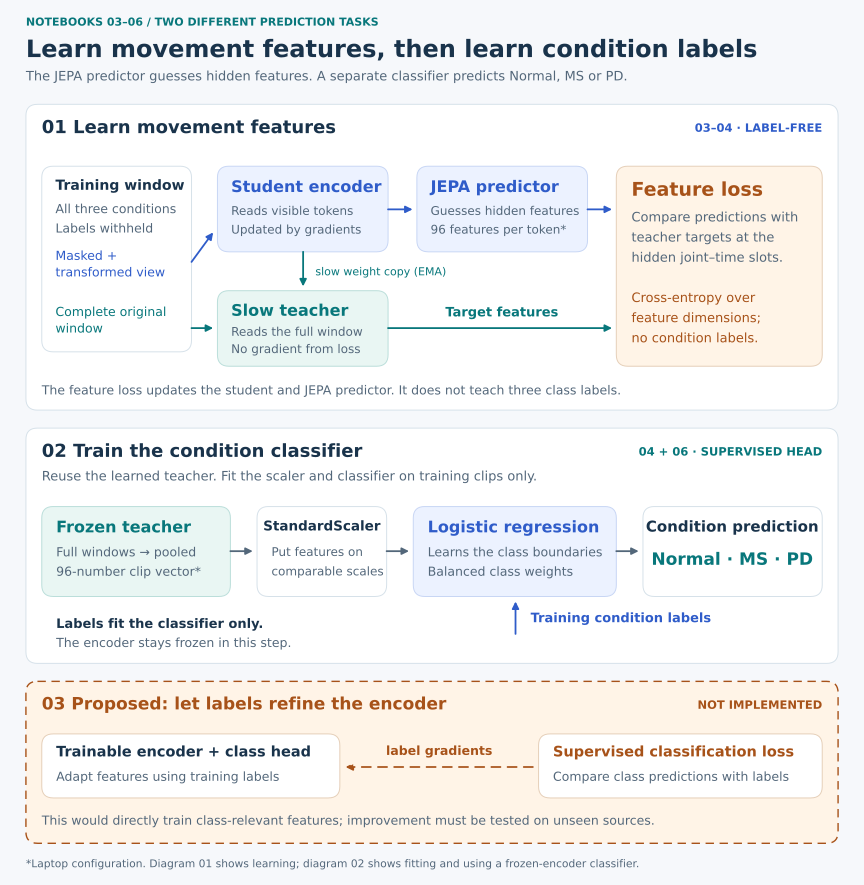
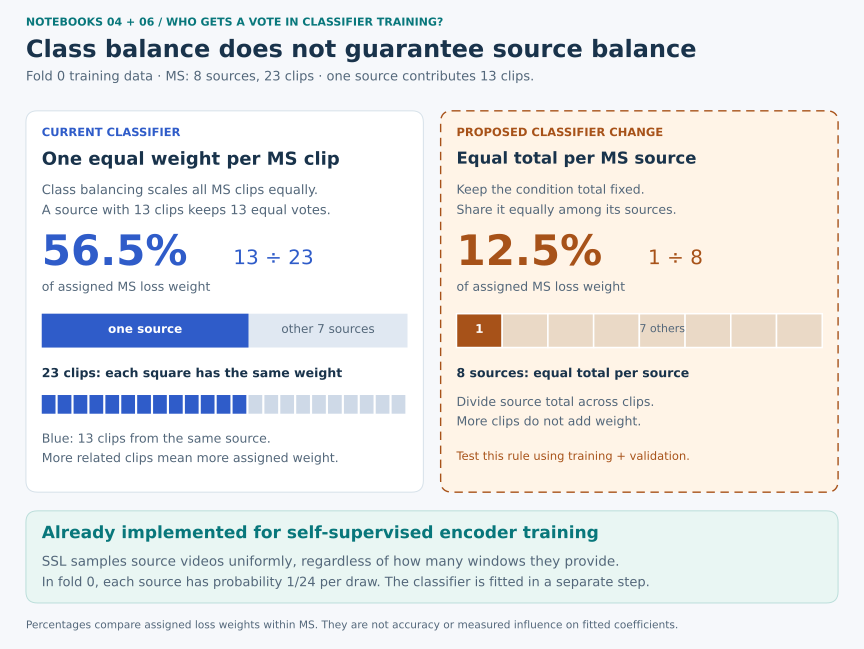

# How notebooks 03–06 learn features and classify Normal, MS, and PD

_Implementation and saved-artifact review: September 20, 2026. This document
describes the current full-data pipeline, then identifies experiments to try.
The proposed experiments have not been implemented or run as part of this review._

## 1. Our goal, stated precisely

We want an encoder to turn a walking clip into a short list of numbers that helps
a classifier distinguish the collection's **Normal, MS, and PD labels on unseen
source videos**. A useful description should preserve relevant movement differences
without depending too heavily on recording conditions or pose-detector quirks.

There are three separate questions:

1. **Do different inputs produce different descriptions?** This checks for
   *collapse*, where the network gives almost everything the same description.
2. **Do those descriptions contain information useful for the three labels?**
   Varied descriptions might describe camera angle rather than movement.
3. **Can a classifier use that information on sources it did not train on?**
   Separating the training clips is easier than generalizing to new recordings.

The current code has concrete mechanisms supporting all three questions, but
only the **separate classifier** receives condition labels in its training loss.
The encoder is trained through a self-supervised prediction task. That distinction
explains both the promise and the limitations of this approach.

The collection's labels are supplied labels, not diagnoses made by the project.
Source IDs identify recordings; they are not verified participant identities.

## 2. Two different things are called “prediction”



| Component | What it receives | What it produces | How it learns now |
|---|---|---|---|
| **Student / view encoder** | Visible context from a transformed skeleton window | Features describing joint–time tokens | Gradients from hidden-feature prediction loss |
| **JEPA predictor** | Context features, hidden-slot placeholders, and joint/time addresses | A feature vector for each token; 96 numbers per token in the laptop profile | The same hidden-feature prediction loss |
| **Teacher / target encoder** | The complete original training window | Target features; later, features used for classification | A slow moving average of student weights; no direct loss gradient |
| **Condition classifier / linear probe** | A standardized clip embedding | Scores for Normal, MS, and PD | Supervised logistic-regression training on training-clip labels |

**The JEPA predictor is not the condition classifier.** Its 96 output dimensions
are learned features, not 96 conditions, and none of them is automatically “the
PD coordinate.” The classifier is a different model, built later.

For example, a good feature might respond to a repeatable movement pattern. The
JEPA predictor practices inferring that feature when part of a window is hidden.
The classifier separately learns whether combinations of features help predict
the dataset label. This is an intended possibility, not an identified biological
meaning of a particular learned feature.

Implementation: [model and predictor](../sjepa/models.py),
[latent-feature loss](../sjepa/losses.py), and
[embedding extraction and classifier fitting](../sjepa/full_experiment.py).

## 3. What each notebook actually contributes

| Notebook | Work performed | Do condition labels change encoder weights? | What to learn from its output |
|---|---|---|---|
| [03](../03_sjepa_model_and_pretrain_normal.ipynb) | Train S-JEPA for 800 updates on fold 0's training sources, including all three conditions | **No** | Whether optimization runs and features retain variation |
| [04](../04_progressive_finetune_ms_pd_vicreg.ipynb) | Continue label-free training for 400 updates; fit a separate frozen probe for the original and continued models; choose using validation sources | **No**; labels train each probe and select the stage | Whether more self-supervised training helps this downstream classifier on validation data |
| [05](../05_representation_visualization.ipynb) | Plot training embeddings and visibility controls; calculate a training silhouette score | No encoder or classifier training here | Clues about feature structure and possible shortcuts |
| [06](../06_capstone_rf_vs_sjepa.ipynb) | Train fresh models in all five outer folds, select within each fold, and produce paired held-out predictions | No condition-label gradient reaches the encoder in this implementation | Classification performance of the predefined procedure on held-out sources |

Notebook 03's `pretrain_normal` filename and notebook 04's
`progressive_finetune_ms_pd_vicreg` filename describe earlier experiments. Today,
03 uses all training conditions, and 04 performs neither a Normal→MS→PD curriculum
nor class-aware VICReg nor supervised encoder fine-tuning.

Also, **800 + 400 is not an uninterrupted 1,200-update run**. Notebook 04 retains
the learned model weights, including teacher weights, but starts a fresh optimizer,
running center, learning-rate schedule, and teacher schedule. It also restarts the
**same seeded data and mask streams**: with unchanged settings, the first 400
batches of sampled window indices and masks are replayed. That is a legitimate
continuation experiment, but it answers a particular question about this two-stage
recipe rather than an independently randomized extension.

The same experiment helpers implement notebooks 03, 04, and 06:
[`train_checkpoint`, `fit_probe`, and `run_fold`](../sjepa/full_experiment.py).
The schedule is driven by optimizer updates, not the older epoch fields printed
by `describe(cfg)`.

For faster execution of that same procedure, see the
[capstone performance tutorial](15-capstone-performance.md). It explains which
calculations can be cached, why CPU fold workers own separate models, and how
batching reduces overhead. These optimizations do not introduce a new learning
objective, source-weighted classifier fitting, or supervised encoder adaptation.
The proposed research changes later in this document remain separate decisions.

## 4. Concrete techniques already supporting representation learning

The following mechanisms are **implemented**. Their intended benefit should not
be confused with a demonstrated improvement in current full-data classification.

| Implemented mechanism | Plain-language purpose | Connection to classification | Important limit |
|---|---|---|---|
| Pelvis centering and torso scaling | Describe movement relative to the body instead of image location and apparent size | Can reduce some camera-position and size shortcuts | Removes absolute image translation and scale; does not remove every recording cue |
| Joint–time tokens | Group four frames of one landmark into a small movement description | Makes local movement available to the encoder | Four frames are a short segment; a token is not a whole gait cycle |
| Joint and time position embeddings | Tell the network which body part and time block a token describes | Allows it to distinguish ankle movement from shoulder movement, and earlier from later motion | Having time addresses does not prove it uses time meaningfully |
| Transformer attention | Let one token use clues from other joints and times | Can describe coordination between body parts | Can also learn easy static or recording-related relationships |
| Fresh structured masks for every example | Hide connected body regions over time; repeatedly change the puzzle | Encourages prediction from incomplete motion context | Some prediction tasks may be solved without condition-relevant features |
| Extra target-sampling preference for shoulder/leg regions | Spend more prediction effort on selected body parts | Encodes a hypothesis about useful regions | The `1.5` weight is a sampling preference, not validated clinical importance |
| Predictor joint/time addresses | Identify each missing feature's location | Prevents every hidden slot from being an indistinguishable question | Correct mechanics are necessary for the task, but do not make labels separable |
| Full-input teacher with stop-gradient and EMA | Supply targets that change slowly while the student learns | Provides a stable feature-learning task | A stable teacher can still emphasize unhelpful information |
| Centered and sharpened feature cross-entropy | Match teacher feature distributions while discouraging simple constant solutions | Helps retain informative variation | There is no term asking Normal, MS, and PD to occupy different regions |
| Source-uniform window sampling | Give every training recording the same expected total sampling probability | Reduces domination by long recordings or many clips from one source | Does not give equal sampling probability to each condition |
| Rotation, translation, scale jitter, and optional reflection | Practice across altered views of the same window | May reduce sensitivity to nuisance changes | May also remove useful distinctions or alter target correspondence; see section 8 |
| AdamW, weight decay, gradient clipping, warmup, and cosine decay | Make parameter updates manageable | Supports reliable optimization of the chosen objective | Better optimization cannot make an unsuitable objective task-specific |

The laptop configuration uses **32 frames with a 15-fps extraction target**,
**33 landmarks**, and
**three channels: x, y, and visibility**. Four-frame groups give **264 tokens**,
each represented by 96 features. The student encoder has three transformer layers;
the predictor has two. Training draws batches of 32 windows, with replacement.
The target-mask budget is about 60%; connected-region sampling can overshoot it.

The optimizer's peak learning rate is `0.001`, weight decay is `0.05`, and the
warmup occupies the first 10% of updates. The teacher averaging coefficient
starts at `0.996` and approaches `1.0`. Teacher centering uses `0.9`; student and
teacher softmax temperatures are `0.10` and `0.06`. These are the current settings,
not established best settings for this dataset.

For the full numerical walkthrough and saved training curves, read
[notebook 03](../03_sjepa_model_and_pretrain_normal.ipynb).
Code references: [normalization and windows](../sjepa/data.py),
[tokenizer](../sjepa/tokenizer.py), [mask sampler](../sjepa/masking_v2.py),
[augmentation](../sjepa/augment.py), [training loop](../sjepa/train_v2.py),
and [configuration](../sjepa/config.py).

## 5. Concrete techniques already supporting classification

### A. Convert a variable-length clip into one fixed-length vector

The downstream classifier uses the **teacher encoder**. It sees each complete
window; there is no masked-input puzzle at this stage. A fixed, seed-0 stochastic
mask selects which **output tokens** to average. It does not hide the teacher's
input. This subset is not exclusively a list of clinically selected joints.

The code averages the selected token features into one vector per window, then
averages the window vectors into one vector per clip. A laptop clip therefore
becomes a list of 96 numbers regardless of its number of windows.

The optimized implementation can put windows from several clips in one
inference batch, while tracking each window's owner. It still averages within
each clip, using the same fixed token readout. This changes how work is packed
for the device, not the definition of a clip's representation. The
[batching example](15-capstone-performance.md#5-batch-calculations-while-preserving-their-meaning)
shows the distinction with three short clips.

This simple readout makes training a small classifier practical. However,
averaging can dilute brief events and differences between body parts. The encoder
can already contain temporal information; averaging does not mathematically erase
all of it. Whether the remaining information is adequate is an experimental
question.

### B. Put feature dimensions on comparable scales

`StandardScaler` learns a mean and standard deviation for every feature from the
**training clips only**. It then applies those same values to validation and test
features. This helps regularization treat the dimensions more consistently. Fitting
the scaler on all data would let held-out feature distributions influence the model.

### C. Fit a regularized, class-balanced linear classifier

Logistic regression learns one weighted combination of the standardized features
for each condition. In a simplified expression, each class score is
`weights · clip_features + offset`. A softmax converts the three scores into
probabilities, and the highest-scoring label becomes the prediction.

This loss **does** compare predictions with condition labels. Unlike the
self-supervised feature loss, its three outputs correspond to Normal, MS, and PD.
The encoder is frozen: classifier training cannot change the features it receives.

The current classifier uses `C=1`, L2 regularization through scikit-learn's default
configuration, and `class_weight="balanced"`. The weights compensate for unequal
numbers of training **clips per class**. The regularizer discourages fitting large
coefficients to incidental training differences. Neither choice proves the
classifier is well calibrated or able to generalize.

A linear probe is also a useful measurement tool: good held-out performance means
the chosen representation makes useful distinctions accessible to a simple head.
Poor linear performance can result from weak features, limited data, insufficient
regularization, or information that needs a nonlinear readout. It does not alone
prove that the encoder contains no useful information.

### D. Select the training budget using held-out validation sources

Notebook 04 fits independent probes for the original and continued encoders,
then chooses the higher **source-weighted validation macro-F1**. A tie retains the
original 800-update stage. Nothing is fitted on validation clips. Notebook 06
repeats this process inside every outer fold, before extracting its test features.

This connects an indirect feature-learning objective to the actual classification
goal: additional training is selected because the downstream validation score
improves, not simply because training loss decreases.

It is still a small comparison. Fold 0 has only eight validation sources.
The current two-budget selection is not a license to try dozens of objectives,
heads, and masks against the same eight recordings.

## 6. A specific gap: balancing classes does not balance sources

The training recipe handles sources differently at different stages:

| Stage | Current source treatment |
|---|---|
| Self-supervised window sampling | Equal expected total probability per training source |
| Feature standardization for the classifier | Each training clip contributes one unweighted row |
| Classifier fitting | Equalized class weight, but equal clip weights **within** each class |
| Validation and reported source-weighted scores | Each source's clips share a total evaluation weight of one |

In fold 0, there are **51 training clips from 24 sources**. The MS class has
23 clips from eight sources. One recording, `tsOMPBS277Q`, supplies 13 of those
clips. Therefore it contributes:

- **13/51 = 25.5%** of the unweighted scaler's rows;
- **13/23 = 56.5%** of the MS class's assigned classifier-loss weight;
- while a one-clip MS recording contributes only **1/23** of that class's weight.

These numbers describe assigned sample weights, not measured influence on the
final coefficients. But they identify a concrete mismatch worth testing.



**Proposed controlled experiment; not currently implemented:** keep the encoder,
token readout, split, and `C=1` fixed. Fit the scaler with clip weight `1/m_s`,
where `m_s` is the number of training clips from that source. Give classifier clip
`i` in class `c` a weight proportional to:

```text
1 / (number of training clips from its source
     × number of training sources in its class)
```

Each source then contributes the same total weight within its class, and each
class contributes the same total weight overall. Normalize the classifier weights
to have mean one and use `class_weight=None`, so the correction is not applied
twice. For MS, every source would contribute **1/8 = 12.5%** of the MS weight.

The scaler and classifier have different roles: the proposed scaler estimates
moments with equal source weight; the classifier additionally equalizes class
weight. This is one explicit recipe to test, not the only possible recipe.
Apply appropriate, documented weighting to comparison methods as well if the
claim concerns a fair comparison of complete pipelines.

## 7. What the saved results establish today

The following is an inventory of the workspace on September 20, not a claim about
what someone may have run without saving it.

| Saved evidence | Supported conclusion |
|---|---|
| Notebook 03's setup, training output, and plots | The laptop fold-0 run completed; loss fell substantially and embeddings retained variation |
| Matching `full-v1/.../fold-0/ssl.pt` | The checkpoint records 800 completed updates and the correct training membership |
| Final effective rank **12.134796142578125** in notebook 03 | The sampled batch's embeddings have several substantial directions of variation |
| No saved outputs in notebooks 04–06; no full-v1 `continued.pt`, `oof.json`, or `results.json` found | There is not yet saved full-data evidence of validation improvement or held-out three-class performance |

The checkpoint is at:

```text
artifacts/runs/full-v1/9496e61b050f/laptop-1d09c8e1eea5/fold-0/ssl.pt
```

The older `g1` reports concern a different 47-clip, 35-source collection. They
are historical development evidence and cannot serve as the results for the
current 88-clip, 41-source experiment.

### Why rank and an attractive plot are not enough

Notebook 03's effective rank is based on a centered batch of **32 windows** with
96 features. That matrix has at most **31 independent directions**, not 96.
The entropy-based effective rank can be fractional. It neither counts useful
medical factors nor measures unused model capacity.

There is also a readout difference: training diagnostics average **all teacher
tokens** for a window, while classification uses a fixed output-token subset and
then averages windows into clips. A healthy window-batch rank is not a direct
measurement of the classifier's exact input vectors.

Notebook 05's silhouette score is calculated in the standardized original feature
space, which avoids mistaking a t-SNE layout for the original geometry. However,
it is still a **training-data**, clip-weighted statistic. Related clips from one
source can create a seemingly convincing cluster. Source-colored plots and
equal-source summaries would help interpret it, but would still be exploratory.

Effective rank is a useful diagnostic in the settings studied by
[RankMe](https://proceedings.mlr.press/v202/garrido23a.html). A newer comparison
finds that the reliability of label-free representation metrics depends on the
architecture and training objective. Our inference for this project is to keep
these diagnostics alongside actual held-out classification, rather than use one
as a certificate of useful gait features.
[Arputharaj et al., TMLR 2026](https://arxiv.org/abs/2608.23182).

## 8. The highest-priority methodological questions

### A. Is the transformed view asking the right prediction question?

`random_view` reflects x coordinates and swaps left/right landmark slots when a
horizontal flip is sampled. The training comparison still uses the same token
indices from the original teacher window; it does not apply a corresponding
permutation to the teacher targets or masks.

That is a **possible anatomical correspondence issue**. At a reflected student
slot, information can now come from the opposite original limb. This may encourage
the model to ignore asymmetric detail. The index behavior is established by the
code; harmful effects on classification have not been measured.

A sensible first ablation is the same training recipe **with reflections disabled**.
An explicitly aligned reflection variant can follow, after checking that joint
identities, masks, predictor positions, and targets agree. Do not label all geometric
augmentations “gait preserving” without testing their consequences. Rotation and
scale jitter also deserve a measured tradeoff between nuisance invariance and
retaining potentially useful movement differences.

### B. Does pooling preserve the information we want to classify?

Compare the current fixed token subset with **all-token averaging**, keeping the
same frozen encoder weights and classifier settings. Refit the training-only
scaler and classifier separately for each readout; do not reuse fitted coefficients
after changing their input features. Then, separately, consider left/right anatomical summaries
or the mean and standard deviation of window embeddings. These can retain more
variation, but add dimensions and increase the risk of overfitting.

Also consider what was removed before the model saw the data. Per-frame pelvis
centering removes global image-space translation, and torso normalization removes
absolute image scale. These normalized monocular coordinates cannot directly
provide calibrated walking speed or stride length in metres. An auxiliary raw-motion
stream would need a clear measurement interpretation and recording-cue controls.
The extraction code uses a rounded integer frame stride, so actual sampling cadence
can differ from its 15-fps target. Before treating coordinate differences as
velocities or comparing timing across recordings, audit the actual frame intervals.

### C. Should condition labels also shape the encoder?

If the goal is condition classification, a **separate supervised adaptation stage**
is a reasonable experiment. Start with a small three-class head and, in a separate
candidate, allow only the last encoder block to update through condition
cross-entropy. Use training sources only, a smaller encoder learning rate, and
validation-based stopping. Keep the earlier frozen probe as the reference.

Choose explicitly which encoder is adapted. The present readout uses the EMA
teacher, so “fine-tune the student” alone does not define how the evaluated features
will change. A simple proposal is to copy the selected teacher into a standalone
encoder and adapt that copy with a new condition head. Preserve the original
checkpoint and name the supervised stage clearly.

To claim **better representations**, freeze the adapted encoder afterward and fit
a fresh copy of the same linear probe. Otherwise a better score may come from a
more flexible head rather than more accessible features.

Supervised contrastive learning is a further option: use labels to bring same-class
representations together and distinguish different classes. For this collection,
same-class positive examples should include **different training sources**, so
near-duplicate windows do not make the task trivial. That sampling rule is our
proposed adaptation of the method, not an established result for this dataset.
[Khosla et al., Supervised Contrastive Learning](https://arxiv.org/abs/2004.11362).

### D. Would another anti-collapse objective help?

Possibly, but this addresses a different problem from label separation. Standard
VICReg encourages view agreement, adequate variation, and less redundant feature
dimensions. It does not directly ask different condition labels to separate.
[Bardes et al., VICReg](https://arxiv.org/abs/2105.04906).

The legacy class-aware code in `losses.py` subtracts a class mean before applying
variance and covariance penalties. Those residuals stay the same if that class's
center moves. Therefore those terms **cannot directly push class centers apart**;
their variance floor encourages within-class variation. The current training loop
does not call that legacy path. Its old docstring should not be read as the current
method or as a mathematical justification for class separation.

The [research and experiment guide](14-jepa-literature-and-experiments.md) evaluates
GFP, V-JEPA 2.1, LeJEPA, and the August 2026 LeVJEPA preprint as possible extensions.
Each is a new experiment, not an automatic upgrade.

## 9. How to decide whether an improvement is real

The next useful evidence is a **matched comparison**, not a target training-loss
number. Keep the same source partitions and compare methods on the same held-out
clips. An untrained encoder with the identical readout and probe is an especially
useful added baseline: it asks whether self-supervised learning adds information
beyond the preprocessing and randomly initialized architecture.

Report the following together:

| Result | Question it answers |
|---|---|
| Source-weighted macro-F1 | How well are the three classes recognized without letting many clips from one source dominate? |
| Per-class precision, recall, F1, and confusion matrix | Is one class improving while another is being lost? |
| Clip-weighted scores | How does the answer change when every clip receives equal weight? |
| Five fold scores and their spread | How sensitive is the result to which source videos are held out? |
| Random-encoder, RF, visibility, mean-pose, and majority comparisons | Is the learned representation adding value beyond simpler signals? |
| Training diagnostics | Did optimization remain numerically valid and avoid obvious constant-output collapse? |

Source-weighted scores still evaluate **clip predictions with weights**. They do
not combine clips into one participant diagnosis. Fold standard deviation is not
a confidence interval. If adding uncertainty estimates, resample whole source
groups and pair methods on the same resamples; this remains an estimate for the
available development collection, not an external clinical validation.
Bootstrapping saved out-of-fold predictions conditions on the already fitted
models: it omits retraining and selection variability and does not remove the
dependence caused by overlapping training folds.

An inference-only time shuffle can reveal sensitivity to time order, but it also
creates an unfamiliar input distribution. A performance drop alone does not prove
the model learned clinically useful dynamics. A matched retrained shuffled-time or
constant-pose control provides stronger evidence about what information matters.

Use a small, declared set of candidates for the current inner holdout. A broad
search across losses, masks, readouts, and heads needs a more complete **nested
inner cross-validation procedure**: choose settings using only outer-training
sources, then evaluate the selected procedure on the outer test partition.
The existing code generates inner splits but uses only the first as a holdout;
it does not average a full inner search.

Once test results influence the next design, those results become development
evidence. Preserve that history and seek a new untouched collection for a stronger
final assessment. See [the split and evaluation method](11-full-data-splits.md).

## 10. What to implement first, and what to record

The [detailed experiment plan](14-jepa-literature-and-experiments.md) separates
lower-cost checks from changes to the learning objective. The practical order is:

1. Establish the current full-data baseline and a random-encoder comparison.
2. Test classifier source weighting and simple readout choices independently.
3. Audit the reflection correspondence and whether temporal information matters.
4. Compare a frozen probe with carefully limited supervised encoder adaptation.
5. Only then compare larger changes such as hierarchical targets, explicit motion
   inputs, external pretraining, or another JEPA objective.

Before each comparison, record its hypothesis, changed factor, training sources,
validation selection rule, update budget, random seeds, mask and augmentation
settings, pooling rule, scaler/classifier weights, and classifier regularization.
Use distinct experiment identifiers. The current configuration hash alone does
not describe every future readout or head choice.

The criterion is improved, repeatable held-out classification under the declared
protocol, with classwise errors and controls reported. Lower self-supervised loss,
greater rank, or a tidier training plot are useful observations along the way.
