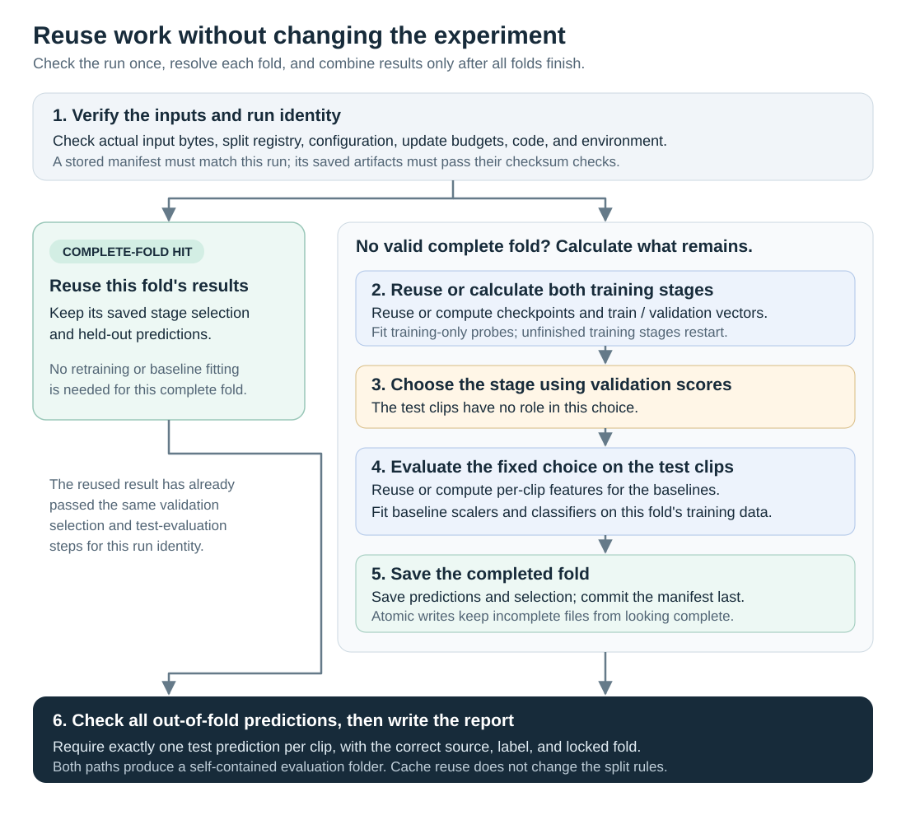
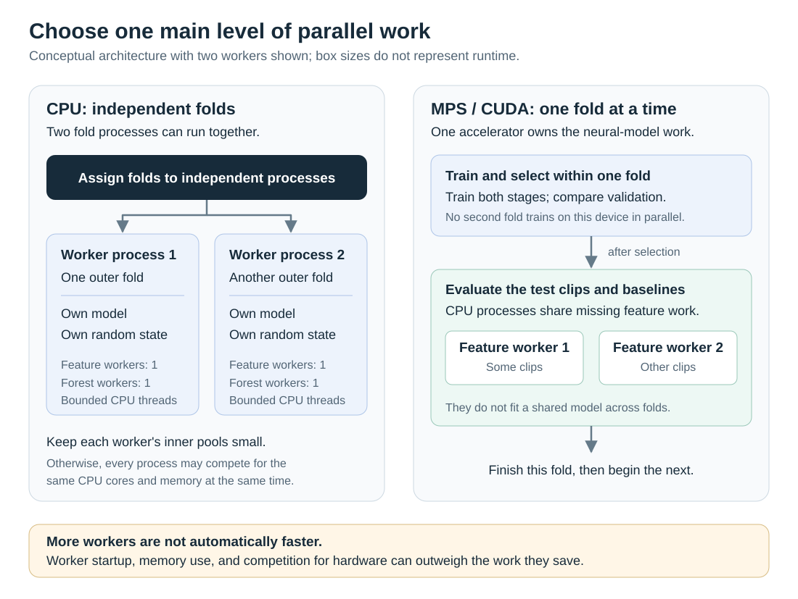
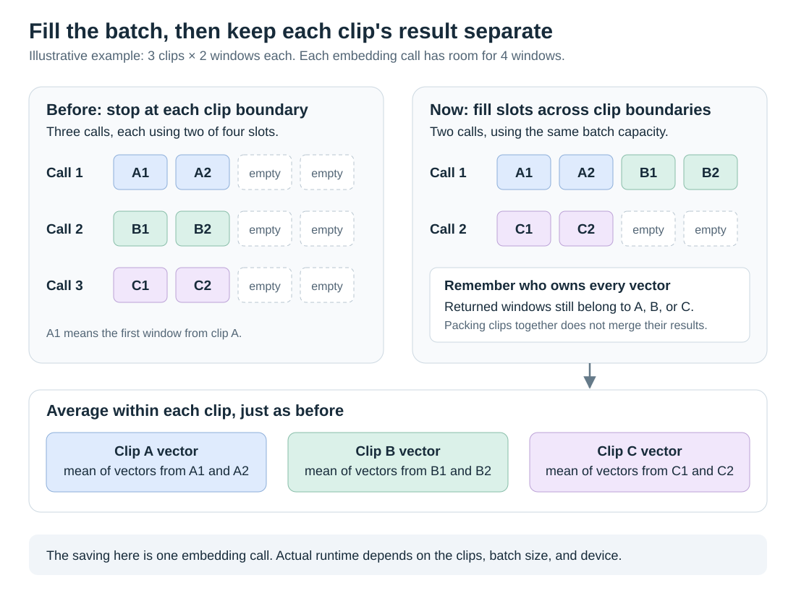

# Make notebook 06 faster without changing the experiment

This tutorial explains the performance controls in
[notebook 06](../06_capstone_rf_vs_sjepa.ipynb): what they save, why they are safe
to share, and what happens when a run stops. The aim is to finish the same
calculation with less repeated work. These changes do not add training data,
improve a classification score by themselves, or change the evaluation method.

Start with sections 1–2 to run the notebook. Sections 3–6 explain the design;
sections 7–8 cover timing, verification, and troubleshooting. The
[split methodology](11-full-data-splits.md) explains the statistical experiment,
and the [representation guide](13-representation-and-classification.md) explains
what the models learn.

## 1. Understand where the time goes

A **fold** is one round of training, validation, and testing. Notebook 06 runs
five rounds. Each starts its own S-JEPA model, trains it for 800 updates, then
continues it for 400 more. An update is one step that changes the model's weights.
That is `5 × (800 + 400) = 6,000` updates in a full run.

There is more work around those updates. The runner converts clips into
**embeddings**, which are lists of learned feature values. It fits classifiers,
compares the two training stages on validation clips, calculates Random Forest
and control features, and finally predicts the test labels. A **window** is a
fixed-length piece of a clip; a long clip contributes several windows.

The optimizations address different costs:

| Technique | What changes | When it helps |
|---|---|---|
| Caching | Save completed calculations and reuse compatible results | Across folds for per-clip features; on later runs for trained stages and results |
| Parallelism | Give independent tasks to separate CPU processes | When enough CPU capacity and memory are available |
| Batching | Process several independent items in one array operation | On the first run as well as later runs that still need computation |
| Safer saving | Publish complete files and check them before reuse | After an interruption or a damaged cache entry |

The training budgets, masks, source-uniform sampling, model architecture, and
classifier settings stay fixed. Each fold still chooses its stage using
validation source-weighted macro-F1, with ties keeping the original stage.
Testing comes after that choice. The 400-update continuation still starts a
fresh optimizer, center, and schedules; it is not a single uninterrupted
1,200-update schedule. It also restarts the same seeded window-sampling and mask
streams, just as before the performance changes.

## 2. Run with explicit execution controls

First make the full pose cache available and run notebook 06's setup and registry
cells. They define `EXP_DIR`, `records`, and `registry`. If the Python modules
have changed since the kernel started, restart the kernel and rerun those cells.
Let an older experiment finish before restarting if you want to preserve its work.

The notebook's evaluation cell uses this configuration:

```python
import os
from sjepa.config import get_config
from sjepa.models import pick_device
from sjepa.full_experiment import run_cross_validation, new_evaluation_dir

cfg = get_config()
device = pick_device()
SMOKE = cfg.profile.endswith('smoke')
UPDATES, MORE = (4, 2) if SMOKE else (800, 400)

CACHE_DIR = EXP_DIR / 'artifacts' / 'cache' / 'capstone'
FOLD_WORKERS = min(2, os.cpu_count() or 1) if device == 'cpu' and not SMOKE else 1
FEATURE_WORKERS = min(2, os.cpu_count() or 1) if FOLD_WORKERS == 1 and not SMOKE else 1
OUTPUT_DIR = new_evaluation_dir(EXP_DIR, registry, cfg)

results = run_cross_validation(
    records, registry, cfg, device, UPDATES, MORE, OUTPUT_DIR,
    cache_dir=CACHE_DIR,
    fold_workers=FOLD_WORKERS,
    feature_workers=FEATURE_WORKERS,
    cpu_threads=1,
    rf_jobs=1,
    verbose=True,
)
```

`CACHE_DIR` is a reusable working directory. Keep it the same between reruns.
`OUTPUT_DIR` is a new report directory for each invocation; it must not already
exist. Separating them lets a new report reuse earlier calculations without
overwriting the earlier report.

| Control | Meaning | Notebook choice |
|---|---|---|
| `cache_dir` | Where reusable calculations live; `None` disables reuse | `artifacts/cache/capstone/` |
| `fold_workers` | Number of independent CPU fold processes | Up to 2 on CPU for full runs; otherwise 1 |
| `feature_workers` | Processes for per-clip RF and control feature extraction | Up to 2 when only one full-run fold is active; otherwise 1 |
| `cpu_threads` | PyTorch and supported numerical-library threads per fold worker | 1 |
| `rf_jobs` | Random Forest parallel jobs within a fold | 1 |
| `verbose` | Show training progress, stage timings, and cache status | `True` |

Worker counts must be positive integers. Multiple fold workers force
`feature_workers` and `rf_jobs` to 1, preventing nested worker pools. Feature
workers only apply when `cache_dir` is enabled. Smoke mode uses the tiny model
and 4 + 2 updates; the notebook keeps it serial because process startup can cost
more than a small calculation. These worker choices are cautious starting
settings, not measurements of the best settings for every machine.

**Notebook, API, and command line differ.** Calling `run_cross_validation(...)`
without these keywords uses `cache_dir=None` and worker/thread counts of 1.
The current `scripts/scripts_full_data.py --run` command uses those defaults and
has no cache or worker flags. It runs the same scientific procedure and benefits
from the shared batching changes, but does not enable the notebook's persistent
cache or process parallelism. Use the notebook or the Python call above for those.

## 3. Reuse work only when it belongs to the same calculation

A **cache** is a saved answer to a calculation. A **cache hit** means that the
runner found a compatible, usable answer. A miss means that it must calculate
that answer. Finding a file with a familiar name is not enough.



*Figure 1. A completed-fold hit skips the fold's computation. Otherwise, the
runner can reuse completed stages inside that fold. The validation-before-test
order is the same in either case: cached predictions must belong to a matching
previous execution of that procedure.*

### Four kinds of reusable work

| Saved item | What it contains | Where reuse is allowed |
|---|---|---|
| Per-clip features | Joint-angle RF features, visibility summaries, and mean-pose summaries | Across folds and compatible runs; each row describes just one clip |
| Training-stage checkpoint | Student, teacher, predictor, and saved training state; a manifest also records final diagnostics | The same fold and matching run identity |
| Stage embeddings | Training and validation clip vectors | The same fold and exact checkpoint bytes |
| Completed fold | Test prediction rows and the validation-selection record, checked against both saved stage checkpoints | The same fold and matching run identity |

For example, clip A might be a training clip in fold 0 and a test clip in fold 1.
Its mean visibility can be calculated once and reused: it depends on clip A,
not on any other clip. A scaler's mean, however, depends on a **training set**.
That scaler must be fitted separately for each fold. The same restriction applies
to classifiers and encoder training.

The fitted logistic-regression probes are not separately cached. If the runner
reuses a stage but must finish its fold, it fits the probe again from cached
training embeddings. A completed-fold hit instead reuses the saved predictions
and needs no classifier fit. Test embeddings are not a separate persistent cache
layer. Two parallel folds can occasionally compute the same previously uncached
per-clip features at the same time; there is no per-feature lock guaranteeing
exactly one calculation.

### How the runner recognizes compatible work

A **hash** is a content fingerprint. The run identity includes the actual pose
NPZ file hashes, frozen registry checksum, complete model configuration, both
update budgets, device information, and execution-environment details. It also
hashes non-test Python files in `sjepa` and `ambient`. Relevant package versions,
Python/platform information, CPU thread count, and selected PyTorch numerical
settings are included. This record is called **provenance**: where the calculation
came from and how it was configured.

The continued-stage entry also names the checksum of its parent checkpoint.
Embeddings name their checkpoint checksum. A vector from one set of weights
cannot silently become the vector for another set of weights.

Three examples show the consequences:

1. Rerun the same cell with the same inputs and settings: compatible completed
   folds can be loaded.
2. Change the continuation budget from 400 to 600: the whole training-run
   identity changes, including its original-stage cache location. The existing
   800-update stage is not automatically imported into the new run. Per-clip
   features may still be reusable because their identity excludes training budgets.
3. Change a pose NPZ file while keeping the old registry: the input check stops
   the run. Revalidate/version the dataset and registry first, following the
   [split guide](11-full-data-splits.md#reproducing-and-checking-the-boundary).
   Do not alter a checksum simply to make an old checkpoint load.

Invalidation is deliberately conservative. A changed input or hashed package
file changes the feature-cache identity for the collection, not only one row.
Even a comment-only edit in a hashed Python file can cause a miss. Editing this
Markdown guide or an SVG does not change those Python-file hashes. These checks
cover cached poses; they do not prove that a replaced raw MP4 still matches an
old pose cache.

Earlier checkpoints that lack these cache manifests are not imported
automatically, even if their filenames look appropriate. A checkpoint from one
fold is never substituted for another fold's model.

## 4. Assign parallel work to the right hardware

**Parallelism** means doing independent jobs at the same time. A process is a
separate Python worker with its own model and random-number state. Numerical
libraries can also use several threads *inside* a process.



*Figure 2. Worker ownership, not a measured timing chart. The accelerator path
does not implement simultaneous GPU training and CPU baseline extraction.*

On a CPU-only machine, fold 0 and fold 1 can train in separate processes. They
have no learned weights to exchange, so neither needs the other's result.
The runner uses process-based workers rather than training folds in Python
threads that share global random-number state. Results are assembled in fold
order even when workers finish in a different order.

On one Apple MPS or CUDA device, the runner requires `fold_workers=1`. Several
training processes would compete for the same device memory and compute. After
the fold selects its stage, per-clip baseline features can use CPU feature
workers. Each feature worker uses one numerical-library thread. This is not a
multi-GPU scheduler.

Why not give every layer all CPU cores? Imagine two fold processes, each starting
four feature workers, with each worker starting several numerical threads.
Those jobs would compete for the same cores and memory. This is called
**oversubscription**. The capstone runner avoids nested process pools when folds
run in parallel and keeps the notebook's inner thread and RF-job counts at one.

Two fold processes also hold two models and two training datasets. If memory is
tight, start with `FOLD_WORKERS = 1` and `FEATURE_WORKERS = 1`. More workers can be
slower for short clips, smoke tests, or an already busy computer. Measure before
raising counts; do not change the model profile or training batch size merely
to make a timing comparison look faster.

## 5. Batch calculations while preserving their meaning

### Fill embedding batches across clip boundaries

A **batch** is a group of windows processed in one model call. Previously, an
embedding call stopped at each clip boundary, even when the batch had room for
more windows. The new helper fills a batch from consecutive clips within the requested
partition, remembers which clip owns each window, then averages separately for
each clip. It runs in evaluation/inference mode without building training gradients.



*Figure 3. An illustrative capacity-four example. A1 means the first window of
clip A, not a new training sample shared between partitions. Fewer calls do not
mean fewer windows are encoded. Empty slots illustrate unused capacity, not
zero-padded inputs sent to the old encoder.*

Suppose A's two window embeddings were `[2, 4]` and `[4, 8]`. Its clip embedding
is still `[3, 6]`, whether B's windows were in the same device batch or not.
The helper does not average A with B. It also does not combine training and
validation partitions into a shared fit.

The pending inference batch is bounded by `cfg.batch_size`; this optimization
does not require putting every clip on the GPU at once. It does not make all
memory use constant: the current window loader still materializes one clip's
windows, and the helper retains embedding vectors for pooling.

### Calculate the masked loss together, but keep equal example weight

During training, each example has its own mask. The previous code repeatedly
found its hidden token indices and calculated one loss at a time. The new
`masked_batch` method calculates token losses in fixed-shape arrays, includes
only masked tokens in the averages, and averages in two steps:

1. Average the masked-token losses **within each example**.
2. Average those example means **across the batch**.

For a small numerical example, let A's masked-token losses be `[1, 3]` and B's
be `[5, 5, 5, 5]`. A's mean is 2 and B's is 5, so the batch loss is
`(2 + 5) / 2 = 3.5`. Averaging all six tokens together would give 4 and would
give B more influence just because it has more masked tokens. The optimized
calculation preserves 3.5, the original equal-example rule.

The running **center**, used to adjust teacher targets, follows a different
existing rule: update it once per optimizer batch from the mean of **all masked
target vectors**, with each target token counted equally. It is not updated once
per example. Unmasked tokens do not contribute to this center update, and teacher
targets still receive no training gradient.

### Ask the accelerator for fewer small answers

The teacher-drift diagnostic measures how far teacher and student parameters
have moved apart. Previously, its loop converted each parameter-tensor comparison
into a Python number separately. On an accelerator, that can repeatedly make
the CPU wait for device work. The revised loop combines those comparisons on
the device and transfers one final mean to the CPU.

This reduces synchronization in that diagnostic; it does not eliminate all
CPU–GPU transfers. Loss logging and other diagnostics still need CPU values,
and effective-rank calculation still uses a CPU singular-value decomposition.
Diagnostics remain recorded at every update. Floating-point summation order can
change slightly with batching, so an unchanged mathematical procedure is not a
promise of bit-identical GPU training.

## 6. Know what survives an interruption

Suppose folds 0–2 are complete. Fold 3 has saved its original 800-update stage,
but the program stops 120 updates into its 400-update continuation. With the same
cache and matching settings, the next invocation can reuse folds 0–2 and fold 3's
completed original stage. The unfinished continuation starts again for its full
400 updates. Fold 4 still needs to run.

The capstone cache recovers **completed stages**, not arbitrary optimizer steps.
The lower-level trainer supports explicit training-state resume, but this runner
does not periodically save and automatically resume the middle of a stage.

Several mechanisms prevent partial work from looking complete:

- An **atomic write** saves to a temporary file beside the destination and
  replaces the destination only after the write succeeds.
- A **manifest** is a small record of context and completion. Checkpoint,
  embedding, and completed-fold manifests check their recorded file checksums
  and the saved manifest value before accepting a hit. Manifests are written
  after their artifacts.
- A **per-fold lock** makes simultaneous runs using the same fold-cache entry
  wait rather than update that entry together.
- Before publishing the final report, the runner checks that every usable clip
  has exactly one test prediction with the correct fold, source, and label.

Per-clip feature NPZs have atomic writes and loading/shape/finite-value checks;
they do not have the checkpoint-style checksum manifest. Damaged or incomplete
entries caught by these checks are recomputed. These safeguards are not a backup
system or authentication mechanism. Checkpoints contain serialized PyTorch
state, so use a cache directory you trust.

The two directory roles look like this; angle-bracket names below are placeholders:

```text
artifacts/cache/capstone/
  features/<feature-identity>/       reusable per-clip feature arrays
  runs/<run-identity>/
    provenance.json                 inputs, code, environment, settings
    fold-0/                         checkpoints, embeddings, manifests
    ...

artifacts/runs/full-v1/.../capstone-<timestamp>/
  provenance.json                   included when caching is enabled
  fold-0/ ... fold-4/                copied fold artifacts for this evaluation
  oof.json                          complete out-of-fold prediction rows
  results.json                      metrics, selections, execution timings
```

Each cached evaluation copies its fold artifacts into its new output directory.
A cache hit still spends time checking files and copying them, so it is not free.
Repeated reports and caches consume disk space. Keep reports/checkpoints needed
for reproducibility; archive a specific unused cache directory only after its
jobs finish. Disabling reuse with `cache_dir=None` does not delete existing files.

## 7. Read timings and separate evidence from expectations

Progress messages distinguish stage reuse from whole-fold reuse. For example,
`fold 0 ssl: checkpoint cache hit` means the original stage was loaded. A final
fold status of `computed` can still include stage or feature cache hits; it means
the **whole completed fold** was not reused.

Inspect a returned result without running training again:

```python
execution = results['execution']
print(f"Runner elapsed time: {execution['seconds']:.2f} seconds")
for fold in execution['folds']:
    print(f"Fold {fold['fold']}: {fold['status']}, {fold['seconds']:.2f} seconds")
print("Effective workers:", execution['fold_workers'], execution['feature_workers'])
```

The runner's elapsed time includes its validation/cache checks, fold work, and
metric calculation, but is recorded before the final report-file writes. It does
not include earlier notebook setup or pose extraction. Per-fold times can include
lock waiting, cache checks, and artifact copying. Parallel fold times overlap:
two folds taking ten minutes together need not take twenty minutes on the clock.

For a useful speed comparison, distinguish these cases:

1. **Fresh calculation:** use a new empty cache location and confirm that folds
   report `computed`. Record the device, profile, budgets, workers, and elapsed time.
2. **Cached rerun:** keep that cache, use a new output directory, and rerun the
   identical request. Confirm the expected hits before describing a cache speedup.
3. **Parallel versus serial calculation:** compare separate empty caches with
   the same data, model, budgets, and device. Otherwise the second run might look
   faster simply because it reused the first run's results.

Allow for library/process startup and repeat short timings. Use smoke mode for
an inexpensive execution exercise, and label it as such. A cached rerun is the
same saved experiment, not an independent repetition supporting a confidence
interval or a new estimate of model quality.

During the optimization work, a small CPU timing check used 24 synthetic clips,
five folds, the laptop smoke model, 4 + 2 updates, and one CPU thread. After a
startup warm-up, two timed repetitions took about **0.68 seconds for a fresh
calculation** and **0.07 seconds for an unchanged cached rerun**. These are local
implementation-check timings, not clinical-data training times or a promised
tenfold first-run improvement. That check did not benchmark the full 6,000-update
experiment or Apple/CUDA GPU acceleration.

The optimization verification passed 61 package tests. Its new CPU tests check
equal losses, gradients, and center updates; preserved clip pooling; serial and
parallel agreement; cached and uncached agreement; changed-input rejection;
and recovery from selected interruptions and corrupt entries. Passing them does
not prove a speedup on every device or improved MS classification.

From the experiment directory, rerun the correctness checks with:

```bash
uv run --with pytest python -m pytest sjepa/tests/test_experiment_performance.py -q
uv run --with pytest python -m pytest sjepa/tests -q
```

## 8. Troubleshoot without changing the experiment

| Symptom | What to check or do |
|---|---|
| An unchanged-looking run trains again | Check the printed profile, budgets, device, CPU thread count, and cache path. Package/Python edits or environment changes can invalidate the cache. |
| The command-line run has no hits or parallel folds | The current CLI uses serial, uncached defaults. Use notebook 06 or the explicit Python API call in section 2. |
| `Pose cache changed since the registry was loaded` | Stop and revalidate/version the input cache and registry. Do not bypass the check. |
| A restart repeats some training | Only completed stages are recoverable automatically. The interrupted stage must run again. |
| More workers make the machine slower or exhaust memory | Set both worker counts to 1; compare elapsed times before increasing them. |
| A CUDA/MPS run rejects multiple fold workers | Set `fold_workers=1`; the runner supports one active training fold on that device. |
| The output directory already exists | Obtain a new path with `new_evaluation_dir(...)`; keep the cache path unchanged. |
| No training starts while another identical run is active | A matching fold cache may be locked. Let the other run finish; do not remove an active lock. |
| Scores differ slightly after the batching change | Small numerical differences are possible. First check data, configuration, seeds, and provenance; do not choose settings based on outer test scores. |

## Implementation map

| File | Responsibility |
|---|---|
| [`full_experiment.py`](../sjepa/full_experiment.py) | Cross-clip embeddings, stage/fold orchestration, worker limits, selection, OOF checks, and timings |
| [`experiment_cache.py`](../sjepa/experiment_cache.py) | Cache identity, manifests, atomic writes, and parallel per-clip feature extraction |
| [`losses.py`](../sjepa/losses.py) | Batched equal-example masked loss and one center update |
| [`train_v2.py`](../sjepa/train_v2.py) | Training loop and reduced synchronization in teacher drift |
| [`classical.py`](../sjepa/classical.py) | Training-only RF preprocessing and configurable RF jobs |
| [`test_experiment_performance.py`](../sjepa/tests/test_experiment_performance.py) | Correctness and recovery checks for these optimizations |
| [`notebook_full_data.py`](../scripts/notebook_full_data.py) | Shared source for notebook 06's explanation and execution cell |

The three SVG figures in this guide are editable vector source files in
`images/`. Their layouts explain the implementation; none is a measured speedup
plot. The next useful performance evidence is a controlled first-run timing on
the hardware and profile you actually intend to use, with the scientific
procedure held fixed.
