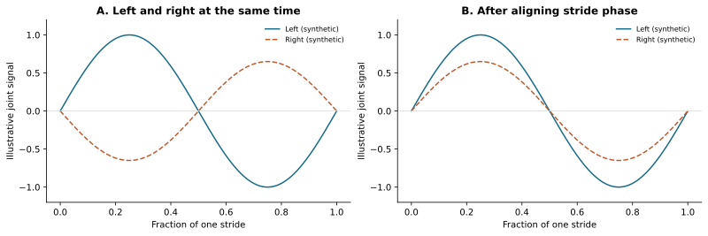
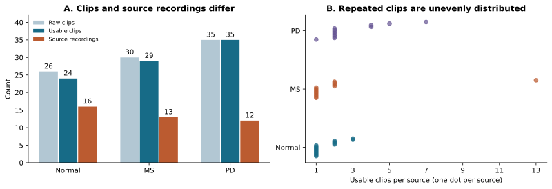
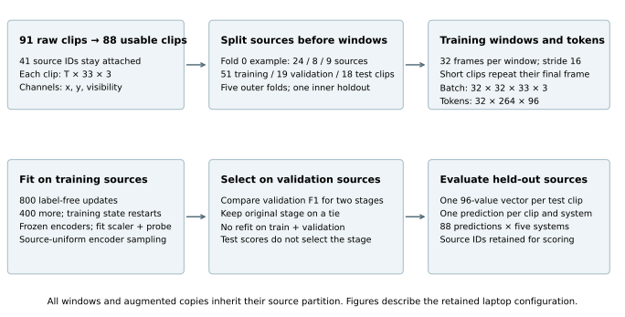
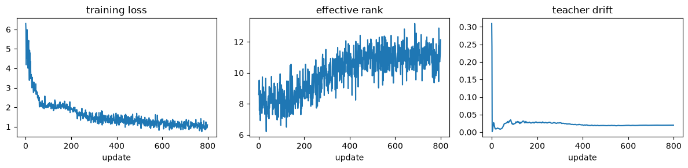
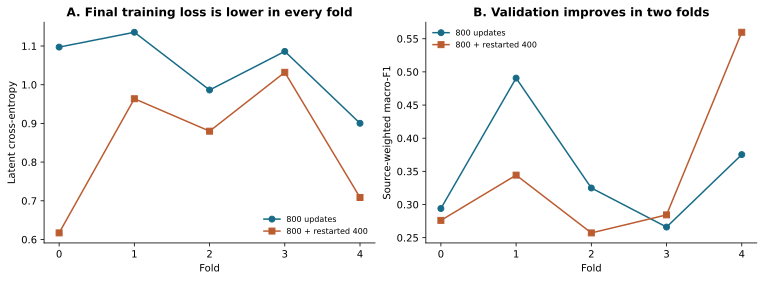
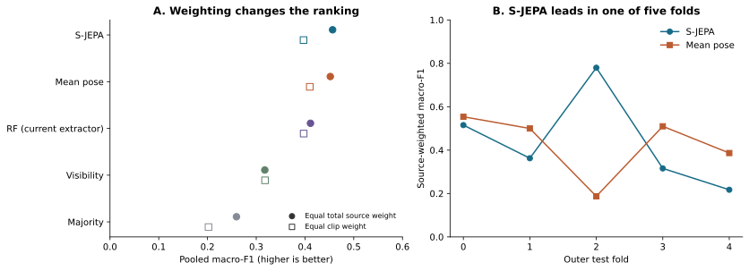
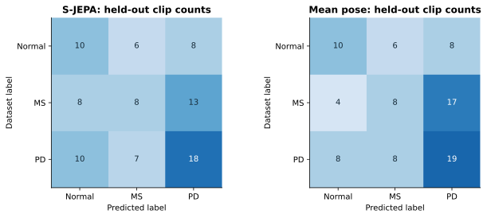

# What skeleton prediction has learned about gait—and what to test next

*Review of notebooks 00–06 and the retained `video-data-full` experiments, September 20, 2026. The main results come from the completed 800-plus-400-update capstone run. This review recomputes its scores and adds a retrospective source-resampling analysis; it does not train a new neural model.*

## Why gait is a useful test of physical representation learning

Walking provides a concrete setting in which to ask whether a learned representation captures useful physical structure. A knee moves in relation to a hip and ankle, the legs alternate through a cycle, and the movement must remain coordinated while the body changes position. A useful gait representation should retain those relationships despite changes in camera framing. It should also preserve departures from ordinary coordination that may matter to a clinical assessment.

Symmetry needs careful interpretation here. The legs occupy different positions at the same instant during normal walking; comparing their motion requires matching corresponding phases of a stride. Clinical research gives a reason to measure both asymmetry and coordination without assuming that either provides a diagnosis. In a study of 92 people with multiple sclerosis (MS), swing-time asymmetry and bilateral coordination differed with disability severity and deteriorated during a six-minute walk. This was a measured association in that cohort, not a finding from our videos. [Plotnik and colleagues, 2020](https://www.nature.com/articles/s41598-020-68263-0).

Parkinson’s disease (PD) provides a related but distinct motivation. A study of 97 people with PD and 36 controls found greater gait asymmetry in the PD group, yet the side of gait impairment often failed to match the side indicated by clinical motor scores. The study also found that gait and turning asymmetries did not simply track each other. A model therefore needs to preserve which movement is being measured and under what conditions; one generic “symmetry score” would discard relevant distinctions. [Seuthe and colleagues, 2024](https://link.springer.com/article/10.1007/s00415-024-12379-0).



*Figure 1. These are deliberately synthetic signals, not measurements from an MS or PD participant. The right signal has smaller amplitude and a half-cycle delay. Aligning stride phase removes ordinary alternation from the comparison while retaining the amplitude difference. Actual phase estimation would need independent validation.*

The notebooks approach this problem through a skeleton Joint Embedding Predictive Architecture, or S-JEPA. An **encoder** converts a sequence of body landmarks into numerical features; an **embedding** is the resulting feature vector. During self-supervised training, a predictor estimates features for hidden joint–time positions from visible context. The training target is another encoder’s representation of the same training window. Condition labels balance the source splits and later train a small supervised classifier on frozen features; they do not enter the encoder’s loss. This follows the central feature-prediction idea of [S-JEPA](https://www.ecva.net/papers/eccv_2024/papers_ECCV/papers/04755.pdf), adapted here to a much smaller collection and two spatial coordinates plus detector visibility.

The completed experiment offers a useful, bounded conclusion: **this recipe has not demonstrated a consistent classification advantage over average pose on unseen source recordings from this collection**. The learned features retain variation, and some held-out predictions are correct, but the evidence does not yet isolate useful temporal learning or establish clinically meaningful symmetry. A reflection/mask correspondence problem, documented below, further limits interpretation of the training task. That gap gives the next research question a clear target: which properties of motion survive representation learning, and which of them improve predictions beyond posture and recording conditions?

## The hypothesis and the sequence of questions

The initial working null is that learned skeleton features provide no improvement over a simpler joint-angle classifier on unseen sources. The mean-pose control sharpens that question: does a temporal encoder improve on a representation that discards frame order? These hypotheses organize the review retrospectively. The retained material does not establish that a statistical test and decision rule were registered before the results were inspected.

For a future declared comparison, let Δ denote S-JEPA’s source-weighted macro-F1 minus the chosen baseline’s score. A superiority question can use **H₀: Δ ≤ 0**, against improvement above zero, with a separate minimum useful improvement set before evaluation. The present results do not provide a confirmatory rejection of that null. A small observed gap also cannot establish equivalence, which would require a justified equivalence margin and a suitable analysis.

| Notebook | Question addressed by the current code | Evidence and consequence |
|---|---|---|
| [00: overview](../00_overview_and_video_gallery.ipynb) | What is available, and what counts as an independent recording? | 91 clips derive from 41 source IDs. The gallery has no retained execution output; the inventory is independently verified in this review. |
| [01: extraction](../01_pose_extraction_from_raw_video.ipynb) | Can each clip become a usable sequence of landmarks? | 88 cached sequences remain after three documented exclusions. The temporal and geometric transformations require explicit limits. |
| [02: masking and tokens](../02_anatomical_mask_and_tokenization.ipynb) | Can hidden targets be defined without permanently withholding important joints? | The active sampler varies joint–time targets. This notebook has no retained execution output; its design is supported by code and existing tests, rather than a newly completed notebook run. |
| [03: representation training](../03_sjepa_model_and_pretrain_normal.ipynb) | Can masked-feature training proceed without obvious complete collapse? | Loss falls and feature variation remains on training batches. This establishes a working optimization procedure. |
| [04: continuation and probe](../04_progressive_finetune_ms_pd_vicreg.ipynb) | Does additional representation training improve a fitted classifier? | Fold 0 validation favors the original 800-update stage over the restarted continuation. |
| [05: visualization](../05_representation_visualization.ipynb) | Do the training representations visibly separate the labels? | High-dimensional silhouette scores are near zero or slightly negative. The plots are exploratory and restricted to training clips. |
| [06: capstone](../06_capstone_rf_vs_sjepa.ipynb) | Does the complete training-and-selection procedure generalize across source splits? | Five systems receive one held-out prediction per usable clip. Average pose remains a competitive control, and the learned model varies substantially across folds. |

Two filenames preserve earlier ambitions: notebook 03 currently trains on all three conditions’ training sources, and notebook 04 currently adds label-free training followed by a frozen-encoder probe. There is no normal-only pretraining stage, diagnosis-supervised encoder adaptation, or active VICReg objective in this full-data route. VICReg refers to penalties on feature variance, agreement between views, and correlation between dimensions; its presence in legacy code and configuration does not make it part of the completed experiment.

Older documents describe a different, smaller cache and earlier training mechanics. Their scores are historical evidence about those procedures. Combining them with the present results would confound changes to the dataset, splits, model, and loss. The discussion below follows the current notebook code and retained full-data artifacts throughout.

## Establish the data before interpreting the model

The available raw data are MP4 clips in `Normal`, `MS`, and `PD` folders. Their filenames carry an 11-character recording ID, sometimes followed by a clip suffix. The cache retains that ID and the clip name, allowing every later window and prediction to be traced to its recording. The reviewed metadata provide collection labels, not verified participant identities, diagnoses, disease severity, medication state, or affected-side annotations.

| Collection label | Raw clips | Usable clips | Sources | Cached frames | Clips padded to 32 frames | Available 32-frame windows |
|---|---:|---:|---:|---:|---:|---:|
| Normal | 26 | 24 | 16 | 1,427 | 5 | 59 |
| MS | 30 | 29 | 13 | 3,450 | 0 | 171 |
| PD | 35 | 35 | 12 | 2,766 | 10 | 128 |
| Total | 91 | 88 | 41 | 7,643 | 15 | 358 |

The window counts use the retained laptop configuration: 32 frames with a stride of 16. These are available windows across the whole cache, not independent observations or the number used in any one training fold. In fold 0, 51 training clips yield 207 available windows.



*Figure 2. All 41 sources survive extraction, but they contribute very different numbers of clips. One MS source supplies 13 of the 29 usable MS clips; one PD source supplies seven clips. Each dot in panel B is one source, with a small vertical offset to make repeated values visible.*

The excluded clips are `JD1AGVpftps_P1_02`, `diCVwltkV5M_P1_01`, and `tsOMPBS277Q_P1`. Notebook 01 records “too few valid frames” for each. The extraction gate requires at least 30% of sampled frames to have finite x coordinates for all landmarks, followed by at least eight cleaned frames. The log does not identify which condition failed in each excluded clip. The [exclusion record](../artifacts/eval/full-v1/exclusions.json) preserves that uncertainty.

The raw files vary in resolution and frame rate. Reading their container metadata in this review gives nominal source rates from approximately 23.76 to 59.94 fps and nine width–height combinations. Neither those differences nor the unequal clip counts prove a source of confounding. They establish variables that a classifier could exploit and that a future study should measure explicitly.

### What “preserving shape” means at each step

Three different properties need to be distinguished: the array’s dimensions, the geometry of a pose, and the membership of the dataset. The implementation preserves source membership through splitting and preserves identifiable joint/time slots during tokenization. Several preprocessing operations deliberately change the observations. A blanket claim of exact dataset or physical-motion preservation would therefore be inaccurate.

| Stage | Input → output | What is retained; what changes | Fitting boundary |
|---|---|---|---|
| Pose extraction | Video → `(T_raw, 33, 3)` | Landmark indices and sampled order are retained. The three channels are pixel x, pixel y, and visibility; there is no measured depth channel. Images become estimated landmarks. | A pretrained detector is applied per clip; no task-specific detector fitting is performed. |
| Cleaning | `(T_raw, 33, 3)` → `(T_clean, 33, 3)` | Empty ends are trimmed. Missing values are interpolated; a channel with no finite values is filled with zero. T can change, while joint/channel layout stays fixed. | Each clip is processed independently. |
| Normalization | `(T_clean, 33, 3)` → the same shape | Each frame is centered on the hip midpoint and divided by the distance between its shoulder and hip midpoints. Visibility stays unchanged. | No collection-wide statistics are fitted. |
| Source split | 88 records → train/validation/test records | Every usable clip appears in each fold’s partition union, and related clips stay together. Values and clip lengths are unchanged. | Source labels balance the split; model scores do not choose it. |
| Windowing | `(T_clean, 33, 3)` → `(W, 32, 33, 3)` | Adjacent windows overlap by 16 frames. Clips shorter than 32 repeat their last frame. A trailing remainder after the last complete stride-aligned window is omitted. | Windows are formed within each assigned partition. |
| Tokenization | `(B, 32, 33, 3)` → `(B, 264, 96)` | Four adjacent frames of one joint provide 12 input values; eight time blocks × 33 joints give 264 slots. Reshaping preserves supplied order, then a learned projection changes the representation. | Projection and positional parameters learn only from training windows. |
| Augmentation and masking | Same batch dimensions | A training copy is rotated, scaled, translated, and sometimes reflected. Boolean masks restrict context; the full target window stays available to the target encoder. | Copies inherit their original training source. |
| Feature readout | Window token features → one 96-value vector per clip | Selected token features are averaged, then window vectors are averaged. This removes explicit window order from the final readout, though each window encoder uses time information. | The encoder is frozen; test clips cannot update its weights. |
| Classifier and scoring | One vector → one label per clip | Clip/source identity stays attached to the prediction. Scoring can weight clips equally or give each source a total weight of one. | Scaling and classifier fitting use training clips only. |

Per-frame translation and uniform positive scaling preserve two-dimensional joint angles and within-frame distance ratios, up to numerical precision. They remove absolute body location and apparent size. Because torso scale is recalculated in every frame, temporal displacements change; the normalized sequence cannot directly supply walking speed in metres per second. A two-dimensional camera projection also does not preserve general three-dimensional joint angles across viewpoints.

Two temporal limitations deserve priority. The loader uses an integer frame stride, `round(source_fps / 15)`, rather than timestamp-based resampling. Its implied sampling rate ranges from about **11.88 to 15.00 fps** in this collection even though every cache stores `fps=15`. Those rates are inferred from nominal container metadata; variable-frame-rate timestamps have not been audited. Also, `clean_sequence` interpolates internal missing intervals without limiting their length, despite prose describing “short gaps.” The cache does not retain a per-value observed/interpolated flag or original timestamps. We cannot quantify the longest filled gap from the retained cleaned arrays alone.

These operations do not mix training and testing, but they limit claims about stride timing, physical velocities, and observed asymmetry. They also mean that padding is unequally distributed across conditions: 15 clips are padded, including ten PD clips and no MS clips. Whether a model uses that difference is an open empirical question. A revised timestamp-aware cache must be a new dataset version, with its own registry and rerun comparisons, so that a preprocessing change cannot silently inherit the present scores.

## Separate learning, selection, and evaluation

The strongest methodological feature is the source boundary. Splitting overlapping windows at random would allow nearly identical movement into both training and testing. Here the split is made on one row per source before expanding assignments back to clips and windows. This implements the grouped-data principle explained in the [scikit-learn cross-validation documentation](https://scikit-learn.org/stable/modules/cross_validation.html#cross-validation-iterators-for-grouped-data).

The outer procedure applies five-fold stratified splitting to the sorted source table, with shuffle seed 42. **Stratified** means distributing condition labels across folds. For outer fold k, its test sources are set aside. The remaining sources undergo a four-fold stratified split with seed `43 + k`, from which only the first split is used: one part is validation, and the rest is training. Thus the design is five outer folds with one inner holdout each; it does not average a full inner cross-validation search.

| Fold | Training sources / clips | Validation sources / clips | Test sources / clips |
|---|---:|---:|---:|
| 0 | 24 / 51 | 8 / 19 | 9 / 18 |
| 1 | 24 / 58 | 9 / 17 | 8 / 13 |
| 2 | 24 / 54 | 9 / 17 | 8 / 17 |
| 3 | 24 / 53 | 9 / 21 | 8 / 14 |
| 4 | 24 / 45 | 9 / 17 | 8 / 26 |

Every row covers all 41 sources and 88 usable clips. Every usable clip occurs in exactly one outer test fold, and all three labels occur in every partition. The large MS source belongs to fold 4’s test set, which accounts for much of its clip imbalance. That imbalance is retained to protect the grouping boundary.



*Figure 3. Array sizes follow the laptop configuration. In each outer fold, a fresh model trains on that fold’s training sources. Validation selects the original or continued checkpoint; the selected model and already fitted probe are then evaluated on test clips. The model is not refitted on training plus validation data.*

The encoder samples windows with replacement, weighting each window by the inverse of the number of windows from its source. This gives every training source equal total sampling probability. It does not force equal realized counts, equal class exposure, or equal clip exposure within a source. Notebook 03 records 25,600 window draws over 800 updates, with 1,025–1,129 draws per training source. Repeated draws and augmented copies provide optimization examples, not additional independent people.

The supervised heads use a different weighting scheme: one row per training clip with inverse-frequency **class** weights. They do not use source sample weights. Consequently, a source with several clips can still influence a fitted head more than a source with one clip. Source-weighted evaluation does not retroactively source-balance that fitting process. Matching source weights throughout the encoder, scaler, and supervised objective is a worthwhile controlled follow-up.

Within a fold, the scaler learns its mean and standard deviation from training features, the classifier fits training labels, and validation compares two candidate S-JEPA stages. The RF selects varying columns using training data alone. Notebook 05 fits its scalers and visual projections on training clips only. Notebook 06 trains fresh models rather than reusing the teaching notebook’s fold 0 checkpoint. Identical seed values across folds make the procedure reproducible; they do not create independent seed replications.

The [registry](../artifacts/eval/full-v1/fold_registry.json) checks cache hashes, partition membership, exclusions, and full test coverage. Checkpoints record their dataset, fold, stage, and configuration. These guards catch several common forms of accidental reuse. They do not verify whether two source IDs contain the same participant or overlapping footage, and the dataset fingerprint hashes the cached poses rather than the MP4 bytes. These sources have also been inspected during development. The appropriate scope is therefore an internally source-grouped development estimate, with participant and external-population generalization still untested.

## What the successive experiments establish

### First make the prediction task mechanically meaningful

Notebook 02 addresses two concrete failures in the earlier implementation. A fixed anatomical mask permanently hid the same joints from the context encoder. In addition, identical hidden placeholders without target-position information gave the legacy predictor no way to distinguish one hidden slot from another. The current predictor adds separate joint and time positions, while stochastic masks allow every landmark to appear as context across fresh draws. Those repairs establish necessary opportunities for learning; their downstream benefit has not been isolated in a matched full-data ablation.

The current masks cover connected anatomical regions over contiguous time blocks, aiming for roughly 60% targets. They provide a mild sampling bias toward shoulders and legs. Overlapping regions can still hide a joint throughout a whole window, and middle time blocks receive different coverage from boundary blocks. The guarantee is some context somewhere in the window, including at least one shoulder-or-leg-set token, rather than visibility of every joint or every time block.

Review of the augmentation path identifies a remaining correspondence problem. `random_view` sometimes reflects the sequence and swaps left/right landmark slots, but `train_sjepa_v2` applies the original slot mask to that transformed sequence. If the original left ankle is a target and the right ankle is context, reflection places the original left ankle's transformed coordinates in the visible right-ankle slot. The target encoder still sees the original sequence. A deterministic check reproduces this mapping. In a separate seed-42 audit of 512 masks, 17,931 of 85,409 target slots (21.0%) would have their coordinates exposed if the window were reflected. This is a diagnostic sample from the current mask generator, conditional on reflection, rather than a reconstruction of masks encountered during the retained training run.

Thus some coordinates designated as hidden in the original sequence can be available through another context slot. This is an information path within a training example, not a crossing of the train/test source boundary. It does not invalidate the saved classification counts, but it creates a possible shortcut and weakens the interpretation of the loss as prediction from withheld anatomical content. The size of its effect on learning or classification is unmeasured. A corrected experiment should either disable reflection or consistently transform the mask and map context/target correspondences back to the intended joint identities, with a regression check that original target coordinates remain withheld under the declared transformation. Permuting the mask closes this particular coordinate path in the diagnostic audit; implementing and evaluating the complete corrected training task still requires new runs.

The motivation for retaining low-motion joints is reasonable, since movement reduction may carry useful information. However, the notebooks’ stronger suggestion that motion-aware masking is clinically “contraindicated” exceeds the available evidence. No comparison here demonstrates that such masking destroys a disease signal. The defensible claim is a design hypothesis: compare unbiased, anatomically biased, and motion-aware masks under matched budgets before declaring a preferred policy.

### Then establish learning without equating loss with gait understanding

Notebook 03 uses a three-layer, 96-dimensional transformer encoder with four attention heads and a two-layer predictor. The target encoder begins as a copy of the context encoder and is updated by an **exponential moving average**: each update retains most old target weights and adds a small contribution from the current encoder. It receives no direct gradient from the loss. Its access to complete training windows supplies the learning targets without exposing any test source.

The objective compares soft probability distributions over 96 feature dimensions at hidden positions. These dimensions are not condition classes. Target centering subtracts a running feature mean, and temperature scaling sharpens the distribution. Loss averages over each example’s target positions and then over examples; the running center updates once per batch. AdamW uses an update-based learning-rate schedule and gradient clipping. These mechanisms support stable optimization, while their clinical value still has to be evaluated downstream.

The saved notebook now contains numerical diagnostic summaries, so approximate readings from its plot are unnecessary:

| Notebook 03 training diagnostic | Mean of first 50 updates | Mean of last 50 updates | Final update |
|---|---:|---:|---:|
| Feature-prediction loss | 3.858 | 1.022 | 1.097 |
| Effective rank | 8.132 | 10.939 | 12.135 |
| Mean feature standard deviation | 0.154 | 0.526 | 0.550 |

**Effective rank** summarizes how broadly the batch’s centered embeddings spread across directions. With 32 windows per batch, there can be at most 31 linearly independent centered directions. Rank 12.135 therefore indicates variation in several directions, rather than 12 useful gait factors. The accompanying increase in absolute spread helps rule out a representation with only negligible variation in those observed batches. Neither measure identifies the content of that variation.



*Figure 4. Original notebook output, extracted without retraining. All panels use training batches. “Teacher drift” measures directional disagreement between corresponding encoder parameter tensors, not displacement since initialization. Zero-initialized tensors inflate its initial value, so the first spike is not evidence of an abrupt physical or semantic change.*

### Ask whether more training helps the task we care about

Notebook 04 retains the learned encoder and predictor weights, then performs 400 more label-free updates. It starts a fresh optimizer, center, learning-rate schedule, and sampling stream. It is therefore a restarted continuation, not uninterrupted 1,200-update training. Each candidate encoder is frozen, its window vectors are averaged into clip vectors, and a scaler plus class-balanced logistic regression is fitted on training clips. A **linear probe** is this simple classifier on fixed representations.

The readout also deserves precision. The complete window enters the target encoder; a fixed seed-0 target-mask pattern selects which output tokens to average. The input is not hidden at evaluation time. This 96-value vector differs from the all-token batch average used for the training-rank diagnostic. A single selected-token readout has not been shown preferable to pooling all tokens or retaining separate bilateral and temporal features.

In the teaching fold, source-weighted validation macro-F1 falls from 0.294 to 0.276 after continuation, so the original stage is retained. The independent capstone repeats this procedure across all five folds:

| Fold | Final loss, original → continued | Validation macro-F1, original → continued | Selected stage |
|---|---|---|---|
| 0 | 1.097 → 0.617 | 0.294 → 0.276 | Original |
| 1 | 1.136 → 0.964 | 0.491 → 0.344 | Original |
| 2 | 0.986 → 0.880 | 0.325 → 0.257 | Original |
| 3 | 1.086 → 1.032 | 0.266 → 0.284 | Continued |
| 4 | 0.900 → 0.709 | 0.375 → 0.560 | Continued |



*Figure 5. A lower final training loss accompanies a validation improvement in only two folds. The loss targets and center change during training, so these endpoint losses are optimization diagnostics rather than a fixed-target measure of representation quality. Validation, not the displayed loss, selects the checkpoint.*

This outcome is informative because it separates success at the self-supervised task from usefulness for the label task. It does not prove overfitting or an intrinsic limitation of JEPA. Changes to the restarted schedule, readout, probe, and representation can all contribute; none has been isolated here.

### Examine representation structure without turning pictures into test evidence

Notebook 05 evaluates 51 training-clip vectors from fold 0 using t-SNE and UMAP, which arrange high-dimensional points in two dimensions to make local relationships visible. Both can distort distances and apparent cluster separation. The notebook also calculates **silhouette**, which compares each point’s average distance to its own label group with its average distance to the nearest other label group. That statistic is computed in standardized feature space, not on the plotted two-dimensional coordinates.

Recomputation from saved embeddings gives −0.0044 for the original encoder, −0.0119 after continuation, and −0.0042 for visibility features. These values do not support strong condition-separated clusters under this distance measure. They do not show that every supervised boundary must fail, that the embeddings have collapsed, or that visibility caused the learned structure. Repeated clips from a source also make the points dependent. The useful next visualization would show source IDs and independently annotated viewing conditions on training data; any choice prompted by that inspection remains part of development.

### Finally compare complete systems on the same held-out clips

Notebook 06 evaluates five systems on the common partitions. **Macro-F1** calculates F1 separately for each label and averages the three values. For a label, F1 is `2TP / (2TP + FP + FN)`, where TP counts correct detections, FP counts incorrect assignments to that label, and FN counts missed examples. F1 is not accuracy, and three labels do not imply a universal chance macro-F1 of one third.

| System | Information available to the classifier | Training setup |
|---|---|---|
| S-JEPA | 96 learned features from normalized x, y and visibility sequences | Training-only label-free encoder; validation chooses one of two stages; frozen encoder with standardized, class-balanced logistic regression (`C=1`). |
| Mean pose | 66 temporal means: x and y for each of 33 normalized landmarks | Same scaler and logistic-regression settings as the learned-feature probe; no frame order. |
| Visibility | 66 values: mean and standard deviation of each landmark’s visibility | Same probe settings; no coordinate or frame-order input. Visibility may reflect both acquisition and movement. |
| Random Forest | Designed joint-angle means, side differences and ranges from cleaned pixel-coordinate poses | 100 trees, maximum depth 5, balanced class weights; training-only varying-column selection and scaling. |
| Majority | Training clip-label counts only | Always predicts the most frequent training-clip label in that fold. |

These are controlled comparisons of complete procedures, with shared clips and fitting boundaries. Their feature dimensions, pooling, and selection opportunities differ: only S-JEPA gets a validation choice between two stages, while the controls have fixed settings. Mean pose summarizes every cleaned frame; S-JEPA uses overlapping windows with padding and possible trailing-frame omission, and also receives visibility. The resulting score difference cannot isolate the causal effect of temporal learning, which motivates the matched controls proposed below.

The RF vector has 82 declared fields, but only 15 vary in each training fold. Many named clinical fields are unpopulated in this route; they must not be advertised as measured gait variables. More seriously, the current [feature extractor](../../../ambient/classification/features.py) assigns right-ankle range to both ankle-range columns. This review reproduced the duplicated columns and all saved RF predictions. Its score describes that implemented baseline. A corrected extractor and rerun are prerequisites for a stronger claim about S-JEPA versus the intended angle-based baseline.

| System | Pooled source-weighted macro-F1 | Pooled clip-weighted macro-F1 | Mean of fold source-weighted macro-F1 | Fold SD |
|---|---:|---:|---:|---:|
| S-JEPA | 0.457 | 0.397 | 0.438 | 0.196 |
| Mean pose | 0.452 | 0.410 | 0.427 | 0.132 |
| RF, current extractor | 0.411 | 0.397 | 0.395 | 0.098 |
| Visibility | 0.318 | 0.318 | 0.285 | 0.104 |
| Majority | 0.259 | 0.202 | 0.159 | 0.022 |

Here **source-weighted** means that a source with n usable clips gives each clip weight `1/n`. The confusion matrix is accumulated with these weights before F1 is calculated, so each source contributes one total unit. This is neither one majority-vote prediction per source nor an average of separately calculated source F1 scores. “Pooled” combines all held-out predictions before scoring; because F1 is nonlinear, it need not equal the mean of the five fold scores. Fold SD is the population standard deviation of those five scores, not a standard error or confidence interval.



*Figure 6. Each system is evaluated on the same 88 held-out clips. S-JEPA has a small pooled source-weighted lead over mean pose, while mean pose leads under clip weighting and in four individual folds. The connected fold points aid comparison; folds are unordered and their models share training sources.*

The strongest individual S-JEPA result is fold 2: source-weighted macro-F1 is 0.780 versus mean pose’s 0.187. Its weakest is fold 4, at 0.217 versus 0.386. These are useful successes and failures to retain together. Their variation could reflect held-out source difficulty, training composition, acquisition differences, or optimization; the aggregate scores do not separate those explanations. Selecting a preferred architecture from the strongest fold would bias the study.



*Figure 7. Integer clip counts make the errors concrete. Rows are dataset labels and columns are predictions. These panels count clips equally, unlike the primary source-weighted score. Related clips are not independent participants.*

S-JEPA correctly labels 10 of 24 Normal clips, eight of 29 MS clips, and 18 of 35 PD clips. Of the 21 missed MS clips, eight are assigned Normal and 13 PD. Its source-weighted MS F1 is 0.443 and source-weighted MS recall is 0.429, whereas clip-weighted MS recall is 8/29, or 0.276. The difference follows from recording weights; it does not establish a patient-level sensitivity. Mean pose also correctly labels eight MS clips, but its source-weighted MS F1 is 0.391. The two systems need not succeed on the same recordings.

The average-pose control challenges the inference that a sequence model’s score necessarily demonstrates useful temporal learning. It does not establish that posture is a spurious feature: posture may contain genuine movement-related information as well as camera cues. Likewise, visibility’s result cannot identify how much S-JEPA depends on detector confidence. An untrained encoder, controlled removal of temporal order, and coordinate-versus-visibility input ablations are needed to make those interpretations more specific.

## What statistical inference is justified now?

The comparison contains **41 source clusters, one training seed, and one frozen outer split assignment**. Training sets overlap across folds. A paired t-test treating five folds as five independent experiments, or a test treating 358 overlapping windows as independent examples, would not match this design. More random seeds would measure training sensitivity, but would not create new participants.

This review adds one explicitly retrospective analysis of the saved predictions. Within each label, it samples whole sources with replacement, retaining all clips from a drawn source and giving that draw a total weight of one. Both systems use the same draw. It preserves the observed source counts of 16 Normal, 13 MS and 12 PD, recalculates each pooled source-weighted F1, and subtracts mean pose from S-JEPA. Repeated draws of a source receive repeated weight rather than being collapsed to one source occurrence.

Across 20,000 resamples with seed 20260920, the observed difference is **+0.0047**, and the 2.5th–97.5th percentile range is **−0.164 to +0.175**. This is a **descriptive bootstrap sensitivity interval conditional on the saved models and predictions**, calculated after the comparison was seen. It shows that source composition can change the direction and magnitude of the observed gap substantially.

That interval does not include retraining, checkpoint-selection variability, new split assignments, or development choices made after inspecting this collection. It treats source clusters as independent and does not resolve shared participants or the dependence induced by overlapping training sets. It should therefore not be reported as a confirmatory population confidence interval, a p-value, or evidence of equivalence. The supported conclusion remains that a consistent advantage has not been established; the analysis cannot demonstrate the absence of a useful temporal effect.

For the next evaluation, specify one primary contrast and the minimum improvement that would change a research decision. Keep source or verified-participant groups together during every stage, retain all declared seeds, and apply the same resampling draws to paired model comparisons. Report seed sensitivity separately from uncertainty about new subjects. Wider model selection requires grouped inner cross-validation with the encoder rebuilt inside each inner training split. A new cohort held back from development provides a firmer basis for generalization than repeatedly revisiting these outer folds.

## Contributions worth developing

The strongest current contribution is a **controlled empirical case study of the gap between the implemented feature-prediction objective and useful gait classification**. Optimization improves, visible batch diversity remains, and average pose still competes closely with the learned representation. The practical value is a reproducible example of why training diagnostics, representation plots, and downstream tests answer different questions. Because the reflection/mask mismatch offers an implementation-level explanation to test, a corrected matched rerun is needed before attributing this gap to JEPA training more generally. Discovering the mismatch is a useful review outcome, rather than a standalone scientific negative result.

A second contribution is the explicit treatment of related observations. Keeping sources intact reveals unequal clip contributions and changes the relative ranking under source versus clip weighting. The split and weighting techniques are established; the contribution would be the well-documented evidence and its implications for small gait collections, rather than a claim to invent a new evaluation method.

The implementation repairs and provenance checks make the investigation more credible. Target-position identities, stochastic context coverage, partition-bound checkpoints, and complete held-out prediction records are reusable research infrastructure. Fixing an implementation defect is not itself evidence of a superior architecture. Similarly, the roughly 216-second retained capstone runtime shows that this small experiment is feasible locally, but does not quantify an acceleration without a matched timing baseline.

Novelty should remain specific. Self-supervised skeleton prediction already exists, as does [self-supervised gait representation learning for person identification](https://arxiv.org/abs/2009.03671). The [Paradox of Motion study](https://arxiv.org/abs/2402.08320) has already examined static information and spurious correlations in skeleton gait recognition. Our application concerns collection condition labels rather than person identity, but “static information can matter” is not an original general discovery. A defensible paper would contribute a careful small-data clinical-label case study and, ideally, a controlled account of *when* temporal or bilateral structure becomes useful.

The most promising methodological contribution lies ahead: retaining clinically relevant departures from bilateral symmetry while becoming less sensitive to acquisition changes. That idea must earn its value through controlled experiments and independent measurements. The present work has not yet evaluated a new symmetry method, a validated biomarker, or a forecasting world model.

## Research directions, ordered by the evidence they would add

### 1. Determine whether temporal training contributes beyond static information

Begin with the smallest experiment that can resolve the central ambiguity. Preserve the current results as a historical snapshot, correct the RF ankle-range assignment in a versioned extractor, and verify that deliberately unequal left/right ankle motion produces different feature values. Recompute affected features with fresh cache provenance and rerun the same grouped baseline. There is no basis for assuming in advance that the correction improves its score.

Resolve the reflection/mask correspondence before interpreting further encoder comparisons. A no-reflection arm is a simple diagnostic; a joint-permutation-aware implementation tests the intended augmentation more directly. Keep the original arm for a matched comparison, record the changed training code in new checkpoint provenance, and retrain within each fold. Neither the existing checkpoints nor their scores can stand in for that corrected experiment.

For the learned branch, compare the trained encoder with an untrained encoder of the same architecture, using the same token readout and train-only probe. Add a frame-order experiment with explicit train/evaluation conditions. A useful factorial design trains with either ordered or within-window shuffled frames and evaluates each with ordered and shuffled frames. Permute complete frames jointly across all landmarks and channels so that each observed pose remains intact. Define seeds and permutations in advance; keep clip identities and source partitions unchanged.

This separates sensitivity to an unfamiliar input at evaluation from the benefit of training on temporal order. Shuffling breaks local continuity and changes the four-frame tokens, so it tests that intervention rather than removing every possible temporal cue. Complement it with an order-invariant set-of-frames model, mean pose plus coordinate variability, and a simple temporal convolutional model. Use matched label access and declared compute budgets. These established controls are valuable because they distinguish a useful learned temporal effect from a favorable comparison with an underdeveloped baseline.

Use identical window starts, padding, and clip aggregation for the matched trained, untrained, and order-invariant encoder comparisons. Retain the original full-clip mean-pose baseline as a separate reference. A practical first stability study could use five initialization seeds, such as 0–4, fixed before any new scores are inspected, while leaving the registry seed unchanged. Report every seed rather than selecting the best, and keep checkpoint-selection opportunities matched across the trainable candidates.

The null is no improvement from temporal pretraining over matched untrained and order-free controls. A stable paired gain across declared seeds and sources would justify further temporal modeling. Failure to obtain one would support a more focused explanation involving posture, measurement quality, task size, or the current learning objective. Either outcome is informative if all comparisons are retained.

### 2. Test bilateral structure without forcing away asymmetry

This is the most interesting candidate method direction. **Invariance** means a feature remains the same after a transformation; **equivariance** means it changes according to a known rule. A condition classifier might appropriately give the same label after a left–right reflection, while a signed left–right measurement should reverse its sign. Preserving the amount of asymmetry and preserving the identity of the more affected side are related but distinct objectives. Group-equivariant learning provides established mathematical tools for designing such transformation rules. [Cohen and Welling, 2016](https://proceedings.mlr.press/v48/cohenc16.html).

Let g reflect the normalized x coordinate and swap every left/right landmark pair, including their visibility values. Applying g twice returns the original sequence. For a deterministic encoder h, a candidate readout can form `z_even = (h(x) + h(gx))/2` and `z_odd = (h(x) - h(gx))/2`. The first is unchanged by g; the second changes sign. Those algebraic properties hold by construction. They do not establish that either feature predicts clinically measured asymmetry, and the odd component may be uninformative if the encoder has already discarded side differences.

Compare the existing augmentation recipe with a readout that keeps both components, and with an explicitly equivariant encoder of matched capacity. For a reflection-invariant condition head, use the even component and a sign-invariant function of the odd component; assess signed information with a separate laterality measurement. Transform masks and joint correspondences consistently, and declare whether the training target is the original pose or its reflected counterpart. The present augmentation reflects and relabels the context copy while the target stays original, without giving the predictor an explicit transformation code. Its effect on side-specific information has not been measured.

The test should include more than a small transformation discrepancy. Check stable condition predictions under harmless framing transformations, retention of a known left–right signal in synthetic controls, and agreement with independently annotated bilateral motion on real clips. Synthetic limb-amplitude changes test a controlled property, not a simulated diagnosis. Keep every original and transformed sequence in the same source partition, and learn any alignment parameters solely from training data.

The candidate novelty is the demonstrated tradeoff between acquisition tolerance and retention of pathology-relevant asymmetry in a predictive skeleton representation. Algebraic even/odd decomposition and equivariance themselves are established ideas. A useful result would show improved prediction or measurement validity beyond those construction guarantees, ideally in a second cohort. The null is that enforcing the transformation rule adds no such benefit under matched evaluation.

### 3. Establish timing and measurement validity before claiming dynamics

Build a new cache that retains original timestamps, detector confidence, and a flag identifying every observed, interpolated, and padded value. Resample by elapsed time, bound interpolation gaps, and keep missingness available to the model. Report rejection and padding rates by label and source. Retain the raw inventory, and document every changed membership decision; if comparisons use only a common subset, state the reduced target population and give a sensitivity analysis on the full usable set.

Then compare coordinate-only, visibility-only, and combined encoders, as well as controls based on frame rate, resolution, clip duration, and missingness. Metadata controls can test predictability from acquisition variables, but good scores alone cannot prove why a learned encoder succeeds. Annotated viewpoints and a held-out acquisition setting would provide a more direct transfer test, subject to having enough sources per label to support it.

For symmetry measurements, obtain blinded annotations of gait events or synchronized reference measurements in a subset chosen by a predefined sampling rule. Estimate stride phase and compare corresponding portions of left and right cycles. Preserve physical-time features alongside phase-normalized trajectories, since equalizing cycle length would otherwise remove cadence differences. Verify reliability across repeat observations before associating a derived measure with a condition label. Current monocular normalized coordinates cannot support claims of metric stride length, ground-reaction forces, or clinical severity without additional calibration or reference data.

The null is that proposed timing, missingness, and bilateral features add no predictive or measurement value beyond simpler controls. The contribution becomes more substantial if improvements survive a different camera setting and agree with independently measured movement, rather than merely increasing this collection’s label score.

### 4. Move from masked completion to an explicit forecasting task

The present JEPA predicts masked features within a window using context that can occur both before and after a target time. The complete target encoder is bidirectional. This setup does not test prediction of an unobserved future, physical intervention, or planning.

A next step toward a gait dynamics model would encode a past segment and predict representations of a strictly later segment at predefined horizons in seconds. Past and future segments should share no sampled frames, including through overlapping four-frame tokens. Context preprocessing must be causal: interpolation must not use future observations to fill past context, and normalization or alignment must not estimate parameters from the full future-containing clip. Generate target features from the future crop rather than a teacher input spanning both past and future. All crops still inherit the parent source partition.

Evaluate against persistence, constant-velocity extrapolation, and a simple phase-based periodic predictor. Use a training-only fitted decoder or measurement probe to assess future joint angles and bilateral timing in addition to latent error, because low latent error can result from an uninformative representation. Report performance by horizon and the proportion of clips long enough to qualify. With only 88 short, heterogeneous clips, a reliable forecasting study will probably require longer recordings and more independent sources.

[V-JEPA 2](https://arxiv.org/abs/2506.09985) distinguishes video representation learning from an action-conditioned model used for robotic planning. [V-JEPA 2.1](https://arxiv.org/abs/2603.14482) also studies richer dense video representations. These works motivate questions about predictive state, but their capabilities and scale are not evidence for this skeleton model. Without recorded interventions or control inputs, our feasible near-term target is observational gait forecasting. Claims about how a person would respond to treatment or a commanded action would require a different dataset and evaluation.

The null is that the learned state fails to improve future-motion prediction beyond simple temporal baselines. A convincing contribution would combine forecast improvement with retained bilateral information and transfer across recording conditions, while identifying the horizons at which prediction fails.

### 5. Use additional data and alternative objectives to answer a defined question

External pretraining is a reasonable scaling experiment once the measurement and evaluation route is stable. [CARE-PD](https://arxiv.org/abs/2510.04312) supplies a relevant example of multi-site clinical gait data and PD severity evaluation. Its task, clinical annotations, and 3D body representation differ from this collection’s three condition labels and 33-landmark 2D layout. It could support pretraining or a separate external validation task; it is not automatically a drop-in MS/PD/Normal test set. Any joint mapping must document lost landmarks, coordinate conventions, and visibility handling, with participant and site boundaries kept intact and applicable access terms checked.

Recent objectives such as [LeJEPA](https://arxiv.org/abs/2511.08544), and its video extension [LeVJEPA](https://arxiv.org/abs/2608.27395), offer alternatives to teacher-based training by regularizing the feature distribution. They motivate a later stability ablation, particularly given the restarted continuation and small batches here. Their theoretical results do not establish useful gait features in this setting. Change the objective while keeping the input representation, encoder capacity, data access, and evaluation fixed; otherwise an apparent improvement will remain difficult to attribute.

For limited compute, prioritize measurement validity and the temporal controls before a large architecture search. Those experiments determine what needs to be learned and how to recognize progress. Larger models or a newer JEPA objective can then be tested against a specific unresolved failure.

## A concrete next study

The nearest defensible paper asks: **When does learned temporal structure improve small-data gait classification beyond posture and acquisition cues?** It can use the current controlled result as its starting observation, provided the RF defect and preprocessing limits remain explicit. A stronger follow-up would pair that evaluation question with the bilateral-representation experiment rather than present a broad claim about diagnostic world models.

| Stage | Deliverable | Decision supported |
|---|---|---|
| Measurement and objective review | Corrected RF features and reflection/mask correspondences; timestamp/missingness specification; provenance review | Which comparisons and physical quantities are trustworthy? |
| Declared controls | Matched untrained, ordered, shuffled, and order-free models; a fixed seed set and primary metric | Does temporal representation learning add value here? |
| Bilateral experiment | Matched symmetry-aware readouts, transformation checks, independent motion annotations | Can the model retain useful asymmetry while tolerating framing changes? |
| External evaluation | A suitable new participant/site cohort, with development rules frozen before its labels are evaluated | Does the observed benefit extend beyond this collection? |

Keep all declared comparisons, including failures, and report both the relevant effect size and its uncertainty. The existing source splits can continue to support development, but repeated use should be disclosed. An untouched external evaluation should be reserved for the resulting fixed procedure.

The work already provides a coherent research trajectory: establish usable measurements, repair the prediction task, verify optimization, test representation structure, and challenge the learned model with simple controls. Its next contribution will depend on resolving the present ambiguity about motion. Geometry and symmetry supply a useful way to formulate that test because they specify which changes a representation should ignore and which differences it must preserve.

## Evidence, reproducibility, and review scope

The retained experiment is [the full-data capstone run](../artifacts/runs/full-v1/9496e61b050f/laptop-1d09c8e1eea5/capstone-20260921T011305448893Z/), whose UTC timestamp falls on September 20 in Pacific time. Its [results](../artifacts/runs/full-v1/9496e61b050f/laptop-1d09c8e1eea5/capstone-20260921T011305448893Z/results.json), [held-out predictions](../artifacts/runs/full-v1/9496e61b050f/laptop-1d09c8e1eea5/capstone-20260921T011305448893Z/oof.json), and [provenance](../artifacts/runs/full-v1/9496e61b050f/laptop-1d09c8e1eea5/capstone-20260921T011305448893Z/provenance.json) identify the evidence behind the main comparison. Teaching-run diagnostics come from notebook 03, and visualization statistics from the saved fold 0 training embeddings; they are not substituted for capstone training logs.

The [review evidence record](../artifacts/reviews/2026-09-20-research-evidence.json) stores input hashes, counts, exact fold scores, recomputed metrics, source-resampling details, raw video metadata, and feature checks. The [reproduction script](../scripts/review_research_evidence.py) regenerates the figures and record:

```bash
.venv/bin/python scripts/review_research_evidence.py
```

This verifies all saved aggregate metrics from the prediction rows, checks training-only embedding membership, recomputes silhouettes, reproduces the implemented RF predictions after rebuilding its fixed features, and demonstrates the reflection/mask correspondence problem. It reads container metadata without re-extracting poses or training neural models. Participant identity, clinical label validity, raw-video/cache lineage, and interpolation history remain outside what these checks can establish. The document describes those boundaries and proposed corrections; it does not claim that the underlying data, RF extractor, or encoder training implementation have been repaired by a writing review.

The companion [adversarial review and response record](../artifacts/reviews/2026-09-20-research-review-response.md) records challenges to the writeup, revisions, and final verification. The earlier [split specification](11-full-data-splits.md) and [capstone interpretation](16-capstone-results-and-contributions.md) provide additional local context; empirical claims above were checked against code and retained artifacts rather than accepted from those documents alone.
