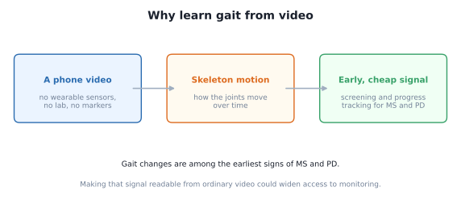
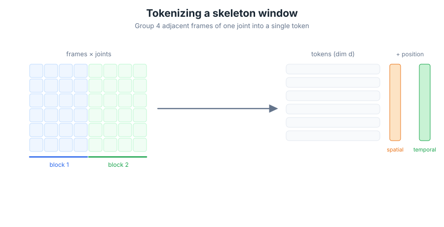
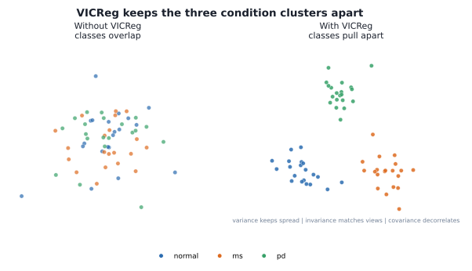
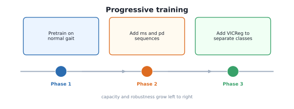
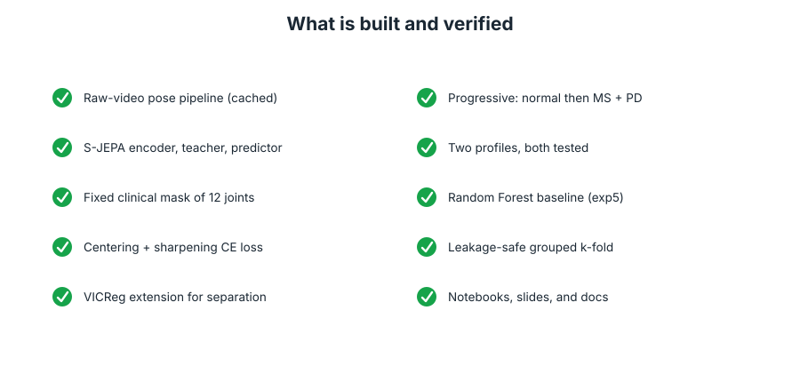
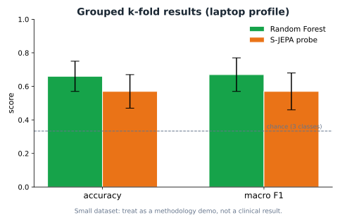
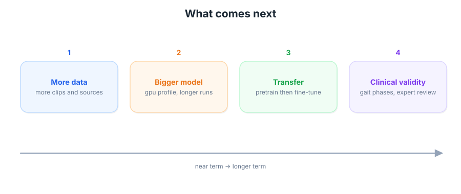

# Progress summary: learning gait from video with S-JEPA

_By Alexander Mui and Theodore Mui_

_This is a progress report on our project. We wrote it so that someone new to the topic can follow
along. It covers what we are trying to do, why we think it is interesting, what we have built so
far, how it works, what our first results look like, and what we want to try next. The pictures are
the same ones we use in the tutorial notebooks._

---

## 1. What we are trying to do

People who have multiple sclerosis (MS) or Parkinson's disease (PD) often walk differently from
people who do not. We wanted to see if a computer could pick up on those differences from a plain
video of someone walking. If it can, then maybe a regular phone video could help spot changes in
how someone walks, without needing a special lab.

We are testing a method called **S-JEPA**. It learns what walking looks like from videos that have
no labels, and then we use what it learned to sort walks into three groups: normal, MS, and PD. We
also built a more traditional machine learning model to compare against, so we can see how S-JEPA
does next to something simpler.

---

## 2. Why we picked this project

The usual way to measure how someone walks uses a lab with special cameras, markers on the body,
and sometimes plates in the floor. That is accurate, but it is slow and most people never get to
use it. A phone video does not need any of that. The tricky part is getting the computer to turn a
video into something useful, and then getting it to notice which movements matter.

There are two ways to teach the computer, and we tried both:

1. **Tell it what to measure.** A person decides on features like step length, walking speed, and
   joint angles, and the computer learns from those. This works well when you have good labels. This
   is our comparison model, a Random Forest.

2. **Let it learn on its own.** The model watches a lot of walking with no labels and figures out
   its own features. This is S-JEPA. The idea is that it can learn from cheap unlabeled video and
   still do okay even when there are not many labeled examples.

We wanted to build both and compare them in a fair way.

---

## 3. How S-JEPA works, step by step

S-JEPA does not look at the video pixels directly. It works with **skeletons**, which are 33 points
on the body in each frame, found by a pose detector. It learns by playing a hide-and-guess game.

- Hide some of the joints in the skeleton.
- Ask one part of the model to **guess the hidden joints**, but as features instead of exact
  positions. Guessing features instead of exact points helps it focus on the meaning of the motion
  rather than small jitters.
- The answers it checks against come from a slower copy of the model we call the **teacher**. The
  teacher only changes a little at a time. This keeps the model from taking the easy way out and
  turning every skeleton into the same boring answer.

First, though, each short clip of frames is cut into **tokens**. One token stands for how a single
joint moved over four frames. This is how a moving skeleton turns into a list the model can read.

---

## 4. Two things we did on purpose that are different

**We do not hide the joints that move the most.** The original S-JEPA hides the busiest joints. We
think that is the wrong choice for walking, because in MS and PD the important clue is often *less*
movement: shorter steps, stiffer knees, and less arm swing. So instead we always hide the **same
twelve joints** that clinicians told us matter: both shoulders and both full legs. Those are the
joints the model has to guess.

Here are the twelve joints. We got the list from `mapping-data/ms-pd-mapping.md` and removed the
repeats.

| Index | Joint | Index | Joint |
|---|---|---|---|
| 11 | LEFT_SHOULDER | 12 | RIGHT_SHOULDER |
| 23 | LEFT_HIP | 24 | RIGHT_HIP |
| 25 | LEFT_KNEE | 26 | RIGHT_KNEE |
| 27 | LEFT_ANKLE | 28 | RIGHT_ANKLE |
| 29 | LEFT_HEEL | 30 | RIGHT_HEEL |
| 31 | LEFT_FOOT_INDEX | 32 | RIGHT_FOOT_INDEX |

**We added something called VICReg.** VICReg is an extra rule that tries to push the three groups
apart in feature space, so a simple classifier has an easier time telling them apart. This is not
part of the original S-JEPA paper. We added it ourselves, and we point that out wherever we mention
it so nobody gets confused.

We also train in stages. First the model learns normal walking. Then we add MS and PD. Then we turn
on VICReg. Each stage gives the model a bit more to work with.

---

## 5. What we have built and checked

The list below all runs from start to finish. We also wrote a quick test that runs every notebook
in a tiny fast mode to make sure nothing is broken.

Here is what is in the project right now:

- A **pose step** that turns each of the 49 walking clips into a clean skeleton file we save to
  disk, reusing the pose code that was already in the `alexpose` project.
- A small, readable **S-JEPA model** with the encoder, the teacher, and the guesser, plus the loss
  from the paper.
- The **fixed twelve-joint mask** and the **VICReg** add-on.
- A **Random Forest** model built the same way as `experiments/exp5`, but for our three groups.
- A **fair testing setup** that splits the data by source video so we do not accidentally cheat.
- **Two model sizes**, a fast one for a laptop and a bigger one for a GPU. We checked that both run.
- **Seven notebooks**, a README, this progress report, a slide deck, and twelve diagrams.

---

## 6. How the whole thing fits together

The project is one pipeline that splits into two paths and then meets again for a fair test.

1. **Video to skeleton.** Sample each clip to about 15 frames per second, run the pose detector, and
   keep 33 joints per frame. Move each frame so the hips sit at the center and scale it by the body
   size, so the model looks at the shape of the walk and not where the person was standing.
2. **Skeleton to tokens.** Group four frames of a joint into a token and add position info.
3. **Learn features with S-JEPA.** Hide the twelve joints, guess them as features, use the slow
   teacher for answers, keep it stable with centering and sharpening, and spread the groups out with
   VICReg.
4. **Classify.** Freeze the trained model, turn each video into one feature vector, and train a
   simple classifier. At the same time, the Random Forest path turns each video into 82 hand-made
   features and trains a forest.
5. **Compare.** Both classifiers get the same splits and the same scoring.

One thing we had to be careful about: some clips are cut from the same longer video. If pieces of
one walk ended up in both training and testing, the scores would look better than they really are.
So we keep every piece of one source video on the same side of the split.

---

## 7. What our first results look like

Using the fast laptop model and the fair split (5-fold grouped cross-validation over the 47
usable videos), here is how the two models compare.

| Metric | Random Forest | S-JEPA probe |
|---|---|---|
| accuracy | 0.66 (give or take 0.09) | 0.57 (give or take 0.10) |
| macro F1 | 0.67 (give or take 0.10) | 0.57 (give or take 0.11) |
| macro precision | 0.76 (give or take 0.11) | 0.61 (give or take 0.12) |
| macro recall | 0.67 (give or take 0.11) | 0.60 (give or take 0.13) |

Here is how each fold went, since the average hides a lot on a set this small:

| Fold | Test videos | Random Forest (acc / F1) | S-JEPA (acc / F1) |
|---|---|---|---|
| 0 | 10 | 0.80 / 0.83 | 0.70 / 0.75 |
| 1 | 10 | 0.70 / 0.71 | 0.50 / 0.47 |
| 2 | 9 | 0.67 / 0.63 | 0.56 / 0.53 |
| 3 | 9 | 0.56 / 0.56 | 0.44 / 0.45 |
| 4 | 9 | 0.56 / 0.61 | 0.67 / 0.65 |

A few honest notes on these numbers:

- On average the Random Forest scores higher than the small S-JEPA model. That did not surprise us.
  With only a few dozen videos that all have labels, a simple model with good hand-made features is
  hard to beat, and the S-JEPA model here is small and trained for only a short time.
- It is not a clean sweep, though. S-JEPA actually did better on fold 4, and it was close behind on
  fold 0. So the gap is real on average but it is not the same story on every split.
- The test is fair. Both models saw the same splits and were scored the same way, and neither one
  saw a walk that was split across training and testing.
- The dataset is small, so the numbers move around a lot. We have about 35 different source videos,
  so when a few of them switch sides in the split, the score can change by several points. We treat
  these numbers as a first check that everything works, not as a final answer about which method is
  better.
- We also measured how well the S-JEPA features form separate clusters using a silhouette score,
  and it came out slightly negative (about -0.07). That tells us the three groups are not cleanly
  separated in feature space yet, which lines up with the modest accuracy. It is one more reason we
  think the model needs more data and more training rather than a change in method.
- We think S-JEPA has the most room to grow when there is more unlabeled video to learn from, or
  when there are fewer labels to go around. Our capstone notebook has a small experiment that starts
  to look at that.

---

## 8. What we want to try next

1. **Get more data.** This is probably the most important thing. More clips for each group, and more
   different source videos, would make the numbers steadier and give S-JEPA a better chance.
2. **Use a bigger model.** Run the GPU-sized model with more training. The code already lets us
   switch to it by changing one setting.
3. **Try transfer learning.** Train S-JEPA on a large public set of general movement videos first,
   then fine-tune it on walking. This is the kind of setup where self-supervised models often do
   better.
4. **Check that it makes clinical sense.** Try different choices of which joints to hide, add
   features for the phases of a step like heel-strike and toe-off, and ask experts to look at what
   the model picks up on.

---

## 9. Where to look in the project

- Start with the [README](../README.md) and the notebooks numbered `00` through `06`.
- The model and data code is in `sjepa/`.
- The diagrams in this report are in `images/`, and the slides are in `slides/`.
- The list of joints we hide comes from `mapping-data/ms-pd-mapping.md`.

To sum up: the pieces are built and tested, the comparison is fair, and our main plan for a better
result is more data and a bigger model rather than changing the method.
