<div class="eyebrow">A VISUAL TUTORIAL THROUGH NOTEBOOKS 00–06</div>

# Geometry, symmetry, and learned representations of gait

How do we test whether a video model captures useful movement information?

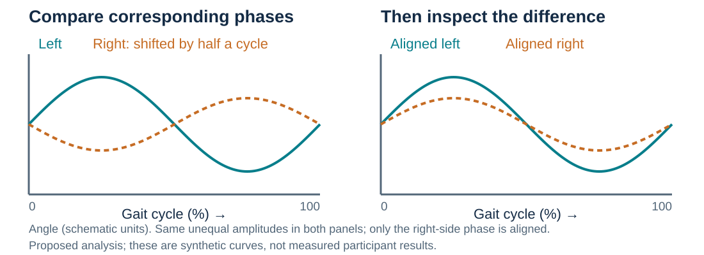

<!--
Geometry supplies a language for describing articulated movement: angles describe relationships between body segments, and symmetry compares corresponding movements on the two sides. A joint embedding predictive architecture, abbreviated JEPA, trains a model to predict hidden feature vectors rather than reconstruct every input coordinate. We ask whether that approach produces useful representations for separating three video labels: normal, multiple sclerosis and Parkinson's disease. Those labels belong to the available collection and should not be equated with independently verified diagnoses. The curves are synthetic teaching illustrations. No gait-cycle alignment or symmetry score has been measured in the retained notebook outputs. The tutorial follows the questions that organize all seven top-level notebooks and the frozen reference artifacts.
-->

---

<div class="eyebrow">MOTIVATION · WHY GEOMETRY?</div>

## Movement is a relationship between body parts

<div class="cards">
<div class="card"><h3>Angles describe posture</h3><p>The bend of a knee depends on the thigh and shin together. Its projected angle survives translation and uniform image scaling.</p></div>
<div class="card"><h3>Timing describes walking</h3><p>Left and right legs usually alternate. Comparing them requires matching corresponding phases of the gait cycle.</p></div>
<div class="card warm"><h3>Health motivates the question</h3><p>PD can involve unequal arm swing. MS can alter coordination between joints. The pattern varies between people.</p></div>
</div>

<p class="small">Clinical motivation comes from separate gait studies; these mechanisms have not been established in our video collection.</p>

<!--
A knee angle in a projected 2D skeleton is unaffected by translating every joint or applying one common scale factor, although camera viewpoint can change the apparent angle. Symmetry is useful because the body has paired limbs, but the limbs alternate during walking, so useful comparisons need phase alignment. Lewek and colleagues measured greater arm-swing asymmetry in a small early-PD cohort. Pau and colleagues studied altered lower-limb coordination in people with MS. These studies motivate questions rather than supply labels or effect sizes for this dataset. Neither condition guarantees a particular asymmetry, and unequal movement alone is not condition-specific. Sources: https://pubmed.ncbi.nlm.nih.gov/19945285/ and https://pubmed.ncbi.nlm.nih.gov/35305428/.
-->

---

<div class="eyebrow">FIRST QUESTION · WHAT WOULD SYMMETRY MEAN?</div>

## Compare the same movement phase on both sides


<p class="caption">An unequal curve could reflect movement, viewpoint, tracking error, or alignment error. Each explanation needs a control.</p>

<!--
Read the left panel as one hypothetical angle measured throughout a gait cycle. Matching limbs may be approximately half a cycle apart, so instantaneous subtraction can produce a large difference even for a symmetric alternating gait. In the right panel, phases are aligned before comparing amplitudes. A persistent difference would be a candidate asymmetry measure, not a diagnosis. Camera viewpoint, occlusion, tracking errors and phase alignment could also produce a difference. None of these synthetic curves came from retained data. The notebooks currently classify labels from pose-derived representations; measuring phase-aligned bilateral differences is proposed future work. This distinction keeps the physical motivation separate from what the experiment has tested.
-->

---

<div class="eyebrow">HYPOTHESIS · WHAT COUNTS AS PROGRESS?</div>

## Start with a comparison that can disappoint us

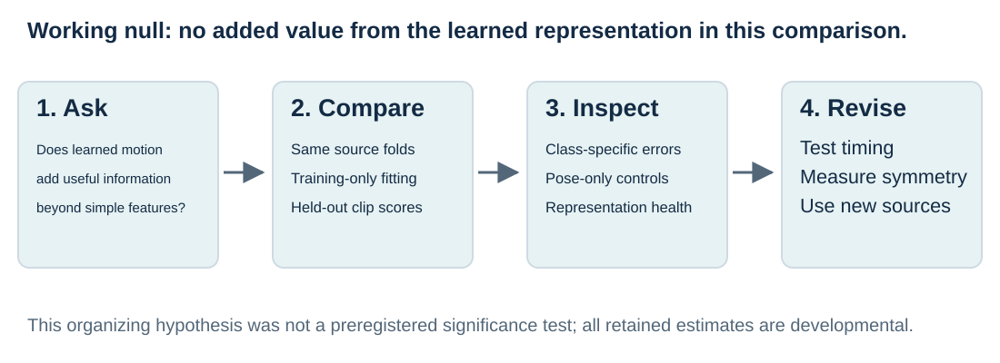

<p class="caption">We also ask whether a predictive signal depends on motion and symmetry, beyond pose summaries or recording cues.</p>

<!--
The working null is that the learned representation adds no predictive value over the specified simpler baseline under the same source-grouped evaluation. It organizes this tutorial retrospectively; the project did not preregister a formal null-hypothesis test or retain a calibrated significance result. A related mechanistic question asks whether any improvement requires temporal structure or bilateral relationships. That needs controls removing time order or comparing reflected and phase-aligned inputs. Current results permit descriptive comparisons and expose useful failure modes, but do not support rejection of a symmetry-specific null. The sequence is to define a question, make the comparison, inspect failures, and choose the next controlled experiment.
-->

---

<div class="eyebrow">THE ROUTE · SEVEN NOTEBOOKS, DISTINCT EVIDENCE</div>

## Follow the question from raw video to evaluation

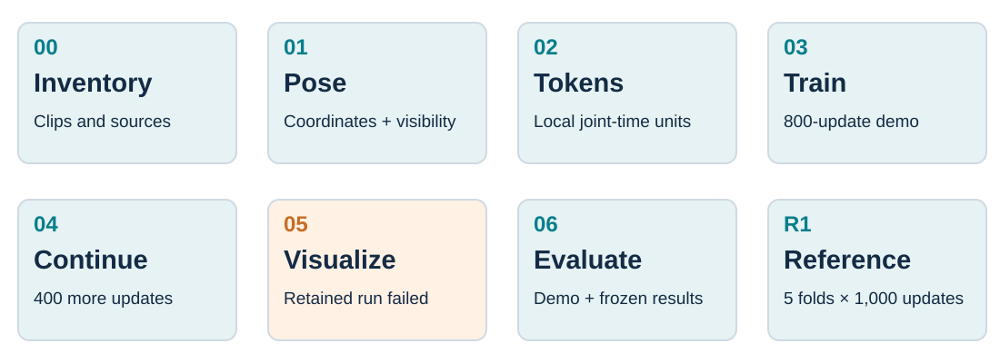

<p class="caption">Notebook demonstrations and the frozen five-fold reference answer different questions. Their scores stay separate throughout.</p>

<!--
Notebook 00 inventories and displays the videos. Notebook 01 extracts the pose cache. Notebook 02 explains joint-time tokenization and checks masks. Notebook 03 trains a repaired label-free model on fold-zero training sources. Notebook 04 initializes from those saved weights for additional training. Notebook 05 attempts to visualize embeddings, but its retained execution failed before producing the intended plots. Notebook 06 contains a separate live fold-zero comparison and reads saved five-fold reference artifacts. The filenames of notebooks 03 and 04 retain older references to normal-only pretraining and progressive VICReg; their current executed cells use the repaired all-class path. Sources: top-level notebooks 00–06 and artifacts/reviews/2026-09-13-notebook-evidence.md.
-->

---

<div class="eyebrow">STEP 1 · NOTEBOOK 00 · COUNT THE OBSERVATIONS</div>

## Forty-seven clips do not imply forty-seven people

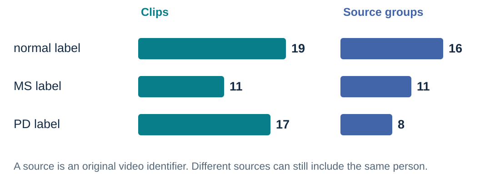

<p class="caption">The collection has 49 input clips from 37 sources; 47 clips have usable cached poses. Source identifiers are provisional units for splitting.</p>

<!--
The usable cache contains 19 normal-labelled clips from 16 sources, 11 MS-labelled clips from 11 sources, and 17 PD-labelled clips from eight sources: 47 clips and 35 distinct source identifiers. The inventory has 49 clips from 37 source identifiers; two exclusions leave the 47-clip cache. Several clips were cut from one original recording. Grouping them prevents adjacent portions appearing on opposite sides of a train/test split. Source grouping does not verify participant identity, and a person could occur in more than one source. PD clips are especially concentrated across few sources. Sources: notebook 00 retained outputs, notebook 01, artifacts/manifest_grouped.csv and artifacts/keypoints_index.parquet.
-->

---

<div class="eyebrow">STEP 2 · NOTEBOOK 01 · MAKE THE INPUT EXPLICIT</div>

## Convert video frames into estimated 2D skeletons

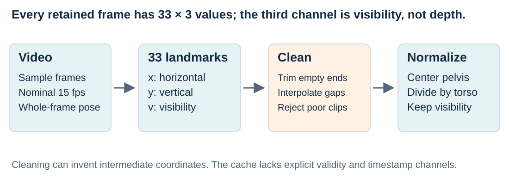

<p class="caption">The cache contains 8,693 frames and yields 481 model windows. Pose estimates remain subject to tracking and camera errors.</p>

<!--
Each frame has 33 landmarks with x and y coordinates plus visibility, which describes the estimator's confidence that a landmark is visible. It is not depth. Integer-stride sampling targets a nominal 15 fps, so actual retained intervals can differ between videos. Cleaning rejects sequences below a finite-coordinate threshold, trims empty ends and linearly interpolates missing values. The code does not cap interpolation gap length or retain an explicit per-frame validity mask. These operations create numerical inputs but do not preserve every physical trajectory in the video. The cache has 8,693 frames and 481 windows: 92 normal, 167 MS and 222 PD. Sources: sjepa/data.py and the notebook evidence ledger.
-->

---

<div class="eyebrow">STEP 3 · NOTEBOOK 01 · DEFINE THE GEOMETRY</div>

## Normalize position and scale within each frame

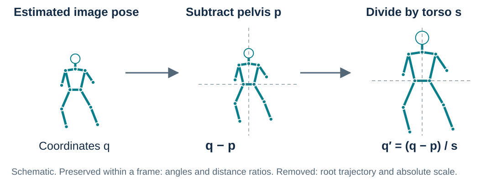

<p class="caption">The same subtraction and scale apply to every joint in a frame, preserving its 2D angles and distance ratios.</p>

<!--
The pelvis is the hip-landmark midpoint. Torso scale is the distance from this midpoint to the shoulder midpoint, clipped away from zero. Every x/y coordinate q becomes (q minus pelvis) divided by that single scale. Translation cancels in joint-to-joint vectors, and uniform positive scaling cancels in angles or ratios of lengths. That is the precise shape-preservation claim. It removes the pelvis trajectory and changes scale independently from frame to frame. Perspective, foreshortening and pose errors remain. Visibility values are untouched. The diagram uses a synthetic skeleton to illustrate the operation, rather than document participant geometry. Source: sjepa/data.py:normalize_sequence.
-->

---

<div class="eyebrow">SHAPE CHECK · WHAT SURVIVES EACH OPERATION?</div>

## Fixed tensor dimensions do not ensure physical fidelity

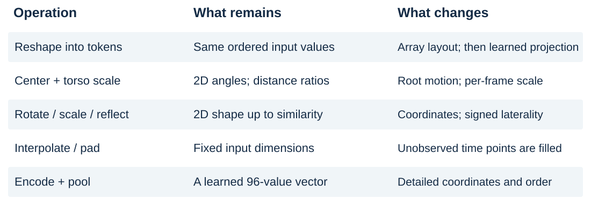

<p class="caption">We preserve a defined representation of the data. Exact preservation of the original dataset's geometry is not established.</p>

<!--
Array shape differs from geometric shape. Reshaping four frames of one joint retains ordered values, while the learned projection changes their representation. Normalization preserves restricted 2D relationships; interpolation fills coordinates where observations are missing. Three short clips require 17, 3 and 6 repeated final frames. Augmentation applies one rotation, translation, scale and possible reflection across each window, preserving coherent timing but changing coordinates. Reflection also relabels paired landmarks and changes signed laterality. Encoding and mean pooling compress information without an exact reconstruction guarantee. These limits matter when interpreting a score as evidence about physical movement. Sources: sjepa/data.py, sjepa/tokenizer.py, sjepa/augment.py and sjepa/models.py.
-->

---

<div class="eyebrow">STEP 4 · ESTABLISH THE TRAIN / TEST BOUNDARY</div>

## Assign sources before fitting or sampling windows

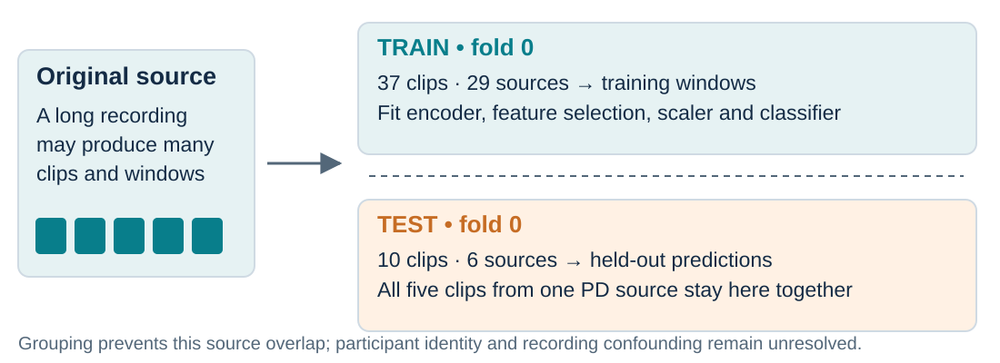

<p class="caption">All training, including label-free pretraining, excludes the held-out sources. Both model branches share this boundary.</p>

<!--
The registered evaluation uses five StratifiedGroupKFold partitions, shuffled with seed 42. Stratification attempts class balance; grouping keeps all clips from a source together. Fold zero has 37 training clips from 29 sources, yielding 395 windows, and ten test clips from six sources, yielding 86 windows. Five PD test clips share one source. The current notebook 03 objective does not read labels, but still excludes every held-out source from representation training. Scalers, classifiers and the RF variable-column filter fit on training values only. The estimate remains developmental because the collection has been inspected, source identities do not establish unique people, and acquisition conditions may be confounded. Source: artifacts/eval/g1/fold_registry.json.
-->

---

<div class="eyebrow">STEP 5 · NOTEBOOK 02 · TURN MOTION INTO TOKENS</div>

## Give the model small, ordered joint-time patches

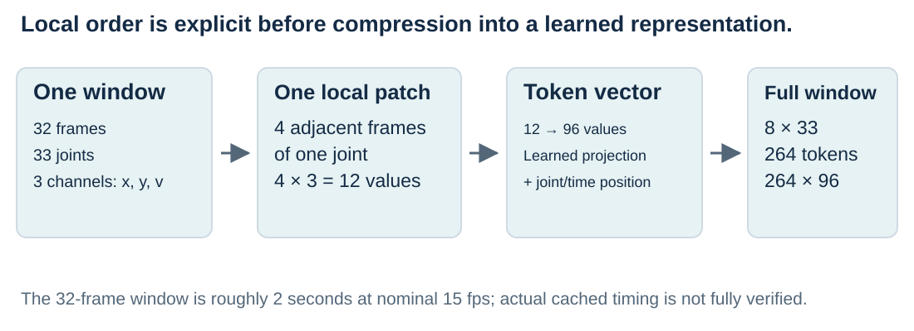

<p class="caption">A token represents four adjacent observations of one joint. Position vectors identify its joint and time block.</p>

<!--
The laptop model takes 32 frames, 33 joints and three channels. Groups of four frames give eight time blocks. One patch contains four times three, or 12, numbers from a single joint. A learned linear projection maps them to width 96, and spatial and temporal embeddings identify the patch. The full window has eight times 33, or 264, tokens. The input therefore retains explicit joint identity and local time order; the final pooled representation has no demonstrated guarantee of preserving every relevant sequence feature. Duration would be 2.13 seconds at a true 15 fps, but cached sampling does not establish equal physical duration in every source. Sources: notebook 02, sjepa/tokenizer.py and sjepa/config.py.
-->

---

<div class="eyebrow">STEP 6 · NOTEBOOK 02 · RECONSIDER THE MASK</div>

## Let joints alternate between evidence and targets

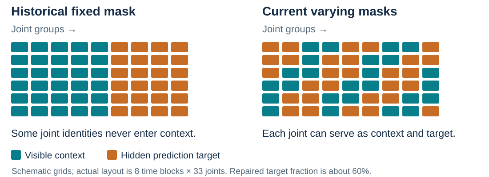

<p class="caption">The repaired sampler hides varying anatomical regions over time. The earlier fixed mask withheld the same twelve joints on every update.</p>

<!--
The original tutorial repeatedly hid both shoulders and the complete legs, excluding those joint identities from student context on every update. This was a structural restriction, not validation of a clinical masking hypothesis. The repaired sampler varies selections by example, growing anatomically connected regions across time spans and targeting approximately 60 percent of tokens. Every joint can serve as visible context and as a hidden target across masks. At least one clinically designated cue remains visible. The drawing abbreviates the actual eight-by-33 grid. Across the retained 512-mask bank, mean target-token fraction is 0.63. Every joint is visible at least once within at least 74% of masks and targeted at least once within at least 81%; these overlap because a joint can change role across time. Coverage verifies sampler behavior, not disease-specific benefit or superiority to motion-aware masking. Sources: sjepa/masking.py, sjepa/masking_v2.py and notebook 02.
-->

---

<div class="eyebrow">STEP 7 · REPAIR AN AMBIGUOUS PREDICTION TASK</div>

## Tell the predictor which hidden position to fill

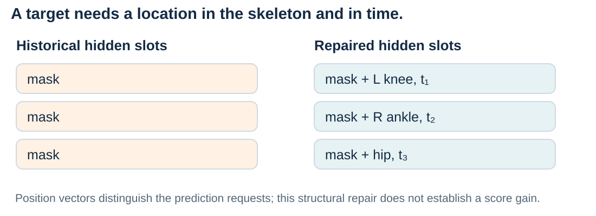

<p class="caption">A shared mask token needs joint and time information, so different missing positions can request different predictions.</p>

<!--
The historical predictor received an identical learned mask token in each hidden slot without a target-position signal. The architecture's permutation symmetry could make those prediction requests indistinguishable. PredictorV2 adds a learned vector for each joint and time position, distinguishing a left-knee patch early in the window from a right-ankle patch later. Correctness tests inspect these structural properties and gradients. Better specification of the task does not itself establish a downstream score improvement. The fixed-mask implementation, frozen repaired reference and current trainer differ in several details, preventing causal attribution of score changes to this single repair. Sources: sjepa/models.py:PredictorV2, sjepa/tests/test_correctness.py and docs/03-0802-PHASE_LEDGER.md.
-->

---

<div class="eyebrow">STEP 8 · NOTEBOOK 03 · LEARN WITHOUT CONDITION LABELS</div>

## Predict a hidden part of the teacher's representation

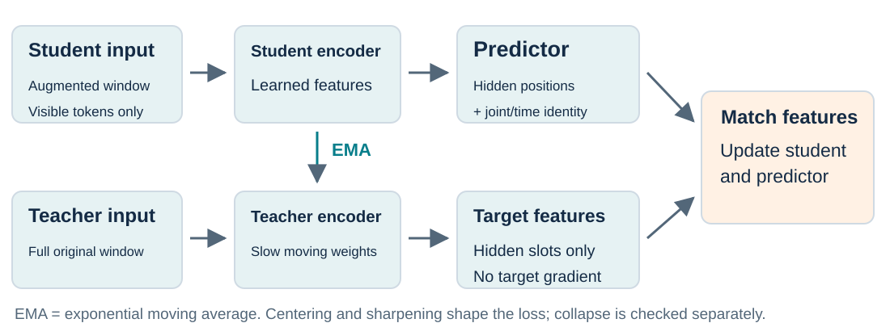

<p class="caption">JEPA matches feature vectors. Its targets come from a slowly updated teacher, rather than clinical labels.</p>

<!--
The student sees an augmented window with tokens hidden. Its predictor estimates teacher features at those hidden positions. The teacher encodes the full unaugmented window, with its outputs detached from gradients, and follows an exponential moving average (EMA) of student weights. Centering subtracts a running average of teacher outputs; sharpening concentrates target distributions through a temperature. These mechanisms affect training stability, but do not independently guarantee against collapse. We inspect feature spread and held-out probes separately. Current train_v2 updates the center once per batch. The frozen reference predates that final correction. Sources: sjepa/models.py, sjepa/losses.py and sjepa/train_v2.py. Method: https://www.ecva.net/papers/eccv_2024/papers_ECCV/papers/04755.pdf.
-->

---

<div class="eyebrow">STEP 9 · NOTEBOOK 03 · CONTROL TRAINING EXPOSURE</div>

## Keep a long recording from dominating the updates

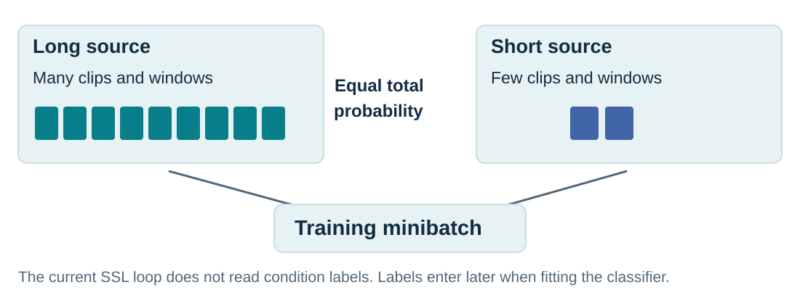

<p class="caption">Each training source receives equal total sampling probability. The selected windows retain their defined dimensions.</p>

<!--
Overlapping windows from long recordings would dominate uniform window sampling. The repaired trainer instead assigns inverse source-window-count weights, giving each source equal expected total probability. Sampling is with replacement, and actual source exposure is recorded. This does not depend on condition labels: all permitted training classes enter SSL, but labels are unused in sampling and loss. Labels enter later when fitting the classifier. Sampling does not generate new people or make overlapping windows independent. Augmentation applies one geometric transformation per window; the clinical appropriateness of the imposed invariances still needs testing. Sources: sjepa/train_v2.py:_source_uniform_weights and notebook 03.
-->

---

<div class="eyebrow">OBSERVATION 1 · NOTEBOOK 03 · OPTIMIZATION</div>

## Loss falls while the representation retains variation

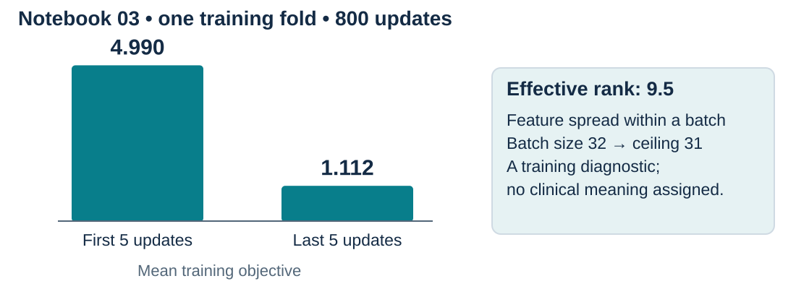

<p class="caption">This retained 800-update demonstration uses 395 windows from 29 training sources. Loss reduction alone does not establish useful gait features.</p>

<!--
In notebook 03's retained full-profile execution, mean loss over the first five updates is 4.990 and over the last five is 1.112. The diagram summarizes those observed intervals without inventing an intervening curve. Final batch effective rank is approximately 9.5. This diagnostic summarizes the spread of singular values in the centered feature matrix. With batch size 32 and width 96, its rank ceiling is 31, so comparing 9.5 directly with 96 would be misleading. It indicates variation rather than complete collapse in that batch, without measuring meaningful symmetry or new-source feature quality. Sources: 03_sjepa_model_and_pretrain_normal.ipynb and artifacts/reviews/2026-09-13-notebook-evidence.md.
-->

---

<div class="eyebrow">OBSERVATION 2 · NOTEBOOK 04 · DOES MORE TRAINING HELP?</div>

## The held-out probe stays at the same score

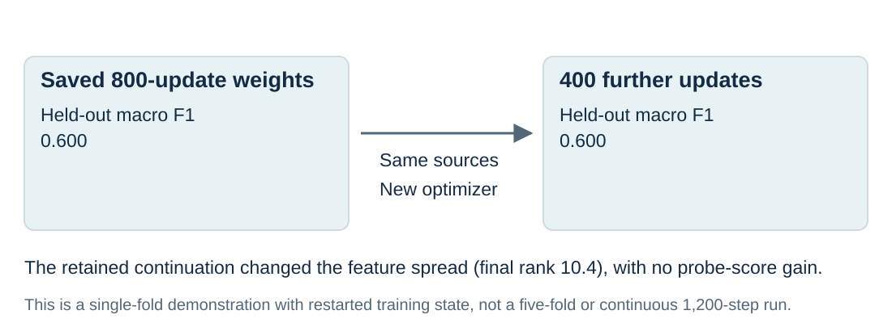

<p class="caption">The before/after result separates optimization activity from improvement on the selected evaluation task.</p>

<!--
Notebook 04 loads the saved 800-update weights and performs 400 more updates on the same fold-zero training sources. It does not pass resume_state, so optimizer state, center, random streams and schedules restart. This is additional training from weights rather than an uninterrupted 1,200-update run. Frozen probes on the ten held-out clips give macro F1 0.600 before and after. Final batch effective rank is about 10.4, but comparison with the earlier 9.5 involves different batches and stages rather than a controlled capacity measurement. The unchanged score supplies no observed benefit in this demonstration, and the single small fold leaves substantial uncertainty. Source: 04_progressive_finetune_ms_pd_vicreg.ipynb.
-->

---

<div class="eyebrow">LESSON FROM AN EARLIER APPROACH</div>

## Class separation can enter through the training objective

<div class="cards">
<div class="card warm"><h3>Historical progressive route</h3><p>Normal-only pretraining was followed by MS/PD stages and a class-aware VICReg extension. Condition labels influenced the representation objective.</p></div>
<div class="card"><h3>Current notebook route</h3><p>All eligible training sources enter label-free JEPA training. Labels fit a separate classifier to frozen clip embeddings.</p></div>
</div>

<p class="rule">A claim that earlier clusters emerged without label information would overstate what that training procedure tested.</p>

<!--
The retained historical VICReg-derived extension used pooled embeddings and class labels, including a class-aware term. It was not wholly label-free representation learning. VICReg stands for variance, invariance and covariance regularization: maintaining spread, matching chosen views, and reducing redundant dimensions. The project's class-aware use differs from that general formulation. Current notebooks 03 and 04 call the repaired label-free trainer despite their older filenames. The old capstone score near 0.570 also belongs to a different protocol, so comparison against 0.438 cannot isolate the effect of one repair. Sources: sjepa/train.py, sjepa/losses.py and artifacts/capstone_results.json. VICReg: https://arxiv.org/abs/2105.04906.
-->

---

<div class="eyebrow">STEP 10 · NOTEBOOK 05 · CHECK WHETHER THE PLOT EXISTS</div>

## The retained visualization run stopped before its results

<div class="cards">
<div class="card warm"><h3>Observed execution</h3><p>A loading cell raised <code>FileNotFoundError</code>. The intended embedding plots and downstream metrics were not executed.</p></div>
<div class="card"><h3>What can be concluded</h3><p>The saved run supplies no current cluster evidence. Checkpoints now exist, but the notebook still needs a successful rerun.</p></div>
</div>

<p class="rule">A two-dimensional embedding plot would remain exploratory after a successful execution; held-out prediction and explicit symmetry tests are still needed.</p>

<!--
The retained output failed when loading artifacts/sjepa_ssl.pt. This describes execution history rather than today's workspace: initial and continued checkpoint files are now present. The saved notebook nevertheless has no successful visualization execution using them, and its downstream metrics cannot supply new findings. Future plots should name the checkpoint and training sources, distinguish labels used for coloring from labels used for fitting, and avoid interpreting dimensionality reduction as preserving all feature distances. Separated colored points alone are neither a generalization test nor a measured asymmetry result. Source: 05_representation_visualization.ipynb's retained error and subsequent unexecuted cells.
-->

---

<div class="eyebrow">STEP 11 · NOTEBOOKS 04 / 06 · MAKE A CLIP PREDICTION</div>

## Freeze the encoder, then fit a small classifier

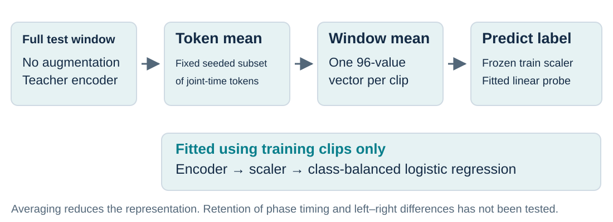

<p class="caption">A linear probe is a classifier fitted to fixed features. It measures whether those features support the chosen labels.</p>

<!--
The teacher encodes each full unaugmented window. The readout averages positions chosen by a fixed seed-zero mask, then averages window vectors into one 96-value clip vector. Its 161 selected tokens out of 264 include all 33 joints at some times; this is not the historical twelve-joint mask. The scaler and class-balanced logistic-regression classifier fit on training clip vectors and labels. Test vectors only undergo those fitted transformations and prediction. Pooling can discard phase relationships, fine timing or signed asymmetry, and the amount retained has not been measured. Sources: scripts/scripts_r1_repaired.py:embed_records/run_fold and notebook 06's embedding cells.
-->

---

<div class="eyebrow">STEP 12 · NOTEBOOK 06 · BUILD THE PAIRED BASELINE</div>

## Compare learned vectors with simple angle summaries

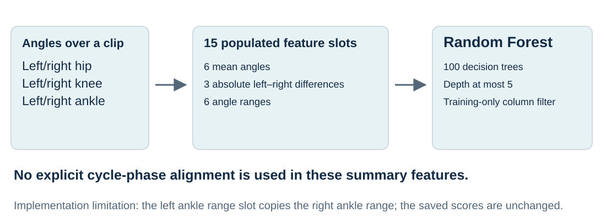

<p class="caption">Both branches use the same clips and source folds. The baseline summarizes angles; JEPA uses joint coordinates and visibility.</p>

<!--
The classical branch derives angles from cached pixel coordinates and supplies summaries to a 100-tree RF with maximum depth five. Its constructor populates 15 core slots: six bilateral hip/knee/ankle means, three absolute differences between left and right means, and six ranges. Column selection, scaling and fitting use training values only. Additional reserved fields do not mean cadence, speed or stride were measured. Review found that the left ankle range copies the right ankle range, limiting bilateral interpretation. Saved results remain unchanged; correcting this feature requires a separately identified rerun. Sources: sjepa/classical.py and ambient/classification/features.py.
-->

---

<div class="eyebrow">EVIDENCE CHECK · WHICH RUN DOES A SCORE DESCRIBE?</div>

## Keep training budget and test coverage beside the score

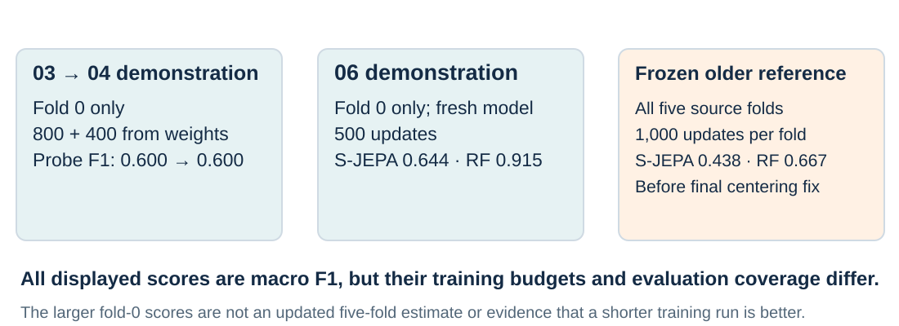

<p class="caption">The current corrected trainer has notebook demonstrations. Its final centering repair has no retained five-fold rerun.</p>

<!--
The 03-to-04 sequence uses one fold, 800 updates followed by 400 from weights, and scores 0.600 both times. Notebook 06 separately trains a fresh 500-update fold-zero model, yielding S-JEPA 0.644 and RF 0.915 macro F1. The frozen five-fold reference trains 1,000 updates per fold and pools scores of 0.438 and 0.667. It includes architectural repairs but predates once-per-batch centering, so it is not the current trainer's rerun performance. Differences may reflect training state, objective, initialization, sampling and coverage. Sources: notebooks 03/04/06; artifacts/runs/r1_g1_1k_s42/results.json; docs/03-0802-PHASE_LEDGER.md.
-->

---

<div class="eyebrow">STEP 13 · DEFINE THE SCORE BEFORE READING IT</div>

## Give each label equal weight in macro F1

<div class="cards">
<div class="card"><h3>Accuracy</h3><p>Count correct clip predictions and divide by all clips. A source with several clips contributes several decisions.</p></div>
<div class="card"><h3>Per-class F1</h3><p>Combine precision and recall. Precision asks how often a label's predictions are right; recall asks how many of its clips are found.</p></div>
<div class="card warm"><h3>Macro F1</h3><p>Average the three class F1 scores equally. A large class cannot dominate this average through its clip count alone.</p></div>
</div>

<p class="small">Pooled results combine one held-out prediction per clip. A mean across fold scores is a different summary; fold spread is not a confidence interval.</p>

<!--
For each class, precision is correct class predictions divided by all predictions assigned to that class, and recall divides by all clips actually carrying that label. F1 is twice their product divided by their sum, with zero-handling in the evaluation routine. Macro F1 gives each class one-third weight; accuracy counts each clip equally. Pooled scoring combines one held-out prediction per clip before calculating the metric. Averaging five fold scores weights observations differently. There is no universal one-third macro-F1 chance threshold for this imbalanced sample; chance requires a specified dummy or permutation protocol. Sources: sjepa/eval.py and retained result JSON files.
-->

---

<div class="eyebrow">OBSERVATION 3 · FROZEN FIVE-FOLD REFERENCE</div>

## The retained learned representation trails the angle baseline

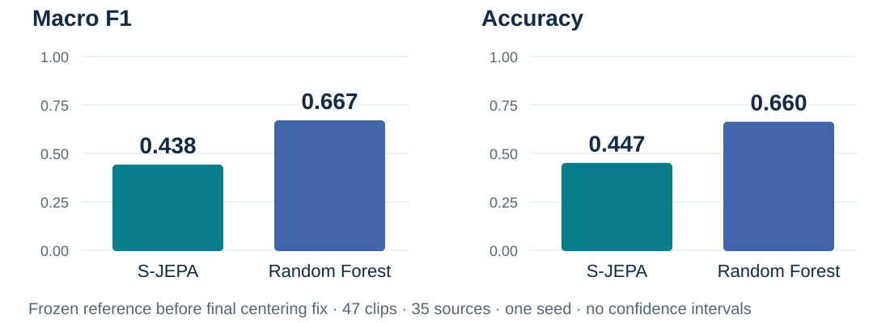

<p class="caption">The descriptive macro-F1 difference is −0.228 for S-JEPA relative to Random Forest. No group-aware confidence interval has been retained.</p>

<!--
The frozen reference supplies predictions for all 47 clips across five registered folds. S-JEPA macro F1 is 0.438402 and accuracy 0.446809; RF macro F1 is 0.666573 and accuracy 0.659574. Subtracting RF F1 from S-JEPA F1 gives approximately minus 0.228. This comparison favors RF, without establishing that every JEPA variant is inferior, that one repair caused deterioration, or that final current code has the same score. The run predates final centering repair, uses one seed, and reuses an inspected collection. No source-bootstrap or participant-aware confidence interval appears in its artifacts. Source: artifacts/runs/r1_g1_1k_s42/results.json and oof.json.
-->

---

<div class="eyebrow">STEP 14 · EXAMINE THE ERRORS BY LABEL</div>

## The PD-labelled clips expose a large weakness

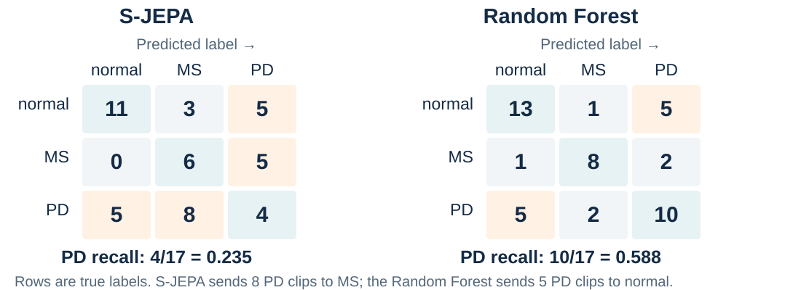

<p class="caption">S-JEPA correctly labels 4 of 17 PD clips; Random Forest correctly labels 10. These clips come from eight PD sources.</p>

<!--
Rows are true video labels and columns predicted labels, ordered normal, MS, PD. Diagonals count correct predictions. S-JEPA gets 11 normal clips, six MS clips and four PD clips correct; its largest off-diagonal error is eight PD clips assigned to MS. RF gets 13 normal, eight MS and ten PD clips correct, with five PD clips assigned to normal and two to MS. A single macro score obscures these differences. These counts involve source-correlated clips rather than independent patients; the errors do not establish shared disease physiology or a learned clinical relationship between PD and MS. Source: artifacts/runs/r1_g1_1k_s42/results.json.
-->

---

<div class="eyebrow">STEP 15 · ASK WHAT INFORMATION IS SUFFICIENT</div>

## Strong predictions survive without ordered motion

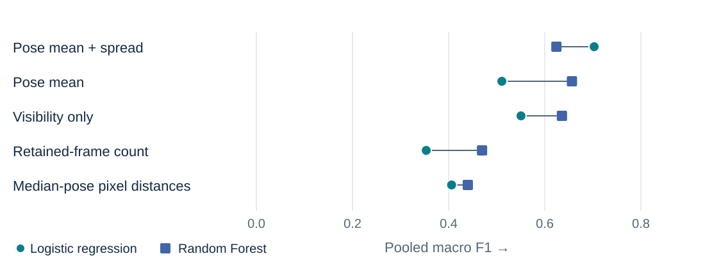

<p class="caption">Pose mean and spread reach 0.703 with logistic regression. Visibility alone reaches 0.636 with RF, warranting closer acquisition controls.</p>

<!--
Both saved classifiers are displayed: logistic regression as circles, RF as squares. Mean-plus-standard-deviation pose gives 0.702745 and 0.624178 pooled F1; mean pose gives 0.510720 and 0.656511; visibility gives 0.550538 and 0.635720; retained frame count gives 0.353384 and 0.469499; raw pixel distances gives 0.406165 and 0.439900. Means and spreads discard order but retain posture and amplitude information. Visibility may reflect viewpoint, recording quality and movement-related occlusion. These descriptive results indicate several predictive pathways without proving a causal shortcut. Neither choosing the larger score nor inspecting multiple controls creates a newly validated model. Source: artifacts/eval/g1/E0_results.json:shortcut_controls and scripts/scripts_phase0_provenance.py.
-->

---

<div class="eyebrow">INTERPRETATION · WHAT DOES THE CONTROL CHANGE?</div>

## Label prediction leaves the mechanism unresolved

<div class="cards">
<div class="card"><h3>Observed</h3><p>Averaged pose features and visibility summaries predict many held-out clip labels in this source-grouped collection.</p></div>
<div class="card warm"><h3>Plausible explanations</h3><p>Posture, movement amplitude, camera view, tracking quality and source selection may each contribute to the scores.</p></div>
<div class="card"><h3>Needed comparison</h3><p>Match acquisition conditions and remove a specific type of information, such as frame order, before attributing its contribution.</p></div>
</div>

<p class="rule">The strongest saved simple control exceeds the angle RF. Describing the angle baseline as strongest overall would be inaccurate.</p>

<!--
The pose mean-and-spread control predicts labels without knowing frame order, weakening any inference that classification alone proves a temporally structured mechanism. Yet standard deviations retain amplitude information, and means may contain meaningful posture as well as acquisition differences. A visibility-only result likewise cannot identify which cue mattered without matched sources and pose review. A useful next experiment changes one mechanism while fixing classifier, folds, budget and nuisance conditions. Several control/classifier combinations have been inspected, so the largest value is not an unbiased validation of a selected model. Source: artifacts/eval/g1/E0_results.json and scripts/scripts_phase0_provenance.py.
-->

---

<div class="eyebrow">STEP 16 · MATCH THE INFERENCE TO THE SAMPLE</div>

## Grouping improves evaluation, but uncertainty remains

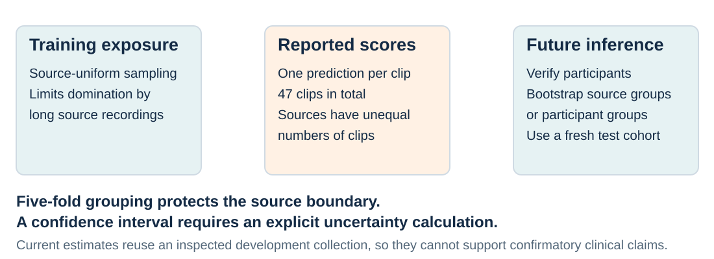

<p class="caption">Source grouping addresses recording overlap. Verified participant identities and an untouched cohort would support stronger generalization claims.</p>

<!--
The encoder trains on windows, exposure is equalized by source, and metrics count clips. A source with multiple test clips consequently carries more pooled-score weight despite being correctly grouped. Training folds overlap, so their spread is not uncertainty from five independent experiments. Group-aware bootstrap or another prespecified method should use sources or verified participants and preserve prediction pairing. No such interval is retained. The collection has also informed model choices and error inspection, preventing its use as an untouched confirmatory cohort. Source grouping is an implemented protection; participant identity, acquisition matching and final inference remain unfinished. Sources: fold_registry.json, oof.json and evaluation code.
-->

---

<div class="eyebrow">WHAT THE EXPERIMENT HAS ESTABLISHED</div>

## Separate implementation checks from physical claims

| Question | Retained evidence | Interpretation |
|---|---|---|
| Can repaired training run? | Loss falls; batch features vary | The objective can be optimized |
| Did further fold-0 training help? | Macro F1 stays 0.600 | No observed probe gain |
| Does frozen S-JEPA beat angle RF? | 0.438 versus 0.667 | Reference favors angle RF |
| Is the signal uniquely temporal? | Pose summaries reach 0.703 | This control needs no frame order |
| Has symmetry been measured? | No aligned bilateral or reflection result | Physical mechanism remains open |

<!--
A successful loop with nonconstant embeddings establishes implementation behavior. A held-out classifier tests information for specific labels under a defined split. Neither operation measures physical symmetry or establishes diagnosis. Unchanged probe scores after more training and weak frozen five-fold performance are useful negative results: optimization and architectural complexity do not automatically improve the task. Strong order-free controls motivate direct tests of information sources. The frozen-reference row retains the centering-version limitation. All numerical claims derive from notebook outputs or saved JSON; the deck was prepared without new model training.
-->

---

<div class="eyebrow">NEXT HYPOTHESES · TEST THE PHYSICS DIRECTLY</div>

## Measure reflection, temporal order and aligned asymmetry

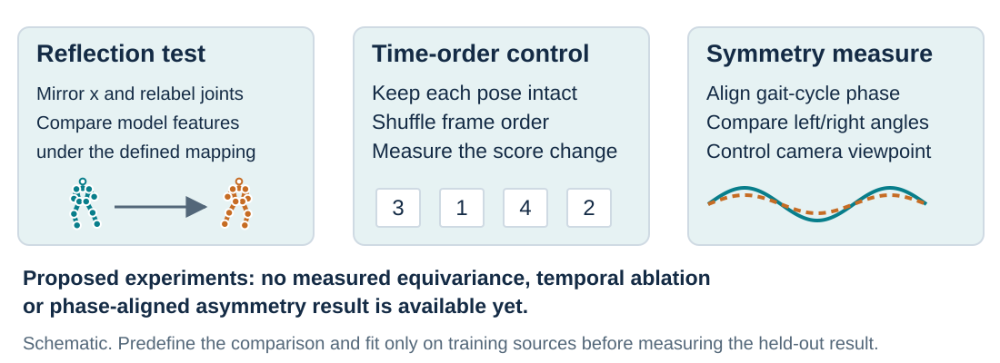

<p class="caption">Equivariance means an input transformation produces a defined corresponding output transformation. The network has no demonstrated guarantee of it.</p>

<!--
Reflection augmentation mirrors x and exchanges paired joints, but does not mathematically impose reflection equivariance. A test must define the expected feature transformation and measure held-out discrepancy. Temporal shuffling preserves each pose while removing order; a paired score change could quantify temporal reliance, while requiring care because shuffling also changes smoothness. Phase-aligned angle analysis needs cycle extraction and explicit quality criteria. Every proposed experiment needs training-only selection and unchanged test grouping. None has a retained result here. They would connect the physical motivation to directly measured behavior rather than substituting label scores for a mechanism test.
-->

---

<div class="eyebrow">NEXT ITERATION · TURN LIMITATIONS INTO EXPERIMENTS</div>

## Resolve input quality before expanding the claims

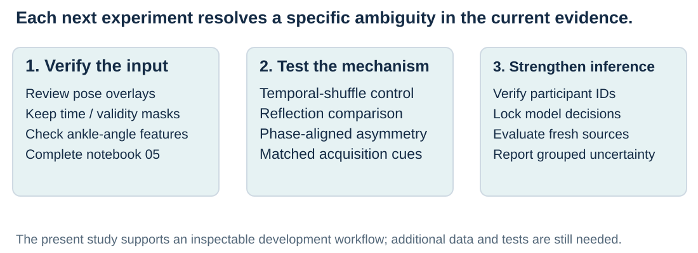

<p class="caption">A corrected five-fold rerun should identify the final centering logic and corrected feature construction before comparison with the frozen reference.</p>

<!--
First inspect pose overlays, preserve timestamps and validity masks, bound interpolation, and correct the ankle-range assignment before bilateral interpretation. Complete notebook 05 against identified checkpoints, labeling plots exploratory. Then run controlled temporal, reflection and phase-aligned comparisons with defined budgets and source restrictions. Finally verify participant identity, acquire matched or independent data, lock selection decisions and estimate group-aware uncertainty. A new five-fold run of final corrected code would answer a missing question and should remain separate from the frozen reference. Longer windows, larger encoders and label-efficiency claims similarly need new evidence. None is represented as already completed.
-->

---

<div class="eyebrow">REPRODUCE THE READING · KEEP THE EVIDENCE VISIBLE</div>

## Start with retained outputs, then run the intended protocol

```bash
# From experiments/multiple-sclerosis
uv run jupyter lab

# Rebuild the SVGs from saved evidence
python3 scripts/scripts_make_progress_diagrams.py
```

<div class="cards">
<div class="card"><h3>Notebook sequence</h3><p>00 → 01 → 02 establishes inputs.<br>03 → 04 trains and probes.<br>05 needs successful execution.<br>06 separates demo and reference.</p></div>
<div class="card warm"><h3>Saved reference</h3><p><code>artifacts/runs/r1_g1_1k_s42/</code><br>Read results, out-of-fold predictions and the run manifest together.</p></div>
</div>

<!--
The deck and report update evidence rather than retrain models. Notebook inputs depend on local videos, cache, profile and checkpoints. Notebook 06's five-fold values come from saved artifacts, while its separate executed demonstration trains another model. Inspect scripts/scripts_r1_repaired.py and the reference manifest before reproducing that path; current code changed after the saved run. New executions should use a separate output directory with version and seed metadata. The diagram generator reads saved JSON for result charts and labels teaching sketches schematic. slides/README.md contains export instructions and details of the source and speaker notes.
-->

---

<div class="eyebrow">EVIDENCE AND READING</div>

## A developing physical model needs measured physical tests

The workflow connects articulated pose to a trainable JEPA representation and a source-grouped evaluation. Retained comparisons expose limits in predictive performance and leave the contribution of symmetry unresolved.

<p class="small">Study evidence: <code>docs/08-0913-PROGRESS.MD</code>; notebooks 00–06; <code>artifacts/runs/r1_g1_1k_s42/results.json</code>; <code>artifacts/eval/g1/E0_results.json</code>. Detailed provenance appears in speaker notes.</p>

<p class="small">Clinical motivation: <a href="https://pubmed.ncbi.nlm.nih.gov/19945285/">Lewek et al., arm swing in early Parkinson's disease</a>; <a href="https://pubmed.ncbi.nlm.nih.gov/35305428/">Pau et al., lower-limb coordination in multiple sclerosis</a>.</p>

<p class="small">Methods: <a href="https://www.ecva.net/papers/eccv_2024/papers_ECCV/papers/04755.pdf">Skeleton-based JEPA, ECCV 2024</a>; <a href="https://arxiv.org/abs/2105.04906">VICReg</a>.</p>

<!--
Geometry gives precise language for inputs and proposed tests. Current evidence supports a smaller claim: repaired training can run, representations can be probed with source separation, and the frozen five-fold comparison favors a simple angle baseline. More training in one current demonstration did not improve the score, while strong pose and visibility controls leave the mechanism unresolved. The next iteration should test these ambiguities directly. The companion report accounts for all notebooks, method versions, successes, failures, provenance and review corrections. External literature motivates the direction without establishing mechanisms in this collection.
-->
