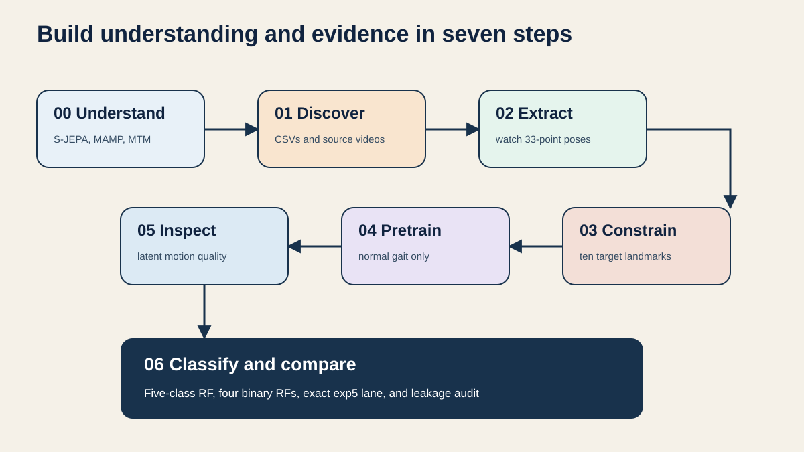

# GAVD3 S-JEPA gait tutorials

This folder is a progressive, executable course on adapting Skeleton Joint Embedding Predictive Architecture, or S-JEPA, to GAVD walking sequences. It starts with the learning objective, follows each CSV row back to its YouTube frame, extracts BlazePose skeletons, enforces a project-selected target set, pretrains on normal gait, inspects latent motion, and finishes with health-condition classifiers.

The implementation reproduces the core learning graph from the final ECCV 2024 paper. It is a paper-aligned reimplementation with documented GAVD adaptations, not official S-JEPA code. As of July 31, 2026, the project page does not link a public model implementation.

## What is intentionally different from the paper

The paper uses motion-aware masking over 3D NTU skeletons. This project must not use motion-aware masking. Every prediction target is sampled uniformly from the ten de-duplicated BlazePose landmarks below. No other landmark can be hidden from the view encoder or used in the loss. The full target encoder receives all 33 landmark tokens. The view encoder receives the tokens not selected as prediction targets.

GAVD supplies monocular video, so MediaPipe depth is relative and is not equivalent to calibrated 3D ground truth. The notebooks keep this limitation visible.

## Notebook order

|Notebook|What you learn and produce|
|---|---|
|00_sjepa_from_first_principles.ipynb|How S-JEPA differs from MAMP and the 2026 Nature MTM method. Walk through the view encoder, EMA target encoder, predictor, centering, sharpening, and latent cross-entropy.|
|01_gavd_manifest_and_youtube.ipynb|Build one manifest row per GAVD sequence, audit source-video concentration, download each unique YouTube video once, and preview the source walk.|
|02_extract_and_watch_skeletons.ipynb|Decode the annotated frame span, use the GAVD bbox to isolate the intended walker, extract 33-point poses, preserve failed frames, and watch video plus skeleton views.|
|03_neurologic_keypoint_masking.ipynb|Reproduce the required de-duplicated table and prove with assertions that masking cannot touch another joint.|
|04_pretrain_sjepa_on_normal.ipynb|Clean and normalize poses, build joint-time patches, train only on normal gait, update the target encoder by EMA, and monitor collapse diagnostics.|
|05_inspect_latent_motion.ipynb|Measure predicted-target similarity, retrieve nearest gait clips, and inspect distance from a normal reference.|
|06_capstone_health_condition_classifiers.ipynb|Freeze the target encoder, use validity-masked pooling, train on all 96 sequences, run four one-versus-normal Random Forests, reproduce the 68-row exp5 split, and audit leakage plus pose-detector missingness.|
|07_source_video_identity_audit.ipynb|Probe how much of the frozen latents is source-video identity, run source-grouped evaluation with correct majority controls, and measure the sequence-versus-source generalization gap.|
|08_gait_parameter_probing.ipynb|Compute gait parameters from the raw cached poses and probe the frozen 384-d latents for speed, cadence, asymmetry, excursion, sway, and gait phase against raw-coordinate and missingness baselines.|
|09_mask_geometry_ablation.ipynb|Train four mask samplers (neurologic-10, random-10, motion-aware-10, full-body-33) under matched compute and compare downstream classifiers, collapse diagnostics, and a cadence probe.|
|10_latent_world_model_forward_prediction.ipynb|Replace infilling with causal future prediction (world-model variant), evaluate per-horizon loss against a phase-bin baseline, and check out-of-distribution forecast error on abnormal clips.|

Each notebook repeats the code it needs. There is no runtime helper module and no hidden import from a previous notebook. Later notebooks require the checkpoint or pose artifacts produced by earlier notebooks, and they fail clearly when a real artifact is missing.

## De-duplicated neurologic prediction targets

This union comes from the final high-priority, region-specific tables in:

- penny/neuroscience/data/PD_keypoint_mapping.md
- penny/neuroscience/data/CP_keypoint_mapping.md
- penny/neuroscience/data/MYO_keypoint_mapping.md
- penny/neuroscience/data/STROKE_keypoint_mapping.md

It is a feature-mapping-derived experimental choice, not a clinically validated biomarker set.

|BLAZEPOSE_33 index|Keypoint name|Features involved|
|---:|---|---|
|11|LEFT_SHOULDER|CP: `left_hip_mean`, `pelvic_tilt_mean` proxy context; MYO: `left_hip_mean`, `trunk_lean_angle` proxy|
|12|RIGHT_SHOULDER|CP: `right_hip_mean`, `pelvic_tilt_mean` proxy context; MYO: `right_hip_mean`, `trunk_lean_angle` proxy|
|23|LEFT_HIP|PD: `hip_symmetry_index`; CP: `left_hip_mean`, `left_knee_mean`, `knee_asymmetry`, `pelvic_tilt_mean`; MYO: `left_hip_mean`, `left_knee_mean`; STROKE: `knee_asymmetry`|
|24|RIGHT_HIP|PD: `hip_symmetry_index`; CP: `right_hip_mean`, `right_knee_mean`, `knee_asymmetry`, `pelvic_tilt_mean`; MYO: `right_hip_mean`, `right_knee_mean`; STROKE: `knee_asymmetry`|
|25|LEFT_KNEE|PD: `knee_symmetry_index`; CP: `left_hip_mean`, `left_knee_mean`, `left_ankle_mean`, `knee_asymmetry`; MYO: `left_hip_mean`, `left_knee_mean`; STROKE: `knee_asymmetry`, `ankle_asymmetry`|
|26|RIGHT_KNEE|PD: `knee_symmetry_index`; CP: `right_hip_mean`, `right_knee_mean`, `right_ankle_mean`, `knee_asymmetry`; MYO: `right_hip_mean`, `right_knee_mean`; STROKE: `knee_asymmetry`, `ankle_asymmetry`|
|27|LEFT_ANKLE|PD: `stride_time_cv` alias/proxy of `step_regularity_cv`, `step_length_cv` proxy from `step_width_std`, `stride_length_si`, `phase_asymmetry`, `ankle_symmetry_index`, `cycle_duration_asymmetry`, `temporal_symmetry_score`; CP: `left_knee_mean`, `left_ankle_mean`, `knee_asymmetry`; MYO: `left_knee_mean`, `step_length_cv` proxy; STROKE: `knee_asymmetry`, `ankle_asymmetry`, `double_support_percentage`, `stance_swing_ratio`, `stride_length_si`, `stance_time_si`, `swing_time_si`, `temporal_symmetry_score`|
|28|RIGHT_ANKLE|PD: `stride_time_cv` alias/proxy of `step_regularity_cv`, `step_length_cv` proxy from `step_width_std`, `stride_length_si`, `phase_asymmetry`, `ankle_symmetry_index`, `cycle_duration_asymmetry`, `temporal_symmetry_score`; CP: `right_knee_mean`, `right_ankle_mean`, `knee_asymmetry`; MYO: `right_knee_mean`, `step_length_cv` proxy; STROKE: `knee_asymmetry`, `ankle_asymmetry`, `double_support_percentage`, `stance_swing_ratio`, `stride_length_si`, `stance_time_si`, `swing_time_si`, `temporal_symmetry_score`|
|31|LEFT_FOOT_INDEX|CP: `left_ankle_mean`; STROKE: `ankle_asymmetry`|
|32|RIGHT_FOOT_INDEX|CP: `right_ankle_mean`; STROKE: `ankle_asymmetry`|

Canonical list:

~~~python
MASK_KEYPOINTS = [11, 12, 23, 24, 25, 26, 27, 28, 31, 32]
~~~

## Local setup with uv

Run these commands from this folder:

~~~bash
uv sync
uv run python -m ipykernel install --user --name gavd3-sjepa --display-name "GAVD3 S-JEPA"
uv run jupyter lab
~~~

The project pins Python 3.12 in `.python-version` and locks dependencies in `uv.lock`. MediaPipe is constrained to the 0.10 release line because MediaPipe 1.0.0 aborts inside macOS Metal preprocessing under Python 3.14 before Python can report a recoverable exception.

Copy `.env.example` to this folder as `.env` and adjust the paths. The notebooks load this tutorial file first, then use the repository-root `.env` only for variables that are still unset. Existing shell environment variables retain highest priority. Do not put secrets in a notebook.

~~~dotenv
ALEXPOSE_ROOT=/Users/alexmui/dev/alexpose
GAVD3_CACHE_DIR=/Users/alexmui/dev/alexpose/penny/gavd3/cache
GAVD3_ARTIFACT_DIR=/Users/alexmui/dev/alexpose/penny/gavd3/cache/artifacts
GAVD3_MODE=real

# Add these only when the vault is mounted at this location.
# GAVD4_ROOT=/Users/pmui/vaults/worldmodels/gait/skeleton-jepa/gavd4
# GAVD4_DATA_DIR=/Users/pmui/vaults/worldmodels/gait/skeleton-jepa/gavd4/data-gavd
# GAVD4_YOUTUBE_DIR=/Users/pmui/vaults/worldmodels/gait/skeleton-jepa/gavd4/youtube

# Enable these deliberately for the staged real-data workflow.
# GAVD_DOWNLOAD=1
# GAVD_EXTRACT_POSES=1
# GAVD_EXTRACT_CONDITIONS=normal
# GAVD_MAX_SEQUENCES=1
~~~

The requested vault paths were not mounted while these tutorials were built. The notebooks therefore auto-discover the repository copy under data/gavd when the vault folder is absent. This local copy has the same ten-column CSV schema.

The repository copy also defines the fixed 96-sequence experiment cohort (12 normal, 9 Parkinson's, 12 stroke, 16 cerebral palsy, and 47 myopathic sequences). When a larger vault corpus is mounted, notebooks 01 and 02 select those same sequence IDs from the vault rather than silently expanding the experiment population.

Restart the notebook kernel after changing `.env`; `python-dotenv` does not overwrite values already loaded into a running process. The local `.gitignore` excludes `.venv` and `work`, so videos and checkpoints do not become accidental Git additions.

## Two explicit run modes

- smoke is the default. It uses clearly named, hand-authored code fixtures and writes only under work/artifacts/smoke. Their label patterns have no pathophysiological or clinical validity.
- real requires extracted GAVD poses and writes only under work/artifacts/real.

Real pretraining also has two profiles. `SJEPA_RUN_PROFILE=recommended` is the default and uses 300 epochs with a 0.999 starting EMA. `SJEPA_RUN_PROFILE=quick` uses 20 epochs with a 0.996 starting EMA only to validate the real-data path. Override `SJEPA_EPOCHS`, `SJEPA_BATCH_SIZE`, or `SJEPA_EMA_START` when needed. The checkpoint records every choice.

A missing real file never causes a silent synthetic fallback. A checkpoint records its mode, mask list, configuration, and dataset fingerprint. The capstone refuses to mix smoke and real artifacts.

To run the full real path:

1. Set GAVD3_MODE=real in `penny/gavd3/.env`.
2. Run notebook 01 and inspect the manifest census.
3. Set DOWNLOAD_VIDEOS=True in notebook 01, or set GAVD_DOWNLOAD=1, then download the required source videos.
4. Run notebook 02 with GAVD_EXTRACT_POSES=1, GAVD_EXTRACT_CONDITIONS=normal, and GAVD_MAX_SEQUENCES=1.
5. Inspect the first, middle, and last bbox overlays, then watch the skeleton at its stored FPS.
6. For the complete experiment, set GAVD_EXTRACT_CONDITIONS=all and GAVD_MAX_SEQUENCES=0. Run notebook 02 again to extract all 96 selected sequences. Zero means all selected rows.
7. Run notebook 03 and confirm the mask audit reports zero forbidden targets.
8. Run notebook 04 first with `SJEPA_RUN_PROFILE=quick`. Confirm finite loss and non-collapsed features, then delete or overwrite that quick checkpoint with a `recommended` run before reporting classifier results.
9. Run notebooks 05 and 06.

Full source videos are downloaded because the GAVD CSV frame numbers refer to the original YouTube timeline. Videos are cached as:

~~~text
<GAVD4_YOUTUBE_DIR>/<condition>/<youtube_id>.<video extension>
<GAVD4_YOUTUBE_DIR>/<condition>/<youtube_id>.info.json
~~~

Notebook 01 requests a single progressive audio-video file and does not require an FFmpeg merge. It stores yt-dlp format metadata, decoded FPS, decoded frame count, and the largest required annotation frame. Notebook 02 then makes first, middle, and last alignment overlays mandatory.

Pose artifacts are one file per sequence:

~~~text
<GAVD3_ARTIFACT_DIR>/real/poses/<condition>/<sequence_id>.npz
~~~

## Google Colab

Use the badge at the top of any notebook. The first setup cell installs its dependencies and clones https://github.com/brilliantbeaver/alexpose if needed.

For real data, mount Google Drive before the setup cell or set environment variables to folders already available to the runtime. A common layout is:

~~~python
from google.colab import drive
drive.mount("/content/drive")
import os
os.environ["GAVD3_MODE"] = "real"
os.environ["GAVD4_DATA_DIR"] = "/content/drive/MyDrive/gavd4/data-gavd"
os.environ["GAVD4_YOUTUBE_DIR"] = "/content/drive/MyDrive/gavd4/youtube"
os.environ["GAVD3_ARTIFACT_DIR"] = "/content/drive/MyDrive/gavd3/artifacts"
~~~

Long downloads and pretraining should use persistent Drive folders. Colab storage disappears when a runtime is recycled.

## What a complete run creates

- manifest.csv, source_video_census.csv, source_video_concentration.csv, and video_download_audit.csv
- versioned pose NPZ files shaped [time, 33, 4], plus pose_extraction_report.csv and coverage reports
- sjepa_normal.pt with the view encoder, target encoder, predictor, center, configuration, and a fingerprint covering coordinates plus validity masks
- training_history.csv and training_diagnostics.png
- sequence_embeddings.parquet with one frozen vector per sequence and the checkpoint fingerprint
- classifier_metrics.csv, leakage_audit.csv, pose_missingness_features.csv, missingness-only metrics, classification and error tables, saved confusion matrices, model files, and classifier_contract.json

## Three evaluation views stay separate

The all-sequence exploratory view uses all 96 sequences in a fixed stratified split and supplies the five-class plus four binary classifiers. It is video-confounded and is never presented as an independent test.

The exact exp5 reference uses 68 sequences, a legacy NumPy seed-42 47/21 split, StandardScaler, and a balanced Random Forest with 100 trees and maximum depth 5. Its reported test accuracy is 0.7619048 and macro-F1 is 0.7283333.

Every exp5 test sequence shares its source YouTube video with training. All 12 normal sequences come from one source video. The capstone reproduces that sequence split for comparability and labels it video-confounded.

A valid five-class video-disjoint evaluation is currently blocked because the normal class has only one source video. The notebook checks this fact and refuses to present a grouped five-class score as a clinical generalization estimate.

When more normal videos are added, each outer fold must also pretrain a fresh target encoder without the held-out videos. Grouping only the Random Forest is not enough.

## Primary sources

- S-JEPA ECCV 2024 paper: https://www.ecva.net/papers/eccv_2024/papers_ECCV/papers/04755.pdf
- S-JEPA project page: https://sjepa.github.io/
- MAMP ICCV 2023 paper: https://openaccess.thecvf.com/content/ICCV2023/html/Mao_Masked_Motion_Predictors_are_Strong_3D_Action_Representation_Learners_ICCV_2023_paper.html
- MAMP official code: https://github.com/maoyunyao/MAMP
- Related Scientific Reports 2026 MTM paper: https://www.nature.com/articles/s41598-026-39330-9

## Reading the results responsibly

Folder conditions and the original `gait_pat` values are dataset annotations, not diagnoses independently verified by these notebooks. A lower latent loss does not prove clinical usefulness. Inspect target entropy, predictor entropy, feature standard deviation, inter-sample similarity, source-video overlap, class balance, detector-missingness performance, and confusion patterns. Report the number of independent videos beside every score. Treat the classifier as a research comparison, not a diagnostic system.
