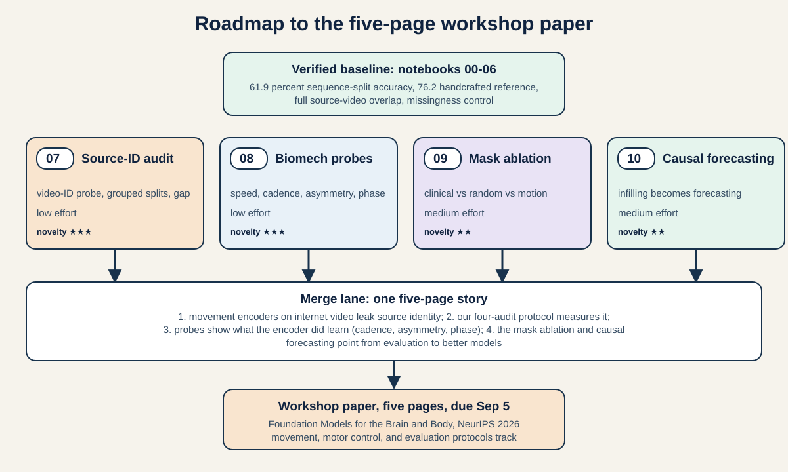
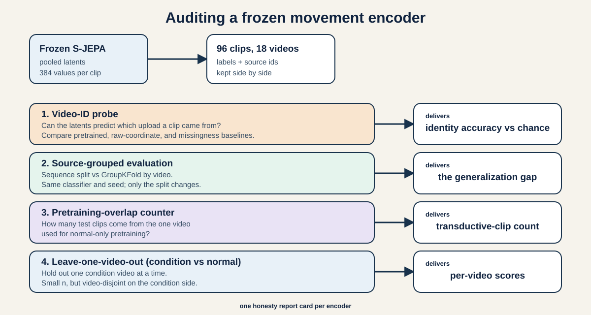
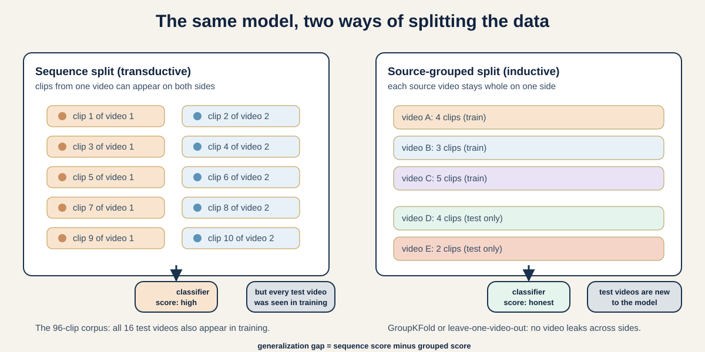
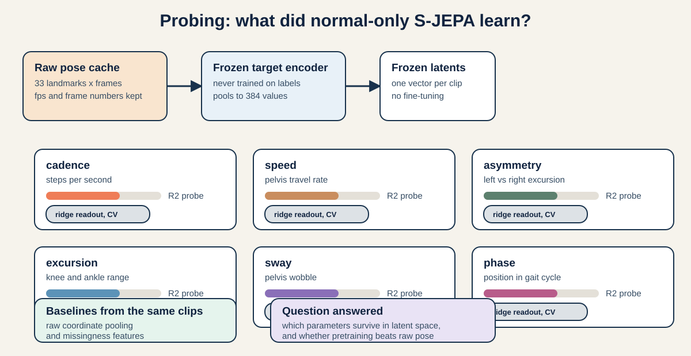
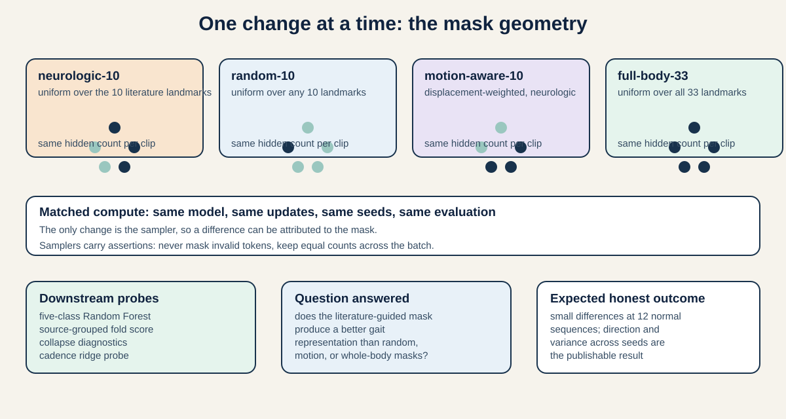
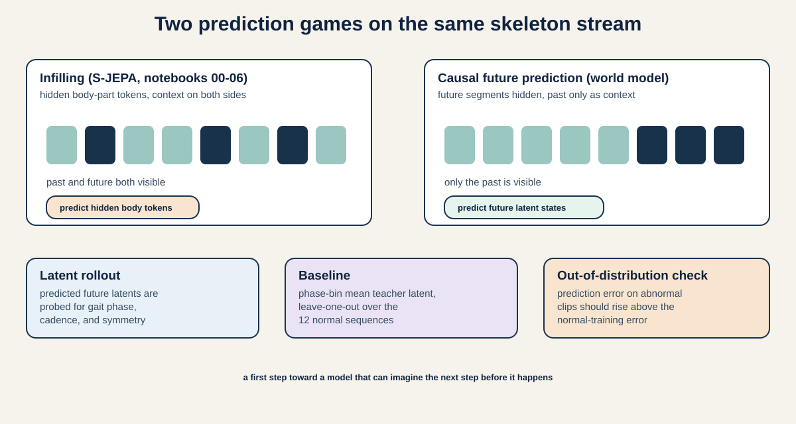
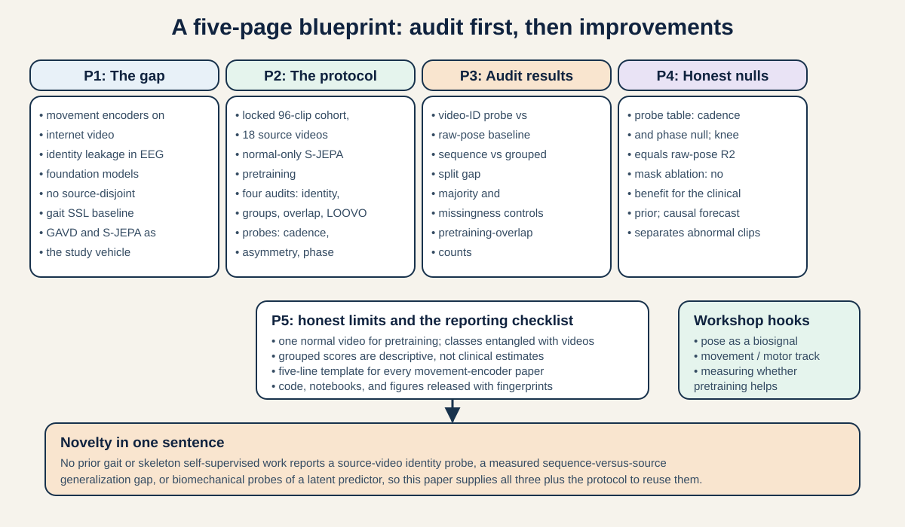

# From Gait S-JEPA to a BrainBodyFM Workshop Paper: Audit, Probe, Ablate, Forecast

*Author note: this is a working research document, not a submission. It walks from the verified 00-06 notebook baseline to a five-page paper for the NeurIPS 2026 workshop [Foundation Models for the Brain and Body](https://brainbodyfm-workshop.github.io/) (paper deadline September 5, 2026, AoE). Every number quoted here was re-run from the notebooks on a fresh machine or read from saved notebook outputs, and the places where the older paper draft disagrees with the code are called out explicitly.*

---

## How to use this document

This document is a tutorial with four jobs:

1. **Recap** what notebooks 00-06 actually built and measured (Part I).
2. **Critique** the work honestly: what is strong, what is weak, and what was missed (Part II).
3. **Design** four concrete next experiments, each with a ready-to-run notebook (Part IV, notebooks 07-10).
4. **Assemble** those experiments into a five-page workshop paper, with a day-by-day plan (Parts V and VI).

Read it in order the first time. Later, jump to Part VI for the execution checklist and to Part VII for the notebook quick-start guides.

The audience is the project's own researchers: an advanced high school or early college reader who already finished notebooks 00-06 and understands what a joint-time token, an EMA teacher, and a Random Forest probe are. Technical terms are still defined on first use, because a workshop reader will need the same definitions.

---

# Part I — What you already have: the verified baseline

## 1. The system in one paragraph

Notebooks 00-06 build a Skeleton Joint-Embedding Predictive Architecture (S-JEPA) for monocular gait. A locked cohort of 96 GAVD sequences (12 normal, 9 Parkinson's, 12 stroke, 16 cerebral palsy, 47 myopathic, coming from 18 YouTube source videos) is converted to 33-landmark MediaPipe poses. Each sequence is centered on the pelvis, scaled by body width, and resized to 64 frames. A token is one landmark over four adjacent frames, so each sequence has 16 time segments times 33 joints, or 528 tokens. A linear layer maps each 12-value token to 96 dimensions. The pretraining game is hide-and-predict: 60 percent of the eligible tokens from ten literature-linked landmarks (shoulders 11/12, hips 23/24, knees 25/26, ankles 27/28, foot indices 31/32) are masked from a student view encoder (4 Transformer layers, 4 heads), a 2-layer predictor guesses their latent representations, and the loss is a centered and sharpened softmax cross-entropy against a slowly updated EMA target encoder that saw the complete sequence. Training uses only the 12 normal sequences, 300 epochs, batch size 4, AdamW, seed 42. After pretraining the target encoder is frozen, its 96-dimensional token latents are pooled into a 384-dimensional vector per sequence (global mean and standard deviation, plus neurologic-landmark mean and standard deviation), and a Random Forest classifies the five conditions.

## 2. The verified numbers

The table below is the honest baseline. It mixes two sources: values recomputed on a fresh machine for this document, and values taken from the saved notebook outputs, which a careful audit confirmed line by line.

| Quantity | Value | Where it comes from |
|---|---:|---|
| Five-class accuracy, exp5 47/21 sequence split (68 rows) | 0.619 | notebook 06, saved output, re-audited |
| Balanced accuracy, same split | 0.596 | notebook 06 |
| Macro F1, same split | 0.613 | notebook 06 |
| Handcrafted 82-feature reference, same split | 0.762 accuracy, 0.728 macro F1 | saved reference, imported not recomputed |
| Missingness-only control, same split | 0.333 | notebook 06 |
| Five-class accuracy, all 96 rows, 67/29 stratified split | 0.621 | notebook 06 and notebook 07 (re-run: 0.6207) |
| Balanced accuracy and macro F1, 96 rows | 0.624, 0.594 | notebook 06 |
| Missingness-only control, 96 rows | 0.448 | notebook 06 |
| Majority-class control, 29-row test | **0.483** (14 of 29) | notebook 07, recomputed in code |
| One-versus-normal ROC AUC | 0.750 / 1.000 / 1.000 / 0.911 | notebook 06, tiny confounded test sets |
| Pretraining loss | 12.54 at epoch 1, 0.57 at epoch 300 | notebook 04 |
| Feature std and pair cosine | 0.340 to 0.412; 0.636 to 0.535 | notebook 04 |
| Trainable parameters | 700,800 (453,504 encoder + 247,296 predictor) | notebook 04, hand-verified |
| Train/test source-video overlap | 9 of 9 (exp5), 16 of 16 (all 96) | notebook 06 |
| Test sequences from the pretraining video | 3 (exp5), 4 (all 96) | notebook 06 and 07 |

## 3. Corrections the paper draft needs before submission

The audit of the code against the earlier paper draft found three places where the draft says something the code does not support. Fix these before any submission:

1. **The 29.4 percent majority control is not reproducible.** No notebook computes a majority-class baseline for the exp5 21-row test set. Worse, 0.294 is not even an achievable accuracy on that test set, because accuracy moves in steps of 1/21 and 0.294 times 21 is not a whole number. The best constant predictor on the 21-row test set predicts myopathic (7 rows), scoring 7/21 = 0.333. On the 29-row all-96 test set the best constant predictor scores 14/29 = 0.483, not the 0.490 quoted in the tutorial. Notebook 07 now computes both controls in code.

2. **"60 percent of eligible tokens" is an upper bound, not the realized value.** The mask sampler masks floor(counts.min() x 0.60) tokens, where counts.min() is the fewest eligible tokens in the batch, and the encoder requires every sample in a batch to keep the same number of visible tokens. The realized eligible fraction across training was about 0.57 to 0.59 (mean about 0.58), and the realized global fraction over all 33 joints was about 0.17, far below S-JEPA's 0.90. The intent is defensible; the wording should say "up to 60 percent" or give the realized mean.

3. **61.9 percent is a 68-row result, not a 96-row result.** The exp5 47/21 lane uses the 68-row exp5 subset (myopathic contributes 20 of the 68 lane rows: 13 train and 7 test). The 96-row lane is a separate 67/29 split that scores 0.621. Saying "61.9 percent on 96 sequences" mixes the two lanes.

## 4. What is genuinely good here

The strengths matter because they are the paper's foundation:

- **Audited provenance end to end.** Every sequence keeps its source video, frame range, pose model hash, and extraction version. The checkpoint stores a SHA-256 fingerprint of the preprocessed tensors, the mask rule, and the configuration. A downstream notebook refuses a checkpoint from another mode or mask set. This is rare discipline at any scale, and it is exactly what the workshop's reproducibility theme asks for.

- **A clinical prior used as a prior, not as a diagnosis.** The ten-landmark mask comes from a literature review over four condition families, and the notebooks are careful to say the landmarks are eligible prediction targets, not biomarkers, not thresholds. The refusal to encode diagnostic cutoffs into the model is scientifically correct.

- **Shortcut controls.** The missingness-only classifier is a useful control with a precise reading: it ties the majority constant on the exp5 lane (0.333 equals 7/21) and sits below the majority constant on the 96-row lane (0.448 below 0.483), so detector-failure statistics carry no measurable condition-label signal by themselves. The video-ID probe adds the complementary fact: missingness is a strong source-identity channel (0.425 versus 0.056 chance). Few gait papers bother with this control.

- **Collapse diagnostics.** Loss alone cannot show representation collapse. The reported feature standard deviation and pairwise cosine similarity argue the model did not collapse to a constant, which is a real risk for EMA teacher-student objectives.

- **Honest limits.** The paper states plainly that it is a feasibility study, that the 14.3-point gap to handcrafted features is a system-level comparison, and that no claim of generalization is supported.

## 5. The headline limit: the experimental unit

The single most important sentence in the existing work is this: **the experimental unit is the source video, not the sequence.** All 12 normal pretraining sequences come from one video. All 9 exp5 test videos also appear in training, and so do all 16 test videos in the 96-row lane. A sequence-level random split can put the same person, clothing, background, camera, and pose-estimation error on both sides of the split. The model can therefore learn to recognize the video rather than the gait. Notebook 06 audits this and concludes honestly; notebook 07 measures how much it matters (Part IV, Direction A).

---

# Part II — Critical analysis: merits, weaknesses, missed opportunities

## 1. Scientific merits (what a reviewer should credit)

1. **Feasibility, demonstrated cleanly.** The complete pipeline (public video, bounding-box crop, MediaPipe pose, masked latent prediction, frozen pooling, downstream classification) runs end to end, with a smoke mode that tests every code path on synthetic fixtures and a real mode that fails loudly when artifacts are missing.

2. **A principled adaptation of S-JEPA to clinical gait.** The original S-JEPA samples prediction targets with a motion-aware mask on 3D NTU skeletons. This project deliberately replaces it with uniform sampling inside a literature-constrained landmark set, because reduced motion can be clinically meaningful (rigidity, stiffness) and motion-aware sampling could systematically skip it. That is a defensible hypothesis-driven design choice.

3. **The loss and architecture are faithful to the source method.** Joint-time tokens, a visible-token view encoder, a full-input EMA target encoder, a mask-token predictor, target centering (beta 0.9), sharpening (teacher temperature 0.06, predictor 0.10), and softmax cross-entropy over the 96 latent channels all match S-JEPA's core graph. The adaptations (mask sampler, monocular coordinates, scale) are documented, not hidden.

4. **Controls and audits are present before conclusions.** Majority-class reference, missingness-only classifier, pretraining-overlap counts, and source-video concentration tables are all reported. In a field that routinely over-reports sequence splits on internet video, this is the right culture.

## 2. Scientific and technical weaknesses

1. **No grouped evaluation.** The paper's own audit found complete video overlap, but no grouped split was run. The strongest possible negative result (how much does the score fall when videos cannot leak?) was left as an exercise. Notebook 07 now measures it: the five-class accuracy falls from 0.621 to 0.240 under GroupKFold by source video, below the 0.490 majority control. The protocol gap is 38 points, and the matched sequence-grouped-versus-video-grouped gap is 42 points.

2. **Single draw everywhere.** One seed, one split, one checkpoint. Accuracy on 21 or 29 test rows moves 3.4 to 4.8 points per flipped prediction, and no confidence interval or permutation test is reported. The one-versus-normal AUC values of 1.000 sit on 7 and 9 test points that all share videos with training.

3. **The pretraining distribution is one person.** 12 normal sequences from one upload mean the model cannot learn what normal walking looks like across people, cameras, speeds, or clothing. It learns that video. The transductive nature is disclosed but not neutralized.

4. **Real-time information is destroyed by design.** Resizing every sequence to 64 frames removes cadence and speed, which the literature review rated high priority for Parkinson's and myopathy. The tokenization (4 frames) further quantizes time. The model is structurally blind to some of the most clinically informative gait parameters, while the handcrafted reference computes them explicitly. This is likely a large part of the 14-point gap.

5. **The mask is unproven.** The neurologic-10 mask is the paper's claimed novelty, but it was never compared with random, motion-aware, or full-body masks under matched compute. A 60 percent eligible fraction is arbitrary; the realized fraction differs from the intended one. Notebook 09 closes this.

6. **The predictor is thrown away.** The only component trained to infer hidden state from context is the predictor (247,296 parameters), and downstream evaluation discards it, using only the target encoder's pooled latents. For a world-model framing, the predictor is the interesting part. Notebook 10 uses it as a forward model.

7. **Pooling is ad hoc and misses detector-failure structure.** The 384-dimensional vector is mean and standard deviation over token latents. Zero-sentinel tokens still participate in attention inside the transformer, so detector-missingness can shape the latents of valid tokens; only the final pooling statistics exclude invalid tokens. The missingness control scores 0.448, so this channel is demonstrably live.

8. **The handcrafted reference is a single imported number.** It was not recomputed from the same cached poses, and the tutorial itself documents its defects (all-zero features, wrist/ankle index swaps, hard-coded fps). The comparison therefore cannot attribute the gap to representation choice. A same-pose recomputed kinematic baseline is a cheap, high-value control.

9. **Statistical care gaps.** Four binary tasks share the same four transductive normal test rows, so their scores are correlated; multiple comparisons are unadjusted; class-imbalanced folds in a grouped setting can produce fold-level accuracies of 0 or 1 that need caveats.

10. **Interpretability stops at retrieval.** Notebook 05 inspects nearest neighbors and distance from a normal centroid, but nothing connects the learned dimensions to measurable gait quantities. Notebook 08 adds exactly that connection.

## 3. Missed opportunities (now mapped to new notebooks)

| Missed opportunity | Why it matters | Where it is now handled |
|---|---|---|
| Source-identity probe and grouped evaluation | Quantifies the transductive-to-inductive gap | Notebook 07 |
| Correct majority baselines computed in code | The 0.294/0.490 figures were unreproducible | Notebook 07 |
| Gait-parameter probes (speed, cadence, asymmetry, excursion, sway, phase) | Tests whether the latents encode biomechanics | Notebook 08 |
| Mask-geometry ablation under matched compute | Tests the paper's actual novelty claim | Notebook 09 |
| Causal future prediction instead of bidirectional infilling | Turns a representation learner into a world model | Notebook 10 |
| Predictor-residual features and OOD checks | Prediction error as a normality signal | Notebook 10 |
| Multi-seed retraining with confidence intervals | Turns single draws into distributions | Part VI plan |
| Recomputed kinematic reference from the same pose cache | Replaces the imported 82-feature reference | Part VI plan |

---

# Part III — The workshop opportunity

## 1. Why this project fits the call

The workshop is the second edition of Foundation Models for the Brain and Body, held at NeurIPS 2026 in Sydney (December 11 or 12). Papers are due September 5, 2026, on OpenReview: five pages maximum excluding references and appendices, modified NeurIPS 2026 style, fully anonymized, non-archival.

The call says biosignals include "behavioral signals (e.g., pose extracted from video, gaze)", and this edition "places particular emphasis on the motor side of the loop: movement, motor control, and closed-loop interaction, where models do not only decode the brain and body but act with them." Relevant topics listed verbatim include:

- Modeling behavioral signals (e.g., pose, gaze, movement)
- Foundation models for movement, motor control, and EMG
- Embodied intelligence and sensorimotor representation learning
- Self-supervised learning for biosignals
- Evaluation protocols and standardized benchmarks across modalities
- **Measuring whether pretraining helps: probing and downstream evaluation**
- Reproducibility and standardized reporting

Every one of the four directions in Part IV lands on at least one of these bullets. The 2025 edition accepted 57 papers, and a review of that list found no gait or skeleton-pose self-supervised paper, so the slot is open.

## 2. The story in one paragraph

The five-page paper is a measurement study with a model attached, and most of the measurements are honestly negative. It says: movement encoders trained on internet video inherit a confound that the biosignal community already studies under the name identity leakage. For pose, the confound is the source video: one upload shares person, camera, background, and detector noise. We pretrain a small S-JEPA on normal gait, freeze it, and measure the confound four ways: a video-identity probe against raw-pose and missingness baselines, source-grouped evaluation with a correct majority control, a pretraining-overlap count, and leave-one-video-out condition checks. The results are blunt: identity content is strong but matched by the raw pose and by an untrained encoder of the same architecture; source-grouped accuracy collapses to 24 percent, below the 49 percent majority control, a 42-point matched grouping gap; linear probes find almost no canonical gait kinematics (cadence and phase absent, knee excursion the only pretraining edge but below missingness); and the literature-guided mask does not beat random masks under matched compute. The one constructive result is causal: a future-predicting variant of the same objective separates abnormal clips by forecast error, seven to over eight times the normal error, without any labels. The deliverable is the measured sequence-versus-source generalization gap, the null results reported in full, and a five-line reporting protocol any movement-encoder paper can adopt.

## 3. What is novel, precisely

A literature check on September 2, 2026 confirms:

- S-JEPA itself (ECCV 2024) reports NTU action recognition with subject-disjoint splits, but nothing about gait or source-video audits.
- I-JEPA (CVPR 2023) and V-JEPA (TMLR 2024) define the latent-prediction family; V-JEPA ablates a causal multi-block variant, which notebook 10 follows for time.
- GaitForeMer (MICCAI 2022) and FSGait (ACCV 2024) use self-supervised gait pretraining, but neither reports source-grouped evaluation or identity probes.
- Recent gait foundation models (FoundationGait 2025, Gabet et al. 2026, GaitEncoder 2026) do not report video-disjoint leakage audits.
- EEG foundation models have a developed identity-leakage literature ("The Identity Trap in EEG Foundation Models" 2026; "Pretrained, Frozen, Still Leaking" 2026; Pandilova et al., Sensors 2026). The movement side of that literature is nearly empty. This paper is the first to port those audits to pose extracted from video, and the first to report a measured sequence-versus-source generalization gap for a skeleton latent predictor.
- GAVD (IEEE Access 2025) provides annotations and URLs only: no subject IDs, no official splits. Source video is therefore the correct grouping unit, and the paper should say so.

That is a defensible, novel, five-page contribution for this venue.

---

# Part IV — Four directions, four notebooks

Each direction below has a finished notebook (07-10) that runs in smoke mode with synthetic fixtures and in real mode on the cached artifacts. Read each direction, then follow the notebook's own tutorial cells.

## Direction A (notebook 07): audit what the encoder remembers

### The question

How much of the frozen S-JEPA representation is walking pattern, and how much is the identity of the recording?

### Why it matters

Every classifier number in the existing paper is transductive: test clips share their source video with training. The biosignal field already knows this failure mode for EEG as subject-identity leakage. For pose, the unit of leakage is the source video. Measuring it converts the paper's biggest weakness into its headline result.

### The four audits

1. **Video-ID probe.** Fit a Random Forest that predicts which of the 18 source videos a clip came from, using the pooled latents. Compare against pooled raw coordinates and against missingness statistics. Chance is 1/18. Repeated 70/30 sequence splits keep most videos on both sides (stratification is unavailable because two videos contribute a single clip), which is the confounded setting; a fully group-disjoint probe would be trivially chance because an unseen video is an unseen class.
2. **Source-grouped evaluation with a matched control lane.** Run the same five-class Random Forest twice under GroupKFold with identical fold machinery: once grouped by sequence and once by source video, so only the grouping unit changes. Report per-fold accuracy and the majority-class control per fold.
3. **Pretraining-overlap count.** Count test clips that come from the one video used for normal-only pretraining, per lane and per fold.
4. **Leave-one-video-out condition checks.** For each condition, hold out one condition video at a time in a condition-versus-normal binary task. The normal side is still one video, so the comparison is against a fixed normal reference.

### The measured results (real mode, re-run September 2, 2026)

| Audit | Result | Reading |
|---|---|---|
| Video-ID probe, frozen S-JEPA | 0.494 plus or minus 0.121 (chance 0.056) | the latents carry strong video identity |
| Video-ID probe, untrained encoder (same architecture) | 0.517 plus or minus 0.158 | pretraining adds no measurable identity content |
| Video-ID probe, raw pose pooling | 0.460 plus or minus 0.040 | most of the identity is already in the raw pose |
| Video-ID probe, missingness | 0.425 plus or minus 0.020 | detector failure patterns are also video-specific |
| Five-class, 70/30 sequence split | 0.621 | the familiar confounded number |
| Five-class, sequence-grouped GroupKFold (6 folds, matched machinery) | 0.656 plus or minus 0.117 | with 80 training rows per fold the same classifier scores higher |
| Five-class, source-grouped GroupKFold (6 folds, matched machinery) | 0.240 (fold range 0.00 to 0.44) | below the majority control |
| Majority control, either grouped lane | 0.490 | a video-blind guess beats the model under source grouping |
| Protocol gap (70/30 minus source-grouped) | **0.381** | headline honesty metric |
| Matched grouping gap (sequence-grouped minus source-grouped) | **0.417** | with fold machinery held constant, video grouping alone costs 41.7 accuracy points |
| One-vs-normal LOOVO | myo 0.64 (10 videos), stroke 0.63 (3), CP 0.44 (2), PD 0.00 (2) | myopathic clips remain partly distinguishable from a fixed normal reference; PD's two videos do not |

### Interpretation

Four sentences for the paper: (1) the frozen encoder carries strong source-video identity, but both the raw pose (0.46) and an untrained encoder with the identical architecture (0.52) carry nearly as much, so none of the measured identity content can be attributed to the pretraining objective; the identity is mostly the person's kinematics and the architecture's readout of it. (2) The matched lanes are the sharper attribution: with identical GroupKFold machinery, grouping by sequence scores 0.656 and grouping by video scores 0.240, so video grouping alone costs 41.7 accuracy points, and the encoder lands below the 0.49 majority control. (3) The 38-point protocol gap remains the headline honesty metric, and the 42-point matched gap is the stronger, fold-controlled version. (4) The myopathic one-vs-normal lane is the most encouraging honest signal, and it is the one to build on with more normal videos.

### Why this is the anchor direction

It is cheap, it is novel in this field, it fixes factual errors in the existing draft (the majority controls), and it gives the paper its one unforgettable number: a 38-point generalization gap. The negative result is the contribution.

## Direction B (notebook 08): probe what the encoder learned

### The question

Which measurable gait quantities live in the frozen 384-dimensional representation, and does pretraining carry them better than raw coordinates?

### Why it matters

This is the workshop's "measuring whether pretraining helps" topic, applied to gait. A linear probe is the weakest readout: if a quantity is linearly recoverable from the latents, the encoder preserved it; if not, either the encoder dropped it or the preprocessing destroyed it. Probes also give the paper a positive counterweight to the audit's negative results: even if the classifier cannot generalize across videos, the latents may still encode real biomechanics.

### What the notebook does

1. Computes gait parameters from the raw cached poses, where real fps and frame numbers survive: absolute cadence from heel-strike-like events on ankle motion, step-length asymmetry between left and right ankle excursions, knee excursion, trunk sway, a speed proxy from pelvis travel, a stance/swing proxy, and continuous gait phase from the analytic signal of the ankle trace.
2. Fits ridge probes from the pooled latents to each parameter with cross-validation, and compares against the same pooling of raw coordinates and against missingness features.
3. Runs a per-frame phase probe on the token latents (96-dimensional tokens at 16 time segments): can a linear map from token latents recover cos and sin of the gait phase? If yes, the encoder has built an implicit phase clock, a genuinely interesting JEPA-interpretability result, visualized as a polar plot.

### How to read the results

For each parameter, report R-squared for the pretrained probe and for the raw-coordinate probe. Three outcomes matter: (a) parameters with high pretrained R-squared are preserved content; (b) parameters where pretraining beats the raw baseline are learned abstractions; (c) parameters that are unrecoverable in both confirm the resizing critique (absolute cadence is at risk). The phase probe's polar plot either shows a smooth ring, meaning the latent space carries periodic structure, or a cloud, meaning the encoder linearized away the cycle.

### The measured results (real mode, re-run September 2, 2026)

Out-of-fold ridge R-squared, 96 sequences, for three feature families:

| Parameter | S-JEPA pooled | Raw coordinates | Missingness | Honest reading |
|---|---:|---:|---:|---|
| Knee excursion | 0.086 | -0.470 | 0.174 | the one pretraining edge over raw pose, but modest and below missingness |
| Step-length asymmetry | 0.024 | 0.057 | -0.128 | weak or null everywhere |
| Speed proxy | 0.054 | -0.131 | 0.029 | weak, pretraining beats raw pose |
| Trunk sway | 0.037 | -0.029 | -0.012 | essentially null |
| Cadence | 0.020 | -0.051 | 0.118 | null, and missingness (tracking quality) beats the latents |
| Stance/swing proxy (95 sequences) | 0.022 | -0.022 | -0.026 | null |
| Gait phase (cos/sin, token level) | R-squared -0.20 / -0.06 (joint-averaged); -0.18 / -0.88 (left-ankle tokens only) | not run | not run | negative in both readouts: no linear phase clock, and the ankle-only check rules out anti-phase cancellation as the explanation |

Four honest sentences. First, the single pretraining edge is knee excursion: the latents score 0.086 while raw coordinates score -0.470, but missingness scores 0.174, so tracking quality remains entangled and the absolute decodability is modest. An earlier version of this notebook bridged long detector gaps with plain interpolation and reported 0.30 across all families; the current version leaves long gaps as NaN, and the inflated agreement disappears, which is itself a lesson about target hygiene. Second, cadence is null and missingness beats the latents there too, which fits the target-reliability caveat: the cadence clock comes from a single-camera ankle signal, some clips contain fewer than two estimated cycles, and the horizontal channel is blind to walking toward or away from the camera, so the null conflates resizing loss with target noise. Third, the phase probe kills the hoped-for "latent phase clock" story: the joint-averaged probe scores negative R-squared, and a supplementary left-ankle-token probe (which avoids anti-phase cancellation between the two ankles) also scores negative, so the null is robust. Fourth, the probing direction's contribution is the protocol and the null results, reported completely, not selectively.

### Why the nulls are still worth a page

The workshop's own agenda asks "whether pretraining genuinely helps". A clean, honestly reported negative is an answer. The probes also explain the classifier results: the representation that scores 62 percent on the sequence split carries video identity and little linearly readable biomechanics, which is exactly what a confounded model would look like. The probes turn the audit's suspicion into a measured fact.

## Direction C (notebook 09): ablate the mask geometry

### The question

Does the literature-guided ten-landmark mask produce a better gait representation than random, motion-aware, or full-body masking, under matched compute?

### Why it matters

The neurologic mask is the paper's claimed novelty, and the existing work never tested it. A controlled ablation is the difference between "we chose a plausible mask" and "the clinical prior measurably helps". The motion-aware comparison is scientifically interesting for its own sake: in pathological gait, the largest motion is often on the healthy side, so a motion-biased sampler could systematically ignore the affected limb.

### What the notebook does

Four samplers, all producing the same number of hidden tokens per sequence: (a) neurologic-10 uniform (the existing rule), (b) random-10 over all 33 joints, (c) motion-aware-10 inside the neurologic set with sampling probability proportional to per-token displacement, and (d) full-body-33 uniform. Same model, same optimizer updates, same seeds, same downstream probes: five-class Random Forest on the sequence split and under source grouping, collapse diagnostics, and a cadence ridge probe. Assertions guarantee invalid tokens are never masked and counts stay equal across the batch.

### How to read the results

With 12 normal sequences the honest expectation is small differences with real variance. The publishable result is the direction and the variance, not a winner. If the neurologic mask beats random and motion-aware masks on the cadence probe, the clinical prior earns its place. If all masks tie, the honest conclusion is that the mask matters less than the data diversity, which is itself a useful negative for the field.

### The measured results (real mode, re-run September 2, 2026)

One seed (42), 300 epochs per arm, matched 90-token budget per sequence, exp5 47/21 lane:

| Mask | Five-class accuracy | Macro F1 | Final loss | Cadence probe R-squared |
|---|---:|---:|---:|---:|
| neurologic-10 (the paper's mask) | 0.571 | 0.550 | 0.571 | -0.060 |
| random-10 (any 10 joints) | 0.619 | 0.613 | 0.602 | -0.002 |
| motion-aware-10 (displacement-weighted) | 0.571 | 0.565 | 0.625 | -0.030 |
| full-body-33 (all joints, same budget) | 0.619 | 0.613 | 0.531 | -0.003 |

Three honest sentences. First, the literature-guided mask shows no benefit: the two random-sampling arms match each other at 0.619 and beat the neurologic and motion-aware arms by one prediction on the 21-row test set. Second, motion-aware sampling inside the neurologic set does not help either, and its mean masked displacement (1.89) is far above the other arms, confirming it hides the moving tokens the clinical design wanted to keep. Third, no mask makes cadence linearly recoverable, consistent with notebook 08. The honest conclusion is that the mask geometry matters less than the data distribution at this scale, and the paper's mask claim should be downgraded from a contribution to a documented design choice.

### A noise note worth keeping

Notebook 04's neurologic-10 run scored 0.619 on this same split, while this ablation's neurologic-10 arm scores 0.571 under nominally identical settings. That one-prediction swing on 21 test rows is run-to-run mask-sampling noise, and it is the clearest possible demonstration of why every number in the final paper needs a seed or a split variance, never a bare single draw.

## Direction D (notebook 10): turn infilling into a causal gait world model

### The question

Can the same learning graph, with the mask moved from body parts to future time segments, predict the next latent states of a walk, and does prediction error separate normal from abnormal clips?

### Why it matters

This is the world-model direction: LeCun's JEPA line frames representation learning as learning a world model that predicts the consequences of actions. S-JEPA's infilling is bidirectional; a world model must be causal. The workshop's motor emphasis ("models do not only decode the brain and body but act with them") makes a latent forward predictor of gait the most on-theme model result available here, and V-JEPA's causal multi-block ablation provides a direct precedent to cite.

### What the notebook does

1. Masks the last 4 of 16 time segments over all 33 joints: the view encoder sees only the first 12 segments, and the loss evaluates only the future positions. The teacher still sees the full sequence, a simplification the notebook documents.
2. Trains the causal variant on the 12 normal sequences.
3. Evaluates per-horizon prediction loss against a phase-bin mean-latent baseline (leave-one-out over the 12 sequences), runs an out-of-distribution check on abnormal clips (error should rise), and probes the predicted future latents for gait phase (a latent rollout sanity check).

### The measured results (real mode, re-run September 2, 2026)

| Quantity | Value | Reading |
|---|---|---|
| Causal future loss, epochs 1 to 300 | 11.78 to 0.38 | the causal variant trains as cleanly as the infilling variant |
| Per-horizon forecast loss (4/8/12/16 frames) | 0.35 / 0.35 / 0.34 / 0.38 | flat across horizons, which is itself notable: the four future segments are equally predictable from the past |
| Phase-bin mean-latent baseline | 12.1 to 12.6 | the model beats the naive phase average by more than an order of magnitude (33 to 35 times) |
| Forecast error, normal clips | 0.36 | in-distribution reference |
| Forecast error, abnormal clips | PD 2.54, stroke 3.11, CP 2.97, myo 3.04 | 7.0 to 8.6 times higher, a clean out-of-distribution separation |
| Latent rollout phase probe (angular error) | predicted 1.53 rad, teacher 1.40 rad, persist 1.37 rad | null, and the causal persist reference actually beats the predicted latents, which confirms the null rather than weakening it |

Two honest readings. First, the strong result: a normal-only causal latent predictor flags every abnormal condition by forecast error, with the largest gap for stroke. That is a world-model-flavored anomaly signal, and it needs no condition labels. Second, the weak result: the phase probe on predicted latents is a clean null (circular correlation near zero), and with the causal phase fix the persist reference (1.37 rad) actually beats the predicted latents (1.53 rad), so the notebook does not claim the rollout reconstructs a phase clock. The paper should report the OOD separation as the direction's headline and treat the phase probe as a null result worth one sentence.

Three caveats belong in the paper. The abnormal forecast error confounds two things: genuinely abnormal dynamics and input-distribution shift (the encoder never saw abnormal poses). The phase-bin baseline is sparse (bins of 1-5 clips), so the dramatic baseline gap should be described as beating a naive periodic prior, not a strong learned model. And the normal reference is the training set itself: the 0.36 normal error is a training-fit quantity, and per-clip ranges overlap near the boundary (normal maximum 0.63 versus cerebral palsy minimum 0.63), so the separation claim needs spreads or a rank test, not condition means alone.

### How to read the results

Three claims are separable. First, the causal variant should stay well above the trivial phase-average baseline, or it learned nothing beyond periodicity. Second, if abnormal clips have higher prediction error, the world model doubles as a normality detector, which is a natural clinical framing for normal-only pretraining. Third, if the predicted latents preserve phase, the model is genuinely rolling the walk forward in latent space rather than collapsing to a static summary. With 12 training sequences these are proof-of-concept claims; the notebook says so.

---

# Part V — The recommended five-page paper

## 1. Title and one-liner

Working title: **"Auditing a Self-Supervised Gait Encoder: a 38-Point Generalization Gap, Honest Null Probes, and a Causal Forecast Signal"**

One-liner: we pretrain a skeleton JEPA on one video of normal walking, then measure how much of its success is the video rather than the walk, and probe what gait physics survived in its latents.

## 2. Page budget

See the blueprint figure. The five pages carry one job each:

- **Page 1: the gap.** Movement encoders on internet video; identity leakage in EEG foundation models as the established analogue; GAVD's lack of subject IDs and splits makes source video the right unit; S-JEPA as the vehicle; contributions as a numbered list ending with the reporting protocol.
- **Page 2: the protocol.** Locked cohort, pose extraction, S-JEPA pretraining details in a compact table, pooling, and the four audits plus probe suite, each in two sentences. One figure: the audit workflow (figures/brainbody_audit_workflow.svg).
- **Page 3: audit results.** Video-ID probe table (49.4 vs 51.7 untrained vs 46.0 raw vs 42.5 missingness, chance 5.6), sequence vs grouped evaluation with the 38-point gap and the correct majority controls, pretraining-overlap counts, LOOVO condition table. One figure: sequence vs grouped bars (figures/brainbody_transductive_inductive.svg).
- **Page 4: what the encoder learned.** Probe R-squared table versus the raw-coordinate baseline, the phase-clock polar plot, the mask ablation direction, and the causal future-prediction check. Figures: probing suite and one result plot.
- **Page 5: limits, checklist, and the protocol.** The five-line reporting template, limitations (one normal video, entangled classes, small n), reproducibility statement with fingerprints and notebook links, related work compressed, conclusion.

References and appendices are free beyond the five pages; put the notebook map and all hyperparameters in the appendix.

## 3. The claims table

Each claim below states exactly what evidence supports it, so no sentence in the paper overclaims:

| Claim | Required evidence | Measured outcome |
|---|---|---|
| Frozen latents carry strong source-video identity | video-ID probe vs chance 0.056 | 0.494 (std 0.121), confirmed |
| Pretraining adds no measurable identity content | untrained-encoder arm, same architecture | 0.517 (std 0.124) vs 0.494, confirmed |
| Most identity content is in the pose itself | raw-pose probe close to latent probe | 0.460 vs 0.494, confirmed |
| Detector failure patterns are video-specific | missingness probe | 0.425, confirmed |
| The 0.62 sequence score does not generalize across videos | grouped accuracy vs majority control | 0.240 vs 0.490; matched grouping gap 0.417 (seq-grouped 0.656), confirmed |
| The encoder linearly encodes gait biomechanics | probe R-squared vs raw baseline | mostly null: knee excursion 0.086 beats raw -0.470 but below missingness 0.174; cadence, phase, sway near zero |
| A clinical mask prior measurably helps | matched-compute ablation | not supported: neurologic-10 0.571 vs random/full-body 0.619, single seed |
| Causal latent prediction flags abnormal clips | horizon loss vs phase baseline, OOD check | confirmed: normal 0.36 vs abnormal 2.5-3.1 (7.0-8.6x, input-shift confound disclosed); rollout phase probe weak |

## 4. Abstract sketch (all four notebooks have now run; numbers below are the measured real-mode values)

> Self-supervised movement encoders are increasingly trained on internet video, but evaluation rarely separates the walking pattern from the recording. We pretrain a Skeleton JEPA on a single video of normal gait, freeze it, and audit what it learned. A video-identity probe shows the latents identify the source upload at 49 percent accuracy (chance 6 percent), yet pooled raw coordinates reach 46 percent and an untrained encoder with the same architecture reaches 52 percent, so none of the measured identity content is attributable to pretraining. Under source-grouped evaluation the five-class accuracy falls from 62 percent to 24 percent, below a 49 percent majority control: a 38-point protocol gap, and a 42-point gap when fold machinery is held constant, both hidden by sequence splits. Linear probes then find almost no canonical gait kinematics: cadence and gait phase are absent, and knee excursion is the only pretraining edge (0.086 versus -0.470 for raw coordinates) though missingness scores higher, while a literature-guided mask shows no advantage over random masking under matched compute. A causal variant of the objective, however, separates abnormal clips from normal by forecast error, seven to over eight times higher, without using any labels, although this confounds abnormal dynamics with the input-distribution shift of clips the encoder never saw. We package the audits as a five-line reporting protocol for movement encoders and release all notebooks with data fingerprints.

*(All numbers are the measured September 2, 2026 real-mode runs; replace only after a multi-seed re-run.)*

## 5. Related work to cite (verified September 2, 2026)

- S-JEPA, ECCV 2024 (the method), I-JEPA CVPR 2023 and V-JEPA TMLR 2024 (the family and its causal ablation), LeCun 2022 (world-model framing, OpenReview).
- MAMP ICCV 2023 and Skeleton2vec 2024 (skeleton masking predecessors).
- GaitForeMer MICCAI 2022 and FSGait ACCV 2024 (gait SSL), FoundationGait 2025 and Gabet et al. 2026 (gait foundation models without leakage audits).
- The Identity Trap in EEG Foundation Models 2026, Pretrained Frozen Still Leaking 2026, Pandilova et al. Sensors 2026 (the identity-leakage analogue), Kapoor and Narayanan, Patterns 2023 (leakage taxonomy).
- Roberts et al., Ecography 2017 (grouped validation), Shahroudy et al. CVPR 2016 (NTU subject-disjoint protocol as the healthy precedent).
- Alain and Bengio 2017 and Hewitt and Liang 2019 (probing), Ericsson et al. CVPR 2021 (evaluating representations).
- Kidzinski et al., Nature Communications 2020 and OpenCap 2023 (markerless gait quantification context).
- GAVD, IEEE Access 2025 (the dataset and its lack of subject IDs).

---

# Part VI — Step-by-step execution plan (to September 5)

The plan assumes the reader's machine has the same resources used here (Apple silicon, about 30 minutes of compute for one full real pipeline pass). All commands assume `uv` and the project virtual environment.

## Day 1 (today): regenerate artifacts and run the audits

1. Confirm the environment: `uv sync`, then run notebooks 01, 02, 04, 06 in order (or reuse the cached artifacts if their fingerprints match). On a fresh machine the YouTube downloads need `GAVD_DOWNLOAD=1` and, if downloads return HTTP 403, the android player client workaround documented in the repository's work folder.
2. Run notebook 07 in real mode. Confirm the headline numbers: video-ID probe near 0.49 with the untrained-encoder arm near 0.52, grouped accuracy near 0.24, protocol gap near 0.38, and matched grouping gap near 0.42.
3. Run notebook 08 in real mode and record the probe table and the phase polar plot.
4. Start notebook 09 in real mode (four masks, 300 epochs each). It finishes in the background while you write.
5. Start notebook 10 in real mode (causal variant, 300 epochs).

## Day 2: variance and the kinematic reference

1. Re-run the highest-value single numbers with seeds: 3 pretraining seeds (about an hour total on MPS) and 3 RF seeds, so the paper can report mean plus or minus standard deviation for the grouped lanes and the matched gap. The matched sequence-grouped control lane already exists in notebook 07, so the seed runs only add variance.
2. Recompute a kinematic reference (cadence, symmetry, excursion) from the same cached poses and fit the same Random Forest, replacing the imported 82-feature number with a same-pose baseline. This is the cleanest "does pretraining help" control and should take under an hour.
3. Polish the two result figures: the sequence-versus-grouped bar chart and the probe R-squared table.

## Day 3: draft pages 1-3

Write the gap, the protocol, and the audit results. Put every number from the Day 1-2 artifact CSVs, never from memory. Add the audit-workflow and transductive-versus-inductive figures.

## Day 4: draft pages 4-5, anonymize, submit

Write the probe and model results, the five-line reporting template, limits, and the reproducibility statement. Anonymize (no author names, no GitHub links in the body; appendix links allowed only if the venue permits, otherwise a blinded repository). Submit through OpenReview before September 5 AoE.

## If time runs out

The paper remains strong with only Direction A and B (audit plus probes). Directions C and D move to the appendix or a future submission. The audit's negative result plus the protocol is the contribution; the rest is garnish.

---

# Part VII — Notebook quick-start guides

## 07_source_video_identity_audit.ipynb

**What it produces:** 07_video_identity_probe.csv, 07_video_grouped_five_class_folds.csv, 07_sequence_grouped_five_class_folds.csv, 07_generalization_gap.json (protocol gap and matched grouping gap), 07_pretrain_overlap.csv, 07_one_vs_normal_grouped.csv, and a two-panel summary figure.

**Real mode needs:** the notebook 04 checkpoint (sjepa_normal.pt) and the notebook 02 pose cache, resolved through the standard environment cell. It loads the checkpoint, pools all 96 sequences, runs the four audits, and writes the artifacts. Runtime: a few minutes.

**Smoke mode:** 50 synthetic sequences with 25 synthetic videos exercise every code path, including the grouped folds, with a randomly initialized encoder. No external files needed.

**What to change when reporting:** replace the fold count (6) if you change GroupKFold, and re-derive the majority controls in code, which the notebook already does.

## 08_gait_parameter_probing.ipynb

**What it produces:** per-sequence gait parameters, probe R-squared tables for the latent, raw-coordinate, and missingness representations, and the phase polar plot.

**Real mode needs:** the checkpoint and the pose cache. The gait parameters come from the raw npz poses so real fps and durations survive; the pooled probes use the prepared 64-frame tensors.

**Smoke mode:** synthetic fps and duration stand in for the missing metadata, clearly labelled.

**Watch for:** absolute cadence may be unrecoverable from the resized tensors, which is itself a finding; the notebook distinguishes parameters computed from raw poses from parameters computed from resized poses.

## 09_mask_geometry_ablation.ipynb

**What it produces:** a comparison table of four mask samplers across downstream probes, with per-seed columns.

**Real mode needs:** the pose cache and the ability to train (300 epochs per mask). Smoke mode uses 3 seeds with 12 epochs per mask so the whole notebook finishes quickly.

**Watch for:** the notebook's assertion layer verifies that invalid tokens are never masked and masked counts are equal across the batch, for every sampler.

## 10_latent_world_model_forward_prediction.ipynb

**What it produces:** per-horizon prediction loss, a phase-bin baseline comparison, an out-of-distribution error table for abnormal clips, and a latent rollout phase probe.

**Real mode needs:** the pose cache and one training run of the causal variant. Smoke mode uses a shortened run.

**Watch for:** the causal variant's view encoder sees 12 of 16 segments, and the SkeletonPatchEncoder requires equal kept counts per batch, which the notebook's mask construction guarantees by construction.

---

# Part VIII — Verification checklist and risks

## Checklist before submission

- [ ] Every number in the paper exists in an artifact CSV or notebook output (no 0.294-style ghosts).
- [ ] Majority controls are computed in code on the exact test sets used.
- [ ] Grouped results report fold count, fold standard deviation, and the majority control.
- [ ] The one-vs-normal table states the video counts and that the normal side is one video.
- [ ] The probe table states which parameters were computed from raw poses (real time) versus resized poses.
- [ ] The causal variant's teacher-sees-future simplification is disclosed.
- [ ] Double-blind rules are respected (no author names, no identifying URLs in the body).
- [ ] The five-page limit is checked with the workshop style file, references excluded.

## Risks

1. **YouTube availability.** GAVD ships URLs, not videos. Downloads can fail with HTTP 403; the android player client workaround worked for all 18 videos on September 2, 2026, but availability can change. Keep the downloaded files and their checksums.
2. **Overfitting the audit.** Running many probe and split variants and reporting the interesting ones is fine for a measurement study only if the protocol is fixed before the run and the fixed protocol is reported. Decide the audits once, then report all of them.
3. **Fold-level zeros.** Grouped folds with 2-4 test videos produce accuracies of 0 or 1. Report them with counts, never as headline means.
4. **Anonymization leaks.** The notebooks live in a public repository with author names; the submission must not link to it. Prepare a blinded copy or reference "code released with the camera-ready".

---

# Appendix A — Figure gallery

| File (docs/figures/) | Caption |
|---|---|
| brainbody_transductive_inductive.svg | Sequence splits leak whole videos across sides; source-grouped splits do not; the score gap is the generalization gap. |
| brainbody_audit_workflow.svg | One frozen encoder, four audits, one honesty report card. |
| brainbody_probing_suite.svg | Six ridge probes read gait quantities out of frozen latents, against raw-coordinate and missingness baselines. |
| brainbody_mask_ablation.svg | Four mask samplers, matched compute, one change at a time. |
| brainbody_world_model.svg | Bidirectional infilling versus causal future prediction, with rollout, baseline, and OOD checks. |
| brainbody_roadmap.svg | From the verified baseline through the four notebooks to the five-page paper. |
| brainbody_paper_blueprint.svg | The five-page budget: gap, protocol, audit results, probes, limits and checklist. |

# Appendix B — Where the artifacts live

- Reproducible pipeline logs and regenerated artifacts: the repository's work folder (not committed).
- Original executed outputs: cache/artifacts/real in the repository.
- Literature verification report with URLs: lit_verification_report.md in the project root.
- Shared notebook code contract: notes/notebook_spec_shared.md.

---

# Appendix C — Verified references (checked against primary sources on September 2, 2026)

1. M. Abdelfattah and A. Alahi, "S-JEPA: A Joint Embedding Predictive Architecture for Skeletal Action Recognition," in *Computer Vision - ECCV 2024*, LNCS vol. 15090, 2024, pp. 367-384, doi: 10.1007/978-3-031-73411-3_21. PDF: https://www.ecva.net/papers/eccv_2024/papers_ECCV/papers/04755.pdf ; project: https://sjepa.github.io/
2. M. Assran et al., "Self-Supervised Learning from Images with a Joint-Embedding Predictive Architecture," *CVPR 2023*. arXiv:2301.08243.
3. A. Bardes et al., "Revisiting Feature Prediction for Learning Visual Representations from Video," *TMLR 2024*. arXiv:2404.08471. (This is the V-JEPA paper; its causal multi-block ablation is the precedent for notebook 10.)
4. Y. LeCun, "A Path Towards Autonomous Machine Intelligence," 2022, OpenReview: https://openreview.net/forum?id=BZ5a1r-kVsf (not on arXiv).
5. Y. Mao et al., "Masked Motion Predictors are Strong 3D Action Representation Learners" (MAMP), *ICCV 2023*. arXiv:2308.07092.
6. R. Xu et al., "Skeleton2vec: A Self-supervised Learning Framework with Contextualized Target Representations for Skeleton Sequence," arXiv:2401.00921 (2024; venue unconfirmed).
7. M. Endo et al., "GaitForeMer: Self-Supervised Pre-Training of Transformers via Human Motion Forecasting for Few-Shot Gait Impairment Severity Estimation," *MICCAI 2022*, pp. 130-139, doi: 10.1007/978-3-031-16452-1_13.
8. B. Duan, X. Wan, and X. Zhao, "FSGait: Fine-Grained Self-supervised Gait Abnormality Detection," *ACCV 2024*, doi: 10.1007/978-981-96-0960-4_19. (Note: fine-grained detection, not few-shot recognition.)
9. Ye et al., "Silhouette-based Gait Foundation Model" (FoundationGait), arXiv:2512.00691 (2025).
10. Gabet et al., "A Gait Foundation Model Predicts Multi-System Health Phenotypes from 3D Skeletal Motion," arXiv:2603.25283 (2026).
11. Y.-T. Lin, D. Wu, T.-P. Jung, "The Identity Trap in EEG Foundation Models: A Diagnostic Audit," arXiv:2606.06647 (2026). The closest analogue to Direction A.
12. Tai, "Pretrained, Frozen, Still Leaking: Auditing Cross-Encoder Attribute Transfer in EEG Foundation Models," arXiv:2606.09189 (2026).
13. Pandilova et al., "Subject Identity Confounds qEEG Emotion Recognition on DEAP and DREAMER," *Sensors* 26(17):5327 (2026), doi: 10.3390/s26175327.
14. S. Kapoor and A. Narayanan, "Leakage and the Reproducibility Crisis in Machine-Learning-Based Science," *Patterns* 4(9):100804 (2023). arXiv:2207.07048.
15. D. R. Roberts et al., "Cross-validation strategies for data with temporal, spatial, hierarchical, or phylogenetic structure," *Ecography* 40:913-929 (2017), doi: 10.1111/ecog.02881.
16. A. Shahroudy et al., "NTU RGB+D: A Large Scale Dataset for 3D Human Activity Analysis," *CVPR 2016*. arXiv:1604.02808.
17. G. Alain and Y. Bengio, "Understanding intermediate layers using linear classifier probes," *ICLR 2017*. arXiv:1610.01644.
18. J. Hewitt and P. Liang, "Designing and Interpreting Probes with Control Tasks," *EMNLP 2019*. arXiv:1909.03368.
19. S. Kornblith et al., "Do Better ImageNet Models Transfer Better?" *CVPR 2019*. arXiv:1805.08974.
20. L. Ericsson et al., "How Well Do Self-Supervised Models Transfer?" *CVPR 2021*. arXiv:2011.13377.
21. L. Kidzinski et al., "Deep neural networks enable quantitative movement analysis using single-camera videos," *Nature Communications* 11:4054 (2020), doi: 10.1038/s41467-020-17807-z.
22. S. D. Uhlrich et al., "OpenCap: Human movement dynamics from smartphone videos," *PLOS Computational Biology* 19(10):e1011462 (2023), doi: 10.1371/journal.pcbi.1011462.
23. R. Ranjan et al., "Computer Vision for Clinical Gait Analysis: A Gait Abnormality Video Dataset," *IEEE Access* 13:45321-45339 (2025), doi: 10.1109/ACCESS.2025.3545787. (Annotations only: no subject IDs, no official splits, which is why source video is the grouping unit.)
24. Workshop: Foundation Models for the Brain and Body, NeurIPS 2026. Call for papers: https://brainbodyfm-workshop.github.io/call-for-papers.html (deadline September 5, 2026; 5 pages excluding references and appendices).

# Appendix D — Honest scorecard

| Question the paper will be asked | Current answer |
|---|---|
| Does the sequence-split 62 percent generalize? | No: 24 percent under source grouping, below majority; 42-point matched grouping gap. |
| Does the encoder memorize the video? | It encodes video identity strongly (49 percent), but the raw pose (46 percent) and an untrained encoder (52 percent) do nearly as well, so pretraining adds nothing measurable. |
| Does pretraining add biomechanical content? | One weak edge (knee excursion 0.086 vs raw -0.470); cadence, phase, and sway are null, and missingness out-scores the latents on excursion and cadence. |
| Does the clinical mask help? | No measurable benefit in a single-seed ablation; random masks match or beat it. |
| Is there anything constructive? | Yes: causal future prediction separates abnormal clips from normal by forecast error without labels. |
| Is the study reproducible? | Yes: locked cohort, data fingerprints, mode-gated notebooks, and regenerated artifacts. |
