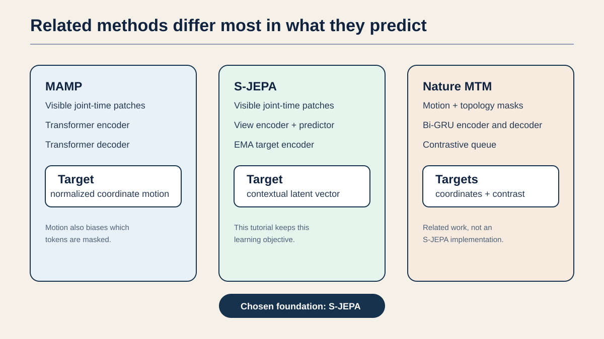
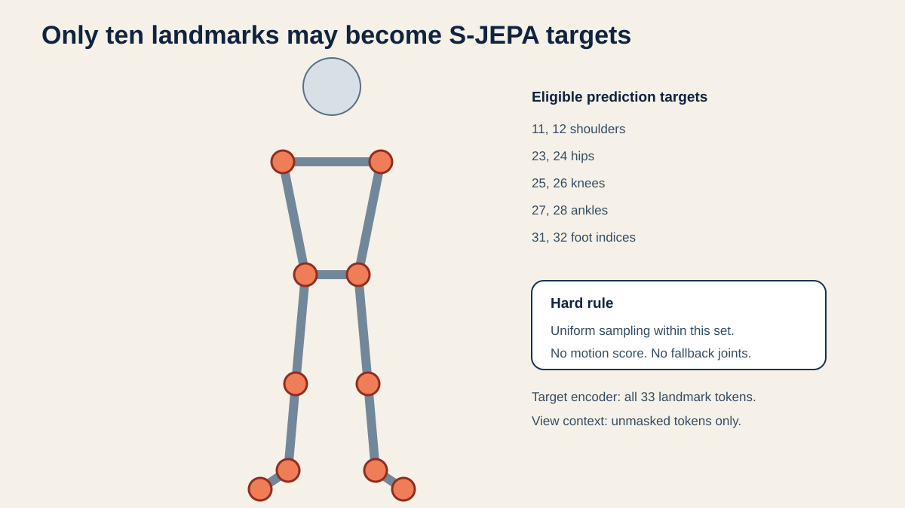
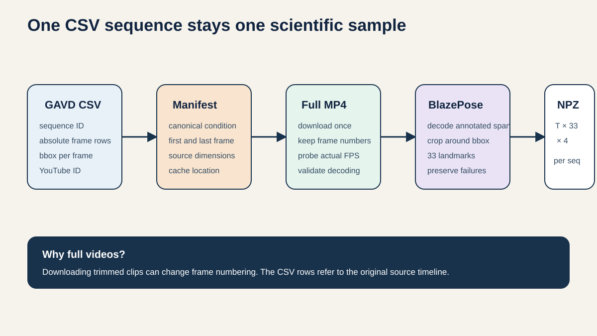
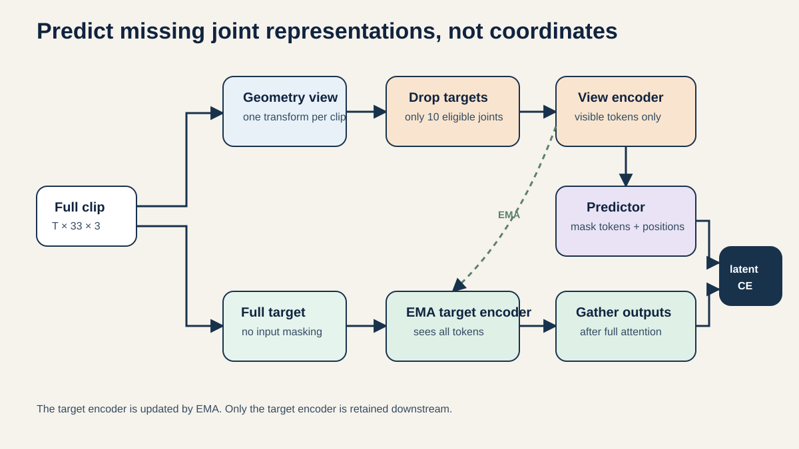
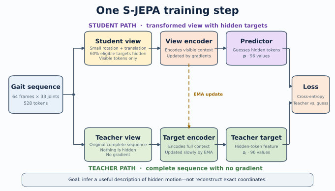
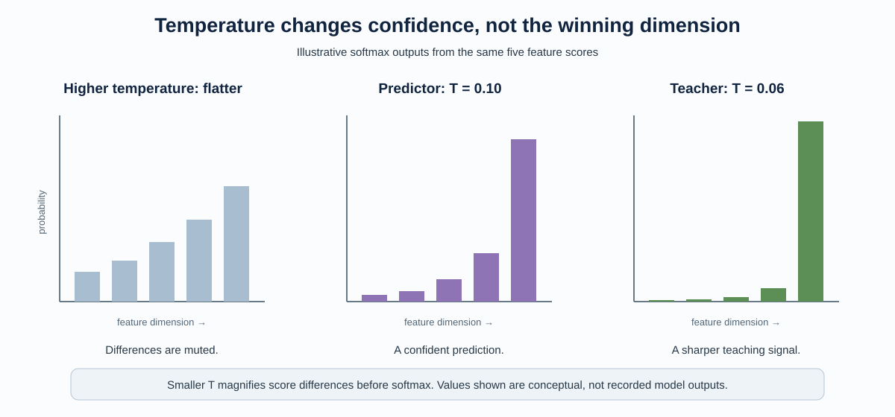
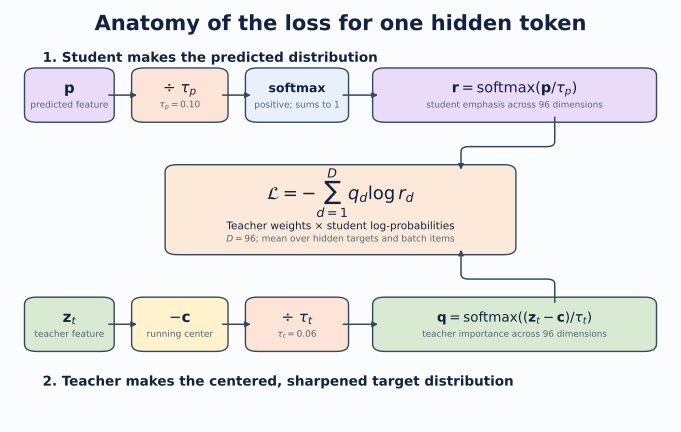
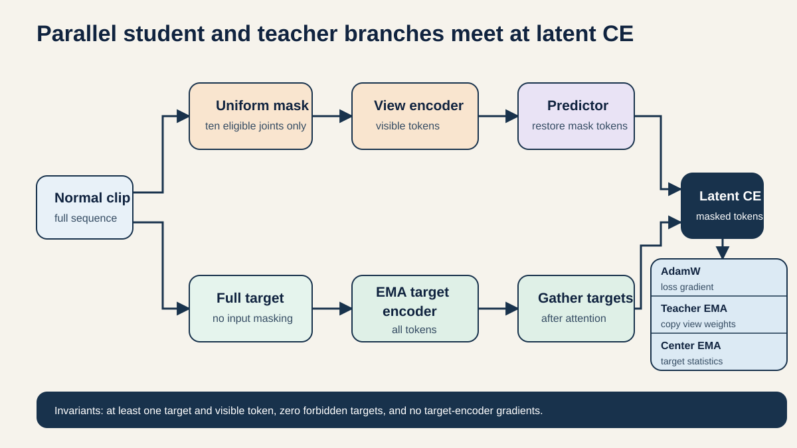
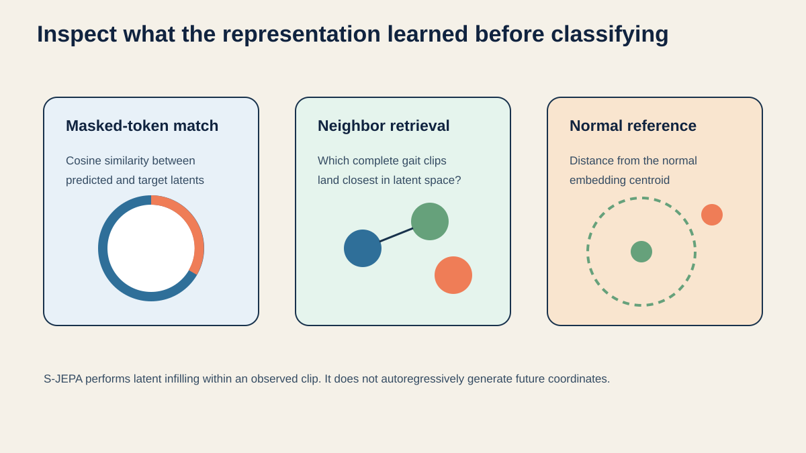
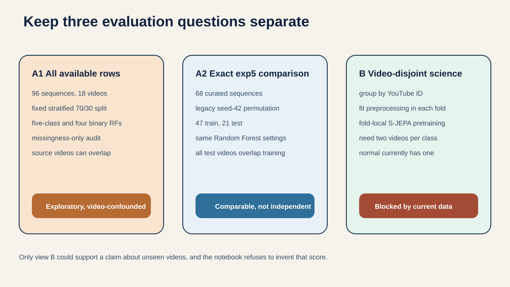

# A Step-by-Step Tutorial for the Entire URTC S-JEPA Gait Paper

This tutorial explains the complete paper **“Learning Monocular Gait Representations through Neurologically Guided Skeleton JEPA.”** It follows the paper in order and expands its short research language into everyday language suitable for a high school reader.

No background in medicine, machine learning, statistics, or calculus is assumed. Whenever the paper introduces a technical term, this tutorial explains:

1. what it means;
2. what role it plays in the project;
3. why the authors made that choice;
4. a concrete example; and
5. what the result does **not** prove.

The central machine-learning idea is:

> Hide a small piece of a walking sequence, ask a student model to describe the hidden motion using the visible motion, and compare its description with a slowly changing teacher model that saw the complete sequence.

The model is not asked to reconstruct exact joint coordinates. It predicts a useful **internal description**, also called a **latent representation** or **embedding**, of the hidden motion.

## Table of contents

- [Part I — What the Study Is Asking](#part-i)
- [Part II — Why Walking Can Carry Health Information](#part-ii)
- [Part III — Where the Method Comes From](#part-iii)
- [Part IV — From Internet Video to Model Input](#part-iv)
- [Part V — Building the Gait-Adapted S-JEPA](#part-v)
- [Part VI — Deep Dive: The Loss Function](#part-vi)
- [Part VII — Training, Freezing, and Downstream Evaluation](#part-vii)
- [Part VIII — Reading the Results Carefully](#part-viii)
- [Part IX — Leakage, Limitations, and the Meaning of the Experiment](#part-ix)
- [Part X — Final Interpretation and Next Steps](#part-x)

## How to use this tutorial

The tutorial is organized like a guided tour:

- **Parts I–III** explain the research question, medical motivation, related work, and claimed contribution.
- **Part IV** follows the data from internet video to cleaned skeleton sequences.
- **Part V** builds the S-JEPA model and its masking task.
- **Part VI** provides a detailed mathematical explanation of the loss.
- **Part VII** explains frozen embeddings, Random Forest classification, splits, controls, and metrics.
- **Part VIII** interprets every reported result.
- **Parts IX–X** explain leakage, limitations, conclusions, and the experiments needed next.

The original readable manuscript is [urtc2026_sjepa_gait.md](urtc2026_sjepa_gait.md). This tutorial is intentionally much longer because the paper must fit a conference page limit.

---

# Part I — What the Study Is Asking

## 1. The abstract in plain language

An **abstract** is a compressed summary of an entire study. The paper’s abstract says, in effect:

1. Walking contains patterns related to the nervous system, muscles, joints, and balance.
2. A normal camera video can be converted into a moving skeleton.
3. A self-supervised model can practice predicting hidden pieces of that skeleton without being given disease labels.
4. Medical literature can guide which body regions become prediction targets.
5. The learned representation can then be frozen and tested in a five-category classifier.
6. The learned representation works better than simple baselines, but worse than the saved handcrafted-feature reference.
7. The experiment has serious source-video leakage, so it does not demonstrate real-world diagnosis or generalization.

The last point is essential. A research paper is not only a report of what worked. It must also explain what the evidence is too weak to support.

### The study in one everyday example

Imagine covering the ankle in several frames of a walking video. You can still see the knee, hip, opposite leg, shoulders, and surrounding time periods. A knowledgeable observer could make an educated guess about what the hidden ankle is doing.

S-JEPA creates a numerical version of that exercise. It learns to predict a hidden ankle **representation** from the visible body context.

## 2. The main research question

The paper asks:

> Can a small S-JEPA model, pretrained only on the available normal gait sequences, learn a frozen representation useful for distinguishing five gait categories?

The five categories are:

1. normal gait;
2. Parkinson’s disease gait;
3. stroke gait;
4. cerebral palsy gait; and
5. myopathic gait, meaning gait affected by muscle disease.

This is a limited feasibility question. It is not the same as asking, “Can this system diagnose a new patient?”

### Why pretrain only on normal gait?

Normal-only pretraining asks the model to learn regular walking structure without using condition labels. Later, abnormal examples may appear different in the learned feature space.

An analogy is learning the sound of a properly working bicycle. After hearing many normal bicycles, unusual rattling may stand out. However, hearing one bicycle is not enough to learn every normal sound. Similarly, this study has only 12 normal sequences, all from one source video. That is a major restriction.

## 3. What the paper can and cannot claim

### What it can claim

- The complete code path from video to skeleton to pretraining to classification is feasible.
- The model learned nonconstant features useful within this particular corpus and split.
- The learned features outperform majority-class and missingness-only controls on the exact comparison split.
- A clinically motivated masking rule can be implemented and audited.
- The source-video audit identifies why the reported classification numbers are not deployment estimates.

### What it cannot claim

- It cannot claim medical diagnosis.
- It cannot claim performance on a new person, video, camera, clinic, or website.
- It cannot claim that neurologically guided masking is better than random or motion-aware masking, because no controlled mask ablation was performed.
- It cannot claim that S-JEPA is better than handcrafted features; the handcrafted reference is stronger on the exact split.
- It cannot claim that 61.9% accuracy would repeat in a larger independent study.

### Feasibility versus validation

**Feasibility** means, “This method can be built and produces a meaningful signal here.”

**Validation** means, “Careful independent testing shows that the method reliably works in the intended setting.”

This paper supports feasibility, not clinical validation.

---

# Part II — Why Walking Can Carry Health Information

## 4. Gait as a whole-body process

**Gait** means the pattern of walking. Walking requires several systems to cooperate:

- the brain plans and regulates movement;
- nerves carry signals;
- muscles create force;
- joints allow body segments to rotate;
- balance systems keep the body upright; and
- vision and sensation help the person respond to the environment.

Because these systems interact, different impairments can change timing, posture, symmetry, speed, or joint motion.

The paper discusses four condition families. These descriptions motivate the project; gait alone does not establish any diagnosis.

### Parkinson’s disease

Parkinson’s disease can affect movement initiation and control. Gait may show shorter steps, slower speed, changed cadence, longer double-support time, reduced arm swing, or asymmetry.

**Example:** A person may take many short steps rather than fewer long steps. A model could potentially notice relationships among feet, knees, timing, and trunk motion.

### Stroke

A stroke can affect one side of the body more than the other. Gait may become asymmetric because one leg is weaker or controlled differently.

**Example:** The left foot may spend a different amount of time in swing than the right foot. This is why the project does not use left-right flipping as augmentation: flipping could erase meaningful laterality.

### Cerebral palsy

Cerebral palsy can affect muscle tone, strength, coordination, and joint posture. Some people show crouch gait, including unusually flexed hips and knees during stance.

**Example:** Instead of straightening during support, a knee may remain bent. The hip-knee-ankle chain is therefore relevant.

### Myopathy

A myopathy affects muscle fibers. Some myopathies weaken muscles near the trunk and hips and can cause compensatory trunk or pelvic motion.

**Example:** If hip muscles are weak, a person may lean the trunk to keep balance or move the leg forward differently.

### Shared symptoms make classification difficult

Different conditions can produce similar visible effects. Slower walking, for example, can occur for many reasons. A classifier must learn combinations of patterns, and even then a video label is not the same as a clinical diagnosis.

## 5. What “monocular gait” means

**Monocular** means the system uses one camera view. It does not use synchronized cameras or reflective markers in a laboratory.

Advantages include low cost and access to ordinary video. Limitations include:

- depth is difficult to recover from one view;
- camera angle changes appearance;
- loose clothing or occlusion can hide joints;
- frame rate may vary; and
- image coordinates are not calibrated physical measurements.

MediaPipe produces an estimated relative depth value, but that is not the same as clinical three-dimensional motion capture.

**Example:** A foot moving toward the camera may appear differently from the same motion viewed from the side. A single-camera system must avoid pretending that its estimated depth is laboratory-grade ground truth.

## 6. Handcrafted features versus learned representations

The paper compares two complete approaches.

### Handcrafted features

A researcher writes formulas for named measurements such as:

- walking speed;
- stride length;
- knee angle;
- left-right symmetry;
- sway; or
- cadence.

These features are interpretable. If a classifier relies on stride symmetry, a human can understand the measurement. But handcrafted calculations can be brittle when pose landmarks are noisy, missing, or viewed from an unknown camera scale.

### Learned representations

A neural network learns numerical features from data. It may discover interactions that were not manually specified.

For example, one learned pattern could combine knee timing, hip motion, and opposite-foot context. Its weakness is interpretability: feature dimension 47 has no guaranteed clinical name.

### A fair interpretation of the comparison

The paper’s handcrafted and learned systems use different preprocessing and feature extraction. Therefore, the comparison is a **system-level comparison**, not a pure test of “82 named features versus one neural embedding under identical conditions.”

---

# Part III — Where the Method Comes From

## 7. Self-supervised learning

In **supervised learning**, every training example has a human-provided answer. A photo might be labeled “dog,” and the model learns to predict that label.

In **self-supervised learning**, the data creates its own practice problem. Examples include:

- hide a word and predict it from the sentence;
- hide an image patch and predict its representation; or
- hide a skeleton token and predict it from the visible motion.

This project uses the third approach. Disease labels are not used during S-JEPA pretraining.

## 8. What JEPA means

JEPA stands for **Joint-Embedding Predictive Architecture**.

- **Embedding** means a compact learned numerical description.
- **Joint** means the observed context and prediction target are learned in related representation spaces.
- **Predictive** means one part of the input is used to predict another part’s representation.
- **Architecture** means the organized set of model components that performs the task.

The important distinction is that JEPA predicts a representation rather than reconstructing every pixel or coordinate.

### Representation prediction versus reconstruction

Suppose an ankle coordinate is hidden.

- Coordinate reconstruction asks: “What exact $x,y,z$ values were missing?”
- Representation prediction asks: “What useful learned description of this ankle motion belongs here?”

The second target may summarize context and tolerate small low-level errors better, although that advantage must be tested rather than assumed.

## 9. How this relates to prior skeleton methods

The paper carefully avoids claiming that skeleton JEPA itself is new.

The diagram separates three related designs. MAMP combines motion-aware masking with normalized-coordinate motion targets. S-JEPA predicts a teacher's contextual latent description. Nature MTM combines coordinate targets with a contrastive objective. This project keeps the S-JEPA objective and adapts its masking and data pipeline to a small gait study.

### MAMP

MAMP showed that masked motion prediction can be more useful than simply reconstructing joint coordinates in matched action-recognition experiments. It also favored high-motion targets.

### S-JEPA

S-JEPA uses a view encoder, slowly updated target encoder, and predictor to estimate latent targets at hidden skeleton locations.

### Skeleton2vec

Skeleton2vec independently used contextual teacher targets for skeleton representation learning.

### Clinical self-supervised gait work

Other work has used motion forecasting or learned abnormality representations for gait. Therefore, neither self-supervised gait learning nor skeleton latent prediction is invented by this project.

## 10. What is actually distinctive here?

The paper studies a narrower combination:

1. monocular pose extracted from GAVD videos;
2. normal-only S-JEPA pretraining;
3. uniform masks restricted to literature-linked gait regions;
4. a frozen downstream representation;
5. comparison with an existing 82-feature system; and
6. explicit audits for missingness and source-video leakage.

Good scientific writing distinguishes “we used this method” from “we invented this method.”

## 11. Literature-guided landmark selection

The earlier project reviewed gait features related to the four condition families. The available review was not a complete matrix covering every feature equally for every condition. Parkinson’s disease and stroke had broader reviews; cerebral palsy and myopathy were narrowed to smaller candidate lists.

The new project therefore uses the review cautiously. It does not turn literature ratings into diagnostic rules. It uses them only to choose anatomical regions for masking.

The selected MediaPipe landmarks are the left and right:

- shoulders: 11 and 12;
- hips: 23 and 24;
- knees: 25 and 26;
- ankles: 27 and 28; and
- foot indices: 31 and 32.

That makes 10 landmarks total.

The highlighted points form two connected chains down the body. Importantly, they are **eligible target locations**, not disease labels and not a claim that the other 23 MediaPipe landmarks are useless.

### Why these regions?

They cover upper-body compensation and the main lower-limb chain involved in walking. They are connected to patterns discussed in the clinical literature without pretending that any single landmark diagnoses a disorder.

### Why not map every feature to one joint?

Some concepts, such as center of mass or whole-body sway, involve many body regions. Assigning them to one landmark would create false precision. The method includes only high-priority mappings that can reasonably be connected to specific regions.

---

# Part IV — From Internet Video to Model Input

## 12. The GAVD source and locked cohort

GAVD is the **Gait Abnormality in Video Dataset**, built from public online videos with annotated gait sequences.

The full GAVD dataset is much larger, but this experiment locks itself to 96 sequences:

| Category | Sequences | Source videos |
|---|---:|---:|
| Normal | 12 | 1 |
| Parkinson’s disease | 9 | 2 |
| Stroke | 12 | 3 |
| Cerebral palsy | 16 | 2 |
| Myopathic | 47 | 10 |
| **Total** | **96** | **18** |

The diagram emphasizes that preprocessing is not merely “load a video.” Each sequence must stay connected to its source-video identity, frame range, label, pose-validity mask, and saved output so that later audits can trace where every model input came from.

### Sequence versus source video

A **source video** is an original online video. A **sequence** is a selected segment cut from a source video.

One source video can produce several sequences. Those sequences may show the same person, clothing, camera, background, lighting, and pose-estimation errors.

**School analogy:** Imagine cutting ten paragraphs from the same essay. They are ten samples, but they are not ten independent authors. A classifier trained on some paragraphs may recognize the author’s style in the others.

This distinction becomes central in the leakage audit.

## 13. Cropping and pose estimation

Each GAVD annotation includes a bounding box around the walking person. The pipeline:

1. opens the source video;
2. uses the annotated frame range;
3. crops around the annotated person; and
4. sends the crop to MediaPipe Pose Landmarker.

MediaPipe estimates 33 body landmarks per frame. Each landmark includes image-relative $x,y,z$ coordinates and a visibility score.

### Why crop first?

An internet video may contain other people, text, furniture, or a large background. Cropping directs the pose detector toward the annotated walker.

### Why keep provenance?

The extraction records the source video, frames, crop, model hash, and extraction version. **Provenance** means knowing where data came from and how it was produced. Without it, a researcher may be unable to reproduce or audit a result.

## 14. Missing landmarks and visibility

Pose detection is imperfect. A leg may be hidden behind the other leg, leave the crop, or become blurred.

A landmark with visibility below 0.45 is treated as missing.

The pipeline fills only internal gaps of at most four frames. It does not invent long missing stretches or extrapolate beyond the observed ends.

**Example:** If an ankle is visible on frames 10 and 13 but missing on frames 11–12, interpolation can estimate a smooth bridge. If it is missing for 20 frames, filling the gap would create too much imaginary motion.

After normalization, unresolved missing coordinates become zero sentinels. A sentinel is a special value meaning “missing,” not “the joint was physically at zero.” Missing tokens cannot become prediction targets.

## 15. Centering, scaling, and temporal resizing

Raw image coordinates depend heavily on camera framing. The project performs three major normalization steps.

### Center on the pelvis

The body is translated so the mid-hip region becomes the reference. This reduces the effect of where the person appears in the image.

**Example:** Two identical walking motions should not look fundamentally different merely because one person is on the left side of the frame.

### Scale by body width

Coordinates are divided by a shoulder- or hip-width estimate. This reduces differences caused by image size or distance from the camera.

**Example:** A person filmed close to the camera looks larger in pixels. Scaling tries to separate that camera effect from the walking pattern.

### Resize every sequence to 64 frames

Neural models are easier to batch when sequences have a consistent length, so every selected gait segment is temporally resized to 64 frames.

This also creates a limitation: resizing can weaken information about absolute cadence or real-time speed. Two walks with different durations can be stretched or compressed into the same number of frames.

## 16. The complete audited pipeline

Read the main route from left to right:

1. public RGB video and GAVD annotations;
2. cropped 33-landmark MediaPipe pose;
3. normal-only S-JEPA pretraining;
4. frozen 384-dimensional sequence embedding; and
5. five-class Random Forest.

The side boxes show scientific checks:

- the 10-landmark literature-guided mask;
- the 82-feature reference system; and
- leakage and missingness audits.

The figure labels the handcrafted comparison as a **system-level comparison** because the two routes do not share identical feature extraction.

---

# Part V — Building the Gait-Adapted S-JEPA

## 17. Turn the skeleton into joint-time tokens

The input has 64 frames and 33 landmarks. A token contains one landmark across four adjacent frames.

Each frame supplies three coordinates, so one token begins with

$$
4\text{ frames}\times3\text{ coordinates}=12\text{ values}.
$$

The 64 frames contain 16 four-frame segments. Across 33 joints, that produces

$$
16\times33=528\text{ tokens per sequence}.
$$

**Example:** One token might describe the left knee in frames 1–4. Another describes the same knee in frames 5–8. A third describes the right shoulder in frames 1–4.

## 18. Project each token from 12 values to 96 features

A learned linear layer maps every 12-value token to a 96-value embedding. The exact meaning of those 96 values is learned during training.

The number 96 is an architecture choice called the **embedding width**. It is not caused by the 96 sequences in the dataset; that numerical match is coincidental.

The four attention heads divide the 96-wide representation into 24 values per head. Later in Part VI, the tutorial derives why the loss sums over all 96 feature dimensions.

## 19. The three model components

Follow the arrows from left to right. The top route is the student route that must work with missing information. The lower route is the teacher route that sees the complete sequence. The loss compares their 96-value outputs only at the chosen hidden locations.

### View encoder, or student

The view encoder receives only visible tokens from a slightly transformed sequence. It has four Transformer layers and four attention heads.

### Target encoder, or teacher

The target encoder receives the complete sequence. It has the same encoder architecture, receives no direct gradient, and is updated slowly from the view encoder using an exponential moving average.

### Predictor

The predictor has two Transformer layers. It takes visible student features and predicts 96-value representations at hidden locations.

The view encoder has 453,504 parameters, and the predictor has 247,296, for 700,800 trainable parameters. The teacher is not counted as directly trainable because gradients do not update it.

### What is a parameter?

A parameter is a learned numerical setting, similar to an adjustable knob. Training changes hundreds of thousands of these knobs to reduce prediction error.

More parameters can provide more capacity, but they do not guarantee better learning—especially with very little data.

## 20. How masking creates the practice problem

For each valid sample, 60% of eligible tokens from the 10 selected landmarks become targets.

“Uniformly selected” means each eligible token has the same selection rule. The method does not automatically favor the largest motion.

### Why low-motion targets matter

In action recognition, a large movement such as a kick may be highly informative. In gait, reduced movement can also matter. If target selection always follows motion magnitude, it could underemphasize stiffness or reduced excursion.

### Why only eligible tokens?

A token must have valid data. Asking the model to predict a target built from missing pose estimates would provide an unreliable answer.

## 21. Student and teacher views

The student receives a small sequence-wide rotation and translation. The teacher receives the original complete sequence.

This teaches limited invariance: the student should recover a similar motion meaning even if the whole pose shifts or rotates slightly.

Left-right flipping is disabled. In some gait conditions, the affected side matters. Flipping could turn a meaningful left-right relationship into an artificial one.

At this point, the system has produced two 96-value descriptions for each hidden target:

- the student prediction $\mathbf p$; and
- the teacher target $\mathbf z_t$.

The next part explains exactly how the loss compares them.

---

# Part VI — Deep Dive: The Loss Function

The following loss lessons deliberately revisit tokens, masking, and teacher–student views. Repetition is useful here: first we saw where the quantities come from, and now we examine how the mathematics turns them into a learning signal.

## 22. The loss at a glance

We normally write softmax as the named vector operator $\operatorname{softmax}(\cdot)$. There is no universal shorter symbol: $\sigma$ is sometimes used, but it is ambiguous because it commonly means the logistic sigmoid. The clearest compact convention is to name the teacher and student distributions once.

$$
\mathbf q=\operatorname{softmax}\left(\frac{\mathbf z_t-\mathbf c}{\tau_t}\right),
\qquad
\mathbf r=\operatorname{softmax}\left(\frac{\mathbf p}{\tau_p}\right),
$$

followed by

$$
\mathcal L=-\sum_{d=1}^{D}q_d\log r_d,
$$

where

- $D=96$ is the embedding width;
- $\mathbf c$ is the EMA running center of the teacher features;
- $\tau_t=0.06$ is the teacher temperature; and
- $\tau_p=0.10$ is the predictor temperature.

The center $\mathbf c$ stores one recent-average value for each of the 96 feature channels. Subtracting it removes persistent channel bias before the teacher softmax; Section 29 gives its exact update and motivation. Here, $\mathbf q$ is the teacher’s target pattern and $\mathbf r$ is the student’s predicted pattern. The final expression is their **cross-entropy**. This notation is both shorter and easier to read than repeating the complete softmax expression inside every term of the loss.

---

## 23. A small glossary

| Symbol or term | Plain-language meaning |
|---|---|
| Token | One landmark observed over four consecutive frames |
| Hidden or masked token | A token removed from the student’s input and used as a prediction target |
| View encoder | The student encoder; it sees only visible tokens |
| Predictor | Uses the visible context to guess representations of hidden tokens |
| Target encoder | The teacher; it sees the complete sequence |
| $\mathbf p$ | The predictor’s 96-number guess for one hidden token |
| $\mathbf z_t$ | The target encoder’s 96-number description of that token |
| $\mathbf c$ | A running average of the teacher’s feature values |
| $d$ | One of the 96 learned feature dimensions |
| Softmax | Turns arbitrary scores into positive weights that sum to one |
| Temperature | Controls how flat or sharp the softmax weights are |
| Cross-entropy | Measures how poorly the predicted weights match the target weights |
| Gradient | Information telling trainable parameters how to change to reduce the loss |
| EMA | A slow, smoothed update used to make the teacher follow the student |

The 96 feature dimensions are learned by the model. They are not 96 diseases, named clinical variables, or physical coordinates.

### A shape map for the loss

Machine-learning equations become easier when we track the shape of every object. Let:

- $B$ be the number of sequences in a batch;
- $M$ be the number of hidden targets per sequence; and
- $D=96$ be the number of learned feature dimensions.

| Quantity | Shape | Meaning |
|---|---|---|
| Student prediction $\mathbf p$ | $B\times M\times D$ | One 96-value guess for every hidden token |
| Teacher target $\mathbf z_t$ | $B\times M\times D$ | One 96-value answer from complete context |
| Running center $\mathbf c$ | $D$ | One recent teacher baseline per feature channel |
| Teacher distribution $\mathbf q$ | $B\times M\times D$ | Centered and sharpened target weights |
| Student distribution $\mathbf r$ | $B\times M\times D$ | Predicted weights |
| Per-token cross-entropy | $B\times M$ | One scalar mismatch for each hidden token |
| Final batch loss $\mathcal L_{\text{batch}}$ | one number | Mean mismatch used for one optimizer step |

The loss first reduces the $D$ feature values to one score per target by summing across $d$. It then reduces the $B\times M$ target scores to one training number by averaging across batch items and hidden tokens.

### A “grading rubric” analogy

Imagine that a teacher grades a presentation using 96 rubric categories. The teacher does not say only “correct” or “incorrect.” Instead, the teacher assigns relative importance across the rubric. The student submits its own distribution of emphasis.

Cross-entropy asks whether the student placed attention where the teacher placed it. A category with high teacher weight matters greatly. A category with tiny teacher weight matters much less. Summing across all $D=96$ categories produces one complete grade for that target.

The analogy is imperfect because the 96 categories have no human-assigned names, but it captures the logic of a soft target: the answer is a pattern of emphasis rather than one class label.

---

## 24. Step 1 — Turn a gait sequence into tokens

Each pose frame has 33 MediaPipe landmarks. The sequence is resized to 64 frames. Four adjacent frames for one landmark are grouped into a token.

Because each landmark has three coordinates, one token initially contains

$$
4\ \text{frames}\times 3\ \text{coordinates}=12\ \text{numbers}.
$$

The 64 frames form 16 four-frame time segments, so the complete sequence contains

$$
16\ \text{time segments}\times 33\ \text{landmarks}=528\ \text{tokens}.
$$

A linear projection turns each 12-number token into a 96-dimensional model representation.

### Where do the 96 dimensions come from?

The number 96 is the model's **embedding dimension**, also called its **model width**. It is a chosen architecture setting, not a quantity calculated from the number of landmarks or medical conditions.

The conversion happens in the token-projection layer:

$$
\underbrace{\mathbf{x}}_{12\text{ input values}}
\quad\longrightarrow\quad
\underbrace{\mathbf{h}=\mathbf{W}\mathbf{x}+\mathbf{b}}_{96\text{ learned feature values}}.
$$

For one token:

1. Four frames are collected for one landmark.
2. Each frame supplies three coordinates, $x,y,z$.
3. The token therefore begins with $4\times3=12$ coordinate values.
4. A learned linear layer maps those 12 values to 96 outputs.

The layer has a weight matrix

$$
\mathbf W\in\mathbb R^{96\times12}
$$

and a 96-value bias vector. In total, that projection contains

$$
96\times12+96=1{,}248
$$

trainable parameters.

Each of the 96 outputs is a different learned weighted combination of the 12 input coordinates. The model is not simply repeating each coordinate eight times. During training, it learns 96 different ways to describe the short piece of joint motion.

For example, a learned channel could become sensitive to some mixture of position change, direction, or temporal pattern. Individual channels are not assigned those meanings in advance, however, and they should not be treated as named clinical measurements.

### Why does the rest of the model also use 96?

Once the token has been projected to 96 values, 96 becomes the common width used throughout the representation-learning system:

- the time-position embedding has 96 values;
- the joint-position embedding has 96 values;
- the view encoder outputs 96 values per visible token;
- the target encoder outputs 96 values per complete-input token;
- the predictor returns 96 values for each hidden token; and
- the running center $\mathbf c$ stores one baseline for each of the 96 channels.

The dimensions must agree so that the predicted vector and teacher vector can be compared channel by channel.

The Transformer uses four attention heads. Because $96/4=24$, each attention head operates on 24 feature values. Divisibility by the number of heads is a practical architectural requirement in this implementation.

### Why exactly 96 rather than 64 or 128?

There is no mathematical rule that requires 96. The real-data `quick` and `recommended` training profiles explicitly set `EMBED_DIM = 96`. It is therefore a **hyperparameter**: a design choice fixed before training.

Model width creates a tradeoff:

- A wider representation gives the network more capacity to store different motion patterns, but increases memory, computation, parameter count, and the opportunity to overfit a very small dataset.
- A narrower representation is cheaper and may regularize the model, but it can become an information bottleneck.

Ninety-six is a compact width that works cleanly with four attention heads, but this experiment does not include a width ablation showing that 96 is optimal. In fact, the smoke-test profile uses 32 dimensions, demonstrating that the method itself is not tied to 96. The reported substantive model simply fixes the width at 96.

The fact that the locked dataset also contains 96 sequences is a coincidence. These are two unrelated uses of the same number:

- **96 sequences** describes how many gait examples are in the full experiment cohort.
- **96 feature dimensions** describes how many learned values represent each token.

The embedding width is also unrelated to the 33 MediaPipe landmarks, the 10 literature-linked masking landmarks, the five downstream classes, or the 82 handcrafted reference features.

### Why does \(d\) run from 1 to 96 in the loss?

For one hidden token, both branches produce vectors of length 96:

$$
\mathbf z_t=[z_{t,1},z_{t,2},\ldots,z_{t,96}],
$$

$$
\mathbf p=[p_1,p_2,\ldots,p_{96}].
$$

After centering, temperature scaling, and softmax, these become

$$
\mathbf q=[q_1,q_2,\ldots,q_{96}]
\quad\text{and}\quad
\mathbf r=[r_1,r_2,\ldots,r_{96}].
$$

The symbol $d$ means **feature-dimension index**. The cross-entropy must compare the teacher and student at every corresponding position, so it adds 96 contributions:

$$
\mathcal L
=-\sum_{d=1}^{96}q_d\log r_d
=-\left(q_1\log r_1+q_2\log r_2+\cdots+q_{96}\log r_{96}\right).
$$

Thus, $d=1$ selects the first learned channel, $d=2$ selects the second, and $d=96$ selects the last. It does **not** select a frame, landmark, person, disease, or sequence.

The paper uses the mathematical convention of numbering dimensions from 1 through 96. PyTorch arrays use zero-based indexing, so the same dimensions appear in code at indices 0 through 95. The implementation's `sum(dim=-1)` means “sum across the last axis,” which is precisely this 96-value feature axis.

If the architecture used a general embedding width $D$, the loss would instead be written

$$
\mathcal L=-\sum_{d=1}^{D}q_d\log r_d.
$$

Setting $D=96$ gives the equation used in this project. It also explains the downstream 384-dimensional sequence representation: the evaluation concatenates four separate 96-value summaries, and $4\times96=384$.

### Why group frames together?

A single pose frame mainly describes body position. Four adjacent frames also provide a short glimpse of movement. The token can therefore contain information about direction and change, not only location.

---

## 25. Step 2 — Choose prediction targets

The method selects targets from 10 literature-linked landmarks: the left and right shoulders, hips, knees, ankles, and foot indices.

For each valid sample, 60% of the eligible tokens in these regions are selected uniformly. A token with missing or invalid pose data cannot become a target.

The selected tokens play two roles:

1. They are hidden from the view encoder.
2. Their teacher representations become the answers the predictor should learn to match.

This masking creates the learning problem. If the student saw the target token directly, it could simply pass its contents forward instead of learning relationships between body parts and time periods.

### Why uniform masking instead of selecting the largest motions?

Large motion is not always the most clinically meaningful gait signal. Reduced movement, rigidity, or a relatively still body region can also matter. Uniform sampling avoids assuming that “moves the most” means “contains the most important information.”

---

## 26. Step 3 — Create two views of the same walk

The same sequence enters two different branches.

### Student branch

The student receives a small sequence-wide rotation and translation. The chosen target tokens are then hidden. The view encoder must make sense of the remaining tokens, and the predictor must guess the representations at the missing locations.

### Teacher branch

The target encoder receives the original, complete sequence. It can see the motion at every target location and can also use the surrounding full-body context.

### Why transform only the student view?

The student must reach the same semantic answer even after a small change in viewpoint or position. This encourages its representation to focus less on accidental camera placement. The transform is deliberately small so it does not destroy the gait itself.

Spatial left-right flipping is disabled because laterality can matter in stroke and Parkinson’s disease.

---

## 27. Step 4 — The predictor produces \(\mathbf p\)

For each hidden target token, the predictor produces

$$
\mathbf p=[p_1,p_2,\ldots,p_{96}].
$$

These 96 values are unrestricted scores. They may be positive, negative, large, or small. At this point they do not sum to one and are not probabilities.

The predictor is answering a question like:

> “Given the visible knees, hips, opposite foot, and surrounding time segments, what internal motion pattern should appear at this hidden ankle token?”

The predictor does not need to assign human-readable meanings to its dimensions. Training only requires its pattern to agree with the teacher’s pattern.

---

## 28. Step 5 — The teacher produces \(\mathbf z_t\)

At the same hidden location, the complete-input target encoder produces

$$
\mathbf z_t=[z_{t,1},z_{t,2},\ldots,z_{t,96}].
$$

This is also a vector of unrestricted feature scores. It is better informed than the prediction because the teacher saw the token that was hidden from the student.

The target vector is calculated inside a no-gradient block. During this training step, it is treated as a fixed answer.

---

## 29. Step 6 — Center the teacher feature

Before using the teacher feature as a target, the method subtracts a running center:

$$
\mathbf z_t-\mathbf c.
$$

The center is updated after a training step using

$$
\mathbf c\leftarrow0.9\mathbf c+0.1\operatorname{mean}(\mathbf z_t).
$$

The mean is taken across target tokens and batch items for each of the 96 dimensions.

### What problem does centering address?

Imagine that dimension 17 happens to have a large value for almost every token. Without centering, softmax could repeatedly give dimension 17 most of the weight, even when it carries little information about the current motion. The student could learn the same answer for many different inputs.

Subtracting the recent average asks a more useful question:

> “Which dimensions are unusually active for this token compared with recent tokens?”

Centering does not give the feature dimensions clinical meanings. It simply removes persistent baseline preference.

---

## 30. Step 7 — Divide by temperature

The centered teacher scores are divided by $0.06$:

$$
\frac{\mathbf z_t-\mathbf c}{0.06}.
$$

The predictor scores are divided by $0.10$:

$$
\frac{\mathbf p}{0.10}.
$$

These constants are called **temperatures**. A smaller temperature makes differences between scores appear larger before softmax. The resulting distribution becomes sharper: a few dimensions receive most of the weight.

The target temperature $\tau_t=0.06$ is lower than the predictor temperature $\tau_p=0.10$, so the teacher supplies a particularly decisive signal.

### Why sharpen the teacher?

An almost uniform teacher distribution would say that every feature dimension is equally important. That provides weak guidance and is another form of uninformative behavior. Sharpening encourages the teacher to identify a smaller set of important dimensions for each token.

Centering and sharpening balance one another:

- Centering discourages the same dimensions from winning for every token.
- Sharpening discourages all dimensions from receiving nearly equal weight.

The temperature values are hyperparameters. They control optimization behavior; they are not clinical thresholds.

---

## 31. Step 8 — Softmax creates two distributions

For a vector of scores $\mathbf x\in\mathbb R^D$, the conventional component-wise definition is

$$
\left[\operatorname{softmax}(\mathbf x)\right]_d
=\frac{e^{x_d}}{\sum_{j=1}^{D}e^{x_j}},
\qquad d=1,\ldots,D.
$$

Softmax has three useful properties:

1. Every output is positive.
2. All outputs sum to one.
3. Larger input scores receive larger output weights.

The loss constructs the teacher distribution vector

$$
\mathbf q=\operatorname{softmax}\left(\frac{\mathbf z_t-\mathbf c}{\tau_t}\right)
$$

and the predicted distribution vector

$$
\mathbf r=\operatorname{softmax}\left(\frac{\mathbf p}{\tau_p}\right).
$$

When one particular component is needed, professional notation uses $q_d=[\mathbf q]_d$ and $r_d=[\mathbf r]_d$. This keeps the softmax definition separate from the cross-entropy sum.

The words “distribution” and “probability” are mathematically convenient, but the 96 positions are not literal classes. Softmax is being used to express the **relative emphasis across learned feature dimensions**.

### Why not compare the raw vectors directly?

A raw-vector mean-squared error would care about exact numerical values and scale. This softmax cross-entropy instead emphasizes the relative pattern: which dimensions the teacher treats as most important and how strongly the student agrees.

That choice fits a joint-embedding method. The desired target is a learned description of the motion, not an exact reconstruction of the input coordinates.

---

## 32. Step 9 — Cross-entropy compares teacher and student

The cross-entropy for one hidden token is

$$
\mathcal L=-\sum_{d=1}^{D}q_d\log r_d,
\qquad D=96.
$$

### What kind of loss function is this?

This objective can be described accurately in several complementary ways:

| Description | Why it applies |
|---|---|
| **Cross-entropy loss** | It compares a target distribution $\mathbf q$ with a predicted distribution $\mathbf r$ using $-\sum_d q_d\log r_d$. |
| **Soft-target cross-entropy** | The teacher usually assigns nonzero weight to several dimensions. The target is a distribution, not a single one-hot answer. |
| **Teacher–student or self-distillation loss** | A slowly updated teacher supplies the target, and the student learns to match it. Because the teacher is an EMA copy of the student family rather than an independently labeled expert, this is a form of self-distillation. |
| **Self-supervised loss** | No disease or action label creates $\mathbf q$. The complete gait sequence itself supplies the teaching signal. |
| **Masked latent-prediction loss** | The student predicts a representation of a hidden token from visible context. It predicts in learned feature space rather than reconstructing coordinates. |

Mathematically, this has the same form as categorical cross-entropy. In ordinary classification, the positions of the distribution would correspond to named classes such as “cat” or “dog.” Here, they correspond to $D=96$ learned latent channels. Calling it categorical cross-entropy describes the mathematics; it does **not** mean that the 96 channels are 96 medical categories.

The loss is also **asymmetric**. It measures how well the student distribution $\mathbf r$ matches the teacher distribution $\mathbf q$. The teacher is detached from gradient computation, so the optimization changes the student to approach the teacher, not both distributions equally toward one another.

This is not a conventional supervised classification loss, because it uses no disease label during pretraining. It is not coordinate reconstruction loss, because it never directly compares predicted and true $x,y,z$ positions. It is also not a contrastive loss: it does not require negative examples or push unrelated sequences apart.

### Why sum over every dimension from \(1\) to \(D\)?

After softmax, $\mathbf q$ and $\mathbf r$ are complete distributions over the same $D$ possible feature positions:

$$
\sum_{d=1}^{D}q_d=1,
\qquad
\sum_{d=1}^{D}r_d=1.
$$

Cross-entropy asks for the student’s average negative log-probability when feature position $d$ is weighted according to the teacher distribution. In expectation notation,

$$
\mathcal L
=\mathbb E_{d\sim\mathbf q}\left[-\log r_d\right].
$$

Expanding that expectation gives

$$
\mathbb E_{d\sim\mathbf q}\left[-\log r_d\right]
=-\sum_{d=1}^{D}q_d\log r_d.
$$

The summation is therefore not an arbitrary extra operation. It is the definition of the expected prediction cost under the teacher’s complete distribution.

Each dimension contributes one weighted question:

> How much importance did the teacher assign to this dimension, and how much probability did the student assign to it?

The sum combines all $D$ answers into one scalar loss that the optimizer can minimize. In this model, it combines all 96 channel-wise contributions.

#### Why not use only the teacher’s largest dimension?

Using only $\arg\max_d q_d$ would turn the teacher distribution into a hard, one-hot target. That would discard information about secondary dimensions. For example, a teacher distribution such as

$$
[0.55,\ 0.30,\ 0.10,\ 0.05]
$$

says more than “dimension 1 wins.” It also says that dimension 2 carries substantial importance. Soft-target cross-entropy preserves that information by summing all four weighted terms. The real loss does the same over 96 dimensions.

#### Why not leave out dimensions with small teacher weights?

Softmax couples all dimensions through a common denominator. Probability assigned to one dimension must come from the others. Omitting dimensions would remove their direct teacher-weighted terms, so the result would no longer be the cross-entropy between the complete teacher and student distributions.

Small-$q_d$ dimensions contribute less directly, which is appropriate: the teacher considers them less important for that token. They are not manually deleted from the comparison.

#### Why sum rather than average over \(D\)?

Because the teacher weights already sum to one, the weighted sum

$$
\sum_{d=1}^{D}q_d(-\log r_d)
$$

is already an average—specifically, an expectation under $\mathbf q$. Dividing it by $D$ again would merely introduce an extra factor of $1/D$, shrinking the loss and every gradient without adding information. The conventional cross-entropy therefore sums across distribution outcomes and reserves ordinary averaging for separate observations such as tokens and batch items.

This is different from averaging across target tokens and batch items. Each token produces one complete cross-entropy value by summing over its $D$ distribution components. The implementation then averages those per-token values across $M$ hidden targets and $B$ batch items so that batches with more observations do not automatically produce larger losses.

#### What signal does each dimension send during learning?

Let $s_d=p_d/\tau_p$ be the student score supplied to softmax. For a single target token, the derivative has the familiar cross-entropy form

$$
\frac{\partial\mathcal L}{\partial p_d}
=\frac{r_d-q_d}{\tau_p}.
$$

This makes the effect of summing all $D$ dimensions concrete:

- If $r_d>q_d$, the student placed too much probability on dimension $d$, so gradient descent lowers its score.
- If $r_d<q_d$, the student placed too little probability there, so gradient descent raises its score.
- If $r_d=q_d$, that dimension contributes no remaining mismatch gradient.

Every feature channel therefore receives a correction based on the difference between student and teacher emphasis. When all $D$ differences vanish, the two distributions match.

Read one term, $-q_d\log r_d$, as follows:

- $q_d$ says how important dimension $d$ is to the teacher.
- $r_d$ says how much probability the student assigned to that dimension.
- $-\log r_d$ becomes large when the student assigns a very small probability.

Therefore, the largest penalty occurs when the teacher considers a dimension important but the student assigns it almost no probability.

If the teacher assigns very little weight to a dimension, disagreement there contributes little to the loss.

### Why the logarithm?

The logarithm makes confident mistakes expensive. For example:

| Student probability $r_d$ | $-\log r_d$, approximately |
|---:|---:|
| 0.8 | 0.22 |
| 0.2 | 1.61 |
| 0.01 | 4.61 |
| 0.0001 | 9.21 |

If the teacher places substantial weight on a dimension, reducing the student’s probability from $0.01$ to $0.0001$ makes the penalty much worse.

### Why the leading minus sign?

Probabilities between zero and one have negative logarithms. The minus sign turns the result into a nonnegative quantity that should decrease as agreement improves.

---

## 33. A small numerical example

The real model uses 96 dimensions. We will use four so every number can be seen.

Suppose the centered teacher scores are

$$
\mathbf z_t-\mathbf c=[0.12,\ 0.03,\ -0.02,\ -0.07].
$$

### 33.1 Scale the teacher scores

Divide by $0.06$:

$$
[2.00,\ 0.50,\ -0.33,\ -1.17].
$$

Softmax gives approximately

$$
q=[0.734,\ 0.164,\ 0.071,\ 0.031].
$$

The teacher strongly emphasizes the first dimension.

### 33.2 Scale the prediction

Suppose

$$
\mathbf p=[0.15,\ 0.05,\ 0.00,\ -0.02].
$$

Divide by $0.10$:

$$
[1.50,\ 0.50,\ 0.00,\ -0.20].
$$

Softmax gives approximately

$$
r=[0.564,\ 0.207,\ 0.126,\ 0.103].
$$

The student chose the same leading dimension but was less confident than the teacher.

### 33.3 Calculate cross-entropy

$$
\begin{aligned}
\mathcal L={}&-[
0.734\log(0.564)
+0.164\log(0.207)\\
&+0.071\log(0.126)
+0.031\log(0.103)]\\
\approx{}&0.896.
\end{aligned}
$$

Training changes the view encoder and predictor so that the student distribution moves closer to the teacher distribution.

---

## 34. Step 10 — Average across targets and samples

The compact paper equation shows one target token. The actual implementation averages over every selected target in every batch item:

$$
\mathcal L_{\text{batch}}
=-\frac{1}{BM}
\sum_{b=1}^{B}
\sum_{m=1}^{M}
\sum_{d=1}^{96}
q_{bmd}\log r_{bmd},
$$

where:

- $B$ is the batch size;
- $M$ is the number of selected target tokens per sample;
- $d$ is one of the 96 feature dimensions.

Averaging makes the reported scale less dependent on how many examples or targets happen to appear in the batch.

### Does a perfect prediction always give zero loss?

No. If the student exactly matches a soft target, cross-entropy equals the target distribution’s entropy:

$$
H(q)=-\sum_{d=1}^{D}q_d\log q_d.
$$

That value is above zero unless the target places all probability on a single dimension. Consequently, the absolute loss should be interpreted together with target sharpness and training diagnostics, rather than as an ordinary percentage error.

---

## 35. Step 11 — Send gradients only through the student

The batch loss is differentiated with respect to the trainable view encoder and predictor. This produces gradients that tell those components how to change their parameters.

The target encoder receives no gradient. In programming terms, its output is detached from the computation graph.

### Why stop the teacher’s gradient?

If the target were allowed to move directly toward the prediction during the same optimization step, both sides could reduce disagreement without learning useful structure. Treating the target as fixed gives the student a stable direction to follow.

This does not mean the teacher never changes. It changes through a separate, much slower update.

---

## 36. Step 12 — Update the teacher by EMA

After the student’s optimizer step, the target encoder is updated using an **exponential moving average**:

$$
\theta_t\leftarrow m\theta_t+(1-m)\theta_v,
$$

where:

- $\theta_t$ means all target-encoder parameters;
- $\theta_v$ means the corresponding view-encoder parameters;
- $m$ is the EMA momentum.

In the reported training run, $m$ begins at $0.999$ and follows a cosine schedule toward $1.0$.

At $m=0.999$, the new teacher is approximately:

- 99.9% its previous state;
- 0.1% the student’s current state.

As $m$ approaches $1.0$, the teacher changes even more slowly.

### Why use a slowly moving teacher?

A teacher copied immediately from the latest student would change abruptly after every optimizer step. Its targets could become noisy and unstable. EMA creates a smoothed history of the student: stable enough to provide a target, but able to improve as the student improves.

---

## 37. Why several anti-collapse mechanisms are needed

In self-supervised learning, the model creates its own teaching signal. A trivial solution is therefore possible: every input could receive the same representation. Student and teacher would agree, but the representation would contain no useful information. This is called **representation collapse**.

The method uses a combination of defenses:

| Mechanism | Contribution |
|---|---|
| Masking | Forces prediction from context instead of copying the target token |
| Stop-gradient | Prevents the teacher from directly chasing the student’s answer |
| EMA teacher | Supplies slowly changing targets |
| Centering | Discourages the same feature dimensions from dominating every token |
| Sharpening | Discourages a flat, uniform target distribution |
| Varied tokens and views | Requires agreement across different body regions, times, and small geometric changes |

These mechanisms reduce the risk of collapse but do not mathematically prove that every learned feature is meaningful. That is why the paper also reports representation-health diagnostics such as feature standard deviation and mean pairwise cosine similarity.

---

## 38. Cross-entropy as “distance from the teacher”

Cross-entropy can be decomposed as

$$
H(q,r)=H(q)+D_{\mathrm{KL}}(q\|r),
$$

where $D_{\mathrm{KL}}$ is the Kullback–Leibler divergence from the teacher distribution to the student distribution.

During one update, $\mathbf q$ is fixed because the target is detached. Its entropy $H(q)$ is therefore fixed too. Minimizing cross-entropy is equivalent, for that update, to reducing $D_{\mathrm{KL}}(q\|r)$.

In everyday language:

> The student is trained to move its pattern of feature emphasis closer to the teacher’s pattern.

No understanding of KL divergence is required to follow the rest of the method; it is simply another mathematical view of the same matching objective.

---

## 39. Why predict representations instead of coordinates?

An alternative objective could ask the model to reconstruct the missing $x,y,z$ coordinates. That would reward exact geometric reconstruction.

This project instead predicts a contextual representation. That choice has several intended advantages:

1. **It can describe relationships.** A target embedding may reflect surrounding joints and time segments, not only one local coordinate value.
2. **It does not spend all its effort on low-level precision.** Small pose-estimation errors need not dominate the target as directly as they would in coordinate reconstruction.
3. **It encourages semantic compression.** The encoder must decide which aspects of motion are useful enough to preserve in 96 features.
4. **It matches the downstream use.** The final classifier consumes encoder representations rather than reconstructed joint coordinates.

This does not guarantee that latent prediction is superior. In this small experiment, the handcrafted feature system still achieved stronger classification results. The loss defines what the representation learner practices; evaluation determines whether that practice was useful.

---

## 40. What the loss does—and does not—teach

### The loss does teach the model to

- use visible body and time context to infer hidden motion;
- produce similar representations for the student and teacher views;
- reduce sensitivity to small sequence-wide rotations and translations;
- learn without disease labels during pretraining; and
- organize its 96 latent dimensions into repeatable prediction targets.

### The loss does not directly teach the model to

- diagnose Parkinson’s disease, stroke, cerebral palsy, or myopathy;
- estimate a calibrated probability of a medical condition;
- assign a clinical meaning to each latent dimension;
- reconstruct true three-dimensional biomechanics;
- recognize an unseen person, camera, or source video; or
- prove that the learned representation is clinically valid.

The reported pretraining uses only 12 normal sequences, all from one source video. The loss can learn only from the variation present in that limited data.

---

## 41. What happens after pretraining?

After 300 epochs, the prediction exercise ends.

1. The target encoder is frozen.
2. Complete sequences are passed through it without masking.
3. Means and standard deviations summarize its 96-dimensional token features.
4. Global and literature-linked summaries are concatenated into a 384-dimensional sequence vector.
5. A Random Forest uses that vector for the five-class downstream task.

The predictor is useful for creating the self-supervised training problem, but it is not the representation used by the final classifier.

---

## 42. The complete training step in plain language

The solid optimization route and the slow teacher-update route are deliberately different. Backpropagation changes the student encoder and predictor; EMA changes the teacher. The center has its own running-average update and is not a trainable disease classifier.

For each batch:

1. Load centered, scaled, 64-frame pose sequences.
2. Identify valid four-frame joint tokens.
3. Uniformly choose targets from the 10 selected landmarks.
4. Apply a small rotation and translation to the student view.
5. Hide the target tokens from the view encoder.
6. Let the view encoder describe the visible context.
7. Let the predictor guess a 96-number representation for every hidden target.
8. Give the complete original sequence to the target encoder.
9. Read the teacher’s 96-number representation at the same target locations.
10. Subtract the running center from the teacher features.
11. Divide teacher and predictor scores by their temperatures.
12. Apply softmax to obtain teacher and student distributions.
13. Compute cross-entropy across 96 dimensions.
14. Average across targets and batch items.
15. Backpropagate only through the view encoder and predictor.
16. Update those trainable parameters with AdamW.
17. Slowly update the target encoder from the view encoder using EMA.
18. Slowly update the running center from the current teacher targets.

Then the process repeats with new masks and batches.

---

## 43. Common misunderstandings

### “Is $q_d$ the probability of disease $d$?”

No. $d$ indexes a learned feature dimension. Disease labels are not used in S-JEPA pretraining.

### “Does the teacher contain a separately pretrained expert model?”

No. It starts as a copy of the view encoder and becomes a slowly updated average of that encoder.

### “Why is it called a target if there are no labels?”

The target encoder creates a numerical learning target from the complete input. A target does not have to be a human annotation.

### “Does the teacher see the exact hidden motion?”

Yes. The token is hidden only from the student branch. The teacher receives the complete sequence.

### “Is a lower training loss proof of better gait classification?”

No. A lower loss shows better agreement with the teacher on the pretraining task. Downstream evaluation is still needed to determine whether the representation supports classification or other gait measurements.

### “Do centering and EMA guarantee no collapse?”

No. They are stabilization mechanisms, not a proof. Representation diagnostics and downstream tests remain necessary.

### “Why are there two temperatures?”

The teacher is made sharper with $\tau_t=0.06$, creating a decisive target. The predictor uses $\tau_p=0.10$, giving it a somewhat softer distribution while learning.

---

## 44. One-sentence interpretation of every factor

Return to the compact equation:

$$
\underbrace{\mathcal{L}}_{\text{mismatch}}
{}={}
-\sum_{d=1}^{D}
\underbrace{q_d}_{\text{teacher weight}}
\;\underbrace{\log r_d}_{\text{student log-probability}},
\qquad D=96.
$$

- $\mathbf z_t$: what the complete-input teacher says about the hidden token.
- $\mathbf c$: the teacher’s recent baseline, removed to prevent persistent dimension bias.
- $\tau_t=0.06$: the teacher temperature, making its target pattern sharp.
- $\mathbf p$: what the student predicts from visible context.
- $\tau_p=0.10$: the predictor temperature, controlling its confidence.
- softmax: turns feature scores into comparable weights summing to one.
- $\log$: makes confident mistakes especially expensive.
- $\sum_{d=1}^{D}$: collects disagreement over all $D=96$ learned dimensions.
- the minus sign: turns negative log-probabilities into a loss that is minimized.

The reason the loss takes this form is therefore:

> It needs a stable, label-free way to make a masked student reproduce the complete-context teacher’s relative latent feature pattern, while discouraging constant or uniform representations.

That is the entire training objective in one sentence.

---

# Part VII — Training, Freezing, and Downstream Evaluation

## 45. The reported pretraining setup

The model is pretrained on the 12 normal sequences using:

- 300 epochs;
- batch size 4;
- AdamW optimization;
- random seed 42; and
- target-encoder EMA momentum starting at 0.999 and moving toward 1.0 with a cosine schedule.

### What is an epoch?

An **epoch** is one pass through the training set. Three hundred epochs means the small set is reused many times with changing masks and model parameters.

This does not turn 12 sequences into a large diverse dataset. Repetition gives the model more opportunities to optimize, but it does not create new people, cameras, or source videos.

### What is a batch?

A **batch** is a small group processed before one optimizer update. With batch size 4, the model uses four sequences at a time.

The loss averages across sequences and targets in that batch, computes gradients, and lets AdamW update the student and predictor.

### What is AdamW?

AdamW is an optimization algorithm. It uses recent gradient information to choose how each parameter should change and includes weight decay to discourage parameters from growing without control.

An optimizer does not know anything about gait or disease. It only follows the numerical slope of the loss.

### Why record a random seed?

Training includes random choices, such as masks and parameter initialization. A seed makes those choices reproducible.

A seed does not prove that the result is stable. A robust study would repeat training with multiple seeds and report variation.

### Why move EMA momentum toward 1.0?

Early in training, the teacher needs to follow the improving student enough to remain useful. Later, momentum near 1.0 makes the teacher change very slowly, producing stable targets.

## 46. What “freeze the encoder” means

After pretraining, the target encoder is **frozen**. Its parameters stop changing.

Freezing creates a clean downstream question:

> Are the representations already useful, without changing the encoder to fit the class labels?

Every sequence—normal or abnormal—is passed through the same frozen encoder. The downstream Random Forest receives summaries of those features.

If the encoder were fine-tuned using the class labels, the experiment would measure a different setting because the representation itself could adapt to the classifier task.

These are useful **diagnostic views of the representation**, not clinical diagnoses. They can reveal whether similar motions lie near one another or whether a feature changes across a walk, but only a properly separated evaluation can show whether such patterns generalize to new people and videos.

## 47. From token features to one 384-value sequence vector

The frozen encoder produces many 96-value token embeddings for one sequence. A classifier, however, needs one fixed-length vector per sequence.

The project computes four summaries:

1. mean over all valid tokens: 96 values;
2. standard deviation over all valid tokens: 96 values;
3. mean over valid tokens from the 10 selected landmarks: 96 values; and
4. standard deviation over those selected-landmark tokens: 96 values.

Concatenating them gives

$$
96+96+96+96=384\text{ values}.
$$

### What does the mean capture?

The mean summarizes the typical activation of each learned feature across a sequence.

**Example:** If feature 18 is consistently high throughout a walk, its sequence mean will be high.

### What does standard deviation capture?

Standard deviation measures how much a feature varies across tokens.

**Example:** Two walks might have the same average value for a feature, but one changes greatly from step to step while the other stays steady. Their standard deviations will differ.

### Why summarize both the whole body and selected landmarks?

The whole-body summaries preserve broad context, including compensatory motion. The selected-landmark summaries give extra attention to the literature-linked regions used in masking.

This does not make the 384 features clinically interpretable. They remain summaries of learned latent dimensions.

## 48. What a Random Forest does

A **Random Forest** is a collection of decision trees.

One tree asks a sequence of questions such as:

- Is feature 21 above a threshold?
- If yes, is feature 137 below another threshold?
- If no, follow a different branch.

Each tree makes a prediction, and the forest combines many tree predictions.

The Random Forest is trained using the five class labels. This is the supervised downstream stage, unlike the label-free S-JEPA pretraining stage.

### Why use a separate classifier?

Using a conventional classifier on frozen embeddings helps test whether useful information is already present in the representation. It avoids adding a large label-trained neural network on top of a tiny dataset.

## 49. The two evaluation views

The first two columns describe the reported sequence-level views. The third shows the safer future design: every sequence from one source video stays on one side of the split. That prevents the model from being tested on the same person, scene, or recording style it encountered during training.

The paper reports two sequence-level splits.

### Exact 68-sequence comparison

The primary comparison uses the exact 68-sequence subset from the prior handcrafted experiment:

- 47 training sequences;
- 21 test sequences.

Matching the sequence identifiers makes the numerical comparison more meaningful than using unrelated examples.

However, matching sequences does not make the feature pipelines identical. It also does not fix source-video leakage.

### All-96 exploratory split

The second view uses all 96 sequences in a fixed stratified split:

- 67 training sequences;
- 29 test sequences.

**Stratified** means the split tries to preserve class proportions. This matters because the classes are unbalanced, especially with 47 myopathic sequences and only 9 Parkinson’s disease sequences.

Neither split keeps source videos separate.

## 50. Baselines and shortcut controls

A result should be compared with simple alternatives.

### Majority-class baseline

This classifier always predicts the most common training class.

If the majority class occupies about half the data, always guessing it may reach close to 50% accuracy without looking at gait. A sophisticated model should be compared with that reality, not only with nominal five-class chance.

### Missingness-only classifier

This control receives pose-missingness statistics rather than motion representations.

Why test this? Some video categories may have different camera quality, clothing, cropping, or occlusion. A classifier could partially recognize how the pose detector fails rather than how a person walks.

If missingness alone predicts the labels, it reveals a shortcut in the dataset. It does not automatically mean the main model uses only missingness, but it shows that this confound exists.

### Handcrafted reference

The prior system uses 82 named gait features and a Random Forest. It is the strongest reported reference on the exact split.

The saved pipeline has known weaknesses, including all-zero features and implementation issues, but it still provides useful domain-specific bias in a small-data setting.

## 51. Understanding the reported metrics

### Accuracy

Accuracy is

$$
\frac{\text{number of correct predictions}}{\text{number of test examples}}.
$$

If 13 of 21 predictions are correct, accuracy is $13/21\approx0.619$.

Accuracy can be misleading when classes are unbalanced. Correctly predicting many examples from the largest class can hide poor performance on small classes.

### Balanced accuracy

Balanced accuracy calculates recall separately for each class and then averages those class recalls.

This gives a small class the same overall influence as a large class.

**Example:** If a model recognizes 90% of a large class but 0% of every small class, ordinary accuracy may look acceptable while balanced accuracy exposes the failure.

### Precision, recall, and F1

For one class:

- **precision** asks, “When the model predicted this class, how often was it right?”
- **recall** asks, “Of the real examples in this class, how many did it find?”
- **F1** combines precision and recall using their harmonic mean.

### Macro F1

Macro F1 computes F1 separately for every class and averages them equally. It prevents the largest class from completely dominating the summary.

### ROC AUC

ROC AUC measures how well a score ranks positive examples above negative examples across many decision thresholds.

An AUC of 0.5 is similar to random ranking. An AUC of 1.0 is perfect ranking on the evaluated examples.

A perfect AUC on a tiny, video-confounded test set is not proof of perfect real-world performance.

### Nominal chance versus a real baseline

With five classes, equal random guessing has nominal chance accuracy $1/5=0.20$. But the classes are not equally common, so a majority classifier can score higher. The 0.20 line in the figure is a reference, not an uncertainty interval or a sufficient baseline.

---

# Part VIII — Reading the Results Carefully

## 52. Training behavior

The training cross-entropy falls from 12.54 at epoch 1 to 0.57 at epoch 300.

This means the student becomes much better at matching the teacher targets on the pretraining task. It does not mean the model is 95% accurate, because cross-entropy is not a percentage.

### Feature standard deviation

Feature standard deviation rises from 0.340 to 0.412.

If every input produced exactly the same representation, feature variation would be extremely low. The increase suggests that the representations retain differences among tokens and sequences.

### Mean pairwise cosine similarity

Cosine similarity measures the direction agreement between vectors:

- 1 means same direction;
- 0 means unrelated directions; and
- negative values mean opposite directions.

Mean pairwise cosine similarity falls from 0.636 to 0.535. The features are becoming less uniformly similar to one another, which argues against a constant-output collapse.

These diagnostics do not prove that the features encode clinically meaningful gait. They only show that the representation has not obviously collapsed to one constant vector.

## 53. Exact-split five-class results

| System | Accuracy | Balanced accuracy | Macro F1 |
|---|---:|---:|---:|
| Handcrafted 82-feature reference | 0.762 | Not reported here | 0.728 |
| Frozen S-JEPA embedding | 0.619 | 0.596 | 0.613 |
| Missingness-only control | 0.333 | Not emphasized | 0.336 |
| Majority-class control | 0.294 | Not emphasized | Not emphasized |

### Translate the S-JEPA accuracy into counts

The exact test set has 21 sequences. An accuracy of $0.619$ corresponds to 13 correct predictions:

$$
13/21\approx0.619.
$$

With such a small test set, one changed prediction alters accuracy by about

$$
1/21\approx0.048,
$$

or 4.8 percentage points. This illustrates why single-split results can be unstable.

### Compare S-JEPA with the controls

S-JEPA exceeds the missingness-only accuracy by approximately

$$
0.619-0.333=0.286.
$$

That suggests missing pose patterns do not explain the entire S-JEPA result.

### Compare S-JEPA with handcrafted features

The handcrafted system is higher by

$$
0.762-0.619=0.143,
$$

or 14.3 accuracy points.

The honest reading is that the learned representation contains useful signal on this split but does not outperform the domain-informed reference.

## 54. All-96 exploratory results

On the 67/29 split, S-JEPA reports:

- accuracy: 0.621;
- balanced accuracy: 0.624; and
- macro F1: 0.594.

The missingness-only classifier reaches 0.448 accuracy, while the majority baseline reaches 0.490.

Why can the majority baseline be so high? The all-96 cohort contains 47 myopathic sequences, nearly half of the dataset. Always choosing the dominant class can therefore look surprisingly strong.

S-JEPA exceeds both baselines, but this split still shares source videos between training and testing.

## 55. One-versus-normal results

The paper also describes four binary tasks, each comparing one condition with normal gait.

| Binary comparison | Accuracy | ROC AUC |
|---|---:|---:|
| Parkinson’s disease versus normal | 0.714 | 0.750 |
| Stroke versus normal | 0.857 | 1.000 |
| Cerebral palsy versus normal | 0.889 | 1.000 |
| Myopathic versus normal | 0.778 | 0.911 |

These values may appear impressive, especially the AUC values of 1.000. But the test sets contain only 7 to 18 examples and are source-confounded.

**Small-sample example:** If a binary test contains seven examples, changing one prediction changes accuracy by about $1/7\approx14.3$ percentage points.

The binary values are therefore descriptive observations, not stable estimates of medical performance.

---

# Part IX — Leakage, Limitations, and the Meaning of the Experiment

## 56. What data leakage means here

**Data leakage** occurs when information from outside the intended training boundary helps the model on the test set.

The sequence splits place segments from the same source video in both training and testing. The model may encounter the same person, clothing, room, camera, compression style, and pose-detector behavior on both sides.

This is not label leakage in the simple sense of handing the correct answer to the model. It is **group leakage**: related observations are treated as if they were independent.

### Exact split audit

- training uses sequences from 12 videos;
- testing uses sequences from 9 videos;
- all 9 test videos also appear in training; and
- 3 test sequences come from the same source video used for normal-only pretraining.

### All-96 split audit

- the test set contains 16 source videos;
- all 16 also appear in training; and
- 4 test sequences share the normal-pretraining video.

There is therefore no unseen-video test in either evaluation.

## 57. Why the experimental unit matters

The **experimental unit** is the independent object that should be assigned to one side of a split.

If many sequences come from one video, the video—not each sequence—is the safer grouping unit.

### Classroom analogy

Suppose a handwriting classifier is trained on the first half of each student’s essay and tested on the second half. It may recognize handwriting style rather than generalize to a new student.

A source-grouped gait split should place all sequences from one video on the same side. Better still, it should test new people recorded under new conditions.

## 58. Why normal-only pretraining is especially limited here

All 12 normal pretraining sequences come from one source video.

The model cannot separate “normal gait in general” from the particular person, camera, clothing, background, and pose-estimation pattern in that video.

Normal-only learning becomes much more meaningful when normal examples come from many people, views, speeds, and recording settings.

## 59. Why handcrafted features may win in small data

Handcrafted features contain human knowledge before training begins. A symmetry formula already tells the classifier to compare left and right sides. A learned model must discover useful relationships from data.

With only 12 pretraining sequences from one video, the neural model has very little diversity. Handcrafted inductive bias can be a major advantage.

An **inductive bias** is a built-in preference that helps learning. It can be useful when it matches the problem, but harmful when it is wrong or too rigid.

The comparison does not prove that handcrafted features always beat learned representations. It shows that this handcrafted system is stronger in this small, confounded experiment.

## 60. Why the literature-guided mask remains unproven

The mask is reasonable: it focuses on regions tied to gait mechanisms and does not equate large movement with importance.

But the paper does not compare it under matched conditions with:

- full-body random masking;
- random masking restricted to other regions;
- motion-aware masking;
- contralateral masking; or
- different target fractions.

Without that ablation, we cannot attribute performance to the mask choice.

### What is an ablation?

An **ablation study** changes one component while keeping everything else fixed.

To test the mask fairly, use the same sequences, model, training steps, optimizer, target count, seeds, and evaluation. Change only the mask geometry.

## 61. Other limitations

### Monocular pose is not calibrated biomechanics

MediaPipe coordinates are estimates from ordinary video. They do not equal laboratory motion capture, force plates, or a clinical examination.

### Temporal resizing can erase real-time information

Resizing every sequence to 64 frames may weaken absolute speed and cadence cues.

### Disease severity and medication are unavailable

Two people with the same label may have very different symptoms, severity, treatment state, or assistive devices.

### Labels are broad video categories

Real patients can have multiple conditions, and different disorders can share gait patterns. A five-class label simplifies this complexity.

### A single split gives no uncertainty estimate

The paper reports descriptive values from fixed splits. Repeated grouped splits or confidence intervals would show how much results vary.

### Learned dimensions are difficult to interpret

The 96 latent channels have no guaranteed clinical meanings. Useful downstream prediction does not automatically make them explainable.

## 62. Why this is not a diagnostic study

A diagnostic claim requires independent participants, clear clinical reference standards, appropriate sensitivity and specificity analysis, and testing in the intended population.

This project uses online video categories, monocular pose estimates, source-confounded splits, and very small class-specific test sets.

Therefore, the correct language is:

> The method learns useful within-corpus structure in an audited feasibility experiment.

The incorrect language would be:

> The method can diagnose these conditions from gait.

---

# Part X — Final Interpretation and Next Steps

## 63. The conclusion in plain language

The project successfully builds an auditable normal-only S-JEPA pipeline for monocular gait. It replaces generic high-motion masking with uniform targets from 10 literature-linked landmarks.

The frozen representation reaches 61.9% five-class accuracy on the exact sequence split. That is higher than the missingness-only and majority controls but lower than the 76.2% handcrafted reference.

Training diagnostics argue against constant-output collapse. However, complete source-video overlap means the classification results cannot estimate performance on a new video, person, camera, or clinic.

The most important result is therefore methodological honesty:

> Latent prediction is feasible and useful within this corpus, but data diversity and leakage-resistant evaluation are more urgent than claiming model superiority.

## 64. The next experiment, in the right order

The paper’s future work should proceed in this order.

### Step 1: Build an independent-video cohort

Collect or identify multiple normal and abnormal source videos, with enough people and recording diversity to separate class from source.

### Step 2: Split by source video or person

Keep all segments from one source on the same side. Never allow a test video to appear during classifier training or representation pretraining when measuring independent transfer.

### Step 3: Repeat grouped evaluation

Use repeated grouped splits or group cross-validation. Report mean performance and uncertainty, not only one split.

### Step 4: Run controlled mask ablations

Compare literature-guided, full-body random, motion-aware, and other masks while holding all other choices constant.

### Step 5: Test representation meaning

Ask whether frozen embeddings recover measurable gait variables such as:

- speed;
- cadence;
- left-right asymmetry;
- joint excursion; and
- sway.

This can show whether the latent space contains recognizable gait structure even before disease classification.

### Step 6: Compare target objectives

Under matched compute, compare latent cross-entropy with coordinate reconstruction, motion prediction, or other representation losses.

### Step 7: Test robustness

Evaluate new camera views, clothing, backgrounds, missing joints, frame rates, and pose-estimation systems.

## 65. The complete workflow, end to end

Here is the entire paper as one sequential checklist:

1. Select the locked GAVD cohort and preserve source-video identifiers.
2. Crop each annotated gait segment from its source video.
3. Estimate 33 MediaPipe landmarks and visibility per frame.
4. Mark low-visibility landmarks missing.
5. Interpolate only short internal gaps.
6. Center poses on the pelvis and scale by body width.
7. Resize each sequence to 64 frames.
8. Convert unresolved missing coordinates to zero sentinels and prevent them from becoming targets.
9. Group four frames of one landmark into a 12-value token.
10. Project every token to a 96-value embedding.
11. Uniformly select 60% of valid eligible tokens from 10 literature-linked landmarks.
12. Give visible transformed tokens to the student view encoder.
13. Let the predictor guess representations at hidden locations.
14. Give the complete original sequence to the EMA teacher.
15. Center and sharpen teacher targets.
16. Convert teacher and student scores into distributions.
17. Sum soft-target cross-entropy across all $D=96$ feature dimensions.
18. Average across hidden targets and batch sequences.
19. Update the student and predictor with AdamW.
20. Update the teacher and center by EMA.
21. Repeat for 300 epochs on 12 normal sequences from one video.
22. Freeze the target encoder.
23. Summarize global and selected-landmark features into 384 values per sequence.
24. Train a five-class Random Forest on frozen embeddings.
25. Compare against majority, missingness-only, and handcrafted references.
26. Report accuracy, balanced accuracy, macro F1, and binary ROC AUC.
27. Audit source-video overlap.
28. Limit conclusions to within-corpus feasibility.

## 66. A compact glossary of the whole paper

| Term | Easy definition |
|---|---|
| Ablation | A controlled experiment that changes one component |
| AdamW | Algorithm that updates trainable model parameters |
| Attention head | One subspace in which a Transformer relates tokens |
| Balanced accuracy | Average recall across classes |
| Batch | Examples processed before one optimizer update |
| Center $\mathbf c$ | Running teacher-feature baseline subtracted before softmax |
| Cross-entropy | Distribution-matching loss used here |
| Data leakage | Test information crossing the intended training boundary |
| Embedding | Learned vector that summarizes an input |
| EMA | Exponential moving average; a slow update rule |
| Epoch | One pass through the training set |
| Experimental unit | Independent object that should be assigned as a group |
| Feature dimension | One learned channel in a representation |
| Frozen encoder | Encoder whose parameters no longer change |
| Gait | Pattern of walking |
| Inductive bias | Built-in preference that guides learning |
| JEPA | Architecture that predicts representations of hidden content |
| Landmark | Estimated body point such as a knee or ankle |
| Latent space | Learned feature space rather than raw coordinates |
| Macro F1 | Equal-weight average of class-specific F1 scores |
| Mask | Indicator telling which tokens are hidden targets |
| Monocular | Using one camera view |
| Predictor | Network that guesses hidden teacher representations |
| Provenance | Record of where data and artifacts came from |
| Random Forest | Ensemble of decision trees |
| Representation collapse | Model producing nearly the same features for everything |
| ROC AUC | Threshold-independent ranking metric for binary tasks |
| Self-distillation | Student learns from a teacher derived from the same model family |
| Self-supervised learning | Data creates the training target without human class labels |
| Softmax | Converts scores into positive weights summing to one |
| Source video | Original video from which sequences were cut |
| Standard deviation | Measure of variation around a mean |
| Target encoder | Slowly updated teacher that sees the complete sequence |
| Temperature | Number controlling softmax sharpness |
| Token | One landmark over four adjacent frames |
| View encoder | Student encoder that sees visible transformed tokens |

## 67. Final takeaway for a high school reader

The project teaches a model by playing a carefully designed hide-and-predict game with moving skeletons. Medical literature helps decide which body regions are hidden, but it does not supply diagnoses during pretraining. A slowly moving teacher sees the full walk, while a student sees only part and learns to match the teacher’s internal feature pattern.

The learned features help classify the available sequences, but the experiment’s videos overlap between training and testing. That overlap makes the numbers useful for studying the pipeline, not for predicting performance on new patients.

The paper’s strongest lesson is broader than one neural network: good research requires not only a model and an accuracy number, but also careful data provenance, simple controls, honest leakage audits, and conclusions that match the actual evidence.
