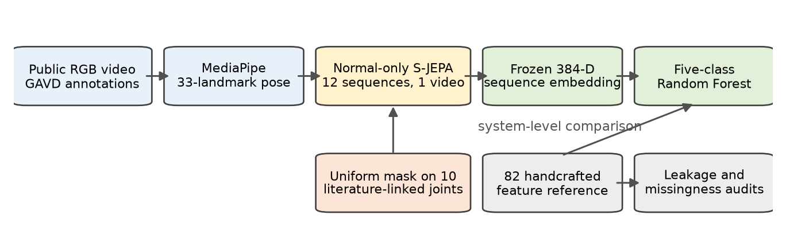
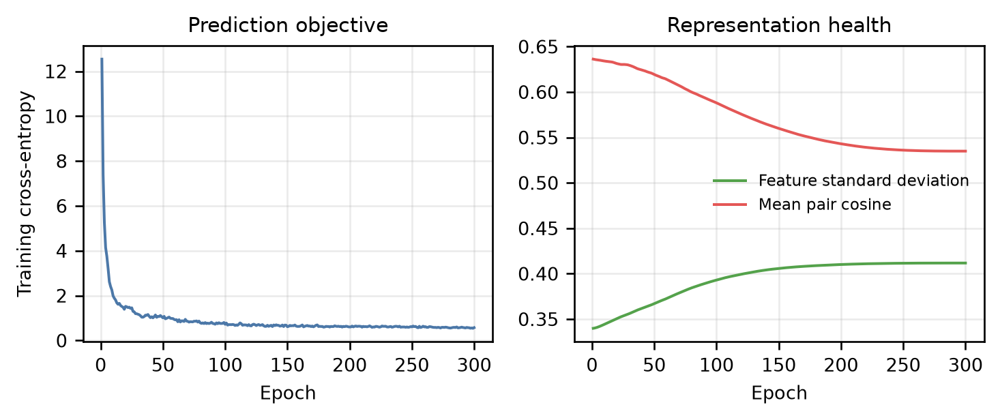
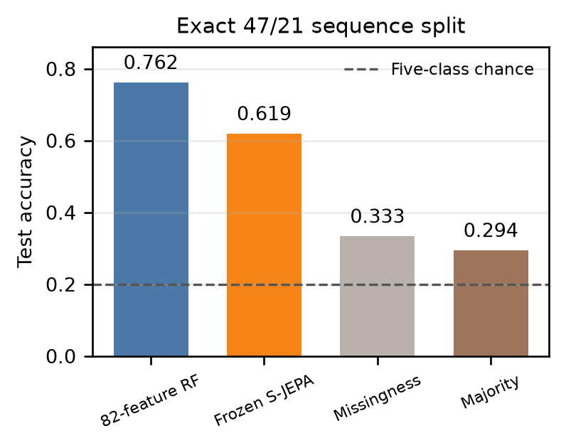

# Learning Monocular Gait Representations through Neurologically Guided Skeleton JEPA

**Alex Mui, Penny Inouye, Theodore Mui, and Phil Mui**

*Aspiring Scholars Directed Research Program (ASDRP)* 
[alexander.mui@students.asdrp.org](mailto:alexander.mui@students.asdrp.org) · [pennypenelopesf@gmail.com](mailto:pennypenelopesf@gmail.com) 
[theodoremui@gmail.com](mailto:theodoremui@gmail.com) · [phil.mui@asdrp.org](mailto:phil.mui@asdrp.org)

## Abstract

Single-camera gait video contains movement patterns shaped by neural control, muscle weakness, joint mechanics, and balance. We investigate whether these mechanisms can guide self-supervised representation learning instead of relying only on generic high-motion masking. Our model is a skeletal Joint-Embedding Predictive Architecture (S-JEPA), a world-model-inspired self-supervised method that learns to predict hidden pose representations rather than reconstruct pixels or coordinates. We study a fixed 96-sequence subset of the Gait Abnormality in Video Dataset (GAVD), using MediaPipe to convert RGB video into 33-landmark pose sequences. Neurologic and clinical gait literature on Parkinson’s disease, stroke, cerebral palsy, and myopathy guides the selection of 10 bilateral shoulder, hip, knee, ankle, and foot landmarks. During pretraining, the model uniformly masks eligible tokens from these regions and predicts their latent targets. It uses only 12 normal sequences and no condition labels. A frozen encoder then produces a 384-dimensional representation for five-class classification. On the exact 47/21 split used by a prior 82-feature Random Forest, S-JEPA reaches 61.9% accuracy and 61.3% macro F1, compared with 76.2% and 72.8% for the saved handcrafted reference. Majority and missingness-only controls reach 29.4% and 33.3% accuracy. However, every test video also appears in training, and all normal pretraining sequences come from one source video. The results therefore show feasible within-corpus representation learning, not clinical or independent-video generalization. This study contributes an auditable, neurologically guided adaptation of Skeleton JEPA while showing that source diversity and leakage-resistant evaluation remain more important than model choice.

**Index Terms:** gait analysis, self-supervised learning, S-JEPA, world models, neurologically guided masking, pose estimation

# Introduction

Walking reflects the combined action of the nervous system, muscles, joints, and balance control. Parkinson’s disease often changes speed, stride length, swing time, cadence, and double-support time \[1\]. Stroke commonly creates spatial and temporal differences between the paretic and non-paretic sides \[2\]. Cerebral palsy can produce crouch gait with excessive knee flexion during stance \[3\]. Myopathies are heterogeneous. In late-onset Pompe disease, a systematic review found mainly symmetric hip and lumbar weakness, altered pelvic motion, and reduced locomotor function \[4\]. These patterns make gait analysis useful, but gait alone does not establish a diagnosis.

Two representation strategies are possible. A handcrafted system calculates named quantities such as joint angles, speed, stride timing, sway, and symmetry. Its features are readable, but their definitions can be brittle when pose estimates are noisy or camera scale is unknown. A learned system instead discovers a numerical representation from pose sequences. It may capture interactions that were not specified in advance, but its dimensions are difficult to interpret and it may learn recording artifacts.

Joint-Embedding Predictive Architectures (JEPAs) learn by predicting hidden content in representation space rather than reconstructing every input value \[5\]. S-JEPA applies this principle to skeleton sequences and reports strong generic action recognition \[6\]. Yet generic actions and clinical gait are different. High motion can define a kick, while reduced motion can be important in gait. Temporal resizing can also weaken absolute cadence information.

This study asks a limited and testable question: can a small S-JEPA, pretrained only on available normal pose sequences, produce a useful frozen representation for five-way gait classification? We compare it with a saved reference result from a Random Forest using 82 handcrafted features. The comparison is informative but not an isolated ablation because the two systems use different feature pipelines.

Our contributions are:

1.  a gait-specific S-JEPA mask restricted to 10 literature-linked shoulder, hip, knee, ankle, and foot landmarks;

2.  an end-to-end, provenance-checked pipeline from GAVD annotations to pose, pretraining, frozen embeddings, and classification;

3.  matched-sequence comparison with the 82-feature reference and explicit controls for missing pose data; and

4.  a source-video leakage audit that defines which claims the present experiment can and cannot support.

# Related Work and Clinical Basis

## Masked skeleton representation learning

MAMP showed that predicting joint motion is more effective than reconstructing joint coordinates in its matched skeleton action experiments \[7\]. It also made high-motion tokens more likely to be masked. S-JEPA keeps a related mask but changes the target. A view encoder sees only visible tokens, while a slowly updated target encoder sees the complete sequence. A predictor estimates the target encoder’s latent vectors at hidden locations \[6\]. Skeleton2vec independently used contextual teacher targets for skeleton learning \[8\]. Therefore, “JEPA for skeletons” is not the novelty of this work. Our narrower question is whether this method and a clinically motivated mask are useful for monocular gait.

Self-supervised clinical gait learning also predates this study. GaitForeMer used motion forecasting for few-shot impairment severity estimation \[9\], and FSGait learned fine-grained abnormality representations \[10\]. Normal-only learning is therefore not new by itself. The distinct combination studied here is S-JEPA-style latent prediction on GAVD-derived monocular pose with a literature-constrained mask and explicit shortcut audits.

## Literature-guided landmark selection

The prior classifier uses 82 gait features, but the available review corpus is not an $82 \times 4$ rating matrix. It contains 83 condition-feature ratings over 56 unique feature names. Parkinson’s disease and stroke received broader reviews, while cerebral palsy and myopathy were narrowed to 10 candidates per condition. The review emphasized bilateral timing and symmetry for Parkinson’s disease and stroke, flexed hip-knee-ankle chains for cerebral palsy, and proximal symmetric weakness and trunk compensation for myopathy. Some proposed cutoffs were explicitly estimated, and several feature names map to aliases or software proxies. We therefore use the review only to select anatomical regions, not to encode diagnostic thresholds.

Instead, we mapped high-priority, region-specific features to BlazePose landmarks. The union contains left and right shoulders (11, 12), hips (23, 24), knees (25, 26), ankles (27, 28), and foot indices (31, 32). Whole-body center-of-mass features and implementation proxies were not assigned to a single region. This produces an anatomical prior without claiming that any one landmark diagnoses a condition.

# Materials and Methods

## Cohort and pose extraction

GAVD contains 1,874 clinically annotated gait sequences from more than 450 public online videos \[11\]. We lock this experiment to 96 sequences: 12 normal, 9 Parkinson’s disease, 12 stroke, 16 cerebral palsy, and 47 myopathic. These sequences come from 18 source videos, with strong class-to-video concentration (Table 1).

**Table 1. Locked cohort and source concentration**

| Condition           | Sequences | Source videos |
|:--------------------|----------:|--------------:|
| Normal              |        12 |             1 |
| Parkinson’s disease |         9 |             2 |
| Stroke              |        12 |             3 |
| Cerebral palsy      |        16 |             2 |
| Myopathic           |        47 |            10 |
| Total               |        96 |            18 |

Each GAVD bounding box is used to crop its source video. MediaPipe Pose Landmarker then estimates 33 image-relative $(x,y,z)$ landmarks and visibility per frame \[12\]. The resulting depth is a monocular model estimate, not calibrated clinical 3D motion capture. Marker-free MediaPipe gait measurements can agree well with motion capture for several temporal variables, but weaker agreement has been reported for some swing and double-support measurements \[13\]. Extraction runs in video mode with a CPU delegate and records the source video, frame numbers, crop, model hash, and extraction version.

Landmarks with visibility below 0.45 are missing. Only internal gaps of at most four frames are interpolated. Each sequence is centered on the pelvis, scaled by median shoulder or hip width, and resized to 64 frames. Missing coordinates become zero sentinels and cannot be selected as prediction targets.

## Gait-adapted S-JEPA

A token contains one landmark over four adjacent frames. A 64-frame sequence therefore forms $16 \times 33=528$ tokens. A linear layer projects each 12-value token to 96 dimensions. The view and target encoders each use four transformer layers with four attention heads. The predictor uses two transformer layers. The view encoder has 453,504 parameters and the predictor has 247,296, for 700,800 trainable parameters. The target encoder is a frozen exponential-moving-average (EMA) copy.

For each valid sample, 60% of eligible tokens are selected uniformly from the 10 literature-linked landmarks. This is a deliberate change from motion-aware masking. It avoids defining clinical importance as large displacement and permits low-motion regions to be prediction targets. Spatial flipping is disabled because laterality can matter in stroke and Parkinson’s disease.

The target encoder sees the complete sequence; the view encoder sees augmented unmasked tokens. Define $\mathbf q=\operatorname{softmax}((\mathbf z_t-\mathbf c)/\tau_t)$ and $\mathbf r=\operatorname{softmax}(\mathbf p/\tau_p)$, where $\mathbf c$ is the EMA target-feature center that removes persistent channel bias, $\tau_t=0.06$, and $\tau_p=0.10$. For width $D=96$,

$$
\mathcal L=-\sum_{d=1}^{D}q_d\log r_d.
$$
The target encoder receives no gradients. Its EMA momentum follows a cosine schedule from 0.999 toward 1.0. Training uses AdamW, batch size 4, seed 42, and 300 epochs on the 12 normal sequences. All 12 come from one source video, which is a central limitation.

## Frozen downstream evaluation

After pretraining, the target encoder is frozen. We calculate mean and standard deviation over all valid tokens, then mean and standard deviation over tokens from the 10 selected landmarks. Concatenating these four 96-dimensional summaries forms one 384-dimensional vector per sequence. A Random Forest then predicts cerebral palsy, myopathic gait, normal gait, Parkinson’s disease, or stroke.

The primary comparison uses the exact prior 68-sequence subset and its fixed 47/21 train-test partition. The prior 82-feature Random Forest result is imported as a saved reference, not recomputed in this notebook series. Its documented pipeline ignored GAVD bounding boxes, fixed frame rate at 30, included 22 all-zero features, and used wrist indices in temporal logic intended for ankles. We also classify all 96 sequences with a fixed stratified 67/29 partition. Neither split is independent by source video.

Two audits test confounding. First, a classifier uses only pose missingness statistics. Second, we count source videos shared between train and test and test sequences whose source video appeared during self-supervised pretraining. Metrics include accuracy, balanced accuracy, macro F1, confusion matrices, and one-versus-normal area under the receiver operating characteristic curve (ROC AUC).

# Results

## Training behavior

The pretraining cross-entropy falls from 12.54 at epoch 1 to 0.57 at epoch 300. Feature standard deviation rises from 0.340 to 0.412, while mean pairwise cosine similarity falls from 0.636 to 0.535. These diagnostics do not prove that every feature is meaningful, but they argue against a constant-output collapse.

## Five-class classification

On the exact 47/21 split, frozen S-JEPA embeddings reach 0.619 accuracy, 0.596 balanced accuracy, and 0.613 macro F1. The saved 82-feature reference reaches 0.762 accuracy and 0.728 macro F1 on the same sequence identifiers. The accuracy difference is 0.143. The majority-class and missingness-only controls reach 0.294 and 0.333 accuracy; missingness macro F1 is 0.336. Thus, missing pose patterns contain label-associated information, but they do not explain the full S-JEPA result.

On all 96 sequences, S-JEPA reaches 0.621 accuracy, 0.624 balanced accuracy, and 0.594 macro F1. Missingness-only accuracy is 0.448, below the 0.490 majority baseline. One-versus-normal accuracy is 0.714 for Parkinson’s disease, 0.857 for stroke, 0.889 for cerebral palsy, and 0.778 for myopathic gait. ROC AUC values are 0.750, 1.000, 1.000, and 0.911, respectively. These binary test sets contain only 7 to 18 examples, so the values are descriptive rather than stable estimates.

## Leakage audit

The exact split contains 12 training videos and 9 test videos, but all 9 test videos also occur in training. Three test sequences come from the same source video used for normal-only S-JEPA pretraining. In the 96-sequence split, all 16 test videos also occur in training, and four test sequences share the pretraining video. Grouped validation is required when observations share a hierarchical source \[14\]. Consequently, no reported classifier result measures transfer to an unseen video, person, camera, or site.

# Discussion

The central result is mixed. The frozen S-JEPA representation is well above nominal five-class chance and above the missingness-only control, so the model has learned signal useful for this split. However, the literature-informed handcrafted system is stronger by 14.3 accuracy points on the exact comparison. With only 12 normal pretraining sequences from one video, the learned model has little opportunity to discover broad normal gait variation. Handcrafted features also supply useful inductive bias in a sample-limited setting.

The result does not show that handcrafted features are universally better than learned features. It compares complete systems, not only representations. The pose model, preprocessing, feature calculations, hyperparameters, and training histories differ. The 82-feature value is a saved single-split reference, not a repeated confidence interval. The S-JEPA mask was not compared with random, full-body, motion-aware, or contralateral masks. Therefore, the study supports a feasibility statement and identifies the next controlled experiments, but it does not establish superiority.

The most important lesson is about experimental unit. GAVD sequences are segments cut from source videos. A sequence-level random split can place the same person, clothing, background, camera, and pose-estimation error on both sides. The perfect overlap found here makes 61.9% unsuitable as an estimate of deployment performance. Source concentration also entangles class with video. For example, all normal examples come from one video. A model may partly recognize the source rather than normal gait.

The literature-guided mask is a defensible but unproven adaptation. It focuses prediction on regions connected to known gait mechanisms and removes the assumption that high motion is always most informative. At the same time, excluding other landmarks may remove compensatory arm, head, or trunk motion. A fair ablation must keep data, model, optimization, target count, and evaluation fixed while changing only mask geometry.

This work is not a diagnostic study. GAVD labels are video-level gait categories, monocular pose is not calibrated motion capture, medication and disease severity are unavailable, and multiple disorders can share gait patterns. The findings cannot support screening or treatment decisions.

# Conclusion

We implemented an auditable, normal-only S-JEPA for monocular gait and replaced generic motion-aware masking with uniform prediction over 10 literature-linked landmarks. Frozen embeddings reached 61.9% five-class accuracy on an exact sequence split, below the 76.2% handcrafted reference and above the 33.3% missingness control. Training diagnostics showed non-collapsed representations. The source-video audit, however, found complete train-test video overlap. The honest conclusion is not that S-JEPA can diagnose gait conditions. It is that latent prediction is feasible and captures useful within-corpus structure, while small data, source concentration, and evaluation leakage remain stronger limits than model choice.

Future work should first create an independent-video cohort with several normal videos. It should then report repeated grouped splits and uncertainty, compare mask geometries and prediction targets under matched compute, and test whether frozen embeddings recover gait speed, cadence, asymmetry, joint excursion, and sway. These steps would turn the present audited feasibility result into a valid test of gait representation quality.

# Acknowledgment

We would like to acknowledge the generous support of the Aspiring Scholars Directed Research Program (ASDRP). We also would like to thank the GAVD dataset team for open sourcing their work.

# References

\[1\] A. P. J. Zanardi *et al.*, “Gait parameters of Parkinson’s disease compared with healthy controls: A systematic review and meta-analysis,” *Scientific Reports*, vol. 11, p. 752, 2021, doi: [10.1038/s41598-020-80768-2](https://doi.org/10.1038/s41598-020-80768-2).

\[2\] S. Lauzière, M. Betschart, R. Aissaoui, and S. Nadeau, “Understanding spatial and temporal gait asymmetries in individuals post stroke,” *International Journal of Physical Medicine and Rehabilitation*, vol. 2, no. 3, p. 201, 2014, doi: [10.4172/2329-9096.1000201](https://doi.org/10.4172/2329-9096.1000201).

\[3\] R. A. Pandey, A. N. Johari, and T. Shetty, “Crouch gait in cerebral palsy: Current concepts review,” *Indian Journal of Orthopaedics*, vol. 57, no. 12, pp. 1913–1926, 2023, doi: [10.1007/s43465-023-01002-5](https://doi.org/10.1007/s43465-023-01002-5).

\[4\] T. Maulet, C. Bonnyaud, C. Weill, P. Laforêt, and T. Cattagni, “Motor function characteristics of adults with late-onset Pompe disease: A systematic scoping review,” *Neurology*, vol. 100, no. 1, pp. e72–e83, 2023, doi: [10.1212/WNL.0000000000201333](https://doi.org/10.1212/WNL.0000000000201333).

\[5\] M. Assran *et al.*, “Self-supervised learning from images with a joint-embedding predictive architecture,” in *Proc. IEEE/CVF Conf. Computer Vision and Pattern Recognition*, 2023, pp. 15619–15629, doi: [10.1109/CVPR52729.2023.01499](https://doi.org/10.1109/CVPR52729.2023.01499).

\[6\] M. Abdelfattah and A. Alahi, “S-JEPA: A joint embedding predictive architecture for skeletal action recognition,” in *Computer Vision – ECCV 2024*, Lecture Notes in Computer Science, vol. 15090, 2024, pp. 367–384, doi: [10.1007/978-3-031-73411-3_21](https://doi.org/10.1007/978-3-031-73411-3_21).

\[7\] Y. Mao, J. Deng, W. Zhou, Y. Fang, W. Ouyang, and H. Li, “Masked motion predictors are strong 3D action representation learners,” in *Proc. IEEE/CVF Int. Conf. Computer Vision*, 2023, pp. 10147–10157, doi: [10.1109/ICCV51070.2023.00934](https://doi.org/10.1109/ICCV51070.2023.00934).

\[8\] R. Xu, L. Huang, M. Wang, J. Hu, and W. Deng, “Skeleton2vec: A self-supervised learning framework with contextualized target representations for skeleton sequence,” *arXiv preprint arXiv:2401.00921*, 2024, doi: [10.48550/arXiv.2401.00921](https://doi.org/10.48550/arXiv.2401.00921).

\[9\] M. Endo, K. L. Poston, E. V. Sullivan, L. Fei-Fei, K. M. Pohl, and E. Adeli, “GaitForeMer: Self-supervised pre-training of transformers via human motion forecasting for few-shot gait impairment severity estimation,” in *Medical Image Computing and Computer Assisted Intervention*, 2022, pp. 130–139, doi: [10.1007/978-3-031-16452-1_13](https://doi.org/10.1007/978-3-031-16452-1_13).

\[10\] B. Duan, X. Wan, and X. Zhao, “FSGait: Fine-grained self-supervised gait abnormality detection,” in *Computer Vision – ACCV 2024*, 2024, pp. 2248–2264, doi: [10.1007/978-981-96-0960-4_19](https://doi.org/10.1007/978-981-96-0960-4_19).

\[11\] R. Ranjan, D. Ahmedt-Aristizabal, M. A. Armin, and J. Kim, “Computer vision for clinical gait analysis: A gait abnormality video dataset,” *IEEE Access*, vol. 13, pp. 45321–45339, 2025, doi: [10.1109/ACCESS.2025.3545787](https://doi.org/10.1109/ACCESS.2025.3545787).

\[12\] I. Grishchenko *et al.*, “BlazePose GHUM Holistic: Real-time 3D human landmarks and pose estimation,” *arXiv preprint arXiv:2206.11678*, 2022, doi: [10.48550/arXiv.2206.11678](https://doi.org/10.48550/arXiv.2206.11678).

\[13\] C. S. T. Hii *et al.*, “Automated gait analysis based on a marker-free pose estimation model,” *Sensors*, vol. 23, no. 14, p. 6489, 2023, doi: [10.3390/s23146489](https://doi.org/10.3390/s23146489).

\[14\] D. R. Roberts *et al.*, “Cross-validation strategies for data with temporal, spatial, hierarchical, or phylogenetic structure,” *Ecography*, vol. 40, no. 8, pp. 913–929, 2017, doi: [10.1111/ecog.02881](https://doi.org/10.1111/ecog.02881).
