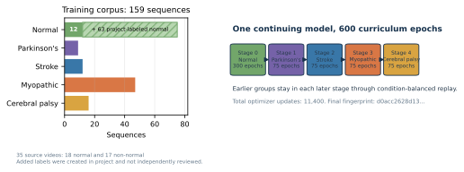
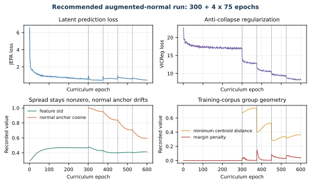

# Normal-first progressive S-JEPA training

This is the plain-language contract implemented by notebook 04. It describes the completed augmented-normal real run and explains what its diagnostics do and do not show.



## Why train in stages?

Pooling every condition from the first update would make it hard to answer a basic question: what did the model learn from normal gait before condition labels influenced the representation?

The curriculum creates a visible baseline. Stage 0 starts from fresh weights and sees only normal sequences. Each later stage adds one condition while replaying every earlier condition. The model state continues across stages. This order gives us an anchor for measuring change, but it does not guarantee that the anchor will be retained.

## The two normal data sources

Stage 0 used 75 normal sequences from 18 videos:

- 12 canonical GAVD sequences from one source video;
- 63 accepted self-annotated windows from 17 additional YouTube videos.

The added windows use automatic MediaPipe bounding boxes. They are not canonical GAVD annotations and are not independently clinically verified. The extraction report contains 64 candidates. Notebook 04 accepts candidates whose neurologic-landmark coverage is at least 0.45. One 44-frame candidate had coverage 0.027 and was rejected.

This selection is now enforced from `augmented_pose_extraction_report.csv`. The loader checks that every accepted pose file exists and ignores rejected candidates. The cohort is therefore defined by a recorded rule rather than by the files that happen to remain in a folder.

## One continuing model

|Stage|New group|Active sequences|Source videos|Epochs|Optimizer updates|Checkpoint|
|---:|---|---:|---:|---:|---:|---|
|0|Normal|75|18|300|5,700|`sjepa_normal_augmented.pt`|
|1|Parkinson's|84|20|75|1,425|`sjepa_stage_01_parkinsons_augmented.pt`|
|2|Stroke|96|23|75|1,425|`sjepa_stage_02_stroke_augmented.pt`|
|3|Myopathic|143|33|75|1,425|`sjepa_stage_03_myopathic_augmented.pt`|
|4|Cerebral palsy|159|35|75|1,425|`sjepa_stage_04_cerebralpalsy_augmented.pt`|

The Stage 4 state is also saved as `sjepa_curriculum_final_augmented.pt`. Total training was 600 epochs and 11,400 optimizer updates.

The view encoder, predictor, EMA target encoder, target center, VICReg projector, and normal reference continue across stages. Model parameters are not reinitialized. Each stage deliberately creates a fresh AdamW optimizer and learning-rate schedule, so optimizer moments, warmup, and schedule position restart at the stage boundary. Each batch draws the same number of samples from every active condition. This balances the training stream even though the stored cohort is highly imbalanced.

The final experiment fingerprint is:

```text
d0acc2628d134959d8b91e96d5112fc3bed560fe8feb9569e5b13b11a8b614d1
```

This SHA-256 value identifies the experiment and data payload saved in the checkpoint. It is not the checksum of the checkpoint file itself.

## Pose preprocessing

Each pose sequence has shape `[time, 33, 4]`: three coordinates plus visibility. Notebook 04 applies these steps:

1. mark a joint valid when visibility is at least 0.45;
2. interpolate internal coordinate gaps of at most four frames while preserving the original validity mask;
3. subtract the pelvis center;
4. divide by a shoulder-and-hip width scale;
5. replace remaining invalid coordinates with a zero sentinel;
6. resize coordinates and validity to 64 frames;
7. join every four frames into one time patch.

The result has 16 time patches and 33 joints, or 528 possible joint-time tokens.

## The target whitelist and the actual mask rule

Only these BlazePose indices may become hidden prediction targets:

```python
MASK_KEYPOINTS = [11, 12, 23, 24, 25, 26, 27, 28, 29, 30, 31, 32]
```

They are the left and right shoulders, hips, knees, ankles, heels, and foot indices. The list is expanded and de-duplicated from `experiments/multiple-sclerosis/mapping-data/ms-pd-mapping.md`. Applying it to this five-group experiment is a project rule, not a validated diagnostic rule.

The configuration says `mask_fraction = 0.60`, but 0.60 is an upper target rather than a promise for every sample. The sampler works as follows:

1. count valid eligible tokens in each sample in the batch;
2. take the smallest count;
3. multiply that count by 0.60 and round down;
4. cap the result so at least one eligible token remains visible;
5. sample that common number uniformly without replacement in every sample.

This batch-minimum rule gives tensors a common target count. A sample with more valid tokens therefore has a realized fraction below 0.60. The mean realized eligible fraction was 0.551 at the end of Stage 0 and 0.423 at the end of Stage 4. The sampler never reads position, motion magnitude, velocity, acceleration, or a learned motion score. Assertions reject every forbidden target.

## Three loss terms with three jobs

\[
\mathcal L_{total}
=\mathcal L_{JEPA}
+0.05\mathcal L_{VICReg}
+0.25\mathcal L_{group}.
\]

`L_JEPA` trains the predictor to match hidden target-encoder features. The target encoder receives the full sequence and no gradient. It follows the view encoder through a cosine EMA schedule that starts at 0.999.

`L_VICReg` compares two geometric views of a sequence. Its invariance term brings paired views together. Its variance term resists constant dimensions. Its covariance term reduces redundant dimensions. In the code, the usual VICReg components are `25 * invariance + 25 * variance + covariance` before the outer weight of 0.05 is applied.

`L_group` is zero at Stage 0. In later stages it combines within-label compactness with a squared penalty when normalized condition centroids are closer than margin 1.0. Its outer weight is 0.25. Because this term reads folder labels, Stages 1 through 4 are label-informed representation fine-tuning.

## Measured stage endpoints

|Stage|JEPA loss|VICReg loss|Compactness|Margin penalty|Feature std|Pair cosine|Minimum training centroid distance|Normal-anchor cosine|
|---:|---:|---:|---:|---:|---:|---:|---:|---:|
|0|0.569|16.997|0|0|0.466|0.359|not applicable|reference|
|1|0.449|12.989|0.0787|0.0004|0.430|0.492|0.740|0.954|
|2|0.613|10.474|0.0672|0.0028|0.399|0.624|0.527|0.839|
|3|0.611|9.368|0.0775|0.0251|0.406|0.628|0.336|0.707|
|4|0.478|8.418|0.0745|0.0379|0.414|0.609|0.364|0.594|



## Step-by-step interpretation

### 1. Did training diverge?

No. Losses stayed finite through all stages, all checkpoints were written, and the parent lineage is complete.

### 2. Did every feature collapse to one constant?

The final feature standard deviation was 0.414, not near zero, and mean pairwise cosine was 0.609, not near one. These values are evidence against total collapse. They do not prove that the features encode gait rather than nuisance signals.

### 3. Did replay preserve the normal representation?

Only partly. Normal-anchor cosine fell from 0.954 after Stage 1 to 0.594 after Stage 4. That is substantial drift. Balanced replay reduced the chance of forgetting, but it did not preserve the original normal geometry.

### 4. Did the training margin produce clean groups?

No. The final margin penalty remained above zero, so the margin was not fully met. More importantly, notebook 05 found a canonical-96 cosine silhouette of 0.009 and a minimum centroid distance of 0.0367. The classes are not cleanly separated.

### 5. Why do the training and inspection distances differ?

The Stage 4 table reports the Euclidean centroid diagnostic used during training on the active 159-sequence corpus. Notebook 05 reports cosine distances on pooled 384-dimensional target-encoder vectors for the canonical 96 sequences. They answer different questions, use different vectors, and use different corpora. Their numerical values should not be compared as if they were the same metric.


## What every checkpoint records

- mode, stage, ordered conditions, epoch counts, and optimizer updates;
- parent experiment fingerprint and full sequence membership;
- mapping path, mapping SHA-256, and the 12-keypoint whitelist;
- preprocessing and mask configuration;
- model, EMA target, predictor, VICReg projector, and target-center states;
- optimizer update counts, while optimizer and scheduler states themselves are not saved;
- JEPA, VICReg, and group-loss settings;
- whether the curriculum is complete and label-informed.

Notebook 05 and notebook 06 reject a missing or incomplete curriculum, the wrong stage order, a different whitelist, or an artifact from the wrong run mode.

## What the run can support

The completed run supports these narrow statements:

- a five-stage S-JEPA curriculum executed to completion on the recorded 159-sequence corpus;
- the final representation did not totally collapse;
- later stages caused substantial normal-anchor drift;
- canonical five-condition geometry remained weak;
- frozen features contain class-related structure inside the already-seen corpus.


It does not establish generalization to an unseen video, person, camera, or clinic. The current classifier lanes use an encoder that already saw every evaluated sequence. A valid estimate needs a source-video split before all preprocessing and representation training, followed by a fresh five-stage model inside each outer training fold.


