# The goal is feature learning, not diagnosis

::: columns
::: {.column width="38%"}

- A 64-frame skeleton becomes **528 joint-time tokens**.
- The student sees visible tokens.
- A slow teacher sees the complete sequence.
- A predictor estimates teacher features at hidden locations.
- The research question is whether the learned vector retains useful gait structure.

**Scope:** exploratory representation research. Folder labels are not diagnoses verified by this project.

:::
::: {.column width="62%"}

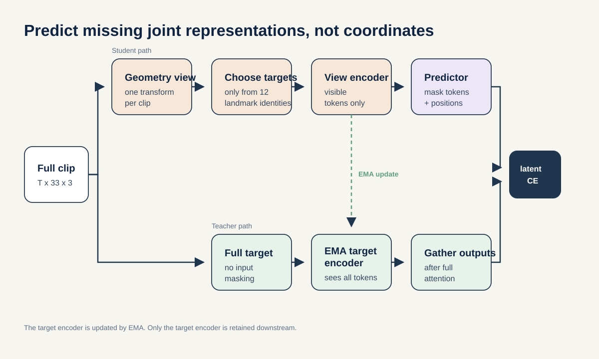{width=100%}

:::
:::

::: notes
Start with the learning task. Each sequence has 64 normalized frames, 33 MediaPipe landmark identities, and three coordinate values. Four frames for one joint form one token. This creates 16 time patches times 33 joints, or 528 possible tokens. The student encoder receives only the visible tokens. The predictor fills the selected hidden positions in feature space. The target encoder sees the full sequence and changes slowly through an exponential moving average, or EMA. It supplies a stable feature target and does not receive a gradient. This is latent prediction, not video generation and not a clinical diagnosis. The project uses GAVD folder names as dataset labels. The added normal clips were not independently clinically reviewed. Sources: references 1 through 4.
:::

# The project improved in three different ways

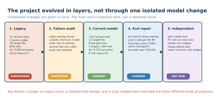{width=96%}

::: notes
Read this timeline from left to right. The legacy system was a useful prototype, but its normal training data came from one video. The failure audit then exposed source-video overlap, detector missingness, lost temporal order, and the absence of an independent outer test. The current model broadens the normal data, expands the target whitelist, adds two loss jobs, and continues through five stages. The latest Lane C change repaired the classifier fold definition without changing the encoder. The final card is different: it describes the experiment still needed for an unseen-video estimate. A model improvement, an evaluation improvement, and a reporting improvement are all valuable. They do not support the same claim.
:::

# The first prototype exposed four limits

|Audit finding|Concrete evidence|Response and remaining limit|
|---|---|---|
|One normal source|12 windows from 1 video|Add 63 accepted windows from 17 videos, while keeping their provenance separate|
|Rows were split, not videos|All 16 A1 test videos also occur in classifier training|Add grouped Random Forest audits; the encoder still saw every row|
|Detector missingness carried labels|Visibility-only A1 accuracy was 0.448|Keep a missingness control beside the learned readout|
|Mean and standard deviation remove order|The readout compresses all time patches into 384 values|Document the limit; temporal pooling remains a proposed ablation|

::: notes
The prototype did its job because it made the hidden assumptions measurable. First, twelve windows from one source video are correlated observations, not twelve independent people or camera settings. Second, a row-level split can put different windows from one video on both sides. In A1, every one of the 16 test videos also appears in classifier training. Third, a 97-value visibility-only control reached 0.448 accuracy on A1. That means pose success and failure are related to the labels and form a meaningful shortcut floor. Fourth, the downstream vector uses means and standard deviations, so it cannot tell the Random Forest when an event happened. The current work addresses some of these limits, documents the rest, and does not pretend that one new score solved all four.
:::

# More normal videos increased breadth and added a provenance risk

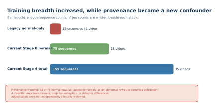{width=94%}

::: notes
The canonical GAVD cohort remains locked at 96 sequences from 18 videos. The project added normal walking windows through a separate extraction path. That path proposed 64 candidates from 17 additional videos. Sixty-three passed the authorized-landmark coverage threshold of 0.45. One candidate had coverage 0.027 and was rejected. Stage 0 therefore contains 12 canonical normal sequences plus 63 added-normal sequences, or 75 sequences from 18 videos. This is a real gain in source breadth. It also creates a new risk: 63 of 75 normal rows use the added extraction path, while every abnormal row uses the canonical path. A classifier can learn camera, crop, detector, or bounding-box differences. The scientific unit of diversity is 17 added videos, not 63 independent people.
:::

# A fixed target rule turns joints into a learnable question

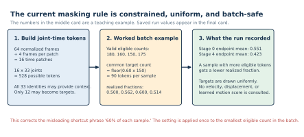{width=94%}

::: notes
Work through the figure in three steps. First, 64 frames divided by four frames per patch gives 16 time patches. Multiplying by 33 joints gives 528 possible tokens. All 33 joint identities may provide visible context, but only 12 may become hidden targets: both shoulders, hips, knees, ankles, heels, and foot indices. Second, the mask builder counts valid eligible tokens for every sample in a batch. It takes 60 percent of the smallest count and gives every sample that common target count. Therefore, samples with more valid eligible tokens have a smaller realized fraction. The phrase 60 percent of each sample is not correct. Third, the saved endpoint means were 0.551 at Stage 0 and 0.423 at Stage 4. Targets are drawn uniformly. No velocity, displacement, acceleration, or learned motion score is used, and no forbidden joint is substituted.
:::

# The objective changed from one job to three

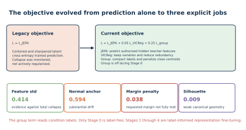{width=94%}

::: notes
The legacy objective contained only the JEPA prediction term. The current objective adds two jobs. JEPA still asks the predictor to match teacher features at authorized hidden tokens. VICReg keeps two views of the same sequence close, pushes feature dimensions to retain variance, and reduces redundant covariance. This is active anti-collapse pressure. The group term uses condition labels to make same-label vectors more compact and penalize nearby group centers. Its weight is zero during normal-only Stage 0 and 0.25 during Stages 1 through 4. The saved total is JEPA plus 0.05 times VICReg plus 0.25 times the group term. Because the group term reads labels, only Stage 0 is label-free. The later stages are label-informed representation fine-tuning. Sources: references 1, 2, and 5.
:::

# One model continues through five ordered stages

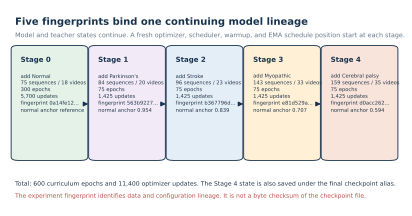{width=94%}

::: notes
This is one continuing model lineage. The student encoder, target encoder, predictor, centering state, and VICReg projector continue from one stage to the next. Each stage starts a fresh AdamW optimizer, learning-rate scheduler, warmup, and EMA schedule position. Stage 0 trains on 75 normal sequences for 300 epochs. Four 75-epoch stages then add Parkinson's, stroke, myopathic gait, and cerebral palsy. Condition-balanced replay keeps earlier groups in later batches. The final total is 600 curriculum epochs and 11,400 optimizer updates. Every stage records a fingerprint tied to its parent, cohort, mask rule, loss settings, and configuration. The fingerprint identifies experiment lineage. It is not a byte checksum of the checkpoint file.
:::

# Training avoided total collapse, but normal features drifted

{width=83%}

::: notes
Do not read a falling loss as proof of a useful representation. Use the diagnostics together. The JEPA and VICReg losses stayed finite. Final feature standard deviation was 0.414, so the extreme case in which every sequence becomes one identical vector did not occur. Final pair cosine was 0.609, another signal against complete collapse. At the same time, normal-anchor cosine fell from 0.954 after Stage 1 to 0.594 after Stage 4. The normal reference therefore changed substantially as condition groups entered. The Stage 4 margin penalty remained 0.038, so the requested training-corpus group margin was not fully met. Balanced replay reduced the risk of forgetting, but it did not prevent this drift. These are training diagnostics, not held-out accuracy.
:::

# The 384-value summary contains signal, but groups overlap

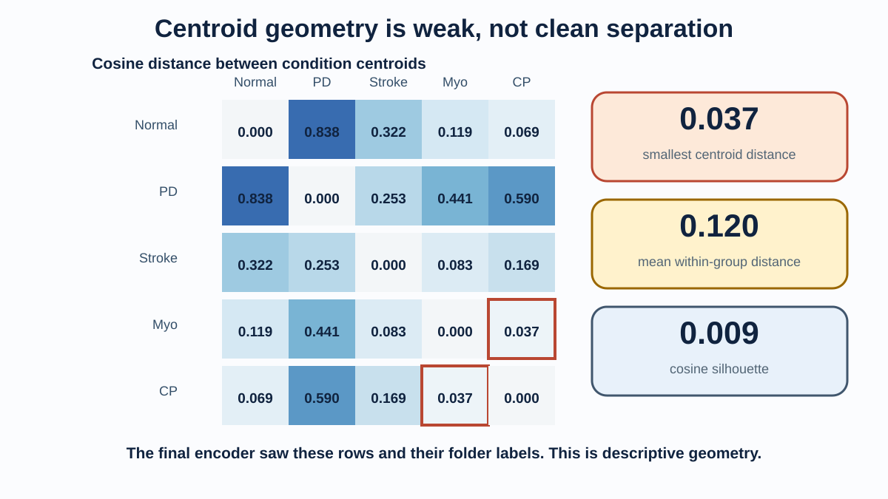{width=92%}

::: notes
Notebook 05 freezes the final target encoder before any Random Forest is fitted. For each canonical sequence, it joins four 96-value summaries: global mean, global standard deviation, authorized-target mean, and authorized-target standard deviation. This makes a 384-value vector. On the 96 canonical rows, the mean within-condition cosine distance was 0.120. The smallest distance between condition centers was only 0.037, between myopathic and cerebral-palsy rows. Cosine silhouette was 0.009, close to the point where within-group and nearest-other-group distances balance. The representation contains label-related structure, but these numbers do not show five clean clusters. The same rows and labels shaped the later training stages, so this geometry is descriptive and label-informed. Source for silhouette theory: reference 9.
:::

# Three readout lanes answer three limited questions

{width=92%}

::: notes
A1 asks whether a shallow classifier can recover labels inside the full known canonical corpus. It uses 67 training rows and 29 test rows, but 16 source videos cross the split and all 29 test rows trained the encoder. A2 reproduces the historical 47 training and 21 test assignment. Nine videos cross that classifier split, and all 21 test rows trained the encoder. Lane C groups source videos inside the Random Forest evaluation. The binary task has five folds and the five-class task has two. However, the final encoder was trained once on all 159 rows. Lane C is therefore classifier-video-disjoint but encoder-exposed. None of these lanes estimates performance for a new person, video, camera, or clinic. Grouped-data guidance comes from reference 7.
:::

# “All-96 stratified” balances classes, not videos

{width=90%}

::: notes
Stratification means that each class keeps roughly the same proportion on each side. The full cohort has 12 normal, 9 Parkinson's, 12 stroke, 47 myopathic, and 16 cerebral-palsy sequences. The training side receives 67 rows and the test side receives 29. This helps prevent the small classes from disappearing from the test set. It does not separate videos. Every one of the 16 test videos also occurs in classifier training. It also does not undo representation training. The encoder had already used all 96 rows and, after Stage 0, their folder labels. The current A1 result is 0.793 accuracy, 0.889 balanced accuracy, and 0.821 macro-F1. The visibility-only control is 0.448 accuracy. The valid conclusion is that the vector contains class-related structure inside this known corpus.
:::

# Previous and current scores changed for different reasons

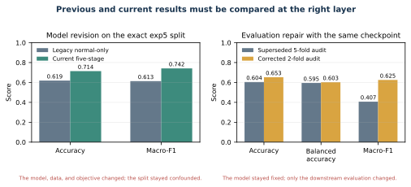{width=94%}

::: notes
The left chart compares two different representation systems on the same historical 47/21 assignment. The legacy normal-only model reached 0.619 accuracy and 0.613 macro-F1. The current five-stage model reached 0.714 accuracy, 0.730 balanced accuracy, and 0.742 macro-F1. The approximate changes are plus 0.095 accuracy and plus 0.129 macro-F1. Data, targets, losses, training, and provenance contracts changed together, so this is not a component ablation. The right chart is an evaluation repair. The checkpoint and all 159 embeddings stayed fixed. Replacing five ordinary group folds with two stratified group folds moved mean accuracy from 0.604 to 0.653 and fixed-label macro-F1 from 0.407 to 0.625. That change reflects a better-defined five-class task, not a better encoder.
:::

# Lane C repaired the evaluation, not the model

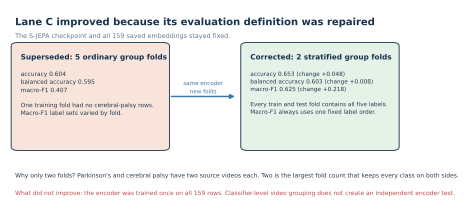{width=92%}

::: notes
The earlier five-fold version was superseded because one training fold had no cerebral-palsy rows and the macro-F1 label list changed from fold to fold. Parkinson's and cerebral palsy each have only two source videos. Two StratifiedGroupKFold folds are therefore the largest feasible design that keeps all five labels on both sides. The corrected mean is 0.653 accuracy, 0.603 balanced accuracy, and 0.625 fixed-label macro-F1. Pooled predictions give 0.654 accuracy and 0.619 macro-F1. The actual majority baseline in these 159 rows is normal at 75 divided by 159, or 0.472. The encoder still saw 159 of 159 fold-test rows. A grouped Random Forest cannot undo that exposure. Call this a classifier-level stress test, not unseen-video generalization.
:::

# The next valid test must split videos before learning

{width=90%}

::: notes
End with the claim boundary. The current work is a meaningful engineering improvement: it broadens Stage 0 from one normal video to 18, uses 12 target identities, adds active anti-collapse pressure, completes five fingerprinted stages, improves the exact-split descriptive readout, and repairs the Lane C fold definition. It also shows substantial normal drift and weak five-group geometry. The next valid experiment must split complete source videos first. For every outer fold, choose preprocessing only from training videos, start S-JEPA from fresh weights, train all five stages, fit the classifier, and then open the held-out videos once. Save per-fold predictions, class and video support, provenance, and exposure audits. Only that design can estimate how the complete pipeline behaves on unseen videos.
:::

# Appendix: legacy and current methods differ at six layers

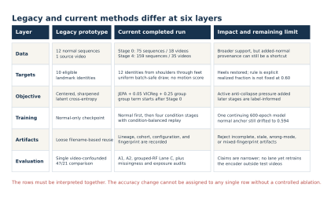{width=93%}

::: notes
This matrix prevents a common attribution error. The exact-split score changed after six method layers changed together. It is valid to compare the complete legacy and current systems on that fixed assignment. It is not valid to say that VICReg, heel targets, added normal videos, or curriculum order caused the whole change. Controlled ablations are still required.
:::

# Appendix: added normal data use a separate extraction path

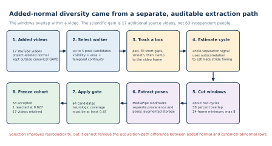{width=91%}

::: notes
The added pipeline inspects pose candidates, selects a walker, smooths a bounding-box track, estimates a cycle from ankle separation, proposes overlapping windows, and extracts MediaPipe landmarks. The extraction report is the selection contract used by notebooks 04 and 06. A rejected pose file cannot enter just because it remains on disk. These rows are useful added normal data, not canonical GAVD annotations.
:::

# Appendix: the full video must remain available

::: columns
::: {.column width="64%"}

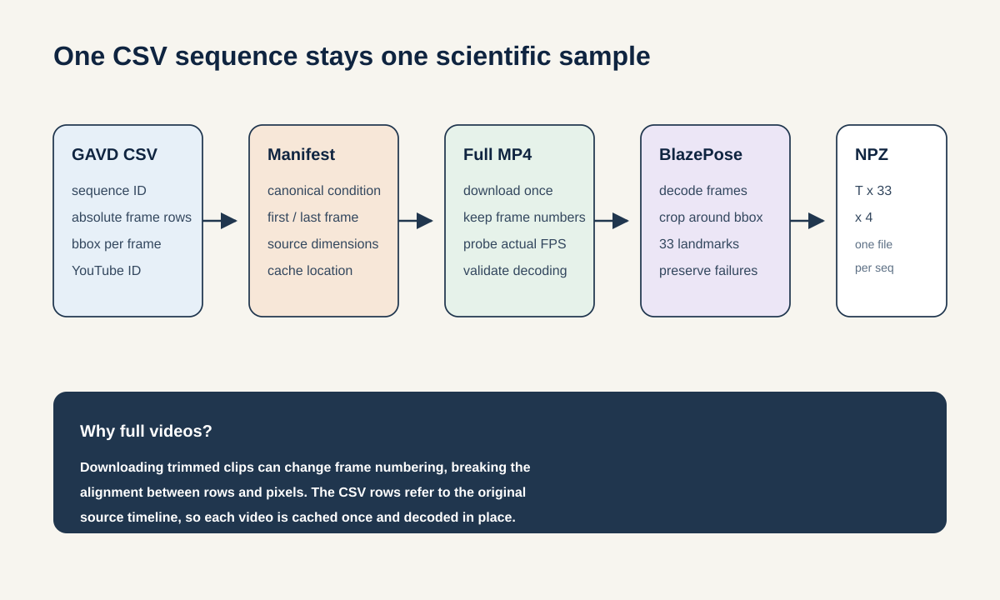{width=100%}

:::
::: {.column width="36%"}

1. Cache the complete source video.
2. Select the annotated frame range.
3. Crop the intended walker.
4. Keep failed pose frames explicit.
5. Center, scale, and resize to 64 frames.
6. Preserve source-video identity for audits.

MediaPipe depth is relative monocular depth, not calibrated 3D motion.

:::
:::

::: notes
The manifest does not point to an already clipped video. Its frame numbers belong to the original source timeline. Caching the full video is therefore required for correct extraction and for a useful notebook preview. Pose failures remain explicit rather than being silently dropped. That allows later coverage and missingness controls. Sources: references 3, 4, and 6.
:::

# Appendix: exact cohort and target identities

::: columns
::: {.column width="54%"}

|Canonical folder label|Sequences|Videos|
|---|---:|---:|
|Normal|12|1|
|Parkinson's|9|2|
|Stroke|12|3|
|Myopathic|47|10|
|Cerebral palsy|16|2|
|**Total**|**96**|**18**|

:::
::: {.column width="46%"}

**Authorized hidden target identities**

- 11, 12: shoulders
- 23, 24: hips
- 25, 26: knees
- 27, 28: ankles
- 29, 30: heels
- 31, 32: foot indices

No motion score. No fallback joint. All 33 identities may provide visible context.

:::
:::

::: notes
The current whitelist contains 12 landmark identities. The legacy whitelist contained 10 because heels 29 and 30 were absent. A landmark identity is not one token. Each identity can appear in 16 time patches, so validity determines how many eligible joint-time tokens each sequence contributes.
:::

# Appendix: the 384-value readout is deliberately simple

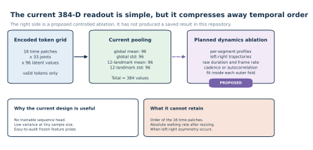{width=92%}

::: notes
The readout has no trainable sequence head. This keeps variance low for a small dataset and makes the feature probe easy to audit. Its cost is clear: mean and standard deviation cannot preserve the order of 16 time patches, absolute walking rate after resizing, or the timing of left-right asymmetry. The right-hand card is a proposed ablation, not a completed result.
:::

# Appendix: aggregate scores hide class behavior

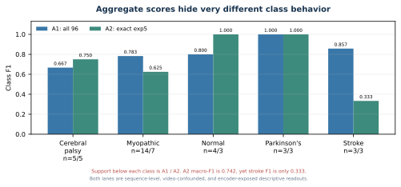{width=92%}

::: notes
Macro-F1 gives every class equal weight, which is useful in an imbalanced cohort. It can still hide a weak class. On A2, normal and Parkinson's each had F1 of 1.000, while stroke had F1 of 0.333. The test support is tiny: three rows each for normal, Parkinson's, and stroke. Always read class support and the confusion pattern beside the aggregate value.
:::

# Appendix: exact-split errors repeat by source video

::: columns
::: {.column width="62%"}

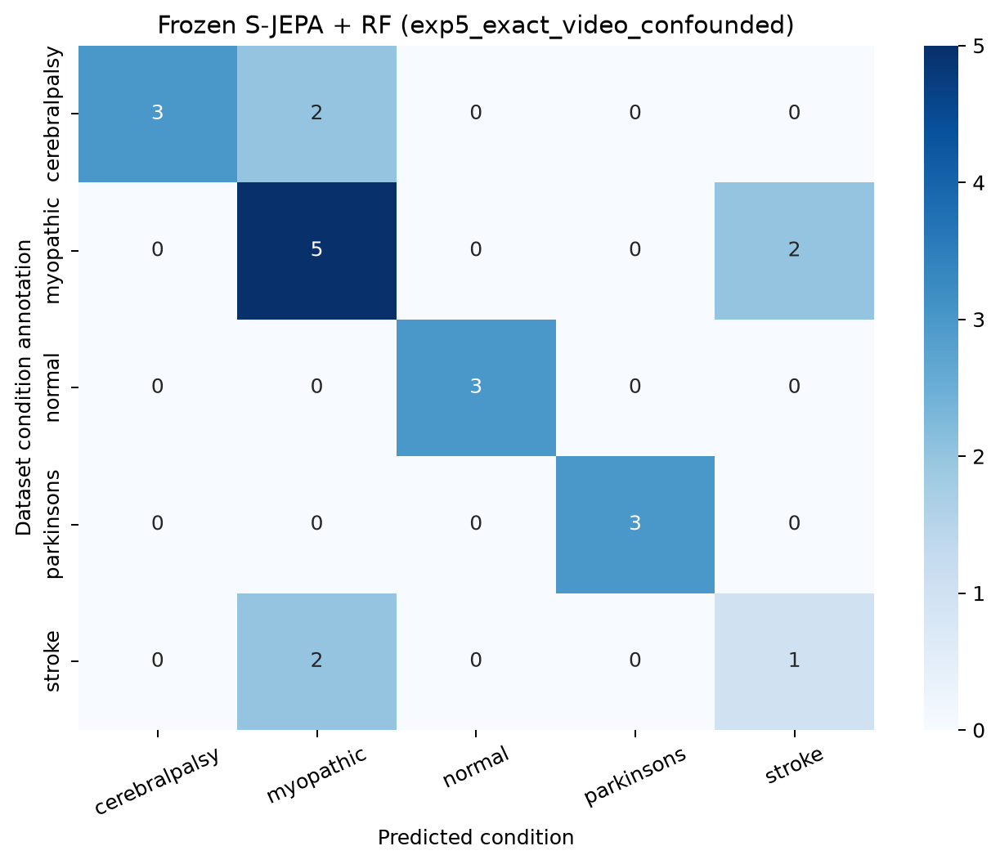{width=100%}

:::
::: {.column width="38%"}

**Examples**

- Two stroke sequences from `5gpoegYv1hs` were predicted as myopathic.
- Two cerebral-palsy sequences from `DlPDuHBAP7A` were predicted as myopathic.
- Two myopathic errors came from two different source videos and were predicted as stroke.

Repeated rows from one video are not independent patients.

:::
:::

::: notes
The confusion matrix contains only 21 test rows. It is more informative than accuracy alone because it shows that the same source video can contribute repeated errors. The split is preserved for historical comparison, not for an unseen-video claim.
:::

# Appendix: the current readouts are stress tests

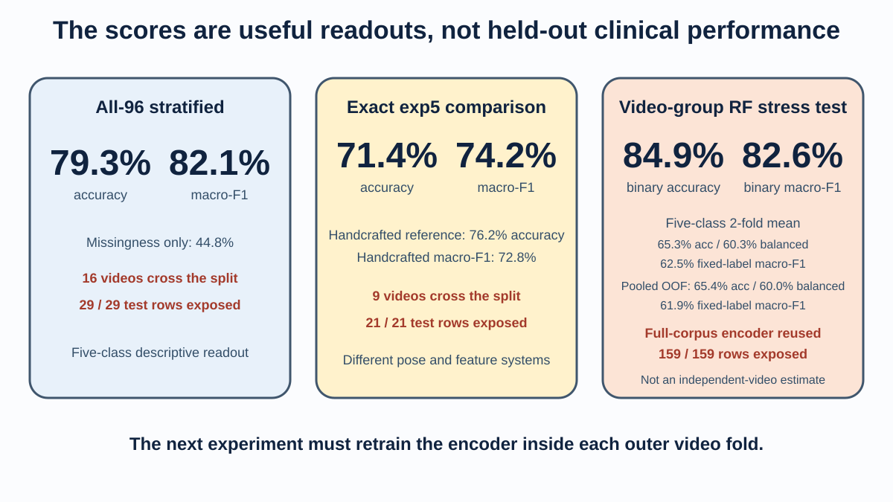{width=93%}

::: notes
The all-96 and exact-split lanes are sequence-level descriptive readouts. The grouped Random Forest lane prevents the same video from appearing on both sides of a classifier fold. The encoder exposure remains complete in every lane. The binary and five-class Lane C values also answer different tasks, so their bar heights should not be compared as though the class sets were identical.
:::

# Appendix: model history and current result ledger

|Readout version|Accuracy|Balanced accuracy|Macro-F1|Status and meaning|
|---|---:|---:|---:|---|
|Legacy A2 normal-only|0.619|0.596|0.613|Superseded model; same confounded 47/21 assignment|
|Current A2 five-stage|0.714|0.730|0.742|Current model; same assignment and encoder exposure|
|Legacy A1 normal-only|0.621|0.624|0.594|Superseded model; sequence split|
|Current A1 five-stage|0.793|0.889|0.821|Current model; 29 of 29 test rows exposed|
|Lane C five-class, old five-fold mean|0.604|0.595|0.407|Superseded evaluation; label support changed by fold|
|Lane C five-class, corrected two-fold mean|0.653|0.603|0.625|Same checkpoint; every fold has all five labels|
|Lane C five-class, corrected pooled predictions|0.654|0.600|0.619|Current summary; all 159 rows exposed|

::: notes
The legacy and current A1 and A2 rows compare different models. The old and corrected Lane C rows compare different evaluation definitions with the same model and embeddings. The legacy A2 accuracy of 0.619 and the corrected pooled Lane C macro-F1 of 0.619 are different metrics that happen to round to the same value.
:::

# Appendix: small binary probes are regression checks

|Condition versus normal|Legacy accuracy|Current accuracy|Legacy macro-F1|Current macro-F1|Test rows|
|---|---:|---:|---:|---:|---:|
|Parkinson's|0.714|1.000|0.708|1.000|7|
|Stroke|0.857|1.000|0.857|1.000|7|
|Myopathic|0.778|0.944|0.679|0.926|18|
|Cerebral palsy|0.889|0.889|0.883|0.889|9|

::: notes
These four readouts complete the legacy-to-current history recovered in the result ledger. The apparent gains are not independent estimates because the test sets contain only 7 to 18 rows, source videos cross the sequence splits, and the final encoder already saw the evaluated rows and labels. Cerebral-palsy accuracy did not change. This is another reason to preserve per-task history rather than report only the best-looking values.
:::

# Appendix: controls, baselines, and binary Lane C

|Check|Accuracy|Balanced accuracy|Macro-F1|Additional detail|
|---|---:|---:|---:|---|
|A1 missingness only|0.448|0.466|0.429|97 visibility fractions, no coordinates|
|A2 missingness only|0.333|0.364|0.336|Same control on the 47/21 assignment|
|A1 majority baseline|0.490|0.200|0.132|Canonical majority is myopathic, 47 of 96|
|Lane C five-class majority|0.472|0.200|0.128|Lane C majority is normal, 75 of 159|
|Lane C normal versus abnormal|0.849|0.874|0.826|Five grouped RF folds; mean ROC AUC 0.966|

::: notes
The missingness controls show how much label structure exists in detector success and failure alone. The learned vector exceeds these controls on A1 and A2, but both systems remain inside the same confounded split. The Lane C binary task uses five grouped classifier folds. Its accuracy range from 0.800 to 0.906 summarizes five related fold scores and is not a population confidence interval.
:::

# Appendix: the artifact contract rejects silent substitution

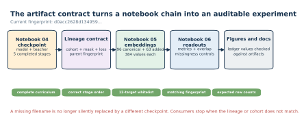{width=92%}

::: notes
Notebook 05 and notebook 06 do not accept an arbitrary file with a familiar name. They check stage completion, target identities, cohort, configuration, and experiment fingerprint. This is the direct fix for the earlier missing-checkpoint problem: the current consumer resolves the final augmented checkpoint and stops when the expected lineage is incomplete or inconsistent.
:::

# Appendix: seven notebooks form one audit trail

{width=90%}

::: notes
Notebook 00 defines the learning graph and invariants. Notebook 01 builds the manifest and source-video cache. Notebook 02 extracts and displays skeletons. Notebook 03 proves the target mask rule. Notebook 04 trains and fingerprints the five-stage curriculum. Notebook 05 freezes and inspects the representation. Notebook 06 fits the readouts, controls, overlap audits, and Lane C stress tests. Real mode stops when a required artifact or fingerprint is missing.
:::

# Appendix: reproduce and verify

::: columns
::: {.column width="52%"}

**Primary artifacts**

- `sjepa_curriculum_final_augmented.pt`
- `curriculum_training_history_augmented.csv`
- `curriculum_stage_summary_augmented.csv`
- `sequence_embeddings.parquet`
- `classifier_metrics.csv`
- `lane_c_video_disjoint_metrics.csv`
- `classifier_contract.json`
- `result_history.csv`

:::
::: {.column width="48%"}

**Current experiment identity**

`d0acc2628d134959d8b91e96d5112fc3bed560fe8feb9569e5b13b11a8b614d1`

The fingerprint names data and configuration lineage. It is not a byte checksum.

Run notebooks 00 through 06 in order. Use real mode for reported values.

:::
:::

::: notes
The final checkpoint alias ends in augmented. Consumers verify its lineage before loading it. The result ledger keeps superseded and current values together instead of overwriting history. Rebuilding figures from the saved CSV files provides a further consistency check.
:::

# Appendix: separate completed work from proposed work

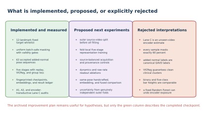{width=92%}

::: notes
The archived improvement notes contain useful hypotheses, but they are not a list of current features. Outer source-video folds, fold-local five-stage training, dynamics-preserving readouts, and uncertainty from independent outer folds remain proposed. The current system does not use motion-ranked targets, does not mask exactly 60 percent of every sample, and does not provide an unseen-video encoder estimate.
:::

# Appendix: references and responsible use

::: columns
::: {.column width="50%"}

1. Abdelfattah and Alahi. S-JEPA. *ECCV*, 2024. [DOI](https://doi.org/10.1007/978-3-031-73411-3_21)
2. Assran et al. I-JEPA. *CVPR*, 2023. [DOI](https://doi.org/10.1109/CVPR52729.2023.01499)
3. Ranjan et al. GAVD. *IEEE Access*, 2025. [DOI](https://doi.org/10.1109/ACCESS.2025.3545787)
4. Grishchenko et al. BlazePose GHUM Holistic, 2022. [DOI](https://doi.org/10.48550/arXiv.2206.11678)
5. Bardes, Ponce, and LeCun. VICReg. *ICLR*, 2022. [OpenReview](https://openreview.net/forum?id=xm6YD62D1Ub)
6. Google AI Edge. Pose Landmark Detection Guide. [Documentation](https://ai.google.dev/edge/mediapipe/solutions/vision/pose_landmarker)

:::
::: {.column width="50%"}

7. Roberts et al. Group-aware cross-validation. *Ecography*, 2017. [DOI](https://doi.org/10.1111/ecog.02881)
8. Bengio and Grandvalet. Variance of K-fold cross-validation. *JMLR*, 2004. [Article](https://www.jmlr.org/papers/v5/grandvalet04a.html)
9. Rousseeuw. Silhouettes for cluster analysis, 1987. [DOI](https://doi.org/10.1016/0377-0427(87)90125-7)
10. Breiman. Random Forests. *Machine Learning*, 2001. [DOI](https://doi.org/10.1023/A:1010933404324)
11. Hui et al. Motion-topology masked prediction. *Scientific Reports*, 2026. [DOI](https://doi.org/10.1038/s41598-026-39330-9)

**Responsible use:** research comparison only. Do not use these outputs for diagnosis, triage, or patient-level decisions.

:::
:::

::: notes
These references cover the S-JEPA and JEPA method family, the GAVD data source, MediaPipe pose extraction, VICReg, grouped evaluation, cross-validation uncertainty, silhouette interpretation, Random Forests, and recent skeleton masking research. The presentation reports dataset-label prediction and representation diagnostics, not clinical validity.
:::
