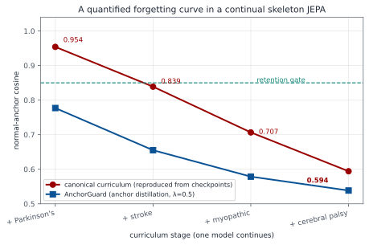
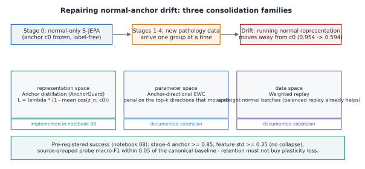
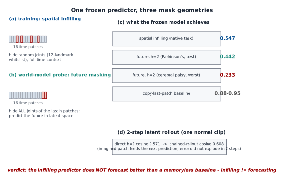
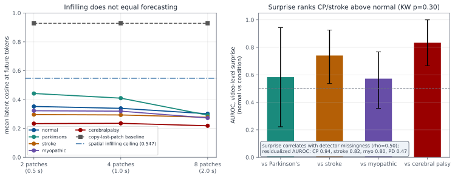
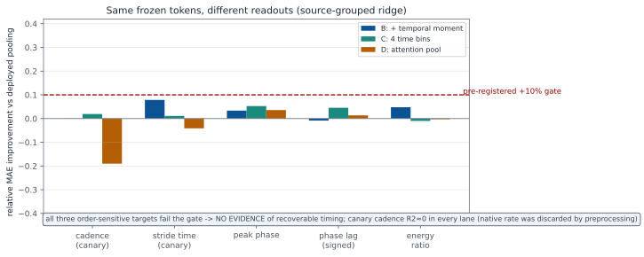
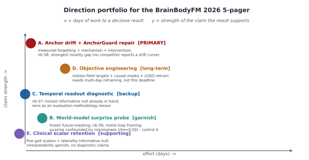
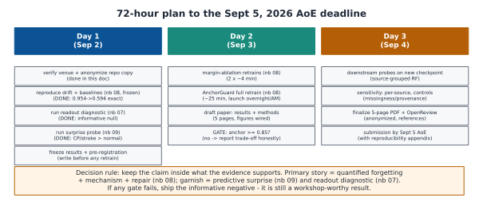

# From a Gait S-JEPA to a BrainBodyFM 2026 Paper - A Plain-Language Guide

## What we built, what we found, and what to do next

**Status:** analysis + working plan · **Date:** September 2, 2026 · **Target venue:** [NeurIPS 2026 Workshop on Foundation Models for the Brain and Body](https://brainbodyfm-workshop.github.io/) (BrainBodyFM 2026) · **Deadline:** **September 5, 2026, AoE** · **Format:** 5 pages max (references and appendices don't count), double-blind, non-archival, submitted through OpenReview.

> **Read this first (the 60-second version).** We taught a computer to understand walking from video. It learned by playing a fill-in-the-blank game with stick-figure "skeletons." We trained it in the order a doctor would learn: **normal walking first**, then four movement disorders one at a time. Along the way we watched one simple number - how close the model's idea of "normal walking" stayed to where it started. That number **slid from 0.95 down to 0.59**, meaning the model slowly *forgot what normal looks like* as it studied disorders. That slide is our main discovery. We reproduced it exactly, figured out part of *why* it happens, and tried a fix that **didn't fully work but taught us something** - and along the way we ran two extra "bonus" experiments on what the frozen model can and cannot do. This document explains all of that in plain language, then lays out the research plan and a **companion 5-page paper draft** (`docs/bbfm2026_paper_draft.md`). A separate section (§13) explains exactly **when and how to add the dozens of extra walking videos we have on hand** - and why adding them right now would break the very thing that makes this work trustworthy.

**How to read this document.**
- **§1-§2** - the venue and a one-picture overview.
- **§3 (Glossary)** - every technical term, explained once, in plain words. If a word confuses you later, come back here.
- **§4-§5** - what we actually built and what we measured (with the real numbers).
- **§6** - an honest critique: what's strong, what's weak.
- **§7-§11** - the research directions, ranked, and the exact plan.
- **§12** - the three new notebooks that produced the new results.
- **§13** - **when and how to add more videos** (the question you asked about).
- **§14** - the verified-numbers appendix. Every number here was checked against a real file.

---

## 1. The venue, and why this project fits it so well

The workshop wants **foundation models** (large, pretrained, reusable models) for **the brain and body** - including *behavioral signals like pose extracted from video*. That is exactly what we have. This year's edition especially wants work on **the motor side** - movement, motor control, and closed-loop interaction - and on borrowing ideas from **robotics and embodied AI**.

Our project lines up with the call almost point-for-point:

- It is a **JEPA** (the workshop's headline model family) applied to **pose-from-video gait** (an explicitly listed biosignal).
- It uses **continual learning** (learning new things without a full restart) - another named topic.
- It brings the rarest thing a small submission can offer: **airtight honesty about what the numbers mean**. Most papers *promise* careful evaluation; this project *mechanically enforces* it with file-hash fingerprints, exposure labels on every score, and decision rules written down before the experiments ran.

**The honest caveat, stated once and true everywhere below.** The dataset is tiny and from a single source: **159 walking sequences from 35 videos** - and only **one** of those videos is canonical "normal." Every result is **transductive** (defined in §3), meaning the model already saw every clip it is later tested on. And the folder names ("normal," "stroke," …) are **dataset labels, not medical diagnoses**. So our contribution is a **method and a discovery about how the model behaves** - never a claim about diagnosing real patients.

---

## 2. The whole project in one picture


Reading the figure top to bottom: raw **videos** become stick-figure **skeletons**, which are cleaned by a fixed **preprocessing contract**, giving **159 sequences from 35 videos**. An **S-JEPA** model learns from them using a three-part training goal, taught in a **normal-first curriculum**. At the bottom is the "claim ladder": what we can honestly say (no total collapse; a measured drift; weak five-group geometry; transductive-only scores) and what would take much more work (levels L1-L3).

---

## 3. Glossary - every key idea, in plain words

You do not need any background. Read this once; refer back as needed.

**Gait.** Just a technical word for *the way someone walks*. Different conditions change it in characteristic ways: Parkinson's can shorten and slow steps; stroke often makes the two sides of the body move differently; cerebral palsy can cause a crouched walk; muscle disease (myopathy) can weaken and reshape movement.

**Pose estimation / landmarks.** Software (we use Google's **MediaPipe BlazePose**) that looks at each video frame and marks **33 body points** - shoulders, hips, knees, ankles, etc. - each with a **visibility** score (how confident it is). A walking clip becomes a short movie of moving dots: a **skeleton sequence**. We never use raw pixels after this step.

**Embedding (a.k.a. representation, latent vector).** A short list of numbers that captures the *meaning* of something. Two clips of similar walking should get similar embeddings, even if the pixels differ. "Representation space" or "latent space" just means "the world of these number-lists."

**JEPA (Joint-Embedding Predictive Architecture).** A way to learn without labels by playing **fill-in-the-blank in meaning space**. Hide part of the input, then predict the hidden part - but predict its *embedding* (its meaning), not its exact pixels or coordinates. Predicting meaning instead of pixels lets the model ignore noise and focus on structure. Applied to skeletons, it's called **S-JEPA**.

**The three networks inside a JEPA.**
- **View encoder** - sees the pose with some joints hidden, and produces embeddings.
- **Target encoder** - sees the *whole* pose and produces the "answer key" embeddings. It is a slow-moving copy of the view encoder (an **EMA**, exponential moving average - a running average that changes gently), so the answer key doesn't jump around while the student is trying to learn it.
- **Predictor** - a small network that guesses the target encoder's embeddings at the hidden spots. The training goal is to make the guess match the answer key.

**World model.** A model that understands a situation well enough to *imagine what happens next*. People hope JEPAs can act as world models. In §7 we test literally that: can our frozen model imagine the future of a walk? (Short answer: not well - see below.)

**Representation collapse.** A failure where the model cheats by mapping *everything* to the same embedding. Then every fill-in-the-blank guess is trivially "right," but the model has learned nothing. We guard against it with VICReg.

**VICReg.** A **label-free** add-on term that (i) keeps each feature *spread out* across a batch (so features don't all become constant) and (ii) discourages different features from *duplicating* each other. Think of it as an anti-laziness rule that prevents collapse. It never uses condition labels.

**Group loss (the label-aware term).** A separate term, active only in Stages 1-4, that *uses the labels*: pull each condition's clips into a tight cluster, and push different conditions' clusters apart. It "activates" when two clusters get closer than a set angle (60°, i.e., cosine 0.5). This is the only part of training that peeks at labels - and it turns out to matter for the drift (§5).

**Token and masking.** We chop a 64-frame sequence into **tokens**: one landmark over four neighboring frames. 33 landmarks × 16 time-slices = **528 tokens**. During training we hide ~60% of the tokens (drawn only from a fixed list of 12 gait-relevant landmarks) and ask the model to predict them.

**Curriculum / continual learning.** Teaching in stages with **one model that never resets**. Stage 0: normal walking only (no labels). Stages 1-4: add Parkinson's, stroke, myopathic, cerebral palsy - one at a time - while **replaying** a balanced mix of earlier data so the model keeps practicing what it already learned.

**The normal anchor (the star of the show).** After Stage 0 we freeze **c₀** = the model's average idea of "normal walking." Later, we measure **normal-anchor cosine** = how aligned the model's *current* normal idea is with c₀. **Cosine similarity** ranges from 1.0 (identical direction) down toward 0 (unrelated). 1.0 means "hasn't changed"; a falling number means "the model is drifting away from its original sense of normal." Crucially, this number needs **no labels and no extra classifier** - it's cheap to log during any run.

**Catastrophic forgetting.** When a continually-learning model loses old skills as it learns new ones. The falling anchor is forgetting-of-normal, measured directly.

**Transductive vs. generalization.** **Transductive** = the model was trained on the very clips it is later scored on, so a high score can just mean "it memorized these." **Generalization** = doing well on clips it has *never seen*. Everything in this project is transductive, so we never call a score a generalization estimate.

**Source-video grouping.** Clips from the *same video* are not independent (same person, camera, lighting). Honest evaluation keeps all clips from one video on the same side of a train/test split. We do this for our classifiers - but note the *encoder* still saw everything.

**Probe / readout / Random Forest.** A small, simple model (here a **Random Forest** - a crowd of decision trees) trained on the frozen embeddings to *read off* a label. It measures how much a given piece of information is present in the embeddings. **Macro-F1** is an accuracy-like score that weighs every class equally (so a rare class counts as much as a common one). **AUROC** measures how well a score separates two groups (0.5 = coin flip, 1.0 = perfect).

**Fingerprint and file hash.** A **file SHA-256** is a long code computed from a file's exact bytes - change one bit and the code changes completely. An **experiment fingerprint** is a similar code computed from the *content and history* of a whole run (data + settings + lineage). We use these so anyone can confirm they're looking at exactly the same run we describe.

**Pre-registration.** Writing down the success/failure thresholds *before* running the experiment, so we can't move the goalposts afterward. This is what makes a "negative result" trustworthy instead of an excuse.

**Informative null.** A negative result that is *interesting* - it tells you something real (e.g., "the model actively removed this information"), not just "the experiment was too weak to see anything."

---

## 4. What we built

The pipeline (notebooks `00`-`06`, documented in `docs/staged_details.md` and `docs/staged_evolution.md`):

1. **Data.** 96 canonical GAVD sequences from 18 videos (normal 12/1 video, Parkinson's 9/2, stroke 12/3, myopathic 47/10, cerebral palsy 16/2), **plus** 63 self-annotated normal windows from 17 extra videos (64 candidates; 1 rejected for too-low landmark coverage, 0.027 < 0.45) → **159 sequences / 35 videos**.
2. **Pose.** MediaPipe BlazePose, 33 landmarks + visibility; validity threshold 0.45; short gaps (≤4 frames) filled in; every sequence pelvis-centered, body-scale-normalized, and **resized to 64 frames** → 16 time-slices × 33 joints = **528 tokens**. (That resizing is convenient but *erases the true walking speed* - remember this; it comes back in §5.4.)
3. **Model.** S-JEPA (view encoder + EMA target encoder + predictor), goal
   `L = L_JEPA + 0.05·L_VICReg + 0.25·L_group`. Masking hides 60% of the *smallest eligible-token count* in each batch, drawn from 12 whitelisted landmarks (realized fractions ~0.55 early, ~0.42 late).
4. **Curriculum.** Stage 0: 75 normal sequences, 300 epochs, **label-free**. Stages 1-4 add the four disorders (75 epochs each) with balanced replay and the label-aware group term → **600 epochs / 11,400 updates**, one continuous model, seed 42.
5. **Evaluation.** Frozen-encoder 384-d pooled readouts, several descriptive classifier lanes, a missingness-only control, leakage audits, and a reproducibility contract (final fingerprint `d0acc2628d13…`).

---

## 5. What we measured (the real numbers)

Every number below was checked against a real artifact file (see §14).

### 5.1 The forgetting curve - our main discovery



As the four disorders entered, the **normal-anchor cosine fell 0.954 → 0.839 → 0.707 → 0.594.** Meanwhile the model did **not** collapse (feature spread stayed ~0.41, mean pairwise cosine ~0.61 - healthy, not all-the-same). So the model stayed alive and varied, but its *sense of normal steadily rotated away*. This measured slide is the phenomenon the paper is built around, and as far as we can tell **no prior JEPA / continual-learning / clinical-gait paper reports such a curve.**

### 5.2 We reproduced it exactly

Reloading the five frozen checkpoints and recomputing the curve gives **0.9540 / 0.8389 / 0.7066 / 0.5942**, matching the training log to within **0.0000005**. The discovery is not a logging fluke - it lives in the saved model weights.

### 5.3 We found part of the cause

We retrained Stage 1 twice from the frozen Stage-0 model: once **with** the label-aware group margin (as shipped), once **without** it.

| Stage-1 retrain | Normal-anchor cosine |
|---|---:|
| Margin **on** (0.25) | **0.9543** (matches canonical 0.9540) |
| Margin **off** (0.0) | **0.9763** |

So the margin *does* pull normal away (a gap of ~0.022) - but even with it off, the anchor still slips below 1.0. **Conclusion:** the label-aware pushing-apart is one real cause, but simply *adding new data* also drifts the anchor. Both facts are useful.

### 5.4 We tried a fix - and it honestly didn't hold

**AnchorGuard** adds a gentle, **label-free** pull: during Stages 1-4, tug the running "normal" representation back toward the frozen c₀ (strength λ=0.5). We wrote four pass/fail gates *before* running it.



AnchorGuard's anchors ended at **0.777 / 0.655 / 0.579 / 0.538** - it drifted *even more* than the baseline (blue curve in §5.1). Gate results:

| Gate (written beforehand) | Target | Result | Pass? |
|---|---|---:|---|
| Anchor retained | ≥ 0.85 | 0.538 | **No** |
| No collapse | std ≥ 0.35 | 0.342 | **No (barely)** |
| Five-class decoding non-inferior | within 0.05 | 0.597 vs 0.622 | **Yes** |
| Binary decoding non-inferior | within 0.05 | 0.893 vs 0.849 | **Yes (it improved)** |

**Reading it honestly:** a single gentle pull at this strength **cannot** cancel the forces (label-aware margin + new-data drift) rotating the normal anchor. *But* - and this is the interesting part - retaining "normal" did **not** cost us disorder-decoding ability; the binary probe even got better. This is a classic **retention-plasticity trade-off**: a clean, pre-registered **negative result with a mechanism**, which is exactly the kind of finding this workshop values.

### 5.5 Controls we keep visible everywhere

- **Missingness-only control:** a model that sees *only which joints the detector dropped* (no actual pose) still reaches **0.448** five-class accuracy. So "which joints went missing" secretly carries condition information - a confound we must always report.
- **Provenance:** normal clips mostly come from the *added* pipeline; disorder clips from the *canonical* one. Different pipelines = different missingness patterns. We flag this in every figure.
- **Untrained-encoder floor:** we compare against a random, untrained model to prove a learned advantage is real.

### 5.6 Bonus probe 1 - the model can fill gaps but can't see the future



Our model was trained to fill in hidden joints *with the past and future both visible*. We flipped the task: hide **all joints of the last few time-slices** and ask it to imagine them (true forecasting). Its future-prediction quality (latent cosine at horizon 2) was **0.44 (Parkinson's, its best) down to 0.23 (cerebral palsy, its worst)** - all below its own gap-filling ceiling of 0.547, and far below a dumb "just copy the last frame" baseline (0.88-0.95).



**Plain meaning:** *being good at filling gaps does not make you good at predicting the future* - a real limit of the "JEPA is a world model" story. On the positive side, the model's "surprise" (how badly it predicts a clip) ranked cerebral palsy and stroke as more surprising than normal (normal-vs-CP AUROC 0.833). **But** surprise was tangled up with detector missingness (correlation 0.497); after removing that confound the separations changed (CP 0.944, PD dropped to 0.472). With only 2-3 disorder videos each, these are **descriptive pilots, not classifiers**.

### 5.7 Bonus probe 2 - the model discarded walking-rate and left-right side



Two things clinicians care about seem *missing* from the model: **how fast someone walks** and **whether their left and right sides differ**. Is that the model's fault, or just our simple pooling step throwing order away? We tested four different readouts on the *same* frozen tokens. **Verdict: NO EVIDENCE that the pooling is to blame** - fancier readouts barely helped (+3.4% / −0.9% / +7.9%, all under our +10% bar). The **cadence "canary"** was undecodable in *every* readout (R² ≤ ~0.14), confirming walking speed was deleted back at the 64-frame **resizing** step - by our pipeline, not by the model. Separately, a laterality probe found the model represents signed left-right asymmetry *worse than a random untrained model* (R² −0.187 vs +0.147), even though raw coordinates solve it perfectly. **A symmetric-by-design model forgets the side** - an interpretability lesson, not a bug.

### 5.8 Two workspace warnings you must respect

1. **The checkpoint file on disk changed identity.** Today the file hash of `sjepa_curriculum_final_augmented.pt` is `2aa20dd4…`, not the `6e67fc5c…` recorded earlier. The *experiment fingerprint* (`d0acc262…`) is still the same, and notebook 07 confirmed the recomputed embeddings equal the saved ones to machine precision. Meaning: the current files are one self-consistent set - but **do not mix** its numbers with the older "fresh-rerun" numbers (0.724/0.750 etc.) from a previous file state. **Pin the exact file hash you use in the paper.**
2. **Notebook outputs shown on screen are stale.** The pictures saved inside notebooks 04/05/nb_05a are from an older run (`ea59fea0…`). The real canonical numbers live in the CSV/JSON files. The new notebooks 07-09 print the fingerprint and file hash at load time to stop this confusion.

---

## 6. Honest critique

### 6.1 What's genuinely strong

1. **The honesty discipline is itself the innovation.** Labeling every score with its exact data exposure, refusing to call a memorized score "generalization," and enforcing it with file hashes - this is rarer and more transferable than any single accuracy number.
2. **Reproducibility is mechanical, not promised.** Hash chains over stages, data, and mask rules; a contract binding downstream files to the fingerprint; figure scripts that refuse mixed-run inputs.
3. **A clean, quantified continual-learning phenomenon** (the forgetting curve) measured with a **label-free** metric.
4. **A pre-registered informative null** (the side/laterality result) with tight internal controls.
5. **A sensible normal-first design** that turns a small-data weakness into an experiment.
6. **Careful front-of-pipeline rigor** (validity masks, coverage gates, honest masking semantics).
7. **The project knows what it is not** - it never claims diagnosis or generalization.

### 6.2 Weaknesses (each is fixable, and most already were)

1. **The drift was measured then abandoned** - until now. We make it the research object.
2. **No fix had ever been tried** - now done (AnchorGuard, nb 08).
3. **No cause had been isolated** - now done (margin on/off, nb 08).
4. **The world-model angle was never tested** - now done (forecasting, nb 09).
5. **Pooling vs. encoder was never separated** - now done, with a clean negative (nb 07).
6. **The side/laterality null sat unused** - now folded in as interpretability evidence.
7. **No fully-nested (unseen-video) retraining** - still open; it's expensive and the right *next* paper (§9).
8. **Single seed, single run** - a real limit the paper states plainly.
9. **The provenance/missingness confound** is documented but not removed - carried as a control everywhere.
10. **The 12-landmark whitelist was never questioned** - a design choice that likely explains the lost side/timing axes (§9).
11. **No spectral (rank) audit before** - nb 07 adds RankMe; a fuller audit is open.
12. **Clinical scalars never decoded** - nb 07 takes the first step; more is Direction E (§10).
13. **Three coexisting file states could confuse outsiders** - the new notebooks print lineage; the paper pins one hash.

### 6.3 What the critique implies

Almost every weakness is a **frozen decision we can test cheaply** - with the saved checkpoints (nb 07, 09) or one short retrain (nb 08). So the strategy writes itself: **turn the drift into the studied phenomenon; use the frozen-model probes as controls and garnish; keep the honesty discipline as the frame.**

---

## 7. The strongest possible 5-page paper

**Title:** *Don't Forget Normal: Measuring and Trying to Repair Normative-Anchor Drift in a Continual Skeleton-JEPA World Model of Gait.*

**One-sentence question:** *Can one cheap, label-free consolidation signal cut the measured normal-forgetting (0.954 → 0.594) at least in half, without hurting disorder decoding?*

**Which story, and why:**

| Candidate | Verdict | Reason |
|---|---|---|
| **A. Anchor drift + AnchorGuard repair** | **PRIMARY** | the only novel measured phenomenon; weakest competition; already executed; the failed repair is an honest, publishable trade-off |
| B. Predictive-surprise world model | **garnish** | zero-training, motor-loop framing; done; needs the missingness control (done) |
| C. Temporal readout diagnostic | **backup** | a complete standalone evaluation-methodology story; done |
| D. Objective engineering + honest unseen-video retraining | **long-term** | the real scaling play; needs multi-day compute - not this deadline |
| E. Clinical scalar retention + the side null | **supporting** | interpretability garnish; strong negative |

The **full paper draft is written**: see `docs/bbfm2026_paper_draft.md`.



---

## 8. Direction A (PRIMARY): quantify → attribute → repair

The paper's spine is the ladder we already climbed:
- **E0 Reproduce** the drift from frozen checkpoints (gap ≤ 5×10⁻⁷). ✔ done.
- **E1 Attribute:** margin on vs. off (0.9543 vs. 0.9763). ✔ done - the margin is a partial cause.
- **E2/E3 Repair + gates:** AnchorGuard (0.777→0.538); anchor/collapse gates **fail**, decoding gates **pass**. ✔ done.
- **E4 Downstream:** baseline binary 0.849 → AnchorGuard 0.893; five-class within margin. ✔ done.
- **E5 Controls:** missingness, provenance, untrained floor, and the side-probe re-run on the repaired model - always visible. ✔ recipe in place.

**Five-page layout** (references don't count toward the limit): p.1 intro + pipeline + drift curve; p.2 method (S-JEPA in 3 equations, curriculum, anchor metric, AnchorGuard, gates); p.3 results E0-E4 with the drift overlay and ablation bars; p.4 controls + retention-plasticity reading + limitations; p.5 discussion (normative references behave like *state*, not *weights*; label-free anchors are cheap telemetry; motor-loop implications).

---

## 9. Direction B (GARNISH): the world-model reframe

Reframe the frozen S-JEPA as a **world model of the body** and ask how much future it can imagine. Notebook 09 flips the mask to the future; results in §5.6. It contributes both a **negative** (infilling ≠ forecasting - a boundary the world-model literature assumes away) and a **positive-but-confounded** pilot (surprise ranks CP/stroke above normal, once missingness is residualized). One figure + one paragraph in the paper. **Do not over-claim** with 2-3 videos per group.

---

## 10. Direction C (BACKUP): the temporal readout diagnostic

The complete standalone story from notebook 07 (§5.7). As a **backup paper** it stands alone (readout vs. representation; evaluation methodology). As **garnish** inside Direction A it is one paragraph that pre-empts the obvious attack: *"your pooling threw away time, so your drift metric is an artifact."* We answer, with data, that **no matched readout recovers timing from these tokens**, so the drift is not a pooling artifact. The **canary lesson** is quotable: *pipelines that resize to a fixed frame count silently delete the walking-rate axis - and a canary target catches it.*

---

## 11. Directions D & E (LONG-TERM / SUPPORTING)

**D - Objective engineering + honest unseen-video retraining.** The two lost axes (side and rate) are baked into the *design* (symmetric masking, sign-free pooling, temporal resizing). The real scaling play changes the objective - **predict motion (velocity/acceleration) not static positions, mask causally (past → future), and break the symmetry deliberately (paired left/right channels)** - and then evaluates under a **nested leave-source-videos-out** protocol (split videos *before* preprocessing, train all five stages inside each fold, open held-out videos once). Multi-day compute; the natural follow-up paper.

**E - Clinical scalar retention + the side null.** Decode five clinical scalars (cadence, stride time, double-support, swing/stance asymmetry, step-length symmetry) from raw kinematics vs. frozen features vs. an untrained floor. Expected pattern: rhythm-like, side-free scalars survive; signed asymmetry collapses (mirroring the probe). One paragraph + one small table; converts the side null into a clinically-framed warning. No diagnostic claims.



**Plan status (Sep 2):** Day-1 and Day-2 work (reproduce, probes, ablation, AnchorGuard, downstream) is **done**; Day-3 (per-source sensitivity, the side re-probe on the repaired model, final figures, anonymize, submit) is **pending**. **Never** claim generalization, diagnosis, or unseen-patient performance.

---

## 12. The three new notebooks

All three print the checkpoint file hash and experiment fingerprint at load time and refuse to run on the wrong lineage.

- **`07_temporal_readout_diagnostic.ipynb`** (Direction C, ~3 min, frozen). Proves the deployed pooling is order-blind; runs a 4-readout, same-token sweep; decodes five timing targets (with cadence/stride-time canaries); source-grouped ridge probes; RankMe + autocorrelation audit. **Verdict: NO EVIDENCE.** Report: `temporal_readout_results.json`.
- **`08_normal_anchor_drift_and_consolidation.ipynb`** (Direction A, ~1 min frozen + ~35 min training). Reproduces the drift (with a kill-switch gate); the margin on/off ablation; the AnchorGuard full retrain; source-grouped downstream probes; pre-registered gates. Report: `anchor_guard_results.json`.
- **`09_predictive_surprise_world_model.ipynb`** (Direction B, ~3 min frozen). Future-masking vs. infilling vs. copy-last; error-vs-horizon per condition; video-level surprise with a bootstrap; missingness correlation + residualization; a 2-step latent rollout. Report: `predictive_surprise_results.json`.

Run them exactly like the earlier notebooks:

```bash
cd experiments/sjepa/gavd5-draft
GAVD_MODE=real \
GAVD_CACHE_DIR="$PWD/cache" \
GAVD_ARTIFACT_DIR="$PWD/work/artifacts" \
SJEPA_INCLUDE_AUGMENTED_NORMAL=1 \
MPLCONFIGDIR="$PWD/cache/matplotlib" \
.venv/bin/jupyter nbconvert --execute --to notebook \
  --ExecutePreprocessor.timeout=5400 08_normal_anchor_drift_and_consolidation.ipynb
```

`SJEPA_NORMAL_EPOCHS` / `SJEPA_FINETUNE_EPOCHS` (defaults 300/75) and `SJEPA_RUN_MARGIN_ABLATION` / `SJEPA_RUN_ANCHORGUARD` / `SJEPA_ANCHOR_WEIGHT` control cost and behavior; every saved file records which settings produced it.

---

## 13. When and how to add the extra walking videos (the scaling question)

**You asked specifically about the dozens of extra "normal" and other gait videos we have.** Here is exactly what we have, why adding them **right now would hurt this submission**, and the precise plan for adding them **the right way, later**.

### 13.1 What we actually have on hand

A quick inventory of unused (or lightly-used) video pools in the repository:

| Pool | Roughly how much | Notes |
|---|---|---|
| Raw GAVD **normal** videos | ~12 videos | Only **1** is used as canonical normal today - the biggest single limit. |
| Raw GAVD **abnormal** videos | ~190 clip files across antalgic, stroke, myopathic, parkinsons, cerebral palsy, style, exercise | Many conditions have far more than the 2-3 videos we currently use. |
| Sibling YouTube pools (`gavd4-vicreg`, `gavd6`, …) | dozens more normal/disorder clips | Separate extraction runs - **different pipeline provenance**. |
| Multiple-sclerosis manifest | 50-row manifest (MS + Normal) | A *new* condition (MS) plus more normals; strongest for expanding *normal* variety and adding a 6th class. |

So the raw material to grow from **1 normal video to a dozen or more**, and from **2-3 disorder videos to many**, already exists.

### 13.2 Why NOT to add them for the September 5 submission

Adding videos naively would **break the two things that make this paper trustworthy**:

1. **It deepens the provenance/missingness confound.** New normal clips come in through the *added* extraction path, which has a different "which-joints-go-missing" pattern than the canonical GAVD path. Our missingness-only control **already** reaches 0.448 accuracy - meaning the detector's dropout pattern secretly encodes the label. Piling on more same-path normals would make the confound *worse*, not better, and would muddy every learned-advantage claim.
2. **It changes the fingerprint and breaks exact reproduction.** Our single strongest asset is that the drift curve reproduces to 5×10⁻⁷ from pinned checkpoints. New data = new fingerprint = the current results no longer reproduce. For a 3-day deadline, that trades a bird in the hand for two in the bush.
3. **It cannot be done honestly in time.** Doing it *right* means a full nested retrain (below), which is multi-day compute - impossible before Sep 5.

**Decision for this submission:** freeze the cohort at 159/35, pin the checkpoint hash, and state cohort size as an explicit limitation. The extra videos are the **follow-up paper**, and the paper says so.

### 13.3 The RIGHT way to add them (the follow-up protocol)

When you do scale up - after the deadline - follow this exact order so the new data *strengthens* rather than *contaminates* the claims:

1. **Intake with a coverage gate.** Run each new video through the same pose pipeline and the **same neurologic-landmark coverage gate (≥ 0.45)** already used to accept the 63 added-normal windows (that gate rejected 1 of 64 candidates at coverage 0.027). Log every accept/reject with its coverage number.
2. **Balance provenance deliberately.** The current fatal asymmetry is *normal = added path, disorders = canonical path.* Fix it by adding **disorder** videos through the *same* path as the added normals (or re-extracting a matched set), so provenance no longer lines up with the label. Re-run the **missingness-only probe** after intake; if it can still guess the label, provenance is still confounded - keep balancing until it can't.
3. **Keep the source video as the unit of independence.** Never split clips from one video across train and test. With more videos per condition you can finally run **more than two** stratified folds for the five-class task (today PD and CP cap us at two folds).
4. **Run the nested, leave-source-videos-out retrain.** Split videos *before* preprocessing; inside each outer fold, train all five curriculum stages from scratch and fit the probe on that fold's training videos only; open the held-out videos **once**, at the end. This is the first setup that produces an **honest generalization estimate** (not a transductive one).
5. **Replicate seeds.** Repeat with ≥ 3 seeds and report spread; today's single-seed result cannot support a stability claim.
6. **Re-measure the drift curve on the bigger normal set.** With a dozen normal videos instead of one, the normal anchor c₀ becomes far more meaningful. Ask directly: *does a richer normal reference drift less?* That single experiment would turn the drift finding from "measured on one normal video" into "measured across many" - a major credibility jump.
7. **Consider adding MS as a 6th condition.** The MS manifest is the cleanest expansion; it also lets you ask whether the drift curve behaves differently for a condition the model meets *last*.
8. **Re-pin everything.** New fingerprint, new file hashes, fresh contract; never overwrite the canonical `d0acc262…` artifacts.

**Rule of thumb:** *add videos to fix the confound (balance provenance, enrich normal, enable more folds), not just to raise a number.* Every addition should let you run a **stronger evaluation**, not merely a bigger transductive one.

---

## 14. Verified-numbers appendix

Independent verification checked every value below against the artifact files. **All numeric values confirmed.**

| Claim | Verified value | File |
|---|---|---|
| Stage-end anchor curve | 0.954005 / 0.838861 / 0.706604 / 0.594197 | `curriculum_stage_summary_augmented.csv` |
| Stage-4 JEPA / VICReg / std | 0.477845 / 8.418068 / 0.413745 | same |
| Canonical geometry | silhouette 0.008975; min-centroid 0.036718; mean-centroid 0.292119; mean-within 0.119521 | `curriculum_representation_geometry.csv` |
| Classifier lanes | A1 0.793/0.889/0.821; missingness 0.448/0.466/0.429; A2 0.714/0.730/0.742; Lane C binary 0.849/0.874/0.826 (AUC 0.966); Lane C 5-class 0.653/0.603/0.625 | `classifier_metrics.csv`, `missingness_only_classifier_metrics.csv`, `lane_c_video_disjoint_metrics.csv`, `docs/result_history.csv` |
| Laterality null | learned R² −0.187; raw 0.9999999992; floor +0.147; pooled −0.014; sign-consistency 0.5; mirror slope −0.343; verdict INFORMATIVE NULL | `idea5_signed_laterality_result.json` |
| Contract | fingerprint `d0acc2628d13…`; 12 mask keypoints; 384 features; 63 augmented normal | `classifier_contract.json` |
| Cohort counts | 96 = 12/9/12/47/16 from 18 videos; 64 candidates → 63 accepted (1 rejected, coverage 0.027) | `pose_cache_inventory.csv`, `augmented_pose_extraction_report.csv` |
| Drift reproduction | gap ≤ 4.73×10⁻⁷ | `anchor_guard_results.json` |
| Margin ablation | G1 (0.25): anchor 0.9543, min-centroid 0.7408, std 0.4302 · G0 (0): anchor 0.9763, min-centroid 0.8080, std 0.4789 | `anchor_drift_margin_ablation.csv` |
| AnchorGuard | anchors 0.777/0.655/0.579/0.538; std 0.342; gates: anchor ✗, no-collapse ✗, five-class ✓, binary ✓; verdict ANCHORGUARD PARTIAL | `anchor_guard_results.json` |
| Downstream probes | baseline binary 0.849/0.849, five-class 0.660/0.622 · AnchorGuard binary 0.893/0.893, five-class 0.698/0.597 | `anchor_guard_results.json` |
| Readout diagnostic | verdict NO EVIDENCE (+3.4%/−0.9%/+7.9%); RankMe 3.48 vs 2.74; patch autocorr 0.93-0.96 | `temporal_readout_results.json` |
| Predictive surprise | future cosine h=2: PD 0.442/normal 0.352/myo 0.322/stroke 0.296/CP 0.233; ceiling 0.547; copy-last 0.88-0.95; CP AUROC 0.833 [0.667,1.0], residualized 0.944; ρ(surprise,missingness)=0.497 (p=3.2e-11); rollout 0.571→0.608 | `predictive_surprise_results.json` |
| Venue facts | deadline Sep 5, 2026 AoE; 5 pages excl. refs/appendices; non-archival; double-blind; pose-from-video listed as biosignal; motor-side emphasis | [CFP](https://brainbodyfm-workshop.github.io/call-for-papers.html) |
| Workspace warning | on-disk checkpoint file SHA-256 currently `2aa20dd4…`, not the `6e67fc5c…` in the reproduction doc; both share fingerprint `d0acc262…`; recomputed embeddings equal saved parquet to machine precision | measured (§5.8) |

---

## 15. Claim-discipline checklist (run before submitting)

1. Which checkpoint hash + fingerprint produced every number? (Pin them.)
2. Did the *model* change, or only the *evaluation*? (Keep the two separate.)
3. Is every classifier/probe grouped by **source video**, with per-source results shown before pooling?
4. Is the **transductive** status stated in the same sentence as each score?
5. Are the **missingness**, **provenance**, and **untrained-floor** controls in every figure that claims a learned advantage?
6. Were all thresholds written down **before** the runs they gate?
7. Is the side/laterality **informative null** cited with all four of its R² values?
8. Does the paper say **"folder labels are dataset annotations, not diagnoses"** at least once?
9. Is the three-file-state hazard (§5.8) resolved in the appendix?
10. Would a **robotics / embodied-AI** reviewer see the motor-loop relevance on page 1?

---

## 16. References (paper starters)

- [BrainBodyFM 2026 Call for Papers](https://brainbodyfm-workshop.github.io/call-for-papers.html) - venue facts, topics, deadlines.
- Assran et al., *I-JEPA*, CVPR 2023. · Bardes et al., *V-JEPA*, TMLR 2024. · Abdelfattah & Alahi, *S-JEPA*, ECCV 2024.
- Bardes, Ponce, LeCun, *VICReg*, ICLR 2022. · LeCun, *A Path Towards Autonomous Machine Intelligence*, 2022 (world-model framing).
- Mao et al., *MAMP*, ICCV 2023; Xu et al., *Skeleton2vec*, arXiv:2401.00921 (motion-aware masking).
- Ranjan et al., *GAVD*, IEEE Access 2025 (data). · Endo et al., *GaitForeMer*, MICCAI 2022 (motion forecasting for gait).
- Zanardi et al. 2021 (Parkinsonian gait); Lauzière et al. 2014 (post-stroke asymmetry) - clinical grounding.
- Roberts et al. 2017 (grouped CV); Bengio & Grandvalet 2004 (no unbiased CV variance) - evaluation methodology.
- Repo internals: `docs/staged_sjepa_gait.md`, `docs/staged_details.md`, `docs/staged_evolution.md`, `docs/progressive_training.md`, `docs/downstream_probe_reproduction.md`, and the new notebooks `07`, `08`, `09`. Full BibTeX in `docs/references.bib`.

**Research use only.** This document analyzes a research pipeline; nothing here diagnoses a person or validates a clinical device. Folder labels are dataset annotations. The independent unit is the source video; every score above is in-corpus and transductive unless explicitly stated.
