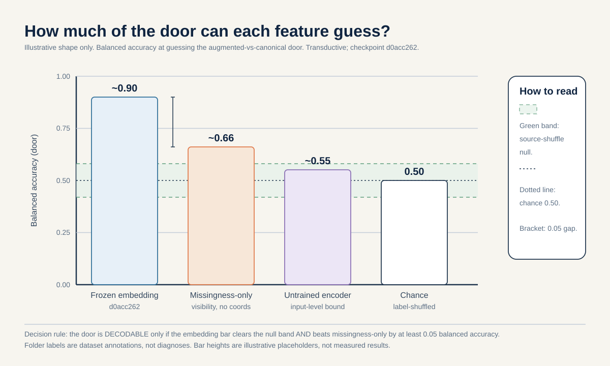
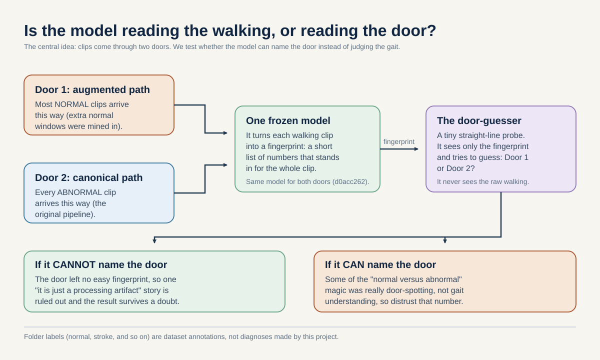

# How to run the provenance check, in plain words

This is the plain-language, step-by-step guide for actually doing this idea on real data. It is written for
a curious high-school student who has never heard of embeddings or cross-validation. The science lives in
the proposal [README.md](./README.md). The numbers come from
[`../_shared_facts.md`](../_shared_facts.md) and the biology comes from
[`../_neuro_facts.md`](../_neuro_facts.md). Nothing here may contradict those two files. Every result in this
guide is transductive (the model already saw every clip we score it on), and every folder label (normal,
parkinsons, stroke, myopathic, cerebral_palsy) is a dataset annotation from GAVD, not a diagnosis this
project makes.

## 1. The question in one sentence

After we re-run every clip through one single frozen model, how much of the very strong "this walk looks
normal versus this walk looks unusual" signal is really the model reading which processing pipeline a clip
came through, instead of reading the walking? We measure this by seeing how well a simple classifier can
guess a clip's pipeline (its "door"), and we always compare that guess against the best a probe could ever
do if you just told it which source video the clip came from.

## 2. Why this idea, in plain words

Picture a machine that watches walking videos and says "normal" or "unusual," and it is almost never wrong.
That sounds great, but there is a catch. Almost all of the normal videos were prepared one way (an
"augmented" path where extra normal walking windows were mined and added), and all of the unusual videos
were prepared a different way (the original "canonical" path). "Provenance" is just a fancy word for which
door a clip walked through. If the two doors leave any tiny fingerprint (a slightly different camera setting,
a different cropping habit, a different way of filling in joints the detector lost), then the machine can
sort "normal" from "unusual" by reading the door, not the walk. It would look smart while really cheating,
like a student who aces a test because the answers were written on the desk.

So the honest job here is to try to prove the machine is cheating. We do that by turning the tables: instead
of asking "can it tell normal from unusual," we ask "can a simple classifier guess the door itself from the
model's number-fingerprint of each clip." If the door is easy to guess, then door information is baked into
the model, and any "normal versus unusual" claim riding on it is shaky.

There is a reason this one check matters for the whole portfolio, and it comes from biology. The conditions
in this dataset line up along a symmetry axis. Some are lateralized, meaning one side of the body moves
differently from the other: stroke (because the nerve pathway crosses over, a lesion on one side of the
brain weakens the opposite side of the body; Natali and Javed StatPearls, PMID 30571044), hemiplegic
cerebral palsy (a one-sided injury to the brain's white matter; Volpe 2009, PMID 19081519), and early
Parkinson's (it starts on one side; Riederer and Sian-Hulsmann 2012, PMID 22367437). One condition is
different in kind: myopathy is a muscle disease that weakens both sides about equally, so at the skeleton
level it looks near-symmetric, with no clear left-versus-right timing difference (Barohn et al. 2014,
PMID 25037080; Xiong et al. 2023, PMID 37525241). Myopathy is the "symmetric anchor" of the axis. It is also
the class that dominates the canonical door: 47 of the 96 canonical sequences are myopathic, from 10 of the
18 source videos. So the door split lands almost on top of the symmetric-versus-lateralized split. If the
door leaks, it corrupts exactly the axis every other proposal here leans on. That is why this small, fast
check is the foundation.

## 3. What data you need

The whole study runs on data the project already has. No new filming and no external dataset are required.

**The internal cohort (the only data you actually need).** This is the gavd5-draft GAVD cohort (Ranjan et al.,
IEEE Access 2025, DOI 10.1109/ACCESS.2025.3545787). It is 96 canonical sequences from 18 unique YouTube
source videos, plus 63 accepted augmented-normal windows (63 of 64 candidates were kept; one was rejected at
neurologic coverage 0.027). "What this number means": a source video is one YouTube clip, and several
walking sequences can be cut from the same video, so the videos, not the sequences, are the real independent
units. The per-condition source-video counts are tiny and lopsided: normal 1, Parkinson's 2, stroke 3,
myopathic 10, cerebral palsy 2. All 12 normal sequences come from a single video (id `3KnFt8bH3tE`).

**What shape the data takes.** The model does not see raw video. Each clip is turned into a skeleton, which
is a stick figure of 33 body joints (tracked by BlazePose; Grishchenko et al., arXiv:2206.11678) moving over
time. Each clip is stretched or squeezed to 64 frames, then every 4 frames in a row become one time patch,
giving 16 time positions. So one clip is a grid of 33 joints by 16 time positions = 528 little cells, called
tokens. "What this number means": 528 is just 33 times 16, a plain count with no units, fixed by the design.

**How a real team would get and clean it.** The videos come from GAVD's public list of YouTube gait clips.
A team runs each through the MediaPipe pose detector (pose_landmarker_lite, video mode, single pose,
confidence 0.45) to get the 33 joints per frame, keeps failed frames on the timeline with zero visibility so
the timing stays honest, then resizes to 64 frames and packs the 528-token tensor. For this study you do not
redo any of that: the 528-token tensors are already cached on disk, and you reuse them.

**About external data.** No external cohort is required or claimed for this idea. If a future team ever wanted
to test the general lesson on other skeletons, the only verified public options in
[`../_shared_facts.md`](../_shared_facts.md) are CASIA-B, OU-MVLP-Pose, GREW, Gait3D, and Human3.6M. Every one
of these is non-clinical and reach-tier: they are gait-recognition or pose-validity datasets with no clinical
labels, so they could only test the plumbing of the method, never a medical claim. This idea does not use
them.

## 4. Step by step, how to do it

This whole recipe is zero-retrain. You never train the big model again. You only re-run clips through it once
and then fit small, cheap classifiers on top. A motivated student could follow these steps.

1. **Pick one model and write down its name.** Two saved copies of the trained model exist locally: the
   augmented curriculum-final one with fingerprint `d0acc262`, and a canonical one with fingerprint `dba24a`.
   A "fingerprint" is a short code that names exactly one saved copy. Comparing numbers made by two different
   copies would be like weighing things on two different scales, so you must pin one. Use `d0acc262`. This
   step is zero-retrain.

2. **Re-run every clip through that one model.** Take the cached 528-token tensors for all 96 canonical
   sequences and all 63 augmented-normal windows, and pass them through the `d0acc262` model to get each
   clip's embedding. An embedding is a short list of numbers that acts as a fingerprint for the whole clip;
   similar walks get similar fingerprints. Zero-retrain: you are only reading the frozen model, not changing
   it. On every embedding row, record four things: the fingerprint (`d0acc262`), the source-video id, the
   door (augmented or canonical), and a flag saying the model saw this row during training. Here it saw all of
   them, so every number is labeled transductive.

3. **Build the door table and check it is real.** You need a table that says, for each clip, which door it
   came through. Before trusting any join (matching each embedding to its door), verify that the canonical
   data file actually stores a provenance column. If it does not, rebuild the door labels from the extraction
   manifest and write down that you had to reconstruct them. This is a gate: do not proceed on a guessed
   column.

4. **Set up three simple classifiers (three "lanes").** Each lane is an L2-regularized logistic regression,
   which is just a straight-line classifier with a dial that discourages it from leaning too hard on any one
   feature. All three try to guess the door. They differ only in what you feed them:
   - Lane 1, the embedding: the frozen `d0acc262` fingerprint of each clip.
   - Lane 2, missingness-only: only the pattern of which joints were visible versus lost, with every position
     number thrown away. This is the same nuisance-only control the project already computes.
   - Lane 3, untrained encoder: the same kind of fingerprint but from a model with random weights that learned
     nothing. This is an input-level floor.
   Tune the dial using only the training videos in each fold, never the video you are about to score. All
   three lanes are zero-retrain (small classifiers, not the big model).

5. **Add the two reference lines.** Compute the source-identity ceiling (the best a probe can do if you just
   hand it the source-video id) and a source-permutation null band (what the probe scores when you shuffle the
   labels, so beating it means the signal is not luck). These are cheap and zero-retrain.

6. **Run the honest primary: within-normal.** Restrict to the normal label only and ask whether a probe can
   tell the 12 canonical-normal sequences from the 63 augmented-normal windows. Report this next to the
   source-identity ceiling, because with only 1 canonical-normal source the door probe cannot beat source
   identity by design. Also run a leave-the-single-normal-video-out diagnostic with the augmented-normal set
   randomly cut down to 12 to match the canonical count.

7. **Score with balanced accuracy, on source-disjoint folds.** Use balanced accuracy, which averages the
   correct-rate on each class so the big augmented group (63) cannot flatter a lazy probe that just guesses
   "augmented" every time. Split the data so no source video is ever on both the training and the scoring side
   of a fold (leave-one-source-out). A seed reshuffle is not a new video and never substitutes for one.

## 5. The decision rule, decided in advance

We write the rule down before looking at any result, so we cannot move the goalposts later. This is called
pre-registration.

The rule: we call provenance DECODABLE (the confound is real) only if both of these hold on the
source-video-disjoint folds:
- the embedding lane's balanced accuracy is above the source-permutation null band (so it is not luck), AND
- the embedding lane beats the missingness-only lane by at least 0.05 balanced accuracy.

"What this margin means": balanced accuracy runs from 0.5 (a coin flip for two classes) to 1.0 (perfect), so
0.05 is a gap of 5 points on that scale. We require a clear gap, not a hair, so noise cannot be mistaken for a
real door signal. We do not read any gap between the embedding lane and the source-identity ceiling as gait
signal, because for normal clips the door and the source video are the same thing.

**Worked example (illustrative numbers only, not measured facts).** Only the margin (0.05) and chance (0.5)
are real; the rest are made up to show the arithmetic.

Suppose the source-disjoint probe returns:
- embedding lane: 0.82
- missingness-only lane: 0.71
- top edge of the null band: 0.60
- chance: 0.5 (the real floor)

Step 1: is the embedding lane above the null band? 0.82 is more than 0.60, so yes.
Step 2: does the embedding beat missingness by at least 0.05? Compute 0.82 minus 0.71 = 0.11, and 0.11 is at
least 0.05, so yes.
Both pass, so with these made-up numbers provenance would be judged DECODABLE.

Now the counter-case: if the gap had been 0.82 minus 0.79 = 0.03, that is below 0.05, so the embedding does
not clear the margin and we would NOT call provenance decodable, no matter how high the raw number looked.

## 6. Controls that keep us honest

- **Missingness-only baseline.** A probe fed only the visibility pattern, no coordinates. It tells us how much
  of the door signal is just "which joints were found." The project's own all-96 missingness-only control
  scores accuracy 0.448 and balanced 0.466 on the five-class task, well below the full model's accuracy 0.793
  and balanced 0.889, and above five-class chance of 0.20. "What this means": the visibility pattern alone
  carries real, non-trivial signal, so it is a serious baseline to beat, not a straw man.
- **Untrained-encoder floor.** A random-weight model of the same shape. If the door is guessable from this,
  the door signal was trivially present at the input before any learning.
- **Raw-coordinate reference.** The plain coordinates as a non-neural yardstick, so a fancy embedding only
  gets credit if it beats simple hand-made features.
- **Source-video-disjoint splits.** No source video appears on both sides of any fold, so the probe cannot
  win by memorizing a video it also trained on.
- **One-fingerprint binding.** Every row is embedded by the single `d0acc262` model, so no result mixes two
  model lineages.
- **Source-identity ceiling.** Because all normal clips come from one video, the door probe can never beat a
  probe that just knows the source id, so we always report the door result against that ceiling.

## 7. What could happen, and what each outcome would mean

- **Provenance is decodable (positive).** The embedding lane clears the null band and beats missingness-only
  by at least 0.05, and it tracks the same axis that separates normal from unusual. Licensed claim: the very
  high separability (on the order of 0.96 AUC) is at least partly a processing shortcut, not gait
  understanding. Everyone downstream should distrust normal-versus-unusual claims on this cohort until the two
  doors are harmonized (made to match).
- **Provenance is not decodable beyond source identity (clean null).** Once you account for the one-video fact,
  there is no extra door signal to find. Licensed claim: the simplest "it is just a processing artifact"
  explanation is ruled out. This does not prove the model understands gait (source identity still confounds
  everything), but it lets the headline number survive one hard round of doubt.
- **Ambiguous middle.** The result neither clears the margin nor falls cleanly inside the null. Licensed
  action: stop and diagnose, documented, rather than spin the result either way.

Either way the deliverable is the same reusable lesson: when you enlarge one class through a different
pipeline, measure how much of your separability is the pipeline. Framed under the leakage taxonomy of Kapoor
and Narayanan (arXiv:2207.07048), this names a specific leakage subtype for grouped self-supervised skeleton
pipelines: same-label acquisition-pathway identity.

## 8. What this cannot tell us

- **Everything is transductive.** The model saw every clip we score it on, so no number is an out-of-sample
  performance estimate; they are diagnostics on a frozen model.
- **The sample is tiny.** With source-video counts as low as 1 per class, error bars are wide (Varoquaux,
  NeuroImage 2018), so we report per-source dots and permutation nulls, not one shiny number.
- **The provenance confound cannot be fully untangled from source.** For normal clips, "the door," "the one
  video," and "the normal label" all move together (they are collinear), so we can only measure the door
  against the source-identity ceiling, never isolate it.
- **Monocular capture.** The videos are single-view, so nothing here speaks to camera-angle effects on its
  own.
- **Skeleton limits.** Skeletons cannot recover muscle forces, spasticity, transverse-plane rotation, or an
  actual medical diagnosis, so no clinical-accuracy claim is made at any outcome.

## 9. How to make it reproducible

- **One model, named on every row.** Bind everything to fingerprint `d0acc262`, and record that fingerprint,
  the source-video id, the door, and the seen-during-training flag on every embedding row.
- **Fixed seeds.** Set the random seeds so anyone can rerun and get the same folds and the same probe fits.
  Remember: a seed varies the probe, not the sources, so repeat-seed runs measure stability, not
  generalization.
- **Save the split manifest.** Write out exactly which source videos landed in each fold, so the
  source-disjoint splits are auditable.
- **Save the results.** Store the per-lane balanced accuracies, the source-identity ceiling, the null band,
  the per-source dots, and the pre-registered verdict, alongside the probe code and the embeddings manifest.
- **Keep the two gates.** Continue past Day 5 only if all rows carry one fingerprint and the provenance column
  is verified or documented as reconstructed. Continue past Day 14 only if the embedding lane either clears
  the margin or falls cleanly inside the null; an ambiguous middle triggers a documented stop-and-diagnose.

## Figures

Fig 1: a grouped bar chart of balanced accuracy for each lane (embedding, missingness-only, untrained-encoder,
chance) with the source-permutation null band, all under the one `d0acc262` fingerprint. How to read it: each
bar is one kind of input, and taller means the probe guessed the door more often. Compare the embedding bar
to the missingness bar: if the embedding is not clearly taller (by at least the 0.05 margin) and above the
shaded null band, we do not call provenance decodable.

Fig 2: a two-panel dot plot of the within-normal 12-canonical-versus-63-augmented separability against the
source-identity ceiling and the leave-one-normal-video-out diagnostic (augmented cut to 12). How to read it:
each dot is one held-out source video, so the spread shows how shaky the number is with so few videos. The
ceiling line is what a probe scores using source id alone; our probe cannot rise above it, so we read the gap
below the ceiling, never any number above it.

Fig 3: a plain concept picture. Two doors (the augmented path and the canonical path) feed clips into one
model, and a small probe tries to guess which door a clip came through instead of how the person walked. How
to read it: follow the arrows from the two doors into the shared model and then to the probe. If the probe can
name the door from the fingerprint alone, then some of the "normal versus unusual" magic was really
door-spotting, not gait understanding.

## References

- Ranjan et al., GAVD, IEEE Access 2025, DOI 10.1109/ACCESS.2025.3545787.
- Grishchenko et al., BlazePose GHUM, 2022, arXiv:2206.11678.
- Kapoor and Narayanan, Leakage and the Reproducibility Crisis in ML-based Science, 2022, arXiv:2207.07048.
- Varoquaux, Cross-validation failure: small sample sizes lead to large error bars, NeuroImage 2018.
- Barohn et al., Approach to the muscular dystrophies, Neurol Clin 2014, PMID 25037080.
- Xiong et al., Gait analysis in Duchenne muscular dystrophy, Biomed Eng Online 2023, PMID 37525241.
- Natali and Javed, Corticospinal tract anatomy, StatPearls, PMID 30571044.
- Volpe, Brain injury in premature infants, Lancet Neurol 2009, PMID 19081519.
- Riederer and Sian-Hulsmann, Neuronal lateralisation in Parkinson's disease, J Neural Transm 2012, PMID 22367437.

