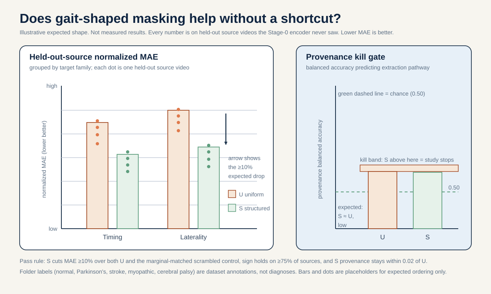
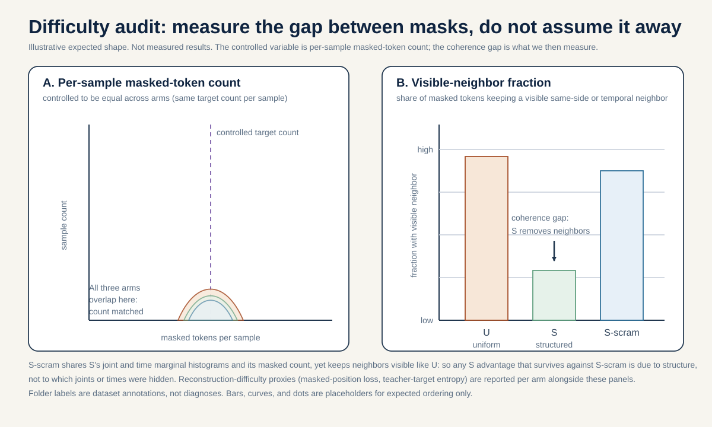

# How to actually run Idea 6: mask geometry as the object

This is a plain-language how-to guide. It takes the science in [`./README.md`](./README.md) and turns it into a
recipe a motivated student could follow. Every number here is pinned to
[`../_shared_facts.md`](../_shared_facts.md) (the facts and figures) and
[`../_neuro_facts.md`](../_neuro_facts.md) (the biology). Nothing here invents a number, and where a number is a
made-up example to show the math, it says so out loud.

Quick reminder before we start: the folder labels (normal, Parkinson's, stroke, myopathic, cerebral palsy) are just
tags that came with the public GAVD videos. They are not diagnoses this project makes about any person, and nothing
in this guide turns them into a medical result.

## The big idea in plain words

This model learns by playing a guessing game. You take a stick figure of a person walking, cover up some of the dots,
and ask a small network to guess where the hidden dots should be. The claim of this idea is simple: HOW you choose the
dots to hide changes what the model ends up learning. If you hide dots in a scattered, careless way, the model never
has to understand walking. If you hide dots in a way that matches how walking actually works (one leg swings while the
other supports, and the whole thing repeats in a rhythm), the model is forced to learn timing and left-right balance to
win the game. We want to test whether the smart way of hiding really does teach the model more, on walking videos it
has never seen before, and whether it does that for an honest reason and not a cheat.

An everyday analogy: covering part of a photo with your hand and guessing what is behind your hand. If you always cover
a random pixel here and a random pixel there, you can often guess from the pixels right next to your hand and never
really understand the picture. If instead you cover a whole face, you have to actually know what a face looks like to
fill it in. Hiding a whole leg across a few time steps is like covering the whole face: it forces real understanding.

## 1. The question in one sentence

Keeping the model, the compute, and the number of training steps exactly the same, if we swap the current careless
"hide random leg dots" rule for one carefully chosen "hide a whole limb through time" rule, do the model's features get
better at giving back two things about walking (its timing and its left-right asymmetry) on videos the model never
trained on, once we have honestly measured whether the new game is just easier, and without the model secretly getting
better at guessing which camera or video the clip came from?

## 2. Why this idea, in plain words

Walking is not scattered. It has two deep regularities. First, the legs alternate: while one leg swings forward the
other holds you up. Second, the whole cycle repeats with a rhythm. Real gait problems live in exactly these two places.

Here is the biology, kept simple (the full chains are in [`../_neuro_facts.md`](../_neuro_facts.md)):

- Some conditions make one side of the body move differently from the other. This is called a lateralized or one-sided
  problem. A stroke does this because the nerve highway from the brain to the body crosses over (the pyramidal
  decussation), so damage on one side of the brain shows up on the opposite side of the body (Natali and Javed,
  StatPearls, PMID 30571044). Early Parkinson's often starts on one side too (Riederer and Sian-Hulsmann 2012, J Neural
  Transm, PMID 22367437), and hemiplegic cerebral palsy comes from a one-sided lesion (Volpe 2009, Lancet Neurol,
  PMID 19081519). The clinical way to measure this is the Symmetry Ratio (Patterson et al. 2010, Gait Posture,
  PMID 19932621).
- Some conditions break the internal rhythm. Parkinson's loses the automatic timekeeper that keeps steps even
  (Redgrave et al. 2010, Nat Rev Neurosci, PMID 20944662; Wu, Hallett, Chan 2015, Neurobiol Dis, PMID 26102020). You
  see it as step-to-step timing wobble: the stride-time coefficient of variation is about 8.8 percent in fallers versus
  about 4.2 percent in non-fallers, roughly double (Schaafsma et al. 2003, J Neurol Sci, PMID 12809998; Hausdorff et al.
  1998, Mov Disord, PMID 9613733). "Coefficient of variation" just means how much the stride time bounces around,
  written as a percent of the average.
- Some conditions weaken both sides evenly. Myopathy (a muscle disease) makes the muscles near the hips weak on both
  sides at once, so the walk stays symmetric but the posture changes: the pelvis tips forward more, about 16.4 degrees
  versus 11.6 degrees in controls, while the step rhythm stays normal (Vandekerckhove et al. 2022, Front Hum Neurosci,
  PMID 35721358; Xiong et al. 2023, Biomed Eng Online, PMID 37525241; Barohn et al. 2014, Neurol Clin, PMID 25037080).

Now the tension. The model's current hiding rule is body-blind: it treats the 12 hideable leg-and-shoulder joints as
one big bag and pulls from that bag roughly evenly. It never checks whether a hidden dot sits next to its left-right
partner or next to the same joint one moment earlier. So the game says "guess these scattered dots" instead of "rebuild
a real piece of walking." That may be why the model is worst at exactly the thing that matters most: asymmetry is the
hardest gait quantity to read back out of its features (R-squared about 0.154, versus about 0.719 for step size).
"R-squared" is the fraction of the spread the features can explain, from 0 (nothing) to 1 (perfect), so 0.154 means the
features explain only about 15 percent of the asymmetry spread. If we hide dots in a gait-shaped way, we may force the
model to encode the very things it is missing.

A positive result would teach a reusable lesson: for small, structured datasets, the shape of the guessing game decides
what the model is forced to learn. A null result is just as useful: it would say that at this tiny scale (96 sequences
from 18 videos, an embedding width of 64, a 2-layer encoder) mask shape is not the lever, and effort should go
elsewhere. Either way we learn something real.

How to read this picture: fig3.svg lines up the three gait-shaped mask families side by side. Each row shows a
neurological source, the walking feature it changes, and the mask shape built to force the model to rebuild that
feature: hide one side's lower limb (asymmetry, for one-sided conditions), hide a contiguous half of the walking cycle
in time (rhythm, for Parkinson's), and hide the hip-and-thigh region on both sides at once (symmetric posture, for
myopathy). It is a map from biology to mask shape.

## 3. What data you need

Internal work (the real study): the gavd5-draft GAVD cohort (Ranjan et al., IEEE Access 2025,
DOI 10.1109/ACCESS.2025.3545787). This is 96 short walking sequences pulled from 18 unique YouTube source videos, with
per-video condition counts of normal 1, Parkinson's 2, stroke 3, myopathic 10, cerebral palsy 2. All 12 normal
sequences come from a single video (`3KnFt8bH3tE`), which matters below.

What shape is the data? Each video is turned into a skeleton: a moving stick figure of 33 body joints tracked over time,
using BlazePose (Grishchenko et al. 2022, arXiv:2206.11678). The project stretches or squeezes every clip to exactly 64
frames, groups 4 frames into one time patch (giving 16 time positions), and treats each joint at each time position as
one "token." That is 33 joints times 16 time positions = 528 tokens per clip. A token is the smallest chunk the model
reads: a 4-frame slice of one joint's motion, turned into a short list of numbers.

How would a real team get and clean it? You do not re-download YouTube. This project already ran the extraction
(MediaPipe pose_landmarker_lite, single pose, confidence 0.45) and cached the results as tensors. Cleaning means:
interpolate short gaps where a joint blinked out, keep failed rows on the timeline with zero visibility so the timing is
not distorted, center each skeleton on the pelvis, and normalize by body size. The heels are the weak spot (visibility
about 0.699 left and 0.673 right, versus about 0.988 for shoulders and hips), so any timing target has to tolerate
noisy heels.

External or reach steps: there is NO participant-disjoint public SKELETON cohort with matching asymmetry, timing, or
myopathy-posture labels available to this project. So there is no honest out-of-cohort skeleton test here, and this
guide does not pretend otherwise. The only verified public pose cohorts in the shared facts (CASIA-B, OU-MVLP-Pose,
GREW, Gait3D, Human3.6M) are non-clinical and reach-tier. None of them carries the clinical labels this idea's three
mask families target, so none of them can confirm a clinical axis at the skeleton level.

One honest exception to be explicit about: the augmentation record for this idea notes that the rhythm (Parkinson's)
family alone has a cross-modal, label-level anchor, PhysioNet gaitpdb (DOI 10.13026/C24H3N), a public Parkinson's-gait
dataset with a stride-time-variability label. "Cross-modal" means it comes from a different kind of sensor: gaitpdb uses
force-sensitive insoles worn in the shoes, not video skeletons. It is not part of this project's shared facts and its
labels are not the frozen-latent targets read out here, so it can show the rhythm axis is a real, labeled thing in an
independent group of people, but it cannot show that THIS video-skeleton encoder recovers that axis. We therefore treat
gaitpdb as an axis-level anchor for the rhythm family only, never as a skeleton-level generalization test, and the
conservative conclusion stands: any clinical reading stays reach-tier and is never claimed from the 18 gavd5-draft videos.

## 4. Step by step, how to do it

This idea is NOT zero-retrain. Unlike a test-time-only probe, every arm here retrains Stage 0 (the first, purely
self-supervised training stage where the label-aware term is off). We reuse the recipe and the cached tokens, but we
train fresh encoders. Here is the recipe.

1. Bind one lineage and one budget, but only the portable part. Take the shipped checkpoint fingerprint `d0acc262` and
   copy only its recipe: the exact architecture (embedding width 64, depth 2, 4 attention heads), the optimizer, the
   number of optimizer updates, and the default uniform-mask sampler. Do NOT reuse its Stage-0 data mix. Why: nearly all
   of the shipped normal rows came through the AUGMENTED extraction path from that single normal video, and the videos
   we hold out are canonical-path abnormal videos. To keep the honesty check fair we must train on one pathway only.

2. Build the provenance-harmonized subset. Train every arm's Stage 0 on ONE extraction pathway, the canonical
   (non-augmented) one, the same pathway as the `dba24a` lineage. Concretely this is the 84 canonical non-normal
   sequences from the 17 abnormal source videos (Parkinson's 2 videos, stroke 3, myopathic 10, cerebral palsy 2). The
   augmented normal video `3KnFt8bH3tE` is excluded, because it is single-source and off-pathway and would sneak the
   exact provenance split back in. This means the harmonized Stage 0 cannot reproduce the shipped normal-only Stage 0
   row-for-row, and that is on purpose.

3. Reuse the cached 528-token tensors. You do not re-extract poses. You feed the cached tensors into a fresh encoder;
   the only thing you change is which tokens get hidden.

4. Build the fold-local Stage-0 retrain harness (this is the biggest engineering job, so budget it first). Only a
   README for this harness was found, not runnable code. Week 1 starts by checking whether runnable code exists; if not,
   you build and unit-test it. It must retrain Stage 0 inside each source-disjoint fold, and it must reproduce the
   shipped uniform-mask behavior on a smoke fold before any real training runs.

5. Write the three samplers.
   - Arm U (uniform): the current body-blind sampler over the 12 eligible joints. This is the baseline.
   - Arm S (structured): a same-side lower-limb temporal block. When a token is hidden, preferentially hide the same
     joint at neighboring time windows and its same-side chain neighbor (for example, right knee and right ankle across
     two consecutive time windows). This forces the model to rebuild a whole limb trajectory, not scattered dots. Arm S
     is the primary treatment. (For the conference-level version, Arm S is drawn from a pre-registered set of three
     mechanism families in fig3.svg; each family runs as its own U-versus-S-versus-S-scram contrast.)
   - Arm S-scram (scrambled control): a mask with the SAME per-sample hidden count and the SAME per-joint and per-time
     histograms as Arm S, but with the joint-time pairing scrambled so the same-side and time coherence is destroyed.

6. Control the one coverage knob and MEASURE the difficulty gap. Do not try to match both the eligible-token fraction
   and the exact masked count; a fixed anatomical set cannot equal a batch-minimum count. Pre-register ONE controlled
   variable: the per-sample hidden-token count, held to the same target as Arm U (always leaving at least one eligible
   token visible). Then measure and report, for every arm, the hidden-count distribution, how many hidden tokens still
   have a visible same-side or time neighbor (this will be lower for Arm S, and reporting it stops us pretending the
   games are equally hard), and two "how hard is the guess" proxies (the sharpness of the teacher's target at hidden
   spots, and the leftover prediction error once training settles).

7. Retrain Stage 0 fold-locally for all three arms, matched steps, same seeds, same canonical folds. Run three
   screening seeds first, then five fresh confirmation seeds later.

8. Read out the frozen features (this part is zero-retrain). Freeze each trained encoder. Without touching it, pull out
   features for the held-out source videos and fit a ridge probe (a simple straight-line predictor with a built-in brake
   that stops it from bending to fit noise). Pick the brake strength using only the training sources, never the held-out
   ones. Predict two pre-registered targets: a timing target (signed left-right ankle phase lag in normalized clip time,
   because the 64-frame resize destroys absolute seconds) and an asymmetry target (a signed left-minus-right laterality
   number over the lower limb). Report normalized mean absolute error and R-squared per held-out source.

9. Run the honesty gates (see sections 5 and 6). Then package everything.

## 5. The decision rule, decided in advance

We write the rule down before we look at any result, so we cannot move the goalposts. The primary score is the mean
held-out-source normalized mean absolute error (MAE) across the two targets, where lower is better and each held-out
source video counts equally (this is called macro-averaging: score each video on its own, then average, so a video with
many clips cannot dominate one with few).

Arm S counts as a real win only if ALL of these hold:

1. Arm S reduces the error by at least 10 percent relative to Arm U. Computed as (Arm U minus Arm S) divided by Arm U.
2. That reduction also holds against Arm S-scram by at least 10 percent, so the win comes from structure, not from which
   joints or times happened to be hidden on average.
3. The improvement points the right way on at least 75 percent of held-out source videos, not just on the average.
4. Arm S does not raise the provenance balanced accuracy by more than 0.02 over Arm U (the hard kill gate in section 6).

Fail any one clause and it is scored as an informative null.

How to read this picture: fig4.svg is the whole decision rule in one view. Across the top it shows the three masks trained the same way (U the baseline, S the gait-shaped treatment, S-scram the scrambled control). Below that it lays out the four checks in the order S must pass them: beat U by at least 10 percent, beat S-scram by at least 10 percent, hold the win direction on at least 75 percent of held-out videos, and not get any better at guessing the recording source (the kill gate, within 0.02 of U). The two banners at the bottom show the two outcomes: all four pass is a real win, any one fails is an informative null.

Worked example (illustrative numbers only, not measured facts). Suppose one fold gives:

- Arm U mean normalized MAE = 0.400 (illustrative)
- Arm S mean normalized MAE = 0.340 (illustrative)
- Arm S-scram mean normalized MAE = 0.395 (illustrative)

Step 1, Arm S versus Arm U: (0.400 - 0.340) / 0.400 = 0.060 / 0.400 = 0.15, that is 15 percent lower error. Clears 10
percent.

Step 2, Arm S versus Arm S-scram: (0.395 - 0.340) / 0.395 = 0.055 / 0.395 = about 0.139, that is about 14 percent lower
error. Clears 10 percent.

Step 3, suppose Arm S beats Arm U in the right direction on 3 of 4 held-out sources, that is 0.75, which meets the 75
percent bar.

Step 4, suppose Arm S provenance balanced accuracy is 0.61 and Arm U is 0.60, a rise of 0.01, under the 0.02 ceiling.

All four clauses pass, so this fold would count toward a pass, not a null. If instead the provenance rise had been 0.05,
the whole study would be killed no matter how good the gait numbers looked.

## 6. Controls that keep us honest

- Non-neural coordinate floor. Compute the same timing and laterality features straight from the raw coordinates with no
  encoder at all, then fit the same ridge probe. This tells you how much of the target is trivially readable from the
  dots, and whether any neural arm is even needed.
- Untrained-encoder floor. A random, never-trained encoder of the same shape should sit near chance. If a trained arm is
  no better than this, it learned nothing useful.
- Missingness-only baseline. A probe given only which joints were visible (never any coordinates) scores 0.448 accuracy
  on the shipped five-class readout, versus 0.793 for the full model and 0.20 for pure guessing. A real gait win must
  beat what the holes alone can explain, or we cannot rule out that the model is reading the gaps.
- Source-video-disjoint splits. Every clip from a given video lands entirely in train or entirely in test, never both.
  Clips from one video share a camera, a person, and an extraction path, so they are not independent (Kapoor and
  Narayanan, arXiv:2207.07048). Splitting by video is the only honest test of generalization.
- Provenance kill gate (hard). Since Stage 0 trains on one pathway, there is no train-time pathway label to decode, so
  we probe any leftover acquisition clue (for example source-video identity) inside each fold. If Arm S makes that clue
  more decodable than Arm U by more than 0.02 balanced accuracy, the study is killed. A mask that mostly encodes a
  recording artifact is not a gait improvement.
- Permutation sanity check. This is a readout-time test, no retraining. Take the frozen Arm S encoder, run its mask so
  the predictor fills in the hidden spots, then randomly shuffle the filled-in feature tokens across their positions
  before the ridge probe reads them, and refit only the probe. The gait decodability should collapse toward the
  coordinate floor. If it does not collapse, the probe was not reading the infilled structure, and the geometry claim is
  not supported. This is different from Arm S-scram, which scrambles the mask during training and gives a different
  encoder.
- One-fingerprint binding. Bind every arm to the single `d0acc262` recipe before comparing, so a `dba24a`-versus-
  `d0acc262` lineage difference cannot masquerade as a mask effect.
- Feature-collapse check. Measure how spread out the features are (standard deviation, reference 0.413745 on the shipped
  run) and how similar they are on average (mean pairwise cosine, reference 0.609342). If an arm's features barely vary
  or nearly all point the same way, that arm collapsed and is rejected.
- Seeds are noise, not sources. Different random seeds control noise only; they are never treated as extra source
  videos.

## 7. What could happen, and what each outcome would mean

- Arm S clears all four clauses. The structured mask really does make timing and asymmetry more recoverable on unseen
  videos, for a structural reason (it beat Arm S-scram), without cheating on provenance. Licensed claim: at this scale,
  gait-shaped mask geometry shapes what the representation encodes. This is the reusable design lesson.
- Arm S beats Arm U but NOT Arm S-scram. The apparent win came from which joints or times were hidden on average, not
  from the same-side-through-time structure. Licensed claim: mask marginals matter, structure does not (at this scale).
  Scored as a null on the structure question.
- Arm S does not beat Arm U by the margin. Informative null. Licensed claim: at 96 sequences from 18 videos, an
  embedding width of 64, and a 2-layer encoder, mask shape is not the lever; look instead at data scale, token geometry,
  or the label-aware fine-tuning.
- Arm S wins on gait but trips the provenance gate (rise over 0.02). The study is killed. Licensed claim: none about
  gait; the "better" mask mostly encoded an acquisition artifact.
- Permutation check fails to collapse. The probe was not reading the infilled structure, so even a nominal Arm S win
  does not support the geometry claim.

## 8. What this cannot tell us

- Transductive limit. In the readout, the probe reads a frozen encoder, and while the Stage-0 encoder here is retrained
  fold-locally so held-out sources are genuinely unseen by that encoder, this is still a small, structured cohort and
  the numbers are representation diagnostics, not clinical performance estimates.
- Tiny, unequal sample. With as few as 2 source videos in some conditions, per-class held-out R-squared on a single
  source is meaningless, so we pool the two targets across conditions and plot every source as its own dot.
- Provenance confound. Normal is one video on a mostly-augmented path; we handle it by excluding it and harmonizing to
  one pathway, but at this size the confound can be reduced, not erased.
- Monocular capture. gavd5-draft is single-view, so out-of-plane motion and transverse rotation are not seen.
- Skeleton limits. Skeletons cannot recover forces or propulsion, muscle activity or spasticity, transverse-plane
  rotation, or an etiologic diagnosis. Markerless sagittal pose does recover the ingredients these masks target
  (temporal error about 0.02 s/step, sagittal hip, knee, ankle angle errors of 4.0, 5.6, and 7.4 degrees; Stenum et al.
  2021, PLoS Comput Biol, PMID 33891585), which is smaller than the effects we care about, but no mask family here turns
  a folder label into a clinical finding.

## 9. How to make it reproducible

- Fix seeds. Use three screening seeds in Week 2 and five fresh confirmation seeds in Week 3. Report per-seed results,
  and never treat seed spread as source spread.
- Bind one checkpoint recipe. Every arm inherits only the `d0acc262` portable recipe (architecture, optimizer, update
  count, uniform sampler), trained on the harmonized canonical subset. State that lineage next to every number.
- Save the split manifest. Write out exactly which source videos were in each training fold and each held-out fold, so
  anyone can confirm no held-out source leaked into training.
- Save the samplers and target definitions. The three mask samplers (U, S, S-scram) and the two frozen target functions
  (normalized-time timing, signed laterality) are deterministic functions of the cached coordinates; save them as code.
- Save the results and the audit. Store seed-level normalized MAE and R-squared per held-out source, the difficulty
  audit (hidden-count distributions, visible-neighbor fractions, reconstruction proxies), the provenance-probe balanced
  accuracies, and the collapse-check numbers, so the figures can be regenerated.

The two decisive figures are [`./images/fig1.svg`](./images/fig1.svg) and [`./images/fig2.svg`](./images/fig2.svg).

How to read this picture: fig1.svg puts the uniform mask and the structured mask side by side on the timing and
asymmetry targets, with one dot per held-out source video so you can see whether the win holds video by video. The twin
panel on the right is the provenance balanced accuracy, which must NOT rise for the structured mask; if it climbs, the
kill gate fires.

How to read this picture: fig2.svg is the honesty check on difficulty. It shows how many tokens each arm hid and, more
importantly, what fraction of hidden tokens still had a visible neighbor on the same side or one time step away. The
structured mask should show fewer easy neighbors, which is exactly why we measure the difficulty gap instead of
assuming the two games are equally hard.

## References

- Abdelfattah and Alahi, S-JEPA, ECCV 2024, DOI 10.1007/978-3-031-73411-3_21.
- Assran et al., I-JEPA, CVPR 2023, arXiv:2301.08243.
- Bardes et al., V-JEPA, 2024, arXiv:2404.08471.
- Bardes, Ponce, LeCun, VICReg, ICLR 2022, arXiv:2105.04906.
- Grishchenko et al., BlazePose GHUM, 2022, arXiv:2206.11678.
- Ranjan et al., GAVD, IEEE Access 2025, DOI 10.1109/ACCESS.2025.3545787.
- Kapoor and Narayanan, "Leakage and the Reproducibility Crisis in ML-based Science", 2022, arXiv:2207.07048.
- Varoquaux, NeuroImage 2018 (small-sample error bars).
- Rousseeuw, silhouettes, 1987, DOI 10.1016/0377-0427(87)90125-7.
- Natali and Javed, StatPearls, corticospinal tract, PMID 30571044.
- Riederer and Sian-Hulsmann, J Neural Transm 2012, PMID 22367437.
- Volpe, Lancet Neurol 2009, PMID 19081519.
- Patterson et al., Gait Posture 2010 (Symmetry Ratio), PMID 19932621.
- Redgrave et al., Nat Rev Neurosci 2010, PMID 20944662.
- Wu, Hallett, Chan, Neurobiol Dis 2015, PMID 26102020.
- Hausdorff et al., Mov Disord 1998, PMID 9613733.
- Schaafsma et al., J Neurol Sci 2003 (stride-time CV 8.8 vs 4.2 percent), PMID 12809998.
- Barohn et al., Neurol Clin 2014, PMID 25037080.
- Vandekerckhove et al., Front Hum Neurosci 2022 (anterior pelvic tilt 16.4 vs 11.6 degrees), PMID 35721358.
- Xiong et al., Biomed Eng Online 2023 (no significant left-right asymmetry), PMID 37525241.
- Stenum et al., PLoS Comput Biol 2021, PMID 33891585.
