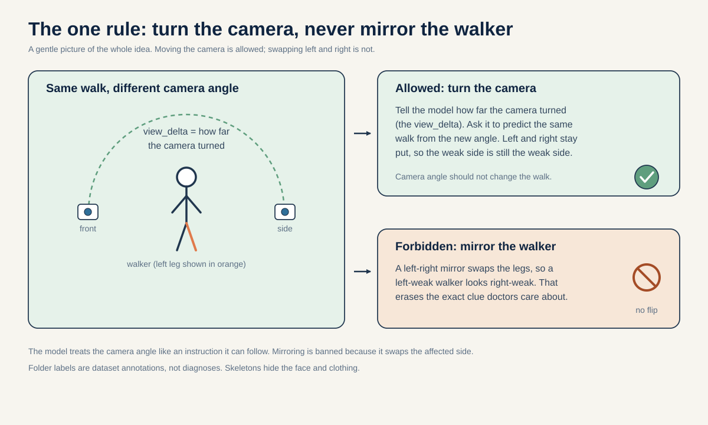
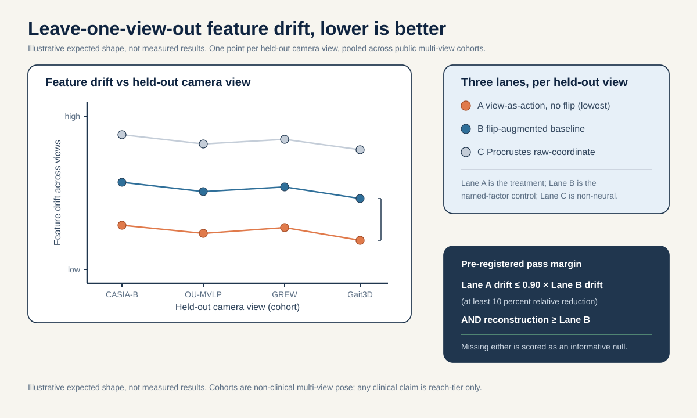
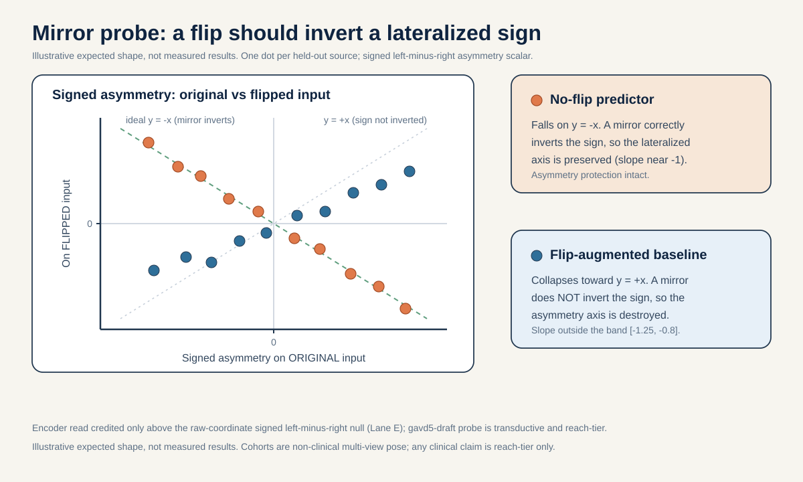

# Idea 12, in plain words: teach a gait model that camera angle should not matter, but left versus right always should

This is the "how to actually do it" guide for Idea 12, written so a motivated high-school student can follow every
step. The science comes from the folder's [`README.md`](./README.md). Every number here is kept true to
[`../_shared_facts.md`](../_shared_facts.md) (the single source of truth for numbers) and
[`../_neuro_facts.md`](../_neuro_facts.md) (the biology). If a number is not in those files, it is not in here, and any
made-up example is labelled "illustrative numbers only".

One honest note up front, repeated at the end because it matters: the folder labels (normal, parkinsons, stroke,
myopathic, cerebral_palsy) are just tags that came with the GAVD dataset. They are not diagnoses made by this project.
The main experiment here runs on public, NON-clinical gait datasets, so it proves a method, not a cure. And every number
that touches the internal gavd5-draft data is transductive, which means the model was trained on the very clips we later test
it on. More on what that costs us below.

## The big idea in plain words (60-second version)

Point a camera at someone walking. Now walk around and film them again from the side, then from behind. It is the same
walk every time. A good gait model should agree: the walk is the same no matter where the camera stands. That property
has a name, viewpoint invariance, and it just means the model's short numeric summary of the walk (its "fingerprint")
barely changes when only the camera angle changes.

There is a cheap trick people use to teach a model this: mirror the video left-to-right during training, like flipping a
photo. It doubles your data for free, and for a task like "who is this person" it usually helps. But a mirror swaps left
and right. For walking, that swap is dangerous, because many gait problems hurt only one side of the body. If a mirror
can turn a left-weak walker into a fake right-weak walker, then training with mirrors teaches the model that left and
right do not matter, and that erases the exact clue doctors care about.

This idea keeps the good part (camera angle should not change the walk) and throws out the dangerous part (never mirror).
The clever move is to tell the model how much the camera turned, and ask it to predict what the walk looks like from the
new angle, without ever flipping left and right. Turning the camera is allowed. Mirroring the body is banned.

## Mini-glossary (the words this idea actually uses)

- SKELETON: a moving stick figure. A pose detector finds body joints in each video frame, so a clip becomes a set of
  moving dots instead of pixels. Smaller than video, and it hides the face and clothing.
- TOKEN: the smallest chunk the model reads. Here, one joint watched over a short 4-frame window.
- EMBEDDING, also called FEATURES: a short "fingerprint of numbers" that summarizes a token or a whole walk. Two similar
  walks should get similar fingerprints.
- ENCODER: the part of the model that turns a skeleton into embeddings.
- JEPA (Joint-Embedding Predictive Architecture): a learning recipe where you hide part of the input and predict the
  hidden part as a fingerprint, not as exact coordinates (Assran et al., I-JEPA, CVPR 2023, arXiv:2301.08243).
- EMA TEACHER (target encoder): a slow-moving copy of the model that provides the "correct answer" fingerprints. EMA
  means exponential moving average, a slow average that drifts toward the trained model without being trained directly.
- PREDICTOR: a small network that takes the visible features plus an instruction and guesses the target features.
- ACTION / `view_delta`: the instruction we hand the predictor. Here it is how much the camera angle changed between two
  views. Treating a change as an action follows V-JEPA 2 (Assran et al., 2025, arXiv:2506.09985).
- VIEWPOINT INVARIANCE: features that barely change when only the camera angle changes.
- HORIZONTAL FLIP / MIRROR: swapping left and right, like a bathroom mirror.
- LATERALIZED: a problem that sits on one side of the body.
- SIGNED ASYMMETRY: a left-minus-right number that keeps its plus or minus sign, so it says which side.
- LEAVE-ONE-VIEW-OUT: a fair test. Hold out one whole camera angle, train on the rest, then check the held-out angle.
- TRANSDUCTIVE vs INDUCTIVE: transductive means the model was trained on the very videos you later test it on, so a high
  score can just be memorization. Inductive means you test on videos the model has never seen, the only real proof it
  learned something that transfers.
- SLOPE: how steep a line is. A slope of minus 1 means "when x goes up by one, y goes down by one," which is exactly what
  a clean sign flip looks like.
- R-SQUARED: a score from 0 to 1 for how well a straight-line fit explains a number. Higher is better.
- LATENT CROSS-ENTROPY (the fingerprint-distance score): the number the model shrinks while training, namely how far the
  predicted fingerprint is from the target fingerprint. "Latent" means it is measured in fingerprint space, not on raw
  pixels or coordinates. Before comparing, the target fingerprint is centered (its running average is subtracted so no
  single direction dominates) and sharpened (its contrasts made a little crisper), a normalization the project already
  applies.

## 1. The question in one sentence

On leave-one-view-out folds of public multi-view pose datasets, does a viewpoint-conditioned predictor that treats a
camera change as an action, trained with a strict no-left-right-flip rule, produce more view-stable gait features than a
flip-augmented baseline by a margin we fix in advance, while a signed-asymmetry probe confirms that a mirror flip inverts
the sign of the lateralized biomarker?

There are two endpoints, kept apart on purpose:

- The PRIMARY endpoint is view stability: on a held-out camera angle, does the new no-flip predictor's fingerprints move
  less than the flip-augmented baseline's when only the angle changes?
- The SECONDARY endpoint is the mirror check: does a left-right mirror cleanly flip the sign of the signed-asymmetry
  reading for the no-flip model, while the flip-augmented baseline fails to flip it?

The primary can pass while the secondary tells its own story. They are scored separately.

## 2. Why this idea, in plain words

The clinical literature sorts these gait conditions along a SYMMETRY axis (the one-sided-versus-both-sides split), and
that axis is the heart of the motivation.

- Conditions with a ONE-SIDED cause tend to make walking lean to one side. Stroke does this because the main motor nerve
  pathway (the corticospinal tract) crosses over to the opposite side of the body on its way down, a crossing called the
  pyramidal decussation, so a stroke in one half of the brain weakens the other half of the body (Natali and Javed,
  StatPearls, PMID 30571044). Hemiplegic cerebral palsy comes from a one-sided brain-tissue injury (Volpe 2009,
  PMID 19081519). Early Parkinson's typically starts on one side (the underlying dopamine loss is one-sided at onset,
  Riederer and Sian-Hulsmann 2012, PMID 22367437). All three raise a signed left-minus-right difference.
- The useful clinical number for all three is a SIGNED left-minus-right quantity: which side is affected, and by how
  much. The validated biomarker is the directional Symmetry Ratio on step length, swing time, and stance time
  (Patterson et al. 2010, PMID 19932621).

Now the sharp part. A horizontal mirror flip swaps left and right, so it turns a left-affected walker into what looks
like a right-affected walker. It INVERTS the sign of the exact biomarker that separates stroke, hemiplegic cerebral
palsy, and early Parkinson's from a healthy walker. If you fold left-right flip into your viewpoint augmentation, you
teach the model that left and right are interchangeable, which erases the axis the biology defines.

So the idea asks: can you get the good part of viewpoint invariance (camera angle should not matter) WITHOUT paying that
price? Treat the camera change as an ACTION the model conditions on (`view_delta`, in the V-JEPA 2 sense,
arXiv:2506.09985), and forbid the mirror. View can rotate; left and right must not swap.

This is not a random worry inside the project either. The gavd5-draft training pipeline already sets its flip chance to 0.0 by
default, precisely because left-right identity matters for stroke, and asymmetry is the weakest scalar a simple probe can
read out of the frozen features (R-squared about 0.154, versus about 0.719 for step amplitude, from
[`../_shared_facts.md`](../_shared_facts.md)). "Weakest-decoded" means a straight-line probe can barely read asymmetry
out of the features. This idea formalizes and defends that no-flip rule as a design principle.



How to read this picture: this is the whole idea in one image. A single walker stands in the middle, a camera moves
around them along an arc, and the label `view_delta` marks how far the camera turned. Moving the camera is fine and the
model should handle it. Mirroring the person is not fine, because it swaps the weak side, so it is crossed out.

## 3. What data you need

### 3.1 The core data: public multi-view pose cohorts (non-clinical, reach for clinical claims)

Here is the honest scope. gavd5-draft is the project's own dataset of monocular (single-camera) YouTube walking clips, so it
CANNOT supply many camera angles of the same walk. The whole point of this idea is many views of one walk, so the core
experiment has to run on public multi-view datasets, all NON-clinical:

- CASIA-B (Yu, Tan, Tan, ICPR 2006): 124 subjects filmed from 11 camera angles. The many angles are exactly what we need.
- OU-MVLP-Pose (Takemura et al., IPSJ Trans CVA 2018): about 10,000 subjects, released as multi-view pose keypoints.
- GREW (Zhu et al., ICCV 2021, arXiv:2205.02692) and Gait3D (Zheng et al., CVPR 2022, arXiv:2204.02569): large in-the-wild
  pose and 3D gait.
- We do NOT use Human3.6M (Ionescu et al., IEEE TPAMI 2014) in any method step here. It is listed in the facts file only
  as a check that pose skeletons match motion-capture ground truth, so it is background evidence that skeletons are
  trustworthy, not one of the four multi-view cohorts this experiment trains and tests on.

Say it plainly: these are gait-recognition and identity datasets with NO clinical labels. They can validate view-as-an-
action invariance as a METHOD only, never a clinical claim. There is no public multi-view skeleton dataset with stroke,
cerebral palsy, Parkinson's, or myopathy labels that keeps different people in train and test, so honest clinical
transfer is out of scope for this iteration and is stated as a reach-tier limitation, not promised.

### 3.2 The secondary data: the gavd5-draft GAVD cohort (internal, transductive side-check)

The internal work uses the canonical GAVD cohort (Ranjan et al., IEEE Access 2025, DOI 10.1109/ACCESS.2025.3545787):
96 sequences from 18 unique YouTube source videos (per-condition source counts: normal 1, Parkinson's 2, stroke 3,
myopathic 10, cerebral palsy 2, and all 12 normal sequences come from one video). gavd5-draft enters ONLY as a small secondary
mirror probe on the already-frozen `d0acc262` checkpoint. Because that encoder saw those rows and the source video is the
independent unit, every gavd5-draft number is labeled transductive.

### 3.3 What the data looks like, and how a team would get it

Each sequence is a skeleton: body joints tracked over time, each joint carrying an x, a y, and a relative z coordinate.
gavd5-draft uses MediaPipe BlazePose with 33 joints (Grishchenko et al. 2022, arXiv:2206.11678). The public cohorts use their
own pose skeletons, so a real team would DOWNLOAD each cohort, then "pose-normalize" it: map every cohort's joints onto a
shared lower-body-and-trunk joint set, fill short gaps where the detector blinked, center and scale each skeleton, resize
each clip to exactly 64 frames, and record the camera VIEW label for every sequence (and the subject identity where the
cohort provides reliable IDs). In plain words, we make every dataset speak the same skeleton language before we compare
them. Heels are the weak link for the detector (left heel visible about 70 percent of the time, right heel about
67 percent, versus about 99 percent for shoulders and hips), which is one more reason to lean on the pelvis, hips, knees,
and ankles.

Reading the math (why 528 tokens on the gavd5-draft side): each gavd5-draft sequence is resized to 64 frames, 4 adjacent frames form
one time patch giving 16 time positions, and 33 BlazePose joints times 16 time positions equals 528 possible joint-time
tokens. The "x" means multiply: 33 x 16 = 528. The public cohorts get mapped into this same per-joint token layout.

## 4. Step by step, how to do it

A quick map of what needs retraining: the CORE arm RETRAINS a small predictor head (not the whole encoder from scratch),
because the whole idea is a new predictor that conditions on `view_delta`. The gavd5-draft secondary probe is ZERO-retrain: it
just reads the already-frozen `d0acc262` features. Where the existing project tooling fits, we reuse it: the 528-token
joint-time tensor layout, the frozen `d0acc262` checkpoint for the side-check, and the existing predictor scale (a
2-layer Transformer with a learned mask token).

1. Pose-normalize the public cohorts (setup, no training yet). Download CASIA-B, OU-MVLP-Pose, GREW, and Gait3D. Map each
   cohort's joints onto the common joint set, resize every sequence to the 64-frame time base, and record the camera view
   label for each sequence plus subject identity where it is reliable. No seconds or cadence enter the core geometry arm,
   only the normalized time base.

2. Define the view-conditioned predictor (retrains a predictor head). Keep the encoder scale and predictor scale from the
   existing project (predictor is a 2-layer Transformer with a learned mask token). Add `view_delta` as an extra input to
   the predictor. The task: given the online encoder's features at an anchor view plus a `view_delta`, predict the EMA
   target encoder's features for the target view.

   Reading the math (the view-conditioned prediction loss): a "loss" is a score the model tries to make small, smaller
   means better guesses. Let `f_anchor` be the online encoder features at the anchor view and `f_target` the EMA target
   encoder features at the target view. The predictor `P` receives `f_anchor` and `view_delta` and outputs a guess
   `P(f_anchor, view_delta)`. The loss is the latent prediction error between that guess and a stop-gradient copy of
   `f_target` (a frozen snapshot the model is not allowed to nudge back). "Latent prediction error" just means the
   distance between the two fingerprints, measured in fingerprint space instead of on raw coordinates. It is the same
   score the project already uses: before comparing, the target fingerprint is centered (its running average is
   subtracted so no single direction dominates) and sharpened (its contrasts are made a little crisper), a normalization
   the project already applies. On top of that comes the project's VICReg anti-collapse term. "Collapse" is the failure
   where the model gives every input the same fingerprint to save effort, and VICReg's variance term stops that. Crucially the target features
   come from the UNFLIPPED target view, so left and right never swap.

   ```python
   import numpy as np

   LEFT_RIGHT_PAIRS = [(11, 12), (23, 24), (25, 26),
                       (27, 28), (29, 30), (31, 32)]

   def view_conditioned_loss(online_enc, target_enc, predictor,
                             seq_anchor, seq_target, view_delta):
       # No flip anywhere in here. view_delta is the action.
       f_anchor = online_enc(seq_anchor)               # visible anchor-view features
       f_target = target_enc(seq_target).detach()      # EMA target, unflipped, stop-grad
       f_pred = predictor(f_anchor, view_delta)         # predict target-view features
       return latent_cross_entropy(f_pred, f_target)    # + project VICReg term
   ```

3. Enforce the no-flip rule (the direction-preserving constraint). The augmentation set may include small rotations,
   small translations, and view resampling, but the horizontal left-right mirror is forbidden (flip probability held at
   0.0). The mirror operation exists in the code only as a test-time probe in step 6, never as training augmentation.

   Reading the math (flip probability 0.0): a flip probability is a chance, from 0 (never) to 1 (always). 0.0 means the
   pipeline never mirrors left and right. If it were above 0, the model would be taught that left and right are
   interchangeable, inverting the signed biomarker on the flipped fraction of data.

4. Train the two lanes under matched budgets (retrains predictor heads). Train two predictors on the same data and the
   same budget, differing in exactly ONE thing. The TREATMENT (Lane A) is the view-conditioned no-flip predictor. The
   CONTROL (Lane B) is a flip-augmented predictor (the common recipe) with no view conditioning. Changing only one thing
   at a time is the whole point: if the two models differ, it must be because of the named factor. This adds a predictor
   head, it is not full encoder pretraining from scratch.

5. Evaluate leave-one-view-out (the fair test). Hold out one camera view entirely, train on the rest, and measure feature
   stability and reconstruction on the held-out view. A view is the independent unit for this split, so no sequence from
   the held-out view appears in training. On cohorts with reliable subject IDs, also keep the same person out of both
   train and test, so the model cannot pass by recognizing the person instead of handling the angle. This is like studying
   with cards from angles A through J and then being quizzed only on angle K, which you never practiced.

6. Run the signed-asymmetry mirror probe against a raw-coordinate null (secondary endpoint). Fit a simple straight-line
   probe that reads a signed left-minus-right asymmetry scalar out of the features. Then apply the exact anatomical mirror
   (negate the horizontal coordinate, swap each left landmark with its right partner), re-encode, decode again with the
   same probe, and compare the original reading versus the mirrored reading against the line y equals minus x, the picture
   of a clean sign flip. Before crediting the encoder's read at all, fit the SAME target from a handcrafted signed
   left-minus-right scalar read straight off the raw coordinates (Lane E, the raw-coordinate null). The encoder's signed
   read counts only if it reaches at least 80 percent of that raw null. A "null" here is a no-brains baseline: if simple
   arithmetic on the raw dots already does the job, the fancy network gets no credit.

   ```python
   def anatomical_mirror(coords):
       mirrored = coords.copy()
       mirrored[:, :, 0] = -mirrored[:, :, 0]           # negate horizontal coord
       for left_idx, right_idx in LEFT_RIGHT_PAIRS:     # swap left with right
           mirrored[:, [left_idx, right_idx], :] = mirrored[:, [right_idx, left_idx], :]
       return mirrored

   def signed_left_minus_right_raw(coords):
       # Raw-coordinate null (Lane E): no network, just handcrafted signed left-minus-right.
       total = 0.0
       for left_idx, right_idx in LEFT_RIGHT_PAIRS:
           left_exc = coords[:, left_idx, :].std(axis=0).sum()
           right_exc = coords[:, right_idx, :].std(axis=0).sum()
           total += left_exc - right_exc                # signed: left minus right
       return total
   ```

7. Run the gavd5-draft secondary probe (zero-retrain). On the frozen `d0acc262` features, run the same mirror probe and check
   both its slope and whether it reaches 80 percent of the Lane E raw null. Label every gavd5-draft number transductive.

8. Apply the pre-registered decision rule (Section 5) and write out the results.

## 5. The decision rule, decided in advance

We fix the bars BEFORE looking at results, so nobody can move the goalposts after seeing the numbers.

PRIMARY (view stability). The view-conditioned no-flip predictor (Lane A) must reduce held-out-view feature drift by at
least 10 percent relative to the flip-augmented baseline (Lane B), which is a relative reduction of 0.10, AND it must
match or beat Lane B on held-out-view reconstruction of the target features. Miss either half and the primary run is
scored an informative null. A "null" here just means the treatment did not clear its bar, and that is still a real
finding.

Reading the math (feature drift and the 10 percent bar): drift is how much the features move when only the camera angle
changes. For the same walker seen from two views, compute the distance between their feature vectors, then average over
held-out-view pairs. Lower is better. The 10 percent (0.10) is the smallest relative drift improvement over the flip
baseline that counts as a real view-stability gain. "Match or beat on reconstruction" means the no-flip model must not
pay for its constraint with worse held-out-view prediction, it must be at least as good.

SECONDARY (mirror / signed asymmetry). The no-flip lane's mirror probe must invert with slope inside the band from minus
1.25 to minus 0.8 (a band placed around the ideal minus 1), AND the flip-augmented baseline's slope must fall OUTSIDE
that band, AND the no-flip lane's signed read must reach at least 80 percent (0.80) of the raw-coordinate signed null
(Lane E). This is scored separately from the primary drift endpoint.

Reading the math (the slope band): the slope is how much the mirrored reading changes when the original changes by 1. A
perfect flip has slope minus 1. The band from minus 1.25 to minus 0.8 means "clearly negative and reasonably close to
minus 1." The falsifiable contrast is that the no-flip lane must land INSIDE the band while the flip-augmented baseline
lands OUTSIDE it. If both land inside, the claim "flip augmentation damages the lateralized axis" fails, and we say so.

### A worked example (illustrative numbers only, not measured facts)

Say on held-out view K the flip-augmented baseline (Lane B) shows a feature drift of 0.50, and the no-flip
view-conditioned predictor (Lane A) shows 0.42. Walk the checks:

- Relative drift reduction: (0.50 minus 0.42) divided by 0.50 equals 0.16, that is 16 percent. Since 16 percent is above
  the 10 percent bar, the drift half passes.
- Reconstruction: say Lane A reconstructs the target features slightly better than Lane B, so "match or beat" passes too.
  The PRIMARY endpoint is a pass.
- Mirror slope: say Lane A's slope is minus 1.03 (inside the band, a clean flip) while Lane B's slope is minus 0.35
  (outside the band, a failed flip), and Lane A's signed read reaches 0.85 of the Lane E raw null (above the 0.80 bar).
  The SECONDARY bar passes too.

If instead Lane A's drift had been 0.47, the reduction would be (0.50 minus 0.47) divided by 0.50 equals 0.06, that is
6 percent, below the 10 percent bar, so the primary run would be scored an informative null even if the mirror bar still
passed. Again, these numbers are made up to show how the rule is applied.



How to read fig1: each dot is one held-out camera angle across the public multi-view cohorts. Lower dots mean the
features barely moved when only the angle changed, which is what we want. The new method (warm dots) should sit lowest,
the flip-augmented baseline higher, and the no-brains Procrustes baseline highest. A bracket marks the pre-registered
10 percent margin. The figure shows illustrative expected shape, not measured results.



How to read fig2: each dot compares one walker before and after mirroring, plotting the mirrored reading (up) against the
original reading (across), against the green line y equals minus x. If a dot lands on that line, the mirror cleanly
flipped its side (good, the model kept left and right separate). If dots drift off toward the opposite diagonal, mirroring
did not flip the sign, meaning the model treats left and right as the same (bad for clinical gait). The figure shows
illustrative expected shape, not measured results.

## 6. Controls that keep us honest

- ONE fingerprint. The gavd5-draft secondary probe binds to the single `d0acc262` checkpoint before any comparison, so the
  `dba24a`-versus-`d0acc262` lineage difference cannot sneak in as a fake effect. A "fingerprint" is just a short code
  that names one exact saved model.
- Named-factor discipline. Treatment (Lane A) and control (Lane B) differ only in the view-conditioning action and the
  flip switch. Budget, data, encoder scale, and predictor scale are identical, so any difference is attributable to the
  named factor.
- The flip-augmented baseline (Lane B). This is the standard gait-recognition recipe we are testing against, and the
  direct treatment-versus-control comparison for the primary drift endpoint.
- The Procrustes raw-coordinate ceiling (Lane C) for view stability. "Non-neural" means no learning network at all, just
  plain geometry. Procrustes alignment removes a global rotation with a rigid turn, like turning a photo until it faces
  forward. Align each sequence to a canonical orientation, then measure view drift from the aligned coordinates. If the
  neural predictor does not beat this rigid geometric fix, the learned invariance added nothing.
- The raw-coordinate signed left-minus-right null (Lane E) for the mirror endpoint. A handcrafted signed left-minus-right
  scalar read straight off the raw coordinates, no network. The learned encoder's signed read is credited only if it
  reaches at least 80 percent of this null. If raw coordinates already carry the signed axis, the encoder added nothing.
- Identity-disjoint splits with a fallback. On cohorts with reliable subject IDs, keep the same person out of both train
  and test, so view stability is not memorized identity (the model recognizing the person, not handling the angle). Any
  cohort without usable IDs is DROPPED from the identity-controlled primary endpoint. Its view-drift number is reported
  separately and flagged as not identity-controlled, so the headline claim cannot be explained by memorized identity.
- The mirror falsifier on the baseline. Lane B must NOT invert cleanly (slope outside the band). This pre-registered
  separation is what makes "flip augmentation damages the lateralized axis" falsifiable rather than a hope.
- gavd5-draft stays secondary and transductive. Every gavd5-draft number is labeled transductive, the encoder saw the rows, 18 source
  videos are the independent unit, and folder labels are dataset annotations, not diagnoses.
- No clinical claim from the core arm. The public cohorts have no clinical labels, so the core arm validates a method
  only.

The lanes at a glance:

| Lane | Feature source | Retrain? | Role |
|---|---|---|---|
| A View-conditioned no-flip | Predictor with `view_delta` action, flip off | Yes (predictor head) | Primary (drift) + secondary (mirror) |
| B Flip-augmented baseline | Predictor with left-right flip augmentation | Yes (predictor head) | Control (named-factor contrast) |
| C Procrustes raw-coordinate | Rigid-aligned raw joints, no network | No | Non-neural view-stability ceiling |
| E Raw-coordinate signed null | Handcrafted signed left-minus-right coords, no network | No | Non-neural ceiling for the mirror endpoint |
| D gavd5-draft secondary probe | Frozen `d0acc262` per-token features | No | Within-dataset transductive side-check |

## 7. What could happen, and what each outcome would mean

The decision rule is total: every outcome maps to one clear, pre-registered claim.

| Future | Shape | Primary verdict | Mirror verdict | What it licenses |
|---|---|---|---|---|
| F1 clean win | Lane A drift at least 10 percent below Lane B, reconstruction at least matching; Lane A mirror slope in the band, Lane B outside; Lane A read reaches 80 percent of Lane E | Pass | Pass | The design rule holds: viewpoint is an action you can condition on, AND direction-preserving invariance protects the lateralized axis. The strongest result. |
| F2 view stability only | Lane A clears the drift and reconstruction bars, but the mirror bars are not both met | Pass | Withheld | View-as-action buys real view stability, but the mirror justification stands or falls on its own. The invariance benefit and the asymmetry-protection benefit are separable. |
| F3 mirror only | Lane A misses the 10 percent drift margin, but the mirror contrast holds cleanly | Informative null | Pass | Conditioning on view added nothing over plain flip augmentation for view robustness; the no-flip rule is justified on asymmetry protection alone. |
| F4 double null | Lane A misses the drift margin AND the mirror contrast fails (both lanes flip, or neither does) | Informative null | Fail | Neither benefit is demonstrated here; flip augmentation did not measurably erase the signed axis in this setup, and we say so. |

An informative null is genuinely useful because it rules out a specific belief, and ICLR, ICML, and NeurIPS 2026
reviewer guidance explicitly value a well-motivated study that contributes new knowledge, including a careful negative
result (see [`../_shared_facts.md`](../_shared_facts.md), reviewer framing).

## 8. What this cannot tell us

- No clinical claim, ever, from the core arm. The public multi-view cohorts (CASIA-B, OU-MVLP-Pose, GREW, Gait3D) are
  gait-recognition and identity datasets with no clinical labels. Results on them validate a method, not clinical
  transfer. No participant-disjoint multi-view clinical skeleton cohort exists for stroke, cerebral palsy, Parkinson's,
  or myopathy, so any clinical-accuracy statement is external-cohort reach-tier only.
- Transductive gavd5-draft. The gavd5-draft side-check uses an encoder that saw every gavd5-draft row during training, so no gavd5-draft number
  is a fresh-people estimate. The source video is the independent unit, and there are only 18 of them.
- Tiny, lopsided internal sample. gavd5-draft has as few as one source video per condition and all 12 normal clips from one
  video, so it can only ever be a small secondary probe, never the headline.
- Provenance confound on gavd5-draft. Most normal rows use an augmented extraction path and every abnormal row uses the
  canonical path, so a within-gavd5-draft comparison could learn processing differences instead of walking.
- Monocular capture inside gavd5-draft. gavd5-draft is single-view, which is the whole reason the core invariance arm has to borrow
  external multi-view data.
- Skeleton limits. Skeletons cannot recover forces or propulsion (Bowden 2006), muscle-electrical activity or spasticity,
  transverse-plane rotation, or an etiologic muscle diagnosis. View invariance does not change those limits.

## 9. How to make it reproducible

- One checkpoint, one binding. Pin the gavd5-draft secondary probe to the single `d0acc262` fingerprint before any comparison,
  so two training lineages can never be mixed.
- Save the split manifest. Write out the leave-one-view-out manifest: which camera view is held out on each fold, which
  cohorts are identity-controlled and which are only view-drift (flagged not identity-controlled), and the subject-
  disjointness for each ID-bearing cohort. This is the record that lets anyone rebuild the exact same folds.
- Save the `view_delta` definition. Record exactly how each camera change was turned into the action input, plus the
  no-flip switch state (flip probability 0.0) end to end.
- Fix the seeds. Train Lane A and Lane B under identical seeds and budgets so the only difference is the named factor.
  Save the per-view drift numbers, the reconstruction numbers, the mirror slopes for both lanes, and the Lane E raw-null
  values.
- Label every number. Mark every public-cohort number as method-only and non-clinical, and every gavd5-draft number as
  transductive and small-sample, so no seen-video score is mistaken for evidence about new people.

## Responsible use

The public cohorts (CASIA-B, OU-MVLP-Pose, GREW, Gait3D) are gait-recognition and identity datasets with no clinical
labels, so results on them validate a method (view-as-an-action invariance with a no-flip rule), not clinical transfer.
The gavd5-draft condition folder labels (normal, parkinsons, stroke, myopathic, cerebral_palsy) are dataset annotations from
GAVD (Ranjan et al., IEEE Access 2025, DOI 10.1109/ACCESS.2025.3545787), not diagnoses made by this project, and every
gavd5-draft result is transductive and small-sample with the source video as the independent unit. The signed-asymmetry scalar
is a representation diagnostic, not a validated clinical measurement of any individual. No participant-disjoint
multi-view clinical skeleton cohort exists for these conditions, so any clinical-accuracy statement is external-cohort
reach-tier only.

## References

- Assran et al., V-JEPA 2, 2025, arXiv:2506.09985.
- Assran et al., I-JEPA, CVPR 2023, arXiv:2301.08243.
- Bardes et al., V-JEPA, 2024, arXiv:2404.08471.
- Bardes, Ponce, LeCun, VICReg, ICLR 2022, arXiv:2105.04906.
- Abdelfattah and Alahi, S-JEPA, ECCV 2024, DOI 10.1007/978-3-031-73411-3_21.
- Ranjan et al., GAVD, IEEE Access 2025, DOI 10.1109/ACCESS.2025.3545787.
- Yu, Tan, Tan, CASIA-B, ICPR 2006.
- Takemura et al., OU-MVLP-Pose, IPSJ Trans CVA 2018.
- Zhu et al., GREW, ICCV 2021, arXiv:2205.02692.
- Zheng et al., Gait3D, CVPR 2022, arXiv:2204.02569.
- Ionescu et al., Human3.6M, IEEE TPAMI 2014, DOI 10.1109/tpami.2013.248.
- Patterson et al., Gait and Posture 2010, PMID 19932621 (gait Symmetry Ratio biomarker).
- Natali and Javed, StatPearls, corticospinal tract anatomy, PMID 30571044.
- Volpe, Lancet Neurol 2009, PMID 19081519 (periventricular injury and corticospinal fibers).
- Riederer and Sian-Hulsmann, J Neural Transm 2012, PMID 22367437 (asymmetric nigrostriatal onset).
- Stenum et al., PLoS Comput Biol 2021, PMID 33891585 (skeleton validity).
- Grishchenko et al., BlazePose GHUM, 2022, arXiv:2206.11678.
- Kapoor and Narayanan, arXiv:2207.07048 (leakage taxonomy; source video as the independent unit).
- Varoquaux, NeuroImage 2018 (small-sample error bars).
