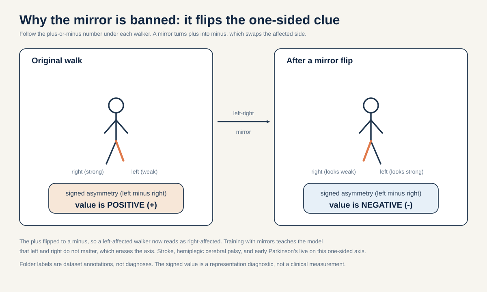

# Cross-view gait invariance with a no-flip rule that protects lateralized asymmetry

> On leave-one-view-out folds of public multi-view pose cohorts, does a viewpoint-conditioned predictor that treats view change as an action, trained with a strict no-left-right-flip rule, produce more view-stable gait features than a flip-augmented baseline by a pre-registered margin, while a signed-asymmetry probe confirms that a mirror flip inverts the sign of the lateralized biomarker?

If you want to actually run this, see [METHODOLOGY.md](./METHODOLOGY.md).

## The big idea in plain words

Point a camera at someone walking. Now walk around and film them again from the side, then from behind. It is the same walk every time. A good gait model should agree: the walk is the same no matter where the camera stands. That property has a name, viewpoint invariance, and there is a cheap trick people use to teach it.

The trick is to mirror the video left-to-right during training, like flipping a photo. It doubles your data for free, and for tasks like "who is this person" it usually helps. But a mirror swaps left and right. For walking, that swap is dangerous, because many conditions hurt only one side of the body. If a mirror can turn a left-weak walker into a fake right-weak walker, then training with mirrors teaches the model that left and right do not matter. That erases the exact clue doctors care about.

This proposal keeps the good part (camera angle should not change the walk) and throws out the dangerous part (never mirror). The clever move is to tell the model how much the camera turned, and ask it to predict what the walk looks like from the new angle, without ever flipping left and right.

## The question in plain words

A camera can look at the same walker from many angles. A gait model should ideally read the same walking pattern whether the person is filmed from the front, the side, or the back. That property has a name: viewpoint invariance. It means the features (the model's short numeric summary of the walk) do not change much when only the camera angle changes.

There is a standard trick people use to teach a model viewpoint invariance for free: mirror the input left-to-right during training (a horizontal flip). Flipping is cheap, it doubles the data, and for identity or generic recognition it usually helps. But it hides a trap for clinical gait. Many gait conditions are LATERALIZED, which just means the problem sits on one side of the body. A stroke weakens the side opposite the injured half of the brain, because the main motor wiring crosses over on its way down (this crossing is called the pyramidal decussation, Natali and Javed StatPearls, PMID 30571044). Hemiplegic cerebral palsy comes from a one-sided brain injury (unilateral periventricular leukomalacia, Volpe 2009, PMID 19081519). Early Parkinson's typically starts on one side (contralateral nigrostriatal degeneration, Riederer and Sian-Hulsmann 2012, PMID 22367437). For all three, the useful number is a SIGNED left-minus-right quantity: which side is affected, and by how much. "Signed" means the number carries a plus or minus sign that says which side, not just how big the difference is. The validated skeleton biomarker for this is the directional Symmetry Ratio on step length, swing time, and stance time (Patterson et al. 2010, PMID 19932621).

A horizontal mirror flip swaps left and right. So a flip turns a left-affected walker into what looks like a right-affected walker. It INVERTS the sign of the exact biomarker that separates stroke, hemiplegic CP, and early PD from a healthy walker. If you fold left-right flip into your viewpoint augmentation, you teach the model that left and right are interchangeable, which erases the axis the biology defines.

This proposal asks whether you can get the good part of viewpoint invariance without paying that price. The idea is to treat viewpoint as an ACTION the model conditions on, in the sense of an action-conditioned world-model predictor (Assran et al., V-JEPA 2, 2025, arXiv:2506.09985), and to enforce a strict NO-FLIP rule so the learned invariance is DIRECTION-PRESERVING. View can rotate; left and right must not swap.

### Words you will need

- Skeleton. A stick figure traced over a walking person. Instead of storing the video pixels, we store the moving dots of the body joints. It is smaller and it hides the person's face and clothes.
- Token. The smallest chunk the model reads. Here a token is one body joint at one short slice of time.
- Embedding, also called features. A short list of numbers that summarizes something, like a fingerprint. Two similar walks should get similar fingerprints.
- Encoder. The part of the model that turns a skeleton into an embedding.
- JEPA (Joint-Embedding Predictive Architecture). A learning recipe where you hide part of the input and predict the hidden part as a fingerprint, not as exact pixels or coordinates.
- EMA teacher, also called the target encoder. A slow-moving copy of the model that provides the "correct answer" fingerprints. EMA means exponential moving average, a slow average that drifts toward the trained model without being trained directly by backpropagation (the usual way networks learn from their mistakes).
- Predictor. A small network that takes visible features plus an instruction and guesses the hidden or target features.
- Action / `view_delta`. The instruction we hand the predictor. Here it is how much the camera angle changed between two views.
- Viewpoint invariance. Features that barely change when only the camera angle changes.
- Horizontal flip / mirror. Swapping left and right, like a bathroom mirror.
- Lateralized. A problem that sits on one side of the body.
- Signed asymmetry. A left-minus-right number that keeps its plus or minus sign, so it says which side.
- Probe. A tiny, simple model (usually a straight-line fit) trained on top of frozen features to read out one specific number.
- Leave-one-view-out. A fair test: hold out one whole camera angle, train on the rest, then check the held-out angle.
- Transductive vs inductive. Transductive means the model was trained on the very videos you later test it on, so a high score can just be memorization. Inductive means you test on videos the model has never seen, which is the only real proof it learned something that transfers.
- R-squared (R^2). A score from 0 to 1 for how well a straight-line fit explains a number. 1 is perfect, 0 is useless.
- Slope. How steep a line is. A slope of minus 1 means "when x goes up by one, y goes down by one," which is exactly what a clean sign flip looks like.
- Latent cross-entropy (the fingerprint-distance score). The number the model shrinks while training: how far the predicted fingerprint is from the target fingerprint. "Latent" just means it is measured in fingerprint space, not on raw pixels or coordinates. Before the two are compared, the target fingerprint is centered (its running average is subtracted so no single direction dominates) and sharpened (its contrasts are made a little crisper). This centering-and-sharpening is a normalization the project already applies.

**Reading the math (view_delta as an action).** This says the model is told how much the camera angle changed and asked to predict features from the new angle.
- `view_delta` is the change in viewpoint between an anchor view (the one you start from) and a target view (the one you want to predict), for example a rotation of the camera around the walker.
- It runs over the set of view pairs available in the cohort (for CASIA-B there are 11 camera views, so there are many possible deltas).
- "Conditioning on an action" means the predictor gets `view_delta` as an extra input, the way V-JEPA 2 gives its predictor an action to roll forward.
- If `view_delta` is zero (same view), the predictor should reproduce the same features. If `view_delta` is a real angle change, the predictor should produce the features you would get from that new angle, WITHOUT ever swapping left and right.

Everyday analogy for the whole setup: masking-and-predicting in a JEPA is like covering part of a photo with your hand and guessing what is behind it. The action-conditioned version is like being told "the camera moved thirty degrees to the right; now describe what the walk looks like from there." You are predicting a new view from an instruction, not memorizing one fixed picture.

## Why this matters

A positive result gives a transferable design rule for gait world models: viewpoint is an action you can condition on, and the invariance you learn must be direction-preserving. That is a method claim that reaches beyond any one dataset. It says the common left-right flip augmentation, harmless for identity recognition, is actively harmful for lateralized clinical gait, and it offers a concrete alternative (condition on `view_delta`, forbid the flip) that keeps the signed asymmetry axis intact while still buying view stability.

An informative null is equally useful, because it rules out a specific belief. Suppose the view-conditioned no-flip predictor does NOT beat the flip-augmented baseline on held-out-view feature stability. Then conditioning on view as an action adds nothing over plain flip augmentation for view robustness, and the no-flip rule would have to be justified on the asymmetry-preservation ground alone. That would tell us the invariance benefit and the asymmetry-protection benefit are separable, not two sides of one mechanism, which changes how we would argue for the design. A "null" here just means the treatment did not clear its bar, and that is still a real finding. ICLR, ICML, and NeurIPS 2026 reviewer guidance explicitly values a well-motivated study that contributes new knowledge, including a careful negative result.

There is a second, independent bit of knowledge in the mirror probe. If a signed-asymmetry probe on the no-flip features flips sign under a left-right mirror (slope inside the pre-registered band from -1.25 to -0.8, near the ideal -1) while the flip-augmented baseline does NOT flip (slope outside that band), that confirms the flip really does invert the lateralized biomarker and that training with it erases the axis, which is the whole justification for the no-flip rule. If the no-flip lane does not flip, or if the flip-augmented baseline flips just as cleanly, the justification weakens and we say so. The mirror read is also credited only above a raw-coordinate signed left-minus-right null (Lane E below), so the asymmetry decodability that motivates the rule is never asserted from the network alone.

## Background and related work

The world-model backbone is a Joint-Embedding Predictive Architecture. The skeleton variant is S-JEPA (Abdelfattah and Alahi, S-JEPA, ECCV 2024, DOI 10.1007/978-3-031-73411-3_21), built on the image and video JEPA family (Assran et al., I-JEPA, CVPR 2023, arXiv:2301.08243; Bardes et al., V-JEPA, 2024, arXiv:2404.08471). In a JEPA a VIEW (online) encoder sees part of the input, a TARGET (EMA) encoder sees the full input and is updated only by an exponential moving average (a slow copy that is not trained by backpropagation), and a PREDICTOR maps visible features to the target encoder's hidden features. Anti-collapse comes from VICReg (Bardes, Ponce, LeCun, ICLR 2022, arXiv:2105.04906). "Collapse" is the failure where the model saves effort by giving every input almost the same fingerprint, which is useless; VICReg's variance term prevents that by keeping the features spread across many independent directions.

The frontier framing this proposal borrows is action conditioning. V-JEPA 2 (Assran et al., 2025, arXiv:2506.09985) first pretrains action-free, then trains a predictor that is conditioned on an action and rolls the representation forward. The generalizable move here is to read VIEWPOINT as that action: `view_delta` plays the role V-JEPA 2's action plays, and the predictor learns to map anchor-view features plus a view change to target-view features.

The multi-view geometry gavd5-draft lacks is available in public gait cohorts, all NON-clinical. gavd5-draft is the project's own dataset of monocular (single-camera) YouTube walking clips, so it cannot supply many views of the same walk. Public gait datasets can. CASIA-B (Yu, Tan, Tan, ICPR 2006) captures each subject from 11 camera angles. OU-MVLP-Pose (Takemura et al., IPSJ Trans CVA 2018) is a large multi-view pose dataset. GREW (Zhu et al., ICCV 2021, arXiv:2205.02692) and Gait3D (Zheng et al., CVPR 2022, arXiv:2204.02569) provide large-scale in-the-wild pose and 3D gait. These are gait-recognition and identity datasets with NO clinical labels, so they can validate view-as-action invariance as a method only, not clinical transfer.

The clinical grounding is the lateralized axis. Stroke hemiparesis follows corticospinal decussation (PMID 30571044). Hemiplegic CP follows unilateral PVL (PMID 19081519). Early PD onset is contralateral nigrostriatal (PMID 22367437). The validated, skeleton-recoverable biomarker across these is the directional Symmetry Ratio (Patterson 2010, PMID 19932621). Skeletons can measure it: Stenum et al. 2021 (PMID 33891585) report temporal mean absolute error 0.02 seconds per step and sagittal hip, knee, and ankle mean absolute error of 4.0, 5.6, and 7.4 degrees from monocular 2-D video, which covers the per-joint asymmetries this biomarker uses (knees 25/26, ankles 27/28, hips 23/24). In plain words: a pose skeleton is accurate enough to read this side-to-side difference. The independent-unit and leakage discipline follows Kapoor and Narayanan (leakage taxonomy, 2022, arXiv:2207.07048) and Varoquaux (NeuroImage 2018, small samples give large error bars).

Inside gavd5-draft itself, laterality is already load-bearing: the training pipeline sets `flip_probability` to 0.0 by default precisely because left-right identity matters for stroke, and asymmetry is the weakest-decoded scalar from the frozen features (R-squared about 0.154). For contrast, step amplitude decodes far better (R-squared about 0.719). "Weakest-decoded" means a straight-line probe can barely read asymmetry out of the features. This proposal protects exactly that fragile axis.

**Reading the math (flip_probability 0.0).** This says how often the pipeline mirrors an input left-to-right.
- flip_probability is a chance, so it runs from 0 (never) to 1 (always).
- 0.0 means the pipeline never flips left and right, which is the no-flip rule this proposal formalizes and defends.
- If it were above 0, the model would be taught that left and right are interchangeable, inverting the signed asymmetry biomarker on the flipped fraction of data.

## Method

The core arm runs on public multi-view pose cohorts, because gavd5-draft is monocular YouTube with no controlled multi-view capture. The gavd5-draft tokens enter only as a secondary within-dataset probe. Where possible the existing gavd5-draft tooling is reused: the 528-token joint-time tensor layout, the frozen `d0acc262` checkpoint for the secondary probe, and the existing predictor scale (a 2-layer Transformer with a learned mask token).

**Reading the math (token count in gavd5-draft).** This says the total joint-time tokens equal joints times time positions.
- Each sequence is resized to 64 frames, and 4 adjacent frames form one time patch, giving 16 time positions.
- 33 BlazePose joints times 16 time positions equals 528 possible joint-time tokens.
- The public cohorts use their own pose skeletons; they are pose-normalized (converted onto the same joint layout) into the same per-joint token layout before use.

1. Pose-normalize the public cohorts. Download CASIA-B, OU-MVLP-Pose, GREW, and Gait3D (already skeleton or pose, non-clinical, public). Map each cohort's joints onto a common lower-body-and-trunk joint set, resize each sequence to the 64-frame time base, and record the camera VIEW label for every sequence. No seconds or cadence are used in the core geometry arm; only the normalized time base. In plain words, we make every dataset speak the same skeleton language before we compare them.

2. Define the view-conditioned predictor. Keep the encoder scale and the predictor scale from the existing project (predictor is a 2-layer Transformer with a learned mask token). Add `view_delta` as an action input to the predictor. The task: given anchor-view encoder features and a `view_delta`, predict the target encoder's features for the target view.

**Reading the math (the view-conditioned prediction loss).** A "loss" is a score the model tries to make small; smaller means better guesses. This says the predictor is scored by how close its target-view guess is to the EMA target encoder's real target-view features.
- Let `f_anchor` be the online encoder features at the anchor view and `f_target` the EMA target encoder features at the target view.
- The predictor `P` receives `f_anchor` and `view_delta` and outputs a guess `P(f_anchor, view_delta)`.
- The loss is the latent prediction error between `P(f_anchor, view_delta)` and a stop-gradient copy of `f_target` (a frozen snapshot the model is not allowed to nudge back). It uses the same distance-between-fingerprints score the project already applies: before the guess is compared to the target, the target fingerprint is first re-centered (the running average is subtracted so no direction dominates) and then sharpened (contrasts are made a little crisper). "Latent cross-entropy" is just the name for that fingerprint-distance score; "latent" means it lives in fingerprint space, not pixel space. This runs on top of the project's VICReg anti-collapse term.
- Smaller loss means the predictor reproduced the other view's features from the action alone. Crucially the target features are computed from the UNFLIPPED target view, so left and right never swap.

3. Enforce the no-flip rule. The augmentation set may include small rotations and translations and view resampling, but the horizontal left-right mirror is forbidden (flip probability held at 0.0). This is the direction-preserving constraint. The `LEFT_RIGHT_PAIRS` mirror operation is used ONLY as a test-time probe (step 6), never as training augmentation.

4. Train the core predictor and the baseline. Train two predictors under identical budgets and data except the one named factor. The treatment is the view-conditioned no-flip predictor. The baseline is a flip-augmented predictor (the common recipe) with no view conditioning. This retrains and adds a view-conditioned predictor head at predictor scale; it is not full encoder pretraining from scratch. Changing only one thing at a time is the whole point: if the two models differ, it must be because of the named factor.

5. Evaluate leave-one-view-out. Hold out one camera view entirely, train on the rest, and measure feature stability and reconstruction on the held-out view. A view is the independent unit for this split, so no sequence from the held-out view appears in training. This is like studying with cards from angles A through J and then being quizzed only on angle K, which you never practiced.

6. Run the signed-asymmetry mirror probe against a raw-coordinate null. Fit a linear probe that reads a signed left-minus-right asymmetry scalar (the Patterson-style directional summary, PMID 19932621) from the features. Apply the exact `LEFT_RIGHT_PAIRS` mirror (negate the horizontal coordinate, swap each left landmark with its right partner), re-encode, decode with the same probe, and compare original vs mirrored decoded scalars against the line y equals minus x. That line is the picture of a clean sign flip: whatever came out positive should come out equally negative after mirroring. Crucially, before the encoder's read is credited, fit the SAME target from a handcrafted signed left-minus-right scalar read directly off the raw coordinates (Lane E, the raw-coordinate null, mirroring sibling 05's Lane B discipline). The encoder's signed-asymmetry decodability counts only if it reaches at least 80 percent of the raw-coordinate null's decodability; otherwise the signed axis was already carried by raw coordinates and the encoder added nothing on it. A "null" here is a no-brains baseline: if simple arithmetic on the raw dots already does the job, the fancy network gets no credit.

Here is the core operation in short readable pseudo-code:

```python
import numpy as np

LEFT_RIGHT_PAIRS = [(11, 12), (23, 24), (25, 26),
                    (27, 28), (29, 30), (31, 32)]

def view_conditioned_loss(online_enc, target_enc, predictor,
                          seq_anchor, seq_target, view_delta):
    # No flip anywhere in here. view_delta is the action.
    f_anchor = online_enc(seq_anchor)               # visible anchor-view features
    f_target = target_enc(seq_target).detach()      # EMA target, unflipped, stop-grad
    f_pred = predictor(f_anchor, view_delta)         # predict target-view features
    return latent_cross_entropy(f_pred, f_target)    # + project VICReg term

def anatomical_mirror(coords):
    mirrored = coords.copy()
    mirrored[:, :, 0] = -mirrored[:, :, 0]           # negate horizontal coord
    for left_idx, right_idx in LEFT_RIGHT_PAIRS:     # swap left with right
        mirrored[:, [left_idx, right_idx], :] = mirrored[:, [right_idx, left_idx], :]
    return mirrored

def signed_left_minus_right_raw(coords):
    # Raw-coordinate null (Lane E): no network, just handcrafted signed left-minus-right.
    total = 0.0
    for left_idx, right_idx in LEFT_RIGHT_PAIRS:
        left_exc = coords[:, left_idx, :].std(axis=0).sum()
        right_exc = coords[:, right_idx, :].std(axis=0).sum()
        total += left_exc - right_exc                # signed: left minus right
    return total

# Mirror probe: a signed asymmetry read should invert under the flip (line y = -x).
signed_orig = asym_probe(encoder(coords))
signed_mirror = asym_probe(encoder(anatomical_mirror(coords)))
print(signed_orig, signed_mirror)   # expect roughly equal size, opposite sign

# Raw-coordinate null: credit the encoder read only if it reaches >= 80% of this.
raw_signed = signed_left_minus_right_raw(coords)
```

## The decisive experiment

The split is stated before any fitting, so nobody can move the goalposts after seeing the results. The core split is LEAVE-ONE-VIEW-OUT on the public multi-view cohorts: one camera view is held out entirely, no sequence from that view enters training, and the held-out view is the independent unit for the view-stability endpoint. Within each cohort, subject identity is additionally kept disjoint between train and held-out-view evaluation, meaning the same person cannot appear in both training and testing. This requires reliable subject IDs. For any cohort that lacks reliable subject identity metadata, view stability could reflect memorized identity rather than view invariance (the model recognizing the person, not handling the angle), so that cohort is EXCLUDED from the identity-controlled leave-one-view-out endpoint and the identity-controlled number is reported only on ID-bearing cohorts. A cohort without usable IDs may still contribute a view-drift number, but it is labeled as NOT identity-controlled and is not counted toward the primary endpoint, so the headline claim is never confounded by memorized identity. The gavd5-draft secondary probe is SOURCE-VIDEO-DISJOINT and every gavd5-draft number is labeled transductive, because the frozen `d0acc262` encoder saw those rows and 18 source videos are the independent unit.

Primary endpoint: held-out-view feature stability of the view-conditioned no-flip predictor versus the flip-augmented baseline, measured as reduced feature drift across views on the held-out view.

**Reading the math (feature drift across views).** This says how much the features move when only the camera angle changes.
- For the same walker seen from two views, compute the distance between their feature vectors. Small distance means view-stable features.
- Drift is averaged over held-out-view pairs. Lower drift is better.
- The treatment must lower drift relative to the baseline by the pre-registered margin below.

Pre-registered margin (primary, view-stability): the view-conditioned no-flip predictor must reduce held-out-view feature drift by at least 10 percent relative to the flip-augmented baseline (a relative reduction of 0.10), AND match or beat the baseline on held-out-view reconstruction of the target features. Missing either is scored as an informative null on the primary endpoint.

Pre-registered bar (secondary, mirror / signed-asymmetry): the no-flip lane's signed-asymmetry mirror probe must invert with slope inside the band -1.25 to -0.8, AND the flip-augmented baseline's slope must fall OUTSIDE that band (shallower than -0.8 or steeper than -1.25), AND the no-flip lane's signed-asymmetry read must reach at least 80 percent of the raw-coordinate signed left-minus-right null (Lane E). This bar is scored separately from the primary drift endpoint.

**Reading the math (the margin numbers).** This says the primary and secondary endpoints each have their own bar.
- 10 percent (a relative reduction of 0.10) is the smallest drift improvement over the flip baseline that counts as a real view-stability gain.
- "Match or beat on reconstruction" means the no-flip predictor must not pay for its constraint with worse held-out-view feature prediction; it must be at least as good.
- The band from -1.25 to -0.8 around the ideal slope of -1 is how close the no-flip mirror response must be to a clean sign flip; the slope must be negative and near -1. The flip-augmented baseline must land OUTSIDE this band, which is the falsifiable contrast: no-flip inverts cleanly, flip-augmented does not.
- 80 percent (a fraction of 0.80) is the share of the raw-coordinate signed left-minus-right null the encoder's signed read must reach, so the asymmetry decodability that justifies the no-flip rule is credited only above a non-neural baseline, not asserted from the network alone.
- If the primary pair (drift and reconstruction) is missed, the primary run is an informative null. The secondary mirror bar is reported and interpreted on its own.

Worked example (illustrative numbers only, not measured facts). Suppose on held-out view K the flip-augmented baseline (Lane B) shows a feature drift of 0.50, and the no-flip view-conditioned predictor (Lane A) shows 0.42. The relative reduction is (0.50 minus 0.42) divided by 0.50, which equals 0.16, that is 16 percent. Since 16 percent is above the 10 percent bar, the drift half of the primary endpoint passes. Now check reconstruction: say Lane A reconstructs the target features slightly better than Lane B, so "match or beat" passes too. The primary endpoint is a pass. Next the mirror probe: say Lane A's mirror slope is -1.03 (inside the band from -1.25 to -0.8, a clean flip) while Lane B's slope is -0.35 (outside the band, a failed flip), and Lane A's signed read reaches 0.85 of the Lane E raw null (above the 0.80 bar). The secondary bar passes too. If instead Lane A's drift had been 0.47, the reduction would be only 6 percent, below the 10 percent bar, and the primary run would be scored an informative null even if the mirror bar still passed. Again, these numbers are made up to show how the rule is applied.

Two simple non-neural baselines, one per endpoint. "Non-neural" means no learning network at all, just plain geometry or arithmetic, so we know what a no-brains method can already do. First, for the view-stability endpoint, a PROCRUSTES-ALIGNED raw-coordinate baseline. Align each sequence's raw joints to a canonical orientation with a rigid rotation (Procrustes alignment removes a global rotation without a neural network, like turning a photo until it faces forward), then measure view drift from the aligned coordinates. If the neural view-conditioned predictor does not beat this non-neural alignment on view stability, the learned invariance added nothing over a rigid geometric fix. Second, for the signed-asymmetry / mirror endpoint, a RAW-COORDINATE SIGNED LEFT-MINUS-RIGHT NULL. This is the same discipline sibling 05 pins as its Lane B: a handcrafted signed left-minus-right scalar read directly off the raw coordinates with no neural network, using the same `LEFT_RIGHT_PAIRS` anatomy (a per-side excursion summary, then left minus right). The learned encoder's signed-asymmetry read is credited only if it reaches at least 80 percent of this raw-coordinate null's decodability of the signed axis; if raw coordinates already carry the signed asymmetry as well or better, the encoder added nothing on that axis. The flip-augmented predictor is the direct treatment-vs-control comparison for the primary drift endpoint.

| Lane | Feature source | Retrain? | Role | Expected |
|---|---|---|---|---|
| A View-conditioned no-flip | Predictor with `view_delta` action, flip off | Yes (predictor head) | Primary (drift) + secondary (mirror) | Primary: >= 10% lower view drift than B, reconstruction >= B. Secondary: mirror slope in [-1.25, -0.8] and signed read >= 80% of Lane E null |
| B Flip-augmented baseline | Predictor with left-right flip augmentation | Yes (predictor head) | Control (named-factor contrast) | Reference; mirror probe must NOT invert (slope outside [-1.25, -0.8], i.e. above -0.8 or below -1.25, and near-zero or positive) |
| C Procrustes raw-coordinate | Rigid-aligned raw joints, no network | No | Non-neural view-stability ceiling/floor | Reference target for the drift endpoint |
| E Raw-coordinate signed-asymmetry null | Handcrafted signed left-minus-right coords, no network | No | Non-neural ceiling for the mirror endpoint | Reference target; encoder credited only if it reaches >= 80% of this |
| D gavd5-draft secondary probe | Frozen `d0acc262` per-token features | No | Within-dataset transductive probe | Signed-asymmetry mirror inverts (slope in [-1.25, -0.8]) AND read reaches >= 80% of Lane E null (transductive, labeled) |

How to read this table: each row is one "lane" (one way to produce features), whether it needs retraining, its job, and the number it must hit. Lane A is the new idea; Lane B is the standard trick we are testing it against; Lanes C and E are no-brains baselines it must beat; Lane D is the small, honest gavd5-draft side-check.

## Controls and incorporated repairs

- Named-factor discipline. Treatment (Lane A) and control (Lane B) differ only in the view-conditioning action and the flip switch; budget, data, encoder scale, and predictor scale are identical, so any difference is attributable to the named factor.
- Identity-disjoint, with an explicit fallback. On cohorts with reliable subject metadata, hold subjects disjoint across the leave-one-view-out split so view stability is not memorized identity. On any cohort that lacks reliable subject IDs, drop it from the identity-controlled endpoint entirely: its view-drift number is reported separately and flagged as not identity-controlled, and the primary endpoint is computed only on ID-bearing cohorts. This guarantees the headline view-stability claim cannot be explained by memorized identity.
- Non-neural ceilings, one per endpoint. The Procrustes-aligned raw-coordinate baseline (Lane C) bounds how much of view stability is just a rigid rotation fix; the network is credited on the drift endpoint only if it beats it. The raw-coordinate signed left-minus-right null (Lane E) bounds how much of the signed-asymmetry read is already in raw coordinates; the network is credited on the mirror endpoint only if it reaches at least 80 percent of it. Every endpoint thus has a handcrafted raw-coordinate ceiling, so no neural read is asserted above the non-neural floor without evidence.
- Mirror falsifier on the baseline, pre-registered as a quantitative contrast. Lane A (no-flip) must invert with slope inside the band -1.25 to -0.8. Lane B (flip-augmented) must NOT: its mirror slope must fall OUTSIDE that band, meaning either shallower than -0.8 (a mirror that fails to cleanly reverse the sign, including near-zero or positive slope) or steeper than -1.25. This pre-registered separation (Lane A inside the band, Lane B outside it) is what makes the claim "flip augmentation damages the lateralized axis" falsifiable rather than a qualitative expectation. If both lanes land inside the band, the claim fails: flip augmentation did not measurably erase the signed axis, and we say so.
- gavd5-draft stays secondary and transductive. Every gavd5-draft number is labeled transductive; the encoder saw the rows; 18 source videos are the independent unit; folder labels are dataset annotations, not diagnoses.
- One fingerprint. The gavd5-draft secondary probe binds to the single `d0acc262` fingerprint before any comparison, avoiding the `dba24a`-vs-`d0acc262` lineage confound. A "fingerprint" here is just a short code that names one exact saved model, so we never accidentally mix two different training runs.
- No clinical claim from the core arm. The public cohorts have no clinical labels; the core arm validates view-as-action invariance as a method only.

## How this differs from the existing plan

The nearest neighbors are plan/07 (viewpoint / selective-invariance stress test) and ideas/05 (signed laterality decodability and the anatomical mirror). This proposal is sharply distinct on both. Plan/07 stresses viewpoint invariance as a robustness sweep on the existing frozen encoder; it does not build a view-conditioned predictor and does not treat view as an action. Here viewpoint is an ACTION the predictor conditions on (`view_delta`, in the V-JEPA 2 sense), which is a world-model capability, not a stress test, and it RETRAINS a predictor head. Ideas/05 makes signed asymmetry a decodable axis and tests the mirror on the frozen gavd5-draft encoder as its primary object; here the mirror is a SECONDARY falsifier that justifies a no-flip TRAINING rule, and the primary object is view-conditioned invariance on external multi-view cohorts that gavd5-draft cannot supply. No plan item runs on external multi-view pose cohorts, and no plan item proposes the direction-preserving no-flip design rule.

## Timeline (feasibility-tiered, ambition-first)

Effort is HIGH. The core tier is the three-week plan below with Day-5 and Day-14 gates. A "gate" is a go / no-go checkpoint: you only continue if certain conditions are met. The reach tier is explicitly not promised.

Week 1 (16 to 22 Aug 2026): download and pose-normalize CASIA-B, OU-MVLP-Pose, GREW, and Gait3D into the common joint set and 64-frame time base; record view labels and (where available) subject identity; build the leave-one-view-out manifest with identity disjointness; wire `view_delta` into the existing predictor as an action; confirm the no-flip switch is enforced end to end.

Day-5 gate (20 Aug 2026): this is a stability and readiness gate, not a partial-win check on the primary endpoint. Continue only if (1) at least one multi-view cohort is fully pose-normalized with reliable view labels AND has usable subject identity metadata so the identity-controlled split is possible, (2) the view-conditioned predictor trains stably (loss decreasing, no collapse under the VICReg variance floor, no NaNs, where a NaN is a "not a number" error that means the math blew up), and (3) a negative-control sanity check passes: on the raw coordinates the anatomical mirror produces a clean sign flip of the handcrafted signed left-minus-right scalar (slope negative, near -1), confirming the mirror operation itself is wired correctly before any encoder is judged by it. No comparison of the treatment against the flip-augmented baseline is made at this gate, so the primary drift outcome is not pre-judged. If the raw-coordinate mirror does not invert at all, the probe plumbing is broken; pause and diagnose before spending the training budget.

Week 2 (23 to 29 Aug 2026): run the full leave-one-view-out sweep for Lane A and Lane B under matched budgets, on ID-bearing cohorts for the identity-controlled endpoint; compute view-drift and held-out-view reconstruction; run the Procrustes raw-coordinate baseline (Lane C); fit the raw-coordinate signed left-minus-right null (Lane E) as the mirror-endpoint ceiling; run the gavd5-draft secondary transductive probe (Lane D) on the frozen `d0acc262` features and check both its mirror slope and whether it reaches 80 percent of the Lane E null.

Day-14 gate (29 Aug 2026): continue to write-up only if the primary drift endpoint has a clean verdict (either clearing the 10 percent relative margin with reconstruction at least matching the baseline, or an interpretable null against it), and the secondary mirror endpoint has a clean verdict (a clear inside-or-outside-the-band call for both the no-flip lane and the flip-augmented baseline, and a clear reaches-or-misses-80-percent call against the Lane E raw-coordinate null).

Week 3 (30 Aug to 5 Sep 2026): produce the figures, finalize the leave-one-view-out invariance table and the mirror-slope result, write the transductive caveats next to every gavd5-draft number, and package the manifest, `view_delta` definition, and per-view results.

Reach tier (extra weeks, NOT in the core three): any clinical-accuracy statement requires a participant-disjoint MULTI-VIEW CLINICAL skeleton cohort for stroke, CP, PD, or myopathy. No such cohort exists. Every public multi-view cohort we can use (CASIA-B, OU-MVLP-Pose, GREW, Gait3D) is non-clinical, and every clinical gait cohort we know of is single-view. So there is no dataset that is BOTH multi-view AND clinically labelled with different people held out. That is the exact gap this reach tier would need to fill. Reach tier is therefore gated on new data collection and is stated as an honest limitation, not promised.

## Figures


Fig 1: held-out-view feature drift (lower is better) for one point per held-out camera view across the public multi-view cohorts CASIA-B, OU-MVLP-Pose, GREW, and Gait3D. Lane A (view-conditioned, no-flip, warm) sits lowest, Lane B (flip-augmented, blue) sits higher, and Lane C (Procrustes raw-coordinate, grey) sits highest. A bracket marks the pre-registered relative drift-reduction margin of at least 10 percent between Lane A and Lane B, and a dark pass card states the full margin (Lane A drift at most 0.90 times Lane B drift, and reconstruction at least matching Lane B). The cohorts are non-clinical multi-view pose and the figure shows illustrative expected shape, not measured results.

How to read this picture: each dot is one held-out camera angle. Lower dots mean the features barely moved when only the angle changed, which is what we want. The new method (warm dots) should sit lowest.


Fig 2: signed-asymmetry scalar decoded from the original input (x) versus the same scalar decoded from the left-right-flipped input (y), against the green dashed reflection line y equals minus x. The no-flip view-conditioned predictor (warm) preserves the sign and falls along y equals minus x, so a mirror correctly inverts it. The flip-augmented baseline (blue) collapses the sign toward y equals plus x, so a mirror does not invert it and the lateralized axis is destroyed. The two behaviors are labeled side by side, separating the invariance benefit from the asymmetry-protection benefit; the encoder read is credited only above the raw-coordinate signed left-minus-right null (Lane E). The figure shows illustrative expected shape, not measured results.

How to read this picture: each dot compares one walker before and after mirroring. If a dot lands on the green line, the mirror cleanly flipped its side (good, the model kept left and right separate). If dots drift off that line toward the opposite diagonal, mirroring did not flip the sign, meaning the model treats left and right as the same (bad for clinical gait).


Fig 3: a friendly concept diagram. A single walker stands in the middle. A camera moves around them along an arc, and a small label `view_delta` marks how far the camera turned. An arrow shows the model predicting the walk from the new angle. A red "no flip" stamp sits over a mirror image, showing that turning the camera is allowed but swapping left and right is forbidden.

How to read this picture: this is the whole idea in one image. Moving the camera (changing `view_delta`) is fine and the model should handle it. Mirroring the person is not fine, because it swaps the weak side, so it is crossed out.



Fig 4: a two-panel before-and-after. On the left, a walker with a weaker left leg and a signed asymmetry value that is positive (left minus right). On the right, the same walker after a left-right mirror: the weakness now appears on the right and the signed value has become negative. A caption notes that stroke, hemiplegic cerebral palsy, and early Parkinson's all live on this one-sided axis, so flipping erases exactly the clue that matters.

How to read this picture: follow the little plus-or-minus number under each walker. The mirror flips its sign from plus to minus, which is the whole reason left-right flipping is banned here. The folder labels shown are dataset annotations, not diagnoses.

## Responsible use

The public cohorts (CASIA-B, OU-MVLP-Pose, GREW, Gait3D) are gait-recognition and identity datasets with no clinical labels; results on them validate a method (view-as-action invariance with a no-flip rule), not clinical transfer. The gavd5-draft condition folder labels (normal, parkinsons, stroke, myopathic, cerebral_palsy) are dataset annotations from GAVD, not diagnoses made by this project, and every gavd5-draft result is transductive and small-sample with the source video as the independent unit. The signed-asymmetry scalar is a representation diagnostic, not a validated clinical measurement of any individual. No participant-disjoint multi-view clinical skeleton cohort exists for these conditions, so any clinical-accuracy statement is external-cohort reach-tier only. Skeletons cannot recover kinetics or propulsion (Bowden 2006), EMG or spasticity, transverse-plane rotation, or an etiologic muscle diagnosis; view invariance does not change those limits.

## References

- Assran et al., V-JEPA 2, 2025, arXiv:2506.09985.
- Assran et al., I-JEPA, CVPR 2023, arXiv:2301.08243.
- Bardes et al., V-JEPA "Revisiting Feature Prediction for Learning Visual Representations from Video", 2024, arXiv:2404.08471.
- Bardes, Ponce, LeCun, VICReg, ICLR 2022, arXiv:2105.04906.
- Abdelfattah and Alahi, S-JEPA, ECCV 2024, DOI 10.1007/978-3-031-73411-3_21.
- Ranjan et al., GAVD, IEEE Access 2025, DOI 10.1109/ACCESS.2025.3545787.
- Yu, Tan, Tan, CASIA-B "A Framework for Evaluating the Effect of View Angle, Clothing and Carrying Condition on Gait Recognition", ICPR 2006.
- Takemura et al., OU-MVLP-Pose "Multi-view Large Population Gait Dataset", IPSJ Transactions on Computer Vision and Applications 2018.
- Zhu et al., GREW "Gait Recognition in the Wild", ICCV 2021, arXiv:2205.02692.
- Zheng et al., Gait3D "Gait Recognition in the Wild with Dense 3D Representations", CVPR 2022, arXiv:2204.02569.
- Patterson et al., "Evaluation of gait symmetry after stroke", Gait and Posture 2010, PMID 19932621.
- Natali and Javed, Corticospinal Tract, StatPearls, PMID 30571044.
- Volpe, "Brain injury in premature infants", Lancet Neurology 2009, PMID 19081519.
- Riederer and Sian-Hulsmann, asymmetric nigrostriatal degeneration, J Neural Transm 2012, PMID 22367437.
- Stenum et al., "Two-dimensional video-based analysis of human gait using pose estimation", PLoS Comput Biol 2021, PMID 33891585.
- Kapoor and Narayanan, "Leakage and the Reproducibility Crisis in ML-based Science", 2022, arXiv:2207.07048.
- Varoquaux, "Cross-validation failure: small sample sizes lead to large error bars", NeuroImage 2018.
