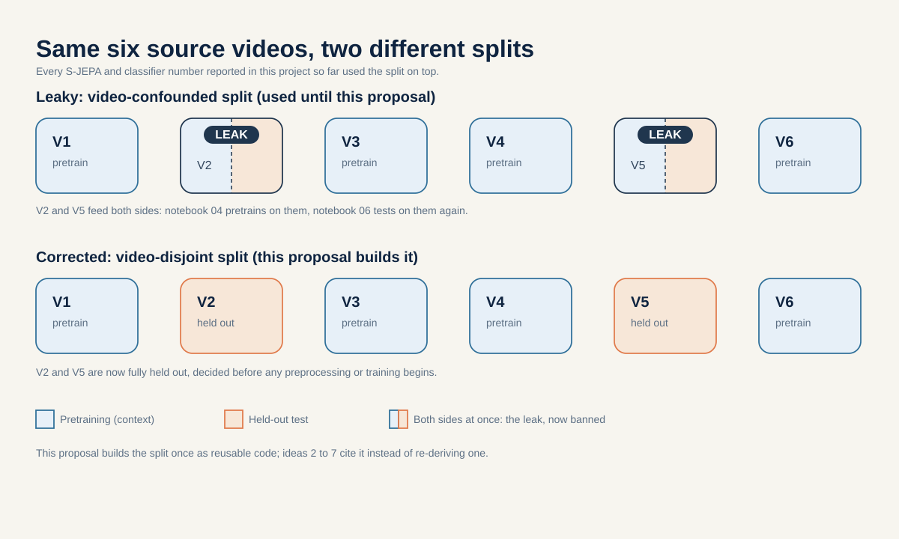
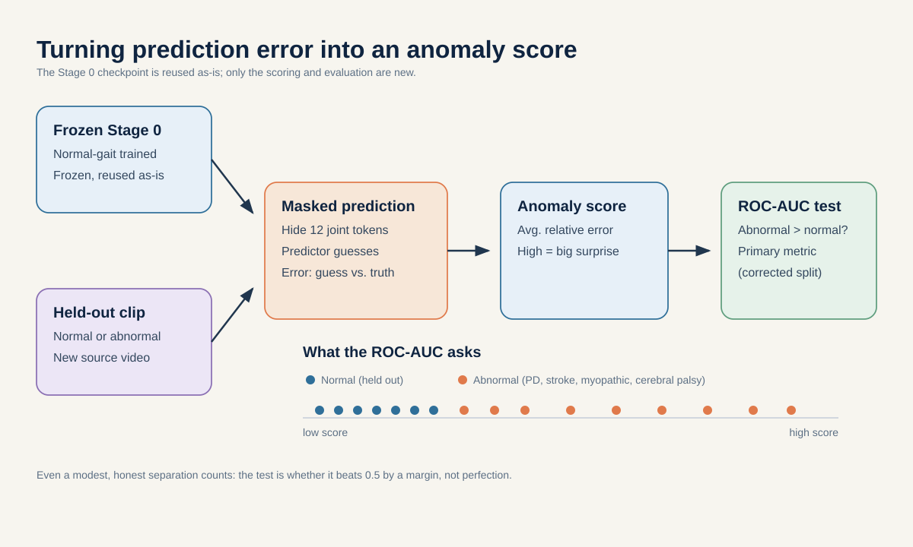
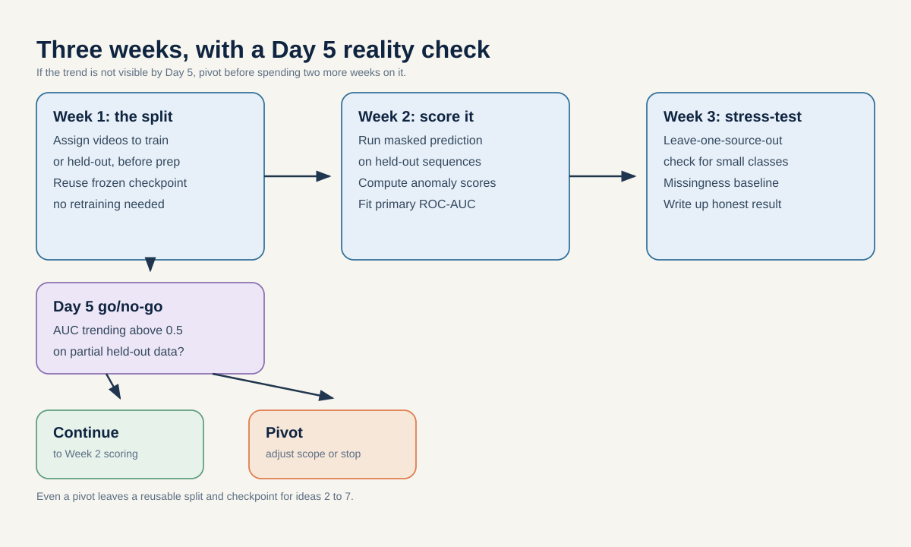
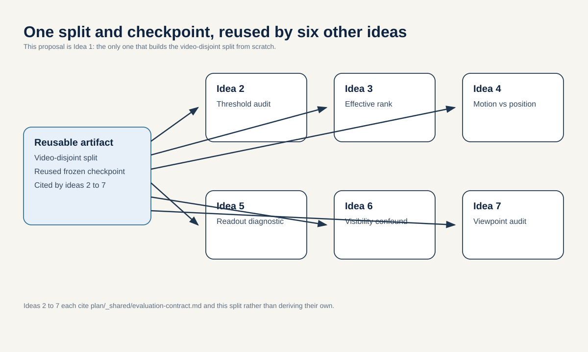

# Strict inductive evaluation and prediction-error screening

**Portfolio role:** required foundation, scientific rank 3  
**Three-week endpoint:** 5 September 2026  
**Estimated effort:** 12 to 16 researcher-days, one compact Stage 0 retrain per fold

## Research question

By 5 September 2026, after every source video is assigned before pose preprocessing or encoder training and all videos are processed through one extraction pathway, does a normal-only S-JEPA assign higher masked-prediction error to held-out abnormal-labeled source videos than to held-out normal source videos, with source-level ROC-AUC above 0.65 and higher than an untrained encoder, raw-kinematic distance, and missingness-only baseline?

This is a feasibility study of **surprise**, not a diagnostic study. A high score means that a clip differs from patterns learned from the available normal-labeled training sources. It does not mean danger, disease, or physical impossibility.

## The idea from first principles

An anomaly score needs a reference. Here, the reference is a model trained only on normal-labeled walking sources. During evaluation, selected joint-time tokens are hidden. The model predicts the target encoder's latent representation at those positions. The mismatch between prediction and target is the score.

The current project cannot answer whether this works on an unseen source. Its reported classifier splits happen after the encoder has already seen all evaluation rows. This proposal changes the order:

1. Split source videos.
2. Fit every learned preprocessing choice and the normal-only encoder on training sources.
3. Freeze the model and threshold.
4. Open held-out sources once.

## Why the question is worth asking

- The all-96 Random Forest reports 0.821 macro F1, but every test row trained the encoder and all 16 test videos overlap classifier training.
- The video-grouped binary readout reports 0.826 macro F1, but the frozen encoder still saw all 159 rows.
- Canonical normal gait has only one source video. The 17 added-normal sources are therefore necessary for a normal-only study, but they used a different annotation and extraction pathway from canonical abnormal videos.
- A result that survives fold-local training and provenance harmonization would be qualitatively different from the current in-corpus readouts.

## Related work

- Abdelfattah and Alahi, [S-JEPA](https://www.ecva.net/papers/eccv_2024/papers_ECCV/html/4755_ECCV_2024_paper.php), ECCV 2024, motivates latent prediction for skeletons.
- Assran et al., [I-JEPA](https://arxiv.org/abs/2301.08243), CVPR 2023, shows that mask and target design determine what the prediction task teaches.
- Kapoor and Narayanan, [Leakage and the Reproducibility Crisis in Machine-Learning-Based Science](https://arxiv.org/abs/2207.07048), explains why preprocessing and representation exposure must stay inside the outer split.
- Varoquaux, [Cross-validation failure: Small sample sizes lead to large error bars](https://pubmed.ncbi.nlm.nih.gov/28655633/), explains why 18 canonical source videos cannot support narrow confidence intervals.
- Ranjan et al., [GAVD](https://arxiv.org/abs/2407.04190), defines the source dataset and its condition annotations.

## Method

### 1. Build one auditable source table

Create one row per source video with condition label, canonical or added-normal provenance, raw-video identifier, extraction configuration, sequence count, and final outer-fold assignment. Save the exact file before any result is examined.

### 2. Harmonize the extraction pathway

Run the same pose detector version, frame selection, crop rule, confidence threshold, interpolation rule, centering, and scaling on every source used in the primary comparison. If raw videos or annotations cannot support one pathway by Day 3, the anomaly claim stops. The fallback deliverable is the strict split harness and an explicit proof that provenance cannot currently be separated from label.

### 3. Train inside each outer fold

Train Stage 0 only on normal-labeled training sources. Use normal validation sources for checkpoint selection and threshold setting. Abnormal-labeled sources never participate in representation training, hyperparameter selection, or stopping. The final test contains held-out normal and abnormal sources.

### 4. Score at the source level

Average clip scores within a source video before computing the primary endpoint. This prevents a long video cut into many clips from receiving extra statistical weight.

### 5. Compare simple baselines

- Untrained S-JEPA with the same architecture.
- Raw coordinate masked-reconstruction error.
- Distance from training-normal hand-crafted kinematics.
- Missingness-only distance using validity masks and no coordinates.
- Provenance-only classifier, which should be uninformative after harmonization.

## Decisive experiments

### E1. Transductive versus strict inductive gap

Reproduce one existing exposed result, then rerun with encoder training inside the source fold. Report the change. This demonstrates the size of the evaluation problem before proposing a solution.

### E2. Prediction-error screening

Compute source-level ROC-AUC and PR-AUC for held-out abnormal versus normal sources. Report every source score as a dot. A pooled curve without the source dots is not sufficient.

### E3. Shortcut falsification

Test whether score is predicted by neurologic landmark coverage, source duration, frame rate, or extraction provenance. If one nuisance explains the ranking, the screening result fails.

### E4. Mask sensitivity

Repeat the frozen evaluation with three pre-registered mask families: the current uniform 12-landmark mask, contiguous temporal blocks, and left-right paired masks. The conclusion must not depend on one favorable random mask.

## Evaluation contract

This study follows [`plan/_shared/evaluation-contract.md`](../_shared/evaluation-contract.md).

- **Primary unit:** source video.
- **Primary metric:** source-level ROC-AUC.
- **Practical margin:** ROC-AUC greater than 0.65 and at least 0.05 above every simple baseline on the same sources.
- **Secondary metrics:** source-level PR-AUC, score effect size, and per-source sensitivity.
- **Uncertainty:** enumerate feasible normal-source holdouts and use source-level permutation. Do not present seed spread as source uncertainty.
- **Screening and confirmation:** three seeds before the Day 14 gate, five fresh seeds only after the analysis is frozen.

The 0.65 margin is a decision threshold for this three-week project, not a claim that 0.65 is clinically useful.

## Three-week plan

### Week 1

- Days 1 to 2: freeze source manifest and audit raw-video availability.
- Day 3: verify one harmonized extraction pathway.
- Days 4 to 5: reproduce the exposed lane and run the first strict fold.
- Days 6 to 7: finish baseline implementations.

**Day 5 gate:** continue anomaly screening only if the primary cohort has at least three held-out normal sources across the planned folds, all primary videos use the same extraction path, and no held-out source trained the encoder.

### Week 2

- Run three screening seeds across the frozen source holdouts.
- Produce source-dot plots, ROC and PR curves, and nuisance correlations.
- Freeze the primary mask family and practical margin by Day 14.

### Week 3

- Run five confirmation seeds for the compact frozen comparison.
- Package the split manifest, extraction config, model config, hashes, and source-level table.
- Write the result with the phrase `prediction-error surprise` rather than `diagnosis` or `danger`.

## Adversarial review and kill criteria

**Fatal concern 1:** normal and abnormal videos still use different extraction paths.  
**Kill:** stop the screening claim and release only the evaluation and provenance audit.

**Fatal concern 2:** the encoder or checkpoint selection saw a test source.  
**Kill:** label that lane transductive and exclude it from the primary result.

**Fatal concern 3:** a nuisance baseline matches S-JEPA.  
**Kill:** conclude that prediction error is not specific to learned gait structure.

**Fatal concern 4:** the effect changes sign across normal-source holdouts.  
**Kill:** report instability. Do not average it into a clean claim.

**Useful null result:** strict evaluation removes the apparent separation while the exposed lane looks strong. That would directly demonstrate why encoder-side leakage matters in small grouped skeleton datasets.

## Deliverables

- Reusable source-video split manifest used by proposals 02 to 07.
- Fold-local preprocessing and encoder-training entry point.
- Transductive versus inductive comparison table.
- Source-level scores and nuisance controls.
- One short methods report with complete claim limits.

