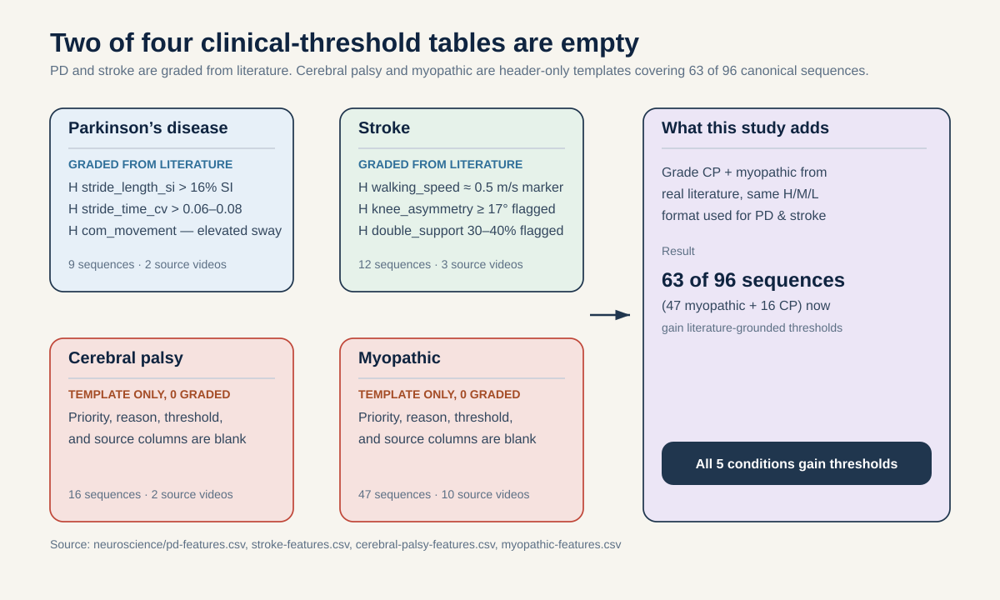

# Clinical-Threshold Calibration and Construct-Validity Audit of the S-JEPA Gait Probe

**Research question (falsifiable):** once the currently blank cerebral-palsy and myopathic clinical-threshold tables in `neuroscience/` are filled in from real, cited literature, do the gait scalars this project's frozen S-JEPA probe already outputs (`step_amplitude`, `asymmetry_index`, and any other scalar the probe decodes) shift in the direction that literature predicts for each of the five GAVD conditions, more often than the 50 percent rate that pure chance would produce?

**Est. effort:** 2 to 3 weeks. **Compute cost:** none. No model is retrained and no GPU is used. The entire cost is literature research plus a statistical comparison of numbers this project has already computed.

## Who this is for and what you will learn

This is written for a reader with no background in machine learning, statistics, or clinical gait analysis. Every technical term is defined the first time it is used. By the end you will be able to explain what "construct validity" means, why the two blank clinical-threshold tables in this project are a real and currently open problem, and exactly how a cheap, zero-risk literature-and-statistics study could close that gap.

## Part 1: The research question, in plain words

This project already trains a model (described in Part 2) and already turns its output into specific numbers with clinical names, like `step_amplitude` (how big a person's steps are) and `asymmetry_index` (how different the left and right sides of the body move). The project has never checked whether those specific numbers actually behave the way real gait medicine says they should. This proposal is that check, and nothing else.

## Part 2: Plain-language background, built up from scratch

### What the project already built (no changes proposed here)

The project trains a **Skeleton Joint-Embedding Predictive Architecture**, or **S-JEPA**, on walking videos. Here is what every word in that means, and how the pieces fit together, with no assumed prior knowledge.

A walking video is first converted into a **pose sequence**: for every frame, a pose-estimation tool called MediaPipe marks 33 points on the body (shoulders, hips, knees, ankles, and so on), called **joints** or **landmarks**. A 64-frame clip is cut into 16 chunks of 4 frames each, called **time-segments**. Pairing each of the 33 joints with each of the 16 time-segments gives 33 times 16 equals 528 **tokens**, where a token is one joint tracked over one 4-frame chunk.

The model has three working parts:

- A **view encoder** is shown only some of the 528 tokens (a masked, partial view of the clip) and turns what it sees into a compressed summary called an **embedding**, a list of numbers that stands in for the input.
- A **target encoder** is shown the complete, unmasked clip and produces its own embedding, meant to serve as an answer key. It is not a separately trained model. It is a slow-moving copy of the view encoder, updated after every training step by blending in a little of the view encoder's current weights, a technique called an **exponential moving average**, or **EMA**. Because it only drifts by this blend and is never adjusted directly by the training signal, it stays a stable, non-moving target for the view encoder to aim at.
- A **predictor** looks at the view encoder's partial embedding and tries to guess what the target encoder's embedding is at the positions the view encoder never saw.

Training pushes the predictor's guesses closer to the target encoder's real output. Left alone, this kind of setup can cheat by collapsing every input to the same constant output, since a constant guess against a constant answer key always looks perfect. **Representation collapse** is the name for this failure. **VICReg** (Variance-Invariance-Covariance Regularization) is a regularizer, an extra term added to the training signal, that penalizes exactly this kind of collapse by forcing the embeddings to stay spread out and non-redundant. Finally, after an initial stage trained only on normal (non-pathological) gait, the project adds a **label-aware group loss**: an extra pressure that pulls sequences from the same condition folder (Parkinson's, stroke, and so on) closer together in embedding space. None of this machinery is touched by this proposal.

### What the project already does with the trained model (also not changed here)

Once the model is trained, every sequence's 528 tokens are pooled down into a single 384-number vector per sequence, made of the mean and the standard deviation (a measure of spread, how much a set of numbers varies) of joint coordinates. This pooling step and its 384-number output are documented in `docs/staged_sjepa_gait.md`, section 4.2, where a 96-row by 384-column matrix is built from the canonical GAVD cohort's target-encoder output.

That same 384-number vector is fed into a **linear probe**: the simplest possible readout, a single straight-line (linear) fit from the 384 numbers to one target number, with no hidden layers and no nonlinear tricks. Each linear probe is trained to predict one clinically named scalar (a single number, as opposed to a whole vector) from the 384-number vector. Two of these decoded scalars have documented results: `step_amplitude` is recovered well, with an **R-squared** (**R2**) of 0.719, and `asymmetry_index` is recovered only weakly, with an R2 of 0.154. R2 is a number between 0 and 1 (occasionally negative) that says what fraction of the variation in the true value the probe's prediction explains; 0.719 means the probe explains about 72 percent of the variation in `step_amplitude`, while 0.154 means it explains only about 15 percent of the variation in `asymmetry_index`, barely better than always guessing the average.

**A note on completeness:** `notes/02_paper_draft.md` and `docs/staged_sjepa_gait.md` were checked directly for this proposal, and neither currently lists the full set of scalar names the linear-probe stage decodes beyond these two examples. That is treated honestly here as an open item, not glossed over: Week 1 of this study (see Part 6) starts by pulling the exact scalar list and their definitions from the probe code itself, before any literature-matching begins.

### What "construct validity" means, and why it is the right question here

**Construct validity** is a term from measurement science. It asks: does a measurement actually measure the real-world thing it claims to measure? A bathroom scale has construct validity for weight if heavier objects reliably read higher, even before you ask whether it is accurate to the gram. A model can be construct-valid without being an accurate diagnostic tool, and it can be construct-invalid even if it classifies conditions well, because it might be picking up an unrelated shortcut (for example, which pose-detector artifacts happen to correlate with a condition folder) rather than the real biomechanical signal.

The `step_amplitude` and `asymmetry_index` R2 numbers above measure something different: how well the probe predicts a hand-computed number **on average, across all sequences pooled together**. They do not say whether `step_amplitude` is smaller for Parkinson's sequences than for normal sequences the way seven decades of clinical gait research says it should be, or whether `asymmetry_index` is higher for stroke than for Parkinson's the way the literature also says it should be. That per-condition, direction-of-effect question is what this proposal answers, and it is a distinct question from R2, from classification accuracy, and from anything the project has evaluated so far.

## Part 3: Why this matters, grounded in specific project facts

Three concrete facts, all already true about this project today, motivate this study.

**Fact 1: two of the five clinical-threshold tables are empty.** The `neuroscience/` folder holds four CSV files that grade gait features by clinical priority (high, medium, low) with a documented significance threshold and a literature source for each graded row. `pd-features.csv` and `stroke-features.csv` are filled in: for example, an absolute symmetry index above 16 percent is flagged as clinically significant for Parkinson's, and a knee-flexion asymmetry of 17 degrees or more is flagged as significant for stroke. `cerebral-palsy-features.csv` and `myopathic-features.csv` are header-only templates: every priority, reason, threshold, and source cell is blank. These are not minor classes. In the canonical 96-sequence GAVD cohort, myopathic (47 sequences) and cerebral palsy (16 sequences) are the two largest non-normal groups, together 63 of the 96 canonical sequences, meaning that right now, a majority of the project's labeled non-normal data has zero literature-grounded threshold to check anything against.

**Fact 2: one decoded scalar is already known to be weak, and nobody has asked why in a clinically grounded way.** `asymmetry_index` has R2 of 0.154, far below `step_amplitude`'s 0.719. A weak R2 is consistent with several different explanations: the probe may be poorly calibrated, the underlying representation may not encode asymmetry well, or the hand-computed `asymmetry_index` target itself may be a noisy or clinically dubious quantity to begin with. None of these has been distinguished. A construct-validity check, does the decoded `asymmetry_index` at least move in the clinically expected direction for stroke and Parkinson's, gives a first, cheap piece of evidence on which explanation is more likely, before any more expensive investigation is justified.

**Fact 3: clinical relevance has never been checked against real literature thresholds.** Every accuracy or R2 number produced so far in this project describes how well a model fits or predicts numbers inside this dataset. None of them has been checked against an external, independent clinical yardstick, a documented threshold from a peer-reviewed source, for whether the model's outputs are plausible gait medicine. This is exactly the gap a construct-validity audit is built to close, and it is close to zero-risk because it requires no new model runs.

## Part 4: Related work

All citations below were checked against their DOI or PubMed record as part of this project's own citation-verification log (`notes/06_literature_findings.md`) before being used here. Where a caveat exists, it is stated rather than hidden.

**Clinical gait literature (the calibration targets for this study):**

- Zanardi, A. P. J., da Silva, E. S., Costa, R. R., Passos-Monteiro, E., dos Santos, I. O., Kruel, L. F. M., and Peyré-Tartaruga, L. A. "Gait parameters of Parkinson's disease compared with healthy controls: a systematic review and meta-analysis." *Scientific Reports*, vol. 11, article 752, 2021. DOI: 10.1038/s41598-020-80768-2. A meta-analysis of 72 studies and 3,027 participants (1,510 with Parkinson's disease, 1,517 controls), reporting reduced walking speed, stride length, swing time, and hip excursion, and increased cadence and double-support time in Parkinson's disease. This is the literature this study's Parkinson's-condition direction predictions are checked against.
- Lauzière, S., Betschart, M., Aissaoui, R., and Nadeau, S. "Understanding spatial and temporal gait asymmetries in individuals post stroke." *International Journal of Physical Medicine and Rehabilitation*, vol. 2, no. 3, article 201, 2014. DOI: 10.4172/2329-9096.1000201. **Caveat, stated explicitly:** the CrossRef bibliographic record for this DOI confirms only the lead author (Nadeau); the co-author byline (Lauzière, Betschart, Aissaoui) could not be independently verified from the available metadata. The identity of the work itself, title, journal, volume, and year, is confirmed.
- Pandey, R. A., Johari, A. N., and Shetty, T. "Crouch gait in cerebral palsy: current concepts review." *Indian Journal of Orthopaedics*, vol. 57, no. 12, pp. 1913 to 1926, 2023. DOI: 10.1007/s43465-023-01002-5. A clinical review of crouch gait (excessive knee and hip flexion during stance) in cerebral palsy. This is the primary literature anchor this study would use to fill the currently blank `cerebral-palsy-features.csv` table.
- Maulet, T., Bonnyaud, C., Weill, C., Laforêt, P., and Cattagni, T. "Motor function characteristics of adults with late-onset Pompe disease: a systematic scoping review." *Neurology*, vol. 100, no. 1, pp. e72 to e83, 2023. DOI: 10.1212/WNL.0000000000201333. Pompe disease is a form of myopathy (a disease of the muscle fibers themselves rather than the nervous system); the review documents symmetrical proximal (hip and trunk) weakness and gait alterations. This is the primary literature anchor for filling the currently blank `myopathic-features.csv` table.
- Hii, C. S. T., Gan, K. B., Zainal, N., Mohamed Ibrahim, N., Azmin, S., Mat Desa, S. H., van de Warrenburg, B., and You, H. W. "Automated gait analysis based on a marker-free pose estimation model." *Sensors*, vol. 23, no. 14, article 6489, 2023. DOI: 10.3390/s23146489. Validates a MediaPipe-based, marker-free (camera-only, no reflective markers on the body) pose pipeline against Vicon (a marker-based motion-capture system treated as the clinical gold standard), reporting good-to-excellent agreement (intraclass correlation coefficient above 0.75, and above 0.90 for most parameters) on temporal gait parameters. This paper is relevant to a different, earlier layer of construct validity than this study directly tests: it supports the premise that MediaPipe-derived pose is a reasonable measurement instrument for gait in the first place, which this study's own construct-validity check builds on top of, rather than re-verifies.

**The dataset:**

- Ranjan, R., Ahmedt-Aristizabal, D., Armin, M. A., and Kim, J. "Computer vision for clinical gait analysis: a gait abnormality video dataset." *IEEE Access*, vol. 13, pp. 45321 to 45339, 2025. DOI: 10.1109/ACCESS.2025.3545787. This is GAVD (Gait Abnormality in Video Dataset), the source of every sequence used by this project and by this proposal. **Caveat, already flagged in this project's citation log:** an alternate identifier, `arXiv:2309.01480`, is sometimes associated with GAVD in earlier drafts; it has been confirmed to resolve to a completely unrelated paper (a speech-quality backdoor-attack study) and must never be cited for GAVD. Only the IEEE Access DOI above is used here.

**Method background (already used and verified elsewhere in this project; cited here only to ground the plain-language explanation in Part 2, not as new evidence for this proposal):** Abdelfattah, M., and Alahi, A. "S-JEPA: a joint embedding predictive architecture for skeletal action recognition." *ECCV 2024*, pp. 367 to 384. DOI: 10.1007/978-3-031-73411-3_21. Bardes, A., Ponce, J., and LeCun, Y. "VICReg: variance-invariance-covariance regularization for self-supervised learning." *ICLR 2022*. DOI (arXiv): 10.48550/arXiv.2105.04906.

## Part 5: Method

This study has exactly two moving parts: filling in two literature tables, and running one statistical comparison. Nothing else changes.

### (a) Filling the two blank threshold tables

The existing `pd-features.csv` and `stroke-features.csv` tables set the format to match exactly: a `Priority (H/M/L/NA)` column, a `Feature:` name, a `Neurological Reason:` explaining the biomechanical mechanism, a `What is considered significant?` cell giving the numeric threshold, and a `Source:` URL or DOI, followed by a standardization block (features useful for normalization but not diagnosis) and a `NOT-RELEVANT FEATURES` block (features considered and explicitly excluded, with a one-line reason). The blank `cerebral-palsy-features.csv` and `myopathic-features.csv` files carry this exact header structure already, plus an explicit instruction row asking for the same format. This study fills in the Priority, Neurological Reason, What-is-significant, and Source cells for every feature row, reusing the same three-tier confidence rule already visible in how the PD and stroke tables were graded:

1. **High (H) priority:** a peer-reviewed source (ideally a systematic review or meta-analysis) reports a specific numeric threshold or cutoff directly tied to the condition, for example the existing PD table's "an absolute symmetry index above 16 percent" or the stroke table's "17 degrees or more of knee-flexion asymmetry."
2. **Medium (M) priority:** a peer-reviewed source describes a clear direction and mechanism (for example, "reduced walking speed") but does not give a precise numeric cutoff. Following the existing tables' own convention, a self-estimated threshold is recorded and explicitly labeled as an estimate rather than a literature-derived number, exactly as the existing PD table already does in several rows (for example, "this teaching module includes no specific metrics, so I would assume...").
3. **Low (L) priority or excluded (NA):** the mechanism is plausible but evidence is weak, indirect, only single-source, or the feature is judged unlikely to discriminate the condition from normal gait, following the same exclusion logic already documented in the `NOT-RELEVANT FEATURES` sections of the PD and stroke tables (for example, single-joint means that do not capture asymmetry, or variability measures confounded by normal aging).

This study does not start from zero. `notes/02_paper_draft.md` already contains a qualitative, project-authored rationale for a streamlined top-10 feature set for both cerebral palsy and myopathic gait (crouch gait's proximal-to-distal spasticity chain for CP; symmetric, bilateral proximal weakness with near-normal step-to-step variability for myopathic gait), written by this project's own team but never assigned numeric thresholds or individually cited sources. Week 1 of this study converts that existing qualitative reasoning into the same graded, sourced CSV format as the PD and stroke tables, anchored primarily on the Pandey et al. (2023) crouch-gait review for cerebral palsy and the Maulet et al. (2023) Pompe-disease review for myopathic gait, supplemented by additional literature search where those two reviews do not cover a specific feature.

### (b) Comparing decoded scalars against the filled tables

For every condition (Parkinson's, stroke, cerebral palsy, myopathic) and every high- or medium-priority graded feature that has a corresponding decoded scalar from the frozen S-JEPA probe (starting from `step_amplitude` and `asymmetry_index`, extended to the full decoded-scalar list once it is confirmed in Week 1), the comparison is:

1. **Pull the decoded scalar's per-sequence values** for that condition's canonical GAVD sequences and for the canonical normal sequences (12 sequences, 1 source video), using only the frozen probe's existing output. No probe or encoder weight changes.
2. **State the predicted direction in advance**, before looking at any decoded-scalar numbers, directly from the literature threshold's wording (for example, the Parkinson's table's `walking_speed_ms` row predicts decoded step-related scalars should be lower for Parkinson's than for normal; the stroke table's `stride_length_si` row predicts a higher decoded asymmetry-type scalar for stroke than for normal).
3. **Test the direction, not the magnitude**, with a one-sided Mann-Whitney U test (a statistical test that ranks all the values from both groups together and asks whether one group's values tend to rank higher than the other's, without assuming any particular distribution shape, which suits the very small sample sizes here). Report an effect size (Cliff's delta or rank-biserial correlation, both of which describe how consistently one group outranks the other on a scale from -1 to 1) with a percentile-bootstrap confidence interval (a range computed by resampling the data many times, which honestly widens as the sample size shrinks, rather than a single point estimate).
4. **Stratify by data provenance.** Per the shared evaluation contract (`plan/_shared/evaluation-contract.md`), canonical GAVD normal sequences (12 sequences, 1 source video) and the separately collected, project-annotated "added normal" sequences (63 sequences, 17 source videos) use different extraction and labeling pipelines. The primary comparison in this study always uses canonical-normal only; the added-normal pool is used only as a secondary sensitivity check, never mixed into the primary test, so that a provenance artifact cannot masquerade as a clinical finding.
5. **Run a leave-one-source-out sensitivity check** for every condition with fewer than 4 source videos, which in the canonical cohort means Parkinson's (2 videos) and cerebral palsy (2 videos), per the shared evaluation contract. With exactly 2 videos this means recomputing the test once per single-video exclusion and reporting both results, so a single unusual video cannot silently drive the whole verdict.
6. **Correct for multiple comparisons** across the full grid of conditions times features using the Benjamini-Hochberg false discovery rate procedure (a standard correction that controls the expected proportion of false positives when many tests are run at once), rather than reading any single uncorrected p-value as a finding on its own.

This study follows the shared evaluation contract in `plan/_shared/evaluation-contract.md`: source-video-disjoint reasoning is not applicable in the same way here (nothing is trained or split for training), but the contract's claim-hygiene rules apply directly, most importantly that a folder condition label such as "stroke" is a dataset annotation carried over from GAVD, not a clinical diagnosis produced by this project, and every result in this study is worded accordingly.

## Part 6: Three-week plan

**Week 1: confirm the scalar list, then grade the tables.**
- Pull the exact list and definitions of every scalar the frozen linear-probe stage decodes, beyond the two documented examples, directly from the probe code, so Week 2's comparison has a complete target list instead of just two scalars.
- Research and grade `cerebral-palsy-features.csv` and `myopathic-features.csv` in the same H/M/L/NA format as the existing PD and stroke tables, anchored on the Pandey et al. and Maulet et al. reviews plus supplementary search.
- **Day 5 checkpoint (a literature-sufficiency gate, not a model go/no-go, since nothing is trained here):** by day 5, at least a handful of features per condition should be gradable at H or M priority with a real, cited numeric or directional threshold. If published literature on cerebral palsy or myopathic gait thresholds turns out too sparse or too inconsistent to grade even a small set of features with reasonable confidence, that is the signal to stop the CP and myopathic extension early and scope the study down to the already-graded Parkinson's and stroke conditions, reporting the literature gap itself as a finding rather than forcing a low-confidence grading.

**Week 2: run the direction-of-effect comparison.**
- Extract per-sequence decoded-scalar values from the existing frozen probe output for all five conditions, stratified by source video and by data provenance (canonical versus added-normal).
- Pre-register the predicted direction for every condition-feature pair from the literature threshold's own wording, before looking at the decoded-scalar numbers.
- Run the one-sided Mann-Whitney tests, effect sizes, and bootstrap confidence intervals described in Part 5(b).

**Week 3: correct, sensitivity-check, and write up honestly.**
- Apply the Benjamini-Hochberg correction across the full condition-by-feature grid.
- Run the leave-one-source-out sensitivity check for Parkinson's and cerebral palsy.
- Tally the primary criterion (Part 7), report every result including the ones that do not match the literature-predicted direction, and state plainly what a construct-validity result of this kind does and does not establish (it says nothing about whether the model can classify conditions, and it does not turn a folder label into a diagnosis).

## Part 7: Evaluation criteria

**Pre-registered primary criterion:** across every high-priority graded feature with a matching decoded scalar, across all four non-normal conditions once cerebral palsy and myopathic are graded, count the fraction that shows the literature-predicted direction (a Mann-Whitney effect in the predicted sign, whether or not it individually clears the corrected significance threshold). Test that observed fraction against the 50 percent rate expected by pure chance using an exact one-sided binomial (sign) test, a test that asks whether a count of successes is higher than chance alone would produce. This fraction and its binomial test result are decided and written down before any decoded-scalar values are examined, so the criterion cannot be quietly swapped for a friendlier one after seeing the results.

**Honesty about sample size, stated plainly:** every per-condition number in this study rests on a small cohort. In the canonical GAVD cohort, cerebral palsy has 16 sequences from only 2 source videos, Parkinson's disease has 9 sequences from only 2 source videos, stroke has 12 sequences from 3 source videos, and myopathic gait has 47 sequences from 10 source videos. A single unusual video can dominate a 2-video class. This is exactly why the plan requires reporting an effect size with a bootstrap confidence interval instead of a bare p-value, and why the leave-one-source-out sensitivity check on Parkinson's and cerebral palsy is not optional. A result that only holds under one particular choice of held-out video is reported as such, not smoothed over.

**What counts as a positive result:** a primary binomial test that clears its pre-registered significance threshold (for example, p less than 0.05, one-sided), together with effect sizes whose confidence intervals mostly sit on the predicted side of zero, and a leave-one-source-out check that does not flip the sign for Parkinson's or cerebral palsy. Given `asymmetry_index`'s already-weak R2 of 0.154, a plausible and still useful outcome is a split result, for example `step_amplitude` matching literature direction consistently while `asymmetry_index` does not, which would itself be informative evidence about where the frozen representation is and is not clinically grounded.

## Part 8: Risks and kill criteria

- **The literature on cerebral palsy or myopathic gait is too sparse or inconsistent to grade confidently.** This is the Week 1 Day 5 checkpoint's job to catch. If it happens, the honest response is to report that specific gap as a finding (these two conditions remain clinically ungrounded in this project, and here is why) and scope the direction-of-effect comparison down to Parkinson's and stroke only, rather than force low-confidence grades into the table.
- **Decoded scalars show no consistent directional relationship to any threshold, in any condition.** This would be a genuine, informative negative result, not a failed study. It would say the frozen S-JEPA probe's outputs, whatever their R2 against hand-computed targets, do not track real clinical gait mechanisms in a way a clinician could sanity-check, which is directly relevant given `asymmetry_index`'s already-weak R2.
- **Provenance confound.** Canonical normal (12 sequences, 1 source video, GAVD-extracted) and added normal (63 sequences, 17 source videos, project-collected and self-annotated, not independently clinically reviewed) use different pipelines. If a condition's apparent "direction of effect" only appears when added-normal is folded into the comparison, and disappears against canonical-normal alone, that result is a provenance artifact, not a clinical finding, and must be reported as such rather than as support for the primary criterion.
- **Multiple-comparison inflation.** With up to 4 conditions times several graded features each, some individually significant results are expected by chance alone. The Benjamini-Hochberg correction in Part 5(b) is not optional; a result that only survives before correction is reported as not surviving.
- **Folder labels are not diagnoses.** Per the shared evaluation contract's claim-hygiene rule, a GAVD folder label such as "stroke" is a dataset annotation, not an independent clinical diagnosis produced by this project. Every claim in this study is worded as "the decoded scalar for sequences labeled X moved in the direction the literature predicts for X," never as "the model detected condition X."

## Part 9: How this differs from the other proposals in this portfolio

**Compared to the ignored seven-framing memo (not read for this proposal; only its topic names were provided):** none of the seven directions, readout-operator mismatch, context-capacity frontiers, selective symmetry, constraint-violation benchmarks, phase hierarchies, concept-residual benchmarks, and paired transformation operators, is a post-hoc calibration check of already-decoded scalar outputs against real, cited clinical literature thresholds. Readout-operator mismatch and context-capacity frontiers are about checkpoint and representation-capacity questions; selective symmetry and paired transformation operators are about architecture-level equivariance properties; constraint-violation benchmarks are about building new benchmarks of physically invalid motion, a different validity question (physical plausibility, not clinical plausibility) that requires constructing new synthetic data rather than comparing existing outputs to literature; phase hierarchies is about learning new multi-timescale representations; concept-residual benchmarks is closest in spirit but is about probing what latent structure remains after concepts are algebraically removed, a representation-geometry question, not a check against a graded, sourced clinical threshold table. None of the seven require or produce a literature-grounded threshold table, and none of them close the specific, named, currently open gap of the two blank `neuroscience/` CSV files. This proposal's entire cost is literature research plus one statistical test on numbers the project has already computed; it is the only proposal in the portfolio with zero GPU time and zero retraining risk by construction.

**Compared to the neuro-concept-jepa idea packet** (`/Users/theodoremui/dev/worldmodels/gait/neuro-concept-jepa/README.md`, used here only as a style and tone reference, not as a source of method): that proposal is a new architecture. It carves the S-JEPA latent embedding into three named subspaces (asymmetry, rhythm, posture), adds three auxiliary training heads that read only their own slice, and requires an actual self-supervised pretraining run (its own Stage A) plus a `lambda_aux` sweep, in order to test whether a five-class linear probe on the new subspaces can match a 76 percent Random Forest baseline. This proposal does the opposite. It does not touch the encoder, predictor, VICReg term, group loss, or masking rule in any way, no gradient flows anywhere in this study, and it builds no new latent subspace and no auxiliary head. It takes the scalars the existing frozen probe already outputs from the existing 384-dimensional pooled embedding and checks them against literature, after the fact. It also directly closes a gap that proposal does not address: neuro-concept-jepa cites only the already-graded PD and stroke tables as its neuroscience grounding and never proposes filling the blank cerebral-palsy or myopathic tables, whereas that is this proposal's first deliverable.
