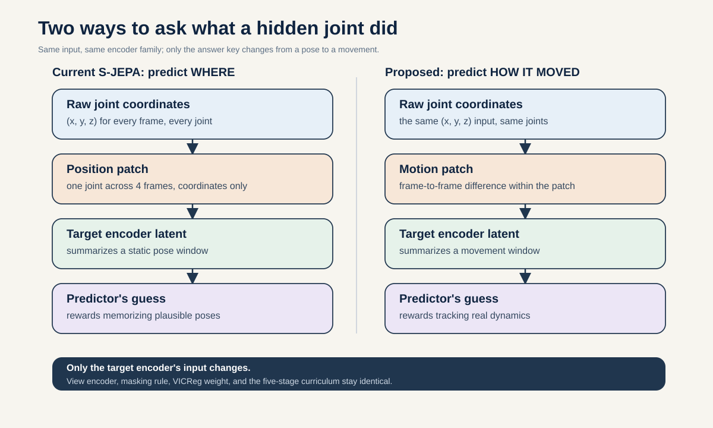
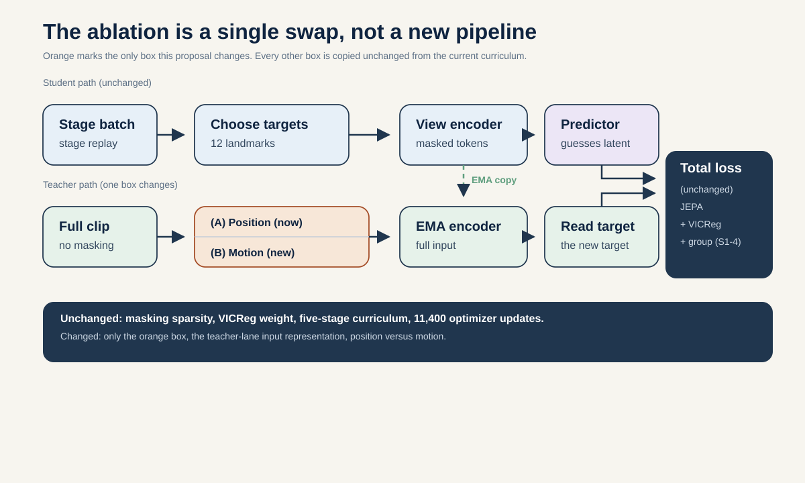
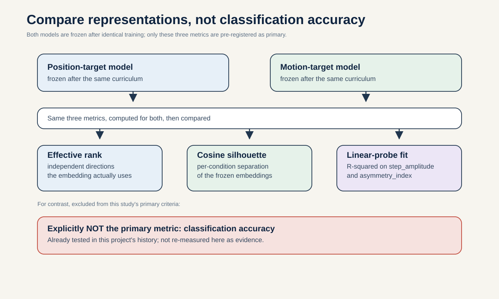

# What should S-JEPA predict: latent pose or latent change?

**Portfolio role:** best method backup, rank 2  
**Three-week endpoint:** 5 September 2026  
**Estimated effort:** 13 to 17 researcher-days, eight compact controlled training runs after screening

## Research question

By 5 September 2026, under fold-local source-video evaluation and equal training compute, does replacing the current masked latent-position target with a standardized latent temporal-difference target reduce held-out-source error on three pre-registered time-order gait targets by at least 10 percent, while preserving representation effective rank and not increasing extraction-provenance decodability?

This is a target-semantics ablation. It does not ask whether a larger model improves classification.

## First-principles idea

The current model sees a partial clip and predicts the target encoder's latent token at each hidden joint-time location. That target describes the full-clip representation at a time position. A model can perform well by learning common body configurations even if the intended downstream question concerns change.

Motion is a difference across time. For target token \(z_t\) and elapsed time \(\Delta t\), define

\[
v_t = \frac{z_{t+1} - z_{t-1}}{2\Delta t}.
\]

The primary intervention keeps the raw pose input, target encoder, mask locations, predictor width, and loss family fixed. It changes only the operator applied to the target encoder's latent sequence before masked targets are gathered.

## Why the notebooks motivate this

- Every clip is resized to 64 frames, even though source videos span roughly 15 to 30 frames per second. Four frames therefore do not represent one fixed duration.
- The mask sampler never reads displacement, velocity, acceleration, or a learned motion score.
- The current readout has weak five-condition geometry: saved augmented cosine silhouette 0.009 and locally recomputed canonical silhouette -0.130.
- Current classifier scores are exposed and cannot determine whether the representation learned motion or source-specific pose patterns.

The proposal restores elapsed-time metadata for target construction. It does not claim to recover metric walking speed from uncalibrated monocular coordinates.

## Related work

- Abdelfattah and Alahi, [S-JEPA](https://www.ecva.net/papers/eccv_2024/papers_ECCV/html/4755_ECCV_2024_paper.php), predicts masked skeleton latents and motivates the base architecture.
- Bardes et al., [Revisiting Feature Prediction for Learning Visual Representations from Video](https://arxiv.org/abs/2404.08471), shows that feature-prediction targets must be judged on motion-sensitive tasks.
- Zhu et al., [MotionBERT](https://motionbert.github.io/), ICCV 2023, uses corrupted human motion and transfer tasks to learn motion representations.
- Assran et al., [I-JEPA](https://arxiv.org/abs/2301.08243), shows that target scale and context are first-order design choices.
- He et al., [Masked Autoencoders Are Scalable Vision Learners](https://openaccess.thecvf.com/content/CVPR2022/html/He_Masked_Autoencoders_Are_Scalable_Vision_Learners_CVPR_2022_paper.html), motivates equal mask budgets and compute in target ablations.

## Controlled target families

All lanes start from the same full target-encoder latent tensor \(z\), generated from the same pose input.

| Lane | Masked prediction target | Purpose |
|---|---|---|
| P | Standardized \(z_t\) | Current latent-position baseline |
| M | Standardized central difference \((z_{t+1}-z_{t-1})/(2\Delta t)\) | Primary motion target |
| PM | Fixed equal-energy mixture of standardized position and motion | Tests complementarity without increasing width |
| SM | Motion targets shuffled across training sequences within a batch | Detects whether target scale alone explains an effect |

Standardization statistics are fitted on training sources only. The PM mixture remains the same target dimension as P and M. Endpoint handling uses one-sided differences and is frozen before screening.

## What stays fixed

- Source-video outer folds and train/validation/test membership.
- Input pose tensor and validity mask.
- View and target encoder architecture and parameter count.
- Predictor architecture and output width.
- Target positions and realized mask count.
- Batch composition, optimizer, learning-rate schedule, steps, EMA schedule, and random seeds.
- Total JEPA, VICReg, and group-loss weights.

The label-aware group term is reported as such. A smaller Stage-0-only comparison is included to separate target semantics from supervised group shaping.

## Decisive experiments

### E1. Target-scale and difficulty audit

Before training, compare per-dimension variance, entropy proxy, autocorrelation, and missing-value support for P, M, PM, and SM. Adjust training-fold standardization until P and M have matched average scale. If they remain grossly different in noise or support, the ablation is not interpretable.

### E2. Same-compute target comparison

Train P, M, and PM for three screening seeds. Evaluate the time-order targets defined in proposal 05 with its fixed 384-dimensional order-aware readout and with the current mean/std readout. The target effect must not depend on one friendly readout.

### E3. Temporal perturbation mechanism

Evaluate original, temporally reversed, segment-shuffled, and locally jittered held-out clips. A motion-target model should change more under order destruction than under small coordinate noise, while the shuffled-motion control should not.

### E4. Representation health

At every saved checkpoint, report feature standard deviation, covariance off-diagonal magnitude, effective rank, participation ratio, and nearest-neighbor source concentration. A lower downstream error caused by collapse or source memorization is not a win.

### E5. Nuisance and simple baselines

Compare raw velocity features, a small GRU on normalized poses, untrained S-JEPA, and provenance-only and missingness-only probes. Every model uses the same outer sources and inner tuning boundary.

## Evaluation contract

This study follows [`plan/_shared/evaluation-contract.md`](../_shared/evaluation-contract.md).

- **Primary endpoint:** macro-average normalized MAE across proposal 05's three fixed time-order targets on held-out source videos.
- **Success margin:** at least 10 percent lower error for M or PM than P, with the same sign on at least 75 percent of held-out sources.
- **Health gate:** effective rank must remain within 10 percent of P's source-normalized value and nuisance balanced accuracy must not rise by more than 0.02.
- **Secondary endpoints:** source-level condition macro F1, prediction error, temporal-perturbation effect, and normal-anchor retention.
- **Uncertainty:** paired source-level effects and complete holdout sensitivity, not seed intervals alone.

## Three-week plan

### Week 1

- Restore timestamp metadata from source FPS and frame spans.
- Implement target operators and endpoint validity handling.
- Confirm identical mask indices, parameter counts, and step budgets.
- Run the target-scale and shuffled-motion sanity checks.

**Day 5 gate:** continue only if P and M can be scale-matched, timestamps are available for the primary sources, and one smoke run produces finite gradients without target collapse.

### Week 2

- Train P, M, and PM for three screening seeds on the frozen folds.
- Run temporal perturbations and representation-health diagnostics.
- Freeze the best target family by Day 14.

**Day 14 gate:** confirm only if the best motion-aware lane crosses the 10 percent practical margin or produces a stable, mechanistically clear negative result.

### Week 3

- Run five fresh seeds for P and the frozen best motion-aware lane.
- Complete raw-velocity, GRU, untrained, missingness, and provenance baselines.
- Package configs, target statistics, histories, hashes, and source-level results.

## Adversarial review and kill criteria

**Concern:** M wins because differentiation changes scale or makes the task easier.  
**Kill:** the effect must beat SM and survive training-fold scale matching.

**Concern:** M loses because differentiation amplifies MediaPipe noise.  
**Interpretation:** report the noise sensitivity. PM may be the appropriate target if it crosses the frozen gate; do not retune a family of filters after seeing test data.

**Concern:** restored timestamps create a second intervention.  
**Control:** use the same \(\Delta t\) metadata in all lanes and include a constant-time M variant in screening.

**Concern:** a condition score rises while temporal targets do not.  
**Kill:** the main claim is about motion information, so classification alone cannot pass the study.

## Expected contribution

The contribution is a controlled answer to what a gait JEPA should predict. A positive result would show that masked latent-change targets recover useful temporal structure under honest source splits. A negative result would show that motion-target intuition fails once target scale, noise, readout, and provenance are controlled.
