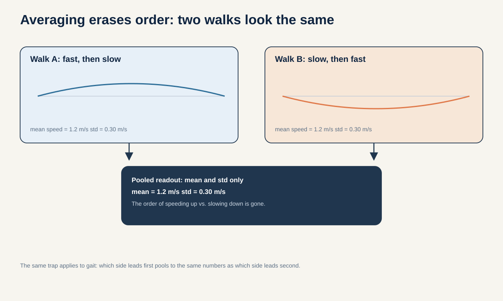
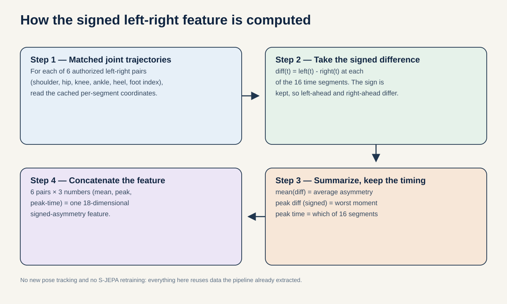
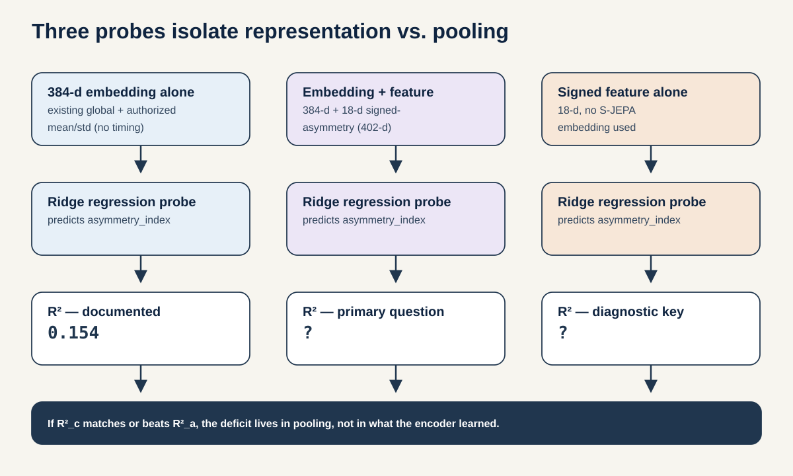

# Does the encoder forget time, or does the readout throw time away?

**Portfolio role:** primary scientific direction, rank 1  
**Three-week endpoint:** 5 September 2026  
**Estimated effort:** 9 to 13 researcher-days, mostly CPU after fold-local token extraction

## Research question

By 5 September 2026, on source-video-disjoint outer folds, does a fixed 384-dimensional order-aware moment readout from the same frozen S-JEPA token tensor reduce normalized mean absolute error on three pre-registered time-order gait targets by at least 10 percent relative to the current 384-dimensional mean/std readout, without increasing extraction-provenance or source-video decodability?

The three targets are defined before training:

1. normalized segment of peak left-right ankle separation;
2. signed left-right ankle phase lag in normalized clip time;
3. early-versus-late lower-limb motion-energy difference.

These are representation diagnostics derived from the cached skeleton sequence. They are not diagnoses or validated clinical biomarkers.

## First-principles argument

The encoder emits a token for each joint and time segment. The current downstream representation then takes means and standard deviations across tokens. If the encoded token tensor is permuted after encoding, those two statistics are unchanged. The readout therefore cannot know which token came first from array order alone.

The proposed comparison does not retrain the encoder and does not increase feature width. It replaces the standard-deviation half of the pooled vector with a signed first temporal moment:

\[
m_1 = \frac{1}{N}\sum_{i=1}^{N} \tau_i z_i,
\]

where \(z_i\) is a frozen token and \(\tau_i\) is its centered time coordinate from -1 to 1. A token that appears early receives a negative weight; the same token appearing late receives a positive weight. Means plus signed moments are 384-dimensional, exactly matching the current global-plus-selected mean/std width.

## Why this is the best three-week bet

- It tests an exact property of the deployed readout, not a guessed failure mode.
- It reuses the same frozen tokens for both lanes. Encoder quality, masks, and training compute cannot explain the difference.
- The proposed feature has the same width as the existing feature and no trainable pooling parameters.
- A null is useful. If the order-aware readout also fails, the missing information is more likely absent from the token tensor, which directly motivates proposal 04's motion-target retrain.
- The result generalizes as an evaluation lesson: representation quality depends on the response operator used to read a representation.

## Related work

- Abdelfattah and Alahi, [S-JEPA](https://www.ecva.net/papers/eccv_2024/papers_ECCV/html/4755_ECCV_2024_paper.php), evaluates skeleton feature prediction and supplies the architecture family.
- Dubois et al., [Learning Optimal Representations with the Decodable Information Bottleneck](https://arxiv.org/abs/2009.12789), formalizes that useful information depends on the downstream decoder family.
- Elazar et al., [Measuring Causal Effects of Data Statistics on Language Model's Behavior](https://arxiv.org/abs/2109.09234), motivates conditional and controlled probing rather than reading a probe score as a property of the representation alone.
- Garrido et al., [RankMe](https://arxiv.org/abs/2210.02885), shows that unsupervised representation diagnostics can assist model selection, while also motivating checks that align diagnostics with downstream use.
- Bardes et al., [Revisiting Feature Prediction for Learning Visual Representations from Video](https://arxiv.org/abs/2404.08471), demonstrates that video feature prediction must be evaluated on motion-sensitive as well as appearance-sensitive tasks.

## Method

### 1. Use one strict token lineage

Run proposal 01's fold-local encoder training and save frozen target-encoder tokens only for the corresponding held-out sources. The current exposed checkpoint can appear as a labeled transductive reference, not the primary result. Every token file records source, checkpoint hash, fold, seed, and encoder exposure.

### 2. Compare four readouts from the same tensor

| Lane | Feature | Width | Trainable pooling parameters | Purpose |
|---|---|---:|---:|---|
| A | Current global and selected mean/std | 384 | 0 | Order-invariant project baseline |
| B | Global and selected mean/signed-time-moment | 384 | 0 | Primary order-aware comparison |
| C | Mean/std plus signed moments, projected to 384 inside training folds | 384 | Projection only | Checks whether variance and order are complementary |
| D | Hand-crafted coordinate timing features | fixed before evaluation | 0 | Non-neural baseline |

Every downstream probe uses ridge regression with its penalty chosen inside training sources only. Classification is secondary and uses the same regularized linear family.

### 3. Define targets without test leakage

Derive the three normalized-time targets using one frozen, deterministic function from cached coordinates and validity masks. Do not tune target definitions after seeing readout performance. Report target reliability under small coordinate noise and short-gap removal.

### 4. Test nuisance retention

Fit the same linear probe to predict extraction provenance and source-video identity. An order-aware readout that improves the gait target only by encoding source or crop artifacts fails the intended claim.

## Decisive experiments

### E1. Algebraic permutation sanity check

Permute the time axis of an already encoded token tensor. Lane A must be numerically identical up to floating-point tolerance. Lane B must change when the permutation changes temporal position. This unit test proves that the comparison manipulates the intended information.

### E2. Same-token target recovery

Compare held-out-source normalized MAE and R-squared on all three pre-registered targets. Report one row per source before any pooled result.

### E3. Capacity control

Repeat with Lane C and with a small temporal convolution whose total trainable parameter count is matched to the Lane A probe within 5 percent. If only the much larger model wins, the readout claim fails.

### E4. Nuisance and missingness controls

Predict provenance, source identity, and mean landmark coverage. Improvement on the main endpoint must not be accompanied by a larger improvement on nuisance endpoints.

### E5. Encoder versus readout diagnosis

Use the result to select the next action:

- Lane B beats A: useful order information exists in tokens and pooling was the bottleneck.
- B matches A, hand-crafted timing works: the encoder likely failed to encode the target information.
- B and hand-crafted features both fail: the target or pose measurement is unreliable.

## Evaluation contract

This study follows [`plan/_shared/evaluation-contract.md`](../_shared/evaluation-contract.md).

- **Primary endpoint:** mean normalized MAE across the three pre-registered targets, macro-averaged over held-out source videos.
- **Success margin:** Lane B reduces the primary endpoint by at least 10 percent relative to Lane A, the sign is consistent on at least 75 percent of held-out sources, and nuisance decodability does not increase by more than 0.02 balanced accuracy.
- **Secondary endpoints:** per-target MAE, R-squared, source-level effect, and condition macro F1.
- **Statistics:** paired differences by source video. Show all source effects. Use a source-level permutation test only when the number of sources makes it meaningful.
- **Seeds:** three for screening, five fresh confirmation seeds after all targets and penalties are frozen.

The margins are project continuation rules, not universal clinical thresholds.

## Three-week plan

### Week 1

- Implement and unit-test all four pooling lanes.
- Freeze target functions and measure their perturbation reliability.
- Extract one strict fold's token tensors using proposal 01 infrastructure.
- Reproduce numerical identity of Lane A under post-encoding time permutation.

**Day 5 gate:** continue only if target reliability is acceptable, the current feature is reproduced exactly, all lanes have auditable dimensions, and no held-out source trained the primary encoder.

### Week 2

- Run three screening seeds across all source holdouts.
- Complete the same-token and nuisance comparisons.
- Freeze one capacity-matched temporal head only if the fixed moment result needs a nonlinear check.

**Day 14 gate:** continue confirmation only if Lane B crosses the 10 percent margin or the failure pattern clearly distinguishes readout, encoder, and target explanations.

### Week 3

- Run five fresh confirmation seeds for the frozen compact comparison.
- Produce per-source paired plots and the three-way diagnosis table.
- Package pooling functions, split manifest, target definitions, and seed-level results.

## Adversarial review and kill criteria

**Concern:** position information may already be encoded inside each token, so mean pooling is not guaranteed to erase all timing content.  
**Response:** that is why the proposal asks an empirical same-token question and does not claim complete mathematical information loss.

**Concern:** the order-aware feature wins only because its target was designed to match it.  
**Kill:** require improvement on all three independently defined targets and include the hand-crafted coordinate baseline.

**Concern:** temporal targets are unreliable after 64-frame resizing.  
**Kill:** targets use normalized time only. Any claim about seconds, cadence, or walking speed is excluded unless timestamps are restored.

**Concern:** source identity explains the result.  
**Kill:** if nuisance decodability rises beyond the pre-registered tolerance, reject the representation-quality interpretation.

## Expected contribution

The publishable result is not that one pooling formula gains a few points. It is a controlled demonstration that the conclusion about a learned representation changes with a legal, matched readout, plus a diagnostic that determines whether a null originates in the encoder, the pooling operator, or the target measurement.
