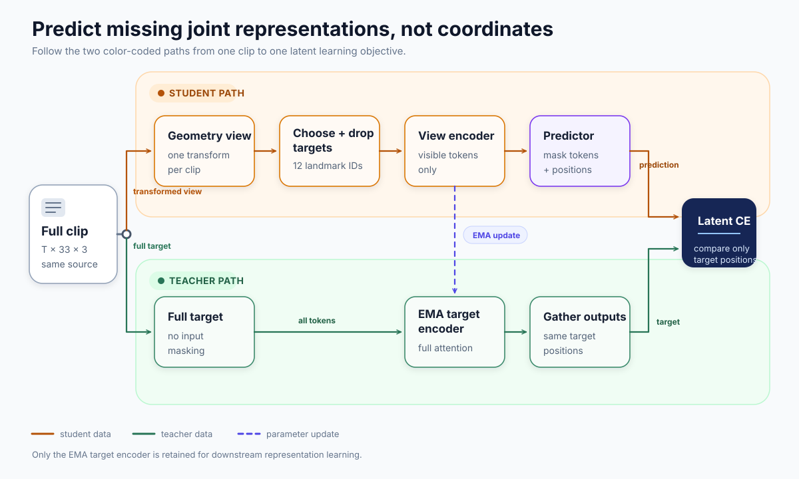
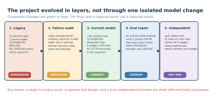
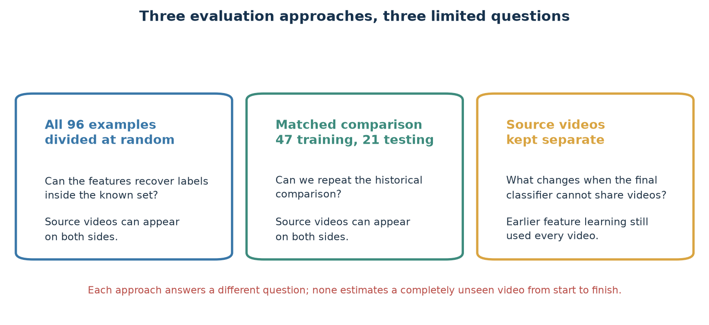
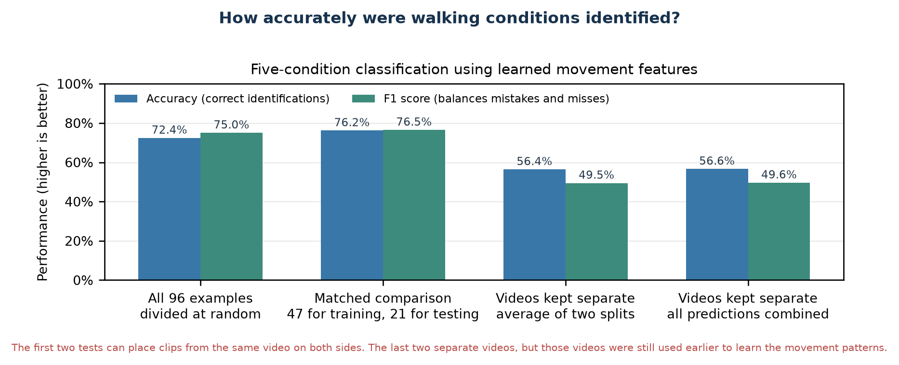
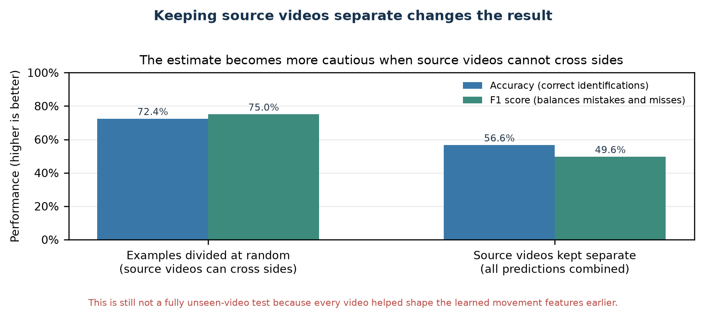
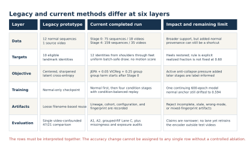
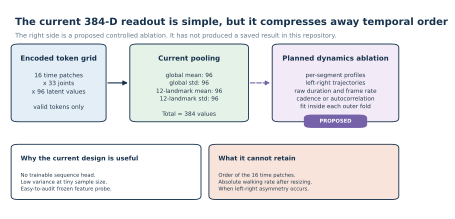
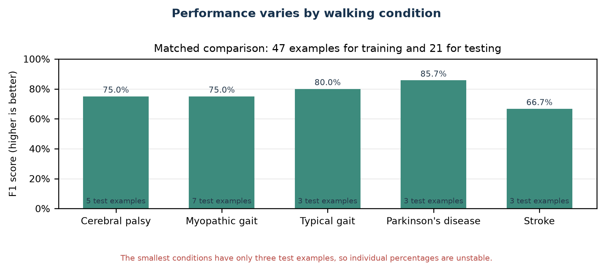
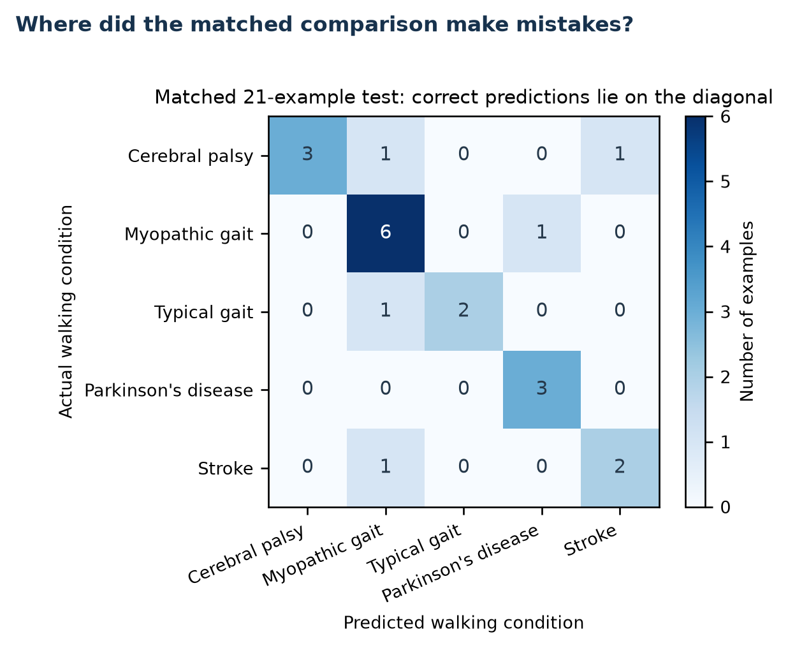
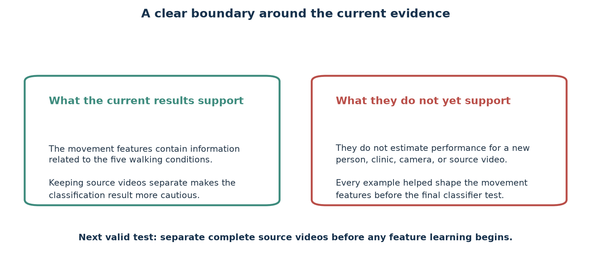

# The goal is feature learning, not diagnosis

::: columns
::: {.column width="38%"}

- A 64-frame skeleton becomes **528 joint-time tokens**.
- The student sees visible tokens.
- A slow teacher sees the complete sequence.
- A predictor estimates teacher features at hidden locations.
- The research question is whether the learned vector retains useful gait structure.

**Scope:** exploratory representation research. Folder labels are not diagnoses verified by this project.

:::
::: {.column width="62%"}

{width=100%}

:::
:::

::: notes
Start with the learning task. Each sequence has 64 normalized frames, 33 MediaPipe landmark identities, and three coordinate values. Four frames for one joint form one token. This creates 16 time patches times 33 joints, or 528 possible tokens. The student encoder receives only the visible tokens. The predictor fills the selected hidden positions in feature space. The target encoder sees the full sequence and changes slowly through an exponential moving average, or EMA. It supplies a stable feature target and does not receive a gradient. This is latent prediction, not video generation and not a clinical diagnosis. The project uses GAVD folder names as dataset labels. The added normal clips were not independently clinically reviewed. Sources: references 1 through 4.
:::

# The project improved in three different ways

{width=96%}

::: notes
Read this timeline from left to right. The legacy system was a useful prototype, but its normal training data came from one video. The failure audit then exposed source-video overlap, detector missingness, lost temporal order, and the absence of an independent outer test. The current model broadens the normal data, expands the target whitelist, adds two loss jobs, and continues through five stages. The latest Lane C change repaired the classifier fold definition without changing the encoder. The final card is different: it describes the experiment still needed for an unseen-video estimate. A model improvement, an evaluation improvement, and a reporting improvement are all valuable. They do not support the same claim.
:::

# The first prototype exposed four limits

|Audit finding|Concrete evidence|Response and remaining limit|
|---|---|---|
|One normal source|12 windows from 1 video|Add 63 accepted windows from 17 videos, while keeping their provenance separate|
|Rows were split, not videos|All 16 A1 test videos also occur in classifier training|Add grouped Random Forest audits; the encoder still saw every row|
|Detector missingness carried labels|Visibility-only A1 accuracy was 0.448|Keep a missingness control beside the learned readout|
|Mean and standard deviation remove order|The readout compresses all time patches into 384 values|Document the limit; temporal pooling remains a proposed ablation|

::: notes
The prototype did its job because it made the hidden assumptions measurable. First, twelve windows from one source video are correlated observations, not twelve independent people or camera settings. Second, a row-level split can put different windows from one video on both sides. In A1, every one of the 16 test videos also appears in classifier training. Third, a 97-value visibility-only control reached 0.448 accuracy on A1. That means pose success and failure are related to the labels and form a meaningful shortcut floor. Fourth, the downstream vector uses means and standard deviations, so it cannot tell the Random Forest when an event happened. The current work addresses some of these limits, documents the rest, and does not pretend that one new score solved all four.
:::

# More normal videos increased breadth and added a provenance risk

{width=94%}

::: notes
The canonical GAVD cohort remains locked at 96 sequences from 18 videos. The project added normal walking windows through a separate extraction path. That path proposed 64 candidates from 17 additional videos. Sixty-three passed the authorized-landmark coverage threshold of 0.45. One candidate had coverage 0.027 and was rejected. Stage 0 therefore contains 12 canonical normal sequences plus 63 added-normal sequences, or 75 sequences from 18 videos. This is a real gain in source breadth. It also creates a new risk: 63 of 75 normal rows use the added extraction path, while every abnormal row uses the canonical path. A classifier can learn camera, crop, detector, or bounding-box differences. The scientific unit of diversity is 17 added videos, not 63 independent people.
:::

# A fixed target rule turns joints into a learnable question

{width=94%}

::: notes
Work through the figure in three steps. First, 64 frames divided by four frames per patch gives 16 time patches. Multiplying by 33 joints gives 528 possible tokens. All 33 joint identities may provide visible context, but only 12 may become hidden targets: both shoulders, hips, knees, ankles, heels, and foot indices. Second, the mask builder counts valid eligible tokens for every sample in a batch. It takes 60 percent of the smallest count and gives every sample that common target count. Therefore, samples with more valid eligible tokens have a smaller realized fraction. The phrase 60 percent of each sample is not correct. Third, the saved endpoint means were 0.551 at Stage 0 and 0.423 at Stage 4. Targets are drawn uniformly. No velocity, displacement, acceleration, or learned motion score is used, and no forbidden joint is substituted.
:::

# The objective changed from one job to three

{width=94%}

::: notes
The legacy objective contained only the JEPA prediction term. The current objective adds two jobs. JEPA still asks the predictor to match teacher features at authorized hidden tokens. VICReg keeps two views of the same sequence close, pushes feature dimensions to retain variance, and reduces redundant covariance. This is active anti-collapse pressure. The group term uses condition labels to make same-label vectors more compact and penalize nearby group centers. Its weight is zero during normal-only Stage 0 and 0.25 during Stages 1 through 4. The saved total is JEPA plus 0.05 times VICReg plus 0.25 times the group term. Because the group term reads labels, only Stage 0 is label-free. The later stages are label-informed representation fine-tuning. Sources: references 1, 2, and 5.
:::

# One model continues through five ordered stages

{width=94%}

::: notes
This is one continuing model lineage. The student encoder, target encoder, predictor, centering state, and VICReg projector continue from one stage to the next. Each stage starts a fresh AdamW optimizer, learning-rate scheduler, warmup, and EMA schedule position. Stage 0 trains on 75 normal sequences for 300 epochs. Four 75-epoch stages then add Parkinson's, stroke, myopathic gait, and cerebral palsy. Condition-balanced replay keeps earlier groups in later batches. The final total is 600 curriculum epochs and 11,400 optimizer updates. Every stage records a fingerprint tied to its parent, cohort, mask rule, loss settings, and configuration. The fingerprint identifies experiment lineage. It is not a byte checksum of the checkpoint file.
:::

# Training avoided total collapse, but normal features drifted

{width=83%}

::: notes
Do not read a falling loss as proof of a useful representation. Use the diagnostics together. The JEPA and VICReg losses stayed finite. Final feature standard deviation was 0.414, so the extreme case in which every sequence becomes one identical vector did not occur. Final pair cosine was 0.609, another signal against complete collapse. At the same time, normal-anchor cosine fell from 0.954 after Stage 1 to 0.594 after Stage 4. The normal reference therefore changed substantially as condition groups entered. The Stage 4 margin penalty remained 0.038, so the requested training-corpus group margin was not fully met. Balanced replay reduced the risk of forgetting, but it did not prevent this drift. These are training diagnostics, not held-out accuracy.
:::

# The 384-value summary contains signal, but groups overlap

{width=92%}

::: notes
Notebook 05 freezes the final target encoder before any Random Forest is fitted. For each canonical sequence, it joins four 96-value summaries: global mean, global standard deviation, authorized-target mean, and authorized-target standard deviation. This makes a 384-value vector. On the 96 canonical rows, the mean within-condition cosine distance was 0.120. The smallest distance between condition centers was only 0.037, between myopathic and cerebral-palsy rows. Cosine silhouette was 0.009, close to the point where within-group and nearest-other-group distances balance. The representation contains label-related structure, but these numbers do not show five clean clusters. The same rows and labels shaped the later training stages, so this geometry is descriptive and label-informed. Source for silhouette theory: reference 9.
:::

# Three evaluation approaches answer three limited questions

{width=92%}

::: notes
The first approach divides all 96 examples at random into 67 for training and 29 for testing. The second preserves a historical comparison with 47 training examples and 21 test examples. Source videos can appear on both sides in both approaches. The third keeps source videos separate while testing the final classifier. However, every video had already helped shape the learned movement features. None of these approaches estimates performance for a wholly new person, video, camera, or clinic. Grouped-data guidance comes from reference 7.
:::

# Dividing 96 examples at random balances conditions, not videos

{width=90%}

::: notes
Keeping condition proportions similar on both sides helps prevent the small conditions from disappearing from the test set. The full group has 12 typical-gait, 9 Parkinson's-disease, 12 stroke, 47 myopathic-gait, and 16 cerebral-palsy examples. The training side receives 67 examples and the test side receives 29. It does not separate source videos: every test video also occurs in classifier training. This test reaches 72.4% accuracy and a 75.0% F1 score. The valid conclusion is that the movement features contain condition-related structure inside this known collection.
:::

# How accurately were the five walking conditions identified?

{width=94%}

::: notes
Dividing the 96 examples at random gives 72.4% accuracy and a 75.0% F1 score. Repeating the matched 47-training and 21-testing comparison gives 76.2% accuracy and a 76.5% F1 score. When source videos are kept separate for the final classifier, the two-split average falls to 56.4% accuracy and a 49.5% F1 score. Combining all predictions from those two splits gives 56.6% accuracy and a 49.6% F1 score. The first two tests can place clips from the same source video on both sides. The final two are more cautious, but every video still contributed to the earlier learning of movement features.
:::

# Keeping source videos separate changes the result

{width=92%}

::: notes
The clearest comparison uses the same five walking conditions. Dividing examples at random gives 72.4% accuracy and a 75.0% F1 score. Keeping source videos separate and combining all test predictions gives 56.6% accuracy and a 49.6% F1 score. The lower value is the more cautious summary because repeated clips from one source video cannot appear on both sides of the final classifier test. It is still not a fully unseen-video test: all 159 examples helped shape the learned movement features before the classifier was evaluated.
:::

# The next valid test must split videos before learning

{width=90%}

::: notes
End with the claim boundary. The current work is a meaningful engineering improvement: it broadens Stage 0 from one normal video to 18, uses 12 target identities, adds active anti-collapse pressure, completes five fingerprinted stages, improves the exact-split descriptive readout, and repairs the Lane C fold definition. It also shows substantial normal drift and weak five-group geometry. The next valid experiment must split complete source videos first. For every outer fold, choose preprocessing only from training videos, start S-JEPA from fresh weights, train all five stages, fit the classifier, and then open the held-out videos once. Save per-fold predictions, class and video support, provenance, and exposure audits. Only that design can estimate how the complete pipeline behaves on unseen videos.
:::

# Appendix: legacy and current methods differ at six layers

{width=93%}

::: notes
This matrix prevents a common attribution error. The exact-split score changed after six method layers changed together. It is valid to compare the complete legacy and current systems on that fixed assignment. It is not valid to say that VICReg, heel targets, added normal videos, or curriculum order caused the whole change. Controlled ablations are still required.
:::

# Appendix: added normal data use a separate extraction path

{width=91%}

::: notes
The added pipeline inspects pose candidates, selects a walker, smooths a bounding-box track, estimates a cycle from ankle separation, proposes overlapping windows, and extracts MediaPipe landmarks. The extraction report is the selection contract used by notebooks 04 and 06. A rejected pose file cannot enter just because it remains on disk. These rows are useful added normal data, not canonical GAVD annotations.
:::

# Appendix: the full video must remain available

::: columns
::: {.column width="64%"}

{width=100%}

:::
::: {.column width="36%"}

1. Cache the complete source video.
2. Select the annotated frame range.
3. Crop the intended walker.
4. Keep failed pose frames explicit.
5. Center, scale, and resize to 64 frames.
6. Preserve source-video identity for audits.

MediaPipe depth is relative monocular depth, not calibrated 3D motion.

:::
:::

::: notes
The manifest does not point to an already clipped video. Its frame numbers belong to the original source timeline. Caching the full video is therefore required for correct extraction and for a useful notebook preview. Pose failures remain explicit rather than being silently dropped. That allows later coverage and missingness controls. Sources: references 3, 4, and 6.
:::

# Appendix: exact cohort and target identities

::: columns
::: {.column width="54%"}

|Canonical folder label|Sequences|Videos|
|---|---:|---:|
|Normal|12|1|
|Parkinson's|9|2|
|Stroke|12|3|
|Myopathic|47|10|
|Cerebral palsy|16|2|
|**Total**|**96**|**18**|

:::
::: {.column width="46%"}

**Authorized hidden target identities**

- 11, 12: shoulders
- 23, 24: hips
- 25, 26: knees
- 27, 28: ankles
- 29, 30: heels
- 31, 32: foot indices

No motion score. No fallback joint. All 33 identities may provide visible context.

:::
:::

::: notes
The current whitelist contains 12 landmark identities. The legacy whitelist contained 10 because heels 29 and 30 were absent. A landmark identity is not one token. Each identity can appear in 16 time patches, so validity determines how many eligible joint-time tokens each sequence contributes.
:::

# Appendix: the 384-value readout is deliberately simple

{width=92%}

::: notes
The readout has no trainable sequence head. This keeps variance low for a small dataset and makes the feature probe easy to audit. Its cost is clear: mean and standard deviation cannot preserve the order of 16 time patches, absolute walking rate after resizing, or the timing of left-right asymmetry. The right-hand card is a proposed ablation, not a completed result.
:::

# Appendix: performance varies by walking condition

{width=92%}

::: notes
The overall F1 score gives every condition equal weight, which is useful when the conditions have different numbers of examples. It can still hide variation. In the matched comparison, the condition-level F1 scores range from 66.7% for stroke to 85.7% for Parkinson's disease. Typical gait, Parkinson's disease, and stroke each have only three test examples, so a single changed prediction moves the percentage sharply. Always read the number of examples and the error pattern beside an aggregate score.
:::

# Appendix: where the matched comparison made mistakes

::: columns
::: {.column width="62%"}

{width=100%}

:::
::: {.column width="38%"}

**Five mistakes**

- Two cerebral-palsy examples from one source video were assigned to other conditions.
- One myopathic-gait example was assigned to Parkinson's disease.
- One typical-gait example was assigned to myopathic gait.
- One stroke example was assigned to myopathic gait.

Repeated clips from one video are not independent people.

:::
:::

::: notes
The confusion matrix contains only 21 test examples. Sixteen are correct and five are incorrect, giving 76.2% accuracy. The matrix is more informative than accuracy alone because it shows which conditions are confused. It also reveals that one source video can contribute repeated errors. The assignment is preserved for comparison, not as a claim about unseen videos.
:::

# Appendix: what the current evidence can and cannot show

{width=93%}

::: notes
The current results support a limited but useful conclusion: the movement features contain information related to the five walking conditions. The more cautious source-video-separated result is lower than the random division. The results do not estimate performance for a new person, clinic, camera, or source video because every example helped shape the movement features. The next valid test must separate complete source videos before any feature learning begins.
:::

# Appendix: current five-condition result ledger

|Evaluation approach|Accuracy|Balanced accuracy|F1 score|Meaning|
|---|---:|---:|---:|---|
|All 96 examples divided at random|72.4%|82.4%|75.0%|Source videos can appear on both sides|
|Matched 47 training, 21 testing|76.2%|75.8%|76.5%|Repeats the historical assignment|
|Source videos separate, average of two splits|56.4%|48.4%|49.5%|Averages the two test results equally|
|Source videos separate, all predictions combined|56.6%|50.6%|49.6%|Most direct combined summary|

::: notes
All four rows use the same saved movement features. The first two approaches allow source videos to cross between training and testing. The final two keep source videos separate for the final classifier, but they do not undo the earlier feature learning from all 159 examples. Accuracy is the share of correct identifications. Balanced accuracy gives each condition equal influence. The F1 score balances missed cases with incorrect assignments.
:::

# Appendix: small two-condition checks are regression checks

|Condition compared with typical gait|Accuracy|Balanced accuracy|F1 score|Test examples|
|---|---:|---:|---:|---:|
|Parkinson's disease|100.0%|100.0%|100.0%|7|
|Stroke|100.0%|100.0%|100.0%|7|
|Myopathic gait|88.9%|83.9%|83.9%|18|
|Cerebral palsy|100.0%|100.0%|100.0%|9|

::: notes
These four checks ask an easier question than the five-condition task: each distinguishes one condition from typical gait. The test groups contain only 7 to 18 examples, source videos can cross between training and testing, and every evaluated example helped shape the movement features earlier. Treat these as regression checks, not independent estimates of clinical performance.
:::

# Appendix: controls and simple baselines

|Check|Accuracy|Balanced accuracy|F1 score|Additional detail|
|---|---:|---:|---:|---|
|Detection success only, all 96 examples|48.3%|50.7%|47.7%|Uses visibility fractions without body coordinates|
|Detection success only, matched comparison|28.6%|27.0%|27.7%|Same control on the 47-training, 21-testing assignment|
|Always choose myopathic gait|49.0%|20.0%|13.2%|Largest condition among the 96 examples|
|Always choose typical gait|47.2%|20.0%|12.8%|Largest condition among all 159 examples|
|Typical gait versus all other conditions, videos separate|78.7%|83.0%|76.5%|Average of five source-video-separated splits|

::: notes
The detection-success controls show how much condition information exists in pose detection success and failure alone. The learned movement features exceed those controls in the first two evaluations, but all remain within the same known collection. The typical-gait-versus-other-conditions check keeps source videos separate for the final classifier. It asks a two-condition question, so its score should not be compared directly with the five-condition scores.
:::

# Appendix: the artifact contract rejects silent substitution

{width=92%}

::: notes
Notebook 05 and notebook 06 do not accept an arbitrary file with a familiar name. They check stage completion, target identities, cohort, configuration, and experiment fingerprint. This is the direct fix for the earlier missing-checkpoint problem: the current consumer resolves the final augmented checkpoint and stops when the expected lineage is incomplete or inconsistent.
:::

# Appendix: seven notebooks form one audit trail

{width=90%}

::: notes
Notebook 00 defines the learning graph and invariants. Notebook 01 builds the manifest and source-video cache. Notebook 02 extracts and displays skeletons. Notebook 03 proves the target mask rule. Notebook 04 trains and fingerprints the five-stage curriculum. Notebook 05 freezes and inspects the representation. Notebook 06 fits the readouts, controls, overlap audits, and Lane C stress tests. Real mode stops when a required artifact or fingerprint is missing.
:::

# Appendix: reproduce the current figures

::: columns
::: {.column width="52%"}

**Saved result files**

- `classifier_metrics.csv`
- `lane_c_video_disjoint_metrics.csv`
- `five_class_classification_report.csv`
- `five_class_confusion_matrix.csv`
- `missingness_only_classifier_metrics.csv`

:::
::: {.column width="48%"}

**Rebuild**

Run notebooks 00 through 06 in order using real data, then run:

`uv run python slides/make_current_result_figures.py`

`uv run python slides/build_slides.py`

:::
:::

::: notes
The figure script reads the saved score tables, verifies the completed artifact set, and recreates every updated result figure with the same Matplotlib typography, palette, percentage axis, grid, and annotation style used elsewhere in this tutorial. The slide builder then recreates both the PowerPoint and the offline HTML deck.
:::

# Appendix: separate completed work from proposed work

{width=92%}

::: notes
The archived improvement notes contain useful hypotheses, but they are not a list of current features. Outer source-video folds, fold-local five-stage training, dynamics-preserving readouts, and uncertainty from independent outer folds remain proposed. The current system does not use motion-ranked targets, does not mask exactly 60 percent of every sample, and does not provide an unseen-video encoder estimate.
:::

# Appendix: references and responsible use

::: columns
::: {.column width="50%"}

1. Abdelfattah and Alahi. S-JEPA. *ECCV*, 2024. [DOI](https://doi.org/10.1007/978-3-031-73411-3_21)
2. Assran et al. I-JEPA. *CVPR*, 2023. [DOI](https://doi.org/10.1109/CVPR52729.2023.01499)
3. Ranjan et al. GAVD. *IEEE Access*, 2025. [DOI](https://doi.org/10.1109/ACCESS.2025.3545787)
4. Grishchenko et al. BlazePose GHUM Holistic, 2022. [DOI](https://doi.org/10.48550/arXiv.2206.11678)
5. Bardes, Ponce, and LeCun. VICReg. *ICLR*, 2022. [OpenReview](https://openreview.net/forum?id=xm6YD62D1Ub)
6. Google AI Edge. Pose Landmark Detection Guide. [Documentation](https://ai.google.dev/edge/mediapipe/solutions/vision/pose_landmarker)

:::
::: {.column width="50%"}

7. Roberts et al. Group-aware cross-validation. *Ecography*, 2017. [DOI](https://doi.org/10.1111/ecog.02881)
8. Bengio and Grandvalet. Variance of K-fold cross-validation. *JMLR*, 2004. [Article](https://www.jmlr.org/papers/v5/grandvalet04a.html)
9. Rousseeuw. Silhouettes for cluster analysis, 1987. [DOI](https://doi.org/10.1016/0377-0427(87)90125-7)
10. Breiman. Random Forests. *Machine Learning*, 2001. [DOI](https://doi.org/10.1023/A:1010933404324)
11. Hui et al. Motion-topology masked prediction. *Scientific Reports*, 2026. [DOI](https://doi.org/10.1038/s41598-026-39330-9)

**Responsible use:** research comparison only. Do not use these outputs for diagnosis, triage, or patient-level decisions.

:::
:::

::: notes
These references cover the S-JEPA and JEPA method family, the GAVD data source, MediaPipe pose extraction, VICReg, grouped evaluation, cross-validation uncertainty, silhouette interpretation, Random Forests, and recent skeleton masking research. The presentation reports dataset-label prediction and representation diagnostics, not clinical validity.
:::
