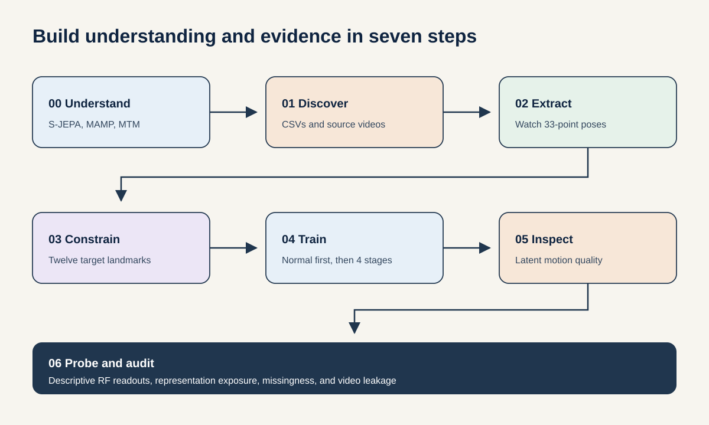
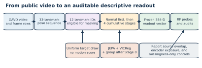
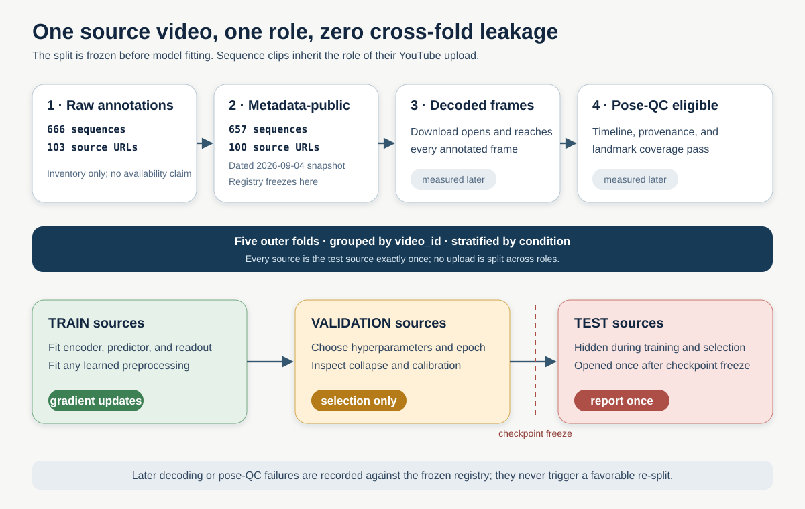
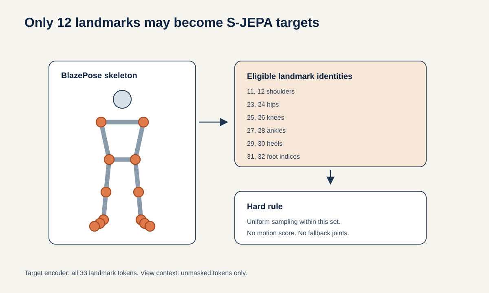

# GAVD5 S-JEPA gait tutorials

This folder is an executable course on learning motion features from gait video. It starts with a source video, extracts a 33-landmark skeleton, hides selected joint-time tokens, and asks a Skeleton Joint-Embedding Predictive Architecture, or S-JEPA, to predict their latent features. Training begins with normal gait and then continues through four cumulative condition stages.

The current evaluation contract is source-inductive: source videos are assigned to train, validation, and test roles before preprocessing or representation learning. Earlier model scores came from different cohorts or encoder-exposed evaluations. They are archived and are not comparable with the current protocol until the entire pipeline is rerun inside each source-grouped fold.



## The question

A gait video contains the motion of interest, but it also contains camera angle, clothing, background, crop quality, and pose-detector failures. This project asks whether a compact latent representation can retain useful motion structure while making every data and evaluation choice visible.

The implementation follows the main learning graph in S-JEPA, but it is a paper-aligned reimplementation rather than official code. The main changes are:

- monocular MediaPipe landmarks replace calibrated 3D laboratory skeletons;
- prediction targets come from one fixed 12-landmark whitelist;
- targets are sampled uniformly, without a motion score;
- a normal-first five-stage curriculum replaces one pooled training run;
- VICReg resists collapse;
- a label-aware group term is active after Stage 0;
- every readout reports video overlap and prior encoder exposure.



## Data gates and dated census

Counts are reported at three non-interchangeable gates. Frames are annotated manifest rows, not decoded video frames.

|Gate|Sequences|Source videos|Annotated frames|Meaning|
|---|---:|---:|---:|---|
|Raw annotations|666|103|140,641|All five GAVD manifest folders in this checkout|
|Metadata-public, 2026-09-04 local date|657|100|137,690|The platform returned public metadata without authentication|
|Decoded-span candidate upper bound|656|99|137,232|Metadata-public minus `n93bgWhLZk4`, whose 15-second media is too short for annotations through frame 458|
|Decoded-frame eligible, current audit|655|98|135,804|All public sources attempted; `n93bgWhLZk4` is terminal-short and `hGNKzkCF4J8` remains a retryable acquisition failure|
|Pose-QC eligible, fold 0|639|97|134,259|Neurologic-joint observed fraction is at least the predeclared 0.50 threshold|

The candidate row remains the theoretical maximum if the retryable `hGNKzkCF4J8` acquisition succeeds. The measured decoded-frame row requires a valid container, positive FPS/frame count, and successful decoding through the last annotated frame. Notebook 02 verified all 655 locked pose caches before applying the separate coverage gate; 639 sequences from 97 sources passed pose QC.

An initial targeted unauthenticated retry on 2026-09-04 recovered six of seven transient candidates. The subsequent full run populated 99 media files. The current audit records `n93bgWhLZk4` as terminal attrition (228 decoded frames versus frame 458 required) and `hGNKzkCF4J8` as retryable after embedded, TV, HLS, and permissive-format clients all failed. Residual acquisition failures no longer abort the notebook by default or trigger a split redraw.

The metadata-public condition counts are:

|Condition|Sequences|Source videos|Annotated frames|
|---|---:|---:|---:|
|Normal|291|32|41,340|
|Parkinson's|47|11|10,426|
|Stroke|75|18|32,930|
|Myopathic|184|29|33,992|
|Cerebral palsy|60|10|19,002|
|**Total**|**657**|**100**|**137,690**|

Two sources were private (`sf5X4YYkWUA`, `YjRoLtP1di0`) and one was unavailable (`yULxvDc9e8c`) at the dated check. `n93bgWhLZk4` remained metadata-public but failed the known duration/frame-span precheck; it is not a fourth unavailable source.

Protocol v2 freezes a deterministic five-fold source registry from the dated metadata-public population. Before later availability/QC attrition, each outer fold assigns 60 sources to training, 20 to validation, and 20 to testing, with no source crossing roles. Its split SHA-256 is `ff3518b87b1d1fa7d95efb1aea1711773137a21699967cb8015edb8d845ccbe1`; the input-manifest SHA-256 is `7fd559e5105b11011a3e5c194b7ccc29729c56491c424745834df39884123b5a`. These are deterministic protocol hashes; fold-0 pose-QC artifacts are current and model regeneration remains pending.



## Model in plain language

Each sequence is resized to 64 frames. Four adjacent frames form one time patch, which gives 16 time positions. With 33 joints, the encoder receives 528 possible joint-time tokens.

The view encoder sees a partly hidden sequence. The target encoder sees the complete sequence. The predictor uses the visible view features to predict the hidden target features. The target encoder is not updated by backpropagation. It follows the view encoder through an exponential moving average, or EMA.

The primary representation objective is label-free:

\[
L_{\mathrm{primary}} = L_{\mathrm{JEPA}} + 0.05L_{\mathrm{VICReg}}.
\]

- JEPA trains latent prediction.
- VICReg keeps dimensions variable and reduces redundant covariance, which helps resist collapse.

The supervised ablation adds `0.25 * L_group`, which encourages same-label compactness and a centroid margin after Stage 0. Because it uses condition labels, that arm is label-informed representation fine-tuning and must be reported separately from the primary self-supervised model.

### What VICReg, `group`, and `std` mean in the training log

A training line has the form

```text
JEPA <epoch mean>  VICReg <epoch mean>  group <epoch mean>  std <corpus diagnostic>
```

mixes losses with one diagnostic, so its short labels need care:

|Printed field|Exact meaning|How to read it|
|---|---|---|
|`JEPA`|Epoch-mean masked latent-prediction loss|Lower means the predictor better matches teacher features at hidden authorized tokens.|
|`VICReg`|Epoch-mean inner value `25 * invariance + 25 * variance + covariance`, before the outer weight 0.05|It aligns two views and resists constant or redundant projected features. It does not use condition labels.|
|`group`|Only the epoch-mean **centroid-separation penalty**|Near zero means batch condition centroids usually met, or nearly met, the margin. It is not the complete group loss.|
|`std`|Mean per-dimension standard deviation of unprojected EMA-teacher embeddings over the entire active corpus after the epoch|A value away from zero is evidence against total collapse. It is not a loss and has no target value of 1.|

VICReg receives two independently transformed views of each sequence. The trainable view encoder processes both, valid tokens from the 12 authorized landmark identities are pooled, and a separate projector maps each sequence to a feature vector. VICReg then applies three terms:

1. **Invariance:** mean squared error between the two projected vectors for the same sequence. It asks two views of one walk to agree.
2. **Variance:** for each projected feature dimension and each view, a hinge penalty `max(0, 1 - standard_deviation)`. It acts only when a dimension has less than the requested spread.
3. **Covariance:** squared off-diagonal covariance. It discourages multiple dimensions from carrying the same changing signal.

The separate group objective uses condition labels and the **unprojected** pooled student representation. It normalizes every sequence vector, averages vectors with the same condition label to form a centroid, and normalizes that centroid. For centroid distance `d` and margin 1.0, the separation penalty is:

\[
\left[\max(0,1-d)\right]^2.
\]

A distance of 1.2 contributes 0; 0.9 contributes 0.01; and 0.5 contributes 0.25. Because unit vectors have distances from 0 to 2, margin 1.0 is equivalent to requiring at least a 60-degree angle, or cosine similarity at most 0.5, between centroid directions. The reported value is averaged across condition pairs and balanced batches, so one logged group value cannot be converted into one exact centroid distance.

The optimized group loss is actually `compactness + separation`: compactness pulls examples toward their own condition centroid, while separation pushes different centroids apart. With the default weights, optimization uses

```text
total = JEPA + 0.05 * VICReg + 0.25 * (compactness + separation)
```

Therefore the printed `group` field understates the complete group contribution. Neither a small group penalty nor nonzero `std` proves clean clinical clusters or unseen-video generalization; they are training-health signals only.

## The 12 landmark identities eligible for prediction masking

The whitelist is expanded and de-duplicated from `experiments/multiple-sclerosis/mapping-data/ms-pd-mapping.md`.

|Indices|Landmarks|
|---|---|
|11, 12|left and right shoulder|
|23, 24|left and right hip|
|25, 26|left and right knee|
|27, 28|left and right ankle|
|29, 30|left and right heel|
|31, 32|left and right foot index|

This is a project whitelist, not a validated neurologic biomarker. All 33 joints may provide context. Only the 12 listed joints may become hidden prediction targets.

The configured mask target is 0.60, but the code uses a batch-safe rule. It takes 60% of the smallest valid eligible-token count in the batch, rounds down, and masks that same count in every sample. It always leaves at least one eligible token visible. The sampler never reads coordinate size, displacement, velocity, acceleration, or a learned motion score.



## Training curriculum

The intended curriculum begins with normal gait and then introduces Parkinson's, stroke, myopathic, and cerebral-palsy manifest groups while replaying earlier groups. Under protocol v2, this full curriculum is trained independently inside the 60-source training role of every outer fold. Validation sources select checkpoints and hyperparameters; the 20 test sources remain unseen until the fold is frozen.

The primary objective is label-free JEPA plus VICReg. The label-aware group loss is a supervised ablation and must not be mixed into the primary self-supervised claim. Epoch counts, optimizer choices, preprocessing, and early stopping are selected without test data and recorded in the fold-local run manifest.

## Current evidence status

The dated census and deterministic split contract are current. The model, geometry, classifier, temporal, laterality, and repair numbers previously shown here were produced under older cohorts or evaluation boundaries. They are archived, not current findings, and must not be compared with protocol-v2 results.

No source-held-out performance is claimed until preprocessing, the encoder and predictor, checkpoint selection, and each downstream readout are rerun using only the fold's training and validation sources. A classifier evaluated on grouped sources is still encoder-transductive if the encoder previously saw its test inputs.

Required reporting includes per-fold and per-seed results, source-level aggregation, equal-source weighting, source-cluster uncertainty, and raw-pose, untrained-encoder, missingness/coverage, continued-normal, joint-training, and label-aware controls.

## What a valid generalization test requires

Use the frozen protocol-v2 source registry. For each of five outer folds, fit all data-dependent pose processing, all representation-learning stages, and the downstream readout on 60 training sources; use 20 validation sources for selection; and open the 20 test sources only after the pipeline is frozen. Do not re-split after a decode or pose-QC failure: record attrition against the original role assignment.


## Notebook order

The workshop notebooks now live together in [`neurips-brain-body/`](neurips-brain-body/README.md). They continue to use this experiment folder for configuration, data, and generated artifacts.

|Notebook|Main output|
|---|---|
|[`00_sjepa_from_first_principles.ipynb`](neurips-brain-body/00_sjepa_from_first_principles.ipynb)|A small S-JEPA learning graph built from first principles|
|[`01_gavd_manifest_and_youtube.ipynb`](neurips-brain-body/01_gavd_manifest_and_youtube.ipynb)|A traceable manifest and one cached copy of each source video|
|[`02_extract_and_watch_skeletons.ipynb`](neurips-brain-body/02_extract_and_watch_skeletons.ipynb)|Versioned 33-landmark pose sequences and alignment checks|
|[`03_neurologic_keypoint_masking.ipynb`](neurips-brain-body/03_neurologic_keypoint_masking.ipynb)|The whitelist parser, uniform sampler, and forbidden-target assertions|
|[`04_pretrain_sjepa_on_normal.ipynb`](neurips-brain-body/04_pretrain_sjepa_on_normal.ipynb)|The complete five-stage checkpoint lineage and training history|
|[`05_inspect_latent_motion.ipynb`](neurips-brain-body/05_inspect_latent_motion.ipynb)|Prediction, collapse, drift, retrieval, and condition-geometry audits|
|[`06_capstone_health_condition_classifiers.ipynb`](neurips-brain-body/06_capstone_health_condition_classifiers.ipynb)|Three leakage-aware readout lanes and missingness controls|

Each notebook repeats the code it needs. Later notebooks reject missing, incomplete, wrong-mode, or wrong-cohort artifacts instead of silently falling back.

## Local setup

Run from this folder:

```bash
uv sync
uv run python -m ipykernel install --user --name gavd5-sjepa --display-name "GAVD5 S-JEPA"
uv run jupyter lab neurips-brain-body
```

Copy `.env.example` to `.env`. A real-data run uses project-local cache and artifact roots:

```dotenv
GAVD_MODE=real
GAVD_CACHE_DIR=cache
GAVD_ARTIFACT_DIR=work/artifacts
GAVD_DOWNLOAD=1
GAVD_RETRY_COOLDOWN_SECONDS=5
GAVD_STRICT_DOWNLOADS=0
SJEPA_RUN_PROFILE=recommended
```

Notebook 01 retries only acquisition failures that can plausibly improve. It does not redownload terminal-short media, and it resumes from valid cache entries. Residual source attrition is recorded and does not abort an ordinary research run; set `GAVD_STRICT_DOWNLOADS=1` only for CI or a release gate that intentionally requires zero residual failures.

Leave `SJEPA_INSPECT_CHECKPOINT` and `SJEPA_CLASSIFIER_CHECKPOINT` unset unless you intend to select a specific, lineage-verified artifact. Restart the kernel after changing `.env`.

The recommended profile uses 300 Stage 0 epochs, four 75-epoch continuation stages, a 0.999 starting target-encoder EMA, AdamW, gradient clipping, and VICReg weight 0.05. The supervised-ablation configuration additionally uses group weight 0.25 and group margin 1.0. The quick profile only checks that the data and checkpoint path work.

All artifact-producing code resolves paths from the same settings: `GAVD_CACHE_DIR` holds runtime
cache such as the MediaPipe model, while `GAVD_ARTIFACT_DIR` is the sole root for generated
experiment artifacts. Real artifacts therefore live under `GAVD_ARTIFACT_DIR/real`; smoke artifacts
live under `GAVD_ARTIFACT_DIR/smoke` and have no clinical meaning. Restart the kernel after changing
these settings.

## Main saved artifacts

- dated raw and metadata-public manifests, source census, and download/decode audits
- protocol-v2 split registry and hash contract
- `poses/<condition>/<sequence_id>.npz` and pose-coverage reports
- fold-local checkpoints, histories, embeddings, and readout outputs
- per-source predictions, uncertainty inputs, exclusion reasons, and missingness controls
- a run manifest and claim ledger binding every result to census, split, code, config, seed, and hashes

## Papers, tutorial, figures, and slides

- [Staged paper](docs/staged_sjepa_gait.md)
- [Long tutorial](docs/staged_details.md)
- [S-JEPA methodology evolution tutorial](docs/staged_evolution.md)
- [Progressive training guide](docs/progressive_training.md)
- [S-JEPA class and tensor-flow guide](docs/tutorials/sjepa_model_internals.md)
- [Maintainer evolution notes](notes/10_sjepa_evolution_tutorial.md)
- [Research notes index](notes/README.md)
- [Documentation build guide](docs/README.md)
- [Presentation source and deck](slides/README.md)

## Authoritative sources

- Ranjan et al., GAVD, *IEEE Access* 2025, [DOI 10.1109/ACCESS.2025.3545787](https://doi.org/10.1109/ACCESS.2025.3545787)
- Abdelfattah and Alahi, S-JEPA, ECCV 2024, [DOI 10.1007/978-3-031-73411-3_21](https://doi.org/10.1007/978-3-031-73411-3_21)
- Assran et al., I-JEPA, CVPR 2023, [DOI 10.1109/CVPR52729.2023.01499](https://doi.org/10.1109/CVPR52729.2023.01499)
- Bardes, Ponce, and LeCun, VICReg, ICLR 2022, [OpenReview](https://openreview.net/forum?id=xm6YD62D1Ub)
- Grishchenko et al., BlazePose GHUM, 2022, [arXiv:2206.11678](https://arxiv.org/abs/2206.11678)
- Google AI Edge, [Pose Landmarker documentation](https://ai.google.dev/edge/mediapipe/solutions/vision/pose_landmarker)
- Breiman, Random Forests, 2001, [DOI 10.1023/A:1010933404324](https://doi.org/10.1023/A:1010933404324)
- Roberts et al., grouped validation for structured data, 2017, [DOI 10.1111/ecog.02881](https://doi.org/10.1111/ecog.02881)
- Rousseeuw, silhouettes, 1987, [DOI 10.1016/0377-0427(87)90125-7](https://doi.org/10.1016/0377-0427(87)90125-7)

## Responsible use

Folder conditions and `gait_pat` values are dataset annotations, not diagnoses made by these notebooks. A low loss or high in-corpus classifier score does not prove clinical usefulness. Always report the checkpoint fingerprint, source-video support, class support, extraction provenance, representation exposure, missingness control, and confusion pattern. Treat every current classifier as a descriptive research tool, not a diagnostic system.
