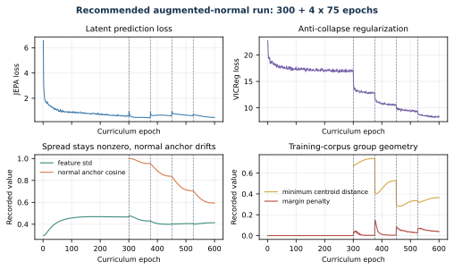
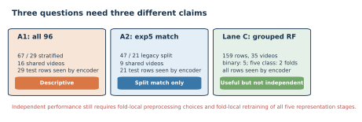

# MIT URTC 2026 paper package

This folder now reflects the completed augmented-normal real run. The paper, long tutorial, generated figures, and PDFs use the same final checkpoint and the same leakage-aware interpretation.

> **Current workspace rerun:** the newer `gavd5-drift/work` checkpoint with file SHA-256
> `6e67fc5c4a02...` produces different probe scores from this historical paper
> package. See [downstream_probe_reproduction.md](downstream_probe_reproduction.md)
> for the verified current accuracy and macro-F1. Do not mix the two result sets.

## Loss and logging terminology

All maintained documents use the following meanings:

- **VICReg** is only the label-free invariance, variance-hinge, and covariance regularizer computed on projected student features.
- **Group loss** is a separate label-aware term equal to within-condition compactness plus a centroid-margin penalty in Stages 1 through 4.
- The notebook's abbreviated `group` log field is only the centroid-margin penalty, not the complete group loss.
- The abbreviated `std` field is the mean feature standard deviation of unprojected EMA-teacher embeddings over the active corpus. It is a diagnostic, not a VICReg component and not a loss.

The plain-language derivation and numerical examples are in the root `README.md`, `progressive_training.md`, Section 8 of `staged_details.md`, Section 8 of `staged_evolution.md`, and Section 10 of `tutorials/sjepa_model_internals.md`.

Final checkpoint: `sjepa_curriculum_final_augmented.pt`

Experiment fingerprint:

```text
d0acc2628d134959d8b91e96d5112fc3bed560fe8feb9569e5b13b11a8b614d1
```

## Current files

- `staged_sjepa_gait.tex`: canonical IEEE-style staged manuscript
- `staged_sjepa_gait.pdf`: current 5-page compiled paper
- `staged_sjepa_gait.md`: readable paper with the same claims and results
- `staged_details.md`: illustrated step-by-step tutorial
- `staged_details.pdf`: compiled tutorial
- `staged_evolution.md`: extensive legacy-to-current methodology and result tutorial
- `tutorials/sjepa_model_internals.md`: illustrated class and tensor-flow reference for the S-JEPA implementation
- `progressive_training.md`: detailed training and checkpoint contract
- `downstream_probe_reproduction.md`: exact rerun command and current accuracy/macro-F1 results
- `result_history.csv`: machine-readable previous and current result ledger
- `references.bib`: authoritative primary and methods references
- `figures/`: current PDF, SVG, and PNG figures
- `make_figures.py`: artifact-bound figure generator
- `make_downstream_probe_figure.py`: artifact-bound accuracy/macro-F1 probe scorecard
- `make_evolution_figures.py`: artifact-bound generator for 12 evolution figure sets
- `urtc_pdf_layout.lua`: table layout rules for the tutorial PDF

The official 2026 URTC submission page states a maximum of five manuscript pages and a ten-minute presentation slot including questions: <https://urtc.mit.edu/submission>.

## Latest-change ledger

This table preserves the earlier results and explains what each revision changed.

|Revision|What changed|Impact on the S-JEPA model|Previous result|Current result|
|---|---|---|---|---|
|Legacy to completed curriculum|The normal-only experiment with 10 eligible landmark identities was replaced by the five-stage model with 12 eligible landmark identities, augmented normal data, VICReg, balanced replay, and post-Stage-0 group loss.|This is a different trained model. The current checkpoint has a new architecture contract, training corpus, objective, and fingerprint.|Exact exp5: 0.619 accuracy and 0.613 macro-F1.|Exact exp5: 0.714 accuracy, 0.730 balanced accuracy, and 0.742 macro-F1. The split remains video-confounded and encoder-exposed.|
|First Lane C to corrected Lane C|The five-class grouped readout changed from five ordinary group folds to two stratified group folds with all five labels on both sides and a fixed macro-F1 label list.|No model change. The final checkpoint and all 384-dimensional embeddings are identical. Only the downstream evaluation changed.|Five-fold mean: 0.604 accuracy, 0.595 balanced accuracy, and 0.407 macro-F1. One training fold had no cerebral-palsy example.|Two-fold mean: 0.653 accuracy, 0.603 balanced accuracy, and 0.625 macro-F1. Pooled OOF: 0.654, 0.600, and 0.619.|
|Augmented-normal selection contract|Notebooks 04 and 06 now accept candidates from the extraction report when neurologic-landmark coverage is at least 0.45.|No change to the saved checkpoint. The completed run already used the same 63 accepted rows. Future reruns are now reproducible instead of depending on files present in a folder.|64 candidates were recorded, but the reason for using 63 was not consistently enforced by every consumer.|64 candidates are audited, 63 are accepted, and one 0.027-coverage candidate is rejected by an explicit shared rule.|
|Mask explanation correction|Documentation now states that 0.60 is applied to the smallest eligible-token count in each batch.|No code or weight change. This documents the rule the trained model already used.|Earlier prose could be read as exactly 60% per sample.|Realized mean eligible fractions are reported as 0.551 at Stage 0 and 0.423 at Stage 4.|
|Interpretation update|The paper now separates non-collapse evidence from class-separation evidence.|No model change.|Earlier surfaces treated a successful run or classifier score as the main outcome.|The current conclusion records nonzero feature spread, normal-anchor drift to 0.594, and weak canonical silhouette 0.009 together.|

The corrected Lane C pooled macro-F1 is also 0.619 when rounded. It is not the legacy 0.619 accuracy. They are different metrics from different evaluations.


## What the package says

The completed run used 159 sequences from 35 videos, trained for 600 epochs and 11,400 updates, and retained nonzero feature spread. Normal-anchor cosine fell to 0.594. The canonical 96-sequence cosine silhouette was 0.009, so the paper does not claim clean five-condition geometry.

All classifier results are labeled as descriptive. The all-96 and exact-exp5 lanes split sequences while sharing videos and prior encoder exposure. Lane C separates videos only at the Random Forest. Its corrected five-class audit uses two stratified group folds because Parkinson's disease and cerebral palsy each have two source videos. The encoder still saw all 159 rows.

## Core result figures

### Training health

Feature spread remained nonzero, while the normal reference moved substantially during later stages.



### Canonical representation geometry

The canonical five-condition silhouette is 0.009, and the closest centroids are only 0.037 apart.


### Classifier readouts

The chart summarizes sequence-split readouts and grouped Random Forest stress tests. The black interval applies only to the five-fold binary task. The corrected two-fold five-class task intentionally has no interval.


### Claim boundary

The final diagram records which overlap remains in each evaluation lane.



## Rebuild figures

From the repository root:

```sh
MPLCONFIGDIR=cache/matplotlib .venv/bin/python docs/make_figures.py
MPLCONFIGDIR=cache/matplotlib .venv/bin/python docs/make_downstream_probe_figure.py
MPLCONFIGDIR=cache/matplotlib .venv/bin/python docs/make_evolution_figures.py
```

The generators read `classifier_contract.json`, resolve the matching checkpoint variant, and refuse an incomplete or mixed-fingerprint curriculum. They write each figure as PDF, SVG, and PNG. The evolution generator also validates the five checkpoint stages, class reports, result ledger, and saved geometry.

## Build the paper

From `docs/`:

```sh
tectonic staged_sjepa_gait.tex
```

The current result is five US-letter pages. The source uses the IEEE conference class and current vector figures.

## Build the tutorial PDF

From `docs/`:

```sh
pandoc staged_details.md --from=markdown --standalone --toc \
  --resource-path=.:.. \
  --lua-filter=urtc_pdf_layout.lua --pdf-engine=tectonic \
  -V papersize=letter -V geometry:margin=0.65in -V fontsize=10pt \
  -M title="Detailed tutorial: normal-first S-JEPA for gait" \
  -M author="URTC S-JEPA Gait Project" \
  -o staged_details.pdf
```

## Checks completed

- paper compiles to 5 pages, at the five-page maximum;
- tutorial compiles to 17 pages with vector illustrations and the expanded VICReg, group-loss, and feature-spread explanation;
- citations resolve in the TeX paper;
- the paper and tutorial contain the corrected Lane C values;
- the legacy 10-keypoint and first Lane C values are preserved only in the change ledger and are not presented as current results;
- all current S-JEPA readouts disclose source overlap and encoder exposure;
- no em dash characters remain in the maintained documentation and notebook sources.

## Checks still requiring the authors

1. Confirm author names, order, affiliation, email, student eligibility, and mentor role.
2. Confirm funding, acknowledgments, and data-use statements.
3. Inspect the final PDF at print size.
4. Confirm the current URTC template and submission rules before uploading.
5. Do not describe any current classifier score as clinical validation or unseen-video performance.
