# S-JEPA gait model internals

This tutorial explains how `SkeletonPatchEncoder`, `SkeletonPredictor`, and `SJEPAGait` work in this project. It also covers the preprocessing, masking, loss, pooling, replay, and diagnostic helpers that make the classes usable as a training system.

The goal is to make every tensor transformation and state update inspectable. By the end, you should be able to trace one pose clip from `[B,F,V,C]` coordinates to masked latent predictions, identify which parameters receive gradients, and explain what the model does not learn from its objective.

> **Research boundary:** This implementation is a project-specific S-JEPA adaptation for gait research. It is not the official S-JEPA implementation, a clinical model, or a diagnostic system. Smoke-mode sequences test code paths only. They are not physiological simulations of health conditions.

> **Current data boundary:** The primary run uses 626 coverage-valid GAVD sequences from 93 source videos. The optional added-normal dataset is off. In this tutorial, “augmentation” refers to geometric pose transformations used during training, not to that retired dataset.

## Reading paths

- **First pass:** [mental model](#1-the-one-minute-mental-model), [notation](#2-notation-and-standard-configuration), [forward pass](#7-sjepagait), and [worked shapes](#14-worked-shape-examples).
- **Architecture:** [patch encoder](#4-skeletonpatchencoder), [mask policy](#5-the-mask-policy), and [predictor](#6-skeletonpredictor).
- **Training:** [JEPA loss](#8-jepa-loss-target-center-and-temperatures), [EMA](#9-gradient-ownership-and-ema), [auxiliary objectives](#10-the-two-auxiliary-objectives), and [optimizer step](#11-one-complete-optimizer-step).
- **Reference:** [misconceptions](#15-common-misconceptions), [failure cases](#16-failure-cases-worth-testing), [API](#18-compact-api-reference), and [maintenance](#20-maintenance-checklist).

## Source of truth

The core class cell is currently duplicated byte-for-byte in four notebooks:

- [00_sjepa_from_first_principles.ipynb](../../neurips-brain-body/00_sjepa_from_first_principles.ipynb), the smallest teaching path;
- [04_pretrain_sjepa_on_normal.ipynb](../../neurips-brain-body/04_pretrain_sjepa_on_normal.ipynb), the full training path and the main source for this guide;
- [05_inspect_latent_motion.ipynb](../../neurips-brain-body/05_inspect_latent_motion.ipynb), the representation inspection path;
- [06_capstone_health_condition_classifiers.ipynb](../../neurips-brain-body/06_capstone_health_condition_classifiers.ipynb), the downstream readout path.

The duplication is convenient for standalone notebooks, but it creates a maintenance risk. A class change must be synchronized across all four copies and tested in every consumer.

## 1. The one-minute mental model

The model receives a fixed-length clip of 3D skeleton coordinates. It groups consecutive frames into short temporal patches, one joint at a time. Each joint-time patch becomes a token.

Training then creates two paths:

1. The **view encoder**, or student, receives the full augmented coordinates plus a keep mask. It builds every patch embedding, then its transformer blocks process only visible tokens.
2. The **target encoder**, or teacher, receives the complete cleaned clip.
3. The **predictor** places the visible student features back into a full token grid, inserts learned mask tokens at hidden positions, and predicts the teacher features at those hidden positions.
4. A loss compares predicted and teacher latent distributions at the same masked positions.
5. Gradients update the view encoder and predictor. An exponential moving average, or EMA, updates the target encoder.

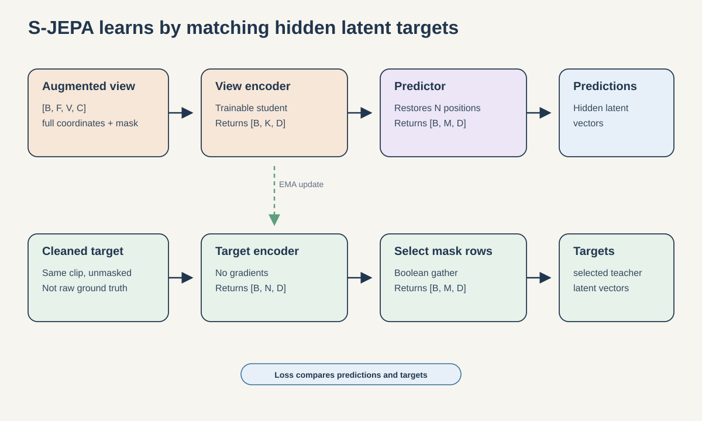

Three phrases in that description matter:

- **Same clip:** this model is not forecasting future frames.
- **Latent prediction:** it predicts encoder features, not joint coordinates.
- **Complete cleaned clip:** the teacher input is unmasked, but it can still contain zero sentinels for missing observations. It is not perfect ground truth.

## 2. Notation and standard configuration

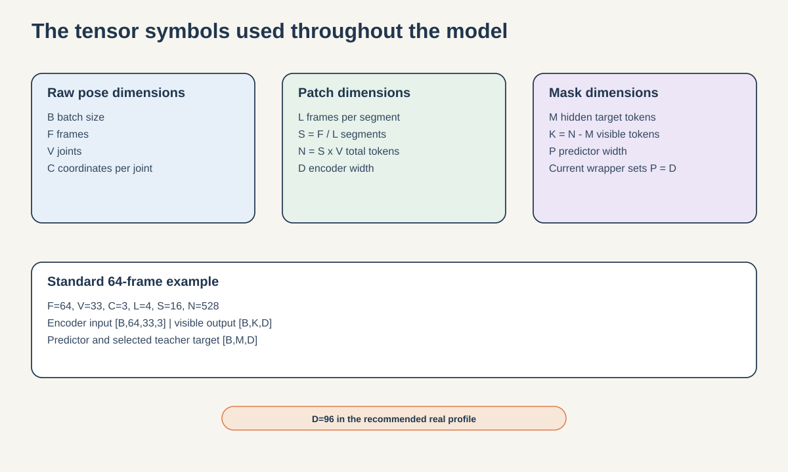

|Symbol|Meaning|
|---|---|
|`B`|Batch size|
|`F`|Number of frames after temporal resizing|
|`V`|Number of joints, fixed at 33 for BlazePose|
|`C`|Coordinate channels per joint, fixed at 3 for x, y, z|
|`L`|Frames in one temporal segment|
|`S`|Number of segments, `F / L`|
|`N`|Total joint-time tokens, `S * V`|
|`D`|Encoder embedding width, `embed_dim`|
|`P`|Predictor embedding width, `predictor_dim`|
|`M`|Number of masked target tokens per sample|
|`K`|Number of visible tokens per sample, `N - M`|

The class and profile values below are defaults. Environment variables can override several training values.

|Profile|Frames `F`|Width `D`|Encoder / predictor depth|Normal epochs|Added-condition epochs|EMA start|
|---|---:|---:|---:|---:|---:|---:|
|Class defaults|64|64|2 / 2|not set|not set|not set|
|Smoke|32|32|1 / 1|2|1 each|0.996|
|Real quick|64|96|4 / 2|20|5 each|0.996|
|Real recommended|64|96|4 / 2|300|75 each|0.999|

Every profile uses four attention heads. Quick and recommended use the same architecture. They differ in training duration and starting teacher momentum.

Relevant overrides include `SJEPA_FRAMES`, `SJEPA_NORMAL_EPOCHS`, `SJEPA_FINETUNE_EPOCHS`, `SJEPA_EMA_START`, `SJEPA_MASK_FRACTION`, `SJEPA_VICREG_WEIGHT`, `SJEPA_GROUP_WEIGHT`, and `SJEPA_GROUP_MARGIN`.

With the recommended real profile and `L=4`:

```text
S = 64 / 4 = 16 segments
N = 16 * 33 = 528 tokens
D = 96 features per token
```

The later 384-dimensional classifier vector is not `embed_dim`. It is a concatenation of four 96-dimensional pooled summaries. Section 13 derives it.

## 3. Data preparation before the classes

The raw pose record has shape `[T,33,4]`. The final channel contains landmark visibility. `prepare_sequence` returns two separate arrays:

```text
coordinates: [F,33,3] float32
validity:    [F,33]   bool
```

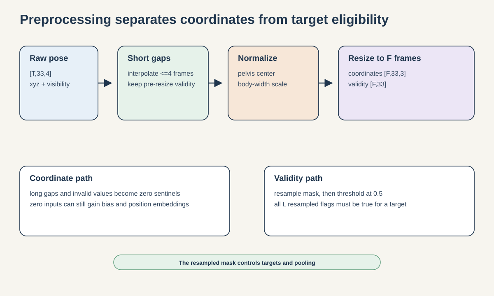

### Step 3.1: `interpolate_low_visibility`

```python
interpolate_low_visibility(sequence, threshold=0.45, max_gap=4)
```

The function checks that the input is exactly `[T,33,4]`. A point is originally valid when visibility is at least 0.45 and all three coordinates are finite.

For each joint, the function fills only internal gaps of at most four frames. It never extrapolates sequence ends or long gaps. The subtle part is its return value: the coordinates may be filled, but the returned Boolean mask records **pre-resize original validity**, not the filled positions. At this stage, a filled location can provide smoother context while remaining false in the validity mask. `prepare_sequence` later resamples this mask.

### Step 3.2: `center_and_scale`

The function estimates a pelvis center per frame from left and right hip joints 23 and 24. If only one hip has finite coordinates, it uses that hip. If neither does, it falls back to the median finite pelvis estimate across frames, or zero when no finite estimate exists. This code checks coordinate finiteness, not the separate validity mask.

It then:

1. subtracts the pelvis position from every joint;
2. computes shoulder and hip widths in the x-y plane;
3. uses the median of the larger width as one sequence-wide scale;
4. replaces remaining nonfinite coordinates with zero.

The zero is a missing-data sentinel in the coordinate path. It is not sufficient by itself to make the token disappear from attention.

### Step 3.3: `temporal_resize`

Coordinates and validity are independently resized to `F` frames. Coordinates use linear interpolation. Pre-resize validity is converted to floats, linearly resampled, then thresholded at 0.5. The final mask is therefore derived from original observations, not a strict claim that each output time point was directly observed.

Because missing coordinates were converted to zeros before resizing, resized context coordinates can interpolate toward or away from zero. The separate validity mask is therefore the authority for target eligibility and validity-aware pooling.

### Step 3.4: patch validity

Training converts frame validity `[B,F,33]` to patch validity:

```python
valid_patch = valid.reshape(B, S, L, 33).all(dim=2)
```

A joint-time patch is valid only when all `L` resampled validity flags are true.

## 4. `SkeletonPatchEncoder`

### Constructor

```python
SkeletonPatchEncoder(
    frames=64,
    joints=33,
    coordinate_dim=3,
    segment_length=4,
    embed_dim=64,
    depth=2,
    heads=4,
    dropout=0.0,
)
```

The constructor requires `frames` to be divisible by `segment_length`. PyTorch also requires `embed_dim` to be divisible by `heads`.

`heads` is the number of parallel attention subspaces. Each head works with a slice of the embedding width, attention results are concatenated, and an output projection returns to width `D`. With `D=96` and four heads, each head uses 24 features.

Its learned components are:

- `patch_embed`: `Linear(L*C, D)`;
- `time_pos`: one learned vector per segment, shape `[S,D]`;
- `joint_pos`: one learned vector per joint, shape `[V,D]`;
- `blocks`: `depth` transformer encoder layers;
- `norm`: a final `LayerNorm(D)`.

There is no graph convolution, skeleton-edge adjacency matrix, causal mask, or fixed sinusoidal position encoding.

### Step 4.1: `patchify`

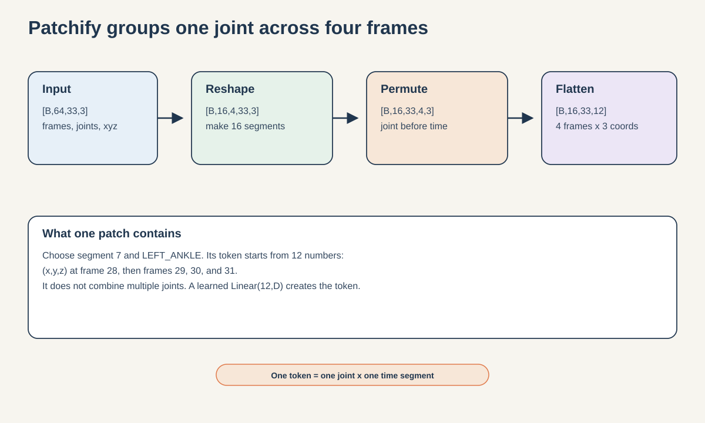

`patchify` transforms the standard input as follows:

```text
[B,64,33,3]
    reshape  -> [B,16,4,33,3]
    permute  -> [B,16,33,4,3]
    flatten  -> [B,16,33,12]
```

One patch contains one joint across four consecutive frames. It does not contain all joints from a frame window.

The final patch dimension is `L*C = 4*3 = 12`. `patch_embed` maps those 12 coordinate values to `D` learned features.

### Step 4.2: `positioned_tokens`

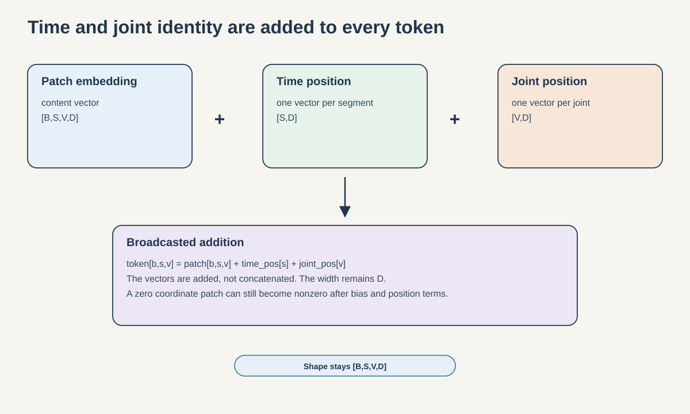

After patch projection, token shape is `[B,S,V,D]`. The encoder adds position vectors by broadcasting:

```python
tokens[b, s, v] = (
    patch_embedding[b, s, v]
    + time_pos[s]
    + joint_pos[v]
)
```

The vectors are added, not concatenated, so the width remains `D`.

Position and linear-layer bias terms mean a zero coordinate patch does not necessarily produce a zero token. Invalid patches can remain in context attention unless they are selected out by another mask. In the current training path, validity prevents invalid patches from becoming targets and excludes them from validity-aware pooling, but it is not passed as an attention padding mask.

### Step 4.3: flatten and optionally keep visible tokens

The encoder flattens segment-major, joint-minor order:

```text
[B,S,V,D] -> [B,N,D]
flat_index = segment_index * V + joint_index
```

For `F=64`, this is `[B,528,D]`.

When `keep_mask` is provided, `True` means retain the token. The mask is flattened in the same order, then used for Boolean selection.

```python
kept_per_sample = keep_mask.sum(dim=1)
```

Every sample must keep the same number `K`. Otherwise, the method raises `ValueError`, because it cannot reshape a ragged Boolean selection into one dense `[B,K,D]` tensor.

### Step 4.4: transformer layers

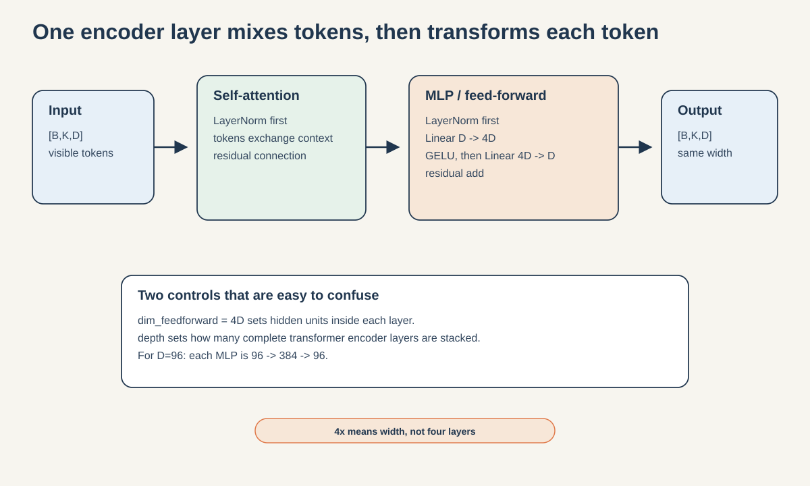

Each transformer encoder layer has two main transformations:

1. multi-head self-attention mixes information across all retained tokens;
2. a per-token feed-forward network applies `D -> 4D -> D` with GELU.

`dim_feedforward=embed_dim*4` sets the hidden width of that two-linear-layer MLP. It does not create four layers. With `D=96`, each MLP is:

```text
Linear(96, 384) -> GELU -> Linear(384, 96)
```

The expansion gives each token more nonlinear capacity to combine its features before compressing back to `D`. Four times is an empirical transformer convention, not a mathematical requirement. A wider MLP adds parameters and compute, so other architectures use smaller ratios or gated alternatives such as SwiGLU.

The pre-norm residual equations are approximately:

```text
x = x + self_attention(layer_norm(x))
x = x + mlp(layer_norm(x))
```

`depth` separately controls how many complete transformer encoder layers are stacked. `norm_first=True` makes each layer pre-norm: LayerNorm runs before attention and before the MLP. A separate final LayerNorm runs after the stack.

PyTorch clones the supplied encoder-layer template to build the stack. The layers begin with equal parameter values, then can diverge during optimization.

### Encoder contract

|Call|Input|Output|
|---|---|---|
|`patchify(x)`|`[B,F,V,C]`|`[B,S,V,L*C]`|
|`positioned_tokens(x)`|`[B,F,V,C]`|`[B,S,V,D]`|
|`forward(x)`|`[B,F,V,C]`|`[B,N,D]`|
|`forward(x, keep_mask)`|coordinates plus `[B,S,V]` Boolean mask|`[B,K,D]`|

## 5. The mask policy

Masking is not enforced inside `SJEPAGait` or `SkeletonPredictor`. It is produced and audited by the training helpers before the model call.

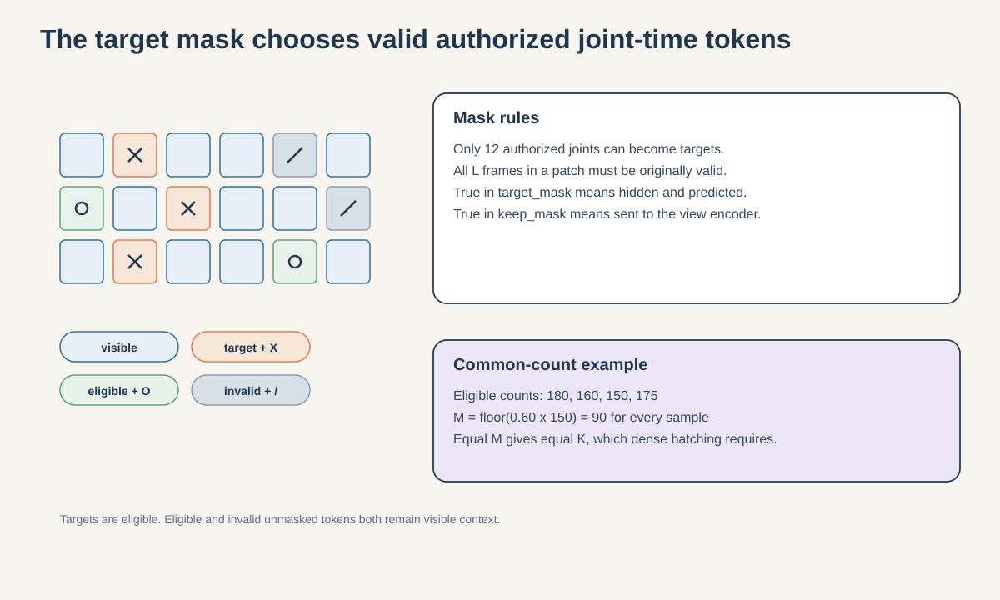

### Step 5.1: authorized targets

All 33 joint identities can remain as context. Only these 12 BlazePose identities may become hidden targets:

|Indices|Landmarks|
|---|---|
|11, 12|left and right shoulders|
|23, 24|left and right hips|
|25, 26|left and right knees|
|27, 28|left and right ankles|
|29, 30|left and right heels|
|31, 32|left and right foot indices|

Eligibility requires both conditions:

```text
authorized joint identity AND valid_patch is True
```

The sampler is uniform. It does not read displacement, velocity, acceleration, or a learned motion score.

### Step 5.2: one shared target count

`uniform_neurologic_mask` counts eligible tokens in every sample, takes the smallest count in the batch, and computes:

```text
M = floor(minimum eligible count * mask_fraction)
```

It clamps `M` so at least one eligible token is masked and at least one remains visible. It then samples exactly `M` targets without replacement from each sample.

For eligible counts `180, 160, 150, 175` and `mask_fraction=0.60`:

```text
M = floor(150 * 0.60) = 90
```

Every sample masks 90 targets. Their realized eligible fractions differ. The sample with 180 eligible positions masks 50 percent; the sample with 150 masks 60 percent.

For a fully valid 64-frame input:

```text
eligible = 16 segments * 12 authorized joints = 192
M = floor(192 * 0.60) = 115
N = 16 * 33 = 528
K = 528 - 115 = 413
global masked fraction = 115 / 528 = 21.78 percent
```

This is why `mask_fraction=0.60` does not mean 60 percent of all 528 tokens.

### Step 5.3: mask polarity

The two model APIs use opposite words for the same positions:

```text
target_mask == True      hidden and predicted
keep_mask == True        retained by the view encoder
keep_mask = ~target_mask
```

The mask should be a Boolean PyTorch tensor on the compatible device. Applying `~` to an integer tensor performs a bitwise complement, not a logical one.

`mask_audit` reports global fraction, eligible fractions, touched joint IDs, and forbidden target count. The forbidden count must remain zero.

## 6. `SkeletonPredictor`

### Constructor

```python
SkeletonPredictor(
    segments,
    joints,
    encoder_dim=64,
    predictor_dim=64,
    depth=2,
    heads=4,
    dropout=0.0,
)
```

The predictor has its own representation space and its own learned position embeddings:

- `encoder_to_predictor`: `Linear(D,P)`;
- `mask_token`: one learned vector of shape `[1,1,P]`;
- predictor `time_pos` and `joint_pos` parameters;
- a transformer encoder stack with `P -> 4P -> P` MLPs;
- `output`: `Linear(P,D)`.

The predictor does not reuse the encoder position vectors. The current `SJEPAGait` wrapper sets `P=D`, although the predictor class itself permits different widths. When used directly, `predictor_dim=P` must also be divisible by `heads`.

### Step 6.1: project visible features

The input is already contextualized student output, not raw patch embeddings:

```text
visible_features [B,K,D] -> Linear(D,P) -> [B,K,P]
```

### Step 6.2: reconstruct the token layout

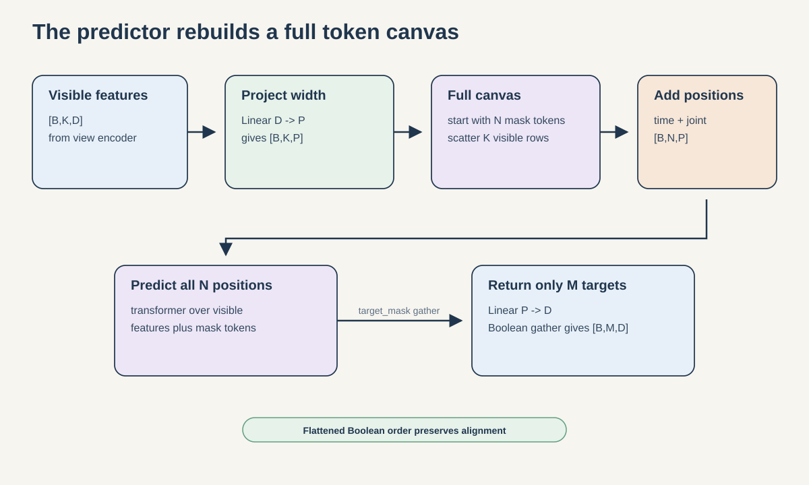

The predictor creates `[B,N,P]` by expanding the learned mask token. It then writes projected visible features into positions where `target_mask` is false.

This depends on one ordering contract: the view encoder's Boolean gather and the predictor's Boolean scatter both use the same flattened segment-major, joint-minor order, `flat_index = s*V + v`. Breaking that order would silently pair features with the wrong time-joint locations.

### Step 6.3: predict all positions, return targets only

The predictor adds its own time and joint positions, runs full bidirectional self-attention over all `N` positions, projects `P -> D`, and gathers only rows where `target_mask` is true.

```text
full prediction [B,N,D] -> target gather -> [B,M,D]
```

This module is implemented with `TransformerEncoder`, not an encoder-decoder cross-attention layer. The visible features and mask tokens form one restored sequence.

The method assumes, but does not explicitly validate, that:

- every sample has the same `M` and `K`;
- visible feature count equals the false count in `target_mask`;
- visible feature order matches the flattened mask complement.

## 7. `SJEPAGait`

### Component ownership

```python
SJEPAGait(
    frames=64,
    joints=33,
    coordinate_dim=3,
    segment_length=4,
    embed_dim=64,
    encoder_depth=2,
    predictor_depth=2,
    heads=4,
)
```

|Component|How it is created|How it changes|
|---|---|---|
|`view_encoder`|new `SkeletonPatchEncoder`|gradients and AdamW|
|`target_encoder`|`copy.deepcopy(view_encoder)`|EMA only; `requires_grad=False`|
|`predictor`|new `SkeletonPredictor`|gradients and AdamW|
|`target_center`|registered zero buffer `[D]`|its own EMA update|

Because the target encoder begins as a deep copy, both encoders start with equal weights. Freezing its gradients does not make it static. `update_target` changes its parameters after each optimizer step.

`SJEPAGait` does not expose `dropout` or `predictor_dim`, so current student, teacher, and predictor dropout is zero and `P=D`.

### Forward pass, line by line

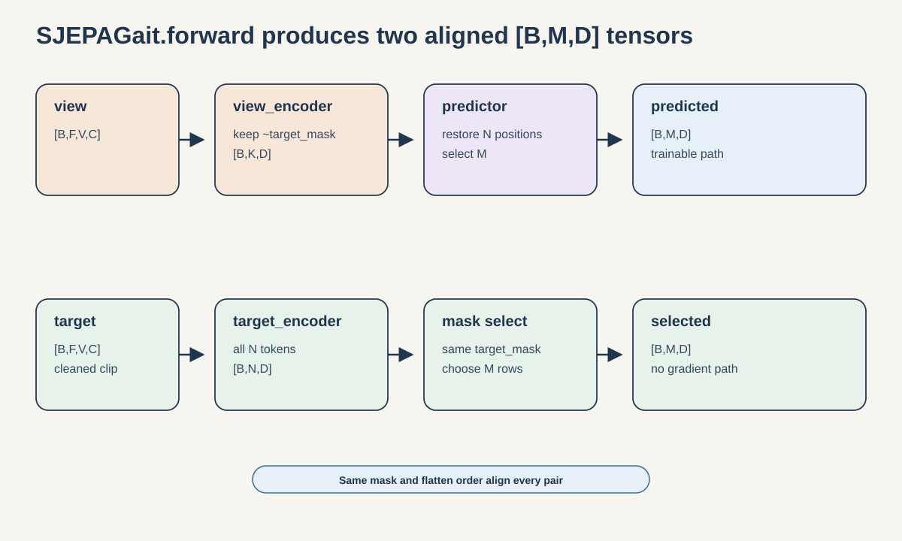

The signature is:

```python
predicted, selected = model(view, target, target_mask)
```

The student path is:

```text
view [B,F,V,C]
  -> view_encoder(view, keep_mask=~target_mask)
  -> visible_features [B,K,D]
  -> predictor(visible_features, target_mask)
  -> predicted [B,M,D]
```

The teacher path runs inside `torch.no_grad()`:

```text
target [B,F,V,C]
  -> target_encoder(target)
  -> all_targets [B,N,D]
  -> select target_mask rows
  -> selected [B,M,D]
```

The teacher contextualizes all tokens before target selection. In other words, teacher features at masked positions can attend to the complete cleaned clip. The student never sends masked patch content through its self-attention because target rows are removed before the view-encoder transformer blocks.

The return tensors have the same shape and ordering. Entry `[b,m]` in `predicted` is compared with the teacher vector for the same flattened time-joint target in `selected`.

## 8. JEPA loss, target center, and temperatures

```python
sjepa_cross_entropy(
    predicted,
    targets,
    center,
    predictor_temperature=0.10,
    target_temperature=0.06,
)
```

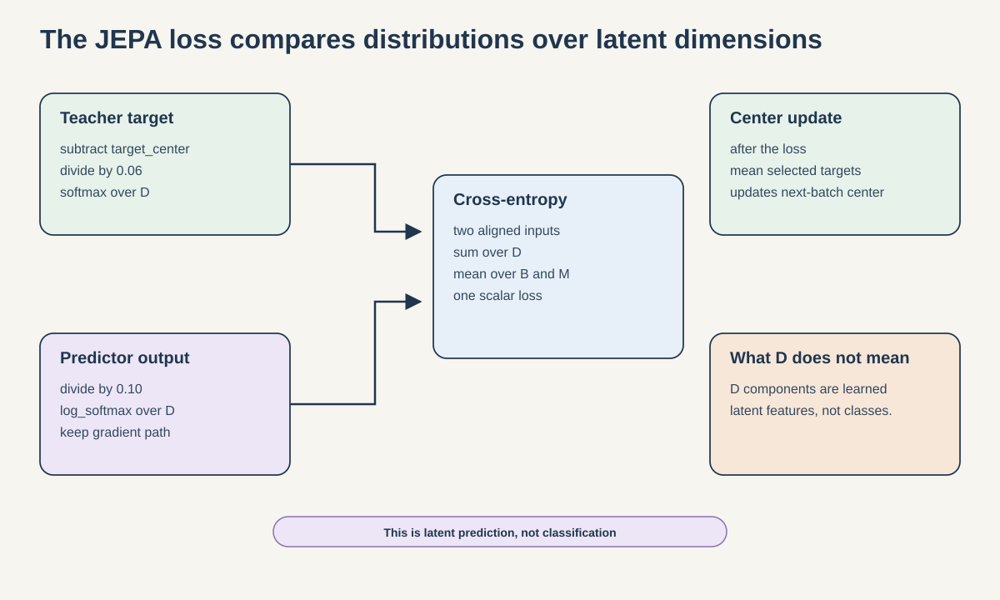

For each `[B,M,D]` teacher target, the code computes:

\[
q = \operatorname{softmax}\left(\frac{z_t-c}{0.06}\right)
\]

For each prediction:

\[
\log p = \operatorname{logsoftmax}\left(\frac{z_p}{0.10}\right)
\]

Then it averages categorical cross-entropy over the batch and masked-token axes:

\[
L_{JEPA} = -\operatorname{mean}_{B,M}\sum_D q\log p
\]

The softmax categories are latent dimensions. They are not health-condition classes. This is also not mean squared error and not coordinate reconstruction.

The teacher probabilities are detached even though targets were already computed in `no_grad`. The double boundary makes the intended gradient ownership explicit.

`update_center` computes the mean of selected masked teacher targets over `B` and `M`, then updates:

\[
c \leftarrow \beta c + (1-\beta)\bar z_t
\]

with default `beta=0.9`. It does not use every full teacher token.

The function does not validate positive temperatures, and `update_center` does not validate the beta range. Configuration code must preserve valid values.

## 9. Gradient ownership and EMA

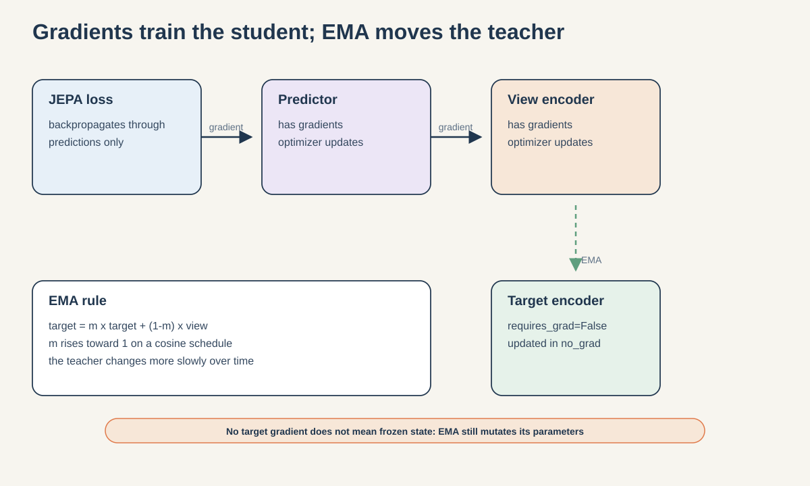

After backpropagation:

- view-encoder parameters can have gradients;
- predictor parameters can have gradients;
- VICReg projector parameters can have gradients;
- target-encoder parameters must have `grad is None`.

The target update applied after each optimizer step is:

\[
\theta_t \leftarrow m\theta_t + (1-m)\theta_v
\]

`cosine_ema` raises `m` from a configured starting value toward 1.0. As `m` approaches 1, the teacher changes more slowly.

The recommended-profile default starting momentum is 0.999. Quick and smoke default to 0.996, and `SJEPA_EMA_START` can override the real-profile value. The EMA schedule is local to each curriculum stage because `train_stage` resets its step counter and constructs a new schedule. An update call generally changes the teacher until momentum reaches exactly 1.0 on the final scheduled step. It also makes no numerical change when the matching student and teacher values are already equal.

`update_target` iterates encoder parameters only. It does not update the predictor or `target_center`. The encoder currently has no running-statistic buffers. If future encoder layers introduce stateful buffers, the EMA helper would need an explicit buffer policy.

One extension caveat is worth preserving: `model.train()` also places the frozen target encoder in training mode. This has no stochastic effect today because dropout is zero and the model has no batch-normalization layers. If dropout or running-statistic layers are introduced, teacher mode must be controlled deliberately.

## 10. The two auxiliary objectives

Using the default outer weights, the full training objective is:

\[
L_{total}=L_{JEPA}+0.05L_{VICReg}+0.25L_{group}
\]

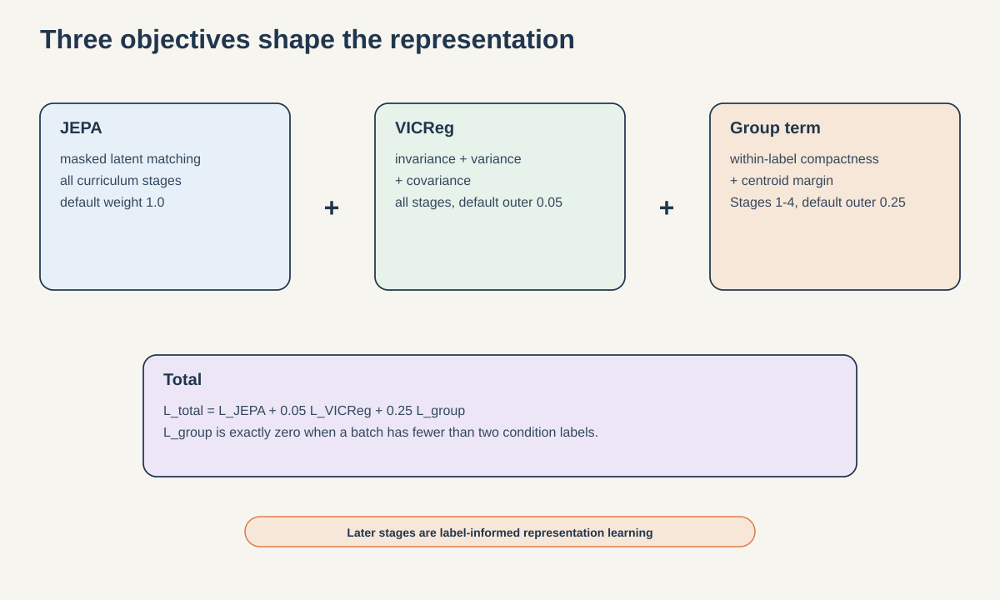

### `VICRegProjector`

VICReg means Variance-Invariance-Covariance Regularization. It aligns two views of the same sample while explicitly resisting constant and redundant feature dimensions.

```text
Linear(D,D) -> GELU -> Linear(D,D)
```

The projector preserves shape `[B,D]`. It is trained and checkpointed separately from `SJEPAGait`. It is used only for the VICReg objective, not downstream embedding extraction.

### `authorized_pool`

`authorized_pool(tokens, valid_patch)` receives tokens `[B,S,33,D]`. It selects the 12 authorized joint identities and computes a validity-weighted mean over their joint-time positions. Its output is `[B,D]`.

The denominator is clamped to 1.0, but upstream training requires enough eligible tokens before this point.

### `vicreg_terms`

Two independently transformed views are encoded with the trainable view encoder, pooled, and projected. VICReg returns:

- **invariance:** mean squared error between paired view vectors;
- **variance:** a hinge penalty when per-dimension standard deviation falls below 1;
- **covariance:** squared off-diagonal covariance, which discourages redundant dimensions.

In plain language, the three terms answer different questions. Invariance asks whether two altered views of the same sequence map to the same place. Variance asks whether each projected coordinate still changes across different sequences in the batch; a coordinate that is nearly constant cannot carry much discriminating information. Covariance asks whether two different coordinates repeatedly rise and fall together; if they do, they may be duplicating one another.

For view matrices `first` and `second`, each with shape `[B,D]`, the implementation is equivalent to:

```text
invariance = mean((first - second) ** 2)
std_a[d] = sqrt(population_variance(first[:, d]) + 1e-4)
std_b[d] = sqrt(population_variance(second[:, d]) + 1e-4)
variance = 0.5 * mean(max(0, 1 - std_a))
         + 0.5 * mean(max(0, 1 - std_b))
covariance = mean squared off-diagonal covariance across both views
```

The `1e-4` stabilizer prevents an undefined square-root gradient at exactly zero variance. The variance hinge stops contributing once a projected dimension reaches standard deviation 1; it does not reward unlimited spread. The covariance diagonal is excluded because it contains each feature's own variance, while VICReg uses this term specifically to reduce dependence between different features.

The helper combines them as:

```text
25 * invariance + 25 * variance + covariance
```

The outer training weight of 0.05 is applied after this internal combination.

Consequently, a printed `VICReg 12.8508` means an epoch mean of the inner combined value. Its nominal contribution to the batch objective is scaled by 0.05. The three component values are preserved separately in training history, and their scale should not be confused with the unprojected diagnostic called `feature_std`.

### `condition_group_terms`

This helper receives unprojected authorized-pooled view features and integer condition labels. It L2-normalizes features, computes a normalized centroid per present label, then returns:

- mean within-label squared distance to the corresponding centroid;
- a squared hinge penalty for centroid pairs whose Euclidean distance in unit-normalized space is below the default margin 1.0;
- the minimum centroid distance.

For one normalized sequence vector $u_n$ with label $y_n$, the centroid for condition $k$ is the normalized mean of all $u_n$ having $y_n=k$. Compactness averages $\|u_n-c_{y_n}\|_2^2$. Separation averages

\[
\left[\max(0,1-\|c_i-c_j\|_2)\right]^2
\]

over all centroid pairs. A pair at distance 1.2 contributes 0; distances 0.9, 0.8, and 0.5 contribute 0.01, 0.04, and 0.25. Because centroids are unit vectors, distance 1.0 means a 60-degree angular separation, equivalently cosine similarity 0.5. The loss only penalizes a shortfall below that margin; it does not keep pushing already-separated centroids farther apart.

For unit vectors, squared Euclidean distance and cosine similarity are related by `distance_squared = 2 - 2*cosine_similarity`. This metric should not be confused with the separate downstream cosine-geometry report.

With fewer than two unique labels, the helper returns zeros that remain attached to the autograd graph, plus a NaN minimum distance. The attached zeros allow the combined loss to backpropagate normally without group gradients. Stage 0 has only normal samples, so the group objective is exactly zero. Stages 1 through 4 use folder condition labels, which makes the later representation training label-informed rather than purely self-supervised.

### Read the abbreviated training output exactly

The epoch print statement uses:

```text
JEPA 0.4585  VICReg 12.8508  group 0.0005  std 0.4297
```

The names are not four parallel loss terms:

- `JEPA` is the mean JEPA loss over the epoch's optimizer batches.
- `VICReg` is the mean inner VICReg loss over those batches, before its outer 0.05 multiplier.
- `group` is `group_separation` only. The optimized group objective is `group_compactness + group_separation`, followed by the outer 0.25 multiplier. The compactness part is saved in history but omitted from the short print line.
- `std` is `feature_std`, calculated once after the epoch. The whole active corpus passes through the EMA target encoder; authorized valid tokens are pooled without the VICReg projector; population standard deviation is computed independently for each embedding dimension; and those standard deviations are averaged.

Therefore `group 0.0005` means the squared centroid-margin shortfall was small on average across pairs and balanced batches. It cannot be converted into one exact distance. `std 0.4297` means EMA-teacher features retained nonzero spread on average. It is not the VICReg variance hinge, is not optimized directly, and has no target of 1. Both values can look healthy while representations still encode background, video identity, pose-estimation artifacts, or other nuisance signals.

## 11. One complete optimizer step

`train_stage` executes these operations in order:

1. Build a condition-balanced replay batch.
2. Convert frame validity to all-frames patch validity.
3. Sample and audit the uniform authorized target mask.
4. Create two independent geometric views, `view_a` and `view_b`.
5. Run the masked JEPA path using `view_a` and the unaugmented cleaned coordinates as teacher input.
6. Encode complete `view_a` and `view_b` token grids with the trainable view encoder for VICReg.
7. Pool authorized valid tokens.
8. Apply the projector for VICReg and use unprojected `pooled_a` for the group terms.
9. Form `total_loss` and reject nonfinite values.
10. Zero gradients, backpropagate, and assert that teacher gradients are absent.
11. Clip trainable gradient norm to 1.0.
12. Step AdamW, then step the learning-rate scheduler.
13. Update the target encoder by EMA.
14. Update `target_center` from the selected teacher targets.

The target encoder is therefore changed after the loss for the current batch is calculated. The center is also updated for the next batch.

### `geometric_view`

This augmentation samples one transform per sequence:

- rotation around the relative vertical y axis, mixing x and z;
- translation in x and y;
- optional left-right reflection plus joint-pair swaps.

Flipping defaults to off because laterality can matter for stroke. The function infers present points from nonzero coordinate magnitude, applies the transform, then restores inferred missing positions to zero.

The inference is imperfect. A truly present point exactly at `(0,0,0)` is treated as absent. Also, a resampled invalid coordinate can be nonzero and therefore transformed even though it remains target-ineligible. The separate validity mask still controls targets and pooling.

## 12. Balanced replay and curriculum state

`balanced_epoch_batches` gives every active condition exactly `per_condition` samples in each batch. The largest condition determines the number of steps and is traversed at least once. Every condition can repeat samples to fill the required slots, including the largest condition when its size is not divisible by `per_condition`. Smaller conditions usually repeat more often.

This is balanced replay, not a naturally sampled epoch. It prevents earlier conditions from disappearing when a new condition is added, but it does not guarantee retention.

The curriculum is cumulative:

```text
Stage 0  normal
Stage 1  normal + Parkinson's
Stage 2  normal + Parkinson's + stroke
Stage 3  previous groups + myopathic
Stage 4  previous groups + cerebral palsy
```

The model, target encoder, target center, and VICReg projector continue across stages. Each stage intentionally creates a fresh AdamW optimizer and a fresh learning-rate and EMA schedule.

`checkpoint_for_stage` fingerprints the preprocessed coordinates, validity masks, model configuration, target mapping, curriculum, sequence IDs, and parent fingerprint. This records the experiment lineage. It is not the checksum of the serialized checkpoint file.

## 13. Downstream target-encoder pooling

Notebook 05 and notebook 06 use the EMA target encoder for downstream representations. They do not use the predictor or VICReg projector.

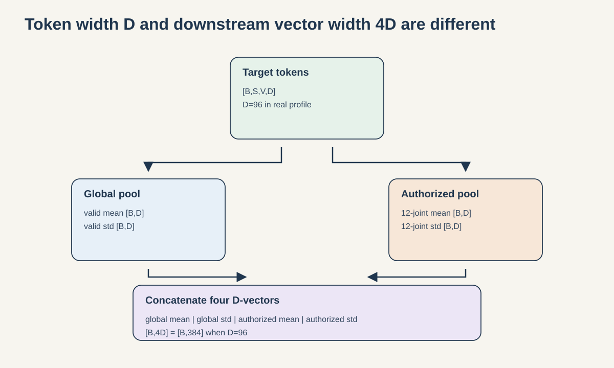

`pooled_embeddings` reshapes target output to `[B,S,33,D]` and computes four summaries:

1. validity-weighted mean over all joints and segments, `[B,D]`;
2. validity-weighted standard deviation over all joints and segments, `[B,D]`;
3. validity-weighted mean over the 12 authorized joints, `[B,D]`;
4. validity-weighted standard deviation over the 12 authorized joints, `[B,D]`.

Concatenation gives `[B,4D]`. With the real configuration `D=96`, this is `[B,384]`. With smoke configuration `D=32`, it is `[B,128]`.

Validity-aware pooling directly excludes invalid tokens. However, invalid tokens were still present during the target encoder's self-attention, so they can indirectly affect valid token embeddings.

`masked_mean_std` clamps a zero denominator to 1. If a sample has no valid patches, its global mean and standard deviation silently become zero. If it has no valid authorized patches, the authorized half of its readout becomes zero. The frame-level coverage threshold does not mathematically guarantee an all-`L` valid patch. A production training or evaluation path should assert at least one valid global patch and one valid authorized patch per sample before pooling.

Mean and standard deviation pooling remove explicit per-token ordering, so the original token sequence cannot be reconstructed from the readout. Because token values already contain learned positions and contextual attention, the pooled vector can still encode temporal order or phase implicitly.

## 14. Worked shape examples

### Example A: fully valid recommended input

```text
B = any batch size
F = 64, V = 33, C = 3, L = 4
S = 16, N = 528, D = 96
eligible authorized tokens = 16 * 12 = 192
M = floor(0.60 * 192) = 115
K = 528 - 115 = 413

patchify                 [B,16,33,12]
positioned tokens        [B,16,33,96]
view encoder output      [B,413,96]
predictor output         [B,115,96]
selected teacher output  [B,115,96]
```

### Example B: smoke input

```text
F = 32, L = 4, S = 8, N = 264, D = 32
fully valid eligible tokens = 8 * 12 = 96
M = floor(0.60 * 96) = 57
K = 264 - 57 = 207

predicted shape = selected shape = [B,57,32]
```

### Runnable notebook check

Run this after the class, mask, and loss cells in notebook 00 or 04:

```python
B = 2
F = 32
model = SJEPAGait(
    frames=F,
    embed_dim=32,
    encoder_depth=1,
    predictor_depth=1,
    heads=4,
)

x = torch.randn(B, F, 33, 3)
valid_patch = np.ones((B, F // 4, 33), dtype=bool)
target_mask = torch.tensor(
    uniform_neurologic_mask(valid_patch, mask_fraction=0.60, seed=7),
    dtype=torch.bool,
)

predicted, selected = model(x, x, target_mask)
assert predicted.shape == selected.shape == (2, 57, 32)

loss = sjepa_cross_entropy(predicted, selected, model.target_center)
assert torch.isfinite(loss)
loss.backward()

assert any(p.grad is not None for p in model.view_encoder.parameters())
assert any(p.grad is not None for p in model.predictor.parameters())
assert all(p.grad is None for p in model.target_encoder.parameters())
```

## 15. Common misconceptions

### “A patch is a short clip of the whole skeleton.”

No. A patch is one joint across `L` frames. Cross-joint information is mixed later by self-attention.

### “`dim_feedforward=4*D` means four MLP layers.”

No. It means the hidden layer has `4D` units. Each transformer MLP has two linear layers: `D -> 4D -> D`.

### “The target encoder predicts the target.”

No. The predictor predicts. The target encoder produces the latent reference.

### “The target encoder is frozen.”

It is frozen from gradients, but its parameters change through EMA.

### “The teacher sees observed ground truth everywhere.”

It sees the full cleaned coordinate tensor without input masking. Missing values can still be represented by zero sentinels.

### “Invalid patches are ignored by the encoder.”

No. Validity controls target eligibility and pooling, not attention padding. Invalid coordinate patches can remain context tokens.

### “This predicts future gait.”

No. Attention is bidirectional and the target comes from the same clip. Future prediction would need a temporal horizon, causal information boundary, and an objective defined on future targets.

### “The JEPA loss classifies gait conditions.”

No. Cross-entropy is applied across latent dimensions. Condition labels enter only through the group objective in stages 1 through 4.

### “A mask fraction of 0.60 hides 60 percent of every token grid.”

No. It applies to the smallest valid authorized-token count in the batch. The global fraction is much lower because only 12 of 33 joint identities are authorized targets.

### “The 384-dimensional vector is the encoder width.”

No. The real encoder width is 96. The downstream readout concatenates four 96-dimensional summaries.

## 16. Failure cases worth testing

|Case|Expected behavior or risk|
|---|---|
|`F` not divisible by `L`|custom `ValueError` in encoder construction|
|`D` not divisible by `heads`|PyTorch construction error|
|standalone predictor `P` not divisible by `heads`|PyTorch construction error|
|wrong coordinate shape|custom `ValueError` in `patchify`|
|different kept count across samples|custom `ValueError` in encoder `forward`|
|fewer than two eligible targets|custom `ValueError` in mask sampler|
|integer target mask|bitwise complement risk from `~target_mask`|
|mask and visible-feature order disagree|silent token-position misalignment|
|invalid temperature or EMA coefficient|not validated by helper functions|
|future nonzero teacher dropout|stochastic target risk under `model.train()`|
|no valid pooled patches|silent zero global or authorized summaries|
|unsynchronized notebook class copies|different training and inference behavior|

## 17. Exercises

### Exercise 1: derive shapes

For `F=48`, `L=4`, `V=33`, and `D=96`, derive `S`, `N`, patch shape, and unmasked encoder output shape.

<details>
<summary>Answer</summary>

`S=12`, `N=396`, patch shape is `[B,12,33,12]`, and unmasked encoder output is `[B,396,96]`.

</details>

### Exercise 2: test mask arithmetic

For eligible counts `100, 90, 80` and mask fraction 0.60, find `M` and each eligible masking fraction.

<details>
<summary>Answer</summary>

`M=floor(80*0.60)=48`. The fractions are 0.48, about 0.533, and 0.60.

</details>

### Exercise 3: prove patch ordering

Fill each coordinate with a number that identifies its frame, joint, and channel. Run `patchify` and verify that patch `[s,v]` contains four consecutive frames for joint `v`, in x-y-z order.

### Exercise 4: verify gradient ownership

Run the example in Section 14, then inspect `grad` on all three modules. Explain why the teacher still changes after `update_target(0.99)`.

### Exercise 5: verify one EMA update by hand

If one view parameter is 2.0, the matching target parameter is 1.0, and `m=0.9`, the updated target is:

```text
0.9 * 1.0 + 0.1 * 2.0 = 1.1
```

### Exercise 6: design a future-prediction variant

List the changes required to prevent the student from observing future context, define a prediction horizon, and choose whether the output should remain latent or decode coordinates. This exercise reveals why the current same-clip objective is not forecasting.

## 18. Compact API reference

|Object|Input|Output or side effect|
|---|---|---|
|`prepare_sequence`|raw `[T,33,4]`|coordinates `[F,33,3]`, validity `[F,33]`|
|`uniform_neurologic_mask`|valid patches `[B,S,33]`|Boolean targets `[B,S,33]`|
|`SkeletonPatchEncoder.patchify`|`[B,F,V,C]`|`[B,S,V,L*C]`|
|`SkeletonPatchEncoder.forward`|coordinates and optional keep mask|`[B,N,D]` or `[B,K,D]`|
|`SkeletonPredictor.forward`|visible `[B,K,D]`, target mask|predicted `[B,M,D]`|
|`SJEPAGait.forward`|view, target, target mask|predicted and selected `[B,M,D]`|
|`SJEPAGait.update_target`|momentum scalar|mutates teacher parameters|
|`SJEPAGait.update_center`|selected teacher targets|mutates center buffer|
|`sjepa_cross_entropy`|prediction, target, center|scalar latent cross-entropy|
|`geometric_view`|coordinates `[B,F,33,3]`|sequence-wide augmented coordinates|
|`authorized_pool`|tokens and validity|valid 12-joint mean `[B,D]`|
|`vicreg_terms`|two projected `[B,D]` views|weighted and component losses|
|`condition_group_terms`|representations and labels|compactness, separation, minimum distance|
|`balanced_epoch_batches`|condition data|balanced replay batches|
|`target_authorized_embeddings`|model, arrays, validity|EMA teacher vectors `[samples,D]`|
|`representation_diagnostics`|model and condition data|collapse, geometry, and drift diagnostics|
|`checkpoint_for_stage`|stage and experiment state|fingerprinted checkpoint dictionary|

## 19. How to interpret results honestly

A finite JEPA loss only shows that the calculation stayed finite. A falling value is consistent with improved matching to the current teacher, but the teacher, center, and target entropy also change during training. Neither observation proves that features encode clinically meaningful gait.

Nonzero feature spread is evidence against total collapse. It does not identify what information the representation uses.

Later-stage group separation is trained with condition labels. The final encoder has already processed these curriculum rows, so they are **encoder-exposed**. A downstream classifier over those same rows is **transductive**, meaning its representation was learned using the evaluation corpus even if classifier labels are split later. It is a descriptive probe, not an unseen-subject or unseen-video generalization estimate.

The current frozen-feature audit uses the 626 sequences from 93 videos that pass the 0.50 target-landmark coverage rule. It reports cosine silhouette 0.3617, minimum between-condition centroid distance 0.0863, and mean within-condition distance 0.0783. These values show in-corpus, label-informed structure. They are not an independent validation result because the same folder labels shaped the later group loss and all rows were encoder-exposed.

The normal anchor also needs precise wording. It averages 270 matched per-sequence cosines, $|N|^{-1}\sum_x\cos(z_t(x),z_0(x))$; it is not a cosine between cohort centroids. Its fall from 0.7002 after Stage 1 to 0.2966 after Stage 4 establishes raw coordinate drift for seed 42, not functional forgetting.

The cached poses have mixed extraction-version labels even though the recorded pose-model hash agrees. Camera, acquisition path, source video, pose missingness, and extraction history may therefore act as nuisance variables. Model architecture, optimization completion, representation geometry, retention, and clinical validity are separate claims and should remain separate in documentation.

## 20. Maintenance checklist

When changing these classes or helpers:

1. update the duplicated core cell in notebooks 00, 04, 05, and 06;
2. verify the four extracted cells remain byte-identical;
3. run smoke shape and gradient assertions;
4. test mask polarity, equal counts, and forbidden-joint invariants;
5. verify target parameters have no gradients and do change after EMA;
6. update checkpoint fingerprints for any experiment-defining change;
7. update this guide and regenerate its figures with:

```sh
.venv/bin/python docs/tutorials/make_class_figures.py
```

8. keep every figure accessible, standalone, and consistent with [the diagram design system](../../notes/09_diagram_design_system.md).
