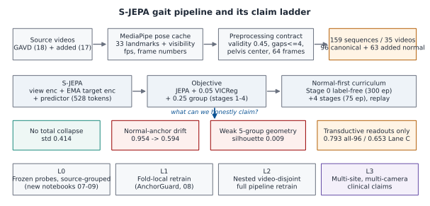
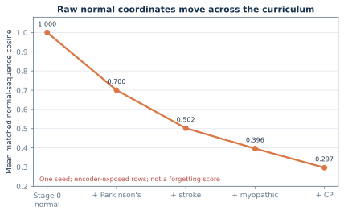

# Auditing Normal-Reference Coordinate Drift in a Staged Skeleton JEPA

*Draft for the NeurIPS 2026 Workshop on Foundation Models for the Brain and Body. Anonymous work-in-progress submission. Main text target: five pages in the workshop's modified NeurIPS 2026 style.*

## Abstract

Continual representation learning can change how a model encodes a dataset's normal-labeled reference rows. We study this problem in a project-specific, S-JEPA-inspired skeleton model trained on pose sequences extracted from public gait videos. The same model is trained first on normal-labeled gait and then on four condition-labeled groups with balanced replay. The current experiment uses no project-labeled or added-normal cohort. After availability and pose-quality checks, it contains 626 sequences from 93 source videos.

For each normal training sequence, we compare its current representation with its own Stage-0 representation, then average those cosine similarities. This raw normal-anchor cosine falls from 0.700 after the first later stage to 0.297 after the fourth. Reloading the saved checkpoints reproduces the curve within `4.51e-7`. The decline is a real change in latent coordinates, but it is not by itself proof of catastrophic forgetting: cosine is basis-dependent, the reference rows were used in training, and the experiment has one seed. Sequence-split classifiers reach 0.899 macro-F1, but all classifier test rows were seen by the label-aware encoder and 64 source videos cross the classifier split. We therefore treat those scores only as in-corpus readouts.

Our contribution is an auditable measurement protocol and a clear account of what is still needed to turn coordinate drift into a functional-retention claim: alignment-invariant representation comparisons, matched optimization controls, multiple seeds, and full source-video-disjoint retraining. The study is not a diagnostic or clinical-validation result.

## 1. Introduction

Models of movement often learn from a normal reference and then adapt to new tasks or populations. If the reference changes during adaptation, every later comparison to "normal" can also change. A simple audit is to save each normal sequence representation after initial training and compare the matched representations after every later stage.

That audit is useful, but its interpretation needs care. Neural features do not have a fixed coordinate system. Two encoders can represent the same structure in rotated bases and have a low raw cosine similarity. A falling anchor can therefore reveal **coordinate drift** without proving that useful knowledge was lost. Functional forgetting requires additional evidence, such as worse performance on held-out normal data or worse prediction under a basis-invariant comparison.

We apply this distinction to a normal-first skeleton JEPA variant for gait. The experiment is small enough to inspect end to end, yet large enough to expose common evaluation failures: source-video overlap, label-aware encoder exposure, pose-detector shortcuts, stale experiment lineage, and one-seed conclusions.

Our contributions are:

1. an artifact-recomputed raw normal-anchor curve for a five-stage, S-JEPA-inspired gait model;
2. a claim audit that separates coordinate drift, in-corpus separability, functional retention, and out-of-source generalization;
3. current controls for detector missingness, temporal readout, and signed laterality; and
4. a concrete minimum experiment set for a stronger continual-learning claim.

{width=90%}

## 2. Related work

JEPAs learn by predicting target-encoder features rather than reconstructing every input value. I-JEPA applies this idea to images [1], V-JEPA to video [2], and S-JEPA to skeleton sequences [3]. Our model is not a reproduction of the published S-JEPA. It replaces motion-aware masking with uniform sampling from a fixed 12-landmark whitelist, adds VICReg [4], and adds a label-aware group loss after Stage 0. Continual-learning methods such as replay, regularization, and distillation aim to preserve earlier capabilities while new tasks are learned.

Our study differs from an action-recognition benchmark or clinical classifier. It audits a continually updated representation and asks which conclusions are supported by its artifacts.

## 3. Method

### 3.1 Data and quality filtering

GAVD provides video-linked rows with one of five folder annotations: normal, Parkinson's, stroke, myopathic, or cerebral palsy [5]. These labels are dataset annotations, not diagnoses made by this project.

The raw local inventory has 666 sequences from 103 source videos. A download and availability audit retained 642 sequences from 94 videos. We then required at least 0.50 observed fraction over the 12 gait-focused landmarks used as masking targets. Sixteen rows failed this check, leaving the current cohort:

|Dataset annotation|Sequences|Source videos|
|---|---:|---:|
|Normal|270|29|
|Parkinson's|41|9|
|Stroke|74|18|
|Myopathic|183|28|
|Cerebral palsy|58|9|
|**Total**|**626**|**93**|

The optional added-normal path is disabled. All current training rows come from GAVD. Across the 642 availability-filtered pose caches, 546 rows report extraction version `gavd5`, 95 report `gavd3`, and one reports `gavd4`; after coverage filtering, the 626 modeled rows contain 530, 95, and 1, respectively. They share the recorded pose-model hash, but the version mix can still act as a provenance shortcut and must be controlled in a generalization study. GAVD does not provide a reliable person identifier for this analysis, so grouping by source video cannot guarantee person-level separation.

### 3.2 Pose processing and tokens

MediaPipe BlazePose produces 33 landmarks and visibility values per frame. Short internal gaps are interpolated, each sequence is pelvis-centered and body-scale normalized, and time is resized to 64 frames. A token contains one landmark over four frames, giving 16 time patches by 33 landmarks, or 528 tokens. Missing or low-visibility target tokens are excluded by a validity mask.

Training targets are sampled only from 12 landmarks: shoulders, hips, knees, ankles, heels, and foot tips. The configured 0.60 mask fraction is applied to the smallest eligible-token count in the batch so every sample has the same number of targets.

### 3.3 Model, objective, and curriculum

This project-specific skeleton JEPA variant has a view encoder, an exponential-moving-average target encoder, and a predictor. The encoder width is 96, with four encoder blocks and two predictor blocks. Its objective is

$$
\mathcal L = \mathcal L_{\mathrm{JEPA}}
+ 0.05\,\mathcal L_{\mathrm{VICReg}}
+ 0.25\,\mathcal L_{\mathrm{group}}.
$$

The JEPA term predicts centered and sharpened target features at masked tokens. VICReg is label-free. The group term is zero during normal-only Stage 0 and is label-aware afterward: it encourages within-condition compactness and a margin between condition centroids.

One model continues through all five stages. Stage 0 trains for 300 epochs on 270 normal rows. Each later stage adds one condition, uses balanced replay over all active conditions, and trains for 75 epochs. The run has 600 curriculum epochs and 40,800 optimizer updates. All reported training results use seed 42.

Model weights, the EMA target encoder, target center, and VICReg projector continue across stages. AdamW is restarted at each stage with betas (0.9, 0.95), weight decay 0.05, learning rate $10^{-3}$ at Stage 0, and $3\times10^{-4}$ later. Each batch draws four rows per active condition. The saved run reports the MPS backend. The exact hardware model and full deterministic-computation settings were not recorded; this is a reproducibility gap.

### 3.4 Normal anchor

Let $z_0(x)\in\mathbb R^{96}$ be the Stage-0 target-encoder summary for a normal sequence $x$: the validity-weighted mean of its target-encoder tokens at the 12 authorized landmarks. After stage $t$, we encode the same sequence again and report the mean matched-sequence cosine

$$
a_t = \frac{1}{|N|}\sum_{x\in N}
\frac{z_t(x)^\top z_0(x)}{\lVert z_t(x)\rVert_2\lVert z_0(x)\rVert_2}.
$$

The calculation does not compare cohort centroids and does not use later disorder labels, but it does require a known normal reference set. It weights sequences equally, not source videos equally. The two largest normal videos contribute 105 of 270 rows (38.9%), and the three largest contribute 137 (50.7%). The 270 matched normal rows were also used in training, so this is training-corpus telemetry rather than a held-out or population-level retention score.

### 3.5 Evaluation and claim levels

We separate four questions:

|Question|Current evidence|Allowed wording|
|---|---|---|
|Did raw latent coordinates change?|Saved checkpoints and anchor recomputation|Coordinate drift|
|Did normal capability get worse?|Not tested on held-out normal data|No forgetting claim|
|Are current labels readable in-corpus?|Frozen 384-D features and Random Forest probes|Descriptive readout|
|Does the system generalize?|No fold-local encoder retraining|No generalization claim|

## 4. Results

### 4.1 Raw normal-anchor drift is substantial in this run and checkpoint-recomputable

The anchor cosines after the four later stages are **0.7002, 0.5021, 0.3962, and 0.2966**. Recomputing the curve from the five frozen checkpoints gives a maximum absolute difference of `4.51e-7` from the saved stage summary.

{width=82%}

The curve is the strongest verified result in the current workspace. It should not be called catastrophic forgetting. We have not yet removed global basis rotation, compared against a same-duration normal-only control, changed the condition order, or repeated the run with other seeds.

### 4.2 The final representation is separated in-corpus

At Stage 4, the 96-D authorized target-token means have feature standard deviation 0.229 and mean pair cosine similarity 0.440. Their smallest condition-centroid distance is 0.534, measured as Euclidean distance between normalized centroids. A separate frozen analysis concatenates global mean, global standard deviation, authorized-landmark mean, and authorized-landmark standard deviation into a 384-D vector. In that space, cosine silhouette is 0.3617, mean within-condition cosine distance is 0.0783, and minimum between-centroid cosine distance is 0.0863.

These values rule out total constant collapse and show in-corpus structure. They do not show an invariant clinical representation because the group loss used the same condition labels during encoder training.

### 4.3 Classifier scores are optimistic descriptive readouts

|Five-class probe|Accuracy|Balanced accuracy|Macro-F1|
|---|---:|---:|---:|
|All 626 rows, sequence split|0.9202|0.9001|0.8985|
|Exact historical 47/21 split|0.8571|0.8800|0.8607|
|Missingness only, all-row split|0.4415|0.4269|0.3547|

In the all-row split, 438 rows fit the classifier and 188 rows test it. All 188 test rows were already used by the encoder, 64 source videos appear on both sides of the classifier split, and 181 of 188 test sequences come from those shared videos. In the exact split, all 9 test videos overlap classifier training. The scores therefore show that the trained features encode the in-corpus labels; they do not estimate performance on a new video or person. Grouped validation is required when rows share a source [6].

The missingness control shows that detector visibility alone contains label signal. Its accuracy is close to the 0.431 majority-class accuracy, while its macro-F1 is substantially below the model-variant readout. It is a warning about shortcuts, not a complete explanation of that score.

### 4.4 Secondary representation probes

Neither the pre-specified temporal-moment readout nor the signed-laterality probe clears its own success gates. Both ridge studies emitted numerical ill-conditioning warnings and lack repeated grouped-split uncertainty, so their small learned-versus-untrained differences are inconclusive. Appendix D gives the cohort, target, and gate details.

## 5. Discussion

An adversarial artifact audit excluded five stale, mixed-lineage, or incorrectly gated result families, including the current workspace's old augmented-normal ablation, AnchorGuard, grouped-classifier, and forecasting outputs. Appendix B records the exclusions.

The experiment establishes that this staged skeleton JEPA variant undergoes a substantial raw-coordinate change in this run: its mean matched-sequence cosine reaches 0.297 after later label-aware training. Reloading the saved seed-42 checkpoints reproduces the logged curve within `4.51e-7`. That observation is useful telemetry and identifies a phenomenon whose functional risk should be tested.

The experiment does not yet establish forgetting. Three alternatives remain:

- the entire representation may rotate while preserving its information;
- the anchor may move because optimization continues, even without new conditions; and
- the observed curve may be specific to seed 42 or to the fixed curriculum order.

The current classifiers cannot resolve these alternatives because they are trained after the final stage, use an encoder exposed to every row, and partly share source videos. Stronger evidence needs both representation-level and function-level controls.

The work also has broader data limits. Source video is not the same as person; the same person may appear in more than one upload. Folder annotations are not independently adjudicated clinical diagnoses. Camera, compression, framing, pose-estimator behavior, and extraction-version history can correlate with labels. No result here supports clinical use.

The anchor also has source imbalance. A sequence-weighted mean lets a 60-row video influence the curve 60 times more than a one-row video. Multiple training seeds do not solve that pseudoreplication.

### Data use and ethics

GAVD distributes annotations and video URLs, not raw videos; users retrieve media independently and must follow YouTube terms, institutional ethics requirements, and applicable copyright, privacy, and data-protection rules [7]. This analysis uses derived pose sequences and does not infer identity. A public paper artifact should not redistribute raw videos or identity-bearing frames. The current workspace does not contain a documented institutional ethics determination or a completed data-use review. The authors must resolve and record both before submission.

## 6. Experiments required for strong claims

The minimum P0 set is three to five full-curriculum seeds; equal-video-weighted anchors with source-cluster uncertainty; Procrustes plus CKA or SVCCA; same-update continued-normal and joint-training controls; and retraining with source-grouped normal holdout. A condition-order control is also needed to separate the fixed curriculum from a general trend. Appendix C maps the remaining mechanism, probe, generalization, and clinical claims to their required experiments. For the September 5 deadline, the defensible choice is an explicitly preliminary audit paper, not a strong forgetting or repair paper.

## 7. Conclusion

The current GAVD-only experiment shows a substantial raw normal-anchor change in this run that is checkpoint-recomputed within `4.51e-7`: 0.700 after the first later stage and 0.297 after the fourth. It also shows that high in-corpus decoding can coexist with this drift. Neither observation alone proves forgetting or generalization. The main lesson is methodological: representation drift, functional retention, and clinical performance are different claims and need different experiments.

## Appendix A. Reproducibility ledger

- **Analyzed cohort:** 626 sequences from 93 videos; condition counts 270 / 41 / 74 / 183 / 58. Sources: `sequence_embeddings.parquet` and `classifier_pose_coverage.csv`.
- **Final dataset fingerprint:** `7d13841aceac9eda843d43ca8434193e294d2fa10a48b6c6d21f6413a6e457e2`. Source: `classifier_contract.json`.
- **Final checkpoint SHA-256:** `64008d77689cefa4beb51a0dcf5ed6cae743454134c163e9087f66510af4e7ad`. Source: `sjepa_curriculum_final.pt`.
- **Anchor curve:** 0.700151 / 0.502113 / 0.396213 / 0.296638. Source: `curriculum_stage_summary.csv`.
- **Checkpoint recomputation gap:** maximum absolute difference `4.51e-7`, verified by reloading the five checkpoints in notebook 08.
- **Final 384-D geometry:** silhouette 0.361717; minimum between-centroid distance 0.086261; within-condition distance 0.078339. Source: `curriculum_representation_geometry.csv`.
- **All-row readout:** accuracy 0.920213; macro-F1 0.898512. Source: `classifier_metrics.csv`.
- **All-row missingness control:** accuracy 0.441489; macro-F1 0.354682. Source: missingness-control metrics CSV.
- **Temporal readout:** pre-specified lane fails both gates. Source: `temporal_readout_results.json`.
- **Laterality:** weak learned advantage; sign and mirror gates fail. Source: signed-laterality result JSON.

## Appendix B. Excluded artifact families

1. The Stage-1 margin ablation in notebook 08 loads an old augmented Stage-0 checkpoint. Its with-margin run also fails to reproduce the current canonical Stage-1 anchor. It cannot attribute the drift mechanism.
2. The cached AnchorGuard checkpoint has no complete dataset or parent lineage, and notebook 08 carries a stale augmented fingerprint. Its results are not a verified intervention on the current run.
3. The saved grouped "Lane C" classifier file names the old augmented encoder and 159-row cohort. It is not current evidence.
4. Notebook 09 hard-codes the old augmented checkpoint while evaluating the new canonical rows. Its forecasting and surprise file is a hybrid artifact.
5. The AnchorGuard non-inferiority code uses absolute difference from baseline. A non-inferiority gate should be one-sided; an improvement should not fail merely because its magnitude exceeds 0.05.

All five result families are excluded from the current claims.

## Appendix C. Experiment-to-claim map

- **P0, repeatability:** repeat the full curriculum for at least three, preferably five, seeds and report the stage-wise distribution.
- **P0, independent unit:** report per-video anchor distributions, an equal-video-weighted curve, and source-cluster uncertainty; test source-balanced replay.
- **P0, basis invariance:** align stage representations with orthogonal Procrustes and report linear CKA or SVCCA.
- **P0, optimization controls:** compare the staged run with continued-normal and joint-training controls using matched updates.
- **P0, function:** reserve source-grouped normal data before training, retrain, and measure its JEPA loss and normal-versus-perturbed ranking at every stage.
- **P1, mechanism and repair:** rerun matched group-loss ablations, fix AnchorGuard lineage and one-sided gates, and use identical random streams with multiple seeds.
- **P1, probe stability:** rerun the ridge probes with a stable SVD-based solver, regularization sensitivity checks, repeated grouped splits, label permutation, and raw, untrained, and nuisance-feature controls.
- **P1, generalization:** fit preprocessing, encoder, and readout inside every outer source-video fold.
- **P2, clinical direction:** audit person identity, site, camera, and pose missingness, then add an external cohort.

## Appendix D. Secondary probe details

A source-grouped ridge study compares the deployed 384-D pooling with a signed temporal moment, four time-bin means, and learned attention pooling. The pre-specified temporal-moment lane does not clear its rule of at least 10% lower pooled error and improvement in at least 75% of source videos. Its relative pooled improvements for the three order-sensitive targets are 4.0%, -1.9%, and 9.2%. Target counts vary from 539 to 626, and the study has no repeated-split interval. Cadence and stride-time have low $R^2$ across the tested lanes. That result is compatible with omitted native duration, but it does not prove that fixed-length resizing caused the weakness.

For signed laterality, learned tokens reach $R^2=0.241$ and an untrained encoder reaches 0.190. The raw-feature score near 1.0 is only a construction check because the target is built from those raw signed-excursion features. Only 55.3% of sources have the expected sign, and the mirror slope is -0.627, outside the required -1.25 to -0.80 range. This probe uses the broader 642-row, 94-video availability cohort and five grouped folds, so it is not cohort-matched to the primary analysis.

Both ridge probes emitted many numerical ill-conditioning warnings and have no repeated grouped-split uncertainty. They need a stable solver, regularization sensitivity analysis, and repeated grouped splits before interpretation.

{width=82%}

## Appendix E. References

1. M. Assran et al. “Self-Supervised Learning from Images with a Joint-Embedding Predictive Architecture.” *CVPR*, 2023. doi:10.1109/CVPR52729.2023.01499.
2. A. Bardes et al. “Revisiting Feature Prediction for Learning Visual Representations from Video.” *TMLR*, 2024.
3. M. Abdelfattah and A. Alahi. “S-JEPA: A Joint Embedding Predictive Architecture for Skeletal Action Recognition.” *ECCV*, 2024. doi:10.1007/978-3-031-73411-3_21.
4. A. Bardes, J. Ponce, and Y. LeCun. “VICReg: Variance-Invariance-Covariance Regularization for Self-Supervised Learning.” *ICLR*, 2022.
5. R. Ranjan et al. “Computer Vision for Clinical Gait Analysis: A Gait Abnormality Video Dataset.” *IEEE Access* 13, 45321–45339, 2025. doi:10.1109/ACCESS.2025.3545787.
6. D. R. Roberts et al. “Cross-Validation Strategies for Data with Temporal, Spatial, Hierarchical, or Phylogenetic Structure.” *Ecography* 40(8), 913–929, 2017. doi:10.1111/ecog.02881.
7. GAVD project. “Gait Abnormality Video Dataset: Data Access and Responsible-Use Notes.” GitHub repository, accessed September 3, 2026. https://github.com/Rahmyyy/GAVD.
