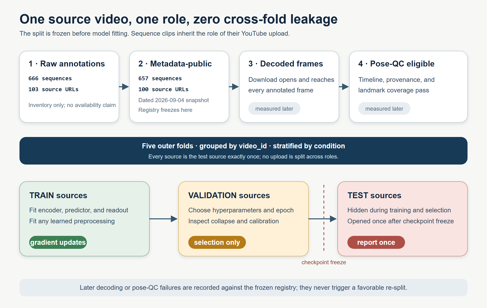

# From Public URLs to Honest Generalization: A Leakage-Aware Protocol for Continual Gait Representation Learning

*Markdown mirror of the anonymous BrainBodyFM 2026 LaTeX draft. The LaTeX file is canonical. Status: September 4, 2026.*

## Abstract

Public-video datasets make movement representation learning accessible, but they also create an evaluation problem: many annotated sequences can come from one upload, source availability changes, the same person may cross uploads, and pose-estimation failures can correlate with dataset labels. We use a project-specific, S-JEPA-inspired gait pipeline as a case study and specify a leakage-aware protocol for continual movement representation learning.

A September 4, 2026 audit retained 657 of 666 annotated sequences at the metadata gate, 655 at the decoded-span gate, and 639 from 97 source videos after pose QC. The protocol partitions sources before fitting, trains the encoder only on outer-training sources, reserves grouped validation sources for selection, and opens grouped test sources only for final evaluation. Label-free JEPA plus VICReg is primary; a label-aware condition loss is a supervised ablation.

One fully traced fold-and-seed execution verifies the mechanics and exposes an important negative result: a raw-kinematic readout outperformed the learned latent readout on 20 held-out sources. We report this as a worked execution, not a cross-fold or clinical estimate. The contribution is an auditable evaluation design and evidence discipline for behavioral foundation-model research.

## 1. Introduction

Pose extracted from video is a behavioral signal at the interface of body dynamics, environment, and sensing. It is useful for studying self-supervised and continually adapted representations, but it is vulnerable to false generalization. Excerpts from the same upload share camera, compression, demonstrator, background, and pose-estimator behavior. A random sequence split can place those signatures on both sides of evaluation.

We study these issues through a normal-first skeleton JEPA case study. The implementation is inspired by S-JEPA but is not a reproduction: it uses a fixed 12-landmark target whitelist and auxiliary VICReg, with an optional label-aware group objective.

The contributions are:

1. a dated, status-defined census of a changing public-video corpus;
2. a source-grouped train/validation/test protocol enclosing preprocessing, encoder training, and readout fitting;
3. a separation between label-free representation learning and label-informed ablation; and
4. a claim and ethics ledger for public gait video.

The case study directly connects BrainBodyFM themes of pose and movement, self-supervised and continual learning, evaluation, generalization, and reproducibility. It does not claim that this small model or corpus is itself foundation-scale.

## 2. Related work

JEPAs predict target-encoder features rather than reconstructing each input value. I-JEPA applies the idea to images [1], V-JEPA to video [2], and S-JEPA to skeleton sequences [3]. VICReg supplies invariance, variance, and covariance regularization [4]. Markerless pose makes gait analysis scalable but introduces viewpoint, visibility, and detector-dependent errors. When observations share a source, validation must respect that grouping [6].

## 3. Case-study data boundary

### 3.1 Annotations and live metadata census

GAVD provides annotations and public video identifiers for five folder categories: normal, Parkinson's, stroke, myopathic, and cerebral palsy [5]. These are dataset annotations, not diagnoses made by this project.

A fresh public-metadata check on September 4, 2026 found three sources without public metadata:

- `sf5X4YYkWUA`: private;
- `YjRoLtP1di0`: private; and
- `yULxvDc9e8c`: unavailable.

|Folder annotation|Raw sequences / videos|Metadata-public sequences / videos|
|---|---:|---:|
|Normal|291 / 32|291 / 32|
|Parkinson's|47 / 11|47 / 11|
|Stroke|76 / 19|75 / 18|
|Myopathic|188 / 30|184 / 29|
|Cerebral palsy|64 / 11|60 / 10|
|**Total**|**666 / 103**|**657 / 100**|

**Figure 1.** Dated corpus attrition at both sequence and source-video scales. The split is frozen before decode and pose-QC attrition, so later failures remove observations without changing any source's role.

"Metadata-public" means only that the service returned current metadata without authentication during this audit. It does not prove that a suitable media format can be downloaded, that the file reaches every annotated frame, that decoding succeeds, or that pose coverage is adequate. Those are later gates and must be reported separately. Availability also varies with time, region, account state, and platform behavior.

### 3.2 Pose and model case study

The pipeline extracts 33 MediaPipe landmarks and visibility values, interpolates short internal gaps, pelvis-centers and body-scale normalizes coordinates, and resizes each segment to 64 frames. A token represents one landmark over four frames. Only valid tokens from shoulders, hips, knees, ankles, heels, and foot tips may become prediction targets.

The primary objective is label-free:

$$
\mathcal L_{\mathrm{primary}}=\mathcal L_{\mathrm{JEPA}}+0.05\mathcal L_{\mathrm{VICReg}}.
$$

The historical condition-label group term directly encourages within-label compactness and between-label separation. It therefore belongs in a supervised ablation:

$$
\mathcal L_{\mathrm{ablation}}=\mathcal L_{\mathrm{primary}}+0.25\mathcal L_{\mathrm{group}}.
$$

This prevents downstream label readability from being presented as independently discovered structure.

## 4. Leakage-aware evaluation protocol

### 4.1 Split before fitting

The independent unit is the source-video ID, not a sequence row. Canonicalize video identifiers, attach the dated availability status, and assign every source to exactly one outer fold. Splits should be approximately stratified by folder annotation while balancing both source and sequence counts. Freeze the complete source lists and a split-manifest digest before model fitting.

Because the smallest categories contain only ten or eleven metadata-public sources, a single holdout is unstable. The primary estimate should use repeated source-grouped outer splits or stratified grouped cross-validation and expose split sensitivity.

**Figure 2.** Every clip inherits its source video's role. Only training sources receive gradient updates, validation sources select checkpoints, and test sources remain sealed until final evaluation.

Inside each outer split:

1. only training-source data may determine data-dependent preprocessing, quality thresholds, augmentations, model weights, or readout parameters;
2. grouped validation sources select hyperparameters, stopping rules, and checkpoints;
3. grouped test sources remain sealed until the analysis is frozen;
4. the full normal-first curriculum is retrained for every outer training fold and seed; and
5. the downstream readout is fitted only on outer-training embeddings.

A grouped classifier over embeddings from an encoder trained on all sources remains transductive.

### 4.2 Four endpoints, four claims

- **Optimization telemetry:** training-source anchor curves.
- **Functional retention:** equal-source-weighted held-out normal loss or perturbation ranking, plus source-cluster uncertainty, Procrustes alignment, and linear CKA.
- **Downstream readability:** balanced accuracy and macro-F1 from a readout fitted only on outer-training embeddings.
- **Source transfer:** source-aggregated predictions summarized across outer splits and training seeds.

None establishes person-level or clinical generalization. Minimum controls are an untrained encoder, raw pose features, pose-validity or missingness features, continued-normal training with matched updates, and joint training. The label-aware arm is separate. Condition order must vary across seeds or appear as a sensitivity analysis.

## 5. Worked protocol execution

We executed outer fold 0 with seed 42 to test the complete artifact and isolation contract. Pose QC left 377 sequences from 59 training sources, 131 from 18 validation sources, and 131 from 20 test sources. Encoder fitting loaded only training tensors; checkpoint selection used validation loss; the serialized checkpoint records that test tensors were not opened. The five curriculum stages used 20 epochs each and saved a hash-bound checkpoint plus stage lineage.

After selection was frozen, source-level readouts were evaluated once on the 20 test sources. Macro-F1 was 0.292 for the S-JEPA latent, 0.251 for a missingness-only control, and 0.441 for raw kinematics. Thus this small learned representation did not beat the direct sensor-derived baseline in the worked fold. Normal-anchor cosine fell to 0.701 on five validation-normal sources after the full curriculum and was 0.850 on seven test-normal sources. Temporal probes retained some peak-phase and energy-ratio information but produced negative R-squared for phase lag. These results validate the protocol implementation and comparison set; with one fold and seed they do not estimate expected generalization.

**Figure 3.** Worked protocol-v2 execution. Validation selects within each curriculum stage; the raw-kinematic control exceeds the latent and missingness readouts; normal-anchor retention is selected before one test-normal evaluation; and temporal-probe results retain negative values. This is an execution audit, not a cross-fold estimate.

Historical artifacts from the earlier sequence-level pipeline remain archived, not pooled with these values: those splits allowed source overlap, exposed evaluation rows to representation learning, and sometimes used folder labels during encoder training. A primary performance claim still requires all outer folds, multiple seeds, source-cluster uncertainty, and condition-order sensitivity.

## 6. Limitations, data use, and ethics

Source video is only the strongest available grouping key. GAVD does not provide a reliable person identifier here, so the same person may cross folds through different uploads. Folder labels are not independently adjudicated by this project. Camera, compression, framing, clothing, mobility aids, demographic representation, editing, and pose-estimator visibility may correlate with labels. Report "source-held-out," never "subject-held-out" or clinical performance.

Public availability is not equivalent to research consent or unrestricted reuse. GAVD distributes annotations and URLs rather than raw video and places retrieval, platform compliance, institutional ethics approval, copyright, privacy, and data-protection obligations on users [7]. Gait and derived skeleton trajectories can be identifying even without faces. Public artifacts should contain neither raw videos nor identity-bearing frames, and access to derived trajectories should be risk assessed. Record an ethics determination, retention and access controls, and a takedown procedure before release. Avoid stigmatizing language and never present observational folder labels as diagnoses. Nothing here supports diagnosis, treatment, surveillance, or deployment.

## 7. Conclusion

Behavioral foundation-model evaluation begins before training: with a dated source census, an explicit unit of independence, and a sealed evaluation path. In this case study, nine annotated sequences lost public metadata when three of 103 source videos became private or unavailable. Metadata visibility is only the first data-validity gate.

The proposed protocol keeps source videos disjoint throughout preprocessing, encoder learning, model selection, and downstream evaluation; separates label-free training from supervised ablation; and distinguishes retention, readability, source transfer, and clinical validity. One traced fold demonstrates that this discipline changes the scientific conclusion: the raw-kinematic baseline, not the learned latent, was strongest. Multi-fold performance remains pending.

## Appendix A. Required run manifest

Record source-manifest and availability-audit hashes; audit time, status definitions, and tool versions; decoded-frame and pose-quality decisions; source-level outer and validation split IDs; preprocessing configuration; label-use declaration; model and optimizer configuration; seed, condition order, hardware, and deterministic settings; parent and checkpoint hashes; exclusion reasons; and source-level predictions. Generate paper tables and figures from this manifest.

## Appendix B. Claim ledger

|Claim|Required evidence|Current status|
|---|---|---|
|Current metadata census|Dated per-source audit|Supported|
|Decoded/pose-usable cohort|Frame and pose gates|Supported by dated audit|
|Normal-function retention|Held-out normal sources|One fold/seed; exploratory|
|Unseen-source performance|Fold-local full retraining|One fold/seed; incomplete|
|Unseen-person performance|Reliable person groups|Not identifiable|
|Clinical validity|External adjudicated cohort|Not studied|

## References

1. M. Assran et al. "Self-Supervised Learning from Images with a Joint-Embedding Predictive Architecture." *CVPR*, 2023.
2. A. Bardes et al. "Revisiting Feature Prediction for Learning Visual Representations from Video." *TMLR*, 2024.
3. M. Abdelfattah and A. Alahi. "S-JEPA: A Joint Embedding Predictive Architecture for Skeletal Action Recognition." *ECCV*, 2024.
4. A. Bardes, J. Ponce, and Y. LeCun. "VICReg: Variance-Invariance-Covariance Regularization for Self-Supervised Learning." *ICLR*, 2022.
5. R. Ranjan et al. "Computer Vision for Clinical Gait Analysis: A Gait Abnormality Video Dataset." *IEEE Access* 13, 2025.
6. D. R. Roberts et al. "Cross-Validation Strategies for Data with Temporal, Spatial, Hierarchical, or Phylogenetic Structure." *Ecography* 40(8), 2017.
7. GAVD project. "Gait Abnormality Video Dataset: Data Access and Responsible-Use Notes." GitHub repository, accessed September 4, 2026. https://github.com/Rahmyyy/GAVD.
