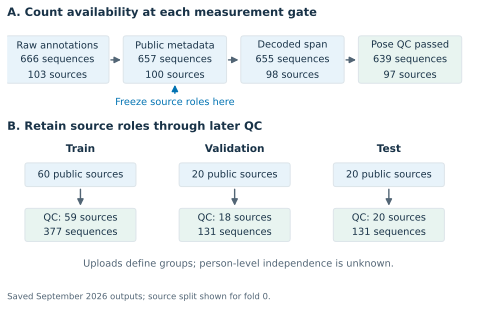
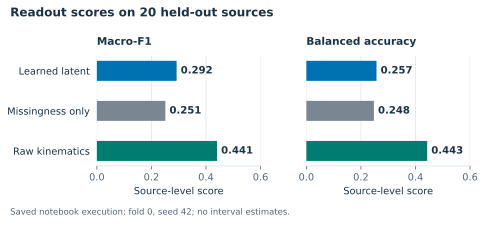
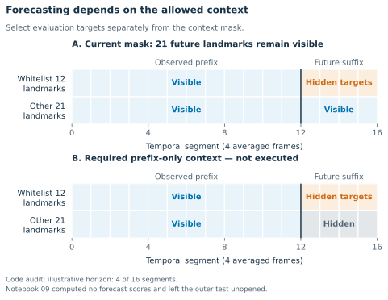

## Abstract

Video-derived pose provides an accessible setting for testing what movement representations preserve. This companion explains two related experiments with distinct evidence. Study A is the retained *neurips-brain-body* classification pilot: 639 sequences from 97 sources, with 20 test sources in outer fold 0, seed 42. Raw pose features achieve macro-F1 0.441, compared with 0.292 for learned features and 0.251 for missingness. Temporal and drift diagnostics expose further limitations, while current checkpoint/evaluation bundles remain absent. Study B imports the completed *neurips-laterality* experiment: 625 sequences from 93 sources, five outer folds, five seeds, and two training variants. Its artifacts and primary report calculations were independently checked locally. Reflection augmentation reduces strict token error by 0.00843, with 95% source-bootstrap interval [0.00687, 0.01020], while its predictive improvement remains uncertain. A constrained odd readout enforces sign reversal, yet its learned features underperform their matched initialization by 0.05874 in predictive $R^2$. These results support an evaluation contribution: geometric consistency and a guaranteed output rule should be distinguished from useful information acquired in pretraining. The cohorts overlap and cannot be pooled or treated as independent replication. The revised submission-readiness index is 72/100, a judgment rather than acceptance odds; submission remains blocked by three unresolved project reviews.

## 1. The question this study can answer

The practical question is whether a representation learned by predicting hidden parts of a pose sequence makes useful movement information accessible on new recordings. That question has several possible answers. A representation may help predict an annotation while being poor at a timing task, or its coordinates may change during further training while a downstream task remains easy. The notebooks are most informative when these outcomes are kept separate.

This is a relevant question for BrainBodyFM 2026. The workshop explicitly includes video-derived pose and other behavioral signals, and its current scope gives particular attention to movement and to evaluating whether pretraining helps. Its audience therefore has reason to examine a careful movement-representation case study even when the model and dataset are small. [Workshop overview](https://brainbodyfm-workshop.github.io/) and [call for papers](https://brainbodyfm-workshop.github.io/call-for-papers.html).

The original pilot shows that learned features underperform simple pose statistics in its available held-out-source comparison. The newly integrated laterality study supplies the stronger controlled result: reflection augmentation improves a specified token-symmetry metric, without establishing a predictive advantage, and enforcing an output sign rule does not establish a benefit from pretraining. The two studies address complementary questions; the laterality experiment cannot identify the cause of the pilot's classification result.

The project uses a compact, S-JEPA-inspired implementation. Published S-JEPA studies latent prediction for skeleton-based action recognition; the model here changes important architectural and objective choices and should be treated as its own implementation. The present results therefore do not re-evaluate the published S-JEPA benchmark claims. [Abdelfattah and Alahi, S-JEPA](https://www.ecva.net/papers/eccv_2024/papers_ECCV/papers/04755.pdf).

There are no paired neural recordings, wearable signals, interventions, or interactive control experiments in this package. Video pose supplies an indirect observation of behavior. A connection to neural representation learning is a research motivation, whereas neural mechanisms, multimodal transfer, and closed-loop control remain outside the evidence.

### How to read this companion

Sections 3–9 explain Study A's workflow, and Section 10 walks through the separate, completed Study B. Each step explains the operation, the relevant numerical evidence, and what can reasonably be inferred. Section 11 assesses the contributions individually; Section 13 provides an internal submission-readiness score and a same-day revision plan. The appendices map the discussion to notebook cells and document corrections to the earlier papers. This is an extended explanatory companion, not a five-page submission manuscript.

## 2. Establish the evidence before interpreting the results

The folder contains a short manuscript, a submission-readiness guide, teaching notebooks, executed diagnostics, and archived exploratory branches. They describe different stages of the project. This review gives priority to the latest executed code paths and their saved outputs over older narrative descriptions.

For Study A, five outer folds are registered, but only outer fold 0 with seed 42 supplies the retained execution discussed in Sections 3–9. Its output reports 59 training sources, 18 validation sources, and 20 test sources after quality control. Other Study A folds and seeds remain incomplete. Its performance tables are single-execution summaries without cross-fold estimates or uncertainty intervals. Study B has completed five-fold, five-seed evaluation and source-bootstrap intervals; those separate results appear in Section 10.

Study A's saved notebooks report checkpoint lineage and manifest/split hash checks. However, its corresponding current evaluation-protocol, checkpoint, and fold-evaluation bundles are not present in this checkout. We can inspect the code, check the internal consistency of printed results, and reproduce the figures from those records. We cannot independently regenerate the embeddings or verify the checkpoint bytes here. Reported hashes identify the recorded execution; their presence alone does not replace the missing artifacts.

Study B has a stronger local evidence record. Its cohort, source splits, 50 trained checkpoints, and 100,000 held-out prediction rows across 16 lanes passed the current loader's integrity checks. Recomputing its predictive and strict-token bootstrap tables in memory reproduced the saved reports to within $10^{-16}$. This is artifact and calculation verification, without retraining. Both studies share underlying GAVD recordings, so the laterality findings add a controlled task and repeated evaluation, not an independent dataset.

Four evidence categories are useful throughout the paper:

| Evidence category | What it establishes here |
|---|---|
| Retained execution | A Study A numerical output saved in a current notebook, with its stated fold and protocol context |
| Verified fitted-artifact analysis | Study B checkpoints/predictions pass integrity checks and primary report calculations reproduce from those predictions; no fresh training |
| Implementation or algebra check | A property visible in code, or a controlled mathematical example; no empirical performance claim follows automatically |
| Proposed or archived analysis | A future experiment, simulated outcome, or older transductive result that is excluded from the current result tables |

This distinction also applies to test isolation. Notebook 04 avoids loading test pose tensors during encoder fitting and checkpoint selection. Later notebooks use test data for their specified evaluations, including geometry inspection. Those code-path checks support separation of fitting and testing within the recorded workflow; they cannot establish that no researcher ever inspected those sources or results elsewhere.

## 3. Step 1 — define the cohort and the unit of evaluation

### 3.1 Follow a sequence through the data gates

Begin with the project’s five GAVD-derived annotation manifests. These describe normal, Parkinson’s, stroke, myopathic, and cerebral-palsy categories. Throughout this paper these names refer to dataset annotations, without independent diagnostic adjudication by this project. GAVD distributes annotations and source-video references rather than the raw videos themselves. [GAVD data-access documentation](https://github.com/Rahmyyy/GAVD).

A sequence is an annotated excerpt; a source is the upload from which one or more excerpts were taken. The distinction matters because several excerpts can share a camera, editing pattern, demonstrator, or pose-extraction failure. Counting them as independent recordings can make evaluation appear more precise than it is.

The local September 4, 2026 availability snapshot, whose timestamps extend into September 5 UTC, records the following progression. These are the project’s selected manifests, not a claim about the size of all GAVD.

| Gate | Sequences | Source videos | Annotated frames |
|---|---:|---:|---:|
| Raw manifests | 666 | 103 | 140,641 |
| Public metadata available | 657 | 100 | 137,690 |
| Download/decode span eligible | 655 | 98 | 135,804 |
| Pose-quality eligible | 639 | 97 | 134,259 |

Metadata availability means that the platform returned public metadata at the dated check. The next gate asks whether usable media covers the annotation span. One rejected media file contained 228 frames when the annotations required frame 458; another source remained unavailable to the acquisition procedure after four client strategies. Neither outcome can be inferred from a successful metadata lookup.

The final gate applies a fixed minimum observed fraction of 0.50 to the selected movement landmarks. Notebook 02 reports that all 655 locked pose caches passed structural/provenance readiness checks, while 639 passed this quality threshold. Cache readiness and movement-observation quality therefore have separate denominators. A recorded 641-cache provenance migration attached or checked metadata; it did not rerun the pose estimator. One additional cache outside the locked manifest was excluded.

{width=100%}

### 3.2 Freeze source roles before later attrition

The split registry operates on the 100 metadata-public sources. A deterministic constrained allocation assigns sources to five outer folds while balancing annotation-specific source counts and clip counts. Each outer-fold configuration initially has 60 training, 20 validation, and 20 test sources. All sequences from one source inherit the same role.

Download and pose failures are then applied without redrawing the split. For fold 0, the final roles are:

| Annotation | Train seq. | Train sources | Val. seq. | Val. sources | Test seq. | Test sources |
|---|---:|---:|---:|---:|---:|---:|
| Normal | 156 | 18 | 64 | 5 | 56 | 7 |
| Parkinson’s | 28 | 7 | 9 | 2 | 9 | 2 |
| Stroke | 44 | 11 | 15 | 4 | 15 | 3 |
| Myopathic | 111 | 17 | 35 | 5 | 37 | 6 |
| Cerebral palsy | 38 | 6 | 8 | 2 | 14 | 2 |
| Total | 377 | 59 | 131 | 18 | 131 | 20 |

For example, the 56 normal test sequences are evaluated as seven source observations. Aggregation gives each upload equal weight in the final normal-category evaluation, although some dependence may remain across uploads.

Source-disjoint evaluation remains weaker than person-disjoint evaluation because a person may appear in multiple uploads. Reliable person identifiers are unavailable here. The current protocol addresses a known recording-level dependence; it does not demonstrate generalization to unseen people.

## 4. Step 2 — turn pose estimates into model inputs

### 4.1 Keep coordinates and observation validity separate

Each pose cache contains an array with shape $[T,33,4]$: a timeline of 33 landmarks, each with three estimated coordinates and a visibility value. A landmark observation is considered valid when its coordinates are finite and visibility is at least 0.45.

In the training implementation, subtract the estimated hip midpoint at each frame and divide by a within-clip scale based on shoulder and hip separation. Replace remaining nonfinite coordinates with zeros, then linearly resize the timeline to the configured number of frames. The real-mode default is 64. Validity is resized separately and thresholded at 0.5.

This normalization reduces dependence on position and body size in the image, but does not calibrate a physical measurement system. The coordinate channels include image-related coordinates and estimated depth, so normalized distances are not metres. After whole-clip time resizing, adjacent-step differences refer to normalized clip time rather than speed in metres per second. A slow and a fast clip can have the same number of input frames.

Two implementation details qualify the interpretation. First, notebook 04 retains finite coordinates even when their visibility is below the validity threshold. Second, naturally invalid token positions remain in the Transformer’s attention layout without a padding mask. Invalid positions are excluded from target selection and pooling, but their coordinate placeholders can still influence valid contextual tokens. A validity mask therefore does not by itself establish robustness to missing-data handling.

Notebooks 07–09 use a different preparation path: they interpolate internal gaps of up to four frames and mask remaining invalid coordinates before normalization. Notebook 04 does not perform that short-gap interpolation. The temporal and drift results should be understood as diagnostics under this modified preprocessing, rather than evaluations of a completely identical preprocessing pipeline.

### 4.2 Understand what one token contains

The trained encoder groups four consecutive frames at each joint and averages their three-coordinate vectors. It then projects those three numbers into an embedding, adds learned joint and temporal positions, and processes the resulting tokens with a Transformer.

With the 64-frame default, there are

$$
S=64/4=16 \text{ temporal segments}, \qquad
S\times J=16\times33=528 \text{ joint-time positions}.
$$

A token is valid only if all four contributing observations are valid. Averaging has a real representational consequence: within a fixed four-frame patch, coordinate permutations with the same mean are indistinguishable to this patch projection. Order between patches can still be represented through temporal positions and contextual attention. This is one plausible limitation to investigate in timing tasks, although the existing experiments do not isolate its effect.

### 4.3 Use the correct masking denominator

Targets may be sampled only from 12 landmarks: the two shoulders, hips, knees, ankles, heels, and foot tips. In the MediaPipe index convention these are 11, 12, and 23–32. The whitelist supplies an anatomical prior; it is neither a learned selection nor a neurologically validated importance ranking.

At most $16\times12=192$ positions are eligible. If all are valid, a 60% eligible-target mask hides $\lfloor0.60\times192\rfloor=115$ positions, or about 21.8% of the full 528-position layout. In a batch with variable validity, the smallest eligible count sets a common number of targets per example, so the realized fraction can be lower.

Notebook 03’s saved mask checks report approximately 0.216 global masking and 0.594–0.600 masking among eligible positions. The checks confirm that sampled targets respect eligibility and visibility. They do not show that this masking choice improves a downstream result.

It helps to distinguish three operations: source splitting decides which recordings may inform fitting; validity marks which pose estimates qualify as observed; target masking deliberately hides some otherwise eligible inputs for the learning task. They address different problems and cannot substitute for one another.

## 5. Step 3 — train the current latent-prediction model

### 5.1 Work through one update

The implementation follows the general joint-embedding idea of predicting target-encoder features from partial context. Such feature prediction is established in the JEPA literature. [Assran et al., I-JEPA](https://arxiv.org/abs/2301.08243).

For one batch, the current training path performs the following operations:

1. Sample a training source uniformly, then a sequence uniformly from that source, repeating with replacement until the batch is full. This reduces domination by sources with many sequences, although conditions themselves are not sampled equally.
2. Prepare the pose arrays and sample valid targets from the 12-landmark whitelist.
3. Replace selected input tokens with a learned mask token. Keep the complete joint-time layout, including the target positions, in the online Transformer.
4. Average the visible-valid contextual token features. Add the learned position vector at each joint-time position and apply an MLP predictor across the layout; the loss will score only the selected targets.
5. Encode the complete clip with the target encoder, without gradients, and compare predicted and target features at the hidden positions.
6. Update the online encoder, predictor, and regularization projector; update the target encoder by an exponential moving average of online weights.

Visible context can include times before and after a hidden target. The loss therefore evaluates contextual infilling; a prefix-only forecasting experiment needs the additional restrictions discussed in Step 7.

{width=100%}

For online weights $\theta$ and target weights $\bar\theta$, the target update is

$$
\bar\theta \leftarrow \tau\bar\theta+(1-\tau)\theta,
$$

with default $\tau=0.996$. This makes the feature target change gradually during training. The target branch receives no optimizer gradient.

The current primary loss is

$$
\mathcal L =
\mathcal L_{\mathrm{SmoothL1\ latent}}
+0.10\,\mathcal L_{\mathrm{variance}}
+0.01\,\mathcal L_{\mathrm{covariance}}.
$$

The first term compares predicted and target embeddings only at the sampled hidden positions. The variance term penalizes projected batch features whose standard deviation falls below one; the covariance term penalizes off-diagonal covariance. These are VICReg-style regularizers on pooled features, without a separate two-view invariance term. The published VICReg objective provides the background for this choice, but the local implementation does not apply the complete objective unchanged. [Bardes, Ponce, and LeCun, VICReg](https://arxiv.org/abs/2105.04906).

An optional supervised ablation adds condition-classification cross-entropy with weight 0.10. It is disabled in the primary run. This differs from older manuscript descriptions of a 0.25 centroid-based group penalty and a single 0.05 VICReg weight.

### 5.2 Separate the teaching model from the trained model

Notebook 00 is useful for following tensor shapes and gradient flow, but it is a distinct miniature implementation. Its two handcrafted walks are synthetic even when a broader project mode is set to real. It flattens four frames into 12 coordinate values per joint, removes hidden tokens from the student sequence, uses a Transformer predictor, and matches centered target distributions with cross-entropy. Notebook 04 instead averages coordinates within each patch, replaces hidden inputs in place, and uses the pooled-context MLP and SmoothL1 objective described above.

In the teaching trace, 32 frames give 264 token positions; 96 are eligible, 57 become targets, and 207 remain visible. The output tensor has shape $[2,57,32]$. Finite loss and zero teacher gradients are useful software checks. Because that trace does not perform an optimizer step, it supplies no evidence that the model learned a gait representation.

### 5.3 Interpret the cumulative curriculum

Training starts with normal-annotated examples. It then adds Parkinson’s, stroke, myopathic, and cerebral-palsy examples in that order. Every later stage retains the earlier categories, including normal. This is cumulative training with previous data still available, rather than a sequence of disjoint tasks with no replay.

The primary loss does not use condition labels, but labels determine this exposure order. Calling the objective label-free is accurate; calling the whole experimental design independent of annotations would hide an important source of supervision.

The real-mode code defaults are embedding width 64, Transformer depth two, four attention heads, batch size 32, 20 epochs per stage, 100 steps per epoch, AdamW learning rate 0.001, weight decay $10^{-4}$, and gradient clipping at norm 1. Environment variables can override several settings. The retained output does not provide the complete resolved configuration, and the checkpoint bundle is unavailable, so these are documented defaults rather than a newly verified run configuration.

The saved checkpoint-selection trace is:

| Cumulative exposure | Best epoch, zero-based | Validation objective |
|---|---:|---:|
| Normal only | 7 | 0.15101 |
| Add Parkinson’s | 0 | 0.12981 |
| Add stroke | 0 | 0.12237 |
| Add myopathic | 4 | 0.11426 |
| Add cerebral palsy | 0 | 0.12551 |

Epoch zero denotes the first completed training epoch. Each stage restores its selected weights before the next stage. The validation population grows as categories are added, and its objective averages sequence-batch losses rather than equal-source losses. Consequently, these stage values are optimization records with changing evaluation populations; their differences do not measure transfer or forgetting.

## 6. Step 4 — ask whether the representation helps predict annotations

### 6.1 Compare against controls that use the same recordings

Notebook 06 evaluates three feature sets from the same split:

| Feature set | Construction | Dimension |
|---|---|---:|
| Learned latent | Means and standard deviations of target-encoder tokens, over all valid joints and separately over the 12 selected landmarks | $4d$; 256 at default width |
| Missingness | Valid fraction per joint and per resized frame | $33+T$; 97 at default length |
| Raw pose statistics | Coordinate mean/std, mean absolute first difference, and first-difference std for 12 joints and three coordinates | 144 |

“Raw” here means direct statistics of prepared pose coordinates; it does not mean unprocessed RGB or calibrated clinical kinematics. The missingness lane contains observation-pattern features without coordinate values. Its purpose is to test whether measurement availability is itself associated with the annotations.

For each lane, first average sequence feature vectors within each training source. Fit a standard scaler and class-balanced logistic regression on these 59 source vectors. Choose $C\in\{0.1,1,10\}$ by validation-source macro-F1, breaking ties in favor of smaller $C$. Refit the scaler and classifier on all 77 training-plus-validation sources after selection. The encoder remains frozen; validation sources are used for this final readout fit, not for encoder gradient updates.

At test time, the code predicts a class-probability vector for each sequence and averages those probabilities within source. This differs from applying the classifier once to a source’s mean feature vector, which is how validation is scored. A nonlinear probability transform generally gives

$$
\operatorname{mean}_i p(y\mid z_i)
\ne
p(y\mid \operatorname{mean}_i z_i).
$$

The difference does not invalidate the recorded numbers, but it is a pipeline mismatch worth standardizing in a follow-up.

### 6.2 Read the numbers at source level

Macro-F1 averages the precision/recall-based F1 score equally over the five annotations. Balanced accuracy averages their recalls. Both prevent the largest category from determining the entire score, while ordinary accuracy counts correct source predictions.

| Features | Selected $C$ | Val. macro-F1 | Test accuracy | Test balanced accuracy | Test macro-F1 |
|---|---:|---:|---:|---:|---:|
| Learned latent | 1 | 0.132143 | 0.300000 | 0.257143 | 0.292424 |
| Missingness | 1 | 0.318974 | 0.300000 | 0.247619 | 0.251111 |
| Raw pose statistics | 10 | 0.339394 | 0.500000 | 0.442857 | 0.440513 |

{width=100%}

The raw-feature macro-F1 exceeds the learned-feature score by 0.148089, or about 14.8 percentage points. This is an important negative observation for the current representation/readout combination. It supplies no demonstrated advantage of the learned features over a simple baseline in this fold.

It does not, by itself, isolate the effect of pretraining. There is no complete same-architecture, untrained-encoder control in the current comparison, and the raw and learned features encode different summaries. Masking, patch averaging, optimization, representation width, and readout design are all possible contributors that remain confounded.

The per-category counts also temper the apparently better raw result:

| Annotation | Test sources | Learned correct | Raw correct |
|---|---:|---:|---:|
| Normal | 7 | 2 | 5 |
| Parkinson’s | 2 | 1 | 1 |
| Stroke | 3 | 0 | 0 |
| Myopathic | 6 | 3 | 3 |
| Cerebral palsy | 2 | 0 | 1 |

All three feature lanes miss all three stroke sources. For a category with two sources, changing one prediction changes recall by 0.5. These results are too small and uneven to support diagnostic claims or a stable ranking across the population.

Missingness macro-F1 of 0.251111 is enough to make observation-pattern controls worth retaining. It does not prove that the learned model relies on missingness, nor does it establish an effect beyond sampling variation. That would require interventions on visibility patterns or a controlled comparison.

### 6.3 Use embedding plots as descriptive evidence

Notebook 05 reports source-level condition silhouettes of $-0.108600$ on training sources, $-0.264261$ on validation sources, and $-0.193533$ on test sources. Silhouette compares within-label distances with distances to other labels. These negative values do not indicate clean condition clusters under the chosen geometry.

A representation can nevertheless carry information useful to a classifier without forming compact, separated clusters. Conversely, an attractive two-dimensional plot can arise without reliable transfer. Here the geometry audit complements the readout table; it is insufficient to diagnose collapse or to conclude that condition information is absent.

## 7. Step 5 — test which temporal information is accessible

### 7.1 Change the pooling while keeping the encoder frozen

A single pooled embedding may discard distinctions that are present in the contextual token sequence. Notebook 07 investigates this by comparing three $4d$-dimensional readouts of the same frozen target-encoder tokens:

| Lane | Four feature blocks |
|---|---|
| A: mean/std | Global mean, global std, selected-landmark mean, selected-landmark std |
| B: signed moment | The first three blocks of A, then a selected-landmark temporal moment weighted from $-1$ to $+1$ |
| C: four time bins | Selected-landmark means from four consecutive, equally sized temporal bins |

Lane B distinguishes early from late contributions through signed weights. Lane C retains a coarse ordering by keeping four portions of the clip separate. Matching feature dimension avoids a simple width confound, but C also changes which statistics and landmarks are retained. The experiment therefore compares readout designs, without isolating temporal order as the only changed factor.

A useful algebra check permutes temporal segments *after encoding*, moving their validity masks with them. Lane A changes by at most $4.77\times10^{-7}$; Lane B changes by approximately 0.162. This confirms that mean/std pooling ignores the ordering of the supplied tokens while the signed moment depends on it. The check says nothing about invariance to permuting raw input frames: contextual tokens already include temporal positions and attention.

### 7.2 Define the targets in observable terms

The three targets are calculated from cached pose rather than independently annotated movement events:

*Peak position* is the index of maximum two-dimensional ankle separation divided by $T-1$. A value of 0.75 places that maximum three quarters of the way through the clip. The notebook calls it “peak phase,” although it is not a validated gait-cycle phase or heel-strike label.

*Late/early motion ratio* is the logarithm of late-half versus early-half mean per-frame three-coordinate displacement of the knees and ankles, stabilized with $10^{-8}$. A positive value indicates more estimated movement in the later half. Its code name is “energy ratio”; no mass, force, or physical energy is measured.

*Bilateral lag* maximizes circular cross-correlation between centered left- and right-ankle image-height trajectories. The search is limited to about 0.75 seconds and one quarter of the clip length, and the chosen lag is divided by frame rate. Circular correlation wraps the endpoints, so this is a particular signal-processing proxy rather than a direct measurement of physiological coordination.

The target calculations do not apply target-specific visibility filtering. They also use the raw cached timeline, while the encoder input is normalized and resized. For the lag target especially, a normalized-time representation is asked to recover a quantity in seconds. These design choices can affect results and should be controlled before attributing failure to the absence of useful motion structure.

### 7.3 Fit a simple probe and inspect both error and explained variation

For each target and lane, fit a standardized ridge regression on training sequence rows. Select its regularization from 25 logarithmically spaced values between $10^{-4}$ and $10^4$, minimizing validation error after averaging targets and predictions within each source. Refit on training plus validation sequence rows, then evaluate source-mean predictions and targets on 20 test sources.

Unlike the classifier in Step 4, ridge fitting here uses sequence rows rather than one mean feature vector per source. Source aggregation makes each source equally important in the reported metric, but does not make each source equally important during fitting.

Mean absolute error (MAE) measures average error in the target’s own units. $R^2$ compares squared error with the variation of the source-level targets around their test-set mean; negative values mean that the errors exceed that reference variation.

| Target | A: MAE | A: $R^2$ | B: MAE | B: $R^2$ | C: MAE | C: $R^2$ |
|---|---:|---:|---:|---:|---:|---:|
| Peak position | 0.092086 | 0.173011 | 0.091527 | 0.052344 | 0.075263 | 0.317745 |
| Late/early motion ratio | 0.141453 | 0.105126 | 0.148818 | 0.053575 | 0.137220 | 0.176175 |
| Bilateral lag | 0.109191 | −0.070535 | 0.107476 | −0.053989 | 0.107240 | −0.052171 |

{width=100%}

Four-bin pooling lowers peak-position MAE by about 18.3% relative to A in this fold, from 0.092086 to 0.075263, and raises $R^2$ to 0.317745. The latter MAE is about 0.075 on the normalized clip-position scale, after averaging within source. The late/early-ratio improvement is smaller: about 3.0% in MAE. All lag $R^2$ values remain negative; its MAE of about 0.107 seconds should not be compared numerically with a dimensionless peak-position error.

The useful learning is that the downstream summary affects access to some temporal information. The same evidence also shows a limitation: these linear probes do not reliably recover the specified bilateral-lag target. Better target validation, physical-time preservation, and an order-only pooling ablation are needed before drawing a motor-control interpretation.

## 8. Step 6 — measure representation drift during further training

### 8.1 Compare each normal clip with its own reference

Notebook 08 embeds normal clips with the normal-only checkpoint and each later checkpoint. For each clip, it averages valid token features over the 12 selected landmarks, then computes cosine similarity between the current vector and that *same clip’s* initial vector:

$$
c_i^{(s)}=
\frac{z_i^{(0)\top}z_i^{(s)}}
{\|z_i^{(0)}\|\,\|z_i^{(s)}\|}.
$$

The reported value averages clip cosines within each source and then averages across sources. It is not the cosine between a pair of global centroids. Training-normal and validation-normal curves use fixed sets of 18 and five sources, respectively.

| Cumulative exposure | Training-normal cosine | Validation-normal cosine |
|---|---:|---:|
| Normal only | 1.000000 | 1.000000 |
| Add Parkinson’s | 0.995692 | 0.992833 |
| Add stroke | 0.984225 | 0.969039 |
| Add myopathic | 0.892483 | 0.737187 |
| Add cerebral palsy | 0.867689 | 0.701058 |

{width=100%}

The selected final model gives cosine 0.849632 on seven test-normal sources. This value cannot be appended to the validation curve as though it were a later recovery stage: the underlying sources differ.

The largest observed validation drop occurs when myopathic examples enter, from 0.969039 to 0.737187. The sequence also changes the source mixture, cumulative optimization history, and selected checkpoint, so the decline cannot be attributed specifically to that category. Normal examples remain available throughout training.

### 8.2 Explain why geometric drift is not a forgetting score

A cosine of 0.701058 is not “70.1% retention.” Latent coordinates may rotate as training proceeds; even a rotation that preserves all pairwise distances can alter comparisons with an earlier coordinate system. A newly fitted downstream predictor could still recover the same information.

To test functional forgetting, one could compare held-out normal-task losses and task probes at each stage, using both frozen and refitted probes where relevant. An alignment-aware comparison such as orthogonal Procrustes or linear CKA would help separate coordinate changes from changes in representation structure. Continued-normal training with matched update counts, joint training, and different category orders would further clarify whether the observed drift is specific to cumulative exposure.

The saved candidate evaluation contains only the primary objective. It does not compare successful consolidation methods. The older centroid-based AnchorGuard branch is archived and cannot provide a current repair result. What is established here is a measurable coordinate change under cumulative training, which motivates a more complete retention experiment.

## 9. Step 7 — inspect forecasting before interpreting predictive surprise

Notebook 09 attempts to load a separately future-mask-trained checkpoint. The saved execution reports that this checkpoint and its sidecar are missing, skips validation and test forecasting scores, and writes no predictive-surprise report. Notebook 04 currently produces only the uniform-target-mask training objective. Completing the experiment therefore requires implementing the future objective as well as training it.

There is also a methodological issue in the prospective evaluation. Its future mask hides the selected 12 landmarks in suffix segments, leaving the other 21 future landmarks visible to a bidirectional encoder. A predictor can therefore use observations from times it is supposed to forecast. The proposed copy-last baseline also encodes the complete unmasked clip before taking a prefix token; that token may already contain future context.

{width=100%}

A defensible future-prediction tutorial would first choose a cut in the observed timeline, derive normalization and interpolation from the prefix alone, and prevent all suffix coordinates from entering predictor context. It would then construct a prefix-only persistence baseline and specify the prediction horizon in physical time, or explicitly state that it is measured in normalized patches. Future observations may define evaluation targets, but must not enter the predictor or its preprocessing.

These precautions extend beyond masks. Full-clip scaling, interpolation across the cut, and timeline resizing can each incorporate future observations. A checkpoint trained with a suffix objective is necessary for the proposed comparison, but cannot compensate for those information paths.

The current project consequently has no supported forecasting accuracy, future-surprise abnormality score, or closed-loop result. Latent forecasting could be a valid follow-up without a coordinate decoder, provided its targets and baselines are clearly specified. Claiming future coordinate prediction would require an additional coordinate-level evaluation.

## 10. Step 8 — evaluate explicit laterality with matched controls

### 10.1 Identify the experiment being added

The *neurips-brain-body* laterality notebooks 05a, 05c, and 05d contain archived transductive numerical narratives; 05b includes simulated outcomes. Those results remain excluded. The newly integrated evidence comes from the canonical *neurips-laterality* paper run with protocol identifier 6f7baefbda07. Its notebooks provide the workflow, while its code and saved artifacts determine the implemented method and numerical results.

Study B retains 625 sequences from 93 sources: 270 normal, 39 Parkinson's, 75 stroke, 183 myopathic, and 58 cerebral-palsy sequences. It starts from 642 available pose archives and excludes 17 through its own quality and target-computability gates. This is a different cohort from Study A's 639/97.

Five outer source folds each hold out 18 or 19 sources. Seeds 42–46 and two training variants produce 50 trained encoders. Every source is test once per seed and variant. The five seed initializations are reused across fold-local training runs, with paired initialization between variants. Neither clips within an upload nor the 50 fits constitute independent population samples.

Study B also uses a different model. Four XYZ frames are flattened into each patch rather than averaged. The encoder has width 96, four layers, and four attention heads; the predictor is a two-layer Transformer. Invalid patches are removed from attention through a padding mask. All outer-training categories are available together, without Study A's cumulative curriculum.

Its objective is centered latent cross-entropy plus 0.05 times a two-view regularizer containing 25-weighted invariance, 25-weighted variance, and covariance. Teacher/student temperatures are 0.06/0.10. Each of 300 epochs draws one sequence per training source and pads source-uniformly to 80 samples, giving four batches of 20 and 1,200 updates per model. Reflection augmentation, when enabled, mirrors a sample with probability 0.5 before generating its views. This objective and schedule should never be substituted into Study A's method description.

### 10.2 Construct a target with an interpretable sign

Begin with the pelvis-centered, scale-normalized coordinates and their observation-validity mask. Define reflection $M$ by negating the horizontal coordinate and swapping all anatomical left/right indices, including validity; applying it twice returns the original input.

Five pairs contribute to the target: shoulders, knees, ankles, heels, and foot tips. For pair $k$, retain only transitions whose two endpoints are valid for both sides. Calculate left and right speed magnitudes using the original timestamp difference, then take their medians $m_{L,k}$ and $m_{R,k}$ on this shared support. Every pair requires at least eight usable transitions.

$$
c_k=\frac{m_{L,k}-m_{R,k}}{m_{L,k}+m_{R,k}+10^{-8}},
\qquad
y(X)=\frac{1}{5}\sum_{k=1}^{5}c_k.
$$

For illustration, median speeds of 0.12 and 0.08 give a pair contrast of approximately 0.20. If the other four pair contrasts are zero, the clip target is approximately 0.04. Swapping left and right changes these values to -0.20 and -0.04. These are illustrative arithmetic values, not measured cohort results.

The construction guarantees $y(MX)=-y(X)$, whether or not the observed gait is symmetric. Hips define the pelvis and are excluded from the target because the two centered hip velocities have equal magnitudes. The observed target has mean -0.00607, standard deviation 0.05915, and range [-0.19482, 0.21468].

Targets use uninterpolated coordinates. Model inputs separately fill internal gaps up to four frames, normalize, and resize to 64 frames; their prepared validity mask can include these filled gaps. This distinction prevents imputation from creating target evidence. Visibility threshold 0.45 and both valid hips are required for target preparation. The resulting index summarizes estimated coordinate motion; it is not a clinically validated gait-asymmetry measure, proprioceptive signal, or neural-laterality measurement.

### 10.3 Fit prediction with and without an explicit sign rule

The native feature extractor $A(X)$ concatenates left-minus-right and left-plus-right token means for each of the five pairs, always on shared valid patch support. With 96 channels, its ten blocks give 960 features. This anatomical arrangement is supplied to both trained and initial encoders.

Construct odd and even features with two encoder evaluations:

$$
\Phi^-(X)=\frac{A(X)-A(MX)}{\sqrt{2}},
\qquad
\Phi^+(X)=\frac{A(X)+A(MX)}{\sqrt{2}}.
$$

Since $M^2=I$, we have $\Phi^-(MX)=-\Phi^-(X)$. A ridge readout $h(X)=w^\top\Phi^-(X)$ therefore obeys $h(MX)=-h(X)$ when feature scaling preserves the origin and the regression intercept is zero. Feature centering must also be disabled; removing the intercept alone would not preserve the guarantee after arbitrary centering.

This is the precise sense in which the readout learns an explicit laterality task under a constraint: its coefficients are fitted to the motion contrast, and its output sign behavior is imposed. The encoder's pretraining has no laterality labels, and a successful sign test alone supplies no evidence that the encoder learned laterality.

Four equal-width lanes separate the choices: native/free-intercept, odd/free-intercept, odd/zero-origin, and even/free-intercept. Each has a corresponding recorded-initialization control. Ridge penalties range from $10^{-3}$ to $10^3$ over seven values, selected with four inner source folds within each outer-training set. These folds validate readout selection; the encoder can already have seen their inputs during self-supervised training.

### 10.4 Test the representation before the constrained readout

The token metric compares the reflected input's target-encoder output with a known permutation of the original output:

$$
q(X)=\frac{\|Z(MX)-SZ(X)\|_C^2}
{\|Z(MX)\|_C^2+\|SZ(X)\|_C^2}.
$$

$S$ swaps the full 33-landmark anatomical map and leaves latent channels unchanged. $C$ retains common-valid token positions; at least eight are required, and negligible representation energy is rejected. No learned probe, alignment, feature centering, or fitted channel transformation enters this test.

Lower $q$ means greater agreement under this specified action. Its uncentered form is sensitive to shared or input-insensitive feature components, so a low initial error does not establish that random features represent anatomy well. Other latent actions could behave differently. The operational threshold of 0.10 is a protocol criterion without clinical calibration.

### 10.5 Keep the statistical unit and estimand explicit

Readout scaling, fitting, and predictive scoring weight each clip by the reciprocal of its source's clip count. A source containing ten clips consequently contributes the same total weight as a source containing two.

For each seed, pool all five outer folds' held-out clip predictions, calculate weighted sequence-level $R^2$, then average the five seed scores. This differs from calculating $R^2$ after source-averaging targets and predictions, as in Study A's temporal analysis; it also differs from scoring seed-averaged predictions.

The 2,000 paired bootstrap draws resample the 93 source clusters, keeping all clips and all seeds associated with each draw. Within each paired contrast, both conditions use the same source-cluster draws; different contrasts can use different draws. These are pointwise 95% intervals conditional on the fitted models and fixed split, without full-retraining, alternative-split, or development-selection uncertainty. Secondary ensemble reports answer a different question and are not substituted for these primary values.

### 10.6 Interpret the measured results

| Predictive comparison | Estimate in $R^2$ | 95% source-bootstrap interval |
|---|---:|---|
| Native learned, vanilla: absolute | 0.05979 | [-0.02527, 0.12571] |
| Native learned minus initial, vanilla | -0.01798 | [-0.03851, 0.00248] |
| Augmented minus vanilla, native learned | +0.00408 | [-0.00556, 0.01277] |
| Constructed odd/zero, learned, vanilla: absolute | 0.04302 | [-0.04356, 0.11283] |
| Constructed odd/zero, learned minus initial, vanilla | -0.05874 | [-0.09549, -0.01740] |

The native learned features have not demonstrated a predictive benefit over paired initialization. The augmentation contrast is also unresolved. Intervals containing zero establish neither equivalence nor absence of all useful information.

The constructed odd readout passes the output sign check for every seed, with recorded original-plus-mirrored predictions equal to zero, within the specified $10^{-6}$ tolerance. Its learned-feature pipeline nevertheless predicts less accurately than the corresponding initial-feature pipeline, with the entire difference interval below zero. Both use the same supplied anatomy and readout search.

| Strict token comparison | Estimate in $q$ | 95% source-bootstrap interval |
|---|---:|---|
| Initialization: absolute | 0.08322 | [0.07458, 0.09404] |
| Vanilla learned: absolute | 0.11377 | [0.09513, 0.13843] |
| Augmented learned: absolute | 0.10534 | [0.08783, 0.12778] |
| Vanilla learned minus initialization | +0.03055 | [0.01576, 0.04763] |
| Augmented learned minus initialization | +0.02213 | [0.00844, 0.03934] |
| Augmented minus vanilla | -0.00843 | [-0.01020, -0.00687] |

Reflection augmentation reduces strict error by approximately 7.4% relative to vanilla. Both trained variants still have higher error than their initialization under this metric. Their absolute intervals cross 0.10: the upper-bound criterion fails, but the data do not establish population error wholly above that threshold.

{width=100%}

This changes the paper's central empirical argument. The informative observation is the coexistence of improved measured reflection consistency, uncertain predictive gain, and an analytically enforced output rule that does not demonstrate a pretraining advantage. Older sibling prose stating that augmentation “does not help” is inconsistent with the strict-token result and should not be imported into the submission.

## 11. What is notable, and how does each finding fit the workshop?

The strongest contribution is a worked evaluation case study with interpretable controls. The current record does not establish a new state-of-the-art algorithm or a first-of-its-kind result. In particular, grouped splitting, linear probing, latent feature prediction, and symmetry projection are established ideas; the contribution here is their specific implementation and the observations they reveal in this movement dataset.

### 11.1 A recording-aware cohort makes the evidence easier to judge

The reduction from 666 sequences/103 sources to 639 sequences/97 sources, with roles frozen before downstream attrition, provides a concrete account of what entered the experiment. Reporting only the sequence total would hide both recording dependence and changing availability.

This is a direct methodological contribution to reproducible behavioral-model evaluation. The useful element is the explicit chain of eligibility decisions and denominators, rather than a new split algorithm. Its strength is currently limited by the absence of the saved execution’s full artifact bundle.

### 11.2 The baseline result limits the pretraining claim

The 0.441 versus 0.292 macro-F1 comparison is the clearest result from Study A; Study B's paired laterality controls now supply the stronger repeated-evaluation evidence. It shows that this learned-feature pipeline has not demonstrated a benefit over simple pose summaries in the worked fold. A well-controlled negative result can help others avoid assuming that a sophisticated pretext task guarantees a useful downstream representation.

This is closely aligned with the workshop’s evaluation focus. Its evidential scope is narrow: one fold, one seed, 20 test sources, and no matched untrained encoder. The result should motivate a controlled pretraining-effect study, without being presented as a general verdict on JEPA or self-supervision.

### 11.3 Temporal readouts reveal an informative mismatch between tasks

Peak-position $R^2$ improves from 0.173 to 0.318 with four-bin pooling, while bilateral-lag $R^2$ remains below zero in every lane. This combination is more informative than a single aggregate annotation score because it identifies which pose-derived properties the present probes can recover.

Its relevance is to the interpretation of movement representations. It suggests that a token-level representation should be evaluated with more than one global pooling rule. The empirical learning is exploratory, with imperfect targets and multiple readout changes; there is no established physiological discovery.

### 11.4 Familiar movements change representation even when they remain available

Validation-normal cosine declines to 0.701 over a cumulative curriculum that continues to include normal examples. This is a useful observation for studies of continual adaptation: retaining access to earlier data does not guarantee fixed latent coordinates.

The workshop connection is to representation stability under changing data. Whether that instability matters for a decoder, a controller, or a clinical endpoint is still unknown. Functional tests and matched-training controls would turn this geometric observation into a stronger continual-learning contribution.

### 11.5 The implementation audit identifies specific measurement risks

In Study A, the review finds that validity bookkeeping does not remove invalid positions from attention, diagnostic preprocessing differs from training, and the planned forecasting mask permits future context. Each is a concrete property that can be inspected and corrected. Study B uses its own preparation and excludes invalid patches through attention padding.

These are engineering and evaluation findings, rather than demonstrations of robust sensing or causal prediction. Their broader value lies in showing where a behavioral-model claim can fail even when the headline architecture and split description sound appropriate. The forecasting schematic is especially useful for readers adapting masked modeling to online movement prediction.

### 11.6 Explicit laterality separates a known constraint from learned utility

The new empirical contribution is the controlled comparison in Section 10. Augmentation reduces strict token error by 0.00843, while its predictive $R^2$ difference remains unresolved; an odd readout guarantees sign reversal while learned features underperform paired initial features by 0.05874. Five outer folds and five seeds make this a stronger observation than the original single-fold classification pilot.

The novelty lies in evaluating these outcomes together with shared anatomical pooling, equal-width readouts, and paired initialization. Antisymmetrization itself is established group-based modeling, and no priority claim for the overall evaluation design has been established by an exhaustive literature review. [Cohen and Welling, Group Equivariant Convolutional Networks](https://proceedings.mlr.press/v48/cohenc16.html); [Bronstein et al., Geometric Deep Learning](https://arxiv.org/abs/2104.13478).

The workshop relevance is direct for movement representation and pretraining evaluation. For a signed motor quantity, output consistency can be supplied by an engineering constraint; the matched initial-feature control tests whether the trained representation contributes additional predictive value. The findings do not establish a neural mechanism, successful laterality-supervised encoder learning, or clinical asymmetry detection.

### Overall assessment

The combined paper has a stronger methodological and empirical case than the original pilot. A coherent workshop argument centers the controlled laterality study and uses the classification pilot as supporting context. Temporal and drift analyses remain exploratory appendix material. The principal learning concerns how movement representations should be evaluated; the evidence remains limited to small, overlapping observational cohorts and particular models, targets, and probes.

## 12. The experiments that would most improve the conclusion

The priorities below originally concerned Study A and still apply to that pilot. Study B now supplies repeated folds, seeds, and matched initialization controls for its own laterality task; it does not complete these requirements for classification or continual learning. For laterality, the highest-value extensions are an independent source cohort with reliable person grouping, validated physical targets, and sensitivity to centered token metrics or alternative latent actions. A laterality-supervised encoder objective would be a new experiment requiring matched compute and ablations, not a description of the present constrained readout.

The first priority is to restore and verify the current fold’s artifacts: resolved configuration, split assignments, pose-extraction provenance, checkpoints, and source-level outputs. This would permit actual numerical reproduction rather than reconstruction from notebook records. Preprocessing should then be shared across training and diagnostics, with the effect of low-visibility coordinates and invalid attention positions measured explicitly.

Next, complete all five outer folds and additional training seeds. Repeat encoder training within each fold rather than splitting probes over an encoder exposed to all sources. Report paired comparisons on source-level predictions, fold and seed dispersion, and appropriately source-clustered uncertainty; treating hundreds of related clips as independent bootstrap observations would overstate precision.

The most informative representation controls are a matched random encoder, the current raw and missingness features, joint training, and normal-only continued training with matched updates. Category-order sensitivity and a clean order-only readout comparison would help separate optimization history from exposure effects. Validated movement-event targets and preserved physical time would make temporal results easier to interpret.

Forecasting should follow only after the prefix boundary is enforced throughout preprocessing, encoding, and baseline construction. A future-mask-trained model can then be selected on validation sources and tested at declared horizons. Any link to neural activity, wearable sensing, or interactive control would require new measurements and a separate evaluation design.

The present figures contain aggregate counts, results, and schematics, with no individual trajectories or video frames. A broader release still needs a documented data-use and ethics determination, access/retention rules, and a takedown process. The GAVD project’s own access notes distinguish publicly available annotations from restrictions on video redistribution. Public availability should not be treated as evidence that all downstream uses are appropriate. [GAVD responsible-use notes](https://github.com/Rahmyyy/GAVD).

## 13. Acceptance outlook and the revisions needed today

### 13.1 What changed, and what this assessment means

This reassessment concerns the revised *bbfm2026_paper_draft.md* and its generated LaTeX/PDF, after integrating the verified laterality study. The explanatory companion remains an author-facing tutorial rather than the five-page workshop submission. Markdown is now the source of truth for the short manuscript, with a reproducible build rather than independently maintained mirrors.

The earlier 48/100 assessment described the pre-integration short draft, which contained method inaccuracies and one retained classification execution. Its approximately 57/100 corrected-draft and 66/100 verified-bundle scenarios were hypothetical Study A-only planning estimates. They are historical comparators, not measurements of the current paper and not evidence that Study A's missing bundle was recovered.

The revised scientific case is meaningfully stronger because Study B contributes five source-held-out folds, five seeds, paired initialization, source-bootstrap uncertainty, and checked fitted artifacts. Its novel element remains a bounded empirical finding and evaluation design. A reviewer looking for a new learning algorithm, positive transfer, external validation, or measured neural activity could still find the contribution insufficient.

The workshop includes pose/movement representations and evaluation of whether pretraining helps. Its call limits the main paper to five pages, excluding references and appendices, and specifies double-blind review using the modified NeurIPS 2026 style. The stated deadline is September 5 AoE; the submitting author must check the live form and required declarations. No public acceptance rate or calibrated model supports converting this assessment into acceptance odds. [Workshop overview](https://brainbodyfm-workshop.github.io/); [call for papers](https://brainbodyfm-workshop.github.io/call-for-papers.html).

### 13.2 Revised multi-dimensional score

Scores use a 1–5 judgment scale, with 1 indicating a serious weakness, 3 an adequate but limited workshop contribution, and 5 unusually strong evidence. The same weights are retained to make the revision comparable. “Before” refers to the earlier short draft; “Revised” assesses the integrated draft and verified evidence, including the remaining pilot limitations.

| Dimension | Weight | Before | Revised | Change | Rationale |
|---|---:|---:|---:|---:|---|
| Workshop fit | 15% | 4.0 | 4.0 | 0 | Explicit laterality deepens the movement-evaluation connection; there are still no neural or multimodal experiments. |
| Novelty and contribution | 15% | 2.5 | 3.0 | +0.5 | The controlled separation of token consistency, output sign law, and predictive utility adds a useful empirical finding; symmetry projection is established. |
| Methods correctness | 20% | 2.0 | 4.0 | +2.0 | Paired controls and nested source-held-out fitting support the primary study; study-specific objectives, targets, and estimands are now explicit. |
| Empirical strength | 20% | 2.0 | 3.5 | +1.5 | Five folds and five seeds replace a pilot-only argument, with paired uncertainty; overlapping cohorts and no external validation limit breadth. |
| Reproducibility and traceability | 15% | 1.5 | 3.5 | +2.0 | Study B artifacts and bootstrap calculations verify; Study A's current checkpoint/evaluation bundles remain absent. |
| Claim discipline | 5% | 2.5 | 4.5 | +2.0 | The revised text separates measured augmentation benefit, uncertain predictive gain, and imposed antisymmetry, with narrow inference. |
| Clarity and presentation | 5% | 3.5 | 4.0 | +0.5 | The laterality experiment anchors the argument, with one paired-effect figure and the pilot clearly separated. |
| Data-use reporting and submission readiness | 5% | 2.0 | 2.0 | 0 | The three unresolved project reviews are explicitly documented; neither approval nor submission readiness is established. |

For percentage weights $w_j$ summing to 100,

$$
S=\sum_j w_j\frac{s_j}{5}.
$$

The revised index is **72/100**, compared with the earlier **48/100**. This is a 24-point increase in an internal readiness index, not a 24-percentage-point rise in acceptance likelihood. It includes both factual manuscript corrections and the addition of previously completed evidence. Relative to the earlier hypothetical corrected pilot-only score of 56.5, the difference is 15.5 points; neither comparison isolates the causal effect of “adding novelty.”

Only 1.5 weighted points of the 24-point increase come from novelty. Methods, empirical strength, and traceability each contribute more. This allocation reflects the real improvement: the paper can now support a controlled repeated-evaluation argument, without introducing a new symmetry algorithm or demonstrating successful pretraining. Half-point changes in any 20%-weighted score would move the index by two points, so 72 should be read as a rough low-70s assessment.

Methods at 4.0 assumes the laterality study remains central and Study A's preprocessing and aggregation limitations stay visible; prose corrections do not repair that experiment. Reproducibility at 3.5 assesses the entire paper, rather than assigning Study B's verified status to Study A. The governance score measures documentation and remaining work, with a separate hard gate described below.

### 13.3 How the additional laterality evidence changes a reviewer's argument

The strongest acceptance case is now an empirical lesson about body representations: reflection augmentation improves the specified token metric, yet its predictive benefit is uncertain; a readout can satisfy the correct signed transformation law while learned features underperform matched initial features. The claim is supported across five source folds and five seeds, with common readout capacity and paired comparisons. This is suitable material for a workshop discussing how to evaluate the contribution of pretraining.

The strongest objection remains that the target and sign constraint are engineered from the input coordinates, the algebra is familiar, and none of the primary predictive intervals demonstrates useful pretraining. The model and cohort are small, the target is unvalidated clinically, and the strict metric prescribes one uncentered channel action. These objections limit generality and algorithmic novelty. They do not erase the measured difference between augmentation's geometric and predictive outcomes.

The most defensible framing is “a controlled evaluation of explicit laterality constraints and learned movement information.” Claiming “successful explicit learning of laterality by a foundation model” would overstate both the training procedure and results. Exact output antisymmetry is analytically supplied; the readout learns its coefficients, and the matched-control experiment assesses their predictive usefulness.

Our qualitative assessment is therefore a credible, discussable workshop submission once its non-scientific gates are resolved, with genuine review uncertainty around novelty and scope. The internal score is not a venue-endorsed rubric or a prediction of acceptance. Stronger writing cannot establish external generalization, clinical relevance, or pretraining gains absent from the evidence.

### 13.4 Repairs applied in the integrated manuscript

The revised short draft incorporates the factual corrections that previously prevented a reliable assessment:

1. Study A now uses the implemented SmoothL1 plus 0.10 variance and 0.01 covariance objective, with its optional condition cross-entropy disabled. Study B's separate latent cross-entropy and full two-view regularizer are described under their own study.
2. The classifier's 59-source encoder training, 18-source validation selection, 77-source scaler/classifier refit, and source-averaged test probabilities are distinguished. Study B's source-balanced sequence $R^2$ and within-seed pooled out-of-fold predictions are stated separately.
3. Missing Study A bundles and default-only hyperparameters are disclosed. Study B's checkpoint integrity and report recalculation are described as local verification, without claiming retraining or external preregistration.
4. Functional retention, varied curriculum orders, Procrustes/CKA, and forecasting are no longer presented as completed results. Temporal/drift details move to the appendix and retain their preparation and target caveats.
5. The integrated results distinguish augmentation's improvement in strict token consistency from its unresolved predictive gain. Both trained token-error intervals cross 0.10, and exact output sign reversal is attributed to the odd readout construction.
6. The figure reports six paired contrasts from the primary report CSVs, with conditional pointwise intervals and recorded provenance. No archived transductive numbers, simulated outcomes, secondary ensemble estimates, individual trajectories, or identifiable example frames are imported.

These changes improve the accuracy of the manuscript; they do not retroactively modify model training. The September 5 build review confirms five main-text pages, two appendix pages, and one reference page in the shared NeurIPS 2026 double-blind workshop style. All eight pages were visually inspected, and the PDF metadata contains no author identity. The laterality figure uses vector graphics with text of at least 9.3 pt at the official 5.5-inch width. The revised paper remains an internal draft while its governance conditions are unresolved.

### 13.5 Remaining priorities before any submission

| Order | Time allowance | Deliverable and stopping rule |
|---|---|---|
| Resolve recorded governance gate | Start immediately; duration depends on responsible reviewers | Obtain genuine dated resolutions for ethics, data-use, and derived-pose release reviews. If any remains unresolved, do not submit or release this combined paper. |
| Final scientific read-through | 30–45 minutes | A coauthor checks the actual signed target, paired baselines, bootstrap estimand, and all study-specific caveats against the evidence. Remove unsupported claims rather than broaden them. |
| Recover Study A evidence if available | Initial 30-minute search, then reassess | Restore and verify existing run bundles from their known run location. If unavailable, retain the explicit pilot-evidence limitation or reduce its prominence; do not invent verification. |
| Check anonymous reviewer materials | 30–45 minutes | Decide which code, manifests, aggregate outputs, and figures may be shared after review; remove identifying paths and media while retaining auditable numerical provenance. |
| Preserve the verified PDF format | Reserve 30–45 minutes after any further edits | Current build passes the five-page main-text check; regenerate and reinspect if the approved manuscript changes. Retain legible vectors, working citations, and anonymous visible text and metadata. |
| Author-controlled portal check | Reserve 30 minutes plus a deadline buffer | Confirm authorship, declarations, exact portal deadline, and approved files. Only after all gates pass should the responsible author upload and verify the submitted PDF. |

These are planning allowances, not measured runtimes or promises of approval. There is no need to launch new encoder training to support the current laterality results. Newly chosen target definitions, centered metrics, alternative symmetry actions, or supervised laterality losses would constitute follow-up analyses after the existing outcomes have been inspected. If pursued, freeze their settings and report every attempted result.

The highest scientific priority after submission would be to test whether the central contrast survives a new cohort and a physically validated movement target. A matched laterality-supervised objective could then ask whether an explicit training signal adds predictive information beyond the present readout constraint. Neither experiment should be implied by today's manuscript.

### 13.6 Submission decision and hard gate

The laterality project's current governance record marks *ethics determination*, *data-use review*, and *derived-pose release review* as unresolved. Its validated report states *submission_ready: false*. The project rule requires all three to have genuine dated references before submission or release. This is an existing project condition, not a rule inferred from the workshop call.

Consequently, the integrated paper is scientifically stronger but **not currently authorized for submission or release** under that recorded gate. A 72/100 readiness index cannot compensate for an unmet requirement. Local editing and verification can continue; nobody should mark reviews complete, invent reference numbers, or publish the manuscript to meet the deadline.

Once the responsible reviewers resolve the gate and the authors approve the exact files, the manuscript is a plausible methodological workshop submission with moderate novelty and bounded empirical scope. If the reviews cannot be completed in time, the appropriate outcome is to retain the improved internal draft rather than override the record.

## 14. Conclusion

The combined evidence supports a more informative account of movement representation evaluation than the original pilot alone. Study A records a raw-feature advantage in one source-held-out classification execution, with exploratory temporal and drift observations. Study B adds verified repeated evaluation showing that reflection augmentation improves strict token consistency while its predictive gain remains unresolved, and that an analytically constrained odd readout does not establish useful pretraining. This distinction is relevant to the Brain and Body workshop because physically interpretable behavior can arise from supplied structure as well as learned information. Independent cohorts, stronger physical targets, and repaired pilot provenance would extend the scientific case; the recorded ethics, data-use, and release reviews must be resolved before submission.

## References

1. Foundation Models for the Brain and Body. [Workshop overview](https://brainbodyfm-workshop.github.io/) and [2026 call for papers](https://brainbodyfm-workshop.github.io/call-for-papers.html). Accessed September 5, 2026.
2. R. Ranjan, D. Ahmedt-Aristizabal, M. A. Armin, and J. Kim. *Computer Vision for Clinical Gait Analysis: A Gait Abnormality Video Dataset.* IEEE Access 13, 45321–45339, 2025. [Dataset repository, citation, and access conditions](https://github.com/Rahmyyy/GAVD).
3. M. Abdelfattah and A. Alahi. *S-JEPA: A Joint Embedding Predictive Architecture for Skeletal Action Recognition.* ECCV, 367–384, 2024. [Paper](https://www.ecva.net/papers/eccv_2024/papers_ECCV/papers/04755.pdf).
4. M. Assran et al. *Self-Supervised Learning from Images with a Joint-Embedding Predictive Architecture.* CVPR, 2023. [Paper](https://arxiv.org/abs/2301.08243).
5. A. Bardes, J. Ponce, and Y. LeCun. *VICReg: Variance-Invariance-Covariance Regularization for Self-Supervised Learning.* ICLR, 2022. [Paper](https://arxiv.org/abs/2105.04906).
6. T. Cohen and M. Welling. *Group Equivariant Convolutional Networks.* ICML, 2016. [Paper](https://proceedings.mlr.press/v48/cohenc16.html).
7. M. M. Bronstein et al. *Geometric Deep Learning: Grids, Groups, Graphs, Geodesics, and Gauges.* 2021. [Paper](https://arxiv.org/abs/2104.13478).

## Appendix A. Notebook reading map

Unless stated otherwise, notebook numbers below refer to Study A files in the parent folder. Study B notebooks in the sibling laterality folder are a separate workflow; its saved artifacts, not output-free notebook cells, establish the current results.

| Notebook | Role in the explanation | Evidence status |
|---|---|---|
| 00: first principles | Synthetic tensor, masking, prediction, gradient walkthrough | Teaching implementation; differs from trained model |
| 01: manifest and YouTube | Dated metadata and decode gates | Current saved census |
| 02: extract and watch skeletons | Cache readiness, provenance, pose quality | Current saved QC; cache migration did not re-extract pose |
| 03: keypoint masking | Fixed whitelist and mask-denominator checks | Software demonstration |
| 04: pretrain | Source-local cumulative training and checkpoint selection | Current fold-0/seed-42 record |
| 05: inspect latent motion | Source-level geometry and silhouettes | Current descriptive audit |
| 06: classifiers | Learned, missingness, and raw-pose readouts | Current worked source-level comparison |
| 07: temporal readout | Equal-width summaries and three pose-derived targets | Current exploratory diagnostics |
| 08: drift and consolidation | Per-clip normal-reference cosine | Current drift; no comparative repair result |
| 09: predictive surprise | Future-mask checkpoint requirement and prospective evaluation | Blocked; no current forecasting result |
| 05a: signed laterality | Signed-target probes | Archived transductive numerical narrative |
| 05b: reflection and futures | Simulated decision outcomes and external-loader scaffold | Simulated or proposed |
| 05c: equivariant readout | Symmetry-aware readout reasoning | Archived numerical narrative; algebra remains useful |
| 05d: equivariant encoder | Encoder-side reflection experiments | Archived transductive numerical narrative |
| Study B: laterality notebooks 00–06 | Target, reflection, fold-local fitting, controls, and reporting workflow | Canonical paper artifacts verified separately; Section 10 and Appendix C |

The helper modules also matter. The evaluation-protocol module defines source roles and provenance contracts; the pose-cache and pose-geometry modules support observation handling; the plotting and notebook-review modules help present and inspect the workflow. Their existence is infrastructure, not additional experimental evidence.

## Appendix B. Reconciliation with the existing papers

The earlier short manuscript and readiness guide emphasized source dependence but differed from the current code in several details. They have now been revised with the corrections below and the separate Study B results. This table preserves the reconciliation history for Study A; its loss and preprocessing entries do not describe Study B.

| Earlier description | Current implementation or evidence |
|---|---|
| JEPA plus a single 0.05 VICReg weight | SmoothL1 latent prediction plus 0.10 variance and 0.01 covariance; no separate two-view invariance term |
| 0.25 centroid/group penalty | Optional 0.10 condition cross-entropy, disabled in the primary run |
| Short-gap interpolation throughout | Absent from notebook 04; present in the 07–09 diagnostic preparation path |
| Readouts fitted only on outer training | Hyperparameters selected with validation, followed by training-plus-validation refit |
| Normal-anchor cosine reported alongside retention discussion | Same-clip geometric similarity; functional retention remains untested |
| Current execution reproducible from local bundles | Saved notebook evidence is present; current checkpoint/evaluation bundles are absent here |
| Final test opened once as a historical guarantee | Per-analysis code-path guards; several later notebooks perform designated test analyses |
| Forecasting listed as blocked because checkpoint is absent | Producer objective and prefix-only context/baseline handling also require implementation work |

## Appendix C. Evidence ledger and figure regeneration

Cell indices are zero-based positions in the notebook JSON, making them independent of execution counters.

| Quantity or claim | Primary local source |
|---|---|
| Metadata/decode census | Notebook 01, cells 10 and 14; dated availability audit in this docs folder (the partial acquisition retry ledger is superseded by cell 14) |
| Pose-ready and pose-QC counts | Notebook 02, cell 12 |
| Preparation, tokenization, target mask | Notebook 04, cell 5 |
| Fold-specific category/source table | Notebook 04, cell 8 |
| Objective, defaults, cumulative exposure | Notebook 04, cells 10–11 |
| Stage selection and checkpoint identifier | Notebook 04, cells 13–14 |
| Source-level silhouettes | Notebook 05, cells 10 and 12 |
| Classifier selection/refit and test metrics | Notebook 06, cells 11 and 13 |
| Temporal lanes and permutation check | Notebook 07, cell 17 |
| Temporal target definitions, fitting, results | Notebook 07, cell 19 |
| Drift definition and development curves | Notebook 08, cell 15 |
| Final normal-test cosine and candidate status | Notebook 08, cell 17 |
| Forecasting block and prospective context paths | Notebook 09, cells 12 and 15–19; notebook 04 producer code |

The recorded manifest, split, and final-checkpoint SHA-256 identifiers begin with 7fd559e5105b, ff3518b87b1d, and f510be2a0453, respectively. They are reported identifiers from saved executions, not hashes reverified against current checkpoint files.

Older loose temporal-readout, anchor-guard, and predictive-surprise result files describe a transductive 626-sequence/93-source Study A branch. Their architecture, targets, and exposure differ, so their numbers remain excluded. The sibling *neurips-laterality* canonical paper run is newly included as Study B with its own provenance below.

The accompanying figure generator checks the retained evidence before rendering editable SVGs and vector PDFs. Its provenance file records source notebook cells and hashes. Regenerating these illustrations verifies their correspondence to saved outputs; it does not rerun training or reconstruct missing evaluation artifacts. Build instructions are in the docs README.

### Study B evidence ledger

Full project paths below are relative to the repository root; abbreviated implementation paths are relative to *neurips-laterality/*. Cohort, split, and report paths are relative to the [protocol-keyed artifact directory](../../neurips-laterality/artifacts/paper/protocol_6f7baefbda07/). The protocol SHA-256 begins 6f7baefbda07; cohort and split identifiers begin 28c164fae903 and 0dd230e67d5eb. Full identifiers and source-report hashes are recorded in the [laterality figure provenance](figures/submission_laterality_provenance.json).

| Quantity or claim | Primary local source |
|---|---|
| Fixed design and training configuration | neurips-laterality/config/protocol.json; actual implementation in laterality/training.py and model.py |
| Cohort, targets, and observation handling | cohort/manifest.csv and metadata.json under the artifact directory; laterality/geometry.py |
| Five outer source folds and inner readout folds | splits/source_splits.json; laterality/evaluation.py |
| Learned and initial encoder states | 50 checkpoint files under the artifact directory, paired by fold/seed and variant |
| Primary predictive estimates and intervals | [Predictive bootstrap CSV](../../neurips-laterality/artifacts/paper/protocol_6f7baefbda07/report/checkpoint_source_bootstrap.csv); regenerated in memory from held-out evaluations |
| Strict token metric estimates and intervals | [Strict-token bootstrap CSV](../../neurips-laterality/artifacts/paper/protocol_6f7baefbda07/report/strict_representation_equivariance_source_bootstrap.csv); regenerated in memory |
| Output sign checks and readiness status | report/summary.json and evaluation records; laterality/evaluation.py and reporting.py |
| Three unresolved review requirements | neurips-laterality/governance/status.json and laterality/governance.py |

The local validation loaded 625 sequences, 93 sources, 50 trained checkpoints, and 100,000 held-out prediction rows across 16 lanes. It checked the cohort and source partition, checkpoint configuration/state lineage, prediction/source-weight contracts, and the strict-error algebra. Both primary bootstrap reports reproduced from saved predictions with maximum absolute discrepancy below $10^{-16}$. No training, governance updates, or source-artifact rewrites were performed during verification.

The new paired-effect graphic is generated by *figures/submission_laterality_generate.py*. Its accompanying provenance JSON records source-report and generator hashes, exact selected rows, and output hashes. It contains aggregate contrasts only. This separate provenance complements the six Study A notebook-backed figures; it does not alter their evidence status.
