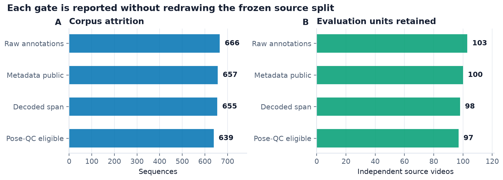
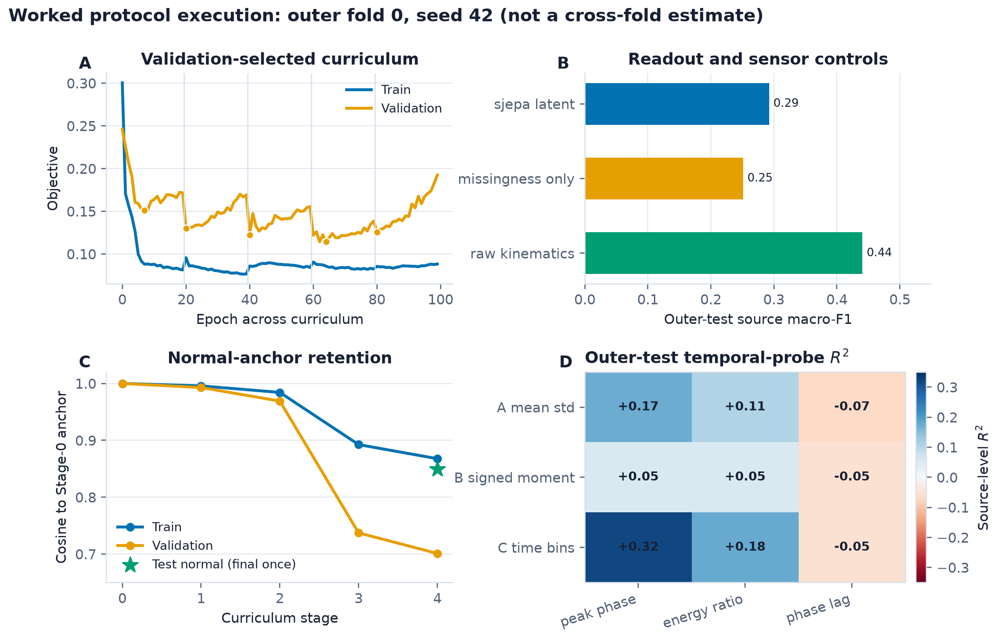

# BrainBodyFM 2026: submission-readiness guide

**Status date:** September 5, 2026

**Target:** NeurIPS 2026 Workshop on Foundation Models for the Brain and Body

**Deadline:** September 5, 2026 AoE

**Canonical manuscript:** `bbfm2026_paper_draft.tex`

## Current submission position

The defensible paper is a **leakage-aware evaluation protocol and GAVD case study with one fully traced worked fold**, not a report of established S-JEPA performance. Outer fold 0, seed 42 now has hash-bound training, readout, temporal, and normal-retention artifacts. The raw-kinematic control exceeded the S-JEPA latent readout in that fold. This is useful negative evidence and an implementation audit, but it is not a cross-fold estimate. Earlier sequence-split, laterality, AnchorGuard, and forecasting artifacts remain archived rather than mixed with protocol-v2 results.

This framing fits the [BrainBodyFM 2026 call for papers](https://brainbodyfm-workshop.github.io/call-for-papers.html): pose and movement, self-supervised and continual learning, evaluation protocols, generalization, and reproducibility are all in scope. The submission venue is the [BrainBodyFM 2026 OpenReview group](https://openreview.net/group?id=NeurIPS.cc/2026/Workshop/BrainBodyFM).

## Dated data census

The five raw GAVD manifests contain **666 sequences from 103 unique YouTube videos**. A live metadata check on **September 4, 2026** found **657 sequences from 100 videos metadata-public**:

|Manifest group|Raw sequences / videos|Metadata-public sequences / videos|
|---|---:|---:|
|Normal|291 / 32|291 / 32|
|Parkinson's|47 / 11|47 / 11|
|Stroke|76 / 19|75 / 18|
|Myopathic|188 / 30|184 / 29|
|Cerebral palsy|64 / 11|60 / 10|
|**Total**|**666 / 103**|**657 / 100**|

The three failed sources are:

- `sf5X4YYkWUA`: private
- `YjRoLtP1di0`: private
- `yULxvDc9e8c`: unavailable

"Metadata-public" means that the platform returned public video metadata without authentication at that check. It does **not** establish that every annotated time span can be downloaded, decoded, sampled at the requested frames, or converted into an acceptable pose trajectory. Download/decode checks and pose-quality control therefore define later, separately reported attrition stages. Availability is time-, region-, account-, and platform-policy-dependent.

## Claim boundary and model comparison

The primary representation-learning condition must remain label-free:

\[
\mathcal{L}_{\mathrm{primary}}
=\mathcal{L}_{\mathrm{JEPA}}+0.05\,\mathcal{L}_{\mathrm{VICReg}}.
\]

The condition-label term belongs only in a clearly named supervised ablation:

\[
\mathcal{L}_{\mathrm{ablation}}
=\mathcal{L}_{\mathrm{primary}}+0.25\,\mathcal{L}_{\mathrm{group}}.
\]

This separation prevents label-informed geometry from being described as purely self-supervised. Only the current fold-0 values bound to protocol-v2 hashes enter the submission; earlier anchor-cosine, classifier, temporal, laterality, AnchorGuard, forecasting, and repair values remain archived. No model-performance number should enter the submission without its supporting artifact and claim-ledger entry.

## Required source-grouped protocol

1. Canonicalize YouTube IDs before splitting. Treat the source video as the minimum independent unit; no source may cross outer train, validation, and test partitions.
2. Build a versioned split registry once. Approximately stratify by manifest group while balancing source and sequence counts. Because the smallest groups contain only 10--11 metadata-public sources, prefer repeated grouped outer splits or stratified group cross-validation to a single favorable split.
3. Fit normalization, imputation, quality thresholds, augmentation choices, the full encoder curriculum, and every downstream readout using outer-training data only. Use grouped validation data for all selection. Keep outer test labels sealed until the pipeline is frozen.
4. Retrain the complete pipeline for every outer fold and random seed. A probe split applied after the encoder saw all sources is descriptive in-corpus readability, not held-out generalization.
5. Report source-level as well as sequence-level results, equal-source weighting, source-cluster uncertainty, fold/seed dispersion, attrition, and all deviations from the registered split.

The minimum evidence package should cover:

|Question|Required endpoint or control|
|---|---|
|Did continual training preserve normal-gait function?|Held-out-normal JEPA/perturbation task, equal-source weighting, cluster uncertainty|
|Did the representation change beyond a coordinate rotation?|Orthogonal Procrustes plus linear CKA or another alignment-aware comparison|
|Is any change specific to the curriculum?|Continued-normal, joint-training, order, and multi-seed controls|
|Do features transfer to unseen sources?|Fold-local encoder retraining and source-held-out readouts|
|Is apparent signal a pose artifact?|Raw-pose, untrained-encoder, missingness/coverage, and extraction-version controls|
|Did labels shape the embedding?|Label-free primary versus label-aware ablation, reported separately|

## Execution status and provenance requirements

The current fold-0 execution is reproducible from local protocol-v2 artifacts; folds 1--4 and additional seeds remain incomplete. Predictive surprise is correctly blocked because no separately future-mask-trained checkpoint exists. Every additional run must emit a machine-readable manifest containing:

- manifest hashes and the dated availability snapshot;
- raw, metadata-public, decode-valid, and pose-QC counts;
- exact source-grouped split assignments and seed;
- code revision, environment, pose-model version, and configuration;
- parent-checkpoint lineage and feature hashes;
- per-source predictions, uncertainty inputs, checkpoints, and logs; and
- a claim ledger mapping each manuscript value to its artifact.

## Limitations and ethics that must remain visible

- Source-video grouping is not person grouping. GAVD does not provide a verified identity key, so the same individual could appear in multiple videos.
- Manifest folder labels are dataset annotations, not diagnoses made or validated by this project.
- YouTube footage is opportunistic and may confound condition labels with camera, clothing, mobility aids, demographics, editing, or pose-estimation failures.
- Public accessibility does not by itself establish consent for every downstream use. Video availability and reuse permissions can change.
- Pose trajectories can remain identifying even when RGB frames are not redistributed. Release decisions need a documented ethics/data-use review, retention and takedown procedures, and a re-identification risk assessment.
- The work is methodological and exploratory. It must not be presented as a diagnostic, treatment, surveillance, or deployment-ready system.

## Readiness assessment

|Area|Status|
|---|---|
|Workshop fit|Strong: movement representation, continual learning, evaluation, and reproducibility|
|Dated metadata census|Ready, with the narrow "metadata-public" definition|
|Leakage-aware protocol|Specified in the manuscript|
|Held-out model evidence|One fold/seed complete; multi-fold estimate pending|
|Clinical claims|Out of scope and unsupported|
|Ethics/data-use review|Must be completed and documented before release|
|Page-limit/build verification|Verified: five main-text pages plus appendix/references|

## Pre-submission checklist

1. Keep the worked fold explicitly labeled as an execution audit; do not imply a cross-fold estimate.
2. Keep the primary model label-free; identify the group-loss condition as a supervised ablation everywhere.
3. Recheck live metadata immediately before freezing the submission and date the snapshot.
4. Rebuild with the provided BrainBodyFM/NeurIPS 2026 style and confirm no more than five main-text pages, excluding references and appendices.
5. Confirm double-blind anonymization in both visible content and PDF metadata.
6. Inspect every PDF page at actual size and verify that tables, equations, references, and links render correctly.
7. Record the institutional ethics/data-use determination and retain the limitations above.
