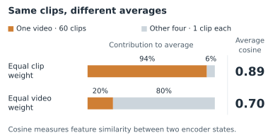

# Before Health Agents Interpret Movement: Lessons from a Gait Representation Study

*Position-paper draft with an empirical case study. The LaTeX source is canonical.*

## Abstract

Movement observations could help future health assistants describe mobility, provided the underlying measurements support the claims made about a person. We argue that summaries supplied to these systems should retain their evaluation unit, model reference, and tested purpose. A reanalysis of a JEPA-style gait model provides a concrete example. For the same 64 normal-annotated validation clips, feature similarity across training stages averages to 0.89 when clips receive equal weight and 0.70 when videos receive equal weight; one video supplies 60 clips. Neither average measures a change in patient health or preservation of predictive ability. A separate comparison on 20 held-out videos finds that simple pose summaries predict the dataset annotations correctly for more videos than learned features, without establishing a general disadvantage of pretraining. Building on established model-reporting and clinical-validation guidance, we propose a short evidence record accompanying movement summaries and describe how to test whether it improves downstream interpretation. The contribution is an empirical case for more precise use of movement evidence in generative health systems; no clinical agent, forecasting capability, or patient benefit is demonstrated.

## Position: preserve what a movement result means

A future health assistant might combine video-derived movement summaries with a patient’s history to help a clinician review mobility. An important question arises before that integration: what does each summary measure? A similarity between two model representations could describe how the model changed during training, how two recordings differ, or how one person moved on different visits. These comparisons need different evidence, even if their outputs are all presented as a single score.

Our position is that movement summaries supplied to generative health systems should carry the information needed to interpret them: what was measured, which observations received weight, and which clinical or predictive uses were tested. This is especially important when repeated clips come from a few recordings or when the representation model changes. A downstream explanation could otherwise attribute a model or sampling effect to a person. We examine that risk through a retrospective gait case study, without claiming to have measured errors made by an assistant.

The position builds on existing practice. Model Cards document intended uses, evaluation conditions, and limitations (Mitchell et al. 2019). The V3 framework for digital measurement distinguishes sensor verification from analytical and clinical validation (Goldsack et al. 2020); DECIDE-AI addresses early clinical evaluation, including safety and human factors (Vasey et al. 2022). Group-aware evaluation is also established (Roberts et al. 2017). Our contribution is a worked application to movement representations: a reproducible example of how weighting changes a model-similarity summary, a simpler-feature comparison that limits claims about learned representations, and a proposed record that keeps these distinctions visible when results are used downstream.

Joint-embedding predictive architectures (JEPAs) are a useful setting for this question. They learn features by predicting hidden representations, as in I-JEPA and skeletal S-JEPA (Assran et al. 2023; Abdelfattah and Alahi 2024). Our compact adaptation takes estimated pose as input. It does not generate clinical text or implement an agent. Its relevance to generative health AI is as a possible perception component whose outputs would need to be interpreted correctly. Predicting hidden features with context from throughout a clip also differs from forecasting observations that have not yet occurred.

## Case study and evaluation

### Curated videos, with recordings kept separate.

We use 639 quality-screened gait clips from 97 YouTube videos drawn from the Gait Abnormality in Video Dataset (GAVD), a manually curated resource for clinical gait analysis (Ranjan et al. 2025). The selected annotations cover normal gait, Parkinson’s, stroke, myopathic gait, and cerebral palsy. They are dataset annotations, not diagnoses independently verified in this study. Each video is an uploaded recording that can contain several clips; reliable person identifiers are unavailable.

The recorded split contains 59 training, 18 validation, and 20 test videos. All clips from a video share its role, with assignments retained through later data-quality exclusions. Encoder fitting uses training videos, and validation guides model and classifier selection. The final classifier is fitted on all 77 training and validation videos before testing on the remaining 20. This case study reports one split and one training initialization, rather than repeated independent evaluations. Appendix A gives the preparation and fitting details.

### What the encoder learns.

A fixed pose estimator supplies 33 landmarks (Grishchenko et al. 2022). Prepared clips are centered at the hips, scaled within each clip, and resized to 64 frames. Each joint’s mean coordinates over four frames become an input token. A two-layer Transformer with 64-dimensional features and a pooled-context predictor estimate hidden features supplied by a slowly updated copy of the encoder. Targets are selected from the shoulders, hips, knees, ankles, heels, and foot tips.

The objective combines smooth-L1 feature prediction with variance and covariance penalties, weighted 0.10 and 0.01, respectively (Bardes et al. 2022). The penalties discourage nearly constant or redundant features; there is no separate two-view invariance term. Training starts with normal-annotated clips, then adds the other categories in the order listed above while retaining earlier categories. Labels determine that ordering but are not prediction targets in the encoder loss. The benefit of this order was not tested, and it does not represent disease progression.

### Scope of this reanalysis.

The numerical results below are recalculated from retained video-level predictions and counts with mean feature similarities. The supplement reproduces those calculations without videos. It does not rerun pose extraction or encoder training. Some training settings were not fully recorded, and the available pose records do not establish calibrated physical coordinates. We therefore use this run to examine interpretation and evaluation choices, not to benchmark the JEPA family or establish a clinical biomarker.

## Findings

### The averaging rule changes which recordings a result describes

We compare the representation of each normal-annotated validation clip after normal-only training with its representation after the final training stage. The clip itself stays fixed. Cosine similarity measures how closely the directions of these two feature vectors align, ranging from $-1$ to $1$ for nonzero vectors. A larger value means closer directional agreement; it is not a percentage of retained information.

There are 64 clips from five videos. One video supplies 60 clips and has mean similarity 0.90; the other four each supply one clip, with similarities ranging from 0.54 to 0.76. Averaging over clips gives 0.89. Averaging first within each video and then equally across videos gives 0.70 (Figure 1). All calculations use the same recorded similarities. Only their weights change.

**Figure 1.** The same feature similarities under two averaging rules. Bars show the share of the average assigned to the 60-clip video and to the four one-clip videos together. The mean cosines at right compare fixed clips across two encoder training stages; they are not percentages or clinical scores. The dominant video’s mean cosine is 0.90, while the other four range from 0.54 to 0.76. Values are calculated before rounding.

The 60-clip video receives about 94% of the weight in the first calculation and 20% in the second. Consequently, 0.89 mainly describes that recording. Equal-video weighting answers a different question by giving each upload the same contribution. Neither choice is universally correct, and neither guarantees equal weighting of people without reliable identities. The lesson is to specify the population a summary represents before interpreting its magnitude.

A further boundary remains under either weighting rule. Comparing a fixed clip across model versions measures a change in model coordinates, not a change in mobility. Coordinates can rotate while a refitted predictor recovers the same movement information; an almost constant representation can also appear stable while being uninformative. Preservation of useful function therefore needs a fixed movement task evaluated across model versions. No such retention experiment is available here.

### Simple pose summaries provide an essential comparison

We compare three inputs to separately fitted logistic-regression classifiers: means and variability of landmark positions and frame-to-frame movement, summaries of frozen learned features, and landmark-availability indicators without coordinates. All use the same 20 held-out videos. The third input checks whether observation availability alone carries information about the annotation labels; it does not determine what information the learned encoder uses.

| Classifier input            | Videos correctly classified | Balanced accuracy |
|:----------------------------|:---------------------------:|:-----------------:|
| Pose and movement summaries |            10/20            |       0.44        |
| Learned pose features       |            6/20             |       0.26        |
| Landmark availability only  |            6/20             |       0.25        |

**Table 1.** Prediction of GAVD annotations on the same 20 test videos. Balanced accuracy averages the fraction correctly classified within each category, giving the five categories equal weight. These descriptive scores come from one split and initialization.

The simpler pose summaries perform best in this recorded comparison, although every classifier misclassifies all three stroke-annotated test videos. The category counts are uneven: seven normal, two Parkinson’s, three stroke, six myopathic, and two cerebral-palsy videos. One additional correct prediction would change recall by one half in either two-video category. The table does not establish a reliable population ranking.

There is also a procedural limitation. Classifier selection uses averaged features for each validation video, whereas testing averages the category probabilities predicted for its clips. These operations need not give the same answer. In addition, there is no matched untrained-encoder comparison. The results therefore support retaining a pose baseline, but do not isolate the effect of pretraining or prove that the learned model relies on missing landmarks.

## What should accompany a movement summary?

We propose a short evidence record that remains attached to a summary when it enters a generative health system. Its purpose is to make the relevant measurement and evaluation conditions available at the point of interpretation, alongside model-level documentation. Table 2 illustrates the proposal using the weighting analysis. This is a reporting recommendation and worked example, not an implemented or validated agent interface.

| Information to retain | Example from this study |
|:---|:---|
| Measured quantity | Feature-vector cosine for the same clips at two training stages. |
| Model reference | Encoder after normal-only training compared with the final encoder. |
| Recording unit and weight | 64 clips from five videos; each video has equal total weight. Person identities are unknown. |
| Observed result | Mean cosine 0.70; equal clip weighting would give 0.89. |
| Interpretation limit | Predictive retention and patient-level mobility change were not tested. |

**Table 2.** Proposed evidence record, filled using the observed weighting example. This describes a model comparison, not a patient assessment.

This proposal extends existing reporting guidance to the specific movement result being passed downstream. A model-level description alone may not reveal that one summary used clip weights and another used video weights, or that their reference encoders differ. The record should also distinguish an untested use from a negative result on a tested task. In this case, clinical monitoring is untested; annotation classification was tested and yielded the limited results in Table 1.

A focused follow-up could compare interpretations made with a bare movement score against interpretations supplied with the evidence record. Cases should separately vary recording composition, model version, and actual movement, using independently established targets for the last comparison. Prespecified outcomes could include unsupported claims about mobility change, recognition of insufficient evidence, and clinician review time. The same cases and assistant should be used in both conditions, with blinded assessment of the resulting interpretations. Such a study would test the proposed benefit; the present evidence does not show that documentation alone improves trust or safety.

Forecasting would require its own evaluation before being listed as a supported use. Our masked-feature objective can use observations before and after a hidden region. A future-prediction task must restrict inputs, preparation, and baseline predictors to the observed past, with an explicit time horizon. Planning an intervention would need additional evidence about actions and their consequences. These capabilities cannot be inferred from the encoder’s training objective.

## Counterarguments and remaining limits

### A stronger model could perform better.

The classifier comparison is small and procedurally imperfect. It cannot establish that predictive pretraining is ineffective. GaitForeMer reports improved gait-severity estimation with pretraining that combines motion forecasting and activity classification (Endo et al. 2022). That task and training design differ from ours. Our position would still apply to a high-performing model: its summaries would need evaluation appropriate to the proposed use, and model updates would need checks on useful function.

### Weighting should follow the use, not a universal rule.

Equal-video weighting may suit an upload-level evaluation, while another use may call for equal patient or episode weighting. Repeated clips can be useful observations and are not automatically erroneous duplicates. Their number should not silently determine how much an individual recording influences a population summary. The present calculation demonstrates the consequence of that choice, rather than introducing a new weighting method.

### The connection to health agents is prospective.

No generative assistant, clinician collaboration, or care intervention is evaluated. The empirical evidence concerns a potential movement-perception component. The proposed record could itself be ignored, misinterpreted, or add burden, which is why its benefit needs a separate test. Clinical evaluation should address performance in the intended workflow and human factors (Vasey et al. 2022); accurate reporting of a representation experiment cannot establish those outcomes.

### Data and measurement limits.

The recordings are a selected online sample. Camera view, mobility aids, editing, and visibility may be associated with annotations, but their effects were not isolated. People may appear in more than one upload. Pose estimates are not calibrated motion-capture measurements, and incomplete crop metadata limits their geometric interpretation. Training and the feature-similarity diagnostic also prepare missing observations differently (Appendix A); this does not affect the comparison that holds recorded similarities fixed. These limits preclude diagnostic or population-wide claims.

### Responsible use.

GAVD’s annotation repository uses the MIT License, while the separately hosted videos remain subject to their own access and use conditions (GAVD project 2026, 2024). This distinction does not establish consent or institutional authorization for every reuse. A project-specific ethics determination and data-use review remain unresolved; no approval or exemption is claimed. The manuscript reports aggregate retrospective results and does not redistribute videos or individual pose trajectories. Public release decisions require the responsible authors’ review. Diagnosis, treatment recommendations, and deployment are outside the evidence presented.

## Conclusion

The most informative result in this case is that changing only the averaging rule changes a feature-similarity summary from 0.89 to 0.70. Its interpretation depends on which recordings receive weight and which model versions are compared, while the label-prediction check shows why simple pose summaries remain necessary baselines. For future health agents, we recommend preserving these distinctions in the movement evidence they receive. The next step is to test whether that information reduces unsupported interpretations in a defined workflow, alongside independent validation of the movement measures themselves.

## Appendix A. Preparation and evaluation details

### Cohort selection.

The selected annotation inventory contains 666 clips from 103 videos; these are subset counts, not the size of GAVD. Recorded metadata availability retains 657 clips from 100 videos, usable video-span checks retain 655 from 98, and pose-quality checks retain 639 from 97. These describe the acquisition record, not a guarantee of present-day video availability. Video roles are assigned before the latter exclusions and are not redrawn afterward. The final split contains 377 training clips, 131 validation clips, and 131 test clips.

### Pose preparation.

Clips are retained when at least half of the observations across the 12 selected landmarks have visibility of at least 0.45. Encoder preparation additionally requires finite coordinates for a landmark to be marked valid. Training preparation centers coordinates on the hips, with a within-clip fallback for unavailable hip positions, and scales them using shoulder and hip widths in the image plane. Nonfinite values are set to zero before resizing to 64 frames. Finite low-visibility coordinates can remain in the encoder input. A four-frame token is valid only when all its observations are valid. Invalid tokens are excluded from target selection and pooling, but remain able to influence contextual attention because the implementation has no attention padding mask.

The feature-similarity diagnostic additionally fills short internal gaps of at most four frames, retaining the observation-validity mask. Its 64-dimensional representation averages valid target-encoder features over the 12 selected landmarks. The classification input instead concatenates feature means and standard deviations over all valid landmarks and over the selected subset, giving 256 values. These are different summaries for different tests.

### Encoder training.

Four-frame coordinate means are projected to 64 dimensions with learned joint and time positions. Two Transformer blocks use four attention heads. The predictor receives averaged visible-valid context and a target-position embedding, then applies a two-layer multilayer perceptron. Hidden token positions remain in the encoder layout. Only valid selected-landmark tokens can be prediction targets. The minimum eligible count in a batch sets a common number of targets, so the realized masked fraction can differ across clips and applies only to eligible positions.

The saved training history records 20 epochs at each of five cumulative stages, with validation loss selecting the checkpoint at each stage. The code samples videos uniformly and then clips within each video. Validation losses use changing category sets and are not comparable measures of clinical progress. The objective is
$$
\mathcal L=\mathcal L_{\mathrm{SmoothL1\ feature\ prediction}}
+0.10\,\mathcal L_{\mathrm{variance}}
+0.01\,\mathcal L_{\mathrm{covariance}}.
$$
The regularizers operate on projected pooled features. No condition-prediction term is enabled. Some optimizer and batch settings were not completely preserved as executed configuration; we do not present code defaults as verified runtime settings. Selected model weights are restored between stages without restoring matching optimizer moments, another reason not to attribute changes specifically to the category order.

### Classifier fitting.

Pose summaries comprise coordinate means, standard deviations, mean absolute differences between adjacent frames, and the standard deviations of those differences for 12 landmarks, giving 144 values. They describe normalized coordinates rather than physical velocities. Landmark-availability summaries contain the observed fraction for each of 33 landmarks and each of 64 resized frames, giving 97 values.

A separate feature scaler and class-weighted logistic regression are fitted for each input. Validation macro-F1 selects regularization from $C\in\{0.1,1,10\}$, followed by refitting on training and validation videos. The selected values are 10 for pose summaries, 1 for learned features, and 1 for availability. Fitting and selection use averaged features per video; test predictions average clip probabilities within each video. This mismatch should be corrected in a newly specified comparison, without treating the already inspected test set as an untouched confirmatory sample.

### What the numerical supplement reproduces.

The supplement includes consistently aliased predictions for the same 20 videos and five records containing video clip counts and mean cosine similarities. It reproduces the reported counts, balanced accuracies, and both weighting calculations using standard Python. Macro-F1, used for classifier selection, is also retained: 0.44 for pose summaries, 0.29 for learned features, and 0.25 for availability. Rounded values are for presentation; calculations use the unrounded records. The supplement checks recorded outputs, not training reproducibility or clinical validity, and contains no video frames or individual trajectories.

## Appendix B. Checking the weighting calculation

For video $v$, let $n_v$ be its number of clips and $\bar c_v$ the average of their cross-stage cosine similarities. The two reported summaries are
$$
C_{\mathrm{clip}}=\frac{\sum_v n_v\bar c_v}{\sum_v n_v},
\qquad
C_{\mathrm{video}}=\frac{1}{5}\sum_{v=1}^{5}\bar c_v.
$$
The denominator five is the number of normal-annotated validation videos in this comparison. It is unrelated to the number of gait categories. Table 3 gives the records in readable form; the supplement retains their unrounded values.

| Video | Number of clips | Mean cosine |
|:------|----------------:|------------:|
| A     |              60 |        0.90 |
| B     |               1 |        0.76 |
| C     |               1 |        0.70 |
| D     |               1 |        0.60 |
| E     |               1 |        0.54 |

**Table 3.** Recorded normal-validation similarities across training stages. Video aliases apply only to this table. Each clip is compared with itself using two encoders.

The difference between 0.89 and 0.70 is a consequence of the observed clip counts and similarities. It has no threshold for acceptable retention or clinical change. This analysis holds all recorded similarities fixed and therefore needs no model refitting, but it does not provide uncertainty over new videos, people, training runs, or clinical outcomes.

## References

Abdelfattah, Mohamed, and Alexandre Alahi. 2024. “S-JEPA: A Joint Embedding Predictive Architecture for Skeletal Action Recognition.” *Computer Vision – ECCV 2024*, 367–84. <https://doi.org/10.1007/978-3-031-73411-3_21>.

Assran, Mahmoud, Quentin Duval, Ishan Misra, et al. 2023. “Self-Supervised Learning from Images with a Joint-Embedding Predictive Architecture.” *Proceedings of the IEEE/CVF Conference on Computer Vision and Pattern Recognition*, 15619–29. <https://doi.org/10.1109/CVPR52729.2023.01499>.

Bardes, Adrien, Jean Ponce, and Yann LeCun. 2022. “VICReg: Variance-Invariance-Covariance Regularization for Self-Supervised Learning.” *International Conference on Learning Representations*. <https://arxiv.org/abs/2105.04906>.

Endo, Mark, Kathleen L. Poston, Edith V. Sullivan, Fei-Fei Li, Kilian M. Pohl, and Ehsan Adeli. 2022. “GaitForeMer: Self-Supervised Pre-Training of Transformers via Human Motion Forecasting for Few-Shot Gait Impairment Severity Estimation.” *Medical Image Computing and Computer Assisted Intervention – MICCAI 2022*, Lecture notes in computer science, vol. 13438: 130–39. <https://doi.org/10.1007/978-3-031-16452-1_13>.

GAVD project. 2024. *GAVD: MIT License*. GitHub repository. <https://github.com/Rahmyyy/GAVD/blob/main/LICENSE>.

GAVD project. 2026. *Gait Abnormality Video Dataset: Repository and Data-Use Statement*. GitHub repository. <https://github.com/Rahmyyy/GAVD>.

Goldsack, Jennifer C., Andrea Coravos, Jessie P. Bakker, et al. 2020. “Verification, Analytical Validation, and Clinical Validation (V3): The Foundation of Determining Fit-for-Purpose for Biometric Monitoring Technologies (BioMeTs).” *Npj Digital Medicine* 3: 55. <https://doi.org/10.1038/s41746-020-0260-4>.

Grishchenko, Ivan et al. 2022. “BlazePose GHUM Holistic: Real-Time 3D Human Landmarks and Pose Estimation.” *arXiv Preprint arXiv:2206.11678*. <https://arxiv.org/abs/2206.11678>.

Mitchell, Margaret, Simone Wu, Andrew Zaldivar, et al. 2019. “Model Cards for Model Reporting.” *Proceedings of the Conference on Fairness, Accountability, and Transparency*. <https://doi.org/10.1145/3287560.3287596>.

Ranjan, Rahm, David Ahmedt-Aristizabal, Mohammad Ali Armin, and Juno Kim. 2025. “Computer Vision for Clinical Gait Analysis: A Gait Abnormality Video Dataset.” *IEEE Access* 13: 45321–39. <https://doi.org/10.1109/ACCESS.2025.3545787>.

Roberts, David R. et al. 2017. “Cross-Validation Strategies for Data with Temporal, Spatial, Hierarchical, or Phylogenetic Structure.” *Ecography* 40 (8): 913–29. <https://doi.org/10.1111/ecog.02881>.

Vasey, Baptiste, Myura Nagendran, Bruce Campbell, et al. 2022. “Reporting Guideline for the Early-Stage Clinical Evaluation of Decision Support Systems Driven by Artificial Intelligence: DECIDE-AI.” *Nature Medicine* 28: 924–33. <https://doi.org/10.1038/s41591-022-01772-9>.
