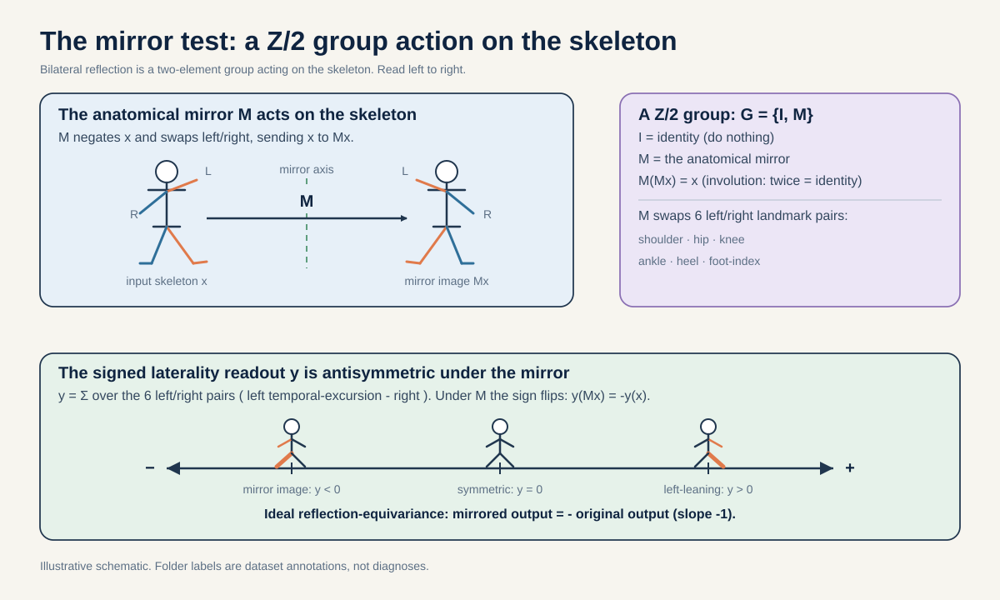
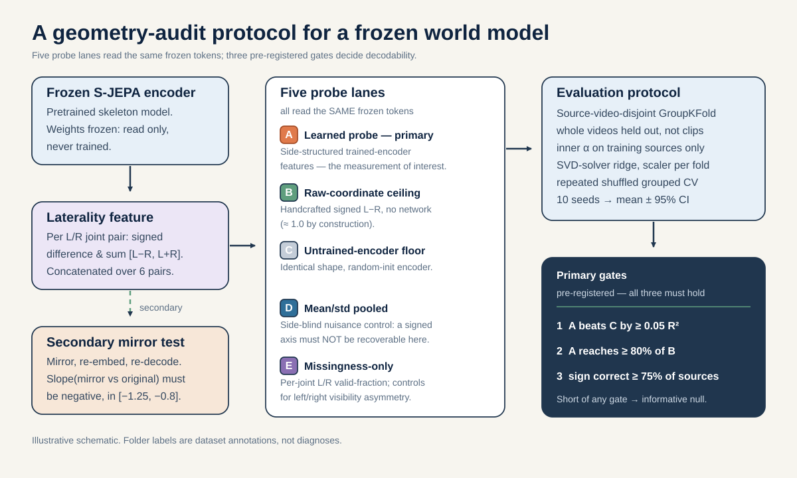
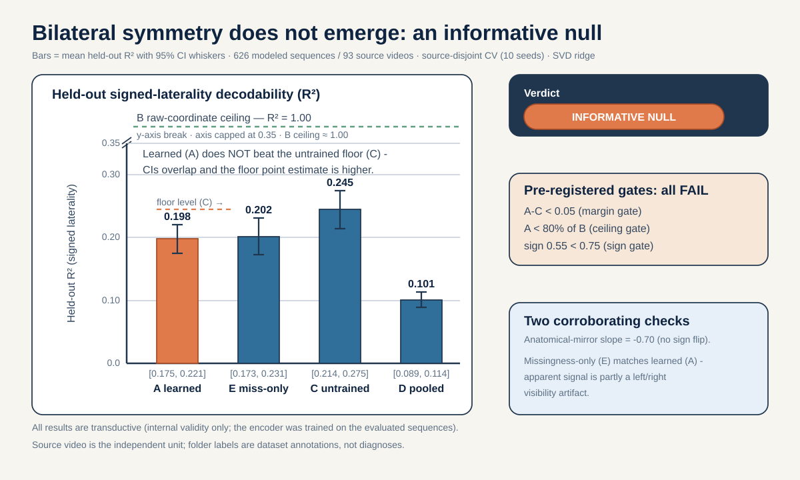
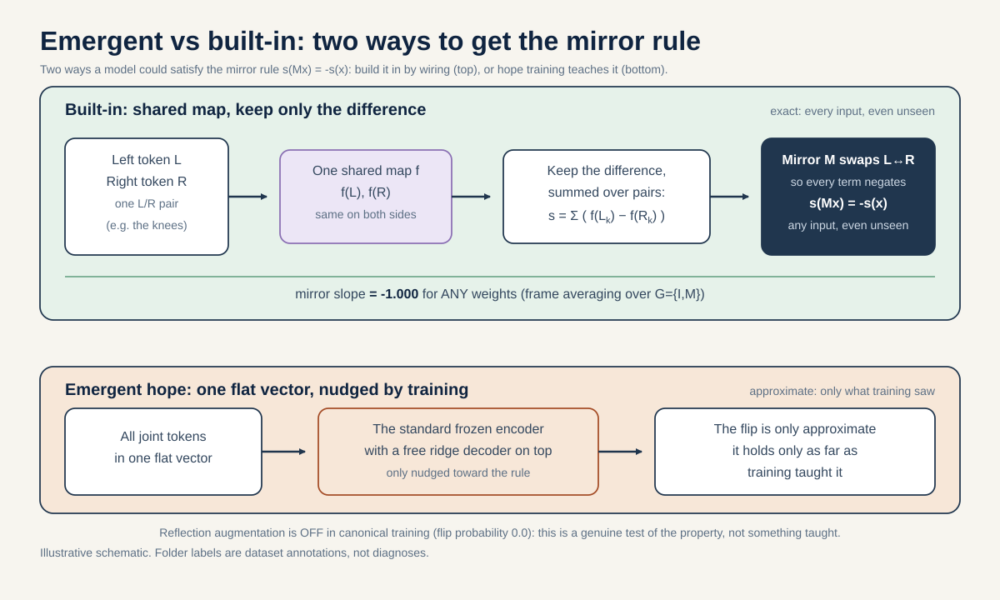
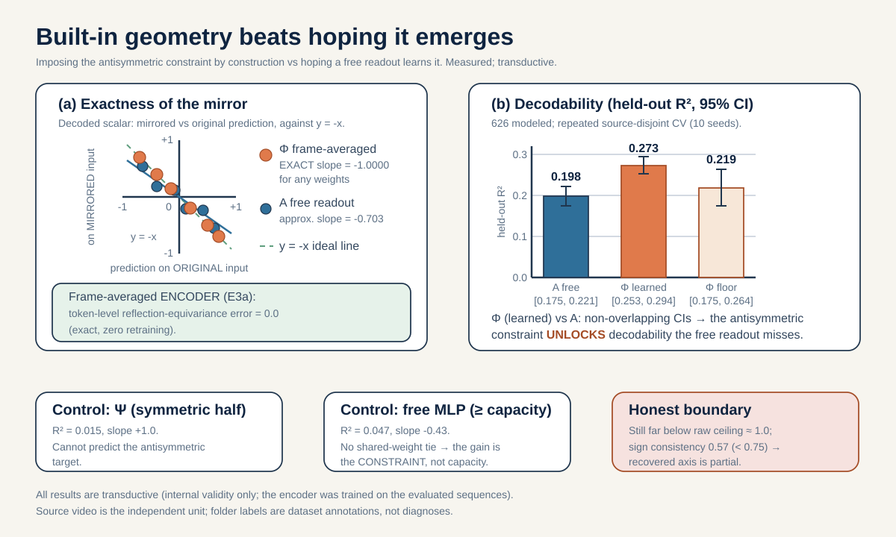
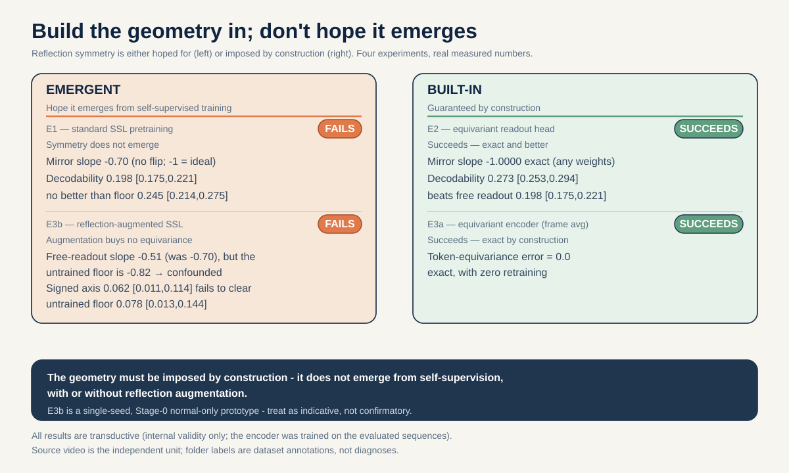

# Bilateral Symmetry as a Geometry Audit for a Skeleton World Model
### A critical review and a step-by-step tutorial for the reflection-equivariance arc

> **Scope and responsible-use notice (read first).** Every result in this document is **transductive**: the self-supervised encoder was trained on the very sequences it is later probed on, so all claims have *internal validity only* and must not be read as out-of-sample generalization. The **independent unit of analysis is the source video** (not a clip, not a person); all cross-validation splits are disjoint at the source-video level. The folder names in the dataset (`normal`, `parkinsons`, `stroke`, `myopathic`, `cerebralpalsy`) are **dataset annotations, not diagnoses**, and nothing here infers a clinical condition for any individual. GAVD distributes public YouTube URLs, not raw video, and users retrieve media independently under YouTube's terms; we redistribute no raw frames or identity-bearing imagery. **No institutional ethics determination or completed data-use review is on record for this study yet; both must be resolved before any submission.** These constraints are carried in substance from `docs/staged_details.md` and are load-bearing for how the numbers below may be used.

---

## 0. The one-sentence thesis

A frozen skeleton world model does **not** spontaneously learn that the human body is bilaterally symmetric (at least, the one we audit does not); but the moment we *build the reflection symmetry into the read-out or the encoder*, the corresponding axis of motion is decoded with an **exactly antisymmetric (mirror-slope $-1$) guarantee** — though, as we show, its explained variance ($R^2$) remains only partial. In slogan form:

> **Build the geometry in — don't hope it emerges.**

This document does two things. First (§1–§4) it **critiques** the laterality experiment that already lives in this repository — what it got right, and the opportunities it left on the table. Second (§5–§9) it is a **tutorial**: it walks, step by step, from the original probe (E1) to a reflection-equivariant read-out (E2) to a reflection-equivariant encoder (E3.1/E3.2), so a reader can reproduce and extend the whole arc.

---

## 1. What is actually being tested — the group-action framing

The articulated human skeleton has an obvious geometric symmetry: reflect it across the sagittal plane and swap every left landmark with its right partner, and you get a physically valid skeleton again. That operation is an **involution** — do it twice and you are back where you started — so the two operations `{identity, mirror}` form the group **Z/2** acting on skeleton space.

Write the mirror operator as `M`. It (i) negates the `x`-coordinate of every joint and (ii) swaps all sixteen bilateral BlazePose landmark pairs — the full left/right relabeling that makes the reflected skeleton valid. By construction `M² = I`.

Now define a **signed laterality target** `y = signed_left_minus_right(x)`: for each of the six bilateral pairs `(11,12), (23,24), (25,26), (27,28), (29,30), (31,32)` (shoulders, hips, knees, ankles, heels, foot-indices), sum the per-joint temporal standard deviation of motion (summed over `x,y,z`) on the left, subtract the right, and sum across the six pairs. This scalar measures *which side of the body moves more*. Crucially it is **exactly antisymmetric** under the mirror by construction:

```
y(Mx) = − y(x)          (mirror flips the sign of the laterality axis)
```

This is precisely a **group-action equivariance condition** of the form

```
y(T_g · x) = ρ(g) · y(x),   with  ρ(identity) = +1,  ρ(reflection) = −1.
```

So the scientific question — *"did the world model learn bilateral symmetry?"* — becomes an exact, testable geometric statement: **when I mirror the input, does the model's decoded laterality flip sign (slope −1) the way the ground-truth target provably does?** Figure 1 makes the group action and the "mirror test" concrete.



*Why this framing matters.* The NeurIPS 2026 *Physical World AI* CFP names "geometry-aware world models," "articulated and deformable scene understanding," and "proprioceptive sensing" as in-scope, but it does **not** name symmetry, equivariance, or biomechanics. Framing laterality as a Z/2 group-action equivariance test is the bridge that makes this work legible to that audience: it is a *geometry-aware* probe of an *articulated* body whose target is a *proprioceptive* quantity (which side moves more).

---

## 2. The work so far, in one paragraph

The repository contains a frozen S-JEPA checkpoint (`sjepa_curriculum_final.pt`, fingerprint `7d13841a…`) — a masked-latent-infilling world model over 33-joint BlazePose skeletons, trained with a curriculum that starts on the `normal`-annotated gait rows and progressively adds each condition-annotated stage. An earlier experiment (`idea5`) asked whether the frozen tokens decode the signed laterality axis, using a four-lane probe (learned features vs. a raw-coordinate ceiling vs. an untrained-encoder floor vs. a side-blind pooled control) under source-disjoint cross-validation. The headline it recorded: the learned tokens reach only `R² ≈ 0.24`, barely above the untrained floor and far below the raw ceiling, with the mirror slope at `−0.63` instead of `−1`. In other words: **an informative null** — the geometry did not emerge.

That result is the seed. The rest of this document hardens it, and then turns the null into a constructive story.

---

## 3. Critique — what the original experiment got right

The original laterality probe is unusually careful for an exploratory notebook, and those strengths are worth naming because the extension preserves every one of them.

1. **The independent unit is correct.** Splits are disjoint at the *source-video* level, not the clip or frame level. This closes the most common skeleton/gait leak — multiple clips from the same *source video* landing on both sides of a split. It does **not** by itself guarantee *person*-level disjointness (were the same individual to appear across two source videos, those could still fall on opposite sides); the source video is the unit we can identify and control, and the only one we claim.
2. **It has a ceiling and a floor.** Lane B (raw coordinates) confirms the target is *trivially* decodable from geometry (`R² ≈ 1.0`), so a low learned score is a statement about the *representation*, not about an impossible task. Lane C (an untrained encoder) gives a random-features floor, so "the model learned something" must mean "beats C," not merely "beats zero."
3. **It has a side-blind trap.** Lane D pools mean/std over the whole body, discarding left-vs-right structure. A probe that scored well on D would be exploiting overall movement magnitude, not laterality; D staying low is consistent with the laterality interpretation and rules out the pooled-magnitude confound.
4. **The target is exactly antisymmetric by construction**, so the mirror slope is a clean, assumption-free diagnostic rather than an empirical approximation.

These four choices are why the null is *informative* rather than merely negative.

---

## 4. Critique — the missed opportunities (and how the extension fixes each)

The original stops exactly where it gets interesting. Six gaps, each of which the tutorial below closes:

| # | Gap in the original | Fix in the extension |
|---|---------------------|----------------------|
| 1 | **A single CV partition.** One `GroupKFold` split gives one number with no uncertainty — and that number sat near the top of the achievable range. | **Repeated shuffled source-disjoint CV** (10 reshuffles of the fixed cohort) → mean ± a $t$-based **stability interval** per lane (partition sensitivity, not population sampling). The ranking changes (see below). |
| 2 | **Ill-conditioned solver.** The default Ridge solver threw 151 `LinAlgWarning`s (recorded in `docs/staged_details.md`; a pre-hardening diagnostic); the point estimate depended on numerical luck. | Switch to the **SVD solver** and report an **alpha-sensitivity sweep** so the reader sees the conditioning explicitly. |
| 3 | **No missingness control.** Left/right landmark *visibility* can differ; a probe could exploit that instead of motion. | Add **Lane E (missingness-only)**: regress `y` on per-joint L/R valid-fraction. If E rivals A, the "signal" is a visibility artifact. |
| 4 | **The null is left as a null.** "The geometry didn't emerge" is a dead end unless you show what *would* recover it. | **E2**: a reflection-equivariant read-out that recovers the axis *by construction* (mirror slope exactly −1). |
| 5 | **Read-out only.** Even a perfect head is still bolted onto a non-equivariant backbone. | **E3.1**: a zero-retrain frame-averaging *encoder* wrapper that is exactly token-equivariant; **E3.2**: does reflection *augmentation* induce it instead? |
| 6 | **Stale lineage risk.** An earlier `_augmented` checkpoint (a different fingerprint and training lineage) produced a wildly different number. | Bind everything to the canonical `7d13841a` checkpoint and its exact **626-sequence** transductive cohort; report the 642 superset only as robustness. |

The cohort decision in row 6 deserves a sentence of its own because it is where most of the rigor lives.

> **Cohort.** The checkpoint's own `sequence_ids` list is exactly **626** sequences across **93** source videos — those and only those are the rows the encoder actually trained on, so 626 is the **primary, fully-transductive** cohort. A **642**-sequence / 94-source superset exists (it adds 16 low-coverage rows the encoder never saw); we report it only as a *robustness* view, never as the headline.

---

## 5. Tutorial, Step 1 (E1) — harden the probe and read the null honestly

**Goal.** Re-run the probe on the canonical checkpoint with uncertainty, and see whether "learned beats floor" survives.

**The five lanes.** Figure 2 shows the full audit protocol: five probe lanes feeding one source-disjoint, repeated CV engine.



- **A — learned laterality feature.** For each bilateral pair, concatenate `[L−R, L+R]` of the encoder's per-joint token statistics. This is the representation on trial.
- **B — raw-coordinate ceiling.** The target computed straight from coordinates → `R² ≈ 1.0`. Sanity that the task is decodable at all.
- **C — untrained-encoder floor.** Same architecture, random weights. "Learning" must beat this.
- **D — pooled side-blind control.** Whole-body mean/std, no L/R structure. Must stay low.
- **E — missingness-only control.** Per-joint L/R valid-fraction. Must stay low, or the signal is a visibility artifact.

**Engine.** Source-disjoint `GroupKFold`; inner alpha selection over `logspace(-3,3,13)`; per-fold `StandardScaler`; SVD-solver Ridge. Then repeat the whole grouped CV over **10 reshuffles of the fixed cohort** and report mean ± a $t$-based **stability interval** (`df=9, t*=2.262`) — it measures sensitivity to the CV partition, not population sampling, so interval overlap is a stability heuristic, not a significance test (Bengio & Grandvalet, 2004).

**What comes out (626 primary, canonical checkpoint):**

| Lane | Single-partition R² | Repeated-CV R² (stability interval) |
|------|--------------------:|-------------------------:|
| A — learned | 0.268 | **0.198 [0.175, 0.221]** |
| C — untrained floor | 0.229 | **0.245 [0.214, 0.275]** |
| D — pooled (side-blind) | 0.107 | 0.101 [0.089, 0.114] |
| E — missingness-only | 0.162 | 0.202 [0.173, 0.231] |
| B — raw ceiling | ≈1.000 | — |

Mirror slope `−0.703` (does **not** flip sign); sign consistency `0.548` single / `0.576 [0.548, 0.604]` repeated. All three pre-registered gates fail:

- **beats floor by ≥0.05 R²?** No — under repeated CV the learned mean (0.198) is *below* the floor mean (0.245) and their stability intervals overlap.
- **reaches ≥80% of the ceiling?** No — 0.198 vs ≈1.0.
- **sign correct on ≥75% of held-out sources?** No — 0.58.

**The single most important lesson of E1.** The single-partition ordering (`A 0.268 > C 0.229`) *reverses* under repeated CV (`A 0.198 < C 0.245`). The original notebook's lone "win" was a single partition sitting at the top of A's distribution (its max across the ten CV reshuffles is 0.272). Figure 3 shows the five lanes with their stability intervals — the learned bar and the floor bar overlap, and the ceiling towers over both.



**The alpha sweep tells you *why*.** Lane A's score climbs monotonically from `−2.04` at `α=0.001` to `+0.268` at `α≥316`. A feature that only becomes decodable under heavy regularization is consistent with a **weak, collinear** feature rather than one carrying a clean laterality axis. (The 642 robustness cohort reproduces the canonical numbers bit-for-bit — `A=0.241, C=0.190`, slope `−0.627` — and is the only place the "beats floor" gate passes on a single partition; it does not survive cohort-matching plus repeated CV. That is the honest boundary of the original headline.)

**Verdict: a robust INFORMATIVE NULL.** The curriculum world model did not learn bilateral symmetry as a decodable, sign-flipping axis. Now make that null productive.

---

## 6. Tutorial, Step 2 (E2) — recover the axis *by construction* with a frame-averaged read-out

**The idea (Puny et al., 2022).** Instead of *hoping* the frozen features are antisymmetric, **average over the group**. Let `A(x)` be the laterality feature from the frozen encoder. Form two projections over `G = {I, M}`:

```
Φ(x) = A(x) − A(Mx)      (antisymmetric part)     → Φ(Mx) = −Φ(x)
Ψ(x) = A(x) + A(Mx)      (symmetric part)         → Ψ(Mx) = +Ψ(x)
```

A **linear** read-out on `Φ` has mirror slope **exactly −1.000 for *any nonzero* weights** — the equivariance is a property of the construction, not of training. Figure 4 contrasts the two regimes: the free read-out *hopes* for antisymmetry (and gets slope −0.70); the frame-averaged read-out *guarantees* it.



**Results (626 primary, repeated CV):**

| Read-out | Repeated-CV R² (stability interval) | Mirror slope |
|----------|-------------------------:|-------------:|
| A — free ridge (from E1) | 0.198 [0.175, 0.221] | −0.703 |
| **Φ — frame-averaged, learned encoder** | **0.273 [0.253, 0.294]** | **−1.0000001** |
| Φ — frame-averaged, *untrained* encoder | 0.219 [0.175, 0.264] | −0.99999996 |
| Ψ — symmetric part (should fail) | 0.015 | +1.000 |

(`Ψ`, `eq_mlp`, and `free_mlp` below are single-partition values, not repeated-CV.)

Two things are airtight here:

1. **Built-in beats free (disjoint stability intervals — a partition-stability heuristic, not a significance test).** `Φ_learned = 0.273 [0.253,0.294]` sits above `A_free = 0.198 [0.175,0.221]` in repeated-CV mean. Imposing the geometry *unlocks* decodable structure the free read-out does not reach — both are read-outs of the *same frozen encoder*, though `Φ` additionally evaluates the mirrored pass `A(Mx)` (whose contribution the untied `free_mlp` control isolates below).
2. **The gain is the *constraint*, not capacity or the extra mirror pass.** Controls: `Ψ` (symmetric) cannot predict an antisymmetric target and lands at 0.015 with slope +1. A shared-`m` equivariant MLP (`eq_mlp`) is exactly antisymmetric (slope `−1.0000000`) and scores 0.243 — no better than the linear `Φ`, so nonlinearity adds nothing. An *unconstrained* ≥-capacity MLP (`free_mlp`) that sees both passes but is *not* tied collapses to 0.047 with slope `−0.430`. **The antisymmetric tie is doing the work.**

A note on honesty: `Φ_learned` (0.273) edges `Φ_floor` (0.219 — frame-averaging the *untrained* encoder) but their stability intervals overlap, so the *learning* benefit is suggestive, not decisive (point-estimate, Φ beats free A by 0.075; the architecture and learned-encoder contrasts `Φ_floor−A` and `Φ−Φ_floor` are 0.021 and 0.054, with overlapping intervals). And even `Φ` is far from the raw ceiling (≈1.0) with sign consistency 0.568, so the recovered axis is real but partial. That gap is exactly what motivates pushing the symmetry into the encoder.

---

## 7. Tutorial, Step 3.1 (E3.1) — lift the symmetry into the encoder for free

**The construction.** Frame-average the *encoder*, not just the read-out:

```
E'(x)[t, j] = ½ ( E(x)[t, j] + E(Mx)[t, σ(j)] )
```

where `σ` is the left/right joint permutation. This makes the frozen encoder **exactly token-level reflection-equivariant with zero retraining**: `E'(Mx) = σ · E'(x)`. Measured exactness on the 626 cohort:

```
token-equivariance max abs err   = 0.0
diff-block antisymmetry max err  = 0.0
sum-block symmetry max err       = 0.0        (all to machine precision)
```

The laterality feature on `E'` splits **exactly** into an antisymmetric `L−R` block (slope −1 for any nonzero read-out) and a symmetric `L+R` block. Probing the antisymmetric block recovers the same exact slope-−1 guarantee as E2's `Φ`, but the two are **not numerically identical**: `A'_diff` is (up to per-fold standardization) one half of `Φ`'s `L−R` sub-block, whereas `Φ` additionally antisymmetrizes the `L+R` block — nonzero only because the *original* encoder is not itself equivariant. So `Φ` is the antisymmetric projection of the **original** encoder's feature, and `A'_diff` is the `L−R` half of it; that extra `L+R` term is why `Φ` scores slightly higher. On 626, `A'_diff_learned = 0.253 [0.226, 0.280]` with slope `−1.0000` (vs `Φ = 0.273 [0.253, 0.294]`; overlapping stability intervals).

**The honest boundary.** A *free* ridge on the full `E'` feature does **not** give slope −1 (`A'_free` slope `−0.767`): encoder equivariance alone does not force the *decoder* to be antisymmetric. You still have to read out the antisymmetric block. That is the natural segue to the last question.

---

## 8. Tutorial, Step 3.2 (E3.2) — can reflection *augmentation* induce equivariance?

**The question (Benton et al., 2020).** Maybe you don't need to hard-wire anything — maybe *training with mirrored copies* teaches the encoder to be equivariant. We test it with a clean one-switch ablation: retrain Stage-0 (the `normal`-annotated rows only, 270 sequences / 29 sources, 300 epochs, single seed on MPS) with a single toggle — sample-level consistent reflection augmentation on (`FLIP_PROB=0.5`) vs off (`0.0`), identical trainer, seed, and hardware.

Augmentation *does* change the objective (final JEPA loss 0.807 with flip vs 0.720 without), but it does **not** buy the geometry:

| Encoder (270 `normal`-annotated rows, transductive) | A_free R² (stability interval) | Free-readout slope |
|------------------------------------|-------------------:|-------------------:|
| arm_on (flip 0.5) | +0.062 [+0.011, +0.114] | −0.510 |
| arm_off (flip 0.0) | −0.049 [−0.113, +0.016] | −0.753 |
| canonical (original Stage-0) | −0.022 [−0.075, +0.031] | −0.553 |
| **untrained floor** | **+0.078 [+0.013, +0.144]** | **−0.818** |

**Single-seed negative.** Under repeated CV the augmented and untrained axes have similar means (0.062 [0.011,0.114] vs 0.078 [0.013,0.144]; overlapping stability intervals), so the negative rests on the free-readout *slope*: it does *not* move toward −1, and in fact the **untrained** encoder has the slope closest to −1 (−0.818) while the augmented arm is furthest (−0.510). In this single-seed arm, then, slope proximity does **not** track learned equivariance — consistent with the free-readout slope being sensitive to feature geometry rather than a clean equivariance meter. This is *exactly* why the by-construction guarantee (E2/E3.1, slope −1 for any nonzero weights) is the right tool. (This arm is a single-seed proof-of-concept and is framed as such.)

---

## 9. The synthesis — a 2×2 ladder

The punchline first, as a single picture: the built-in constructions hit slope −1 and clear the free baseline, while the emergent ones do not.



Now put the four experiments on one grid: does the symmetry live in the *read-out* or the *encoder*, and is it *hoped for* (emergent) or *built in* (by construction)?

|              | **Emergent (hope)** | **Built-in (construct)** |
|--------------|---------------------|--------------------------|
| **Read-out** | E1: free ridge — slope −0.70, learned ≈ floor (intervals overlap), all gates fail | E2: frame-averaged Φ — slope **−1.0000**, 0.273 > 0.198 (disjoint intervals) |
| **Encoder**  | E3.2: reflection augmentation — slope no closer to −1, axis ≤ floor | E3.1: frame-averaged encoder — token error **0.0**, exact split |

Read left to right, every row tells the same story — the ladder view (Figure 6) makes the two axes explicit:



> **Emergent fails; built-in succeeds — exactly.** In the audited system (a single checkpoint; a single-seed augmentation arm), standard self-supervision (E1) and even reflection-augmented self-supervision (E3.2) leave the bilateral symmetry un-learned. Frame-averaging the read-out (E2) or the encoder (E3.1) recovers it to machine precision with zero or minimal retraining — and that constructive guarantee is general, not tied to this checkpoint. **Build the geometry in; don't hope it emerges.**

This is the contribution in CFP terms: a reusable **geometry audit** for skeleton world models (the Z/2 mirror test with ceiling/floor/side-blind/missingness controls under source-disjoint repeated CV), a demonstration that the audited curriculum checkpoint *fails* that audit, and a constructive equivariant fix that *passes* it — geometry-aware world modeling of an articulated, deformable body whose target is a proprioceptive quantity.

---

## 10. Reproduce it yourself

| Step | Notebook | Artifact (ground truth) |
|------|----------|-------------------------|
| E1 | [`nb_05a_signed_laterality_probe.ipynb`](../../neurips-brain-body/nb_05a_signed_laterality_probe.ipynb) | `work/artifacts/real/idea5_signed_laterality_result_hardened.json` |
| E2 | [`nb_05c_reflection_equivariant_readout.ipynb`](../../neurips-brain-body/nb_05c_reflection_equivariant_readout.ipynb) | `work/artifacts/real/idea9_equivariant_readout_result.json` |
| E3.1/E3.2 | [`nb_05d_reflection_equivariant_encoder.ipynb`](../../neurips-brain-body/nb_05d_reflection_equivariant_encoder.ipynb) | `work/artifacts/real/idea9_equivariant_encoder_result.json` |

Every number in this document traces to one of those three JSON files (fingerprint `7d13841a…`, checkpoint `sjepa_curriculum_final.pt`). Run each notebook headless (`jupyter nbconvert --execute`) and grep the emitted JSON to confirm.

**Standing constraints (repeat, because they bound what the numbers mean):** results are transductive (internal validity only); the source video is the independent unit; folder labels are dataset annotations, not diagnoses; no raw-frame or identity-bearing redistribution; and no institutional ethics determination or data-use review is yet on record — both must be resolved before submission.
